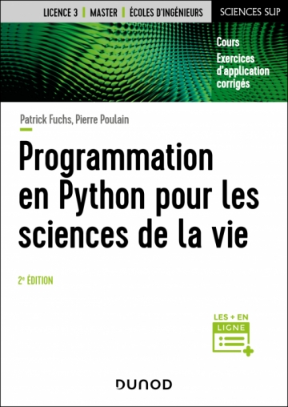

# Avant-propos {.unnumbered}

## Quelques mots sur l'origine de ce cours {.unnumbered}

Ce cours  a été conçu à l'origine pour les étudiants débutants en programmation Python des filières de biologie et de biochimie de l'université Paris Diderot - Paris 7, devenue [Université Paris Cité](https://www.u-paris.fr/) ; et plus spécialement pour les étudiants du master Biologie Informatique.

Ce cours est basé sur la version 3 de Python, version recommandée par la communauté scientifique. Des références à l'ancienne version, Python 2, seront néanmoins régulièrement apportées.

Si vous relevez des erreurs à la lecture de ce document, merci de nous les signaler.

Le cours est disponible en version [HTML](https://python.sdv.univ-paris-diderot.fr/index.html)
et [PDF](https://python.sdv.univ-paris-diderot.fr/cours-python.pdf).

## Remerciements {.unnumbered}

Un grand merci à [Sander](http://sander.nabuurs.org/) du *Centre for Molecular and Biomolecular Informatics* de Nijmegen aux Pays-Bas pour la toute [première version](http://www.cmbi.ru.nl/pythoncourse/spy/index.spy?site=python&action=Home) de ce cours qui remonte à l'année 2003.

Nous remercions le professeur [Philip Guo](http://pgbovine.net/) de l'UC San Diego, pour nous avoir autorisé à utiliser des copies d'écran de son excellent site [*Python Tutor*](http://pythontutor.com/).

Merci également à tous les contributeurs, occasionels ou réguliers :
Jennifer Becq, Virginie Martiny, Romain Laurent, Benoist Laurent, Benjamin Boyer, Hubert Santuz, Catherine Lesourd, Philippe Label, Rémi Cuchillo, Cédric Gageat, Philibert Malbranche, Mikaël Naveau, Amélie Bacle, Alexandra Moine-Franel.

Nous remercions aussi Denis Mestivier de qui nous nous sommes inspirés pour certains exercices.

Enfin, merci à vous tous, les curieux de Python, qui avez été nombreux à nous envoyer des retours sur ce cours, à nous suggérer des améliorations et à nous signaler des coquilles.

De nombreuses personnes nous ont aussi demandé les corrections des exercices. Nous ne les mettons pas sur le site afin d'éviter la tentation de les regarder trop vite, mais vous pouvez nous écrire et nous vous les enverrons.

## Le livre {.unnumbered}

Ce cours est également publié aux éditions Dunod sous le titre « [Programmation en Python pour les sciences de la vie](https://www.dunod.com/sciences-techniques/programmation-en-python-pour-sciences-vie) ». Vous pouvez vous le procurer dans toutes les bonnes librairies.

{ width=30% }

Afin de promouvoir le partage des connaissances et le logiciel libre, nos droits d'auteurs provenant de la vente de cet ouvrage seront reversés à deux associations. [Wikimédia France](https://www.wikimedia.fr/) qui s'occupe notamment de l'encyclopédie libre Wikipédia. [NumFOCUS](https://numfocus.org/) qui soutient le développement de logiciels libres scientifiques et notamment l'écosystème scientifique autour de Python.