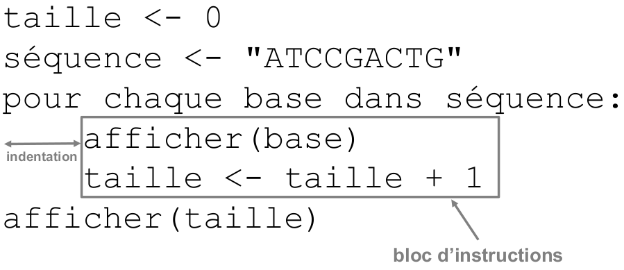

# Introduction

## Qu'est-ce que Python ?

Le langage de programmation Python a été créé en 1989 par Guido van Rossum, aux Pays-Bas. Le nom *Python* vient d'un hommage à la série télévisée *Monty Python's Flying Circus* dont G. van Rossum est fan. La première version publique de ce langage a été publiée en 1991.

La dernière version de Python est la version 3. Plus précisément, la version 3.11 a été publiée en octobre 2022. La version 2 de Python est obsolète et n'est plus maintenue, évitez de l'utiliser.

La [*Python Software Foundation*](https://www.python.org/psf/) est l'association qui organise le développement de Python et anime la communauté de développeurs et d'utilisateurs.

Ce langage de programmation \index{langage de programmation} présente de nombreuses caractéristiques intéressantes :

- Il est multiplateforme. C'est-à-dire qu'il fonctionne sur de nombreux systèmes d'exploitation : Windows, Mac OS X, Linux, Android, iOS, depuis les mini-ordinateurs Raspberry Pi jusqu'aux supercalculateurs.
- Il est gratuit. Vous pouvez l'installer sur autant d'ordinateurs que vous voulez (même sur votre téléphone !).
- C'est un langage de haut niveau. Il demande relativement peu de connaissance sur le fonctionnement d'un ordinateur pour être utilisé.
- C'est un langage interprété. Un script Python n'a pas besoin d'être compilé pour être exécuté, contrairement à des langages comme le C ou le C++.
- Il est orienté objet. C'est-à-dire qu'il est possible de concevoir en Python des entités qui miment celles du monde réel (une cellule, une protéine, un atome, etc.) avec un certain nombre de règles de fonctionnement et d'interactions.
- Il est relativement *simple* à prendre en main[^footnote].
- Enfin, il est très utilisé en bioinformatique et plus généralement en analyse de données.

[^footnote]: Nous sommes d'accord, cette notion est très relative.

Toutes ces caractéristiques font que Python est désormais enseigné dans de nombreuses formations, du lycée à l'enseignement supérieur.


## Conseils pour installer et configurer Python

Pour apprendre la programmation Python, il va falloir que vous pratiquiez et pour cela il est préférable que Python soit installé sur votre ordinateur. La bonne nouvelle est que vous pouvez installer gratuitement Python sur votre machine, que ce soit sous Windows, Mac OS X ou Linux. Nous donnons dans cette rubrique un résumé des points importants concernant cette installation. Tous les détails et la marche à suivre pas-à-pas sont donnés à l'adresse <https://python.sdv.u-paris.fr/livre-dunod>.


### Python 2 ou Python 3 ?

Ce cours est basé sur la **version 3 de Python**, qui est désormais le standard.

Si, néanmoins, vous deviez un jour travailler sur un ancien programme écrit en Python~2, sachez qu'il existe quelques différences importantes entre Python 2 et Python 3. Le chapitre 26 *Remarques complémentaires* (en ligne) vous apportera plus de précisions.


### Miniconda

Nous vous conseillons d'installer [Miniconda](https://conda.io/miniconda.html) \index{Miniconda}, 
logiciel gratuit, disponible pour Windows, Mac OS X et Linux, et qui installera pour vous Python 3.

Avec le gestionnaire de paquets *conda*, fourni avec Miniconda, vous pourrez installer des modules supplémentaires qui sont très utiles en bioinformatique (*NumPy*, *scipy*, *matplotlib*, *pandas*, *Biopython*), mais également Jupyter Lab qui vous permettra d'éditer des *notebooks* Jupyter. Vous trouverez en [ligne](https://python.sdv.u-paris.fr/livre-dunod) une documentation pas-à-pas pour installer Miniconda, Python 3 et les modules supplémentaires qui seront utilisés dans ce cours.


### Éditeur de texte

L'apprentissage d'un langage informatique comme Python va nécessiter d'écrire des lignes de codes à l'aide d'un éditeur de texte. Si vous êtes débutants, on vous conseille d'utiliser *notepad++* sous Windows, *BBEdit* ou *CotEditor* sous Mac OS X et *gedit* sous Linux. La configuration de ces éditeurs de texte est détaillée dans la rubrique *Installation de Python* disponible en ligne. Bien sûr, si vous préférez d'autres éditeurs comme *Visual Studio Code*, *Sublime Text*, *emacs*, *vim*, *geany*... utilisez-les !

À toute fin utile, on rappelle que les logiciels *Microsoft Word*, *WordPad* et *LibreOffice Writer* ne sont pas des éditeurs de texte, ce sont des traitements de texte qui ne peuvent pas et ne doivent pas être utilisés pour écrire du code informatique.


## Notations utilisées

Dans cet ouvrage, les commandes, les instructions Python, les résultats et les contenus de fichiers
sont indiqués avec `cette police` pour les éléments ponctuels ou

```python
sous cette forme,
sur plusieurs lignes,
pour les éléments les plus longs.
```

Pour ces derniers, le numéro à gauche indique le numéro de la ligne et sera utilisé
pour faire référence à une instruction particulière. Ce numéro n'est bien sûr là qu'à titre indicatif.

Par ailleurs, dans le cas de programmes, de contenus de fichiers ou de résultats trop longs pour être inclus dans leur intégralité, la notation `[...]` indique une coupure arbitraire de plusieurs caractères ou lignes.


## Introduction au *shell*

Un *shell* est un interpréteur de commandes interactif permettant d'interagir avec l'ordinateur. On utilisera le *shell* pour lancer l'interpréteur Python.

Pour approfondir la notion de *shell*, vous pouvez consulter les pages Wikipedia :

- du [*shell* Unix](https://fr.wikipedia.org/wiki/Shell_Unix) fonctionnant sous Mac OS X et Linux ;
- du [*shell* PowerShell](https://fr.wikipedia.org/wiki/Windows_PowerShell) fonctionnant sous Windows.

Un *shell* possède toujours une invite de commande, c'est-à-dire un message qui s'affiche avant l'endroit où on entre des commandes. Dans tout cet ouvrage, cette invite est représentée par convention par le symbole dollar `$` (qui n'a rien à avoir ici avec la monnaie), et ce quel que soit le système d'exploitation.

Par exemple, si on vous demande de lancer l'instruction suivante :  

`$ python`

il faudra taper seulement `python` sans le `$` ni l'espace après le `$`.


## Premier contact avec Python

Python est un langage interprété, c'est-à-dire que chaque ligne de code est lue puis interprétée afin d'être exécutée par l'ordinateur. Pour vous en rendre compte, ouvrez un *shell* puis lancez la commande :

`python`

La commande précédente va lancer l'**interpréteur Python**. Vous devriez obtenir quelque chose de ce style pour Windows :

```text
PS C:\Users\pierre>python
Python 3.12.2 | packaged by Anaconda, Inc. | (main, Feb 27 2024, 17:28:07) [MSC v.1916 64 bit (AMD64)] on win32
Type "help", "copyright", "credits" or "license" for more information.
>>>
```

pour Mac OS X :

```text
iMac-de-pierre:Downloads$ python
Python 3.7.1 (default, Dec 14 2018, 19:28:38)
[Clang 4.0.1 (tags/RELEASE_401/final)] :: Anaconda, Inc. on darwin
Type "help", "copyright", "credits" or "license" for more information.
>>>
```

ou pour Linux :

```text
pierre@jeera:~$ python
Python 3.12.1 | packaged by conda-forge | (main, Dec 23 2023, 08:03:24) [GCC 12.3.0] on linux
Type "help", "copyright", "credits" or "license" for more information.
>>>
```

Les blocs

- `PS C:\Users\pierre>` pour Windows,
- `iMac-de-pierre:Downloads$` pour Mac OS X,
- `pierre@jeera:~$` pour Linux.

représentent l'invite de commande de votre *shell*. Par la suite, cette invite de commande sera représentée simplement par le caractère `$`, que vous soyez sous Windows, Mac OS X ou Linux.

Le triple chevron `>>>` est l'invite de commande (*prompt* en anglais) de l'interpréteur Python. Ici, Python attend une commande que vous devez saisir au clavier.
Tapez par exemple l'instruction :

`print("Hello world!")`

puis validez cette commande en appuyant sur la touche *Entrée*.

Python a exécuté la commande directement et a affiché le texte `Hello world!`. Il attend ensuite une nouvelle instruction en affichant l'invite de l'interpréteur Python (`>>>`). En résumé, voici ce qui a dû apparaître sur votre écran :

```python
>>> print("Hello world!")
Hello world!
>>>
```

Vous pouvez refaire un nouvel essai en vous servant cette fois de l'interpréteur comme d'une calculatrice :

```python
>>> 1+1
2
>>> 6*3
18
```

À ce stade, vous pouvez entrer une autre commande ou bien quitter l'interpréteur Python, soit en tapant la commande `exit()` puis en validant en appuyant sur la touche *Entrée*, soit en pressant simultanément les touches *Ctrl* et *D* sous Linux et Mac OS X ou *Ctrl* et *Z* puis *Entrée* sous Windows.

En résumant, l'interpréteur fonctionne sur le modèle :

```python
>>> instruction python
résultat
```

où le triple chevron correspond à l'entrée (*input*) que l'utilisateur tape au clavier, et l'absence de chevron en début de ligne correspond à la sortie (*output*) générée par Python. Une exception se présente toutefois : lorsqu'on a une longue ligne de code, on peut la couper en deux avec le caractère `\` (*backslash*) pour des raisons de lisibilité :

```python
>>> Voici une longue ligne de code \
... décrite sur deux lignes
résultat
```

En ligne 1 on a rentré la première partie de la ligne de code. On termine par un `\`, ainsi Python sait que la ligne de code n'est pas finie. L'interpréteur nous l'indique avec les trois points `...`. En ligne 2, on rentre la fin de la ligne de code puis on appuie sur *Entrée*. À ce moment, Python nous génère le résultat. Si la ligne de code est vraiment très longue, il est même possible de la découper en trois voire plus :

```python
>>> Voici une ligne de code qui \
... est vraiment très longue car \
... elle est découpée sur trois lignes
résultat
```

L'interpréteur Python est donc un système interactif dans lequel vous pouvez entrer des commandes, que Python exécutera sous vos yeux (au moment où vous validerez la commande en appuyant sur la touche *Entrée*).

Il existe de nombreux autres langages interprétés comme [Perl](http://www.perl.org) ou [R](http://www.r-project.org). Le gros avantage de ce type de langage est qu'on peut immédiatement tester une commande à l'aide de l'interpréteur, ce qui est très utile pour débugger (c'est-à-dire trouver et corriger les éventuelles erreurs d'un programme). Gardez bien en mémoire cette propriété de Python qui pourra parfois vous faire gagner un temps précieux !


## Premier programme

Bien sûr, l'interpréteur présente vite des limites dès lors que l'on veut exécuter une suite d'instructions plus complexe. Comme tout langage informatique, on peut enregistrer ces instructions dans un fichier, que l'on appelle communément un script (ou programme) Python.

Pour reprendre l'exemple précédent, ouvrez un éditeur de texte (pour choisir et configurer un éditeur de texte, reportez-vous si nécessaire à la rubrique *Installation de Python* en [ligne](https://python.sdv.u-paris.fr/livre-dunod)) et entrez le code suivant :

`print("Hello world!")`

Ensuite, enregistrez votre fichier sous le nom `test.py`, puis quittez l'éditeur de texte.

open-box-rem

L'extension de fichier standard des scripts Python est `.py`.

close-box-rem

Pour exécuter votre script, ouvrez un *shell*  et entrez la commande :  
`python test.py`

Vous devriez obtenir un résultat similaire à ceci :

```bash
$ python test.py
Hello world!
```

Si c'est bien le cas, bravo ! Vous avez exécuté votre premier programme Python.


## Commentaires

Dans un script, tout ce qui suit le caractère `#` est ignoré par Python
jusqu'à la fin de la ligne et est considéré comme un commentaire.

Les commentaires doivent expliquer votre code dans un langage humain.
L'utilisation des commentaires est rediscutée dans le chapitre 16 *Bonnes pratiques en programmation Python*.

Voici un exemple :

```python
# Votre premier commentaire en  Python.
print("Hello world!")

# D'autres commandes plus utiles pourraient suivre.
```

open-box-rem

On appelle souvent à tort le caractère `#` « dièse ». On devrait plutôt parler de « [croisillon](https://fr.wikipedia.org/wiki/Croisillon_(signe))~».

close-box-rem


## Notion de bloc d'instructions et d'indentation

En programmation, il est courant de répéter un certain nombre de choses (avec les boucles, voir le chapitre 5 *Boucles et comparaisons*) ou d'exécuter plusieurs instructions si une condition est vraie (avec les tests, voir le chapitre 6 *Tests*).

Par exemple, imaginons que nous souhaitions afficher chacune des bases d'une séquence d'ADN, les compter puis afficher le nombre total de bases à la fin. Nous pourrions utiliser l'algorithme présenté en pseudo-code dans la figure @fig:indentation_bloc_instructions.

{ #fig:indentation_bloc_instructions width=70% }

Pour chaque base de la séquence ATCCGACTG, nous souhaitons effectuer deux actions : d'abord afficher la base puis compter une base de plus. Pour indiquer cela, on décalera vers la droite ces deux instructions par rapport à la ligne précédente (`pour chaque base [...]`). Ce décalage est appelé **indentation**, et l'ensemble des lignes indentées constitue un **bloc d'instructions**.

Une fois qu'on aura réalisé ces deux actions sur chaque base, on pourra passer à la suite, c'est-à-dire afficher la taille de la séquence. Pour bien préciser que cet affichage se fait à la fin, donc une fois l'affichage puis le comptage de chaque base terminés, la ligne correspondante n'est pas indentée (c'est-à-dire qu'elle n'est pas décalée vers la droite).

Pratiquement, l'indentation en Python doit être homogène (soit des espaces, soit des tabulations, mais pas un mélange des deux). Une indentation avec 4 espaces est le style d'indentation recommandé (voir le chapitre 16 *Bonnes pratiques en programmation Python*).

Si tout cela semble un peu complexe, ne vous inquiétez pas. Vous allez comprendre tous ces détails chapitre après chapitre.


## Autres ressources

Pour compléter votre apprentissage de Python, n'hésitez pas à consulter d'autres ressources complémentaires à cet ouvrage. D'autres auteurs abordent l'apprentissage de Python d'une autre manière. Nous vous conseillons les ressources suivantes en langue française :  

- Le livre *Apprendre à programmer avec Python 3* de Gérard Swinnen. Cet ouvrage est téléchargeable gratuitement sur le site de [Gérard Swinnen](http://www.inforef.be/swi/python.htm). Les éditions Eyrolles proposent également la version papier de cet ouvrage.
- Le livre *Apprendre à programmer en Python avec PyZo et Jupyter Notebook* de Bob Cordeau et Laurent Pointal, publié aux éditions Dunod. Une partie de cet ouvrage est téléchargeable gratuitement sur le site de [Laurent Pointal](https://perso.limsi.fr/pointal/python:courspython3).
- Le livre *Apprenez à programmer en Python* de [Vincent Legoff](https://openclassrooms.com/fr/courses/235344-apprenez-a-programmer-en-python) que vous trouverez sur le site *Openclassroms*.

Et pour terminer, une ressource incontournable en langue anglaise :  

- Le site [www.python.org](http://www.python.org). Il contient énormément d'informations et de liens sur Python. La page d'[index des modules](https://docs.python.org/fr/3/py-modindex.html) est particulièrement utile (et traduite en français).
