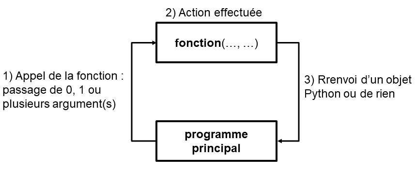
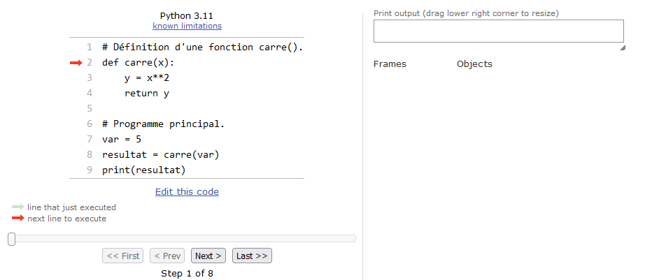
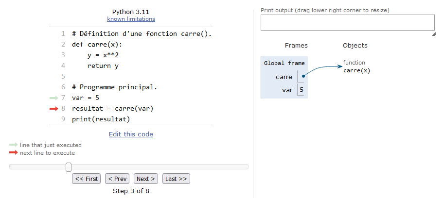
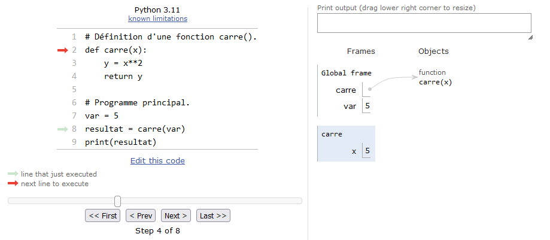
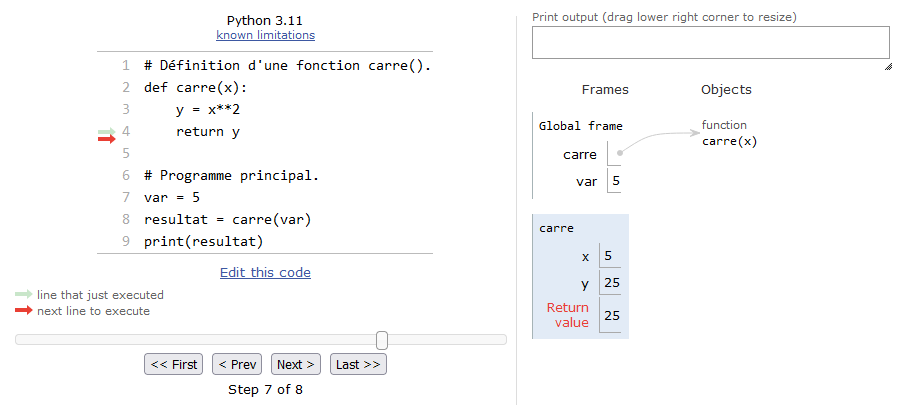
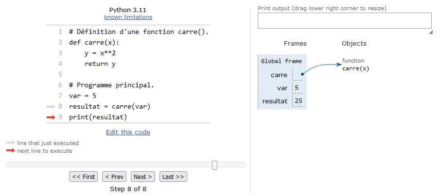
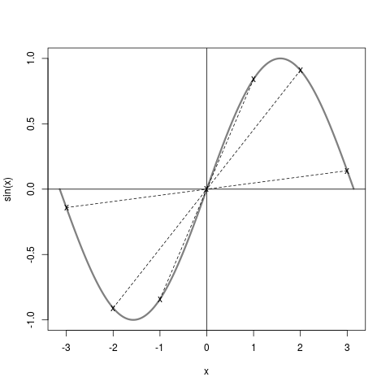

# Fonctions

## Principe et généralités

En programmation, les **fonctions** sont très utiles pour réaliser plusieurs fois la même opération au sein d'un programme. Elles permettent également de rendre le code plus lisible et plus clair en le fractionnant en blocs logiques.

Vous connaissez déjà certaines fonctions Python, par exemple `math.cos(angle)` du module `math` renvoie le cosinus de la variable `angle` exprimé en radian. Vous connaissez aussi des fonctions internes à Python comme `range()` ou `len()`. Pour l'instant, une fonction est à vos yeux une sorte de *boîte noire* (cf Figure @fig:schema_fonction) :

1. À laquelle vous passez zero, une ou plusieurs variable(s) entre parenthèses. Ces variables sont encore appelées arguments. Il peut s'agir de n'importe quel type d'objet Python.
2. Qui effectue une action.
3. Et qui renvoie un objet Python ou rien du tout.

{ #fig:schema_fonction width=60% }

Par exemple si vous appelez la fonction `len()` de la manière suivante :
```
>>> len([0, 1, 2])
3
```
dans l'ordre : (1) vous l'appelez en lui passant une liste en argument, (2) la fonction calcule la longueur de cette liste, (3) elle vous renvoie un entier égal à cette longueur.

Autre exemple, si vous appelez la méthode `liste.append(5)` (n'oubliez pas, une **méthode** est une **fonction** qui agit en général sur l'objet auquel elle est attachée par un point) : (1) vous passez l'entier 5 en argument, (2) la méthode `append()` ajoute l'entier `5` à l'objet `liste`, et (3) elle ne renvoie rien.

Au contraire, aux yeux du programmeur une fonction est une portion de code effectuant une suite d'instructions bien particulière. Avant de démarrer sur la syntaxe, revenons sur cette notion de *boîte noire* :

- Une fonction effectue une tâche. Pour cela, elle reçoit éventuellement des arguments et renvoie éventuellement un résultat. L'algorithme utilisé au sein de la fonction n'intéresse pas directement l'utilisateur. Par exemple, il est inutile de savoir comment la fonction `math.cos()` calcule un cosinus, on a juste besoin de savoir qu'il faut lui passer en argument un angle en radian et qu'elle renvoie le cosinus de cet angle. Ce qui se passe à l'intérieur de la fonction ne regarde que le programmeur (c'est-à-dire vous dans ce chapitre).

- Chaque fonction effectue en général une tâche **unique et précise**. Si cela se complique, il est plus judicieux d'écrire plusieurs fonctions (qui peuvent éventuellement s'appeler les unes les autres). Cette **modularité** améliore la qualité générale et la lisibilité du code. Vous verrez qu'en Python, les fonctions présentent une grande flexibilité.

Pour finir sur les généralités, vous avez vu dans la Figure @fig:schema_fonction que nous avons utilisé le terme **programme principal** (*main* en anglais) pour désigner l'endroit depuis lequel on appelle une fonction (on verra plus tard que l'on peut en fait appeler une fonction de n'importe où). Le programme principal désigne le code qui est exécuté lorsqu'on lance le script Python, c'est à dire toute la suite d'instructions qui commencent à la colonne 1 du script, autrement dit toutes les instructions en dehors des fonctions. En général, dans un script Python, on écrit d'abord les fonctions puis le programme principal (donc celui-ci se situe à la fin du script). Nous aurons l'occasion de revenir sur cette notion de programme principal dans la section 9.4 de ce chapitre ainsi que dans le chapitre 12.

## Définition

Pour définir une fonction, Python utilise le mot-clé `def` et si on veut que celle-ci renvoie une valeur, il faut utiliser le mot-clé `return`. Par exemple :
```
>>> def carre(x):
...     return x**2
...
>>> print(carre(2))
4
```
Notez que la syntaxe de `def` utilise les `:` comme les boucles `for` et `while` ainsi que les tests `if`, un bloc d’instructions est donc attendu. De même que pour les boucles et les tests, l'**indentation** de ce bloc d'instructions (*i.e.* le corps de la fonction) est **obligatoire**.

Dans l'exemple précédent, nous avons passé un argument à la fonction `carre()` qui nous a retourné ou renvoyé une valeur que nous avons affichée à l'écran. Que veut dire valeur retournée ou renvoyée ? Et bien cela signifie que cette dernière est stockable dans une variable :
```
>>> res = carre(2)
>>> print(res)
4
```
Ici, le résultat renvoyé par la fonction est stocké dans la variable `res`.
Notez qu'une fonction ne prend pas forcément un argument et ne renvoie pas forcément une valeur, par exemple :
```
>>> def hello():
...     print("bonjour")
...
>>> hello()
bonjour
```
Dans ce cas la fonction `hello()` se contente d'imprimer la chaîne de caractères `"bonjour"` à l'écran. Elle ne prend aucun argument et ne renvoie aucun résultat. Par conséquent, cela n'a pas de sens de vouloir récupérer dans une variable le résultat renvoyé par une telle fonction. Si on essaie tout de même, Python affecte la valeur `None` qui signifie *rien* en anglais:
```
>>> var = hello()
bonjour
>>> print(var)
None
```
Ceci n'est pas une faute car Python n'émet pas d'erreur, toutefois cela ne présente, la plupart du temps, guère d'intérêt.


## Passage d'arguments

Le nombre d'argument(s) que l'on peut passer à une fonction est variable. Nous avons vu ci-dessus des fonctions auxquelles on passait 0 ou 1 argument. Dans les chapitres précédents, vous avez vu des fonctions internes à Python qui prenaient au moins 2 arguments, pour rappel souvenez-vous de `range(1, 10)` ou encore `range(1, 10, 2)`. Le nombre d'argument est donc laissé libre à l'initiative du programmeur qui est en train de développer une nouvelle fonction.

Une particularité des fonctions en Python est que vous n'êtes pas obligé(e) de préciser le type des arguments que vous lui passez, dès lors que les opérations que vous effectuez avec ces arguments sont valides. Python est en effet connu comme étant un langage au *typage dynamique*, c'est-à-dire qu'il reconnaît pour vous le type des variables au moment de l'exécution, par exemple :
```
>>> def fois(x, y):
...     return x*y
...
>>> fois(2, 3)
6
>>> fois(3.1415, 5.23)
16.430045000000003
>>> fois('to', 2)
'toto'
```

L'opérateur `*` reconnaît plusieurs types (entiers, *floats*, chaînes de caractères), notre fonction est donc capable d'effectuer des tâches différentes ! Même si Python permet cela, méfiez-vous tout de même de cette grande flexibilité qui pourrait mener à des surprises dans vos futurs programmes. En général il est plus judicieux que chaque argument ait un type précis (*int*, *str*, *float*, etc), et pas l'un ou l'autre.

Un énorme avantage en Python est que les fonctions sont capables de renvoyer plusieurs valeurs à la fois, comme dans cette fraction de code :
```
>>> def carre_cube(x):
...     return x**2, x**3
...
>>> carre_cube(2)
(4, 8)
```
En réalité Python ne renvoie qu'un seul objet, mais celui-ci peut être séquentiel, c'est à dire contenir lui même plusieurs objets. Dans notre exemple Python renvoie un objet de type `tuple`, type que nous verrons dans le chapitre 13 (il s'agit d'une sorte de liste avec des propriétés différentes). Notre fonction pourrait tout autant renvoyer une liste :
```
>>> def carre_cube2(x):
...     return [x**2, x**3]
...
>>> carre_cube2(3)
[9, 27]
```
Renvoyer un *tuple* ou une liste de deux arguments (ou plus) est notamment très pratique en conjonction avec l'**affectation multiple**, par exemple :
```
>>> z1, z2 = carre_cube2(3)
>>> z1
9
>>> z2
27
```
Cela permet de récupérer plusieurs valeurs retournées par une fonction et les affecter à des variables différentes à la volée.

## Arguments positionnels et arguments par mot-clé

Jusqu'à maintenant, nous avons systématiquement passé le nombre d'arguments que la fonction attendait. Que se passe-t-il si une fonction attend deux arguments et que nous ne lui en passons qu'un seul ?

```
>>> def fois(x, y):
...     return x*y
...
>>> fois(2, 3)
6
>>> fois(2)
Traceback (most recent call last):
  File "<stdin>", line 1, in <module>
TypeError: fois() missing 1 required positional argument: 'y'
```

On voit que passer un seul argument à une fonction qui en attend deux mène à une erreur.

open-box-def

Lorsqu'on définit une fonction `def fct(x, y):` les arguments `x` et `y` sont appelés **arguments positionnels** (en anglais *positional arguments*). Il est strictement obligatoire de les préciser lors de l'appel de la fonction. De plus, il est strictement nécessaire de respecter le même ordre lors de l'appel que dans la définition de la fonction. Dans l'exemple ci-dessus, `2` correspondra à `x`, `3` correspondra à `y`. Finalement, tout dépendra de leur position, d'où leur qualification de positionnel.

close-box-def

De plus en plus fort, il est possible de passer un ou plusieurs argument(s) de manière facultative et de leur attribuer une valeur par défaut :

```
>>> def fct(x=1):
...     return x
...
>>> fct()
1
>>> fct(10)
10
```

open-box-def

Un argument défini avec une syntaxe `def fct(arg=val):` est appelé **argument par mot-clé** (en anglais *keyword argument*). Le passage d'un tel argument lors de l'appel de la fonction est facultatif. Ce type d'argument ne doit pas être confondu avec les arguments positionnels vus ci-dessus, dont la syntaxe est `def fct(arg):`.

close-box-def

Il est bien-sûr possible de passer plusieurs arguments par mot-clé :

```
>>> def fct(x=0, y=0, z=0):
...     return x, y, z
...
>>> fct()
(0, 0, 0)
>>> fct(10)
(10, 0, 0)
>>> fct(10, 8)
(10, 8, 0)
>>> fct(10, 8, 3)
(10, 8, 3)
```

On voit que pour l'instant, les arguments par mot-clé sont pris dans l'ordre dans lesquels on les passe lors de l'appel. Comment pourrions-nous faire si on souhaitait préciser l'argument par mot-clé `z`, et garder les valeurs de `x` et `y` par défaut ? La réponse est très simple, il suffit de préciser le nom de l'argument lors de l'appel :

```
>>> fct(z=10)
(0, 0, 10)
```

Python permet même de rentrer les arguments par mot-clé dans un ordre arbitraire :

```
>>> fct(z=10, x=3, y=80)
(3, 80, 10)
>>> fct(z=10, y=80)
(0, 80, 10)
```

Que se passe-t-il lorsque nous avons un mélange d'arguments positionnels et par mot-clé ? Et bien les arguments positionnels doivent toujours être placés avant les arguments par mot-clé :

```
>>> def fct(a, b, x=0, y=0, z=0):
...     return a, b, x, y, z
...
>>> fct(1, 1)
(1, 1, 0, 0, 0)
>>> fct(1, 1, z=5)
(1, 1, 0, 0, 5)
>>> fct(1, 1, z=5, y=32)
(1, 1, 0, 32, 5)
```

On peut toujours passer les arguments par mot-clé dans un ordre arbitraire à partir du moment où on précise leur nom. Par contre, si les deux arguments positionnels `a` et `b` ne sont pas passés à la fonction, Python renvoie une erreur.

```
>>> fct(z=0)
Traceback (most recent call last):
  File "<stdin>", line 1, in <module>
TypeError: fct() missing 2 required positional arguments: 'a' and 'b'
```

open-box-adv

Préciser le nom des arguments par mot-clé lors de l'appel d'une fonction est une pratique que nous vous recommandons. Cela permet de les distinguer clairement des arguments positionnels.

close-box-adv

L'utilisation d'arguments par mot-clé est très classique en Python. Elle permet de de modifier le comportement par défaut de nombreuses fonctions. Par exemple, si on souhaite que la fonction `print()` n'affiche pas un retour à la ligne supplémentaire, on peut utiliser l'argument *end* : `print("Message ", end="")`. Nous verrons, dans le chapitre 20 *Tkinter*, que l'utilisation d'arguments par mot-clé est systématique lorsqu'on crée un objet graphique (une fenêtre, un boutton, etc).


## Variables locales et variables globales

Lorsqu'on manipule les fonctions il est essentiel de bien comprendre comment se comportent les variables. Une variable est dite *locale* lorsqu'elle est créée dans une fonction, car elle n'existera et ne sera visible que lors de l'exécution de ladite fonction. Une variable est dite *globale* lorsqu'elle est créée dans le programme principal; elle sera visible partout dans le programme.

Ceci ne vous parait pas clair ? Nous allons suivre un exemple simple illustrant notre propos et qui vous permettra de saisir aisément ces concepts. Regardez le code suivant :
```
# définition d'une fonction carre()
def carre(x):
    y = x**2
    return y

# programme principal
z = 5
resultat = carre(z)
print(resultat)
```
Pour la suite nous allons utiliser l'excellent site [Python Tutor](http://www.pythontutor.com) qui permet de visualiser l'état des variables au fur et à mesure de l'exécution d'un code Python (avant de continuer nous vous conseillons de prendre 5 minutes pour tester ce site). Regardons maintenant ce qui se passe dans le code ci-dessus, étape par étape :

- Étape 1 : Python est prêt à lire la première ligne de code.

{ #fig:fct_step1 width=80% }
\


- Étape 2 : Python met en mémoire la fonction `carre()` (notez qu'il ne l'exécute pas !). La fonction est mise dans un espace de la mémoire nommé *global frame*, il s'agit de l'espace du programme principal. Y seront stockées toutes les variables *globales* créées dans le programme. Python est maintenant prêt à exécuter le programme principal.

{ #fig:fct_step2 width=80% }
\


- Étape 3 : Python lit et met en mémoire la variable `z`. Celle-ci étant créée dans le programme principal, il s'agira d'une variable *globale*. Ainsi, elle sera également stockée dans le *global frame*.

{ #fig:fct_step3 width=80% }
\


- Étape 4 : La fonction `carre()` est appelée et on lui passe en argument l'entier `z`. La fonction rentre alors en exécution et un nouveau cadre bleu est créé dans lequel *Python Tutor* va nous indiquer toutes les variables *locales* à la fonction. Notez bien que la variable passée en argument, qui s'appelle `x` dans la fonction, est créée en tant que variable *locale*. On pourra aussi remarquer que les variables *globales* situées dans le *global frame* sont toujours là.

{ #fig:fct_step4 width=80% }
\


- Étape 5 : Python est maintenant prêt à exécuter chaque ligne de code de la fonction.

{ #fig:fct_step5 width=80% }
\


- Étape 6 : La variable `y` est créée dans la fonction. Celle-ci est donc stockée en tant que variable *locale* à la fonction.

{ #fig:fct_step6 width=80% }
\


- Étape 7 : Python s'apprête à retourner la variable *locale* `y` au programme principal (*Python Tutor* nous indique le contenu de la valeur retournée).

{ #fig:fct_step7 width=80% }
\


- Étape 8 : Python quitte la fonction et la valeur retournée par celle-ci est affectée à la variable *globale* `resultat`. Notez bien que lorsque Python quitte la fonction, **l'espace des variables allouées à la fonction est détruit**. Ainsi toutes les variables créées dans la fonction n'existent plus. On comprend pourquoi elles portent le nom de *locales* puisqu'elles n'existent que lorsque la fonction est en exécution.

{ #fig:fct_step8 width=80% }
\


- Étape 9 : Python affiche le contenu de la variable `resultat` et l'exécution est terminée.

{ #fig:fct_step9 width=80% }
\


Nous espérons que cet exemple guidé facilitera la compréhension des concepts de variables locales et globales. Cela viendra aussi avec la pratique. Nous irons un peu plus loin sur les fonctions dans le chapitre 12. D'ici là essayez de vous entraîner au maximum avec les fonctions. C'est un concept ardu, mais il est impératif de savoir les maîtriser.

Enfin, comme vous avez vu, *Python Tutor* nous a grandement aidés à comprendre ce qu'il se passait. N'hésitez pas à l'utiliser sur des exemples ponctuels, celui-ci pourra vous aider à comprendre lorsqu'un code ne fait pas ce que vous attendez.

## Exercices

*Conseil* : pour ces exercices, écrivez des scripts dans des fichiers, puis exécutez-les dans un *shell*.


### Fonctions et Python Tutor

Reprenez l'exemple de la section 9.4 à l'aide du site [Python Tutor](http://www.pythontutor.com). Regardez ensuite le code suivant et tentez de prédire sa sortie :
```
def calc_factorielle(n):
    fact = 1
    for i in range(2,n+1):
        fact = fact * i
    return fact

# prog principal
nb = 4
factorielle_nb = calc_factorielle(nb)
print("{}! = {}".format(nb,factorielle_nb))
nb2 = 10
print("{}! = {}".format(nb2,calc_factorielle(nb2)))
```
Testez ensuite cette portion de code avec *Python Tutor* en cherchant à bien comprendre chaque étape. Avez-vous réussi à prédire la sortie correctement ?


### Fonction puissance

La fonction `math.pow(x,y)` permet de calculer $x^y$. Reprogrammer une fonction `calc_puissance(x,y)` qui renvoie $x^y$ en utilisant l'opérateur `**`. Dans le programme principal, calculez et affichez à l'écran $2^i$ avec $i$ variant de 0 à 20. On veut que le résultat soit présenté avec le formatage suivant :
```
2^ 0 =       1
2^ 1 =       2
2^ 2 =       4
[...]
2^20 = 1048576
```

### Fonction pyramide

Reprenez l'exercice du chapitre 5 qui dessine une pyramide. Concevez une fonction `gen_pyramide()` à laquelle vous passez un nombre entier `N` et qui renvoie une pyramide de *N* lignes (i.e. triangle isocèle) sous forme de chaîne de caractères. Le programme principal demandera à l'utilisateur le nombre de lignes souhaitées (pensez à la fonction `input()` !) et affichera la pyramide à l'écran.


### Fonction nombre premier

Reprenez l'exercice du chapitre 6 sur les nombres premiers. Concevez une fonction `is_prime()` qui prend en argument un nombre entier positif *n* (supérieur à 2) et qui renvoie un booléen `True` si *n* est premier, et `False` si *n* n'est pas premier. Déterminez tous les nombres premiers de 2 à 100. On souhaite avoir une sortie comme ça :
```
  2 est premier
  3 est premier
  4 n'est pas premier
[...]
 10 n'est pas premier
[...]
100 n'est pas premier
```


### Fonction complement

Créez une fonction `complement()` qui prend une liste de bases et qui renvoie la séquence complémentaire d'une séquence d'ADN sous forme de liste.

Dans le programme principal, à partir d'une séquence d'ADN

`seq = ['A', 'T', 'C', 'G', 'A', 'T', 'C', 'G', 'A', 'T', 'C', 'G', 'C']`

sur le brin principal, affichez `seq` et sa séquence complémentaire (en utilisant votre fonction `complement()`). On souhaite avoir une sortie comme suit :
```
brin direct         : 5'-XXXXXXXXXXXXX-3'  
brin complémentaire : 3'-XXXXXXXXXXXXX-5'
```

Les notations `5'` et `3'` indiquent le sens de lecture, et les `X` représentent les bases `A`, `T`, `G` ou `C`.

Rappel : la séquence complémentaire s'obtient en remplaçant A par T, T par A, C par G et G par C.


### Fonction distance

Créez une fonction `calc_distance3D()` qui calcule une distance euclidienne en 3 dimensions entre deux atomes. Testez votre fonction sur les 2 points `A(0,0,0)` et `B(1,1,1)`. Trouvez-vous bien $\sqrt{3}$ ?

On rappelle que la distance euclidienne *d* entre deux points A et B de coordonnées cartésiennes respectives $(x_A, y_A, z_A)$ et $(x_B, y_B, z_B)$ se calcule comme suit :

$$
d = \sqrt{(x_B - x_A)^2 + (y_B - y_A)^2 + (z_B - z_A)^2}
$$


### Fonctions distribution et stat

Créez une fonction `gen_distrib()` qui prend comme argument 3 entiers : *debut*, *fin* et *n*. La fonction renverra une liste de *n* *floats* aléatoires entre *debut* et *fin*. Cette liste suivra une distribution uniforme (utilisez pour cela la fonction `uniform()` du module `random`).

Créez une autre fonction `calc_stat()` qui prend en argument une liste de *floats* et qui renvoie une liste de 4 éléments contenant respectivement le minimum, le maximum, la moyenne et la médiane de la liste.

Dans le programme principal, générez 20 listes aléatoires de 100 *floats* compris entre 0 et 100 et afficher les statistiques pour chacune d'entre elles (minimum, maximum, médiane et moyenne).
On souhaite obtenir une sortie comme suit :
```
Liste  1 : min = X.XX ; max = X.XX ; médiane = X.XX ; moyenne = X.XX
[...]
Liste 20 : min = X.XX ; max = X.XX ; médiane = X.XX ; moyenne = X.XX
```
Pour chaque ligne, on affichera les statistiques (min, max, médiane, moyenne), avec deux chiffres après la virgule, associées à chacune des 20 listes.

Les écarts sur les statistiques entre les différentes listes sont-ils importants ? Relancez avec des listes de 1000 éléments, puis 10000 éléments. Les écarts changent-ils quand le nombre d'éléments par liste augmente ?


### Fonction distance à l'origine

En reprenant votre fonction `calc_distance3D()`, faites-en une version 2D (`calc_distance2D()`). Écrivez une autre fonction `calc_dist2ori()` à laquelle vous passez en argument deux listes de *floats* `list_x` et `list_y` représentant les coordonnées en 2D d'une fonction mathématique (par exemple $x$ et $sin(x)$). Cette fonction renverra une liste de *floats* représentant la distance entre chaque point de la fonction et l'origine (de coordonnées $(0,0)$). La Figure @fig:sin2ori montre un exemple sur quelques points de la fonction $sin(x)$ (courbe en rouge) ; chaque trait pointillé représente la distance que l'on cherche entre les points de la courbe (x minuscule), et l'origine du repère (X majuscule). 

{ #fig:sin2ori width=40%}

Votre programme devra générer un fichier `sin2ori.dat` qui contiendra deux colonnes : la première représente les $x$, la deuxième la distance entre chaque point de la fonction $sin(x)$ à l'origine. On souhaite faire ce calcul entre $-\pi$ et $\pi$ par pas de 0.1. Vous pourrez admirer votre résultat avec la commande :

`xmgrace sin2ori.dat`


### Fonction aire sous la courbe (exercice +++)

La [méthode des trapèzes](https://fr.wikipedia.org/wiki/M%C3%A9thode_des_trap%C3%A8zes) permet de calculer numériquement l'intégrale d'une fonction. Elle consiste à évaluer l'aire sous une fonction en évaluant l'aire de trapèzes successifs. On souhaite créer une fonction `calc_aire()` qui prend en argument deux listes de *floats* `list_x` et `list_y` représentant les coordonnées d'une fonction (par exemple $x$ et $sin(x)$) et qui renvoie l'aire sous la courbe. On calculera les intégrales suivantes :

- $\int_{0}^{1} x \, dx$

- $\int_{0}^1 \sqrt{x} \, dx$

- $\int_{-\pi}^{+\pi} sin(x) \,dx$

- $\int_{-\pi}^{+\pi} cos(x) \,dx$
