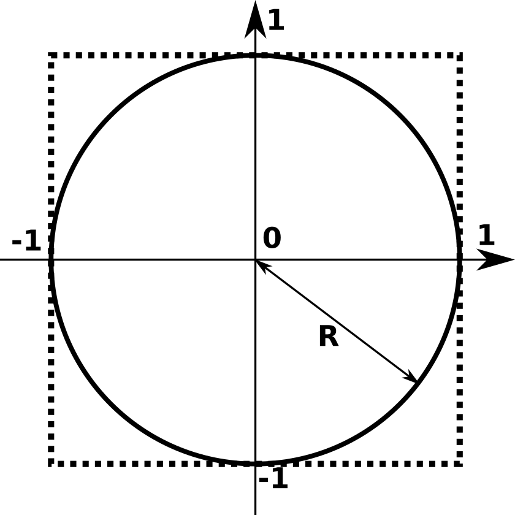

# Modules

## Définition

Les modules sont des programmes Python qui contiennent des fonctions que l'on est amené à souvent réutiliser (on les appelle aussi bibliothèques, ou *libraries* en anglais). Ce sont des « boîtes à outils » qui vous seront très utiles.

Les développeurs de Python ont mis au point de nombreux modules qui effectuent différentes tâches. Pour cette raison, prenez toujours le réflexe de vérifier si une partie du code que vous souhaitez écrire n'existe pas déjà sous forme de module.

La plupart de ces modules sont déjà installés dans les versions standards de Python. Vous pouvez accéder à une [documentation exhaustive](https://docs.python.org/fr/3/py-modindex.html) sur le site de Python. N'hésitez pas à explorer un peu ce site, la quantité de modules disponibles est impressionnante (plus de 300 modules).


## Importation de modules

\index{import (instruction)}

Dans les chapitres précédents, nous avons rencontré la notion de module plusieurs fois, notamment lorsque nous avons voulu tirer un nombre aléatoire :

```python
>>> import random
>>> random.randint(0, 10)
4
```

\index{random@random (module)}

Regardons de plus près cet exemple :

- **Ligne 1**. L'instruction `import` donne accès à toutes les fonctions du module [*random*](https://docs.python.org/fr/3/library/random.html#module-random).
- **Ligne 2**. Nous utilisons la fonction `randint(0, 10)` du module *random*. Cette fonction renvoie un nombre entier tiré aléatoirement entre `0` inclus et `10` inclus.

Nous avons également croisé le module *math* lors de l'exercice sur la spirale (voir le chapitre 7 *Fichiers*). Ce module nous a donné accès aux fonctions trigonométriques sinus et cosinus, et à la constante $\pi$ :

\index{math@math (module)}

```python
>>> import math
>>> math.cos(math.pi / 2)
6.123233995736766e-17
>>> math.sin(math.pi / 2)
1.0
```

En résumé, l'utilisation de la syntaxe `import module` permet d'importer tout une série de fonctions organisées par « thèmes ». Par exemple, les fonctions gérant les nombres aléatoires avec *random* et les fonctions mathématiques avec *math*. Python possède de nombreux autres modules internes (c'est-à-dire présent de base lorsqu'on installe Python).

open-box-rem

Dans le chapitre 3 *Affichage*, nous avons introduit la syntaxe `truc.bidule()` avec `truc` étant un objet et `.bidule()` une méthode. Nous vous avions expliqué qu'une *méthode* était une fonction un peu particulière :

- elle était liée à un objet par un point ;
- en général, elle agissait sur ou utilisait l'objet auquel elle était liée.

Par exemple, la méthode `.append()` vue dans le chapitre 4 *Listes*. Dans l'instruction `liste1.append(3)`, la méthode `.append()` ajoute l'entier `3` à l'objet `liste1` auquel elle est liée.

Avec les modules, nous rencontrons une syntaxe similaire. Par exemple, dans l'instruction `math.cos()`, on pourrait penser que `.cos()` est aussi une méthode. En fait la [documentation officielle de Python](https://docs.python.org/fr/3/tutorial/modules.html) précise bien que dans ce cas `.cos()` est une fonction. Dans cet ouvrage, nous utiliserons ainsi le mot **fonction** lorsqu'on évoquera des fonctions issues de modules.

Si cela vous parait encore ardu, ne vous inquiétez pas : c'est à force de pratiquer et de lire que vous vous approprierez le vocabulaire. La syntaxe `module.fonction()` est là pour rappeler de quel module provient la fonction en un coup d’œil.

close-box-rem

Il existe un autre moyen d'importer une ou plusieurs fonctions d'un module :

```python
>>> from random import randint
>>> randint(0,10)
7
```

\index{from@from (instruction)}

À l'aide du mot-clé `from`, on peut importer une fonction spécifique d'un module donné. Remarquez bien qu'il est inutile de répéter le nom du module dans ce cas : seul le nom de la fonction en question est requis.

On peut également importer toutes les fonctions d'un module :

```python
>>> from random import *
>>> randint(0,50)
46
>>> uniform(0,2.5)
0.64943174760727951
```

L'instruction `from random import *` importe toutes les fonctions du module *random*. On peut utiliser toutes ses fonctions directement, comme par exemple `randint()` et `uniform()` qui renvoient des nombres aléatoires entiers et *floats*.

Dans la pratique, plutôt que de charger toutes les fonctions d'un module en une seule fois :

```python
from random import *
```

Nous vous conseillons de charger le module seul de la manière suivante :

```python
import random
```

puis d'appeler explicitement les fonctions voulues, par exemple :

```python
>>> import random
>>> random.randint(1, 10)
4
>>> random.uniform(1, 3)
1.8645753676306085

```

Il est également possible de définir un alias (un nom plus court) pour un module :

```python
>>> import random as rand
>>> rand.randint(1, 10)
6
>>> rand.uniform(1, 3)
2.643472616544236
```

Dans cet exemple, les fonctions du module *random* sont accessibles via l'alias `rand`.


Enfin, pour vider de la mémoire un module déjà chargé, on peut utiliser l'instruction `del` :

```python
>>> import random
>>> random.randint(0,10)
2
>>> random.uniform(1, 3)
2.825594756352219
>>> del random
>>> random.randint(0,10)
Traceback (most recent call last):
  File "<stdin>", line 1, in ?
NameError: name 'random' is not defined. Did you forget to import 'random'?
```

On constate alors qu'un rappel (ligne 7) d'une fonction du module *random*, après l'avoir vidé de la mémoire (ligne 6), retourne un message d'erreur (lignes 8-10). Dans le cas présent, le message d'erreur est explicite et demande à l'utilisateur s'il n'a pas oublié d'importer le module *random*.


## Obtenir de l'aide sur les modules importés

\index{help@help()}

Pour obtenir de l'aide sur un module, rien de plus simple : il suffit d'utiliser la commande `help()` :

```python
>>> import random
>>> help(random)
[...]
```

Ce qui renvoie :

```text
Help on module random:

NAME
    random - Random variable generators.

MODULE REFERENCE
    https://docs.python.org/3.7/library/random

    The following documentation is automatically generated from the Python
    source files.  It may be incomplete, incorrect or include features that
    are considered implementation detail and may vary between Python
    implementations.  When in doubt, consult the module reference at the
    location listed above.

DESCRIPTION
    integers
    --------
           uniform within range

    sequences
    ---------
           pick random element
           pick random sample
```

open-box-rem

- Pour vous déplacer dans l'aide, utilisez les flèches du haut et du bas pour le parcourir ligne par ligne, ou les touches *Page-up* et *Page-down* pour faire défiler l'aide page par page.
- Pour quitter l'aide, appuyez sur la touche *Q*.
- Pour chercher du texte, tapez le caractère */* puis le texte que vous cherchez, puis la touche *Entrée*. Par exemple, pour chercher l'aide sur la fonction `randint()`, tapez `/randint` puis *Entrée*.
- Vous pouvez également obtenir de l'aide sur une fonction particulière d'un module avec :

    `help(random.randint)`

close-box-rem


La commande `help()` est en fait une commande plus générale, permettant d'avoir de l'aide sur n'importe quel objet chargé en mémoire.

```python
>>> t = [1, 2, 3]
>>> help(t)
Help on list object:

class list(object)
 |  list() -> new list
 |  list(sequence) -> new list initialized from sequence's items
 |  
 |  Methods defined here:
 |  
 |  __add__(...)
 |      x.__add__(y) <==> x+y
 |
 |  
...
```

Enfin, pour connaître d'un seul coup d’œil toutes les méthodes ou variables associées à un objet, utilisez la fonction `dir()` :

\index{dir@dir()}

```python
>>> import random
>>> dir(random)
['BPF', 'LOG4', 'NV_MAGICCONST', 'RECIP_BPF', 'Random', 'SG_MAGICCONST',
'SystemRandom', 'TWOPI', 'WichmannHill', '_BuiltinMethodType', '_MethodT
ype', '__all__', '__builtins__', '__doc__', '__file__', '__name__', '_ac
os', '_ceil', '_cos', '_e', '_exp', '_hexlify', '_inst', '_log', '_pi',
'_random', '_sin', '_sqrt', '_test', '_test_generator', '_urandom', '_wa
rn', 'betavariate', 'choice', 'expovariate', 'gammavariate', 'gauss', 'g
etrandbits', 'getstate', 'jumpahead', 'lognormvariate', 'normalvariate',
 'paretovariate', 'randint', 'random', 'randrange', 'sample', 'seed', 's
 etstate', 'shuffle', 'uniform', 'vonmisesvariate', 'weibullvariate']
>>>
```


## Quelques modules courants

Il existe une série de modules que vous serez probablement amenés à utiliser si vous programmez en Python. En voici une liste non exhaustive (pour la liste complète, reportez-vous à [la page des modules](https://docs.python.org/fr/3/py-modindex.html) sur le site de Python) :

- [*math*](https://docs.python.org/fr/3/library/math.html#module-math) : fonctions et constantes mathématiques de base (sin, cos, exp, pi...).
- [*sys*](https://docs.python.org/fr/3/library/sys.html#module-sys) : interaction avec l'interpréteur Python, notamment pour le passage d'arguments (voir plus bas).
- [*pathlib*](https://docs.python.org/fr/3/library/os.html#module-os) : gestion des fichiers et des répertoires (voir plus bas).
- [*random*](https://docs.python.org/fr/3/library/random.html#module-random) : génération de nombres aléatoires.
- [*time*](https://docs.python.org/fr/3/library/time.html#module-time) : accès à l'heure de l'ordinateur et aux fonctions gérant le temps.
- [*urllib*](https://docs.python.org/fr/3/library/urllib.html#module-urllib) : récupération de données sur internet depuis Python.
- [*Tkinter*](https://docs.python.org/fr/3/library/tkinter.html#module-tkinter) : interface python avec Tk. Création d'objets graphiques (voir chapitre 25 *Fenêtres graphiques et Tkinter* (en ligne)).
- [*re*](https://docs.python.org/fr/3/library/re.html#module-re) : gestion des expressions régulières (voir chapitre 17 *Expressions régulières et parsing*).

Nous vous conseillons d'aller explorer les pages de ces modules pour découvrir toutes leurs potentialités.

Vous verrez dans le chapitre 15 *Création de modules* comment créer votre propre module lorsque vous souhaitez réutiliser souvent vos propres fonctions.

Enfin, notez qu'il existe de nombreux autres modules externes qui ne sont pas installés de base dans Python, mais qui sont très utilisés en bioinformatique et en analyse de données. Par exemple : *NumPy* (manipulations de vecteurs et de matrices), *Biopython* (manipulation de séquences ou de structures de biomolécules), *matplotlib* (représentations graphiques), *pandas* (analyse de données tabulées), etc. Ces modules vous serons présentés dans les chapitres 19 à 22.


## Module *random* : génération de nombres aléatoires

Comme indiqué précédemment, le module [*random*](https://docs.python.org/fr/3/library/random.html#module-random) contient des fonctions pour la génération de nombres aléatoires :

```python
>>> import random
>>> random.randint(0, 10)
4
>>> random.randint(0, 10)
10
>>> random.uniform(0, 10)
6.574743184892878
>>> random.uniform(0, 10)
1.1655547702189106
```

Le module *random* permet aussi de permuter aléatoirement des listes :

```python
>>> x = [1, 2, 3, 4]
>>> random.shuffle(x)
>>> x
[2, 3, 1, 4]
>>> random.shuffle(x)
>>> x
[4, 2, 1, 3]
```

Mais aussi de tirer aléatoirement un élément dans une liste donnée :

```python
>>> bases = ["A", "T", "C", "G"]
>>> random.choice(bases)
'A'
>>> random.choice(bases)
'G'
```

La fonction `choices()` (avec un *s* à la fin) réalise plusieurs tirages aléatoires (avec remise, c'est-à-dire qu'on peut piocher plusieurs fois le même élément) dans une liste donnée. Le nombre de tirages est précisé par le paramètre `k` :

```python
>>> random.choices(bases, k=5)
['G', 'A', 'A', 'T', 'G']
>>> random.choices(bases, k=5)
['A', 'T', 'A', 'A', 'C']
>>> random.choices(bases, k=10)
['C', 'T', 'T', 'T', 'G', 'A', 'C', 'A', 'G', 'G']
```

Si vous exécutez vous-même les exemples précédents, vous devriez obtenir des résultats légèrement différents de ceux indiqués.

Pour des besoins de reproductibilité des analyses en science, on a souvent besoin de retrouver les mêmes résultats même si on utilise des nombres aléatoires. Pour cela, on peut définir ce qu'on appelle la « graine aléatoire ». 

open-box-def

En informatique, la génération de nombres aléatoires est un problème complexe. On utilise plutôt des « [générateurs de nombres pseudo-aléatoires](https://fr.wikipedia.org/wiki/G%C3%A9n%C3%A9rateur_de_nombres_pseudo-al%C3%A9atoires) ». Pour cela, une [graine aléatoire](https://fr.wikipedia.org/wiki/Graine_al%C3%A9atoire) doit être définie. Cette graine est la plupart du temps un nombre entier qu'on passe au générateur : celui-ci va alors produire une **série donnée** de nombres pseudo-aléatoires qui dépendent de cette graine. Si on change la graine, la série de nombres change.

close-box-def

En Python, la graine aléatoire se définit avec la fonction `seed()` :

```python
>>> random.seed(42)
>>> random.randint(0, 10)
1
>>> random.randint(0, 10)
0
>>> random.randint(0, 10)
4
```

Ici, la graine aléatoire est fixée à 42. Si on ne précise pas la graine, par défaut Python utilise la date (plus précisément, il s'agit du nombre de secondes écoulées depuis une date fixe passée). Ainsi, à chaque fois qu'on relance Python, la graine sera différente, car ce nombre de secondes sera différent.

Si vous exécutez ces mêmes lignes de code (depuis l'instruction `random.seed(42)`), il se peut que vous ayez des résultats différents selon la version de Python. Néanmoins, vous devriez systématiquement obtenir les mêmes résultats si vous relancez plusieurs fois de suite ces instructions sur une même machine.


open-box-rem

Quand on utilise des nombres aléatoires, il est fondamental de connaitre la distribution de probablités utilisée par la fonction.

Par exemple, la fonction de base du module *random* est `random.random()`, elle renvoie un *float* aléatoire entre 0 et 1 tiré dans une **distribution uniforme**. Si on tire beaucoup de nombres, on aura la même probabilité d'obtenir tous les nombres possibles entre 0 et 1. La fonction `random.randint()` tire aussi un entier dans une distribution uniforme. La fonction `random.gauss()` tire quant à elle un *float* aléatoire dans une **distribution gaussienne**.

close-box-rem


## Module *sys* : passage d'arguments

\index{sys@sys (module)}

Le module [*sys*](https://docs.python.org/fr/3/library/sys.html#module-sys) contient des fonctions et des variables spécifiques à l'interpréteur Python lui-même. 

Ce module est particulièrement intéressant pour récupérer les arguments passés à un script Python lorsque celui-ci est appelé en ligne de commande.

Dans cet exemple, créons le script suivant que l'on enregistrera sous le nom `test.py ` :

```python
import sys
print(sys.argv)
```

Ensuite, dans un *shell*, exécutons le script `test.py` suivi de plusieurs arguments :

```bash
$ python test.py salut girafe 42
['test.py', 'salut', 'girafe', '42']
```

- **Ligne 1**. Le caractère `$` représente l'invite du *shell*, `test.py` est le nom du script Python, `salut`, `girafe` et `42` sont les arguments passés au script (tous séparés par un espace).
- **Ligne 2**. Le script affiche le contenu de la variable `sys.argv`. Cette variable est une liste qui contient tous les arguments de la ligne de commande, y compris le nom du script Python lui-même qu'on retrouve comme premier élément de cette liste dans `sys.argv[0]`. On peut donc accéder à chacun des différents arguments du script avec `sys.argv[1]`, `sys.argv[2]`, etc.


Toujours dans le module *sys*, la fonction `sys.exit()` est utile pour quitter un script Python. On peut donner un argument à cette fonction (en général une chaîne de caractères) qui sera renvoyé au moment où Python quittera le script. Par exemple, si vous attendez au moins un argument en ligne de commande, vous pouvez renvoyer un message pour indiquer à l'utilisateur ce que le script attend comme argument :

```python
import sys

if len(sys.argv) != 2:
    sys.exit("ERREUR : il faut exactement un argument.")

print(f"Argument vaut : {sys.argv[1]}")
```

Puis on l'exécute sans argument :

```text
$ python test.py
ERREUR : il faut exactement un argument.
```

avec un seul argument :

```text
$ python test.py 42
Argument vaut : 42
```

puis avec plusieurs :

```text
$ python test.py 42 salut
ERREUR : il faut exactement un argument.
```

open-box-rem

On vérifie dans cet exemple que le script possède deux arguments, car le nom du script lui-même compte pour un argument (le tout premier).

L'intérêt de récupérer des arguments passés dans la ligne de commande à l'appel du script est de pouvoir ensuite les utiliser dans le script.

close-box-rem

Voici comme nouvel exemple le script `compte_lignes.py`, qui prend comme argument le nom d'un fichier puis affiche le nombre de lignes qu'il contient.

```python
import sys

if len(sys.argv) != 2:
    sys.exit("ERREUR : il faut exactement un argument.")

nom_fichier = sys.argv[1]
taille = 0
with open(nom_fichier, "r") as f_in:
    taille = len(f_in.readlines())

print(f"{nom_fichier} contient {taille} lignes.")
```

Supposons que dans le même répertoire, nous ayons le fichier `animaux1.txt` dont voici le contenu :

```text
girafe
tigre
singe
souris
```

et le fichier `animaux2.txt` qui contient :

```text
poisson
abeille
chat
```

Utilisons maintenant le script `compte_lignes.py` :

```bash
$ python compte_lignes.py
ERREUR : il faut exactement un argument.
$ python compte_lignes.py animaux1.txt
animaux1.txt contient 4 lignes.
$ python compte_lignes.py animaux2.txt
animaux2.txt contient 3 lignes.
$ python compte_lignes.py animaux1.txt animaux2.txt
ERREUR : il faut exactement un argument.
```

Notre script est donc capable de :

- vérifier si un argument lui est donné et si ce n'est pas le cas d'afficher un message d'erreur ;
- d'ouvrir le fichier dont le nom est fourni en argument, de compter puis d'afficher le nombre de lignes.

Par contre, le script ne vérifie pas si le fichier fourni en argument existe bien :

```bash
$ python compte_lignes.py animaux3.txt
Traceback (most recent call last):
  File "compte_lignes.py", line 8, in <module>
    with open(nom_fichier, "r") as f_in:
         ^^^^^^^^^^^^^^^^^^^^^^
FileNotFoundError: [Errno 2] No such file or directory: 'animaux3.txt'
```

La lecture de la partie suivante va nous permettre d'améliorer notre script `compte_lignes.py`.


## Module *pathlib* : gestion des fichiers et des répertoires

\index{pathlib@pathlib (module)}

Le module [*pathlib*](https://docs.python.org/fr/3/library/pathlib.html) permet de manipuler les fichiers et les répertoires. 

Le plus souvent, on utilise uniquement la classe `Path` du module `pathlib`, qu'on charge de cette manière :

```python
>>> from pathlib import Path
```

La méthode `.exists()` vérifie la présence d'un fichier sur le disque dur :

```python
>>> import sys
>>> from pathlib import Path
>>> if Path("toto.pdb").exists():
...     print("le fichier est présent")
... else:
...     sys.exit("le fichier est absent")
...
le fichier est absent
```

Dans cet exemple, si le fichier n'existe pas sur le disque dur, on quitte le programme avec la fonction `exit()` du module *sys* que nous venons de voir.

La méthode `.cwd()` renvoie le chemin complet du répertoire depuis lequel est lancé Python (*cwd* signifiant *current working directory*) :

```python
>>> from pathlib import Path
>>> Path().cwd()
PosixPath('/home/pierre')
```

On obtient un objet de type `PosixPath` qu'il est possible de transformer si besoin en chaîne de caractères avec la fonction `str()`, que nous avons vu dans le chapitre 2 *Variables* :

```python
>>> str(Path().cwd())
'/home/pierre'
```

Mais l'intérêt de récupérer un objet de type `PosixPath` est qu'on peut ensuite utiliser les méthodes `.name` et `.parent` pour obtenir respectivement le nom du répertoire (sans son chemin complet) et le répertoire parent :

```python
>>> Path().cwd()
PosixPath('/home/pierre')
>>> Path().cwd().name
'pierre'
>>> Path().cwd().parent
PosixPath('/home')
```

Enfin, la méthode `.iterdir()` liste le contenu du répertoire depuis lequel est lancé Python :

```python
>>> list(Path().iterdir())
[PosixPath('demo.py'), PosixPath('tests'), PosixPath('1BTA.pdb')]
```

Tout comme la fonction `range()` (voir le chapitre 4 *Listes*), la méthode `.iterdir()` est un itérateur. La fonction `list()` permet d'obtenir une liste.

Toutefois, il est possible d'itérer très facilement sur le contenu d'un répertoire et de savoir s'il contient des fichiers ou des sous-répertoires : 

```python
>>> for nom in Path().iterdir():
...     if nom.is_file():
...         print(f"{nom} est un fichier")
...     else:
...         print(f"{nom} n'est pas un fichier")
... 
demo.py est un fichier
tests n'est pas un fichier
1BTA.pdb est un fichier
```

La méthode `.is_file()` renvoie `True` si l'objet est un fichier, et `False` si ce n'est pas le cas.

La méthode `.iterdir()` parcourt le contenu d'un répertoire, sans en explorer les éventuels sous-répertoires. Si on souhaite parcourir récursivement un répertoire, on utilise la méthode `.glob()`. Prenons l'arborescence suivante comme exemple :

```text
├── 1BTA.pdb
├── demo.py
└── tests
    ├── results.csv
    ├── script1.py
    └── script2.py
```

Le répertoire courant contient les fichiers `1BTA.pdb` et `demo.py`, ainsi que le répertoire `tests`. Ce dernier contient lui-même les fichiers `results.csv`, `script1.py` et `script2.py`.

On souhaite maintenant lister tous les scripts Python (dont l'extension est `.py`) présents dans le répertoire courant et dans ses sous-répertoires :

```python
>>> for nom in Path().glob("**/*.py"):
...     print(f"{nom}")
... 
demo.py
tests/script1.py
tests/script2.py
```

Dans la chaîne de caractères `"**/*.py"`, `**` recherche tous les sous-répertoires récursivement et `*.py` signifie n'importe quel nom de fichier qui se termine par l'extension `.py`.

Il existe de nombreuse autres méthodes associées à la classe `Path` du module *pathlib*, n'hésitez pas à consulter la [documentation](https://docs.python.org/3/library/pathlib.html).


## Exercices

open-box-adv

Pour les trois premiers exercices, utilisez l'interpréteur Python. Pour les exercices suivants, créez des scripts puis exécutez-les dans un *shell*.

close-box-adv


### Racine carrée

Affichez sur la même ligne les nombres de 10 à 20 (inclus) ainsi que leur racine carrée avec trois décimales. Utilisez pour cela le module *math* avec la fonction `sqrt()`. Exemple :

```text
10 3.162
11 3.317
12 3.464
13 3.606
[...]
```

Consultez pour cela la [documentation](https://docs.python.org/fr/3/library/math.html#math.sqrt) de la fonction `math.sqrt()`.


### Cosinus

Calculez le cosinus de $\pi/2$ en utilisant le module *math* avec la fonction `cos()` et la constante `pi`.

Consultez pour cela la
[documentation](https://docs.python.org/fr/3/library/math.html#math.cos) de la fonction `math.cos()`
et la [documentation](https://docs.python.org/fr/3/library/math.html#math.pi) de la constante `math.pi`.


### Comparaison de *floats*

Montrez que 

$$\sqrt{5 + \sqrt{4 + \sqrt{3}}}$$

est égale à $e$ à 0,001 près.

Montrez ensuite que 

$$\sqrt{7 + \sqrt{6 + \sqrt{5}}}$$

est égale à $\pi$ à 0,0001 près.

open-box-adv

- Jetez un oeil à la rubrique sur la comparaison de *floats* abordée dans le chapitre 6 *Tests*.
- Les constantes $\pi$ et $e$ sont obtenues par `math.pi` et `math.e`.

close-box-adv


### Chemin et contenu du répertoire courant

Affichez le chemin et le contenu du répertoire courant (celui depuis lequel vous avez lancé l'interpréteur Python).

Déterminez également le nombre total de fichiers et de répertoires présents dans le répertoire courant.


### Affichage temporisé

Affichez les nombres de 1 à 10 avec 1 seconde d'intervalle. Utilisez pour cela le module *time* et sa fonction `sleep()`.

Consultez pour cela la [documentation](https://docs.python.org/fr/3/library/time.html#time.sleep) de la fonction `time.sleep()`.


### Séquences aléatoires de chiffres

Générez une séquence aléatoire de six chiffres, ceux-ci étant des entiers tirés entre 1 et 4. Utilisez le module *random* avec la fonction `randint()`.

Consultez pour cela la [documentation](https://docs.python.org/fr/3/library/random.html#random.randint) de la fonction `random.randint()`.


### Compteur de points de jeu de belote

On considère un jeu de belote avec la variante sans-atout, où chaque carte vaut un certain nombre de points quelle que soit sa couleur (trèfle, carreau, coeur, pique). Un dictionnaire permet de mettre la correspondance entre chaque carte et son nombre de points :

```python
# Nombre de points de chaque carte.
# (V = valet, D = dame, R = roi, # d = 10, A = as).
dico_points_sans_atouts = {"7": 0, "8": 0, "9": 0, "V": 2, "D": 3, 
                           "R": 4, "d": 10, "A": 11}
```

Par ailleurs, on peut représenter un jeu de 32 cartes par une liste :

`jeu_cartes = ["7", "8", "9", "d", "V", "D", "R", "A"] * 4`

Créez un programme `belote.py` qui tire huit cartes au hasard sans remise et qui affiche le nombre de points correspondant. Pour cela, vous pouvez utiliser la fonction `random.sample()` et son argument par mot-clé `k`. N'hésitez pas à consulter la [documentation](https://docs.python.org/fr/3/library/random.html#random.sample). On souhaite une sortie de ce style :

```text
$ python belote.py
La main est ['7', 'A', '9', 'A', 'R', 'd', 'V', 'D'].
7 -->  0 points
A --> 11 points
9 -->  0 points
A --> 11 points
R -->  4 points
d --> 10 points
V -->  2 points
D -->  3 points
Le nombre total de points de la main est 41.
```

### Séquences aléatoires d'ADN

Générez une séquence aléatoire d'ADN de 20 bases de deux manières différentes. Utilisez le module *random* avec la fonction `choice()` ou `choices()`.


### Séquences aléatoires d'ADN avec argument

Créez un script `dna_random.py` qui prend comme argument un nombre de bases, construit une séquence aléatoire d'ADN dont la longueur est le nombre de bases fourni en argument, puis affiche cette séquence.

Le script devra vérifier qu'un argument est bien fourni et renvoyer un message d'erreur si ce n'est pas le cas.

open-box-adv

Pour générer la séquence d'ADN, utilisez la fonction `random.choice()` abordée
dans l'exercice précédent.

close-box-adv


### Compteur de lignes

Améliorez le script `compte_lignes.py`, dont le code a été donné précédemment, de façon à ce qu'il renvoie un message d'erreur si le fichier n'existe pas.

Par exemple, si les fichiers `animaux1.txt` et `animaux2.txt` sont bien dans le répertoire courant, mais pas `animaux3.txt` :

```bash
$ python compte_lignes.py animaux1.txt
animaux1.txt contient 4 lignes.
$ python compte_lignes.py animaux2.txt
animaux2.txt contient 3 lignes.
$ python compte_lignes.py animaux3.txt
ERREUR : animaux3.txt n'existe pas.
```


### Détermination du nombre pi par la méthode Monte Carlo (exercice +++)

Soit un cercle de rayon 1 (en trait plein sur la figure @fig:monte-carlo) inscrit dans un carré de côté 2 (en trait pointillé).

{ #fig:monte-carlo width=45% }

Avec $R = 1$, l'aire du carré vaut $(2R)^2$ soit 4 et l'aire du disque délimité par le cercle vaut $\pi R^2$ soit $\pi$.

En choisissant $N$ points aléatoires (à l'aide d'une distribution uniforme) à l'intérieur du carré, la probabilité que ces points se trouvent aussi dans le cercle est :

$$
p = \frac{\mbox{aire du cercle}}{\mbox{aire du carré}} = \frac{\pi}{4}
$$

Soit $n$, le nombre de points effectivement dans le cercle, il vient alors

$$
p = \frac{n}{N} = \frac{\pi}{4},
$$

d'où

$$
\pi = 4 \times \frac{n}{N}.
$$

Déterminez une approximation de $\pi$ par cette méthode. Pour cela, pour $N$ itérations :

1. Choisissez aléatoirement les coordonnées *x* et *y* d'un point entre -1 et 1. Utilisez la fonction `uniform()` du module *random*.
2. Calculez la distance entre le centre du cercle et ce point.
3. Déterminez si cette distance est inférieure au rayon du cercle, c'est-à-dire si le point est dans le cercle ou pas.
4. Si le point est effectivement dans le cercle, incrémentez le compteur *n*.

Finalement calculez le rapport entre *n* et *N* et proposez une estimation de $\pi$. Quelle valeur de $\pi$ obtenez-vous pour 100 itérations ? 1000 itérations ? 10 000 itérations ? Comparez les valeurs obtenues à la valeur de $\pi$ fournie par le module *math*.

On rappelle que la distance *d* entre deux points A et B de coordonnées respectives $(x_A, y_A)$ et $(x_B, y_B)$ se calcule comme :

$$
d = \sqrt{(x_B - x_A)^2 + (y_B - y_A)^2}
$$

Pour vous aider, consultez la [documentation](https://docs.python.org/fr/3/library/random.html#random.uniform) de la fonction `random.uniform()`.
