# Fonctions

## Principe et généralités

En programmation, les **fonctions** sont très utiles pour réaliser plusieurs fois la même opération au sein d'un programme. Elles rendent également le code plus lisible et plus clair en le fractionnant en blocs logiques.

Vous connaissez déjà certaines fonctions Python. Par exemple `math.cos(angle)` du module `math` renvoie le cosinus de la variable `angle` exprimé en radian. Vous connaissez aussi des fonctions internes à Python comme `range()` ou `len()`. Pour l'instant, une fonction est à vos yeux une sorte de « boîte noire » (voir figure @fig:schema_fonction) :

1. À laquelle vous passez aucune, une ou plusieurs variable(s) entre parenthèses. Ces variables sont appelées **arguments**. Il peut s'agir de n'importe quel type d'objet Python.
2. Qui effectue une action.
3. Et qui renvoie un objet Python ou rien du tout.

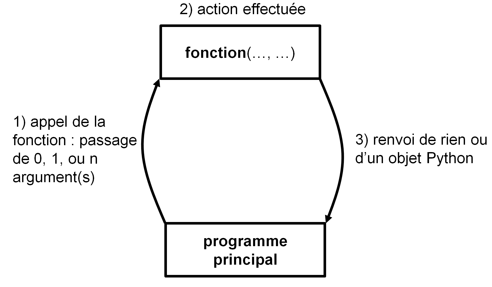{ #fig:schema_fonction width=90% }

Par exemple, si vous appelez la fonction `len()` de la manière suivante :

```python
>>> len([0, 1, 2])
3
```

voici ce qui se passe :

1. vous appelez `len()` en lui passant une liste en argument (ici la liste `[0, 1, 2]`) ;
2. la fonction calcule la longueur de cette liste ;
3. elle vous renvoie un entier égal à cette longueur.

Autre exemple, si vous appelez la méthode `ma_liste.append()` (n'oubliez pas, une **méthode** est une **fonction** qui agit sur l'objet auquel elle est attachée par un point) :

```python
>>> ma_liste.append(5)
```

1. Vous passez l'entier `5` en argument ;
2. la méthode `append()` ajoute l'entier `5` à l'objet `ma_liste` ;
3. et elle ne renvoie rien.

Aux yeux du programmeur au contraire, une fonction est une portion de code effectuant une suite d'instructions bien particulière. Mais avant de vous présenter la syntaxe et la manière de construire une fonction, revenons une dernière fois sur cette notion de « boîte noire » :

- Une fonction effectue une tâche. Pour cela, elle reçoit éventuellement des arguments et renvoie éventuellement quelque chose. L'algorithme utilisé au sein de la fonction n'intéresse pas directement l'utilisateur. Par exemple, il est inutile de savoir comment la fonction `math.cos()` calcule un cosinus. On a juste besoin de savoir qu'il faut lui passer en argument un angle en radian et qu'elle renvoie le cosinus de cet angle. Ce qui se passe à l'intérieur de la fonction ne regarde que le programmeur.

- Chaque fonction effectue en général une tâche **unique et précise**. Si cela se complique, il est plus judicieux d'écrire plusieurs fonctions (qui peuvent éventuellement s'appeler les unes les autres). Cette **modularité** améliore la qualité générale et la lisibilité du code. Vous verrez qu'en Python, les fonctions présentent une grande flexibilité.

Pour finir sur les généralités, nous avons utilisé dans la Figure @fig:schema_fonction le terme **programme principal** (*main* en anglais) pour désigner l'endroit depuis lequel on appelle une fonction (on verra plus tard que l'on peut en fait appeler une fonction de n'importe où). Le programme principal désigne le code qui est exécuté lorsqu'on lance le script Python, c'est-à-dire toute la suite d'instructions en dehors des fonctions. En général, dans un script Python, on écrit d'abord les fonctions puis le programme principal. Nous aurons l'occasion de revenir sur cette notion de programme principal plus tard dans ce chapitre ainsi que dans le chapitre 12 *Plus sur les fonctions*.


## Définition

Pour définir une fonction, Python utilise le mot-clé `def`. Si on souhaite que la fonction renvoie quelque chose, il faut utiliser le mot-clé `return`. Par exemple :

```python
>>> def carre(x):
...     return x**2
...
>>> print(carre(2))
4
```
Notez que la syntaxe de `def` utilise les deux-points comme les boucles `for` et `while` ainsi que les tests `if`, un bloc d’instructions est donc attendu. De même que pour les boucles et les tests, l'**indentation** de ce bloc d'instructions (qu'on appelle le corps de la fonction) est **obligatoire**.

Dans l'exemple précédent, nous avons passé un argument à la fonction `carre()` qui nous a renvoyé (ou retourné) une valeur que nous avons immédiatement affichée à l'écran avec l'instruction `print()`. Que veut dire valeur renvoyée ? Et bien cela signifie que cette dernière est récupérable dans une variable :

```python
>>> res = carre(2)
>>> print(res)
4
```
Ici, le résultat renvoyé par la fonction est stocké dans la variable `res`.
Notez qu'une fonction ne prend pas forcément un argument et ne renvoie pas forcément une valeur, par exemple :

```python
>>> def hello():
...     print("bonjour")
...
>>> hello()
bonjour
```

Dans ce cas la fonction, `hello()` se contente d'afficher la chaîne de caractères `"bonjour"` à l'écran. Elle ne prend aucun argument et ne renvoie rien. Par conséquent, cela n'a pas de sens de vouloir récupérer dans une variable le résultat renvoyé par une telle fonction. Si on essaie tout de même, Python affecte la valeur `None` qui signifie *rien* en anglais:

```python
>>> var = hello()
bonjour
>>> print(var)
None
```

Ceci n'est pas une faute car Python n'émet pas d'erreur, toutefois cela ne présente, la plupart du temps, guère d'intérêt.


## Passage d'arguments

Le nombre d'arguments que l'on peut passer à une fonction est variable. Nous avons vu ci-dessus des fonctions auxquelles on passait 0 ou 1 argument. Dans les chapitres précédents, vous avez rencontré des fonctions internes à Python qui prenaient au moins 2 arguments. Souvenez-vous par exemple de `range(1, 10)` ou encore `range(1, 10, 2)`. Le nombre d'argument est donc laissé libre à l'initiative du programmeur qui développe une nouvelle fonction.

Une particularité des fonctions en Python est que vous n'êtes pas obligé de préciser le type des arguments que vous lui passez, dès lors que les opérations que vous effectuez avec ces arguments sont valides. Python est en effet connu comme étant un langage au « typage dynamique », c'est-à-dire qu'il reconnaît pour vous le type des variables au moment de l'exécution. Par exemple :

```python
>>> def fois(x, y):
...     return x*y
...
>>> fois(2, 3)
6
>>> fois(3.1415, 5.23)
16.430045000000003
>>> fois("to", 2)
'toto'
>>> fois([1,3], 2)
[1, 3, 1, 3]
```

L'opérateur `*` reconnaît plusieurs types (entiers, *floats*, chaînes de caractères, listes). Notre fonction `fois()` est donc capable d'effectuer des tâches différentes ! Même si Python autorise cela, méfiez-vous tout de même de cette grande flexibilité qui pourrait conduire à des surprises dans vos futurs programmes. En général, il est plus judicieux que chaque argument ait un type précis (entiers, *floats*, chaînes de caractères, etc) et pas l'un ou l'autre.


## Renvoi de résultats

Un énorme avantage en Python est que les fonctions sont capables de renvoyer plusieurs objets à la fois, comme dans cette fraction de code :

```python
>>> def carre_cube(x):
...     return x**2, x**3
...
>>> carre_cube(2)
(4, 8)
```

En réalité Python ne renvoie qu'un seul objet, mais celui-ci peut être séquentiel, c'est-à-dire contenir lui même d'autres objets. Dans notre exemple Python renvoie un objet de type `tuple`, type que nous verrons dans le chapitre 13 *Dictionnaires et tuples* (*grosso modo*, il s'agit d'une sorte de liste avec des propriétés différentes). Notre fonction pourrait tout autant renvoyer une liste :

```python
>>> def carre_cube2(x):
...     return [x**2, x**3]
...
>>> carre_cube2(3)
[9, 27]
```

Renvoyer un *tuple* ou une liste de deux éléments (ou plus) est très pratique en conjonction avec l'**affectation multiple**, par exemple :

```python
>>> z1, z2 = carre_cube2(3)
>>> z1
9
>>> z2
27
```

Cela permet de récupérer plusieurs valeurs renvoyées par une fonction et de les affecter à la volée à des variables différentes.


## Arguments positionnels et arguments par mot-clé

Jusqu'à maintenant, nous avons systématiquement passé le nombre d'arguments que la fonction attendait. Que se passe-t-il si une fonction attend deux arguments et que nous ne lui en passons qu'un seul ?

```python
>>> def fois(x, y):
...     return x*y
...
>>> fois(2, 3)
6
>>> fois(2)
Traceback (most recent call last):
  File "<stdin>", line 1, in <module>
TypeError: fois() missing 1 required positional argument: 'y'
```

On constate que passer un seul argument à une fonction qui en attend deux conduit à une erreur.

open-box-def

Lorsqu'on définit une fonction `def fct(x, y):` les arguments `x` et `y` sont appelés **arguments positionnels** (en anglais *positional arguments*). Il est strictement obligatoire de les préciser lors de l'appel de la fonction. De plus, il est nécessaire de respecter le même ordre lors de l'appel que dans la définition de la fonction. Dans l'exemple ci-dessus, `2` correspondra à `x` et `3` correspondra à `y`. Finalement, tout dépendra de leur position, d'où leur qualification de positionnel.

close-box-def

Mais il est aussi possible de passer un ou plusieurs argument(s) de manière facultative et de leur attribuer une valeur par défaut :

```python
>>> def fct(x=1):
...     return x
...
>>> fct()
1
>>> fct(10)
10
```

open-box-def

Un argument défini avec une syntaxe `def fct(arg=val):` est appelé **argument par mot-clé** (en anglais *keyword argument*). Le passage d'un tel argument lors de l'appel de la fonction est facultatif. Ce type d'argument ne doit pas être confondu avec les arguments positionnels présentés ci-dessus, dont la syntaxe est `def fct(arg):`.

close-box-def

Il est bien sûr possible de passer plusieurs arguments par mot-clé :

```python
>>> def fct(x=0, y=0, z=0):
...     return x, y, z
...
>>> fct()
(0, 0, 0)
>>> fct(10)
(10, 0, 0)
>>> fct(10, 8)
(10, 8, 0)
>>> fct(10, 8, 3)
(10, 8, 3)
```

On observe que pour l'instant, les arguments par mot-clé sont pris dans l'ordre dans lesquels on les passe lors de l'appel. Comment pourrions-nous faire si on souhaitait préciser l'argument par mot-clé `z` et garder les valeurs de `x` et `y` par défaut ? Simplement en  précisant le nom de l'argument lors de l'appel :

```python
>>> fct(z=10)
(0, 0, 10)
```

Python permet même de rentrer les arguments par mot-clé dans un ordre arbitraire :

```python
>>> fct(z=10, x=3, y=80)
(3, 80, 10)
>>> fct(z=10, y=80)
(0, 80, 10)
```

Que se passe-t-il lorsque nous avons un mélange d'arguments positionnels et par mot-clé ? Et bien les arguments positionnels doivent toujours être placés avant les arguments par mot-clé :

```python
>>> def fct(a, b, x=0, y=0, z=0):
...     return a, b, x, y, z
...
>>> fct(1, 1)
(1, 1, 0, 0, 0)
>>> fct(1, 1, z=5)
(1, 1, 0, 0, 5)
>>> fct(1, 1, z=5, y=32)
(1, 1, 0, 32, 5)
```

On peut toujours passer les arguments par mot-clé dans un ordre arbitraire à partir du moment où on précise leur nom. Par contre, si les deux arguments positionnels `a` et `b` ne sont pas passés à la fonction, Python renvoie une erreur.

```python
>>> fct(z=0)
Traceback (most recent call last):
  File "<stdin>", line 1, in <module>
TypeError: fct() missing 2 required positional arguments: 'a' and 'b'
```

open-box-adv

Préciser le nom des arguments par mot-clé lors de l'appel d'une fonction est une pratique que nous vous recommandons. Cela les distingue clairement des arguments positionnels.

close-box-adv

L'utilisation d'arguments par mot-clé est habituelle en Python. Elle permet de modifier le comportement par défaut de nombreuses fonctions. Par exemple, si on souhaite que la fonction `print()` n'affiche pas un retour à la ligne, on peut utiliser l'argument `end` :

```python
>>> print("Message ", end="")
Message >>>
```

Nous verrons, dans le chapitre 20 *Fenêtres graphiques et Tkinter*, que l'utilisation d'arguments par mot-clé est systématique lorsqu'on crée un objet graphique (une fenêtre, un bouton, etc.).


## Variables locales et variables globales

Lorsqu'on manipule des fonctions, il est essentiel de bien comprendre comment se comportent les variables. Une variable est dite **locale** lorsqu'elle est créée dans une fonction. Elle n'existera et ne sera visible que lors de l'exécution de ladite fonction.

Une variable est dite **globale** lorsqu'elle est créée dans le programme principal. Elle sera visible partout dans le programme.

Ceci ne vous paraît pas clair ? Nous allons prendre un exemple simple qui vous aidera à mieux saisir ces concepts. Observez le code suivant :

```python
# définition d'une fonction carre()
def carre(x):
    y = x**2
    return y

# programme principal
z = 5
resultat = carre(z)
print(resultat)
```

Pour la suite des explications, nous allons utiliser l'excellent site [*Python Tutor*](http://www.pythontutor.com) qui permet de visualiser l'état des variables au fur et à mesure de l'exécution d'un code Python. Avant de poursuivre, nous vous conseillons de prendre 5 minutes pour tester ce site.

Regardons maintenant ce qui se passe dans le code ci-dessus, étape par étape :

- Étape 1 : Python est prêt à lire la première ligne de code.

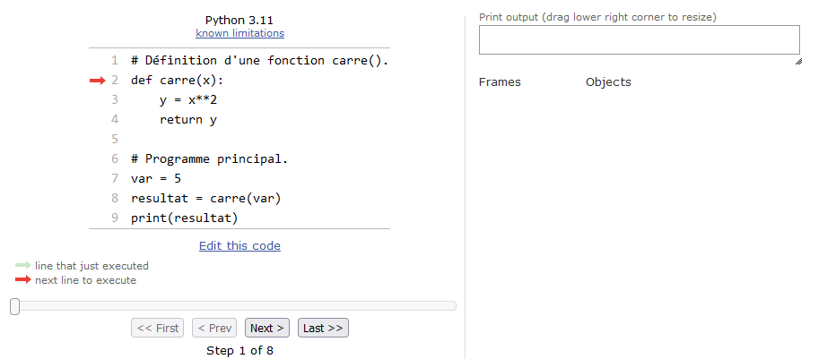{ #fig:fct_step1 width=80% }
\


- Étape 2 : Python met en mémoire la fonction `carre()`. Notez qu'il ne l'exécute pas ! La fonction est mise dans un espace de la mémoire nommé *Global frame*, il s'agit de l'espace du programme principal. Dans cet espace, seront stockées toutes les variables *globales* créées dans le programme. Python est maintenant prêt à exécuter le programme principal.

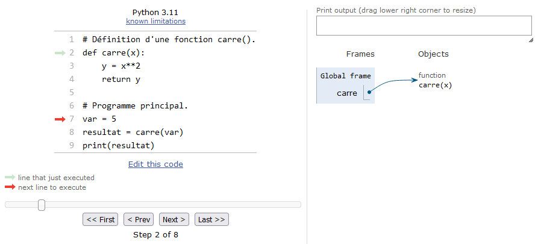{ #fig:fct_step2 width=80% }
\


- Étape 3 : Python lit et met en mémoire la variable `z`. Celle-ci étant créée dans le programme principal, il s'agira d'une variable *globale*. Ainsi, elle sera également stockée dans le *Global frame*.

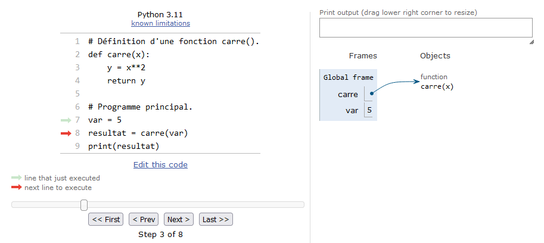{ #fig:fct_step3 width=80% }
\


- Étape 4 : La fonction `carre()` est appelée et on lui passe en argument l'entier `z`. La fonction s'exécute et un nouveau cadre est créé dans lequel *Python Tutor* va indiquer toutes les variables *locales* à la fonction. Notez bien que la variable passée en argument, qui s'appelle `x` dans la fonction, est créée en tant que variable *locale*. On remarquera aussi que les variables *globales* situées dans le *Global frame* sont toujours là.

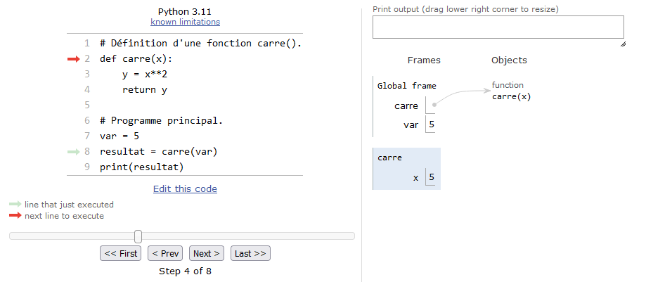{ #fig:fct_step4 width=80% }
\


- Étape 5 : Python est maintenant prêt à exécuter chaque ligne de code de la fonction.

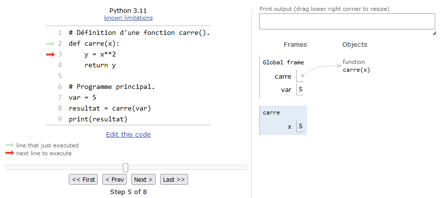{ #fig:fct_step5 width=80% }
\


- Étape 6 : La variable `y` est créée dans la fonction. Celle-ci est donc stockée en tant que variable *locale* à la fonction.

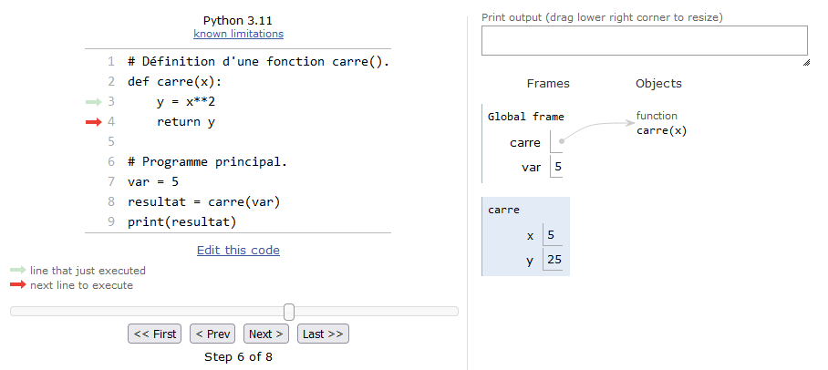{ #fig:fct_step6 width=80% }
\


- Étape 7 : Python s'apprête à renvoyer la variable *locale* `y` au programme principal. *Python Tutor* nous indique le contenu de la valeur renvoyée.

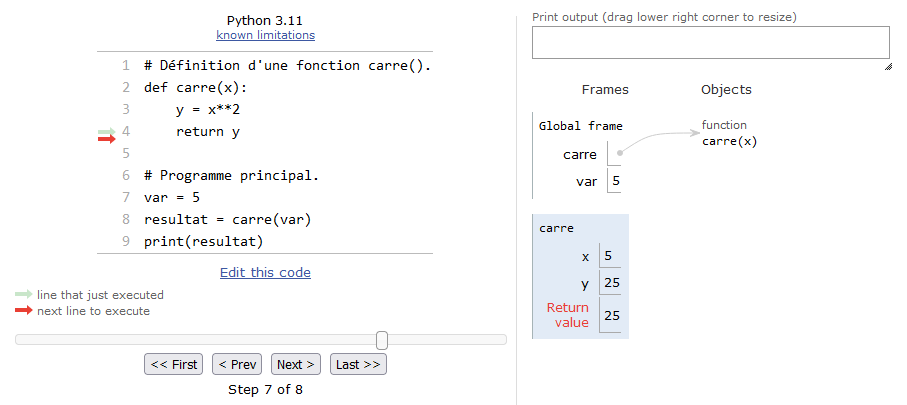{ #fig:fct_step7 width=80% }
\


- Étape 8 : Python quitte la fonction et la valeur renvoyée par celle-ci est affectée à la variable *globale* `resultat`. Notez bien que lorsque Python quitte la fonction, **l'espace des variables alloué à la fonction est détruit**. Ainsi, toutes les variables créées dans la fonction n'existent plus. On comprend pourquoi elles portent le nom de *locales* puisqu'elles n'existent que lorsque la fonction est exécutée.

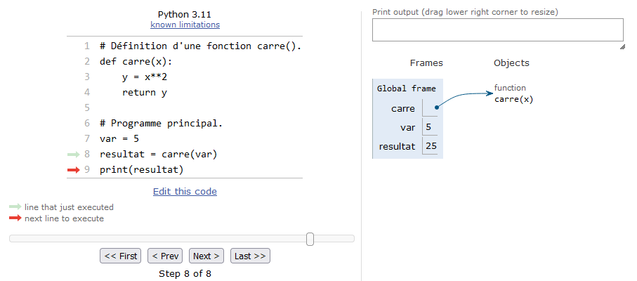{ #fig:fct_step8 width=80% }
\


- Étape 9 : Python affiche le contenu de la variable `resultat` et l'exécution est terminée.

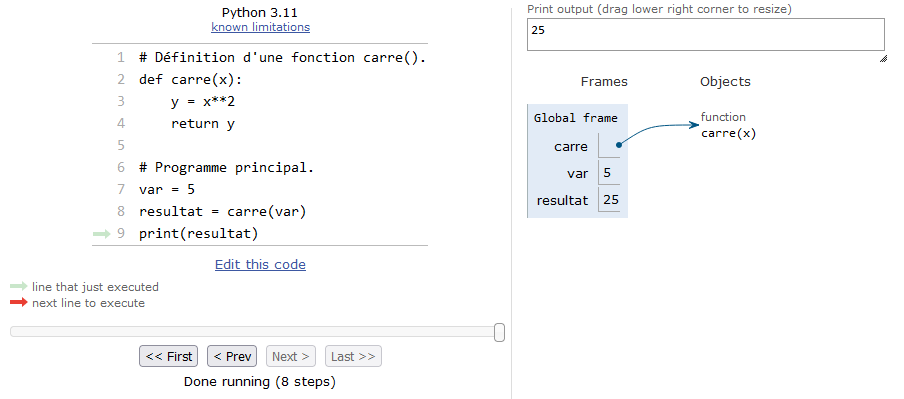{ #fig:fct_step9 width=80% }
\


Nous espérons que cet exemple guidé facilitera la compréhension des concepts de variables locales et globales. Cela viendra aussi avec la pratique. Nous irons un peu plus loin sur les fonctions dans le chapitre 12. D'ici là, essayez de vous entraîner au maximum avec les fonctions. C'est un concept ardu, mais il est impératif de le maîtriser.

Enfin, comme vous avez pu le constater, *Python Tutor* nous a grandement aidé à comprendre ce qui se passait. N'hésitez pas à l'utiliser sur des exemples ponctuels, ce site vous aidera à visualiser ce qui se passe lorsqu'un code ne fait pas ce que vous attendez.


## Principe DRY

L'acronyme [DRY](https://www.earthdatascience.org/courses/intro-to-earth-data-science/write-efficient-python-code/intro-to-clean-code/dry-modular-code/) signifie *Don't Repeat Yourself*. Les fonctions permettent de satisfaire ce principe en évitant la duplication de code.
En effet, plus un code est dupliqué plusieurs fois dans un programme, plus il sera source d'erreurs, notamment lorsqu'il faudra le faire évoluer.

Considérons par exemple le code suivant qui convertit plusieurs températures des degrés Fahrenheit en degrés Celsius :

```python
>>> temp_in_fahrenheit = 60
>>> (temp_in_fahrenheit - 32) * (5/8)
17.5
>>> temp_in_fahrenheit = 80
>>> (temp_in_fahrenheit - 32) * (5/8)
30.0
>>> temp_in_fahrenheit = 100
>>> (temp_in_fahrenheit - 32) * (5/8)
42.5
```

Malheureusement il y a une erreur dans la formule de conversion. En effet la formule exacte est :

$$
{\rm temp\_celsius} = ({\rm temp\_fahrenheit} - 32) \times \frac{5}{9}
$$

Il faut alors reprendre les lignes 2, 5 et 8 précédentes et les corriger. Cela n'est pas efficace, surtout si le même code est utilisé à différents endroits dans le programme.

En écrivant qu'une seule fois la formule de conversion dans une fonction, on applique le principe DRY :

```python
>>> def convert_fahrenheit_to_celsius(temperature):
...     return (temperature - 32) * (5/9)
... 
>>> temp_in_fahrenheit = 60
>>> convert_fahrenheit_to_celsius(temp_in_fahrenheit)
15.555555555555557
>>> temp_in_fahrenheit = 80
>>> convert_fahrenheit_to_celsius(temp_in_fahrenheit)
26.666666666666668
>>> temp_in_fahrenheit = 100
>>> convert_fahrenheit_to_celsius(temp_in_fahrenheit)
37.77777777777778
```

Et s'il y a une erreur dans la formule, il suffira de ne la corriger qu'une seule fois, dans la fonction `convert_fahrenheit_to_celsius()`.

## Exercices

*Conseil* : pour le premier exercice, utilisez *Python Tutor*. Pour les exercices suivants, créez des scripts puis exécutez-les dans un *shell*.


### Carré et factorielle

Reprenez l'exemple précédent à l'aide du site [*Python Tutor*](http://www.pythontutor.com) :

```python
# définition d'une fonction carre()
def carre(x):
    y = x**2
    return y

# programme principal
z = 5
resultat = carre(z)
print(resultat)
```

Analysez ensuite le code suivant et tentez de prédire sa sortie :

```python
def calc_factorielle(n):
    fact = 1
    for i in range(2, n+1):
        fact = fact * i
    return fact

# programme principal
nb = 4
factorielle_nb = calc_factorielle(nb)
print(f"{nb}! = {factorielle_nb}")
nb2 = 10
print(f"{nb2}! = {calc_factorielle(nb2)}")
```

Testez ensuite cette portion de code avec *Python Tutor* en cherchant à bien comprendre chaque étape.
Avez-vous réussi à prédire la sortie correctement ?

open-box-rem

Une remarque concernant l'utilisation des *f-strings* que nous avions vues dans le chapitre 3 *Affichage*. On voit à nouveau une possibilité puissante des *f-strings* dans l'instruction `f"{nb2}! = {calc_factorielle(nb2)}"` : il est possible de mettre directement au sein des accolades un appel à une fonction (ici `{calc_factorielle(nb2)}`) ! Ainsi, pas besoin de créer une variable intermédiaire dans laquelle on stocke ce que retourne la fonction. 

close-box-rem

### Puissance

Créez une fonction `calc_puissance(x, y)` qui renvoie $x^y$ en utilisant l'opérateur `**`. Pour rappel :

```python
>>> 2**2
4
>>> 2**3
8
>>> 2**4
16
```

Dans le programme principal, calculez et affichez à l'écran $2^i$ avec $i$ variant de 0 à 20 inclus. On souhaite que le résultat soit présenté avec le formatage suivant :

```text
2^ 0 =       1
2^ 1 =       2
2^ 2 =       4
[...]
2^20 = 1048576
```

### Pyramide

Reprenez l'exercice du chapitre 5 *Boucles et comparaisons* qui dessine une pyramide.

Dans un script `pyra.py`, créez une fonction `gen_pyramide()` à laquelle vous passez un nombre entier `N` et qui renvoie une pyramide de $N$ lignes sous forme de chaîne de caractères. Le programme principal demandera à l'utilisateur le nombre de lignes souhaitées (utilisez pour cela la fonction `input()`) et affichera la pyramide à l'écran.


### Nombres premiers

Reprenez l'exercice du chapitre 6 *Tests* sur les nombres premiers.

Créez une fonction `est_premier()` qui prend comme argument un nombre entier positif *n* (supérieur à 2) et qui renvoie le booléen `True` si *n* est premier et `False` si *n* n'est pas premier. Déterminez tous les nombres premiers de 2 à 100. On souhaite avoir une sortie similaire à celle-ci :

```text
  2 est premier
  3 est premier
  4 n'est pas premier
[...]
100 n'est pas premier
```


### Séquence complémentaire

Créez une fonction `seq_comp()` qui prend comme argument une liste de bases et qui renvoie la séquence complémentaire d'une séquence d'ADN sous forme de liste.

Dans le programme principal, à partir de la séquence d'ADN 
`seq = ["A", "T", "C", "G", "A", "T", "C", "G", "A", "T", "C"]` 
affichez `seq` et sa séquence complémentaire (en utilisant votre fonction `seq_comp()`).

Rappel : la séquence complémentaire s'obtient en remplaçant A par T, T par A, C par G et G par C.


### Distance 3D

Créez une fonction `calc_distance_3D()` qui calcule la distance euclidienne en trois dimensions entre deux atomes. Testez votre fonction sur les 2 points `A(0,0,0)` et `B(1,1,1)`. Trouvez-vous bien $\sqrt{3}$ ?

On rappelle que la distance euclidienne *d* entre deux points A et B de coordonnées cartésiennes respectives $(x_A, y_A, z_A)$ et $(x_B, y_B, z_B)$ se calcule comme suit :

$$
d = \sqrt{(x_B - x_A)^2 + (y_B - y_A)^2 + (z_B - z_A)^2}
$$


### Distribution et statistiques

Créez une fonction `gen_distrib()` qui prend comme argument trois entiers : *debut*, *fin* et *n*. La fonction renverra une liste de $n$ *floats* aléatoires entre *debut* et *fin*. Pour générer un nombre aléatoire dans un intervalle donné, utilisez la fonction `uniform()` du module *random* dont voici quelques exemple d'utilisation :

```python
>>> import random
>>> random.uniform(1, 10)
8.199672607202174
>>> random.uniform(1, 10)
2.607528561528022
>>> random.uniform(1, 10)
9.000404025130946
```

Avec la fonction `random.uniform()`, les bornes passées en argument sont incluses, c'est-à-dire qu'ici, le nombre aléatoire renvoyé est dans l'intervalle [1, 10].

Créez une autre fonction `calc_stat()` qui prend en argument une liste de *floats* et qui renvoie une liste de trois éléments contenant respectivement le minimum, le maximum et la moyenne de la liste.

Dans le programme principal, générez 20 listes aléatoires de 100 *floats* compris entre 0 et 100 et affichez le minimum (`min()`), le maximum (`max()`) et la moyenne pour chacune d'entre elles. La moyenne pourra être calculée avec les fonctions `sum()` et `len()`.

Pour chacune des 20 listes, affichez les statistiques (min, max, et moyenne) avec deux chiffres après la virgule :
```text
Liste  1 : min = 0.17 ; max = 99.72 ; moyenne = 57.38
Liste  2 : min = 1.25 ; max = 99.99 ; moyenne = 47.41
[...]
Liste 19 : min = 1.05 ; max = 99.36 ; moyenne = 49.43
Liste 20 : min = 1.33 ; max = 97.63 ; moyenne = 46.53

```

Les écarts sur les statistiques entre les différentes listes sont-ils importants ? Relancez votre script avec des listes de 1000 éléments, puis 10 000 éléments. Les écarts changent-ils quand le nombre d'éléments par liste augmente ?


### Distance à l'origine (exercice +++)

En reprenant votre fonction de calcul de distance euclidienne en trois dimensions `calc_distance_3D()`, faites-en une version pour deux dimensions que vous appellerez `calc_distance_2D()`.

Créez une autre fonction `calc_dist2ori()` à laquelle vous passez en argument deux listes de *floats* `list_x` et `list_y` représentant les coordonnées d'une fonction mathématique (par exemple $x$ et $sin(x)$). Cette fonction renverra une liste de *floats* représentant la distance entre chaque point de la fonction et l'origine (de coordonnées $(0,0)$).

La figure @fig:sin2ori montre un exemple sur quelques points de la fonction $sin(x)$ (courbe en trait épais). Chaque trait pointillé représente la distance que l'on cherche à calculer entre les points de la courbe et l'origine du repère de coordonnées $(0, 0$).

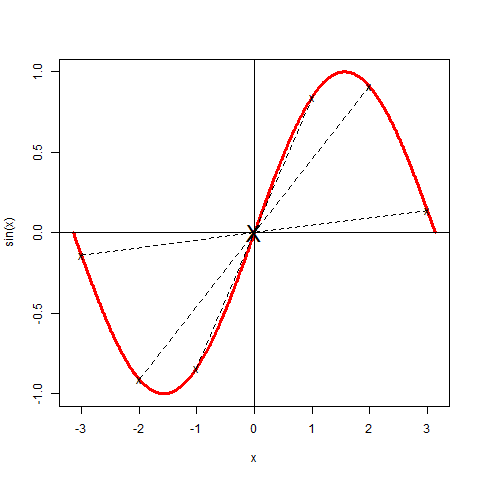{ #fig:sin2ori width=60% }

Votre programme générera un fichier `sin2ori.dat` qui contiendra deux colonnes : la première représente les $x$, la seconde la distance entre chaque point de la fonction $sin(x)$ à l'origine.

Enfin, pour visualiser votre résultat, ajoutez le code suivant tout à la fin de votre script :

```python
# Création d'une image pour la visualisation du résultat.
import matplotlib.pyplot as plt

x = []
y = []
with open("sin2ori.dat", "r") as f_in:
    for line in f_in:
        coords = line.split()
        x.append(float(coords[0]))
        y.append(float(coords[1]))
fig, ax = plt.subplots(figsize=(6, 6))
ax.plot(x, y)
ax.set_xlabel("x")
ax.set_ylabel("Distance de sin(x) à l'origine")
fig.savefig("sin2ori.png")
```

Ouvrez l'image `sin2ori.png`.

open-box-rem

Le module *matplotlib* sera expliqué en détail dans le chapitre 21 *Module matplotlib*.

close-box-rem
