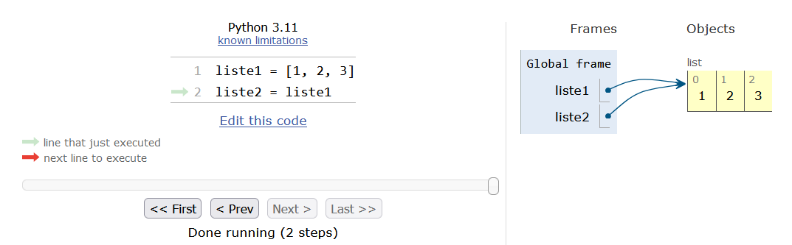

# Plus sur les listes

## Propriétés des listes

Comme pour les chaînes de caractères, les listes possèdent de nombreuses **méthodes** qui leur sont propres et qui peuvent se révéler très pratiques. On rappelle qu'une méthode est une fonction qui agit sur l'objet auquel elle est attachée par un point.

Observez les exemples suivants :

- `.append()` que l'on a déjà vu au chapitre 4 *Listes* et qui ajoute un élément à la fin d'une liste existante.
    ```
    >>> a = [1,2,3]
    >>> a.append(5)
    >>> a
    [1, 2, 3, 5]
    ```
    qui est équivalent à
    ```
    >>> a = [1,2,3]
    >>> a = a + [5]
    >>> a
    [1, 2, 3, 5]
    ```
    *Conseil*: préférez la version avec `.append()` qui est plus compacte et facile à lire.

- `.insert()` pour insérer un objet dans une liste avec un indice déterminé.
    ```
    >>> a.insert(2,-15)
    >>> a
    [1, 2, -15, 3, 5]
    ```

- `del` pour supprimer un élément d'une liste à une indice déterminé.
    ```
    >>> del a[1]
    >>> a
    [1, -15, 3, 5]
    ```
    **Remarque** : Contrairement aux autres méthodes associées aux listes, `del` est une instruction générale de Python (utilisable pour d'autres objets que les listes). Celle-ci ne prend pas de parenthèses.

- `.remove()` pour supprimer un élément d'une liste à partir de sa valeur.
    ```
    >>> a.remove(5)
    >>> a
    [1, -15, 3]
    ```

- `.sort()` pour trier une liste.
    ```
    >>> a.sort()
    >>> a
    [-15, 1, 3]
    ```

- `.reverse()` pour inverser une liste.
    ```
    >>> a.reverse()
    >>> a
    [3, 1, -15]
    ```

- `.count()` pour compter le nombre d'éléments (passés en argument) dans une liste.
    ```
    >>> a=[1, 2, 4, 3, 1, 1]
    >>> a.count(1)
    3
    >>> a.count(4)
    1
    >>> a.count(23)
    0
    ```

open-box-warn

Dans de nombreux exemples de méthodes ci-dessus, une liste modifiée (par exemple `a.sort()`) n'est pas renvoyée. La liste est modifiée de manière interne, mais l'appel de la méthode ne renvoie rien, c'est-à-dire qu'elle ne renvoie pas d'objet récupérable dans une variable. Il s'agit d'un exemple d'utilisation de méthode (donc de fonction particulière) qui fait une action mais qui ne renvoie rien. Pensez-y dans vos utilisations futures des listes.

Certaines méthodes ou instructions des listes décalent les indices d'une liste (par exemple `.insert()`, `del`, etc.).

close-box-warn


La méthode `.append()` est très pratique car elle permet de construire une liste au fur et à mesure des itérations d'une boucle. Pour cela, il est commode de définir préalablement une liste vide de la forme `maliste = []`. Voici un exemple où une chaîne de caractères est convertie en liste :
```
>>> seq = "CAAAGGTAACGC"
>>> seq_list = []
>>> seq_list
[]
>>> for base in seq:
...   seq_list.append(base)
...
>>> seq_list
['C', 'A', 'A', 'A', 'G', 'G', 'T', 'A', 'A', 'C', 'G', 'C']
```

Remarquez que vous pouvez directement utiliser la fonction `list()` qui prend n'importe quel objet séquentiel (liste, chaîne de caractères, etc.) et qui renvoie une liste :
```
>>> seq = "CAAAGGTAACGC"
>>> list(seq)
['C', 'A', 'A', 'A', 'G', 'G', 'T', 'A', 'A', 'C', 'G', 'C']
```

Cette méthode est certes plus simple, mais il arrive parfois qu'on doive utiliser les boucles tout de même, comme lorsqu'on lit un fichier. On rappelle que l'instruction `list(seq)` convertit un objet de type chaîne de caractères en un objet de type liste (il s'agit donc d'une opération de *casting*). De même que `list(range(10))` convertit un objet de type `range` en un objet de type `list`.

Enfin, si vous voulez obtenir une liste exhaustive des méthodes disponibles pour les listes, vous pouvez toujours utiliser la fonction `dir(ma_liste)` (`ma_liste` étant un objet de type `list`).


## Test d'appartenance

L'opérateur `in` permet de tester si un élément fait partie d'une liste.
```
liste = [1, 3, 5, 7, 9]
>>> 3 in liste
True
>>> 4 in liste
False
>>> 3 not in liste
False
>>> 4 not in liste
True
```
La variation avec `not` permet, *a contrario*, de vérifier qu'un élément n'est pas dans une liste.


## Copie de listes

Il est très important de savoir que l'affectation d'une liste (à partir d'une liste préexistante) crée en réalité une **référence** et non une **copie** :
```
>>> x = [1,2,3]
>>> y = x
>>> y
[1, 2, 3]
>>> x[1] = -15
>>> x
[1, -15, 3]
>>> y
[1, -15, 3]
```

Vous voyez que la modification de `x` modifie `y` aussi ! Pour comprendre ce qui se passe nous allons de nouveau utiliser le site *Python Tutor* avec cet exemple (Figure @fig:copy_list) :

{ #fig:copy_list width=80% }

Techniquement, Python utilise des pointeurs (comme dans le langage de programmation C) vers les mêmes objets. *Python Tutor* l'illustre avec des flèches qui partent des variables `x` et `y` et qui pointent vers la même liste. Donc, si on modifie la liste `x`, la liste `y` est modifiée de la même manière. Rappelez-vous de ceci dans vos futurs programmes car cela pourrait avoir des effets désastreux !

Pour éviter ce problème, il va falloir créer une copie explicite de la liste initiale. Observez cet exemple :
```
>>> x = [1,2,3]
>>> y = x[:]
>>> x[1] = -15
>>> y
[1, 2, 3]
```

L'instruction `x[:]` a créé une copie « à la volée » de la liste `x`. Vous pouvez utiliser aussi la fonction `list()` qui renvoie explicitement une liste:
```
>>> x = [1,2,3]
>>> y = list(x)
>>> x[1] = -15
>>> y
[1, 2, 3]
```
Si on regarde à nouveau dans *Python Tutor* (Figure @fig:copy_list2), on voit clairement que l'utilisation des tranches `[:]` ou de la fonction `list()` crée des copies explicites. Chaque flèche pointe vers une liste différente, indépendante des autres.

![Copie de liste avec une tranche `[:]` et la fonction `list()`.](img/copy_list2.png){ #fig:copy_list2 width=80% }

Attention, les deux techniques précédentes ne fonctionnent que pour les listes à une dimension, autrement dit les listes qui ne contiennent pas elles-mêmes d'autres listes. Voyez par exemple :

```
>>> x = [[1,2],[3,4]]
>>> x
[[1, 2], [3, 4]]
>>> y = x[:]
>>> x[1][1] = 55
>>> x
[[1, 2], [3, 55]]
>>> y
[[1, 2], [3, 55]]
```
et
```
>>> y = list(x)
>>> x[1][1] = 77
>>> x
[[1, 2], [3, 77]]
>>> y
[[1, 2], [3, 77]]
```

La méthode de copie qui **fonctionne à tous les coups** consiste à appeler la fonction `deepcopy()` du module *copy*.

```
>>> import copy
>>> x = [[1,2],[3,4]]
>>> x
[[1, 2], [3, 4]]
>>> y = copy.deepcopy(x)
>>> x[1][1] = 99
>>> x
[[1, 2], [3, 99]]
>>> y
[[1, 2], [3, 4]]
```


## Exercices

*Conseil* : pour ces exercices, écrivez des scripts dans des fichiers, puis exécutez-les dans un *shell*.


### Tri de liste

Soit la liste de nombres `[8, 3, 12.5, 45, 25.5, 52, 1]`. Triez les nombres de cette liste par ordre croissant, sans utiliser la fonction `sort()`. Les fonctions et méthodes `min()`, `.append()` et `.remove()` vous seront utiles.


### Séquence d'ADN aléatoire

Créez une fonction `seq_alea()` qui prend comme argument un entier positif `taille` représentant le nombre de bases de la séquence et qui renvoie une séquence d'ADN aléatoire sous forme d'une liste de bases. Utilisez la méthode `.append()` pour ajouter les différentes bases à la liste et la fonction `random.choice()` du module *random* pour choisir une base parmi les 4 possibles.

Utilisez cette fonction pour générer aléatoirement une séquence d'ADN de 15 bases.


### Séquence d'ADN complémentaire inverse

Créez une fonction `comp_inv()` qui prend comme argument une séquence d'ADN sous la forme d'une chaîne de caractères et qui renvoie la séquence complémentaire inverse sous la forme d'une autre chaîne de caractères. Cette fonction utilisera le maximum de méthodes associées aux listes.

Utilisez cette fonction pour transformer la séquence d'ADN `TCTGTTAACCATCCACTTCG` en sa séquence complémentaire inverse.

Rappel : la séquence complémentaire inverse doit être « inversée ». Autrement dit, la séquence complémentaire inverse de la séquence `ATCG` est `CGAT`.


### Doublons

Soit la liste de nombres `[5, 1, 1, 2, 5, 6, 3, 4, 4, 4, 2]`.

Retirez les doublons de cette liste, triez-la et affichez-la.


### Séquence d'ADN aléatoire 2

Créez une fonction `seq_alea_2()` qui prend comme argument un entier et quatre *floats* représentant respectivement la longueur de la séquence et les pourcentages de chacune des 4 bases A, T, G et C. La fonction générera aléatoirement une séquence d'ADN qui prend en compte les contraintes fournies en arguments et renverra la séquence sous forme d'une liste.

Utilisez cette fonction pour générer aléatoirement une séquence d'ADN de 50 bases contenant 10 % de A, 30 % de T, 50 % de G et 10 % de C.

*Conseil* : la fonction `random.shuffle()` du module *random* vous sera utile.


### Le nombre mystère

Trouvez le nombre mystère qui répond aux conditions suivantes :

- *Il est composé de 3 chiffres*.
- *Il est strictement inférieur à 300*.
- *Il est pair*.
- *Deux de ses chiffres sont identiques*.
- *La somme de ses chiffres est égale à 7*.

On vous propose d'employer une méthode dite « brute force », c'est-à-dire d'utiliser une boucle et à chaque itération de tester les différentes conditions.


### Triangle de Pascal (exercice +++)

Voici le début du triangle de Pascal :
```
1
1 1
1 2 1
1 3 3 1
1 4 6 4 1
1 5 10 10 5 1
[...]
```
Déduisez comment une ligne est construite à partir de la précédente. Par exemple, à partir de la ligne 2 (`1 1`), construisez la ligne suivante (ligne 3 : `1 2 1`) et ainsi de suite.

Implémentez cette construction en Python. Généralisez à l'aide d'une boucle.

Écrivez dans un fichier `pascal.out` les 10 premières lignes du triangle de Pascal.
