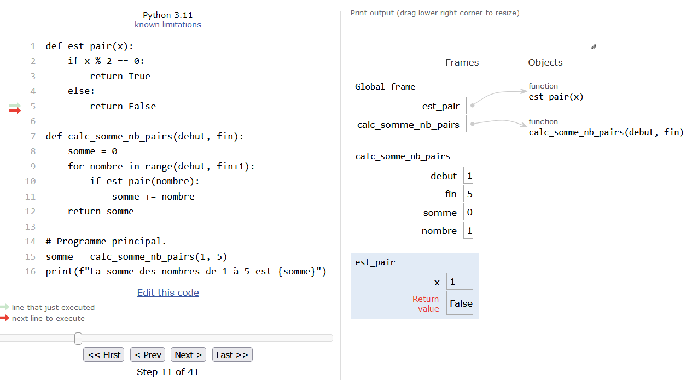
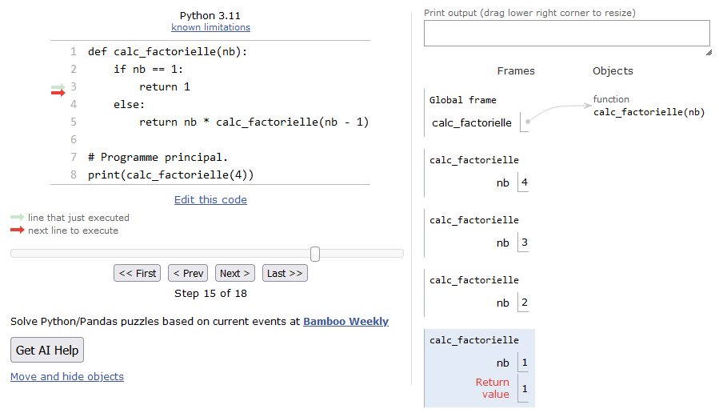

# Plus sur les fonctions

Avant d'aborder ce chapitre, nous vous conseillons de relire le chapitre 9 et de bien en assimiler toutes les notions (et aussi d'en faire les exercices). Nous avons vu dans ce chapitre 9 le concept puissant et incontournable que représente les **fonctions**. Nous vous avons également introduit la notion de variables **locales** et **globales**.

Dans ce chapitre, nous allons aller un peu plus loin sur la visibilité de ces variables dans et hors des fonctions, et aussi voir ce qu'il se passe lorsque ces variables sont des listes. Attention, la plupart des lignes de code ci-dessous sont données à titre d'exemple pour bien comprendre ce qu'il se passe, mais nombre d'entre elles sont des aberrations de programmation. Ainsi nous ferons un récapitulatif des bonnes pratiques à la fin du chapitre. Enfin, nous vous conseillons de tester tous les exemples ci-dessous avec le site [pythontutor](http://www.pythontutor.com/) afin de suivre l'état des variables lors de l'exécution des exemples.


## Appel d'une fonction dans une fonction

Dans le chapitre 9 nous avons vu des fonctions qui étaient appelées depuis le programme principal. Il est en fait possible d'appeler une fonction depuis une autre fonction. Et plus généralement, on peut appeler une fonction de n'importe où à partir du moment où elle est visible par Python (*i.e.* chargée dans la mémoire). Regardez cet exemple :
```
# définition des fonctions
def polynome(x):
    return (x**2 - 2*x + 1)

def calc_vals(debut, fin):
    liste_vals = []
    for x in range(debut,fin + 1):
        liste_vals.append(polynome(x))
    return liste_vals

# programme principal
print(calc_vals(-5,5))
```

Dans cet exemple, nous appelons depuis le programme principal la fonction `calc_vals()`, puis à l'intérieur de celle-ci nous appelons l'autre fonction `polynome()`. Regardons ce que *pythontutor* nous montre lorsque la fonction `polynome()` est en exécution (lors de son second appel) :

{ #fig:appel_fct_ds_fct width=40% }

Nous voyons que l'espace mémoire alloué à `polynome()` est bleuté, nous indiquant que cette fonction est en cours d'exécution. La fonction appelante `calc_vals()` est toujours là (sur un fond blanc) car son exécution n'est pas terminée. Elle est en quelque sorte *figée* dans le même état qu'avant l'appel de `polynome()`, et on pourra ainsi noter que ses variables *locales* sont toujours là (c'est à dire `debut`, `fin`, `liste_vals` et `x`).
De manière générale, les variables *locales* d'une fonction ne seront détruites que lorsque l'exécution de celle-ci sera terminée. Dans notre exemple, les variables *locales* de `calc_vals()` ne seront détruites que lorsque la boucle sera terminée et que la liste `liste_vals` sera retournée au programme principal. En passant, la fonction `calc_vals()` appelle la fonction `polynome()` à chaque itération de la boucle.

Ainsi le programmeur est libre de faire tous les appels qu'il souhaite. Une fonction peut appeler une autre fonction, cette dernière peut appeler une autre fonction et ainsi de suite (et autant de fois qu'on le veut). Une fonction peut même s'appeler elle-même, cela s'appelle une fonction *récursive* (voir la section suivante). Attention toutefois à retrouver vos petits si vous vous perdez dans les appels successifs !


## Fonctions récursives

*Conseil* : Pour les débutants, vous pouvez passer cette section.

Comme dit ci-dessus, une fonction récursive est une fonction qui s'appelle elle-même. Les fonctions récursives permettent d'obtenir une efficacité redoutable dans la résolution de certains algorithmes comme le [tri rapide](https://fr.wikipedia.org/wiki/Tri_rapide) (en anglais *quicksort*).

Oublions la recherche d'efficacité pour l'instant, et concentrons-nous sur l'exemple de la fonction mathématique factorielle. Nous vous rappelons que factorielle s'écrit avec `!` et produit les résultats suivants:
$$
\begin{split}
3! = & 3 \times 2 \times 1 = 6 \\
4! = & 4 \times 3 \times 2 \times 1 = 30 \\
n! = & n \times n - 1 \times \ldots \times 2 \times 1
\end{split}
$$

Si nous essayons de coder cette fonction mathématique en Python, voici ce que nous pourrions écrire :

```
def calc_factorielle(nb):
    if nb == 1:
        return 1
    else:
        return nb * calc_factorielle(nb - 1)

# prog principal
print(calc_factorielle(4))
```

Pas très facile à comprendre, n'est-ce pas ? À nouveau, demandons l'aide de pythontutor pour visualiser ce qui se passe (nous vous conseillons bien sûr de tester vous-même cet exemple sur [pythontutor](http://pythontutor.com)) :

{ #fig:fct-recursive-factorielle width=70% }

Vous voyez qu'au début on appelle la fonction en passant la variable `nb` qui vaut 4. Puis au sein de la fonction, celle-ci se rappelle elle-même, mais cette fois-ci en passant la valeur 3. Au prochain appel, ce sera avec la valeur 2, puis finalement 1. Dans ce dernier cas, le `if nb == 1:` est vrai, et la ligne `return 1` va être exécutée. À     ce moment précis de l'exécution, vous voyez que les appels successifs forment une sorte de *pile* (voir la figure @fig:fct-recursive-factorielle). La valeur 1 va être ainsi renvoyée au niveau de l'appel précédent, puis le résultat 2 * 1 = 2 (où 2 correspond à `nb` et 1 provient de `calc_factorielle(nb - 1) = 1`) va être renvoyé à l'appel précédent, puis 3 * 2 = 6 (où 3 correspond à `nb` et 2 provient de `calc_factorielle(nb - 1) = 2`) va être renvoyé à l'appel précédent, pour finir par 4 * 6 = 24 (où 4 correspond à `nb` et 6 provient de `calc_factorielle(nb - 1) = 6`), soit la valeur de $!4$. Les appels successifs vont donc se "dépiler" et nous reviendrons dans le programme principal.

Même si les fonctions récursives peuvent être ardues à comprendre, notre propos est ici de vous illustrer qu'une fonction qui en appelle une autre (ici il s'agit d'elle-même) reste "figée" dans le même état, jusqu'à temps que la fonction appelée lui renvoie une valeur.


## Portée des variables

Il est très important lorsque l'on manipule des fonctions de connaître la portée des variables. On a vu que les variables créées au sein d'une fonction ne sont pas visibles à l'extérieur de celle-ci car elles étaient **locales** à la fonction. Observez le code suivant :
```
>>> def mafonction():
...     x = 2
...     print('x vaut {} dans la fonction'.format(x))
...
>>> mafonction()
x vaut 2 dans la fonction
>>> print(x)
Traceback (most recent call last):
  File "<stdin>", line 1, in <module>
NameError: name 'x' is not defined
```
Lorsque Python exécute le code de la fonction, il connaît le contenu de la variable `x`. Par contre, de retour dans le module principal (dans notre cas, il s'agit de l'interpréteur Python), il ne la connaît plus d'où le message d'erreur.

De même, une variable passée en argument est considérée comme **locale** lorsqu'on arrive dans la fonction:
```
>>> def mafonction(x):
...     print('x vaut {} dans la fonction'.format(x))
...
>>> mafonction(2)
x vaut 2 dans la fonction
>>> print(x)
Traceback (most recent call last):
  File "<stdin>", line 1, in ?
NameError: name 'x' is not defined
```

Deuxièmement, lorsqu'une variable déclarée à la racine du module (c'est comme cela que l'on appelle un programme Python), elle est visible dans tout le module. On a vu qu'on parlait de variable **globale**
```
>>> def mafonction():
...     print(x)
...
>>> x = 3
>>> mafonction()
3
>>> print(x)
3
```

Dans ce cas, la variable `x` est visible dans le module principal et dans toutes les fonctions du module. Toutefois, Python ne permet pas la modification d'une variable globale dans une fonction:
```
>>> def mafonction():
...     x = x + 1
...
>>> x = 1
>>> mafonction()
Traceback (most recent call last):
File "<stdin>", line 1, in <module>
  File "<stdin>", line 2, in fct
UnboundLocalError: local variable 'x' referenced before assignment
```

L'erreur renvoyée montre que Python pense que `x` est une variable locale qui n'a pas été encore assignée. Si on veut vraiment modifier une variable globale dans une fonction, il faut utiliser le mot-clé `global` :
```
>>> def mafonction():
...     global x
...     x = x + 1
...
>>> x = 1
>>> mafonction()
>>> x
2
```
Dans ce dernier cas, le mot-clé `global` a forcé la variable `x` à être globale plutôt que locale au sein de la fonction.


## Portée des listes

*Préambule* : Attention, les exemples de cette section représentent des absurdités de programmation. Ils sont donnés à titre indicatif pour comprendre ce qu'il se passe, mais il ne faut surtout pas s'en inspirer !

Soyez extrêmement attentifs avec les types modifiables (tels que les listes) car vous pouvez les changer au sein d'une fonction :
```
>>> def mafonction():
...     liste[1] = -127
...
>>> liste = [1,2,3]
>>> mafonction()
>>> liste
[1, -127, 3]
```
De même que si vous passez une liste en argument, elle est tout autant modifiable au sein de la fonction :
```
>>> def mafonction(x):
...     x[1] = -15
...
>>> y = [1,2,3]
>>> mafonction(y)
>>> y
[1, -15, 3]
```
Si vous voulez éviter ce problème, utilisez des tuples, Python renverra une erreur puisque ces derniers sont non modifiables ! Une autre solution pour éviter la modification d'une liste lorsqu'elle est passée en tant qu'argument, est de la passer explicitement (comme nous l'avons fait pour la copie de liste) afin qu'elle reste intacte dans le programme principal.
```
>>> def mafonction(x):
...     x[1] = -15
...
>>> y = [1,2,3]
>>> mafonction(y[:])
>>> y
[1, 2, 3]
>>> mafonction(list(y))
>>> y
[1, 2, 3]
```
Dans ces deux derniers exemples, une copie de `y` est créée à la volée lorsqu'on appelle la fonction, ainsi la liste `y` du module principal reste intacte.


## Règle LGI

Lorsque Python rencontre une variable, il va traiter la résolution de son  nom avec des priorités particulières :  d'abord il va regarder si la variable est **locale**, puis si elle n'existe pas localement, il vérifiera si elle est **globale** et enfin si elle n'est pas globale, il testera si elle est **interne** (par exemple la fonction `len()` est considérée comme une fonction interne à Python, *i.e.* elle existe à chaque fois que vous lancez Python). On appelle cette règle la règle **LGI** pour locale, globale, interne. En voici un exemple :
```
>>> def mafonction():
...     x = 4
...     print('Dans la fonction x vaut {}'.format(x))
...
>>> x = -15
>>> mafonction()
Dans la fonction x vaut  4
>>> print('Dans le module principal x vaut {}'.format(x))
Dans le module principal x vaut -15
```
Vous voyez que dans la fonction, `x` a pris la valeur qui lui était définie localement en priorité sur sa valeur définie dans le module principal.

*Conseil* : même si Python peut reconnaître une variable ayant le même nom que ses fonctions ou variables internes, évitez de les utiliser car ceci rendra votre code confus !

De manière générale la règle LGI découle de la manière dont Python gère ce que l'on appelle *l'espace des noms*. Nous en parlerons plus longuement dans le chapitre "Avoir la classe avec les objets" ainsi que dans le chapitre "Pour aller plus loin".


## Recommandations

Dans ce chapitre nous avons *joué* avec les fonctions (et les listes) afin de vous montrer comment Python réagit. Toutefois, notez bien que **l'utilisation de variables globales est à bannir définitivement de votre pratique de la programmation**. Parfois on se dit, je n'ai pas le temps, je préfère créer une variable globale visible partout dans le programme (donc dans toutes les fonctions), car *"ça va plus vite, c'est plus simple"*. C'est un très mauvais calcul, ne serait-ce que parce que vos fonctions ne seront pas réutilisables dans un autre contexte si elles utilisent des variables globales ! Ensuite, arriverez-vous à vous relire dans 6 mois ? Et si vous donnez votre code à lire à quelqu'un ? Il existe de nombreuses autres [raisons](http://wiki.c2.com/?GlobalVariablesAreBad) que nous ne développerons pas ici, mais libre à vous de consulter de la documentation externe.

Heureusement, Python est orienté objet et cela permet *"d'encapsuler"* des variables dans des objets et de s'affranchir définitivement des variables globales (nous verrons cela dans le chapitre 18). En attendant, et si vous souhaitez ne pas aller plus loin sur les notions d'objet (on peut tout à fait *pythonner* sans cela), retenez la chose suivante avec les fonctions et les variables globales :

**Plutôt que d'utiliser des variables globales, passez vos variables explicitement aux fonctions en tant qu'argument(s)**.

Nous espérons que vous maitrisez maintenant les fonctions sous tous leurs angles. Comme dit en introduction du chapitre 9, elles sont incontournables et tout programmeur se doit de les maitriser. Voici les derniers conseils que nous pouvons vous donnez :

- Lorsque vous attaquez un nouveau projet de programmation complexe, posez-vous la question : *"Comment pourriez-vous décomposer en blocs chaque tache à effectuer, chaque bloc pouvant être une fonction"*. Si une fonction s'avère trop complexe, vous pouvez également la décomposer en d'autres fonctions.

- Au risque de nous répéter, forcez-vous à utiliser les fonctions en permanence. Pratiquez, pratiquez... et pratiquez encore !


## Exercices

*Conseil* : pour ces exercices, écrivez des scripts dans des fichiers, puis exécutez-les dans un *shell*.

### Prédire la sortie

- Prédisez le comportement de ce code sans le recopier dans un script ni dans l'interpréteur Python :
    ```
	def hello(prenom):
	  print("Bonjour {}".format(prenom))

	hello("Patrick")
	print(x)
    ```
- Prédisez le comportement de ce code sans le recopier dans un script ni dans l'interpréteur Python :
    ```
	x = 10

	def hello(prenom):
	  print("Bonjour {}".format(prenom))

	hello("Patrick")
	print(x)
    ```
- Prédisez le comportement de ce code sans le recopier dans un script ni dans l'interpréteur Python :
    ```
	x = 10

	def hello(prenom):
	  print("Bonjour {}".format(prenom))
	  print(x)

	hello("Patrick")
	print(x)
    ```
- Prédisez le comportement de ce code sans le recopier dans un script ni dans l'interpréteur Python :
    ```
	x = 10

	def hello(prenom):
	  x = 42
	  print("Bonjour {}".format(prenom))
	  print(x)

	hello("Patrick")
	print(x)
    ```
