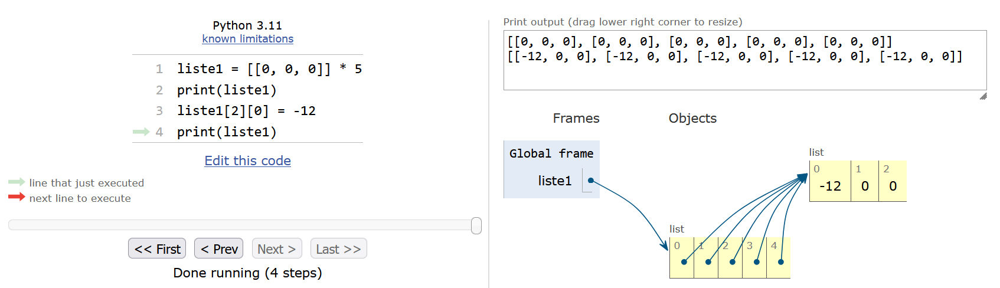

# Plus sur les listes

Nous avons vu les listes dès le chapitre 4 et les avons largement utilisées depuis le début de ce cours. Dans ce chapitre nous allons plus loin avec les méthodes associées aux listes, ainsi que d'autres caractéristiques très puissantes telles que les tests d'appartenance ou les listes de compréhension.

## Méthodes associées aux listes

Comme pour les chaînes de caractères, les listes possèdent de nombreuses **méthodes** qui leur sont propres et qui peuvent se révéler très pratiques. On rappelle qu'une méthode est une fonction qui agit sur l'objet auquel elle est attachée par un point.


### `.append()`

La méthode `.append()`, que l'on a déjà vu au chapitre 4 *Listes*, ajoute un élément à la fin d'une liste :

```python
>>> liste1 = [1, 2, 3]
>>> liste1.append(5)
>>> liste1
[1, 2, 3, 5]
```

qui est équivalent à :

```python
>>> liste1 = [1, 2, 3]
>>> liste1 = liste1 + [5]
>>> liste1
[1, 2, 3, 5]
```

open-box-adv

Préférez la version avec `.append()` qui est plus compacte et facile à lire.

close-box-adv


### `.insert()`

La méthode `.insert()` insère un objet dans une liste à un indice déterminé :

```python
>>> liste1 = [1, 2, 3]
>>> liste1.insert(2, -15)
>>> liste1
[1, 2, -15, 3]
```


### `del`

L'instruction `del` supprime un élément d'une liste à un indice déterminé :

```python
>>> liste1 = [1, 2, 3]
>>> del liste1[1]
>>> liste1
[1, 3]
```

open-box-rem

Contrairement aux méthodes associées aux listes présentées dans cette rubrique, `del` est une instruction générale de Python, utilisable pour d'autres objets que des listes. Celle-ci ne prend pas de parenthèse.

close-box-rem


### `.remove()`

La méthode `.remove()` supprime un élément d'une liste à partir de sa valeur :

```python
>>> liste1 = [1, 2, 3]
>>> liste1.remove(3)
>>> liste1
[1, 2]
```

S'il y a plusieurs fois la même valeur dans la liste, seule la première est retirée. Il faut appeler la méthode `.remove()` autant de fois que nécessaire pour retirer toutes les occurences d'un même élément :

```python
>>> liste1 = [1, 2, 3, 4, 3]
>>> liste1.remove(3)
>>> liste1
[1, 2, 4, 3]
>>> liste1.remove(3)
>>> liste1
[1, 2, 4]
```

### `.sort()`

La méthode `.sort()` trie les éléments d'une liste du plus petit au plus grand:

```python
>>> liste1 = [3, 1, 2]
>>> liste1.sort()
>>> liste1
[1, 2, 3]
```

L'argument `reverse=True` spécifie le tri inverse, c'est-à-dire du plus grand au plus petit élément :

```python
>>> liste1 = [3, 1, 2]
>>> liste1.sort(reverse=True)
>>> liste1
[3, 2, 1]
```


### `sorted()`

La fonction `sorted()` trie également une liste. 
Contrairement à la méthode précédente `.sort()`, cette fonction renvoie la liste triée et ne modifie pas la liste initiale :

```python
>>> liste1 = [3, 1, 2]
>>> sorted(liste1)
[1, 2, 3]
>>> liste1
[3, 1, 2]
```

La fonction `sorted()` supporte aussi l'argument `reverse=True` :

```python
>>> liste1 = [3, 1, 2]
>>> sorted(liste1, reverse=True)
[3, 2, 1]
>>> liste1
[3, 1, 2]
```

### `.reverse()`

La méthode `.reverse()` inverse une liste :

```python
>>> liste1 = [3, 1, 2]
>>> liste1.reverse()
>>> liste1
[2, 1, 3]
```


### `.count()`

La méthode `.count()` compte le nombre d'éléments (passés en argument) dans une liste :

```python
>>> liste1 = [1, 2, 4, 3, 1, 1]
>>> liste1.count(1)
3
>>> liste1.count(4)
1
>>> liste1.count(23)
0
```


### Particularités des méthodes associées aux listes

- De nombreuses méthodes mentionnées précédemment (`.append()`, `.sort()`, etc.) modifient la liste mais ne renvoient rien, c'est-à-dire qu'elles ne renvoient pas d'objet récupérable dans une variable. Il s'agit d'un exemple d'utilisation de méthode (donc de fonction particulière) qui fait une action mais qui ne renvoie rien. Pensez-y dans vos utilisations futures des listes : même si `var = liste1.reverse()` est une instruction Python valide, elle n'a aucun intérêt, préférez-lui `liste1.reverse()`. 

open-box-rem

Pour exprimer la même idée, la documentation parle de modification de la liste « sur place » (*in place* en anglais) :

```python
>>> liste1 = [1, 2, 3]
>>> help(liste1.reverse)
Help on built-in function reverse:

reverse() method of builtins.list instance
    Reverse *IN PLACE*.
```

Cela signifie que la liste est modifiée « sur place », c'est-à-dire **dans la méthode** au moment où elle s'exécute. La liste étant modifiée « en dur » dans la méthode, cette dernière ne renvoie donc rien. L'explication du mécanisme sous-jacent vous sera donnée dans la rubrique 12.4 *Portée des listes* du chapitre 12 *Plus sur les fonctions*.

close-box-rem

- Certaines méthodes ou instructions des listes décalent les indices d'une liste (par exemple `.insert()`, `del`, etc.).

- Enfin, pour obtenir une liste exhaustive des méthodes disponibles pour les listes, utilisez la fonction `dir(liste1)` (`liste1` étant une liste).


## Construction d'une liste par itération

La méthode `.append()` est très pratique car on peut l'utiliser pour construire une liste au fur et à mesure des itérations d'une boucle.

Pour cela, il est commode de définir préalablement une liste vide de la forme `liste1 = []`. Voici un exemple où une chaîne de caractères est convertie en liste :

```python
>>> seq = "CAAAGGTAACGC"
>>> seq_list = []
>>> seq_list
[]
>>> for base in seq:
...   seq_list.append(base)
...
>>> seq_list
['C', 'A', 'A', 'A', 'G', 'G', 'T', 'A', 'A', 'C', 'G', 'C']
```

Remarquez que dans cet exemple, vous pouvez directement utiliser la fonction `list()` qui prend n'importe quel objet séquentiel (liste, chaîne de caractères, etc.) et qui renvoie une liste :

```python
>>> seq = "CAAAGGTAACGC"
>>> list(seq)
['C', 'A', 'A', 'A', 'G', 'G', 'T', 'A', 'A', 'C', 'G', 'C']
```

Cette méthode est certes plus simple, mais il arrive parfois qu'on doive utiliser des boucles tout de même, comme lorsqu'on lit un fichier. On rappelle que l'instruction `list(seq)` convertit un objet de type chaîne de caractères en un objet de type liste (il s'agit donc d'une opération de *casting*). De même que `list(range(10))` convertit un objet de type `range` en un objet de type `list`.


## Test d'appartenance

L'opérateur `in` teste si un élément fait partie d'une liste.

```python
liste1 = [1, 3, 5, 7, 9]
>>> 3 in liste1
True
>>> 4 in liste1
False
>>> 3 not in liste1
False
>>> 4 not in liste1
True
```
La variation avec `not` permet, *a contrario*, de vérifier qu'un élément n'est pas dans une liste.


## Copie de listes

Il est très important de savoir que l'affectation d'une liste (à partir d'une liste préexistante) crée en réalité une **référence** et non une **copie** :

```python
>>> liste1 = [1, 2, 3]
>>> liste2 = liste1
>>> liste2
[1, 2, 3]
>>> liste1[1] = -15
>>> liste1
[1, -15, 3]
>>> liste2
[1, -15, 3]
```

Vous voyez que la modification de `liste1` modifie `liste2` aussi ! Pour comprendre ce qui se passe nous allons de nouveau utiliser le site *Python Tutor* avec cet exemple (Figure @fig:copy_list) :

{ #fig:copy_list width=80% }

Techniquement, Python utilise des pointeurs (comme dans le langage de programmation C) vers les mêmes objets. *Python Tutor* l'illustre avec des flèches qui partent des variables `liste1` et `liste2` et qui pointent vers la même liste. Donc, si on modifie la liste `liste1`, la liste `liste2` est modifiée de la même manière. Rappelez-vous de ceci dans vos futurs programmes car cela pourrait avoir des effets désastreux !

Pour éviter ce problème, il va falloir créer une copie explicite de la liste initiale. Observez cet exemple :

```python
>>> liste1 = [1, 2, 3]
>>> liste2 = liste1[:]
>>> liste1[1] = -15
>>> liste2
[1, 2, 3]
```

L'instruction `liste1[:]` a créé une copie « à la volée » de la liste `liste1`. Vous pouvez utiliser aussi la fonction `list()` qui renvoie explicitement une liste:

```python
>>> liste1 = [1, 2, 3]
>>> liste2 = list(liste1)
>>> liste1[1] = -15
>>> liste2
[1, 2, 3]
```
Si on regarde à nouveau dans *Python Tutor* (Figure @fig:copy_list2), on voit clairement que l'utilisation d'une tranche `[:]` ou de la fonction `list()` crée des copies explicites. Chaque flèche pointe vers une liste différente, indépendante des autres.

![Copie de liste avec une tranche `[:]` et la fonction `list()`.](img/copy_list2.png){ #fig:copy_list2 width=80% }

Attention, les deux astuces précédentes ne fonctionnent que pour les listes à une dimension, autrement dit les listes qui ne contiennent pas elles-mêmes d'autres listes. Voyez par exemple :

```python
>>> liste1 = [[1, 2], [3, 4]]
>>> liste1
[[1, 2], [3, 4]]
>>> liste2 = liste1[:]
>>> liste1[1][1] = 55
>>> liste1
[[1, 2], [3, 55]]
>>> liste2
[[1, 2], [3, 55]]
```

et

```python
>>> liste2 = list(liste1)
>>> liste1[1][1] = 77
>>> liste1
[[1, 2], [3, 77]]
>>> liste2
[[1, 2], [3, 77]]
```

La méthode de copie qui **fonctionne à tous les coups** consiste à appeler la fonction `deepcopy()` du module *copy*.

```python
>>> import copy
>>> liste1 = [[1, 2], [3, 4]]
>>> liste1
[[1, 2], [3, 4]]
>>> liste2 = copy.deepcopy(liste1)
>>> liste1[1][1] = 99
>>> liste1
[[1, 2], [3, 99]]
>>> liste2
[[1, 2], [3, 4]]
```

## Initialisation d'une liste de listes

Un dernier écueil que vous pourrez rencontrer concerne l'initialisation d'une liste de listes avec l'opérateur `*`. Imaginons que l'on souhaite représenter un tableau de nombre que l'on souhaite initialiser avec des 0. Nous pourrions être tentés d'utiliser la duplication de listes :

```python
>>> liste1 = [[0, 0, 0]] * 5
>>> liste1
[[0, 0, 0], [0, 0, 0], [0, 0, 0], [0, 0, 0], [0, 0, 0]]
```

Le problème est que si on modifie un élément d'une des sous-listes :

```python
>>> liste1[2][0] = -12
>>> liste1
[[-12, 0, 0], [-12, 0, 0], [-12, 0, 0], [-12, 0, 0], [-12, 0, 0]]
```

Vous constatez qu'il est modifié dans chaque sous-liste ! En regardant dans *Python Tutor* on voit que Python crée une référence vers la même sous-liste (Figure @fig:copy_list3) :

{ #fig:copy_list3 width=80% }

Comme disent les auteurs dans la [documentation officielle](https://docs.python.org/3/library/stdtypes.html#sequence-types-list-tuple-range) : *Note that items in the sequence are not copied; they are referenced multiple times. This often haunts new Python programmers*. Pour éviter le problème,  on peut utiliser une boucle :

```python
>>> liste1 = []
>>> for i in range(5):
...    liste1.append([0, 0, 0])
...
>>> liste1
[[0, 0, 0], [0, 0, 0], [0, 0, 0], [0, 0, 0], [0, 0, 0]]
>>> liste1[2][0] = -12
>>> liste1
[[0, 0, 0], [0, 0, 0], [-12, 0, 0], [0, 0, 0], [0, 0, 0]]
```

On verra dans la rubrique suivante une manière très compacte de faire cela avec les listes de compréhension.

open-box-adv

Même si une liste de listes peut représenter un tableau de nombres, il ne faut pas la voir comme un objet mathématique de type [matrice](https://fr.wikipedia.org/wiki/Matrice). En effet, le concept de lignes et colonnes n'est pas défini clairement, on ne peut pas faire d'opérations matricielles simplement, etc. On verra dans le chapitre 20 *Module Numpy* qu'il existe des objets appelés *arrays* qui sont faits pour ça. 

close-box-adv

## Liste de compréhension

*Conseil* : pour les débutants, vous pouvez passer cette rubrique.

En Python, la notion de liste de compréhension (ou compréhension de listes) représente une manière originale et très puissante de générer des listes. La syntaxe de base consiste au moins en une boucle `for` au sein de crochets précédés d'une variable (qui peut être la variable d'itération ou pas ):

```python
>>> [i for i in range(10)]
[0, 1, 2, 3, 4, 5, 6, 7, 8, 9]
>>> [2 for i in range(10)]
[2, 2, 2, 2, 2, 2, 2, 2, 2, 2]
```

Pour plus de détails, consultez à ce sujet le site de [Python](http://www.python.org/dev/peps/pep-0202/) et celui de [Wikipédia](http://fr.wikipedia.org/wiki/Comprehension_de_liste).

Voici quelques exemples illustrant la puissance des listes de compréhension.

### Initialisation d'une liste de listes

Une liste de compréhension permet l'initialisation d'une liste de listes en une ligne sans avoir l'inconvénient de faire une référence vers la même sous-liste (voir rubrique précédente) :

```python
>>> liste1 = [[0, 0, 0] for i in range(5)]
>>> liste1
[[0, 0, 0], [0, 0, 0], [0, 0, 0], [0, 0, 0], [0, 0, 0]]
>>> liste1[2][0] = -12
>>> liste1
[[0, 0, 0], [0, 0, 0], [-12, 0, 0], [0, 0, 0], [0, 0, 0]]
```

### Nombres pairs compris entre 0 et 30

```python
>>> print([i for i in range(31) if i % 2 == 0])
[0, 2, 4, 6, 8, 10, 12, 14, 16, 18, 20, 22, 24, 26, 28, 30]
```

### Jeu sur la casse des mots d'une phrase

```python
>>> message = "C'est sympa la BioInfo"
>>> msg_lst = message.split()
>>> print([[m.upper(), len(m)] for m in msg_lst])
[["C'EST", 5], ['SYMPA', 5], ['LA', 2], ['BIOINFO', 7]]
```

### Formatage d'une séquence avec 60 caractères par ligne

Exemple d'une séquence constituée de 150 alanines :

```python
# Exemple d'une séquence de 150 alanines.
>>> seq = "A" * 150
>>> width = 60
>>> seq_split = [seq[i:i+width] for i in range(0, len(seq), width)]
>>> print("\n".join(seq_split))
AAAAAAAAAAAAAAAAAAAAAAAAAAAAAAAAAAAAAAAAAAAAAAAAAAAAAAAAAAAA
AAAAAAAAAAAAAAAAAAAAAAAAAAAAAAAAAAAAAAAAAAAAAAAAAAAAAAAAAAAA
AAAAAAAAAAAAAAAAAAAAAAAAAAAAAA
```

### Formatage FASTA d'une séquence (avec la ligne de commentaire)

Exemple d'une séquence constituée de 150 alanines :

```python
>>> com = "Séquence de 150 alanines"
>>> seq = "A" * 150
>>> width = 60
>>> seq_split = [seq[i:i+width] for i in range(0, len(seq), width)]
>>> print(">"+com+"\n"+"\n".join(seq_split))
>séquence de 150 alanines
AAAAAAAAAAAAAAAAAAAAAAAAAAAAAAAAAAAAAAAAAAAAAAAAAAAAAAAAAAAA
AAAAAAAAAAAAAAAAAAAAAAAAAAAAAAAAAAAAAAAAAAAAAAAAAAAAAAAAAAAA
AAAAAAAAAAAAAAAAAAAAAAAAAAAAAA
```

### Sélection des carbones alpha dans un fichier pdb

Exemple avec la structure de la [barstar](http://www.rcsb.org/pdb/explore.do?structureId=1BTA) :

```python
>>> with open("1bta.pdb", "r") as f_pdb:
...     CA_lines = [line for line in f_pdb if line.startswith("ATOM")
                                           and line[12:16].strip() == "CA"]
...
>>> print(len(CA_lines))
89
```

## Exercices

*Conseil* : pour ces exercices, créez des scripts puis exécutez-les dans un *shell*.


### Tri de liste

Soit la liste de nombres `[8, 3, 12.5, 45, 25.5, 52, 1]`. Triez les nombres de cette liste par ordre croissant, sans utiliser la fonction `sort()`. Les fonctions et méthodes `min()`, `.append()` et `.remove()` vous seront utiles.


### Séquence d'ADN aléatoire

Créez une fonction `seq_alea()` qui prend comme argument un entier positif `taille` représentant le nombre de bases de la séquence et qui renvoie une séquence d'ADN aléatoire sous forme d'une liste de bases. Utilisez la méthode `.append()` pour ajouter les différentes bases à la liste et la fonction `random.choice()` du module *random* pour choisir une base parmi les 4 possibles.

Utilisez cette fonction pour générer aléatoirement une séquence d'ADN de 15 bases.


### Séquence d'ADN complémentaire inverse

Créez une fonction `comp_inv()` qui prend comme argument une séquence d'ADN sous la forme d'une chaîne de caractères, qui renvoie la séquence complémentaire inverse sous la forme d'une autre chaîne de caractères et qui utilise des méthodes associées aux listes.

Utilisez cette fonction pour transformer la séquence d'ADN `TCTGTTAACCATCCACTTCG` en sa séquence complémentaire inverse.

Rappel : la séquence complémentaire inverse doit être « inversée ». Par exemple, la séquence complémentaire inverse de la séquence `ATCG` est `CGAT`.


### Doublons

Soit la liste de nombres `liste = [5, 1, 1, 2, 5, 6, 3, 4, 4, 4, 2]`.

À partir de `liste`, créez une nouvelle liste sans les doublons, triez-la et affichez-la.


### Séquence d'ADN aléatoire 2

Créez une fonction `seq_alea_2()` qui prend comme argument un entier et quatre *floats* représentant respectivement la longueur de la séquence et les pourcentages de chacune des 4 bases A, T, G et C. La fonction générera aléatoirement une séquence d'ADN qui prend en compte les contraintes fournies en arguments et renverra la séquence sous forme d'une liste.

Utilisez cette fonction pour générer aléatoirement une séquence d'ADN de 50 bases contenant 10 % de A, 30 % de T, 50 % de G et 10 % de C.

*Conseil* : la fonction `random.shuffle()` du module *random* vous sera utile.


### Le nombre mystère

Trouvez le nombre mystère qui répond aux conditions suivantes :

- *Il est composé de 3 chiffres*.
- *Il est strictement inférieur à 300*.
- *Il est pair*.
- *Deux de ses chiffres sont identiques*.
- *La somme de ses chiffres est égale à 7*.

On vous propose d'employer une méthode dite « *brute force* », c'est-à-dire d'utiliser une boucle et à chaque itération de tester les différentes conditions.


### Triangle de Pascal (exercice +++)

Voici le début du triangle de Pascal :

```text
1
1 1
1 2 1
1 3 3 1
1 4 6 4 1
1 5 10 10 5 1
[...]
```

Déduisez comment une ligne est construite à partir de la précédente. Par exemple, à partir de la ligne 2 (`1 1`), construisez la ligne suivante (ligne 3 : `1 2 1`) et ainsi de suite.

Implémentez cette construction en Python. Généralisez à l'aide d'une boucle.

Écrivez dans un fichier `pascal.out` les 10 premières lignes du triangle de Pascal.
