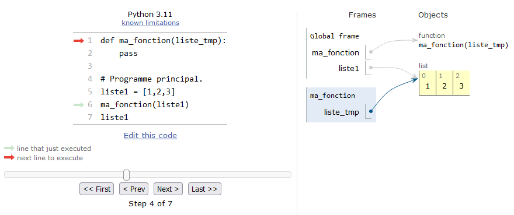

# Plus sur les fonctions

Avant d'aborder ce chapitre, nous vous conseillons de relire le chapitre 10 *Fonctions* et de bien en assimiler toutes les notions (et aussi d'en faire les exercices). Nous avons vu dans ce chapitre 10 le concept incontournable que représentent les **fonctions**. Nous avons également introduit la notion de variables **locales** et **globales**.

Dans ce chapitre, nous allons aller un peu plus loin sur la visibilité de ces variables dans et hors des fonctions, et aussi voir ce qui se passe lorsque ces variables sont des listes. Attention, la plupart des lignes de code ci-dessous sont données à titre d'exemple pour bien comprendre ce qui se passe, mais nombre d'entre elles sont des aberrations en terme de programmation. Nous ferons un récapitulatif des bonnes pratiques à la fin du chapitre. Enfin, nous vous conseillons de tester tous les exemples ci-dessous avec le site [*Python Tutor*](http://www.pythontutor.com/) afin de suivre l'état des variables lors de l'exécution des exemples.


## Appel d'une fonction dans une fonction

Dans le chapitre 10, nous avons vu des fonctions qui étaient appelées depuis le programme principal. Il est en fait possible d'appeler une fonction depuis une autre fonction. Et plus généralement, on peut appeler une fonction de n'importe où à partir du moment où elle est visible par Python (c'est-à-dire chargée dans la mémoire). Observez cet exemple :

```python
# Définition des fonctions.
def polynome(x):
    return (x**2 - 2*x + 1)

def calc_vals(debut, fin):
    liste_vals = []
    for x in range(debut, fin + 1):
        liste_vals.append(polynome(x))
    return liste_vals

# Programme principal.
print(calc_vals(-5, 5))
```

Nous appelons depuis le programme principal la fonction `calc_vals()`, puis à l'intérieur de celle-ci nous appelons l'autre fonction `polynome()`. Regardons ce que *Python Tutor* nous montre lorsque la fonction `polynome()` est exécutée dans la Figure @fig:appel_fct_ds_fct.

{ #fig:appel_fct_ds_fct width=90% }

L'espace mémoire alloué à `polynome()` est grisé, indiquant que cette fonction est en cours d'exécution. La fonction appelante `calc_vals()` est toujours là (sur un fond blanc) car son exécution n'est pas terminée. Elle est en quelque sorte *figée* dans le même état qu'avant l'appel de `polynome()`, et on pourra ainsi noter que ses variables *locales* (`debut`, `fin`, `liste_vals` et `x`) sont toujours là .
De manière générale, les variables *locales* d'une fonction ne seront détruites que lorsque l'exécution de celle-ci sera terminée. Dans notre exemple, les variables *locales* de `calc_vals()` ne seront détruites que lorsque la boucle sera terminée et que la liste `liste_vals` sera retournée au programme principal. Enfin, notez bien que la fonction `calc_vals()` appelle la fonction `polynome()` à chaque itération de la boucle.

Ainsi, le programmeur est libre de faire tous les appels qu'il souhaite. Une fonction peut appeler une autre fonction, cette dernière peut appeler une autre fonction et ainsi de suite (et autant de fois qu'on le veut). Une fonction peut même s'appeler elle-même, cela s'appelle une fonction *récursive* (voir la rubrique suivante). Attention toutefois à retrouver vos petits si vous vous perdez dans les appels successifs !


## Fonctions récursives

open-box-adv

Pour les débutants, vous pouvez passer cette rubrique.

close-box-adv

Une fonction récursive est une fonction qui s'appelle elle-même. Les fonctions récursives permettent d'obtenir une efficacité redoutable dans la résolution de certains algorithmes comme le [tri rapide](https://fr.wikipedia.org/wiki/Tri_rapide) (en anglais *quicksort*).

Oublions la recherche d'efficacité pour l'instant et concentrons-nous sur l'exemple de la fonction mathématique factorielle. Nous vous rappelons que la factorielle s'écrit avec un `!` et se définit de la manière suivante :

$$
\begin{split}
3! = & 3 \times 2 \times 1 = 6 \\
4! = & 4 \times 3 \times 2 \times 1 = 30 \\
n! = & n \times n - 1 \times \ldots \times 2 \times 1
\end{split}
$$

Voici le code Python avec une fonction récursive :

```python
def calc_factorielle(nb):
    if nb == 1:
        return 1
    else:
        return nb * calc_factorielle(nb - 1)

# Programme principal.
print(calc_factorielle(4))
```

Pas très facile à comprendre, n'est-ce pas ? À nouveau, nous nous aidons de *Python Tutor* pour visualiser ce qui se passe dans la figure @fig:fct-recursive-factorielle (nous vous conseillons bien sûr de tester vous-même cet exemple) :

{ #fig:fct-recursive-factorielle width=90% }

Ligne 8, on appelle la fonction `calc_factorielle()` en passant comme argument l'entier 4. Dans la fonction, la variable locale qui récupère cet argument est `nb`. Au sein de la fonction, celle-ci se rappelle elle-même (ligne 5), mais cette fois-ci en passant la valeur 3. Au prochain appel, ce sera avec la valeur 2, puis finalement 1. Dans ce dernier cas, le test `if nb == 1:` est vrai et l'instruction `return 1` sera exécutée. À ce moment précis de l'exécution, les appels successifs forment une sorte de *pile* (voir la figure @fig:fct-recursive-factorielle). La valeur 1 sera ainsi renvoyée au niveau de l'appel précédent, puis le résultat $2 \times 1 = 2$ (où 2 correspond à `nb` et 1 provient de `calc_factorielle(nb - 1)` soit 1) va être renvoyé à l'appel précédent, puis $3 \times 2 = 6$ (où 3 correspond à `nb` et 2 provient de `calc_factorielle(nb - 1)` soit 2) va être renvoyé à l'appel précédent, pour finir par $4 \times 6 = 24$ (où 4 correspond à `nb` et 6 provient de `calc_factorielle(nb - 1)` soit 6), soit la valeur de $4!$. Les appels successifs vont donc se « dépiler » et nous reviendrons dans le programme principal.

Même si les fonctions récursives peuvent être ardues à comprendre, notre propos est ici de vous illustrer qu'une fonction qui en appelle une autre (ici il s'agit d'elle-même) reste « figée » dans le même état, jusqu'à ce que la fonction appelée lui renvoie une valeur.


## Portée des variables

Il est très important lorsque l'on manipule des fonctions de connaître la portée des variables (*scope* en anglais), c'est-à-dire savoir là où elles sont visibles. On a vu que les variables créées au sein d'une fonction ne sont pas visibles à l'extérieur de celle-ci car elles étaient **locales** à la fonction. Observez le code suivant :

```python
>>> def ma_fonction():
...     x = 2
...     print(f"x vaut {x} dans la fonction")
...
>>> ma_fonction()
x vaut 2 dans la fonction
>>> print(x)
Traceback (most recent call last):
  File "<stdin>", line 1, in <module>
NameError: name 'x' is not defined
```

Lorsque Python exécute le code de la fonction, il connaît le contenu de la variable `x`. Par contre, de retour dans le module principal (dans ce cas, il s'agit de l'interpréteur Python), il ne la connaît plus, d'où le message d'erreur.

De même, une variable passée en argument est considérée comme **locale** lorsqu'on arrive dans la fonction:

```python
>>> def ma_fonction(x):
...     print(f"x vaut {x} dans la fonction")
...
>>> ma_fonction(2)
x vaut 2 dans la fonction
>>> print(x)
Traceback (most recent call last):
  File "<stdin>", line 1, in <module>
NameError: name 'x' is not defined
```

Lorsqu'une variable est déclarée dans le programme principal, elle est visible dans celui-ci ainsi que dans toutes les fonctions. On a vu qu'on parlait de variable **globale** :

```python
>>> def ma_fonction():
...     print(x)
...
>>> x = 3
>>> ma_fonction()
3
>>> print(x)
3
```

Dans ce cas, la variable `x` est visible dans le module principal et dans toutes les fonctions du module. Toutefois, Python ne permet pas la modification d'une variable globale dans une fonction:

```python
>>> def ma_fonction():
...     x = x + 1
...
>>> x = 1
>>> ma_fonction()
Traceback (most recent call last):
  File "<stdin>", line 1, in <module>
  File "<stdin>", line 2, in ma_fonction
UnboundLocalError: cannot access local variable 'x' where it is not associated with a value
```

L'erreur renvoyée montre que Python pense que `x` est une variable locale qui n'a pas été encore assignée. Si on veut vraiment modifier une variable globale dans une fonction, il faut utiliser le mot-clé `global` :

```python
>>> def ma_fonction():
...     global x
...     x = x + 1
...
>>> x = 1
>>> ma_fonction()
>>> x
2
```

Dans ce dernier cas, le mot-clé `global` a forcé la variable `x` à être globale plutôt que locale au sein de la fonction.


## Portée des listes

open-box-warn

Les exemples de cette partie représentent des absurdités en termes de programmation. Ils sont donnés à titre indicatif pour comprendre ce qui se passe, mais il ne faut surtout pas s'en inspirer !

close-box-warn

Soyez extrêmement attentifs avec les types modifiables (tels que les listes) car vous pouvez les changer au sein d'une fonction :

```python
>>> def ma_fonction():
...     liste1[1] = -127
...
>>> liste1 = [1,2,3]
>>> ma_fonction()
>>> liste1
[1, -127, 3]
```

De même, si vous passez une liste en argument, elle est modifiable au sein de la fonction :

```python
>>> def ma_fonction(liste_tmp):
...     liste_tmp[1] = -15
...
>>> liste1 = [1,2,3]
>>> ma_fonction(liste1)
>>> liste1
[1, -15, 3]
```

Pour bien comprendre l'origine de ce comportement, utilisons à nouveau le site [*Python Tutor*](http://www.pythontutor.com/). La figure @fig:fct_liste vous montre le mécanisme à l'oeuvre lorsqu'on passe une liste à une fonction.

{ #fig:fct_liste width=90% }

L'instruction `pass` dans la fonction est une instruction Python qui ne fait rien. Elle est là car une fonction ne peut être vide et doit contenir au moins une instruction Python valide.
 
On voit très clairement que la variable `liste1` passée en argument lors de l'appel de la fonction d'une part, et la variable locale `liste_tmp` au sein de la fonction d'autre part, **pointent vers le même objet dans la mémoire**. Ainsi, si on modifie `liste_tmp`, on modifie aussi `liste1`. C'est exactement le même mécanisme que pour la copie de listes (cf. rubrique 11.4 *Copie de listes* du chapitre 12 *Plus sur les listes*).

Si vous voulez éviter les problèmes de modification malencontreuse d'une liste dans une fonction, utilisez des tuples (ils ont présentés dans le chapitre 8 *Dictionnaires et tuples*), Python renverra une erreur car ces derniers sont non modifiables.

Une autre solution pour éviter la modification d'une liste, lorsqu'elle est passée comme argument à une fonction, est de la passer explicitement (comme nous l'avons fait pour la copie de liste) afin qu'elle reste intacte dans le programme principal.

```python
>>> def ma_fonction(liste_tmp):
...     liste_tmp[1] = -15
...
>>> liste1 = [1, 2, 3]
>>> ma_fonction(liste1[:])
>>> liste1
[1, 2, 3]
>>> ma_fonction(liste1(y))
>>> liste1
[1, 2, 3]
```

Dans ces deux derniers exemples, une copie de `y` est créée à la volée lorsqu'on appelle la fonction, ainsi la liste `y` du module principal reste intacte.

D'autres suggestions sur l'envoi de liste dans une fonction vous sont données dans la rubrique *Recommandations* ci-dessous.

## Règle LGI

Lorsque Python rencontre une variable, il va traiter la résolution de son  nom avec des priorités particulières. D'abord il va regarder si la variable est **locale**, puis si elle n'existe pas localement, il vérifiera si elle est **globale** et enfin si elle n'est pas globale, il testera si elle est **interne** (par exemple la fonction `len()` est considérée comme une fonction interne à Python, elle existe à chaque fois que vous lancez Python). On appelle cette règle la règle **LGI** pour locale, globale, interne. En voici un exemple :

```python
>>> def ma_fonction():
...     x = 4
...     print(f"Dans la fonction x vaut {x}")
...
>>> x = -15
>>> ma_fonction() 
Dans la fonction x vaut  4
>>> print(f"Dans le module principal x vaut {x}")
Dans le module principal x vaut -15
```

Dans la fonction, `x` a pris la valeur qui lui était définie localement en priorité sur la valeur définie dans le module principal.

open-box-adv

Même si Python peut reconnaître une variable ayant le même nom que ses propres fonctions ou variables internes, évitez de les utiliser car ceci rendra votre code confus !

close-box-adv

De manière générale la règle LGI découle de la manière dont Python gère ce que l'on appelle « les espaces de noms ». C'est cette gestion qui définit la portée (visibilité) de chaque variable. Nous en parlerons plus longuement dans le chapitre 24 *Avoir plus la classe avec les objets* (en ligne).

## Fonction `map()`

La fonction `map()` permet d'appliquer une fonction à plusieurs éléments d'un objet itérable. Par exemple, si on une chaîne de caractères avec 3 entiers séparés par des espaces, on peut convertir les trois en une seule ligne de commande. Comme la fonction *zip* vu au chapitre 12 *Plus sur les listes*, cela produit un objet *map* qui est itérable ou que l'on peut transformer en liste.

```python
>>> ligne = "67 946   -45"
>>> ligne.split()
['67', '946', '-45']
>>> map(int, ligne.split())
<map object at 0x7fa34e573b20>
>>> for entier in map(int, ligne.split()):
...    print(entier)
...
67
946
-45
>>> list(map(int, ligne.split()))
[67, 946, -45]
```

Cette fonction est particulièrement utile lorsqu'on lit un fichier de valeurs numériques. Par exemple, si on a un fichier `data.dat` contenant trois colonnes de *floats*, `map()` permet de transformer en *float* les trois nombre en une ligne de code.

```python
with open("data.dat", "r") as f:
    for line in f:
        x, y, z = map(float, line.split())
        print(x + y + z)
```

Sans `map()`, il aurait fallu une ligne pour séparer les données `x, y, z = line.split()` et une autre pour les transformer en *float* `x, y, z = float(x), float(y), float(z)`.

## Recommandations

### Évitez les variables globales

Dans ce chapitre nous avons *joué* avec les fonctions (et les listes) afin de vous montrer comment Python réagissait. Toutefois, notez bien que **l'utilisation de variables globales est à bannir définitivement de votre pratique de la programmation**.

Parfois on veut faire vite et on crée une variable globale visible partout dans le programme (donc dans toutes les fonctions), car « *Ça va plus vite, c'est plus simple* ». C'est un très mauvais calcul, ne serait-ce que parce que vos fonctions ne seront pas réutilisables dans un autre contexte si elles utilisent des variables globales ! Ensuite, arriverez-vous à vous relire dans six mois ? Quelqu'un d'autre pourrait-il comprendre votre programme ? Il existe de nombreuses autres [raisons](http://wiki.c2.com/?GlobalVariablesAreBad) que nous ne développerons pas ici, mais libre à vous de consulter de la documentation externe.

Heureusement, Python est orienté objet et permet « d'encapsuler » des variables dans des objets et de s'affranchir définitivement des variables globales (nous verrons cela dans le chapitre 23 *Avoir la classe avec les objets*). En attendant, et si vous ne souhaitez pas aller plus loin sur les notions d'objet (on peut tout à fait « pythonner » sans cela), retenez la chose suivante sur les fonctions et les variables globales :

open-box-adv

Plutôt que d'utiliser des variables globales, passez vos variables explicitement aux fonctions comme des argument(s).

close-box-adv

### Modification d'une liste dans une fonction

Concernant les fonctions qui modifient une liste, nous vous conseillons de l'indiquer clairement dans votre code. Pour cela, faites en sorte que la fonction renvoie la liste modifiée et de récupérer cette liste renvoyée dans une variable portant le même nom. Par exemple :

```python
def ajoute_un(liste):
    for indice in range(len(liste)):
        liste[indice] += 1
    return liste

# Programme principal.
liste_notes = [10, 8, 16, 7, 15]
liste_notes = ajoute_un(liste_notes)
print(liste_notes)
```

La ligne 8 indique que la liste `liste_notes` passée à la fonction est écrasée par la liste renvoyée par la fonction. 

Le code suivant produirait la même sortie :

```python
def ajoute_un(liste):
    for indice in range(len(liste)):
        liste[indice] += 1

# Programme principal.
liste_notes = [10, 8, 16, 7, 15]
ajoute_un(liste_notes)
print(liste_notes)
```

Cela reste toutefois moins intuitif car il n'est pas évident de comprendre que la liste est modifiée dans la fonction en lisant la ligne 7. Dans un tel cas, il serait essentiel d'indiquer dans la documentation de la fonction que la liste est modifiée « sur place »  (*in place* en anglais) dans la fonction. Vous verrez dans le chapitre 15 *Création de modules* comment documenter vos fonctions.

open-box-adv

Pour les raisons évoquées ci-dessus, nous vous conseillons de privilégier la première version :

```python
liste_notes = ajoute_un(liste_notes)
```

close-box-adv

### Conclusion

Vous connaissez maintenant les fonctions sous tous leurs angles. Comme indiqué en introduction du chapitre 10, elles sont incontournables et tout programmeur se doit de les maîtriser. Voici les derniers conseils que nous pouvons vous donner :

- Lorsque vous débutez un nouveau projet de programmation, posez-vous la question : « Comment pourrais-je décomposer en blocs chaque tâche à effectuer, chaque bloc pouvant être une fonction ? ». Et n'oubliez pas que si une fonction s'avère trop complexe, vous pouvez la décomposer en d'autres fonctions.

- Au risque de nous répéter, forcez-vous à utiliser des fonctions en permanence. Pratiquez, pratiquez... et pratiquez encore !


## Exercices

open-box-adv

pour le second exercice, créez un script puis exécutez-le dans un *shell*.

close-box-adv


### Prédire la sortie

Prédisez le comportement des codes suivants, sans les recopier dans un script ni dans l'interpréteur Python :

#### Code 1

```python
def hello(prenom):
    print(f"Bonjour {prenom}")


# Programme principal.
hello("Patrick")
print(x)
```

#### Code 2

```python
def hello(prenom):
    print(f"Bonjour {prenom}")


# Programme principal.
x = 10
hello("Patrick")
print(x)
```

#### Code 3

```python
def hello(prenom):
    print(f"Bonjour {prenom}")
    print(x)


# Programme principal.
x = 10
hello("Patrick")
print(x)
```

#### Code 4

```python
def hello(prenom):
    x = 42
    print(f"Bonjour {prenom}")
    print(x)


# Programme principal.
x = 10
hello("Patrick")
print(x)
```

### Passage de liste à une fonction

Créez une fonction `ajoute_nb_alea()` qui prend en argument une liste et qui ajoute un nombre entier aléatoire entre -10 et 10 (inclus) à chaque élément. La fonction affichera à l'écran cette nouvelle liste modifiée.

Dans le programme principal, on effectuera les actions suivantes :

1. Créez une variable `ma_liste = [7, 3, 8, 4, 5, 1, 9, 10, 2, 6]`.
2. Affichez `ma_liste` à l'écran.
3. Appelez la fonction `ajoute_nb_alea()` en lui passant `ma_liste` en argument.
4. Affichez à nouveau `ma_liste` à l'écran.

Comment expliquez-vous le résultat obtenu ?

