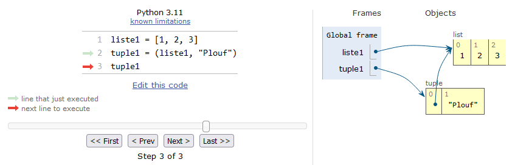

# Conteneurs

Dans ce chapitre nous allons voir trois nouveaux types d'objet qui s'avèrent extrêmement utiles : les dictionnaires, les tuples et les *sets*. Comme les listes ou les chaînes de caractères, ces trois nouveaux types sont appelés communémement des **containers**. Avant d'aborder en détail ces nouveaux types, nous allons définir les containers et leurs propriétés.

## Containers

### Définition

open-box-def

Un **container** est un nom générique pour définir un objet Python qui contient une collection d'autres objets. 

close-box-def

Les containers que nous connaissons depuis le début de ce cours sont les listes et les chaînes de caractères. Même si on ne l'a pas vu explicitement, les objets de type *range* sont également des containers.

Dans la section suivante, nous allons examiner les différentes propriétés des containers. A la fin de ce chapitre, nous ferons un tableau récapitulatif de ces propriétés.

### Propriétés

Examinons d'abord les propriétés qui caractérisent tous les types de container.

- Capacité à supporter le **test d'appartenance**. Souvenez-vous, il permettait de vérifier si un élément était présent dans une liste. Cela fonctionne donc aussi sur les chaînes de caractères ou tout autre container :

```python
>>> l = [1, 2, 3]
>>> 1 in l
True
>>> "to" in "toto"
True
```

- Capacité à supporter la fonction `len()` renvoyant la longueur du container.

Voici d'autres propriétés générales que nous avons déjà croisées. Un container peut être :

- **ordonné** (*ordered* en anglais) : il y a un ordre précis des éléments ; cet ordre correspond à celui utilisé lors de la création ou de la modification du container (si cela est permis) ; ce même ordre est utilisé lorqu'on itère dessus ;
- **indexable** (*subscriptable* en anglais) : on peut retrouver un élément par son indice (i.e. sa position dans le container) ou plusieurs éléments avec une tranche ; en général, tout container indexable est ordonné ; 
- **itérable** (*iterable* en anglais) : on peut faire une boucle dessus. 

Certains containers sont appelés objets séquentiels ou séquence.

open-box-def

Un **objet séquentiel** ou **séquence** est un container itérable, ordonné et indexable. Les objets séquentiels sont les listes, les chaînes de caractères, les objets de type *range*, ainsi que les tuples (cf. plus bas).

close-box-def

Une autre propriété importante que l'on a déjà croisée et qui nous servira dans ce chapitre concerne la possiblité ou non de modifier un objet.

- Un objet est dit **non modifiable** lorsqu'on ne peut pas le modifier, ou lorsqu'on ne peut pas en modifier un de ses éléments si c'est un container. On parle aussi d'[objet immuable](https://fr.wikipedia.org/wiki/Objet_immuable) (*immutable object* en anglais). Cela signifie qu'une fois créé, Python ne permet plus de le modifier par la suite.

Qu'en est-il des objets que nous connaissons ? Les listes sont modifiables, on peut modifier un ou plusieurs de ses éléments. Tous les autres types que nous avons vus précédemment sont quant à eux non modifiables : les chaînes de caractères ou *strings*, les objets de type *range*, mais également des objets qui ne sont pas des containers comme les entiers, les *floats* et les booléens. 

On comprend bien l'immutabilité des *strings* comme vu au chapitre 10, mais c'est moins évident pour les entiers, *floats* ou booléens. Nous allons démontrer cela, mais avant nous avons besoin de définir la notion d'identifiant d'un objet.

open-box-def

L'**identifiant** d'un objet est un nombre entier qui est garanti constant pendant toute la durée de vie de l'objet. Cet identifiant est en général unique pour chaque objet. Toutefois, pour des raisons d'optimisation, Python crée parfois le même identifiant pour deux objets non modifiables différents qui ont la même valeur. L'identifiant peut être assimilé à l'adresse mémoire de l'objet qui elle aussi est unique. En Python, on utilise la fonction interne `id()` qui prend en argument un objet et renvoie son identifiant.

close-box-def

Maintenant que l'identifiant est défini, regardons l'exemple suivant qui montre l'immutabilité des entiers.

```python
>>> a = 4
>>> id(a)
140318876873440
>>> a = 5
>>> id(a)
140318876873472
```

En ligne 1 on définit l'entier `a` puis on regarde son identifiant. En ligne 4, on pourrait penser que l'on modifie `a`. Toutefois, on voit que son identifiant en ligne 6 est différent de la ligne 3. En fait, l'affectation en ligne 4 `a = 5` écrase l'ancienne variable `a` et en crée une nouvelle, ce n'est pas la valeur de `a` qui a été changée puisque l'identifiant n'est plus le même. Le même raisonnement peut être tenu pour les autres types numériques comme les *floats* et booléens. Si on regarde maintenant ce qu'il se passe pour une liste :

```python
>>> l = [1, 2, 3]
>>> id(l)
140318850324832
>>> l[1] = -15
>>> id(l)
140318850324832
>>> l.append(5)
>>> id(l)
140318850324832
```

La liste `l` a été modifiée en ligne 4 (changement de l'élément d'indice 1) et en ligne 7 (ajout d'un élément). Pour autant, l'identifiant de cette liste est resté identique tout du long. Ceci démontre la mutabilité des listes : quelle que soit la manière dont on modifie une liste, celle-ci garde le même identifiant.

- Une dernière propriété importante est la capacité d'un container (ou tout autre objet Python) à être **hachable**.

open-box-def

Un objet Python est dit **hachable** (*hashable* en anglais) s'il est possible de calculer une valeur de hachage sur celui-ci avec la fonction interne `hash()`. En programmation, la valeur de hachage peut être vue comme une empreinte numérique de l'objet. Elle est obtenue en passant l'objet dans une fonction de hachage et dépend du contenu de l'objet. En Python, cette empreinte est comme dans la plupart des langages de programmation un entier. Au sein d'une même session Python, deux objets hachables qui ont un contenu identique auront strictement la même valeur de hachage.

close-box-def

open-box-warn

La valeur de hachage d'un objet renvoyée par la fonction `hash()` n'a pas le même sens que son identifiant renvoyé par la fonction `id()`. La valeur de hachage est obtenue en « moulinant » le contenu de l'objet dans une fonction de hachage. L'identifiant est quant à lui attribué par Python à la création de l'objet. Il est constant tout le le long de la durée de vie de l'objet, un peu comme une carte d'identité. Tout objet a un un identifiant, mais il doit être hachable pour avoir une valeur de hachage.

close-box-warn

open-box-more

Pour aller plus loin, vous pouvez consulter la [page Wikipedia sur les fonctions de hachage](https://fr.wikipedia.org/wiki/Fonction_de_hachage). 

close-box-more

Pourquoi évoquer cette propriété de hachabilité ? D'abord, parce-qu'elle est étroitement liée à l'immutabilité. En effet, un objet non modifiable est la plupart du temps hachable. Cela permet de l'identifier **en fonction de son contenu**. Par ailleurs, l'hachabilité est une implémentation qui permet un accès rapide aux éléments des containers de type dictionnaire ou *set* (cf. rubriques suivantes).

Les objets hachables sont les chaînes de caractères, les entiers, les *floats*, les booléens, les objets de type *range*, les tuples (sous certaines conditions) et les *frozensets* ; par contre, les listes, les *sets* et les dictionnaires sont non hachables. Les dictionnaires, tuples, *sets* et *frozensets* seront vus plus bas dans ce chapitre.

Voici un exemple :

```python
>>> hash("Plouf")
5085648805260210718
>>> hash(5)
5
>>> hash(3.14)
322818021289917443
>>> hash([1, 2, 3])
Traceback (most recent call last):
  File "<stdin>", line 1, in <module>
TypeError: unhashable type: 'list'
```

Les valeurs de hachage renvoyées par la fonction `hash()` de Python sont systématiquement des entiers. Par contre, Python renvoie une erreur pour une liste car elle est non hachable.

### Containers de type *range*

Revenons rapidement sur les objets de type *range*. Jusqu'à maintenant, on s'en est servi pour faire des boucles ou générer des listes de nombres. Toutefois, on a vu ci-dessus qu'ils étaient aussi des containers. Ils sont ordonnés, indexables, itérables, hachables et non modifiables.

```python
>>> r = range(3)
>>> r[0]
0
>>> r[0:1]
range(0, 1)
>>> for i in r:
...     print(i)
...
0
1
2
>>> r[2] = 10
Traceback (most recent call last):
  File "<stdin>", line 1, in <module>
TypeError: 'range' object does not support item assignment
>>> hash(r)
5050907061201647097
```

La tentative de modification d'un élément en ligne 12 conduit à la même erreur que lorsqu'on essaie de modifier un caractère d'une chaîne de caractères. Comme pour la plupart des objets Python non modifiables, les objets de type *range* sont hachables.

# Ici il y avait les rubriques dico et tuples
# Ici il y avait les rubriques dico et tuples
# Ici il y avait les rubriques dico et tuples
# Ici il y avait les rubriques dico et tuples
# Ici il y avait les rubriques dico et tuples

### Affectation multiple et le nom de variable `_`

L'affectation multiple est un mécanisme très puissant et important en Python. Pour rappel, il permet d'effectuer sur une même ligne plusieurs affectations en même temps, par exemple : `x, y, z = 1, 2, 3`. Cette syntaxe correspond à un *tuple* de chaque côté de l'opérateur `=`. Notez qu'il serait possible de le faire également avec les listes : `[x, y, z] = [1, 2, 3]`. Toutefois, cette syntaxe est alourdie par la présence des crochets. On préfèrera donc la première syntaxe avec les *tuples* sans parenthèse.

open-box-rem

Nous avons appelé l'opération `x, y, z = 1, 2, 3` affectation multiple pour signifier que l'on affectait des valeurs à plusieurs variables en même temps. Toutefois, vous pourrez rencontrer aussi l'expression *tuple unpacking* que l'on pourrait traduire par « désempaquetage de tuple ». Cela signifie que l'on décompose le *tuple* initial `1, 2, 3` en 3 variables différentes.

close-box-rem

Nous avions croisé l'importance de l'affectation multiple dans le chapitre 9 *Fonctions* lorsqu'une fonction renvoyait plusieurs valeurs.

```python
>>> def ma_fonction():
...     return 3, 14
...
>>> x, y = ma_fonction()
>>> print(x, y)
3 14
```

La syntaxe `x, y = ma_fonction()` permet de récupérer les 2 valeurs renvoyées par la fonction et de les affecter à la volée dans 2 variables différentes. Cela évite l'opération laborieuse de récupérer d'abord le tuple, puis de créer les variables en utilisant l'indiçage :

```python
>>> resultat = ma_fonction()
>>> resultat
(3, 14)
>>> x = resultat[0]
>>> y = resultat[1]
>>> print(x, y)
3 14
```

open-box-adv

Lorsqu'une fonction renvoie plusieurs valeurs sous forme de tuple, ce sera bien sûr la forme `x, y = ma_fonction()` qui sera privilégiée.

close-box-adv

Quand une fonction renvoie plusieurs valeurs mais que l'on ne souhaite pas les utiliser toutes dans la suite du code, on peut utiliser le nom de variable `_` (caractère *underscore*) pour indiquer que certaines valeurs ne nous intéressent pas :

```python
>>> def ma_fonction():
...     return 1, 2, 3, 4
...
>>> x, _, y, _ = ma_fonction()
>>> x
1
>>> y
3
```

Cela envoie le message à celui qui lit le code « je me fiche des valeurs récupérées dans ces variables `_` ». Notez que l'on peut utiliser une ou plusieurs variables *underscores(s)*. Dans l'exemple ci-dessus, la 2e et la 4e variable renvoyées par la fonction seront ignorées dans la suite du code. Cela a le mérite d'éviter de polluer l'attention du lecteur du code.

open-box-rem

Dans l'interpréteur interactif, la variable `_` a une signication différente. Elle prend automatiquement la dernière valeur affichée :

```python
>>> 3
3
>>> _
3
>>> "mésange"
'mésange'
>>> _
'mésange'
```

Attention, cela n'est vrai que dans l'interpréteur !

close-box-rem

open-box-rem

Le caractère *underscore* (`_`) est couramment utilisé dans les noms de variable pour séparer les mots et être explicite, par exemple `seq_ADN` ou `liste_listes_residus`. On verra dans le chapitre 15 *Bonnes pratiques en programmation Python* que ce style de nommage est appelé *snake_case*. Toutefois, il faut éviter d'utiliser les *underscores* en début et/ou en fin de nom de variable (par exemple : `_var`, `var_`, `__var`, `__var__`). On verra au chapitre 19 *Avoir la classe avec les objets* que ces *underscores* ont aussi une signification particulière.

close-box-rem

### Tuples contenant des listes

*Conseil* : pour les débutants, vous pouvez passer cette rubrique.

On a vu que les tuples étaient **non modifiables**. Que se passe-t-il alors si on crée un tuple contenant des objets modifiables comme des listes ? Examinons le code suivant :

```python
>>> l1 = [1, 2, 3]
>>> t = (l1, "Plouf")
>>> t
([1, 2, 3], 'Plouf')
>>> l1[0] = -15
>>> t[0].append(-632)
>>> t
([-15, 2, 3, -632], 'Plouf')
```

On voit que si on modifie un élément de la liste `l1` en ligne 5 ou bien qu'on ajoute un élément à `t[0]` en ligne 6, Python s'exécute et ne renvoie pas de message d'erreur. Or nous avions dit qu'un tuple était non modifiable... Comment cela-est il possible ? Commençons d'abord par regarder comment les objets sont agencés avec *Python Tutor*.

{ #fig:tuple_de_listes width=90% }

La liste `l1` pointe vers le même objet que l'élément du tuple d'indice 0. Comme pour la copie de liste (par exemple `liste1 = liste2`), ceci est attendu car par défaut Python crée une copie par référence (cf. Chapitre 11 *Plus sur les listes*). Donc, qu'on raisonne en tant que premier élément du tuple ou bien en tant que liste `l1`, on pointe vers **la même liste**. Or, rappelez-vous, au début de ce chapitre nous avons expliqué que lorsqu'on modifiait un élément d'une liste, celle-ci gardait le même identifiant. C'est toujours le cas ici, même si celle-ci se trouve dans un tuple. Regardons cela :

```python
>>> l1 = [1, 2, 3]
>>> t = (l1, "Plouf")
>>> t
([1, 2, 3], 'Plouf')
>>> id(l1)
139971081980816
>>> id(t[0])
139971081980816
```

Nous confirmons ici le schéma de *Python Tutor*, c'est bien la même liste que l'on considère `l1` ou `t[0]` puisqu'on a le même identifiant. Maintenant, on modifie cette liste via la variable `l1` ou `t[0]` :

```python
>>> l1[2] = -15
>>> t[0].append(-632)
>>> t
([1, 2, -15, -632], 'Plouf')
>>> id(l1)
139971081980816
>>> id(t[0])
139971081980816
```

Malgré la modification de cette liste, l'identifiant n'a toujours pas changé puisque la fonction `id()` nous renvoie toujours le même depuis le début. Ainsi, nous avons l'explication. Même si la liste a été modifiée « de l'intérieur », Python considère que c'est toujours la même liste puisqu'elle n'a pas changé d'identifiant. Si au contraire on essaie de remplacer cette sous-liste par autre chose, Python renvoie une erreur :

```python
>>> t[0] = "Plif"
Traceback (most recent call last):
  File "<stdin>", line 1, in <module>
TypeError: 'tuple' object does not support item assignment
```

Ceci est dû au fait que le nouvel objet `"Plif"` n'a pas le même identifiant que la sous-liste initiale. En fait, l'immutabilité selon Python signifie qu'un objet créé doit toujours garder le même identifiant. Cela est valable pour tout objet non modifiable, comme un élément d'un tuple, un caractère dans une chaîne de caractères, etc.

open-box-adv

Nous avons fait une petite digression ici afin que vous compreniez bien ce qu'il se passe lorsqu'on met une liste dans un tuple. Toutefois, pouvoir modifier une liste en tant qu'élément d'un tuple va à l'encontre de l'intérêt d'un objet non modifiable. Ainsi, dans la mesure du possible, nous vous déconseillons de créer des listes dans des tuples afin d'éviter les déconvenues.

close-box-adv

### Hachabilité des tuples

*Conseil* : pour les débutants, vous pouvez passer cette rubrique.

Les tuples sont hachables s'ils ne contiennent que des éléments hachables. Si un tuple contient un ou plusieurs objet(s) non hachable(s) comme une liste, il devient non hachable.

```python
>>> t = tuple(range(10))
>>> t
(0, 1, 2, 3, 4, 5, 6, 7, 8, 9)
>>> hash(t)
-4181190870548101704
>>> t2 = ("Plouf", 2, (1, 3))
>>> t2
('Plouf', 2, (1, 3))
>>> hash(t2)
286288423668065022
>>> t3 = (1, (3, 4), "Plaf", [3, 4, 5])
>>> t3
(1, (3, 4), 'Plaf', [3, 4, 5])
>>> hash(t3)
Traceback (most recent call last):
  File "<stdin>", line 1, in <module>
TypeError: unhashable type: 'list'
```

Les tuples `t` et `t2` sont hachables car ils ne contiennent que des éléments hachables. Par contre, `t3` ne l'est pas car un de ses éléments est une liste.

open-box-adv

Mettre une ou des liste(s) dans un tuple a cette autre conséquence néfaste de le rendre non hachable. Ceci le rend inutilisable comme clé de dictionnaire ou, on le verra ci-après, comme élément d'un *set* ou d'un *frozenset*. Donc, à nouveau, ne mettez pas de listes dans vos tuples !

close-box-adv

## *Sets* et *frozensets*

### Définition et propriétés

Les objets de type *set* représentent un autre type de container qui peut se révéler très pratique. Ils ont la particularité d'être modifiables, non hachables, non ordonnés, non indexables et de ne contenir qu'une seule copie maximum de chaque élément. Pour créer un nouveau *set* on peut utiliser les accolades :

```python
>>> s = {4, 5, 5, 12}
>>> s
{12, 4, 5}
>>> type(s)
<class 'set'>
```

Remarquez que la répétition du 5 dans la définition du *set* en ligne 1 donne au final un seul 5 car chaque élément ne peut être présent qu'une seule fois. Comme pour les dictionnaires (jusqu'à la version 3.6), les *sets* sont non ordonnés. La manière dont Python les affiche n'a pas de sens en tant que tel et peut être différente de celle utilisée lors de leur création.

Les *sets* ne peuvent contenir que des objets **hachables**. On a déjà eu le cas avec les clés de dictionnaire. Ceci optimise l'accès à chaque élément du *set*. Pour rappel, les objets hachables que nous connaissons sont les chaînes de caractères, les tuples, les entiers, les *floats*, les booléens et les *frozensets* (cf. plus bas) ; les objets non hachables que l'on connait sont les listes, les *sets* et les dictionnaires. Si on essaie tout de même de mettre une liste dans un *set*, Python renvoie une erreur :

```python
>>> s = {3, 4, "Plouf", (1, 3)}
>>> s
{(1, 3), 3, 4, 'Plouf'}
>>> s2 = {3.14, [1, 2]}
Traceback (most recent call last):
  File "<stdin>", line 1, in <module>
TypeError: unhashable type: 'list'
```

À quoi différencie-t-on un *set* d'un dictionnaire alors que les deux utilisent des accolades ? Le *set* sera défini seulement par des valeurs `{valeur_1, valeur_2, ...}` alors que le dictionnaire aura toujours des couples clé:valeur `{clé_1: valeur_1, clé_2: valeur_2, ...}`.

La fonction interne à Python `set()` convertit un objet itérable passé en argument en un nouveau *set* (opération de *casting*) :

```python
>>> set([1, 2, 4, 1])
{1, 2, 4}
>>> set((2, 2, 2, 1))
{1, 2}
>>> set(range(5))
{0, 1, 2, 3, 4}
>>> set({"clé_1": 1, "clé_2": 2})
{'clé_1', 'clé_2'}
>>> set(["ti", "to", "to"])
{'ti', 'to'}
>>> set("Maître corbeau sur un arbre perché")
{'h', 'u', 'o', 'b', ' ', 'M', 'a', 'p', 'n', 'e', 'é', 'c', 'î', 's', 't', 'r'}
```

Nous avons dit plus haut que les *sets* ne sont pas ordonnés ni indexables, il est donc impossible de récupérer un élément par sa position. Il est également impossible de modifier un de ses éléments par l'indexation.

```python
>>> s = set([1, 2, 4, 1])
>>> s[1]
Traceback (most recent call last):
  File "<stdin>", line 1, in <module>
TypeError: 'set' object is not subscriptable
>>> s[1] = 5
Traceback (most recent call last):
  File "<stdin>", line 1, in <module>
TypeError: 'set' object does not support item assignment
```

Par contre, les *sets* sont itérables :

```python
>>> for element in s:
...     print(element)
...
1
2
4
```

Les *sets* ne peuvent être modifiés que par des méthodes spécifiques. 

```python
>>> s = set(range(5))
>>> s
{0, 1, 2, 3, 4}
>>> s.add(4)
>>> s
{0, 1, 2, 3, 4}
>>> s.add(472)
>>> s
{0, 1, 2, 3, 4, 472}
>>> s.discard(0)
>>> s
{1, 2, 3, 4, 472}
```

La méthode `.add()` ajoute au *set* l'élément passé en argument. Toutefois, si l'élément est déjà présent dans le *set*, il n'est pas ajouté puisqu'on a au plus une copie de chaque élément. La méthode `.discard()` retire du *set* l'élément passé en argument. Si l'élément n'est pas présent dans le *set*, il ne se passe rien, le *set* reste intact. Comme les *sets* ne sont pas ordonnés ni indexables, il n'y a pas de méthode pour insérer un élément à une position précise contrairement aux listes. Dernier point sur ces méthodes, elles modifient le *set* sur place (*in place* en anglais) et ne renvoient rien à l'instar des méthodes des listes (`.append()`, `.remove()`, etc.).

Enfin, les *sets* ne supportent pas les opérateurs `+` et `*`.

### Utilité

Les containers de type *set* sont très utiles pour rechercher les éléments uniques d'une suite d'éléments. Cela revient à éliminer tous les doublons. Par exemple :

```python
>>> import random
>>> liste = [random.randint(0, 9) for i in range(10)]
>>> liste
[7, 9, 6, 6, 7, 3, 8, 5, 6, 7]
>>> set(liste)
{3, 5, 6, 7, 8, 9}
```

On peut bien sûr transformer dans l'autre sens un *set* en liste. Cela permet par exemple d'éliminer les doublons de la liste initiale tout en récupérant une liste à la fin :

```python
>>> list(set([7, 9, 6, 6, 7, 3, 8, 5, 6, 7]))
[3, 5, 6, 7, 8, 9]
```

On peut faire des choses très puissantes. Par exemple, un compteur de lettres en combinaison avec une liste de compréhension, le tout en une ligne !
 
```python
>>> seq = "atctcgatcgatcgcgctagctagctcgccatacgtacgactacgt"
>>> set(seq)
{'c', 'g', 't', 'a'}
>>> [(base, seq.count(base)) for base in set(seq)]
[('c', 15), ('g', 10), ('t', 11), ('a', 10)]
```

Les *sets* permettent aussi l'évaluation d'union ou d'intersection mathématiques en conjonction avec les opérateurs respectivement `|` et `&` :

```python
>>> liste_1 = [3, 3, 5, 1, 3, 4, 1, 1, 4, 4]
>>> liste_2 = [3, 0, 5, 3, 3, 1, 1, 1, 2, 2]
>>> set(liste_1) | set(liste_2)
{0, 1, 2, 3, 4, 5}
>>> set(liste_1) & set(liste_2)
{1, 3, 5}
```

Notez qu'il existe des méthodes permettant de réaliser ces opérations d'union et d'intersection :

```python
>>> s1 = {1, 3, 4, 5}
>>> s2 = {0, 1, 2, 3, 5}
>>> s1.union(s2)
{0, 1, 2, 3, 4, 5}
>>> s1.intersection(s2)
{1, 3, 5}
```

L'instruction `s1.difference(s2)` renvoie sous la forme d'un nouveau *set* les éléments de `s1` qui ne sont pas dans `s2`. Et vice-versa pour `s2.difference(s1)`.

```python
>>> s1.difference(s2)
{4}
>>> s2.difference(s1)
{0, 2}
```

Enfin, deux autres méthodes sont très utiles :

```python
>>> s1 = set(range(10))
>>> s2 = set(range(3, 7))
>>> s3 = set(range(15, 17))
>>> s1
{0, 1, 2, 3, 4, 5, 6, 7, 8, 9}
>>> s2
{3, 4, 5, 6}
>>> s3
{16, 15}
>>> s2.issubset(s1)
True
>>> s3.isdisjoint(s1)
True
```

La méthode `.issubset()` indique si un *set* est inclus dans un autre *set*. La méthode `isdisjoint()` indique si un *set* est disjoint d'un autre *set*, c'est-à-dire, s'ils n'ont aucun élément en commun indiquant que leur intersection est nulle.

Il existe de nombreuses autres méthodes que nous n'abordons pas ici mais qui peuvent être consultées sur la [documentation officielle de Python](https://docs.python.org/3/library/stdtypes.html#set-types-set-frozenset).

### *Frozensets*

Les *frozensets* sont des *sets* non modifiables et hachables. Ainsi, un *set* peut contenir des *frozensets* mais pas l'inverse. A quoi servent-ils ? Comme la différence entre tuple et liste, l'immutabilité des *frozensets* donne l'assurance de ne pas pouvoir les modifier par erreur. Pour créer un *frozenset* on utilise la fonction interne `frozenset()` qui prend en argument un objet itérable et le convertit (opération de *casting*) :

```python
>>> f1 = frozenset([3, 3, 5, 1, 3, 4, 1, 1, 4, 4])
>>> f2 = frozenset([3, 0, 5, 3, 3, 1, 1, 1, 2, 2])
>>> f1
frozenset({1, 3, 4, 5})
>>> f2
frozenset({0, 1, 2, 3, 5})
>>> f1.add(5)
Traceback (most recent call last):
  File "<stdin>", line 1, in <module>
AttributeError: 'frozenset' object has no attribute 'add'
>>> f1.union(f2)
frozenset({0, 1, 2, 3, 4, 5})
>>> f1.intersection(f2)
frozenset({1, 3, 5})
```

Les *frozensets* ne possèdent bien sûr pas les méthodes de modification des *sets* (`.add()`, `.discard()`, etc.) puisqu'ils sont non modifiables. Par contre, ils possèdent toutes les méthodes de comparaisons de *sets* (`.union()`, `.intersection()`, etc.).

open-box-adv

Pour aller plus loin sur les *sets* et les *frozensets*, voici deux articles sur les sites [programiz](https://www.programiz.com/python-programming/set) et [towardsdatascience](https://towardsdatascience.com/python-sets-and-set-theory-2ace093d1607).

close-box-adv

## Récapitulation des propriétés des containers

Après ce tour d'horizon des différents containers, voici un tableau récapitulant leurs propriétés. La mention « `in` et `len()` » indique que l'on peut tester l'appartenance d'un élément à un container avec l'opérateur `in` et que l'on peut connaître le nombre d'éléments du container avec la fonction `len()`. Les mentions « index. » et « modif. » indiquent « indexable » et « modifiable ».

### Objets séquentiels

| Container             | `in` et `len()` | itérable | ordonné | index. | modif. | hachable |
|:----------------------|:---------------:|:--------:|:-------:|:------:|:------:|:--------:|
| liste                 | oui             | oui      | oui     | oui    | oui    | non      |
| chaîne de caractères  | oui             | oui      | oui     | oui    | non    | oui      |
| *range*               | oui             | oui      | oui     | oui    | non    | oui      |
| tuple                 | oui             | oui      | oui     | oui    | non    | oui$^*$  |


$^*$ s'il ne contient que des objets hachables


### Objects de *mapping*

| Container             | `in` et `len()` | itérable         | ordonné  | index. | modif. | hachable |
|:----------------------|:---------------:|:----------------:|:--------:|:------:|:------:|:--------:|
| dictionnaire          | oui             | oui sur les clés | oui$^*$  | non    | oui    | non      |

$^*$ à partir de Python 3.7 uniquement


### Objets *sets*

| Container             | `in` et `len()` | itérable | ordonné | index. | modif. | hachable |
|:----------------------|:---------------:|:--------:|:-------:|:------:|:------:|:--------:|
| *sets*                | oui             | oui      | non     | non    | oui    | non      |
| *frozensets*          | oui             | oui      | non     | non    | non    | oui      |


### Types de base

Il est aussi intéressant de comparer ces propriétés avec celles des types numériques de base qui ne sont pas des containers.

| Objet numérique | `in` et `len()` | itérable | ordonné | index. | modif. | hachable |
|:----------------|:---------------:|:--------:|:-------:|:------:|:------:|:--------:|
| entier          |  non            | non      | non     | non    | non    | oui      |
| *float*         |  non            | non      | non     | non    | non    | oui      |
| booléen         |  non            | non      | non     | non    | non    | oui      |


## Dictionnaires et *sets* de compréhension

*Conseil* : pour les débutants, vous pouvez passer cette rubrique.

Nous avons vu au chapitre 11 *Plus sur les listes* les listes de compréhension. Il est également possible de générer des dictionnaires de compréhension :

```python
>>> dico = {"a": 10, "g": 10, "t": 11, "c": 15}
>>> dico.items()
dict_items([('a', 10), ('g', 10), ('t', 11), ('c', 15)])
>>> {key:val*2 for key, val in dico.items()}
{'a': 20, 'g': 20, 't': 22, 'c': 30}
>>>
>>> animaux = (("singe", 3), ("girafe", 1), ("rhinocéros", 1), ("gazelle", 4))
>>> {ani:nb for ani, nb in animaux}
{'singe': 3, 'girafe': 1, 'rhinocéros': 1, 'gazelle': 4}
```

Avec un dictionnaire de compréhension, on peut rapidement compter le nombre de chaque base dans une séquence d'ADN : 

```python
>>> seq = "atctcgatcgatcgcgctagctagctcgccatacgtacgactacgt"
>>> {base:seq.count(base) for base in set(seq)}
{'a': 10, 'g': 10, 't': 11, 'c': 15}
```

De manière générale, tout objet sur lequel on peut faire une double itération du type `for var1, var2 in obj` est utilisable pour créer un dictionnaire de compréhension. Si vous souhaitez aller plus loin, vous pouvez consulter cet [article](https://www.datacamp.com/community/tutorials/python-dictionary-comprehension) sur le site *Datacamp*.

Il est également possible de générer des *sets* de compréhension sur le même modèle que les listes de compréhension :

```python
>>> {i for i in range(10)}
{0, 1, 2, 3, 4, 5, 6, 7, 8, 9}
>>> {i**2 for i in range(10)}
{0, 1, 64, 4, 36, 9, 16, 49, 81, 25}
>>>
>>> animaux = (("singe", 3), ("girafe", 1), ("rhinocéros", 1), ("gazelle", 4))
>>> {ani for ani, _ in animaux}
{'rhinocéros', 'gazelle', 'singe', 'girafe'}
```

## Module *collections*

*Conseil* : pour les débutants, vous pouvez passer cette rubrique.

Le [module *collections*](https://docs.python.org/fr/3/library/collections.html) contient d'autres types de *containers* qui peuvent se révéler utiles, c'est une véritable mine d'or ! Nous n'aborderons pas tous ces objets ici, mais nous pouvons citer tout de même certains d'entre eux si vous souhaitez aller un peu plus loin :

- les [dictionnaires ordonnés](https://docs.python.org/fr/3/library/collections.html#collections.OrderedDict) qui se comportent comme les dictionnaires classiques mais qui sont ordonnés ; 
- les [*defaultdicts*](https://docs.python.org/fr/3/library/collections.html#collections.defaultdict) permettant de générer des valeurs par défaut quand on demande une clé qui n'existe pas (cela évite que Python génère une erreur) ;
- les [compteurs](https://docs.python.org/fr/3/library/collections.html#collections.Counter) dont un exemple est montré ci-dessous ;
- les [*namedtuples*](https://docs.python.org/fr/3/library/collections.html#collections.namedtuple) que nous évoquerons au chapitre 19 *Avoir la classe avec les objets*.

L'objet `collection.Counter()` est particulièrement intéressant et simple à utiliser. Il crée des compteurs à partir d'objets itérables, par exemple :

```python
>>> import collections
>>> compo_seq = collections.Counter("aatctccgatcgatcgatcgatgatc")
>>> compo_seq
Counter({'a': 7, 't': 7, 'c': 7, 'g': 5})
>>> type(compo_seq)
<class 'collections.Counter'>
>>> compo_seq["a"]
7
>>> compo_seq["n"]
0
```

Dans cet exemple, Python a automatiquement compté chaque caractère `a`, `t`, `g` et `c` de la chaîne de caractères passée en argument. Cela crée un objet de type `Counter` qui se comporte ensuite comme un dictionnaire, à une exception près : si on appelle une clé qui n'existe pas dans l'itérable initiale (comme le `n` ci-dessus) la valeur renvoyée est 0.

## Exercices

*Conseil* : pour ces exercices, créez des scripts puis exécutez-les dans un *shell*.


### Composition en acides aminés

En utilisant un dictionnaire, déterminez le nombre d’occurrences de chaque acide aminé dans la séquence `AGWPSGGASAGLAILWGASAIMPGALW`. Le dictionnaire ne doit contenir que les acides aminés présents dans la séquence.


### Mots de 2 et 3 lettres dans une séquence d'ADN

Créez une fonction `compte_mots_2_lettres()` qui prend comme argument une séquence sous la forme d'une chaîne de caractères et qui renvoie tous les mots de 2 lettres qui existent dans la séquence sous la forme d'un dictionnaire. Par exemple pour la séquence `ACCTAGCCCTA`, le dictionnaire renvoyée serait :
`{'AC': 1, 'CC': 3, 'CT': 2, 'TA': 2, 'AG': 1, 'GC': 1}`

Créez une nouvelle fonction `compte_mots_3_lettres()` qui a un comportement similaire à `compte_mots_2_lettres()` mais avec des mots de 3 lettres.

Utilisez ces fonctions pour affichez les mots de 2 et 3 lettres et leurs occurrences trouvés dans la séquence d'ADN :  
`ACCTAGCCATGTAGAATCGCCTAGGCTTTAGCTAGCTCTAGCTAGCTG`

Voici un exemple de sortie attendue :

```text
Mots de 2 lettres
AC : 1
CC : 3
CT : 8
[...]
Mots de 3 lettres
ACC : 1
CCT : 2
CTA : 5
[...]
```


### Mots de 2 lettres dans la séquence du chromosome I de *Saccharomyces cerevisiae*

Créez une fonction `lit_fasta()` qui prend comme argument le nom d'un fichier FASTA sous la forme d'une chaîne de caractères, lit la séquence dans le fichier FASTA et la renvoie sous la forme d'une chaîne de caractères. N'hésitez pas à vous inspirer d'un exercice similaire du chapitre 10 *Plus sur les chaînes de caractères*.

Utilisez cette fonction et la fonction `compte_mots_2_lettres()` de l'exercice précédent pour extraire les mots de 2 lettres et leurs occurrences dans la séquence du chromosome I de la levure du boulanger *Saccharomyces cerevisiae* (fichier [`NC_001133.fna`](https://python.sdv.univ-paris-diderot.fr/data-files/NC_001133.fna)).

Le génome complet est fourni au format FASTA. Vous trouverez des explications sur ce format et des exemples de code dans l'annexe A *Quelques formats de données rencontrés en biologie*.


### Mots de *n* lettres dans un fichier FASTA

Créez un script `extract-words.py` qui prend comme arguments le nom d'un fichier FASTA suivi d'un entier compris entre 1 et 4. Ce script doit extraire du fichier FASTA tous les mots et leurs occurrences en fonction du nombre de lettres passé en option.

Utilisez pour ce script la fonction `lit_fasta()` de l'exercice précédent. Créez également la fonction `compte_mots_n_lettres()` qui prend comme argument une séquence sous la forme d'une chaîne de caractères et le nombre de lettres des mots sous la forme d'un entier.

Testez ce script avec :

- la séquence du chromosome I de la levure du boulanger *Saccharomyces cerevisiae* (fichier [`NC_001133.fna`](https://python.sdv.univ-paris-diderot.fr/data-files/NC_001133.fna))
- le génome de la bactérie *Escherichia coli* (fichier [`NC_000913.fna`](https://python.sdv.univ-paris-diderot.fr/data-files/NC_000913.fna))

Les deux fichiers sont au format FASTA.

Cette méthode vous paraît-elle efficace sur un génome assez gros comme celui d'*Escherichia coli* ?


### Atomes carbone alpha d'un fichier PDB

Téléchargez le fichier [`1bta.pdb`](https://files.rcsb.org/download/1BTA.pdb) qui correspond à la [structure tridimensionnelle de la protéine barstar](http://www.rcsb.org/pdb/explore.do?structureId=1BTA) sur le site de la *Protein Data Bank* (PDB).

Créez la fonction `trouve_calpha()` qui prend en argument le nom d'un fichier PDB (sous la forme d'une chaîne de caractères), qui sélectionne uniquement les lignes contenant des carbones alpha et qui les renvoie sous la forme d'une liste de dictionnaires. Chaque dictionnaire contient quatre clés :

- le numéro du résidu (`resid`) avec une valeur entière,
- la coordonnée atomique *x* (`x`) avec une valeur *float*,
- la coordonnée atomique *y* (`y`) avec une valeur *float*,
- la coordonnée atomique *z* (`z`) avec une valeur *float*.

Utilisez la fonction `trouve_calpha()` pour afficher à l'écran le nombre total de carbones alpha de la barstar ainsi que les coordonnées atomiques des carbones alpha des deux premiers résidus (acides aminés).

*Conseil* : vous trouverez des explications sur le format PDB et des exemples de code pour lire ce type de fichier en Python dans l'annexe A *Quelques formats de données rencontrés en biologie*.


### Barycentre d'une protéine (exercice +++)

Téléchargez le fichier [`1bta.pdb`](https://files.rcsb.org/download/1BTA.pdb) qui correspond à la [structure tridimensionnelle de la protéine barstar](http://www.rcsb.org/pdb/explore.do?structureId=1BTA) sur le site de la *Protein Data Bank* (PDB).

Un carbone alpha est présent dans chaque résidu (acide aminé) d'une protéine. On peut obtenir une bonne approximation du barycentre d'une protéine en calculant le barycentre de ses carbones alpha.

Le barycentre $G$ de coordonnées ($G_x$, $G_y$, $G_z$) est obtenu à partir des $n$ carbones alpha (CA) de coordonnées (${\rm CA}_{x}$, ${\rm CA}_{y}$, ${\rm CA}_{z}$) avec :

$$ G_x =  \frac{1}{n} \sum_{i=1}^{n} {\rm CA}_{i,x} $$

$$ G_y =  \frac{1}{n} \sum_{i=1}^{n} {\rm CA}_{i,y} $$

$$ G_z =  \frac{1}{n} \sum_{i=1}^{n} {\rm CA}_{i,z} $$

Créez une fonction `calcule_barycentre()` qui prend comme argument une liste de dictionnaires dont les clés (`resid`, `x`, `y` et `z`) sont celles de l'exercice précédent et qui renvoie les coordonnées du barycentre sous la forme d'une liste de *floats*.

Utilisez la fonction `trouve_calpha()` de l'exercice précédent et la fonction  
`calcule_barycentre()`pour afficher, avec deux chiffres significatifs, les coordonnées du barycentre des carbones alpha de la barstar.
