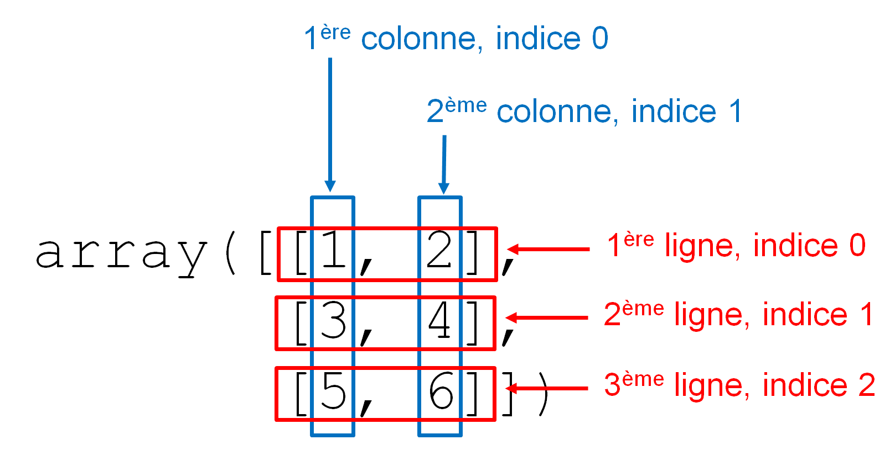
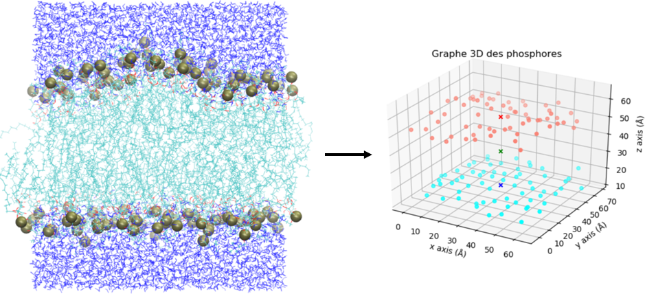

# Quelques modules d'intérêt en bioinformatique

Nous allons aborder dans ce chapitre quelques modules très importants en bioinformatique. Le premier *NumPy* permet notamment de manipuler des vecteurs et des matrices. Le module *Biopython* permet de travailler sur des données biologiques, comme des séquences (nucléiques et protéiques) ou des structures (fichiers PDB). Le module *matplotlib* permet de créer des graphiques depuis Python. Enfin, le module *pandas* est très performant pour l'analyse de données, et *scipy* étend les possibilités offertes par *NumPy*, notamment en proposant des algorithmes couramment utilisés en calcul scientifique.

Ces modules ne sont pas fournis avec la distribution Python de base (contrairement à tous les autres modules vus précédemment). Avec la distribution Miniconda que nous vous avons conseillé d'utiliser (consultez pour cela la documentation en [ligne](https://python.sdv.univ-paris-diderot.fr/livre-dunod)), vous pouvez rapidement les installer avec la commande :
```
$ conda install -y numpy pandas matplotlib scipy biopython
```

Dans ce chapitre, nous vous montrerons quelques exemples d’utilisation de ces modules pour vous convaincre de leur pertinence.


## Module *NumPy*

Le module [*NumPy*](http://numpy.scipy.org/) est incontournable en bioinformatique. Il permet d'effectuer des calculs sur des vecteurs ou des matrices, élément par élément, via un nouveau type d'objet appelé *array*.

On charge le module *NumPy* avec la commande :
```
>>> import numpy
```
On peut également définir un nom raccourci pour *NumPy* :
```
>>> import numpy as np
```


### Objets de type *array*

Les objets de type *array* correspondent à des tableaux à une ou plusieurs dimensions et permettent d'effectuer du calcul vectoriel. La fonction `array()` convertit un objet séquentiel (comme une liste ou un tuple) en un objet de type *array*. Voici un exemple simple de conversion d'une liste à une dimension en objet *array* :
```
>>> import numpy as np
>>> a = [1, 2, 3]
>>> np.array(a)
array([1, 2, 3])
>>> b = np.array(a)
>>> b
array([1, 2, 3])
>>> type(b)
<type 'numpy.ndarray'>
```

Nous avons converti la liste `[1, 2, 3]` en *array*. Nous aurions obtenu le même résultat si nous avions converti le tuple `(1, 2, 3)` en *array*.

Par ailleurs, lorsqu'on demande à Python d'afficher le contenu d'un objet *array*, le mot `array` et les symboles `([` et `])` sont utilisés pour le distinguer d'une liste (délimitée par les caractères `[` et `]`) ou d'un tuple (délimité par les caractères `(` et `)`).

open-box-rem

Un objet *array* ne contient que des données homogènes, c'est-à-dire d'un type identique.

Il est possible de créer un objet *array* à partir d'une liste contenant des entiers et des chaînes de caractères, mais dans ce cas, toutes les valeurs seront comprises par *NumPy* comme des chaînes de caractères :
```
>>> a = np.array([1, 2, "tigre"])
>>> a
array(['1', '2', 'tigre'], dtype='<U21')
>>> type(a)
<class 'numpy.ndarray'>
```

De même, il est possible de créer un objet *array* à partir d'une liste constituée d'entiers et de *floats*, mais toutes les valeurs seront alors comprises par *NumPy* comme des *floats* :  
```
>>> b = np.array([1, 2, 3.5])
>>> b
array([1. , 2. , 3.5])
>>> type(b)
<class 'numpy.ndarray'>
```

Ici, la notation `1.` indique qu'il s'agit du *float* `1.0000...` et pas de l'entier `1`.

close-box-rem


Sur un modèle similaire à la fonction `range()`, la fonction `arange()` permet de construire un *array* à une dimension de manière simple.
```
>>> np.arange(10)
array([0, 1, 2, 3, 4, 5, 6, 7, 8, 9])
```

Comme avec `range()`, on peut spécifier en argument une borne de début, une borne de fin et un pas :
```
>>> np.arange(10, 0, -1)
array([10,  9,  8,  7,  6,  5,  4,  3,  2,  1])
```

Un autre avantage de la fonction `arange()` est qu'elle génère des objets *array* qui contiennent des entiers ou des *floats* selon l'argument qu'on lui passe :
```
>>> np.arange(10)
array([0, 1, 2, 3, 4, 5, 6, 7, 8, 9])
>>> np.arange(10.0)
array([ 0.,  1.,  2.,  3.,  4.,  5.,  6.,  7.,  8.,  9.])
```


La différence fondamentale entre un objet *array* à une dimension et une liste (ou un tuple) est que celui-ci est considéré comme un **vecteur**. Par conséquent, on peut effectuer des opérations **élément par élément** sur ce type d'objet, ce qui est bien commode lorsqu'on analyse de grandes quantités de données. Regardez ces exemples :
```
>>> v = np.arange(4)
>>> v
array([0, 1, 2, 3])
>>> v + 1
array([1, 2, 3, 4])
>>> v + 0.1
array([ 0.1,  1.1,  2.1,  3.1])
>>> v * 2
array([0, 2, 4, 6])
>>> v * v
array([0, 1, 4, 9])
```

Avec les listes, ces opérations n'auraient été possibles qu'en utilisant des boucles. Nous vous encourageons donc à utiliser dorénavant les objets *array* lorsque vous aurez besoin de faire des opérations élément par élément.

Notez également que, dans le dernier exemple de multiplication (ligne 10), l'*array* final correspond à la multiplication **élément par élément** des deux *array* initiaux.


### *Array* et dimensions

Il est aussi possible de construire des objets *arrays* à deux dimensions, il suffit de passer en argument une liste de listes à la fonction `array()` :
```
>>> w = np.array([[1, 2], [3, 4], [5, 6]])
>>> w
array([[1, 2],
       [3, 4],
       [5, 6]])
```

On peut aussi créer des tableaux à trois dimensions en passant comme argument à la fonction `array()` une liste de listes de listes :
```
>>> x = np.array([[[1, 2], [2, 3]], [[4, 5], [5, 6]]])
>>> x
array([[[1, 2],
        [2, 3]],

       [[4, 5],
        [5, 6]]])
```

La fonction `array()` peut créer des tableaux à n'importe quel nombre de dimensions. Toutefois ça devient vite compliqué lorsqu'on dépasse trois dimensions. Retenez qu'un objet *array* à une dimension peut être considéré comme un **vecteur** et un *array* à deux dimensions comme une **matrice**. Nous nous focaliserons dans la suite sur des *arrays* 1D ou 2D.

Avant de continuer, il est important de bien définir comment sont organisés ces *arrays* 2D qui représentent des matrices. Il s'agit de tableaux de nombres qui sont organisés en lignes / colonnes comme le montre la figure @fig:array2Dlignescolonnes. Les indices indiqués dans cette figure seront définis un plus loin dans la rubrique *Indices*.

{ #fig:array2Dlignescolonnes width=60% }


Voici quelques attributs intéressants pour décrire un objet *array* :

- `.ndim` renvoie le nombre de dimensions (par exemple,
    1 pour un vecteur et 2 pour une matrice) ;
- `.shape` renvoie les dimensions sous forme d'un tuple ;
- `.size` renvoie le nombre total d'éléments contenus dans l'`array`.


```
>>> v = np.arange(4)
>>> v
array([0, 1, 2, 3])
>>> v.ndim
1
>>> v.shape
(4,)
>>> v.size
4
>>> w = np.array([[1, 2], [3, 4], [5, 6]])
>>> w
array([[1, 2],
       [3, 4],
       [5, 6]])
>>> w.ndim
2
>>> w.shape
(3, 2)
>>> w.size
6
```

Et la méthode `.reshape()` renvoie un nouvel *array* avec les dimensions spécifiées :
```
>>> a = np.arange(0, 6)
>>> a
array([0, 1, 2, 3, 4, 5])
>>> a.shape
(6,)
>>> b = a.reshape((2, 3))
>>> b
array([[0, 1, 2],
       [3, 4, 5]])
>>> b.shape
(2, 3)
>>> a
array([0, 1, 2, 3, 4, 5])
```

Notez bien que `a` n'a pas été modifié. Notez également que `a.reshape((2, 3))` n'est pas la même chose que `a.reshape((3, 2))` :

```
>>> c = a.reshape((3, 2))
>>> c
array([[0, 1],
       [2, 3],
       [4, 5]])
>>> c.shape
(3, 2)
```

La méthode `.reshape()` attend que les nouvelles dimensions soient **compatibles** avec la dimension initiale de l'objet *array*, c'est-à-dire que le nombre d'éléments contenus dans les différents *arrays* soit le même.
Dans nos exemples précédents, $6 = 2 \times 3 = 3 \times 2$.

Si les nouvelles dimensions ne sont pas compatibles avec les dimensions initiales, la méthode `.reshape()` génère une erreur.

```
>>> a = np.arange(0, 6)
>>> a
array([0, 1, 2, 3, 4, 5])
>>> a.shape
(6,)
>>> d = a.reshape((3, 4))
Traceback (most recent call last):
File "<stdin>", line 1, in <module>
ValueError: cannot reshape array of size 6 into shape (3,4)
```

La méthode `.resize()` par contre ne déclenche pas d'erreur dans une telle situation et ajoute des 0 jusqu'à ce que le nouvel *array* soit rempli, ou bien coupe la liste initiale.
```
>>> a = np.arange(0, 6)
>>> a.shape
(6,)
>>> a.resize((3, 3), refcheck=False)
>>> a.shape
(3, 3)
>>> a
array([[0, 1, 2],
       [3, 4, 5],
       [0, 0, 0]])
```

```
>>> b = np.arange(0, 10)
>>> b.shape
(10,)
>>> b.resize((2, 3), refcheck=False)
>>> b.shape
(2, 3)
>>> b
array([[0, 1, 2],
       [3, 4, 5]])
```

open-box-warn

Attention, cette modification de la forme de l'*array* par la méthode `.resize()` est faite « sur place » (*in place*), c'est-à-dire que la méthode ne renvoie rien mais l'*array* est bel et bien modifié (à l'image des méthodes sur les listes comme `.reverse()`, cf. chapitre 11 *Plus sur les listes*). Si l'option `refcheck=False` n'est pas présente, Python peut parfois renvoyer une erreur s'il existe des références vers l'*array* qu'on souhaite modifier.

close-box-warn

Il existe aussi la fonction `np.resize()` qui, dans le cas d'un nouvel *array* plus grand que l'*array* initial, va répéter l'*array* initial afin de remplir les cases manquantes :

```
>>> a = np.arange(0, 6)
>>> a.shape
(6,)
>>> c = np.resize(a, (3, 5))
>>> c.shape
(3, 5)
>>> c
array([[0, 1, 2, 3, 4],
       [5, 0, 1, 2, 3],
       [4, 5, 0, 1, 2]])
>>> a
array([0, 1, 2, 3, 4, 5])
```

Notez que cette fonction `np.resize()` renvoie un nouvel *array* mais ne modifie pas l'*array* initial contrairement à la méthode `.resize()` décrite ci-dessus.

### Méthodes de calcul sur les *arrays* et l'argument `axis`

Chaque *array NumPy* qui est créé possède une multitude de méthodes. Nombre d'entre elles permettent de faire des calculs de base comme `.mean()` pour la moyenne, `.sum()` pour la somme, `.std()` pour l'écart-type, `.max()` pour extraire le maximum, `.min()` pour extraire le minimum, etc. La liste exhaustive est [ici](https://numpy.org/doc/stable/reference/arrays.ndarray.html#calculation). Par défaut, chacune de ces méthodes effectuera l'opération sur l'*array* entier, quelle que soit sa dimensionnalité. Par exemple :

```
>>> import random as rd
>>> l = list(range(8))
>>> rd.shuffle(l)
>>> l
[2, 7, 6, 4, 0, 3, 1, 5]
>>> a = np.resize(l, (4, 2))
>>> a
array([[2, 7],
       [6, 4],
       [0, 3],
       [1, 5]])
>>> a.max()
7
```

La méthode `.max()` nous a bien renvoyé la valeur maximum 7. Un argument *très* utile existant dans toutes ces méthodes est `axis`. Pour un *array* 2D, `axis=0` signifie qu'on fera l'opération le long de l'axe 0, à savoir les lignes. C'est-à-dire que l'opération se fait en faisant varier les lignes. On récupère ainsi une valeur par colonne :

```
>>> a.max(axis=0)
array([6, 7])
```

L'*array* 1D récupèré a son premier élément qui vaut 6 (maximum de la 1ère colonne) et son deuxième qui vaut 7 (maximum de la deuxième colonne).

Avec `axis=1` on fait une opération similaire mais en faisant varier les colonnes. On récupère ainsi une valeur par ligne :

```
>>> a.max(axis=1)
array([7, 6, 3, 5])
```

L'*array* 1D récupéré a 4 éléments correspondant au maximum de chaque ligne.

On comprend la puissance de cet argument `axis`. A nouveau, il est possible, en une ligne, de faire des calculs qui pourraient être très fastidieux avec les listes traditionnelles.

### Indices

Pour récupérer un ou plusieurs élément(s) d'un objet *array*, vous pouvez utiliser les indices ou les tranches, de la même manière qu'avec les listes :

```
>>> a = np.arange(10)
>>> a
array([0, 1, 2, 3, 4, 5, 6, 7, 8, 9])
>>> a[5:]
array([5, 6, 7, 8, 9])
>>> a[::2]
array([0, 2, 4, 6, 8])
>>> a[1]
1
```
Dans le cas d'un objet *array* à deux dimensions, vous pouvez récupérer une ligne complète (d'indice *i*), une colonne complète (d'indice *j*) ou bien un seul élément. La figure @fig:array2Dlignescolonnes montre comment sont organisés les lignes / colonnes et indices.

```
>>> a = np.array([[1, 2], [3, 4]])
>>> a
array([[1, 2],
       [3, 4]])
>>> a[:,0]
array([1, 3])
>>> a[0,:]
array([1, 2])
>>> a[1, 1]
4
```

Lignes 5 à 8. La syntaxe `a[i,:]` renvoie la $(i+1)^{ème}$ ligne d'indice `i`, et `a[:,j]` renvoie la $(j+1)^{ème}$ colonne d'indice `j`. Les tranches sont évidemment aussi utilisables sur un *array* à deux dimensions.

Lignes 9 à 10. La syntaxe `a[i, j]` renvoie l'élément à la ligne d'indice `i` et à la colonne d'indice `j`. Notez que *NumPy* suit la convention mathématiques des [matrices](https://fr.wikipedia.org/wiki/Matrice_(math%C3%A9matiques)#D%C3%A9finitions), à savoir, **on définit toujours un élément par sa ligne puis par sa colonne**. En mathématiques, l'élément $a_{ij}$ d'une matrice $A$ se trouve à la $i^{ème}$ ligne et à la $j^{ème}$ colonne.

open-box-rem

- Pour un *array* 2D, si un seul indice est donné, par exemple `a[i]`, on récupère la ligne d'indice `i` sous forme d'*array* 1D :

```
>>> a
array([[1, 2],
       [3, 4]])
>>> a[0]
array([1, 2])
>>> a[1]
array([3, 4])
```

- Pour cette raison, la syntaxe `a[i][j]` est également valide pour récupér un élément :

```
>>> a
array([[1, 2],
       [3, 4]])
>>> a[1, 1]
4
>>> a[1][1]
4
```

Bien que cela soit possible, nous vous recommandons tout de même la syntaxe `a[i, j]` qui est plus proche de la [définition mathématiques d'un élément de matrice](https://fr.wikipedia.org/wiki/Matrice_(math%C3%A9matiques)#D%C3%A9finitions).

close-box-rem

### Copie d'*arrays*

Comme pour les listes, nous attirons votre attention sur la copie d'*arrays* :

```
>>> a = np.arange(5)
>>> a
array([0, 1, 2, 3, 4])
>>> b = a
>>> b[2] = -300
>>> b
array([   0,    1, -300,    3,    4])
>>> a
array([   0,    1, -300,    3,    4])
```

open-box-warn

Par défaut la copie d'*arrays* se fait par référence comme pour tous les objets séquentiels en Python (listes, *tuples*, dictionnaires, etc.).

close-box-warn

Afin d'éviter le problème, vous pouvez soit utiliser la fonction `np.array()` qui crée une nouvelle copie distincte de l'*array* initial, soit la fonction `copy.deepcopy()` comme pour les listes (cf. chapitre 11 *Plus sur les listes*) :

```
>>> a = np.full((2, 2), 0)
>>> a
array([[0, 0],
       [0, 0]])
>>> b = np.array(a)
>>> b[1, 1] = -300
>>> c = copy.deepcopy(a)
>>> c[1, 1] = -500
>>> a
array([[0, 0],
       [0, 0]])
>>> b
array([[   0,    0],
       [   0, -300]])
>>> c
array([[   0,    0],
       [   0, -500]])
```

open-box-rem

On pourra noter que la stratégie `b = np.array(a)` fait bien une copie distincte de l'*array* `a` quelle que soit sa dimensionnalité. Ceci n'était pas le cas avec la fonction `list()`  pour les copies de listes à partir de la dimensionnalité 2 : 

```
>>> l1 = [[0, 0], [1, 1]]
>>> l2 = list(l1)
>>> l3 = copy.deepcopy(l1)
>>> l1[1][1] = -365
>>> l2
[[0, 0], [1, -365]]
>>> l3
[[0, 0], [1, 1]]
```

close-box-rem

### Construction automatique de matrices

Il peut être parfois pénible de construire une matrice (*array* à deux dimensions) à l'aide d'une liste de listes. Le module *NumPy* possède quelques fonctions pratiques pour initialiser des matrices. Par exemple, Les fonctions `zeros()` et `ones()` construisent des objets *array* contenant des 0 ou des 1. Il suffit de leur passer en argument un tuple indiquant les dimensions voulues.
```
>>> np.zeros((2, 3))
array([[0., 0., 0.],
       [0., 0., 0.]])
>>> np.ones((3, 3))
array([[1., 1., 1.],
      [1., 1., 1.],
      [1., 1., 1.]])
```

Par défaut, les fonctions `zeros()` et `ones()` génèrent des *floats*, mais vous pouvez demander des entiers en passant le type (par exemple `int`, `float`, etc.) en second argument :
```
>>> np.zeros((2,3), int)
array([[0, 0, 0],
       [0, 0, 0]])
```

Enfin, si vous voulez construire une matrice avec autre chose que des 0 ou des 1, vous avez à votre disposition la fonction `full()` :
```
>>> np.full((2, 3), 7, int)
array([[7, 7, 7],
       [7, 7, 7]])
>>> np.full((2, 3), 7, float)
array([[ 7.,  7.,  7.],
       [ 7.,  7.,  7.]])
```

Nous construisons ainsi une matrice constituée de 2 lignes et 3 colonnes. Celle-ci ne contient que le chiffre 7 sous formes d'entiers (`int`) dans le premier cas et de *floats* dans le second.

Le module numpy contient aussi des fonctions pour lire des données à partir de fichiers et créer des *arrays* automatiquement. Cela se révèle bien pratique car la plupart du temps les données que l'on analyse proviennent de fichiers. La fonction la plus simple à prendre en main est `np.loadtxt()`. Celle-ci lit un fichier organisé en lignes / colonnes. Par exemple, imaginons que nous ayons un fichier `donnees.dat` contenant :

```
  1   7 310
 15  -4  35
 78  95  79
```

La fonction prend en argument le nom du fichier et renvoie un *array* 2D directement :

```
>>> np.loadtxt("donnees.dat")
array([[  1.,   7., 310.],
       [ 15.,  -4.,  35.],
       [ 78.,  95.,  79.]])
```

Pratique, non ? Attention toutefois aux points suivants :

- chaque ligne doit avoir le même nombre de colonnes, la fonction ne gère pas les données manquantes ;
- chaque donnée est convertie en *float*, donc si une chaîne est rencontrée la fonction renvoie une erreur ;
- par défaut, les données doivent être séparées par n'importe quelle combinaison d'espace(s) et/ou de tabulations.

Nous vous conseillons vivement de consulter la [documentation complète](https://numpy.org/doc/stable/reference/generated/numpy.loadtxt.html) de cette fonction. `np.loadtxt()` contient tout un tas d'arguments par mot-clé permettant de récupérer telles ou telles lignes / colonnes, ignorer des lignes de commentaire, changer le séparateur par défaut (par exemple la virgule `,` pour les fichiers .csv), etc., qui peuvent se révéler commodes.

L'opération inverse consistant à sauver un *array* dans un fichier se fait avec la fonction `np.savetxt()` :

```
>>> a = np.reshape(range(1, 10), (3, 3))
>>> a
array([[1, 2, 3],
       [4, 5, 6],
       [7, 8, 9]])
>>> np.savetxt("out.dat", a)
```

Ceci générera le fichier `out.dat` contenant les lignes suivantes :

```
1.000000000000000000e+00 2.000000000000000000e+00 3.000000000000000000e+00
4.000000000000000000e+00 5.000000000000000000e+00 6.000000000000000000e+00
7.000000000000000000e+00 8.000000000000000000e+00 9.000000000000000000e+00
```

On voit que la fonction écrit par défaut les données comme des *floats* en notation scientifique. Bien sûr il existe de nombreuses [options possibles](https://numpy.org/doc/stable/reference/generated/numpy.savetxt.html) permettant de changer le format, les séparateurs, etc.

open-box-more

Il existe d'autres fonctions plus avancées telles que [np.genfromttxt()](https://numpy.org/doc/stable/reference/generated/numpy.genfromtxt.html) gérant les données manquantes, ou encore [np.load()](https://numpy.org/doc/stable/reference/generated/numpy.load.html) et [np.fromfile()](https://numpy.org/doc/stable/reference/generated/numpy.fromfile.html) permettant de lire des données au format binaire. De même, il existe des fonctions ou méthodes permettant d'écrire au format binaire : [np.save()](https://numpy.org/doc/stable/reference/generated/numpy.save.html) ou [.tofile()](https://numpy.org/doc/stable/reference/generated/numpy.ndarray.tofile.html#numpy.ndarray.tofile). Le format binaire possède en général l'extension `.npy` ou `.npz` lorsque les données sont compressées. L'avantage d'écrire au format binaire est que cela prend moins de place pour les gros tableaux.

close-box-more

### Un peu d'algèbre linéaire

Après avoir manipulé les objets *array* comme des vecteurs et des matrices, voici quelques fonctions pour faire de l'algèbre linéaire.

La fonction `transpose()` renvoie la [transposée](https://fr.wikipedia.org/wiki/Matrice_transpos%C3%A9e) d'un *array*. Par exemple, pour une matrice :

```
>>> a = np.resize(np.arange(1, 10), (3, 3))
>>> a
array([[1, 2, 3],
       [4, 5, 6],
       [7, 8, 9]])
>>> np.transpose(a)
array([[1, 4, 7],
       [2, 5, 8],
       [3, 6, 9]])
```

Tout objet *array* possède un attribut `.T` qui contient la transposée, il est ainsi possible d'utiliser cette notation objet plus compacte :

```
>>> a.T
array([[1, 4, 7],
       [2, 5, 8],
       [3, 6, 9]])
```

La fonction `dot()` vous permet de réaliser une [multiplication de matrices](https://fr.wikipedia.org/wiki/Produit_matriciel#Produit_matriciel_ordinaire).

```
>>> a = np.resize(np.arange(4), (2, 2))
>>> a
array([[0, 1],
       [2, 3]])
>>> np.dot(a, a)
array([[ 2,  3],
       [ 6, 11]])
>>> a * a
array([[0, 1],
       [4, 9]])
```
Notez bien que `dot(a, a)` renvoie le **produit matriciel** entre deux matrices, alors que `a * a` renvoie le produit **élément par élément**.

open-box-rem

Dans le module *NumPy*, il existe également des objets de type *matrix* pour lesquels les multiplications de matrices sont différents, mais nous ne les aborderons pas ici.

close-box-rem

Pour toutes les opérations suivantes, nous utiliserons des fonctions du sous-module *linalg* de *NumPy*. La fonction `inv()` renvoie l'[inverse d'une matrice carrée](https://fr.wikipedia.org/wiki/Matrice_inversible), `det()` son [déterminant](https://fr.wikipedia.org/wiki/Calcul_du_d%C3%A9terminant_d%27une_matrice) et `eig()` ses [vecteurs et valeurs propres](https://fr.wikipedia.org/wiki/D%C3%A9composition_d%27une_matrice_en_%C3%A9l%C3%A9ments_propres).

```
>>> a = np.diag((1, 2, 3))
>>> a
array([[1, 0, 0],
       [0, 2, 0],
       [0, 0, 3]])
>>> np.linalg.inv(a)
array([[1.        , 0.        , 0.        ],
       [0.        , 0.5       , 0.        ],
       [0.        , 0.        , 0.33333333]])
>>> np.linalg.det(a)
6.0
>>> np.linalg.eig(a)
(array([1., 2., 3.]), array([[1., 0., 0.],
       [0., 1., 0.],
       [0., 0., 1.]]))
```

Ligne 1. La fonction `.diag()` permet de générer une matrice diagonale.

Lignes 12 à 15. La fonction `eig()` renvoie un tuple dont le premier élément (d'indice 0) correspond aux valeurs propres et le second (d'indice 1) aux vecteurs propres. Une façon commode de récupérer ces éléments est d'utiliser cette fonction avec l'affectation multiple :

```
>>> eigvals, eigvecs = np.linalg.eig(a)
>>> eigvals
array([1., 2., 3.])
>>> eigvecs
array([[1., 0., 0.],
       [0., 1., 0.],
       [0., 0., 1.]])
>>> eigvecs[0]
array([1., 0., 0.])
>>> eigvecs[1]
array([0., 1., 0.])
>>> eigvecs[2]
array([0., 0., 1.])
```

Lignes 2 et 3. `eigvals` est un *array* 1D  contenant les 3 valeurs propres.

Lignes 4 à 13. `eigvecs` est un *array* 2D contenant les 3 vecteurs propres (un par ligne), que l'on peut récupérer avec `eigvecs[0]`,  `eigvecs[1]` et  `eigvecs[2]`.

### Parcours de matrice et affectation de lignes / colonnes

Lorqu'on a une matrice, on est souvent amené à la parcourir par ligne ou par colonne. Une fonctionnalité bien commode vient du fait que les *arrays NumPy* sont directement itérables par ligne :

```
>>> a = np.reshape(np.arange(1, 10), (3, 3))
>>> a
array([[1, 2, 3],
       [4, 5, 6],
       [7, 8, 9]])
>>> for row in a:
...     print(row, type(row))
...
[1 2 3] <class 'numpy.ndarray'>
[4 5 6] <class 'numpy.ndarray'>
[7 8 9] <class 'numpy.ndarray'>
```

A chaque itération, la variable `row` est un *array* 1D correspondant à chaque ligne de `a`. Cela est lié au fait que l'utilisation d'un indiçage unique `a[i]` pour un *array* 2D correspond à sa ligne d'indice `i` (cf. rubrique *Indices* ci-dessus). 

Pour itérer sur les colonnes, on pourra utiliser l'astuce d'itérer sur la transposée de l'*array* `a`, c'est-à-dire `a.T` :

```
>>> for col in a.T:
...     print(col, type(col))
...
[1 4 7] <class 'numpy.ndarray'>
[2 5 8] <class 'numpy.ndarray'>
[3 6 9] <class 'numpy.ndarray'>
```

A chaque itération, la variable `col` est un *array* 1D correspondant à chaque colonne de `a`.

On se souvient de l'affectation multiple `x, y = 1, 2` qui permettait d'affecter des valeurs à plusieurs variables à la fois. Et bien, il est possible d'utiliser cette fonctionnalité aussi avec les *arrays NumPy* :

```
>>> a
array([[1, 2, 3],
       [4, 5, 6],
       [7, 8, 9]])
>>> l1, l2, l3 = a
>>> l1
array([1, 2, 3])
>>> l2
array([4, 5, 6])
>>> l3
array([7, 8, 9])
```

Par défaut, cela se fait sur les lignes de l'*array* 2D. Cette fonctionnalité provient à nouveau du fait que pour *NumPy* `a[i]` correspond à la ligne d'indice `i` d'un *array* 2D. 

Pour utiliser l'affectation multiple sur les colonnes, il suffit d'utiliser la transposée `a.T` :

```
>>> c1, c2, c3 = a.T
>>> c1
array([1, 4, 7])
>>> c2
array([2, 5, 8])
>>> c3
array([3, 6, 9])
```

### Masques booléens

Une des grandes puissance des *arrays* *NumPy* est qu'ils supportent les **masques booléens**. Avant de les définir, il est important d'introduire le concept d'*arrays* de booléens. Jusqu'à maintenant nous avions définis uniquement des *arrays* avec des types numériques *int* ou *float*. Il est tout à fait possible de définir des *arrays* de booléens. La fonction `np.full()` vue ci-dessus nous permet d'en construire facilement :

```
>>> np.full((2, 2), True)
array([[ True,  True],
       [ True,  True]])
>>> np.full((2, 2), False)
array([[False, False],
       [False, False]])
```

Très bien, mais au premier abord nous n'en voyons pas forcément l'utilité... Mais qu'en est-il lorsqu'on utilise les opérateurs de comparaison avec un *array* ? Et bien cela renvoie un *array* de booléens !

```
>>> a = np.reshape(np.arange(1, 10), (3, 3))
>>> a
array([[1, 2, 3],
       [4, 5, 6],
       [7, 8, 9]])
>>> a > 5
array([[False, False, False],
       [False, False,  True],
       [ True,  True,  True]])
>>> a == 2
array([[False,  True, False],
       [False, False, False],
       [False, False, False]])
```

Tous les éléments de l'*array* satisfaisant la condition seront à `True`, les autres à `False`. Encore plus fort, il est possible de combiner plusieurs conditions avec les opérateurs logiques `&` et `|` (respectivement **ET** et **OU**) :

```
>>> a
array([[1, 2, 3],
       [4, 5, 6],
       [7, 8, 9]])
>>> (a > 3) & (a % 2 == 0)
array([[False, False, False],
       [ True, False,  True],
       [False,  True, False]])
>>> (a > 3) | (a % 2 == 0)
array([[False,  True, False],
       [ True,  True,  True],
       [ True,  True,  True]])
```

Nous pouvons effectuer deux remarques :

- Les opérateurs logiques `&` et `|` s'appliquent sur les *arrays* et sont différents des opérateurs logiques `and` et `or` qui eux s'appliquent sur les booléens (`True` ou `False`) ;
- Il est conseillé de mettre des parenthèses pour chaque condition afin d'éviter les ambiguïtés.

Maintenant que les *arrays* de booléens ont été introduits, nous pouvons définir les masques booléens :

open-box-def

Les masques booléens sont des *arrays* de booléens qui sont utilisés en tant qu'« indice » d'un *array* initial. Cela permet de récupérer / modifier une partie de l'*array* initial.

close-box-def

Concrètement, il suffira d'utiliser un *array* et un opérateur de comparaison entre les crochets qui étaient dédiés à l'indiçage :

```
>>> a
array([[1, 2, 3],
       [4, 5, 6],
       [7, 8, 9]])
>>> a[a > 5]
array([6, 7, 8, 9])
>>> a[a == 2]
array([2])
>>> a[a != 0]
array([1, 2, 3, 4, 5, 6, 7, 8, 9])
```

On voit que l'on récupère seulement les éléments de l'*array* `a` qui sastisfont la sélection ! Toutefois, il est important de constater que l'*array* renvoyé perd la dimensionnalité de l'array `a` initial, il s'agit systématiquement d'un *array* 1D. 

La grande puissance de ce mécanisme est que l'on peut utiliser les masques booléens pour modifier les éléments que l'on sélectionne :

```
>>> a
array([[1, 2, 3],
       [4, 5, 6],
       [7, 8, 9]])
>>> a[a > 5]
array([6, 7, 8, 9])
>>> a[a > 5] = -1
>>> a
array([[ 1,  2,  3],
       [ 4,  5, -1],
       [-1, -1, -1]])
```

On peut bien sûr combiner plusieurs conditions avec les opérateurs logiques :

```
>>> a
array([[1, 2, 3],
       [4, 5, 6],
       [7, 8, 9]])
>>> a[(a > 3) | (a % 2 == 0)] = 0
>>> a
array([[1, 0, 3],
       [0, 0, 0],
       [0, 0, 0]])
```

Ce mécanisme de sélection avec des masques booléens se révèle très puissant pour manipuler des grandes quantités de données. On verra qu'il peut être également utilisé avec les *dataframes* du module *pandas*.

open-box-rem

Les masques booléens ne doivent pas être confondus avec les [*masked arrays*](https://numpy.org/doc/1.18/reference/maskedarray.html) qui sont des *arrays* dans lesquels on peut trouver des valeurs manquantes ou invalides.

close-box-rem

Une application possible des masques est de « binariser » une matrice de nombre :

```
>>> import random as rd
>>> import numpy as np
>>> a = np.resize([rd.random() for i in range(16)], (4,
4))
>>> a
array([[0.58704728, 0.50212977, 0.70652863, 0.24158108],
       [0.93102132, 0.41864373, 0.45807961, 0.98288744],
       [0.48198211, 0.16877376, 0.14431518, 0.74784176],
       [0.92913469, 0.08383269, 0.10670144, 0.14554345]])
>>> seuil = 0.3
>>> a[a < seuil] = 0
>>> a[a > seuil] = 1
>>> a
array([[1., 1., 1., 0.],
       [1., 1., 1., 1.],
       [1., 0., 0., 1.],
       [1., 0., 0., 0.]])
```

En deux lignes de code cela est fait alors qu'il aurait fallu faire des boucles avec les listes classiques !

### Quelques conseils

Nous venons de voir une petite partie du module *NumPy* mais vous avez pu en constater son extraordinaire puissance. On pourrait au premier abord être tenté d'abandonner les listes, toutefois elles gardent toute leur importance. Alors quand utiliser les listes ou quand utiliser les *arrays NumPy* ? Voici une liste non exhaustive d'éléments qui peuvent guider votre choix :

Utilisez NumPy pour :

- les opérations vectorielles (éléments par éléments) ;
- lorsque vous souhaitez manipuler des objets mathématiques (vecteurs, matrices, etc.) et les outils associés (algèbre linéaire) ;
- tout ce qui est numérique de manière générale.

Utilisez les listes :

- lorsque vous avez besoin d'un container pour accumuler des valeurs (fussent-elles des sous-listes), surtout lorsqu'elles ne sont pas homogènes (i.e. du même type) ;
- lorsque vous souhaitez accumuler des valeurs : la méthode `.append()` est bien plus efficace que faire grandir un *array* au fur et à mesure (ce que nous n'avons pas abordé) ; lorsqu'on ne peut pas utiliser les fonctions de lecture de fichier de *NumPy* pour quelque raison que ce soit, il est tout à fait classique de faire grandir une liste au fur et à mesure de la lecture du fichier puis de la convertir à la fin en *array*.

Enfin, comme nous vous le conseillons depuis le début, soignez bien votre documentation (*docstrings*) ou vos commentaires lorsque vous utilisez des *arrays NumPy*. *Numpy* permettant de réaliser des opérations vectorielles de manière très compacte, il est essentiel de se mettre à la place du lecteur et de bien indiquer ce que contient chaque *array* et sa dimensionnalité (1D, 2D, etc.).

Le module *NumPy* est la brique de base pour tout ce qui est numérique. Associé aux modules *SciPy* et *matplotlib* (et aussi aux *notebooks Jupyter*, cf. chapitre suivant), il permet de faire de l'analyse scientifique. On verra un peu plus loin dans ce chapitre que la puissance de *NumPy* est également utilisée par le module *pandas* et ses fameux *dataframes* pour faire de l'analyse de données.

## Module *Biopython*

Le module [*Biopython*](http://biopython.org/) propose des fonctionnalités très utiles en bioinformatique.
Le [tutoriel](http://biopython.org/DIST/docs/tutorial/Tutorial.html) est particulièrement bien fait, n'hésitez pas à le consulter.


### Manipulation de données

Voici quelques exemples de manipulation de données avec *Biopython*.

Définition d'une séquence :
```
>>> import Bio
>>> from Bio.Seq import Seq
>>> from Bio.Alphabet import IUPAC
>>> ADN = Seq("ATATCGGCTATAGCATGCA", IUPAC.unambiguous_dna)
>>> ADN
Seq('ATATCGGCTATAGCATGCA', IUPACUnambiguousDNA())
```

Ligne 1. Le module *Biopython* s'appelle `Bio`.

Ligne 4. L'expression `IUPAC.unambiguous_dna` signifie que la séquence entrée est bien une séquence d'ADN non ambigu (c'est-à-dire que chaque base est bien déterminée).

Obtention de la séquence complémentaire et complémentaire inverse :
```
>>> ADN.complement()
Seq('TATAGCCGATATCGTACGT', IUPACUnambiguousDNA())
>>> ADN.reverse_complement()
Seq('TGCATGCTATAGCCGATAT', IUPACUnambiguousDNA())
```

Traduction en séquence protéique :
```
>>> ADN.translate()
Seq('ISAIAC', IUPACProtein())
```

Dans l'annexe A *Quelques formats de données rencontrés en biologie*, vous
trouverez de nombreux exemples d'utilisation de *Biopython* pour manipuler
des données aux formats FASTA, GenBank et PDB.


### Interrogation de la base de données PubMed

Le sous-module *Entrez* de *Biopython* permet d’utiliser les ressources du NCBI
et notamment d'interroger le site [PubMed](https://www.ncbi.nlm.nih.gov/pubmed/).

Nous allons par exemple utiliser PubMed pour chercher des articles scientifiques
relatifs à la transferrine (*transferrin* en anglais):

```
>>> from Bio import Entrez
>>> Entrez.email = "votremail@provider.fr"
>>> req_esearch = Entrez.esearch(db="pubmed", term="transferrin")
>>> res_esearch = Entrez.read(req_esearch)
```

Ligne 1. On charge directement le sous-module *Entrez*.

Ligne 2. Lors d'une requête sur le site du NCBI, il est important de définir correctement
la variable `Entrez.email` qui sera transmise au NCBI lors de la requête et qui
pourra être utilisée pour vous contacter en cas de difficulté avec le serveur.

Ligne 3. On lance la requête (`transferrin`) sur le moteur de recherche `pubmed`. La requête est stockée dans la variable `req_esearch`.

Ligne 4. Le résultat est lu et stocké dans la variable `res_esearch`.

Sans être un vrai dictionnaire, la variable `res_esearch` en a cependant plusieurs propriétés.
Voici ses clés :
```
>>> res_esearch.keys()
dict_keys(['Count', 'RetMax', 'RetStart', 'IdList', 'TranslationSet',
'TranslationStack', 'QueryTranslation'])
```

La valeur associée à la clé `IdList` est une liste qui contient les identifiants
(PMID) des articles scientifiques associés à la requête (ici `transferrin`) :

```
>>> res_esearch["IdList"]
['30411489', '30409795', '30405884', '30405827', '30402883', '30401570',
'30399508', '30397276', '30395963', '30394734', '30394728', '30394123',
'30393423', '30392910', '30392664', '30391706', '30391651', '30391537',
'30391296', '30390672']
>>> len(res_esearch["IdList"])
20
```

Cette liste ne contient les identifiants que de 20 publications alors que si nous
faisons cette même requête directement sur le site de PubMed depuis un navigateur
web, nous obtenons plus de 33900 résultats.

En réalité, le nombre exact de publications est connu :
```
>>> res_esearch["Count"]
'33988'
```

Pour ne pas saturer les serveurs du NCBI, seulement 20 PMID sont renvoyés par défaut.
Mais vous pouvez augmenter cette limite en utilisant le paramètre `retmax` dans la fonction `Entrez.esearch()`.

Nous pouvons maintenant récupérer des informations sur une publication précise
en connaissant son PMID. Par exemple, l'article avec le PMID [22294463](https://www.ncbi.nlm.nih.gov/pubmed/22294463) dont un aperçu est sur la figure @fig:entrez-transferrin.

{ #fig:entrez-transferrin width=80% }

Nous allons pour cela utiliser la fonction `Entrez.esummary()`

```
>>> req_esummary = Entrez.esummary(db="pubmed", id="22294463")
>>> res_esummary = Entrez.read(req_esummary)
```

La variable `res_esummary` n'est pas réellement une liste mais en a plusieurs propriétés.
Cette pseudo-liste n'a qu'un seul élément, qui est lui-même un pseudo-dictionnaire dont voici les clés :
```
>>> res_esummary[0].keys()
dict_keys(['Item', 'Id', 'PubDate', 'EPubDate', 'Source', 'AuthorList',
'LastAuthor', 'Title', 'Volume', 'Issue', 'Pages', 'LangList',
'NlmUniqueID', 'ISSN', 'ESSN', 'PubTypeList', 'RecordStatus', 'PubStatus',
'ArticleIds', 'DOI', 'History', 'References', 'HasAbstract', 'PmcRefCount',
'FullJournalName', 'ELocationID', 'SO'])
```

Nous pouvons alors facilement obtenir le titre, le DOI et la date de publication
(`PubDate`) de cet article, ainsi que le journal (`Source`) dans lequel il a été
publié :
```
>>> res_esummary[0]["Title"]
'Known and potential roles of transferrin in iron biology.'
>>> res_esummary[0]["DOI"]
'10.1007/s10534-012-9520-3'
>>> res_esummary[0]["PubDate"]
'2012 Aug'
>>> res_esummary[0]["Source"]
'Biometals'
```

Enfin, pour récupérer le résumé de la publication précédente, nous allons
utiliser la fonction `Entrez.efetch()` :
```
>>> req_efetch = Entrez.efetch(db="pubmed", id="22294463", rettype="txt")
>>> res_efetch = Entrez.read(req_efetch)
```

La variable `res_efetch` est un pseudo-dictionnaire qui contient une pseudo-liste,
qui contient un pseudo-dictionnaire, qui contient... Oui, c'est compliqué !
Pour faire court, le résumé peut s'obtenir avec l'instruction :

```
>>> res_efetch['PubmedArticle'][0]['MedlineCitation']['Article'] \
... ['Abstract']['AbstractText'][0]
'Transferrin is an abundant serum metal-binding protein best known
for its role in iron delivery. The human disease congenital atransf
errinemia and animal models of this disease highlight the essential
 role of transferrin in erythropoiesis and iron metabolism. Patient
s and mice deficient in transferrin exhibit anemia and a paradoxica
l iron overload attributed to deficiency in hepcidin, a peptide hor
mone synthesized largely by the liver that inhibits dietary iron ab
sorption and macrophage iron efflux. Studies of inherited human dis
ease and model organisms indicate that transferrin is an essential
regulator of hepcidin expression. In this paper, we review current
literature on transferrin deficiency and present our recent finding
s, including potential overlaps between transferrin, iron and manga
nese in the regulation of hepcidin expression.'
```

Ce qui est bien le résumé que nous obtenons sur la figure @fig:entrez-transferrin.


## Module *matplotlib*

Le module [*matplotlib*](https://matplotlib.org/) permet de générer des graphiques depuis Python. Il est l'outil complémentaire de *NumPy*, *scipy* ou *pandas* (que l'on verra juste après) lorsqu'on veut faire de l'analyse de données.

### Représentation sous forme de points

Dans cet exemple, nous considérons l'évolution de la concentration d'un produit dans le sang (exprimé en mg/L) en fonction du temps (exprimé en heure).

Nous avons les résultats suivants :

| Temps (h) | Concentration (mg/L) |
|:---------:|:--------------------:|
|     1     |          3.5         |
|     2     |          5.8         |
|     3     |          9.1         |
|     4     |         11.8         |
|     6     |         17.5         |
|     7     |         21.3         |
|     9     |         26.8         |

Nous allons maintenant représenter l'évolution de la concentration en fonction du temps :
```
import matplotlib.pyplot as plt

temps = [1, 2, 3, 4, 6, 7, 9]
concentration = [5.5, 7.2, 11.8, 13.6, 19.1, 21.7, 29.4]
plt.scatter(temps, concentration, marker="o", color="blue")
plt.xlabel("Temps (h)")
plt.ylabel("Concentration (mg/L)")
plt.title("Concentration de produit en fonction du temps")
plt.show()
```
Vous devriez obtenir une fenêtre graphique **interactive** qui vous permet de manipuler le graphe (se déplacer, zoomer, enregistrer comme image, etc.) et qui ressemble à celle de la figure @fig:pltinteractive.

{ #fig:pltinteractive width=70% }

Revenons maintenant sur le code.

Ligne 1. Tout d'abord, on importe le sous-module `pyplot` du module *matplotlib* et on lui donne l'alias `plt` pour l'utiliser plus rapidement ensuite (cet alias est standard, utilisez-la systématiquement).

Lignes 3 et 4. On définit les variables `temps` et `concentration` comme des listes. Les deux listes doivent avoir la même longueur (7 éléments dans le cas présent).

Ligne 5. La fonction `scatter()` permet de représenter des points sous forme de nuage de points. Les deux premiers arguments correspondent aux valeurs en abscisse et en ordonnée des points, fournis sous forme de listes. Des arguments facultatifs sont ensuite précisés comme le symbole (`marker`) et la couleur (`color`).

Lignes 6 et 7. Les fonctions `xlabel()` et `ylabel()` sont utilisées pour donner un nom aux axes.

Ligne 8. La fonction `title()` définit le titre du graphique.

Ligne 9. Enfin, la fonction `show()` affiche le graphique généré à l'écran.


### Représentation sous forme de courbe

On sait par ailleurs que l'évolution de la concentration du produit en fonction du temps peut-être modélisée par la fonction $f(x) = 2 + 3 \times x$. Représentons ce modèle avec les points expérimentaux et sauvegardons le graphique obtenu sous forme d'une image :
```
import numpy as np
import matplotlib.pyplot as plt

temps = [1, 2, 3, 4, 6, 7, 9]
concentration = [5.5, 7.2, 11.8, 13.6, 19.1, 21.7, 29.4]
plt.scatter(temps, concentration, marker='o', color = 'blue')
plt.xlabel("Temps (h)")
plt.ylabel("Concentration (mg/L)")
plt.title("Concentration de produit en fonction du temps")
x = np.linspace(min(temps), max(temps), 50)
y = 2 + 3 * x
plt.plot(x, y, color='green', ls="--")
plt.grid()
plt.savefig('concentration_vs_temps.png', bbox_inches='tight', dpi=200)
```
Le résultat est représenté sur la figure @fig:conc-vs-tps.

{  #fig:conc-vs-tps width=70% }

Les étapes supplémentaires par rapport au graphique précédent (figure @fig:pltinteractive) sont :

Ligne 1. On charge le module *numpy* sous le nom `np`.

Ligne 10. On crée la variable `x` avec la fonction `linspace()` du module *NumPy* qui renvoie une liste de valeurs régulièrement espacées entre deux bornes, ici entre le minimum (`min(temps)`) et le maximum (`max(temps)`) de la variable `temps`. Dans notre exemple, nous générons une liste de 50 valeurs. La variable `x` ainsi créée est du type *array*.

Ligne 11. On construit ensuite la variable `y` à partir de la formule modélisant l'évolution de la concentration en fonction du temps. Cette manipulation n'est possible que parce que `x` est du type *array*. Cela ne fonctionnerait pas avec une liste classique.

Ligne 12. La fonction `plot()` permet de construire une courbe à partir des coordonnées en abscisse et en ordonnées des points à représenter. On indique ensuite des arguments facultatifs comme le style de la ligne (`ls`) et sa couleur (`color`).

Ligne 13. La fonction `grid()` affiche une grille.

Ligne 14. Enfin, la fonction `savefig()` enregistre le graphique produit sous la forme d'une image au format png. Des arguments par mot-clé définissent la manière de générer les marges autour du graphique (`bbox_inches`) et la résolution de l'image (`dpi`).


### Représentation sous forme de diagramme en bâtons

On souhaite maintenant représenter graphiquement la distribution des différentes bases dans une séquence d'ADN.
```
import numpy as np
import matplotlib.pyplot as plt

sequence = "ACGATCATAGCGAGCTACGTAGAA"
bases = ["A", "C", "G", "T"]
distribution = []
for base in bases:
    distribution.append(sequence.count(base))

x = np.arange(len(bases))
plt.bar(x, distribution)
plt.xticks(x, bases)
plt.xlabel("Bases")
plt.ylabel("Nombre")
plt.title("Distribution des bases\n dans la séquence {}".format(sequence))
plt.savefig('distribution_bases.png', bbox_inches="tight", dpi=200)
```

On obtient alors le graphique de la figure @fig:distribution.

{ #fig:distribution width=70% }

Prenons le temps d'examiner les différentes étapes du script précédent :

Lignes 4 à 6. On définit les variables `sequence`, `bases` et `distribution` qu'on utilise ensuite.

Lignes 7 et 8. On calcule la distribution des différentes bases dans la séquence. On utilise pour cela la méthode `count()` qui renvoie le nombre de fois qu'une chaîne de caractères (les différentes bases) se trouve dans une autre (la séquence).

Ligne 10. On définit la position en abscisse des barres. Dans cet exemple, la variable `x` vaut `array([0, 1, 2, 3])`.

Ligne 11. La fonction `bar()` construit le diagramme en bâtons. Elle prend en argument la position des barres (`x`) et leurs hauteurs (`distribution`).

Ligne 12. La fonction `xtics()` redéfinit les étiquettes (c'est-à-dire le nom des bases) sur l'axe des abscisses.

Lignes 13 à 15. On définit les légendes des axes et le titre du graphique. On insère un retour à la ligne `\n` dans le titre pour qu'il soit réparti sur deux lignes.

Ligne 16. Enfin, on enregistre le graphique généré au format png.

On espère que ces courts exemples vous auront convaincu de l'utilité du module *matplotlib*. Sachez qu'il peut faire bien plus, par exemple générer des histogrammes ou toutes sortes de graphiques utiles en analyse de données. Le site de *matplotlib* fournit de nombreux [exemples détaillés](https://matplotlib.org/gallery/index.html), n'hésitez pas à le consulter.


## Module *pandas*

Le module [*pandas*](https://pandas.pydata.org/) a été conçu pour l'analyse de données. Il est particulièrement puissant pour manipuler des données structurées sous forme de tableau.

Pour charger *pandas* dans la mémoire de Python, on utilise la commande `import` habituelle :
```
>>> import pandas
```

Pandas est souvent chargé avec un nom raccourci, comme pour *NumPy* et *matplotlib* :
```
>>> import pandas as pd
```


### *Series*

Le premier type de données apporté par *pandas* est la *series*, qui correspond à un vecteur à une dimension.

```
>>> s = pd.Series([10, 20, 30, 40], index = ['a', 'b', 'c', 'd'])
>>> s
a    10
b    20
c    30
d    40
dtype: int64
```

Avec *pandas*, chaque élément de la série de données possède une étiquette qui permet d'appeler les éléments.
Ainsi, pour appeler le premier élément de la série, on peut utiliser son index,
comme pour une liste (0 pour le premier élément) ou son étiquette (ici, `"a"`) :
```
>>> s[0]
10
>>> s["a"]
10
```

Bien sûr, on peut extraire plusieurs éléments, par leurs indices ou leurs étiquettes :
```
>>> s[[1,3]]
b    20
d    40
dtype: int64
>>> s[["b","d"]]
b    20
d    40
dtype: int64
```

Les étiquettes permettent de modifier et d'ajouter des éléments :
```
>>> s["c"] = 300
>>> s["z"] = 50
>>> s
a     10
b     20
c    300
d     40
z     50
dtype: int64
```

Enfin, on peut filtrer une partie de la *series* :
```
>>> s[s>30]
c    300
d     40
z     50
dtype: int64
```
et même combiner plusieurs critères de sélection :
```
>>> s[(s>20) & (s<100)]
d    40
z    50
dtype: int64
```


### *Dataframes*

Un autre type d'objet particulièrement intéressant introduit par *pandas*
sont les *dataframes*. Ceux-ci correspondent à des tableaux à deux dimensions
avec des étiquettes pour nommer les lignes et les colonnes.

open-box-rem

Si vous êtes familier avec le langage de programmation et d'analyse statistique R, les
*dataframes* de *pandas* se rapprochent de ceux trouvés dans R.

close-box-rem

Voici comment créer un *dataframe* avec *pandas* à partir
de données fournies comme liste de lignes :
```
>>> df = pd.DataFrame(columns=["a", "b", "c", "d"],
...                   index=["chat", "singe", "souris"],
...                   data=[np.arange(10, 14),
...                         np.arange(20, 24),
...                         np.arange(30, 34)])
>>> df
         a   b   c   d
chat    10  11  12  13
singe   20  21  22  23
souris  30  31  32  33
```
Ligne 1. Le *dataframe* est créé avec la fonction `DataFrame()` à laquelle
on fournit plusieurs arguments.
L'argument `columns` indique le nom des colonnes, sous forme d'une liste.

Ligne 2. L'argument `index` définit le nom des lignes, sous forme de liste.

Lignes 3-5. L'argument `data` fournit le contenu du *dataframe*, sous la forme
d'une liste de valeurs correspondantes à des lignes. Ainsi `np.arange(10, 14)`
 qui est équivalent à `[10, 11, 12, 13]` correspond à la première ligne du *dataframe*.

Le même *dataframe* peut aussi être créé à partir des valeurs fournies
en colonnes sous la forme d'un dictionnaire :
```
>>> data = {"a": np.arange(10, 40, 10),
...         "b": np.arange(11, 40, 10),
...         "c": np.arange(12, 40, 10),
...         "d": np.arange(13, 40, 10)}
>>> df = pd.DataFrame.from_dict(data)
>>> df.index = ["chat", "singe", "souris"]
>>> df
         a   b   c   d
chat    10  11  12  13
singe   20  21  22  23
souris  30  31  32  33
```

Lignes 1-4. Le dictionnaire `data` contient les données en colonnes.
La clé associée à chaque colonne est le nom de la colonne.

Ligne 5. Le *dataframe* est créé avec la fonction `pd.DataFrame.from_dict()`
à laquelle on passe `data` en argument.

Ligne 6. On peut définir les étiquettes des lignes de n'importe quel *dataframe*
avec l'attribut `df.index`.


### Quelques propriétés

Les dimensions d'un *dataframe* sont données par l'attribut `.shape` :
```
>>> df.shape
(3, 4)
```
Ici, le *dataframe* `df` a 3 lignes et 4 colonnes.

L'attribut `.columns` renvoie le nom des colonnes et permet aussi de renommer
les colonnes d'un *dataframe* :
```
>>> df.columns
Index(['a', 'b', 'c', 'd'], dtype='object')
>>> df.columns = ["Paris", "Lyon", "Nantes", "Pau"]
>>> df
        Paris  Lyon  Nantes  Pau
chat       10    11      12   13
singe      20    21      22   23
souris     30    31      32   33
```

La méthode `.head(n)` renvoie les *n* premières lignes du *dataframe*
(par défaut, *n* vaut 5) :
```
>>> df.head(2)
       Paris  Lyon  Nantes  Pau
chat      10    11      12   13
singe     20    21      22   23
```


### Sélection

Les mécanismes de sélection  fournis avec *pandas* sont très puissants.
En voici un rapide aperçu :

#### Sélection de colonnes

On peut sélectionner une colonne par son étiquette :
```
>>> df["Lyon"]
chat      11
singe     21
souris    31
```

ou plusieurs colonnes en même temps :
```
>>> df[["Lyon", "Pau"]]
        Lyon  Pau
chat      11   13
singe     21   23
souris    31   33
```
Pour la sélection de plusieurs colonnes, les étiquettes d'intérêt sont rassemblées dans une liste.


#### Sélection de lignes

Pour sélectionner une ligne, il faut utiliser l'instruction `.loc()`
et l'étiquette de la ligne :
```
>>> df.loc["singe"]
Paris     20
Lyon      21
Nantes    22
Pau       23
Name: singe, dtype: int64
```

Ici aussi, on peut sélectionner plusieurs lignes :
```
>>> df.loc[["singe", "chat"]]
       Paris  Lyon  Nantes  Pau
singe     20    21      22   23
chat      10    11      12   13
```

Enfin, on peut aussi sélectionner des lignes avec l'instruction `.iloc`
et l'indice de la ligne (la première ligne ayant l'indice 0) :
```
>>> df.iloc[1]
Paris     20
Lyon      21
Nantes    22
Pau       23
Name: singe, dtype: int64
```

```
>>> df.iloc[[1,0]]
       Paris  Lyon  Nantes  Pau
singe     20    21      22   23
chat      10    11      12   13
```

On peut également utiliser les tranches (comme pour les listes) :
```
>>> df.iloc[0:2]
       Paris  Lyon  Nantes  Pau
chat      10    11      12   13
singe     20    21      22   23
```

#### Sélection sur les lignes et les colonnes

On peut bien sûr combiner les deux types de sélection (en ligne et en colonne):
```
>>> df.loc["souris", "Pau"]
33
>>> df.loc[["singe", "souris"], ['Nantes', 'Lyon']]
        Nantes  Lyon
singe       22    21
souris      32    31
```
Notez qu'à partir du moment où on souhaite effectuer une sélection sur des lignes,
il faut utiliser `loc` (ou `iloc` si on utilise les indices).


#### Sélection par condition

Remémorons-nous d'abord le contenu du *dataframe* `df` :
```
>>> df
        Paris  Lyon  Nantes  Pau
chat       10    11      12   13
singe      20    21      22   23
souris     30    31      32   33
```

Sélectionnons maintenant toutes les lignes pour lesquelles les effectifs à Pau
sont supérieurs à 15 :
```
>>> df[ df["Pau"]>15 ]
        Paris  Lyon  Nantes  Pau
singe      20    21      22   23
souris     30    31      32   33
```

De cette sélection, on ne souhaite garder que les valeurs pour Lyon :
```
>>> df[ df["Pau"]>15 ]["Lyon"]
singe     21
souris    31
Name: Lyon, dtype: int64
```

On peut aussi combiner plusieurs conditions avec `&` pour l'opérateur **et** :
```
>>> df[ (df["Pau"]>15) & (df["Lyon"]>25) ]
        Paris  Lyon  Nantes  Pau
souris     30    31      32   33
```

et `|` pour l'opérateur **ou** :

```
>>> df[ (df["Pau"]>15) | (df["Lyon"]>25) ]
        Paris  Lyon  Nantes  Pau
singe      20    21      22   23
souris     30    31      32   33
```


### Combinaison de *dataframes*

En biologie, on a souvent besoin de combiner deux tableaux de chiffres à partir d'une colonne commune.

Par exemple, si on considère les deux *dataframes* suivants :

```
>>> data1 = {"Lyon": [10, 23, 17], "Paris": [3, 15, 20]}
>>> df1 = pd.DataFrame.from_dict(data1)
>>> df1.index = ["chat", "singe", "souris"]
>>> df1
        Lyon  Paris
chat      10      3
singe     23     15
souris    17     20
```
et
```
>>> data2 = {"Nantes": [3, 9, 14], "Strasbourg": [5, 10, 8]}
>>> df2 = pd.DataFrame.from_dict(data2)
>>> df2.index = ["chat", "souris", "lapin"]
>>> df2
        Nantes  Strasbourg
chat         3           5
souris       9          10
lapin       14           8
```

On souhaite combiner ces deux *dataframes*, c'est-à-dire connaître pour les 4 villes (Lyon, Paris, Nantes et Strasbourg) le nombre d'animaux. On remarque d'ores et déjà qu'il y a des singes à Lyon et Paris mais pas de lapin et qu'il y a des lapins à Nantes et Strasbourg mais pas de singe. Nous allons voir comment gérer cette situation.

*pandas* propose pour cela la fonction [`concat()`](https://pandas.pydata.org/pandas-docs/stable/merging.html) qui prend comme argument une liste de *dataframes* :

```
>>> pd.concat([df1, df2])
        Lyon  Nantes  Paris  Strasbourg
chat    10.0     NaN    3.0         NaN
singe   23.0     NaN   15.0         NaN
souris  17.0     NaN   20.0         NaN
chat     NaN     3.0    NaN         5.0
souris   NaN     9.0    NaN        10.0
lapin    NaN    14.0    NaN         8.0
```

Ici, `NaN` indique des valeurs manquantes. Mais le résultat obtenu n'est pas celui que nous attendions puisque les lignes de deux *dataframes* ont été recopiées.

L'argument supplémentaire `axis=1` produit le résultat attendu :
```
 >>> pd.concat([df1, df2], axis=1)
        Lyon  Paris  Nantes  Strasbourg
chat    10.0    3.0     3.0         5.0
lapin    NaN    NaN    14.0         8.0
singe   23.0   15.0     NaN         NaN
souris  17.0   20.0     9.0        10.0
```

Par défaut, *pandas* va conserver le plus de lignes possible. Si on ne souhaite conserver que les lignes communes aux deux *dataframes*, il faut ajouter l'argument `join="inner"` :
```
>>> pd.concat([df1, df2], axis=1, join="inner")
        Lyon  Paris  Nantes  Strasbourg
chat      10      3       3           5
souris    17     20       9          10
```

Un autre comportement par défaut de `concat()` est que cette fonction va combiner les *dataframes* en se basant sur leurs index. Il est néanmoins possible de préciser, pour chaque *dataframe*, le nom de la colonne qui sera utilisée comme référence avec l'argument `join_axes`.


## Un exemple plus complet

Pour illustrer les possibilités de *pandas*, voici un exemple plus complet.

Le fichier `transferrin_report.csv` que vous pouvez télécharger
[ici](https://python.sdv.univ-paris-diderot.fr/data-files/transferrin_report.csv)
contient une liste de structures de la [transferrine](https://fr.wikipedia.org/wiki/Transferrine).
Cette protéine est responsable du transport du fer dans l'organisme.

Si vous n'êtes pas familier avec le format de fichier `.csv`, nous vous conseillons
de consulter l'annexe A *Quelques formats de données rencontrés en biologie*.

Voyons maintenant comment explorer les données contenues
dans ce fichier avec *pandas*.


### Prise de contact avec le jeu de données

Une fonctionnalité très intéressante de *pandas* est d'ouvrir très facilement
un fichier au format `.csv` :

```
>>> df = pd.read_csv("transferrin_report.csv")
```
Le contenu est chargé sous la forme d'un *dataframe* dans la variable `df`.

Le fichier contient 41 lignes de données plus une ligne d'en-tête. Cette dernière
 est automatiquement utilisée par *pandas* pour nommer les différentes colonnes.
 Voici un aperçu des premières lignes :
```
>>> df.head()
  PDB ID              Source Deposit Date  Length       MW
0   1A8E        Homo sapiens   1998-03-24     329  36408.4
1   1A8F        Homo sapiens   1998-03-25     329  36408.4
2   1AIV       Gallus gallus   1997-04-28     686  75929.0
3   1AOV  Anas platyrhynchos   1996-12-11     686  75731.8
4   1B3E        Homo sapiens   1998-12-09     330  36505.5
```

Nous avons 5 colonnes de données :

- l'identifiant de la structure (`PDB ID`) ;
- l'organisme d'où provient cette protéine (`Source`) ;
- la date à laquelle cette structure a été déposée dans la *Protein Data Bank* (`Deposit Date`) ;
- le nombre d'acides aminés qui constituent la protéine (`Length`) ;
- et la masse molaire de la protéine (`MW`).

La colonne d'entiers tout à gauche est un index automatiquement créé par *pandas*.

Nous pouvons demander à *pandas* d'utiliser une colonne particulière comme index.
La colonne `PDB ID` s'y prête très bien car cette colonne ne contient que
des identifiants uniques :
```
>>> df = pd.read_csv("transferrin_report.csv", index_col="PDB ID")
>>> df.head()
                    Source Deposit Date  Length       MW
PDB ID                                                  
1A8E          Homo sapiens   1998-03-24     329  36408.4
1A8F          Homo sapiens   1998-03-25     329  36408.4
1AIV         Gallus gallus   1997-04-28     686  75929.0
1AOV    Anas platyrhynchos   1996-12-11     686  75731.8
1B3E          Homo sapiens   1998-12-09     330  36505.5
```

Avant d'analyser un jeu de données, il est intéressant de l'explorer un peu.
Par exemple, connaître ses dimensions :
```
>>> df.shape
(41, 4)
```

Notre jeu de données contient donc 41 lignes et 4 colonnes. En effet,
la colonne `PDB ID` est maintenant utilisée comme index et n'est donc plus
prise en compte.

Il est aussi intéressant de savoir de quel type de données est constituée
chaque colonne :
```
>>> df.dtypes
Source           object
Deposit Date     object
Length            int64
MW              float64
dtype: object
```

Les colonnes `Length` et `MW` contiennent des valeurs numériques, respectivement des entiers (`int64`) et des *floats* (`float64`). Le type `object` est un type par défaut.


### Conversion en date

Le type `object` correspond la plupart du temps à des chaînes de caractères.
C'est tout à fait légitime pour la colonne `Source`. Mais on sait par contre
que la colonne `Deposit Date` est une date sous la forme
*année-mois-jour*.

Si le format de date utilisé est homogène sur tout le jeu de données et non ambigu,
*pandas* va se débrouiller pour trouver automatiquement le format de date utilisé.
On peut alors explicitement demander à *pandas* de considérer la colonne
`Deposit Date` comme une date :
```
>>> df["Deposit Date"] = pd.to_datetime(df["Deposit Date"])
```

L'affichage des données n'est pas modifié :
```
>>> df.head()
                    Source Deposit Date  Length       MW
PDB ID                                                  
1A8E          Homo sapiens   1998-03-24     329  36408.4
1A8F          Homo sapiens   1998-03-25     329  36408.4
1AIV         Gallus gallus   1997-04-28     686  75929.0
1AOV    Anas platyrhynchos   1996-12-11     686  75731.8
1B3E          Homo sapiens   1998-12-09     330  36505.5
```

Mais le type de données de la colonne `Deposit Date` est maintenant une date (`datetime64[ns]`) :
```
>>> df.dtypes
Source                  object
Deposit Date    datetime64[ns]
Length                   int64
MW                     float64
dtype: object
```

### Statistiques descriptives et table de comptage

Pour les colonnes qui contiennent des données numériques, on peut obtenir
rapidement quelques statistiques descriptives avec la méthode `.describe()` :
```
>>> df.describe()
           Length            MW
count   41.000000     41.000000
mean   477.341463  52816.090244
std    175.710217  19486.594012
min    304.000000  33548.100000
25%    331.000000  36542.300000
50%    337.000000  37229.300000
75%    679.000000  75298.500000
max    696.000000  77067.900000
```
On apprend ainsi que la masse moléculaire (colonne `MW`)
a une valeur moyenne de 52816.090244 avec un écart-type de 19486.594012 et que
la plus petite valeur est 33548.100000 et la plus grande 77067.900000. Pratique !

La colonne `Source` contient des chaînes de caractères, on peut rapidement
déterminer le nombre de protéines pour chaque organisme :
```
>>> df["Source"].value_counts()
Homo sapiens             26
Gallus gallus            10
Anas platyrhynchos        2
Oryctolagus cuniculus     2
Sus scrofa                1
Name: Source, dtype: int64
```
Ainsi, 26 protéines sont d'origine humaine (`Homo sapiens`) et 10 proviennent
de la poule (`Gallus gallus`).


### Statistiques par groupe

On peut aussi déterminer, pour chaque organisme, la taille et la masse moléculaire
moyennes des transferrines :
```
>>> df.groupby(["Source"]).mean()
                           Length            MW
Source                                         
Anas platyrhynchos     686.000000  75731.800000
Gallus gallus          509.300000  56324.080000
Homo sapiens           439.615385  48663.392308
Oryctolagus cuniculus  490.000000  54219.600000
Sus scrofa             696.000000  77067.900000
```

La méthode `.groupby()` rassemble d'abord les données suivant la colonne
`Source` puis la méthode `.mean()` calcule la moyenne pour chaque groupe.

Si on souhaite obtenir deux statistiques (par exemple la valeur minimale et maximale)
en une seule fois, il convient alors d'utiliser la méthode `.pivot_table()`
plus complexe mais aussi beaucoup plus puissante :
```
>>> df.pivot_table(index="Source", values=["Length", "MW"], aggfunc=[min, max])
                         min             max         
                      Length       MW Length       MW
Source                                               
Anas platyrhynchos       686  75731.8    686  75731.8
Gallus gallus            328  36105.8    686  75957.1
Homo sapiens             327  36214.2    691  76250.2
Oryctolagus cuniculus    304  33548.1    676  74891.1
Sus scrofa               696  77067.9    696  77067.9
```

L'argument `index` précise la colonne dont on agrège les données.

L'argument `values` indique sur quelles colonnes les statistiques sont calculées.

Enfin, `aggfunc` liste les statistiques calculées, ici la valeur minimale et maximale.

Notez que les valeurs renvoyées sont d'abord les valeurs minimales pour `Length`
et `MW` puis les valeurs maximales pour `Length` et `MW`.


### Analyse de données numériques

On peut, sans trop de risque, émettre l'hypothèse que plus il y a d'acides
aminés dans la protéine, plus sa masse moléculaire va être élevée.

Pour vérifier cela graphiquement, on représente la masse moléculaire de
la protéine en fonction de sa taille (c'est-à-dire du nombre d'acides aminés).
```
>>> import matplotlib.pyplot as plt
>>> plt.scatter(df["Length"], df["MW"])
<matplotlib.collections.PathCollection object at 0x7f62c2501780>
>>> plt.xlabel("Taille (nombre d'acides aminés)")
Text(0.5, 0, "Taille (nombre d'acides aminés)")
>>> plt.ylabel("Masse moléculaire (Dalton)")
Text(0, 0.5, 'Masse moléculaire (Dalton)')
>>> plt.savefig("transferrine1.png")
```

On obtient un graphique similaire à celui de la figure @fig:transferrine (A)
avec deux groupes de points distincts (car certaines structures sont incomplètes).

{ #fig:transferrine width=99% }

On peut zoomer sur le groupe de points le plus à gauche en ne sélectionnant
que les protéines constituées de moins de 400 résidus :
```
>>> dfz = df[df["Length"]<400]
```
Puis en créant un deuxième graphique :  
```
>>> plt.clf()
>>> plt.scatter(dfz["Length"], dfz["MW"])
<matplotlib.collections.PathCollection object at 0x7f85bb4852e8>
>>> plt.xlabel("Taille (nombre d'acides aminés)")
Text(0.5, 0, "Taille (nombre d'acides aminés)")
>>> plt.ylabel("Masse moléculaire (Dalton)")
Text(0, 0.5, 'Masse moléculaire (Dalton)')
>>> plt.savefig("transferrine2.png")
```

Ligne 1. L'instruction `plt.clf()` efface le graphe précédent mais conserve les
noms des axes des abscisses et des ordonnées.

Le graphique @fig:transferrine (B) obtenu met en évidence une relation linéaire
entre le nombre de résidus d'une protéine et sa masse moléculaire.

En réalisant une régression linéaire, on détermine les paramètres de
la droite qui passent le plus proche possible des points du graphique.
```
>>> from scipy.stats import linregress
>>> lr = linregress(dfz["Length"], dfz["MW"])
>>> lr
LinregressResult(slope=116.18244897959184, intercept=-1871.6131972789153,
rvalue=0.993825553885062, pvalue=1.664932379936294e-22,
stderr=2.765423239336685)
```

Ce modèle linaire nous indique qu'un résidu a une masse d'environ 116 Dalton,
ce qui est cohérent. On peut également comparer ce modèle aux différentes protéines :
```
>>> plt.clf()
>>> plt.scatter(dfz["Length"], dfz["MW"])
<matplotlib.collections.PathCollection object at 0x7f85b97bfef0>
>>> plt.plot(dfz["Length"], dfz["Length"]*lr.slope+lr.intercept, ls=":")
[<matplotlib.lines.Line2D object at 0x7f85b933e208>]
>>> plt.xlabel("Taille (nombre d'acides aminés)")
Text(0.5, 0, "Taille (nombre d'acides aminés)")
>>> plt.ylabel("Masse moléculaire (Dalton)")
Text(0, 0.5, 'Masse moléculaire (Dalton)')
>>> plt.savefig("transferrine3.png")
```

On obtient ainsi le graphique de la figure @fig:transferrine3.

{ #fig:transferrine3 width=70% }


### Analyse de données temporelles

Il peut être intéressant de savoir, pour chaque organisme, quand les premières
et les dernières structures de transferrines ont été déposées dans la PDB.

La méthode `.pivot_table()` apporte un élément de réponse :

```
>>> df.pivot_table(index="Source", values=["Deposit Date"], aggfunc=[min, max])
                               min          max
                      Deposit Date Deposit Date
Source                                         
Anas platyrhynchos      1995-08-03   1996-12-11
Gallus gallus           1993-09-15   2005-09-28
Homo sapiens            1992-02-10   2018-03-22
Oryctolagus cuniculus   1990-08-16   2001-07-24
Sus scrofa              2001-07-03   2001-07-03
```

Chez l'homme (`Homo sapiens`), la première structure de transferrine a été déposée dans la PDB
le 10 février 1992 et la dernière le 22 mars 2018.

Une autre question est de savoir combien de structures de transferrines ont
été déposées en fonction du temps.

La méthode `.value_counts()` peut être utilisée mais elle ne renvoie que
le nombre de structures déposées dans la PDB pour un jour donné. Par exemple,
deux structures ont été déposées le 4 septembre 2000.
```
>>> df["Deposit Date"].value_counts().head()
1999-01-07    2
2000-09-04    2
2002-11-18    2
2003-03-10    1
2001-07-24    1
Name: Deposit Date, dtype: int64
```

Si on souhaite une réponse plus globale, par exemple, à l'échelle de
l'année, la méthode `.resample()` calcule le nombre de structures déposées par
année (en fournissant l'argument `A`) :
```
>>> df["Deposit Date"].value_counts().resample("A").count()
1990-12-31    1
1991-12-31    0
1992-12-31    1
1993-12-31    1
```
Les dates apparaissent maintenant comme le dernier jour de l'année mais désignent
bien l'année complète. Dans cet exemple, une seule structure de transferrine
a été déposée dans la PDB entre le 1er janvier 1990 et le 31 décembre 1990.

Pour connaître en quelle année le plus de structures ont été déposées dans la PDB,
il faut trier les valeurs obtenus du plus grand au plus petit avec la méthode
`.sort_values()`. Comme on ne veut  connaître que les premières dates
(celles où il y a eu le plus de dépôts), on utilisera également la méthode
`.head()` :

```
>>> (df["Deposit Date"].value_counts()
...                    .resample("A")
...                    .count()
...                    .sort_values(ascending=False)
...                    .head())
2001-12-31    5
2003-12-31    4
1998-12-31    3
1999-12-31    3
2002-12-31    3
Name: Deposit Date, dtype: int64
```

En 2001, cinq structures de transferrine ont été déposées dans la PDB. La deuxième
« meilleure » année est 2003 avec quatre structures.

Toutes ces méthodes, enchaînées les unes à la suite des autres, peuvent vous
sembler complexes mais chacune d'elles correspond à une étape particulière
du traitement des données. L'utilisation des parenthèses (ligne 1, juste avant
`df["Deposit Date"]` et ligne 5, juste après `head()`) permet de répartir élégamment
cette longue instruction sur plusieurs lignes.

Bien sûr, on aurait pu créer des variables intermédiaires
pour chaque étape mais cela aurait été plus lourd :
```
>>> date1 = df["Deposit Date"].value_counts()
>>> date2 = date1.resample("A")
>>> date3 = date2.count()
>>> date4 = date3.sort_values(ascending=False)
>>> date4.head()
2001-12-31    5
2003-12-31    4
1998-12-31    3
1999-12-31    3
2002-12-31    3
Name: Deposit Date, dtype: int64
```

open-box-more

- Le livre de Nicolas Rougier [*From Python to Numpy*](https://www.labri.fr/perso/nrougier/from-python-to-numpy/) est une très bonne ressource pour explorer plus en détails les possibilités de *NumPy*. L'auteur y aborde notamment la notion puissante de « masque ».
- Les ouvrages *Python for Data Analysis* de Wes McKinney et *Pandas Cookbook* de Theodore Petrou sont d'excellentes références pour *pandas*.

close-box-more


## Exercices

La barstar est un inhibiteur de ribonucléase. C'est une protéine relativement simple qui contient 89 acides aminés. Sa structure tridimensionnelle, obtenue par cristallographie aux rayons X, se trouve dans la *Protein Data Bank* (PDB) sous le code 1BTA.


### Distance entre deux atomes carbones alpha consécutifs de la barstar

L'objectif de cet exercice est de calculer la distance entre carbones alpha consécutifs le long de la chaîne peptidique avec module *NumPy*.

#### Extraction des coordonnées atomiques

Téléchargez le fichier `1bta.pdb` qui correspond à la [structure de la barstar](http://www.rcsb.org/pdb/explore.do?structureId=1BTA) sur le site de la PDB ([lien direct vers le fichier](https://files.rcsb.org/download/1BTA.pdb)).

Voici le code pour extraire les coordonnées atomiques des carbones alpha de la barstar :
```
with open("1bta.pdb", "r") as f_pdb, open("1bta_CA.txt", "w") as f_CA:
    for ligne in f_pdb:
          if ligne.startswith("ATOM") and ligne[12:16].strip() == "CA":
                x = ligne[30:38]
                y = ligne[38:46]
                z = ligne[46:54]
                f_CA.write("{} {} {} ".format(x, y, z))
```

Ligne 1. On ouvre deux fichiers simultanément. Ici, le fichier `1bta.pdb` est ouvert en lecture (`r`)
et le fichier `1bta_CA.txt` est ouvert en écriture (`w`).

Pour chaque ligne du fichier PDB (ligne 2), si la ligne débute par `ATOM` et le  nom de l'atome est `CA` (ligne 3),
alors on extrait les coordonnées atomiques (lignes 4 à 6) et on les écrit dans le fichier `1bta_CA.txt` (ligne 7). Les coordonnées sont toutes enregistrées sur une seule ligne, les unes après les autres.

#### Lecture des coordonnées

Ouvrez le fichier `1bta_CA.txt` avec Python et créez une liste contenant toutes les coordonnées sous forme de *floats* avec les fonctions `split()` et `float()`.

Affichez à l'écran le nombre total de coordonnées.


#### Construction de la matrice de coordonnées

En ouvrant dans un éditeur de texte le fichier `1bta.pdb`, trouvez le nombre d'acides aminés qui constituent la barstar.

Avec la fonction `array()` du module *NumPy*, convertissez la liste de coordonnées en `array`. Avec la fonction `reshape()` de *NumPy*, construisez ensuite une matrice à deux dimensions contenant les coordonnées des carbones alpha de la barstar. Affichez les dimensions de cette matrice.


#### Calcul de la distance

Créez maintenant une matrice qui contient les coordonnées des $n-1$ premiers carbones alpha et une autre qui contient les coordonnées des $n-1$ derniers carbones alpha. Affichez les dimensions des matrices pour vérification.

En utilisant les opérateurs mathématiques habituels (`-`, `+`, `**2`) et les fonctions `sqrt()` et `sum()` du module *NumPy*, calculez la distance entre les atomes $n$ et $n+1$.

Pour chaque atome, affichez le numéro de l'atome et la distance entre carbones alpha consécutifs avec un chiffres après la virgule. Repérez la valeur surprenante.

### Jour le plus chaud

Le fichier [temperature.dat](data-files/temperatures.dat) contient un relevé de 4 températures pour chaque jour de la semaine. A l'aide du module *NumPy*, on souhaite déterminer quel est le jour de la semaine le plus chaud. Pour cela nous vous proposons les étapes suivantes :

- Récupérer le nom des jours de la semaine depuis le fichier et les mettre dans une liste `days`.
- Récupérer les valeurs de température depuis le fichier et les mettre dans un *array* 2D ; la fonction [`np.loadtxt()`](https://numpy.org/doc/stable/reference/generated/numpy.loadtxt.html) et son argument `usecols` seront vos amis :-).
- Parcourir chaque ligne de la matrice et calculer la température moyenne de chaque jour et la stocker dans une liste `mean_temps`.
- A l'aide des deux listes `days` et `mean_temps`, déterminer et afficher le jour le plus chaud.

### Calcul du centre de masse d'une membrane

L'image de gauche de la figure @fig:exo_get_leaflet montre le cliché d'une membrane de POPC (cyan) entourée d'eau (bleu) (coordonnées trouvées [ici](https://zenodo.org/record/153944)). Les atomes de phosphore des phosphates sont représentés en boule de van der Waals brune. Dans cet exercice on cherche à calculer le centre de masse de la membrane, ainsi que le centre de masse (COM) de chaque monocouche de phosphores. Ces COM sont représentés sous forme de croix dans l'image de droite de la figure @fig:exo_get_leaflet.

{ #fig:exo_get_leaflet width=80% }

Les coordonnées cartésiennes $(x, y, z)$ de chaque phosphore (en Å) sont stockées dans le fichier [coors_P.dat](data-files/coors_P.dat) (un atome par ligne). A l'aide du module *NumPy*, on se propose d'utiliser les étapes suivantes :

- Récupérer les coordonnées des phosphores depuis le fichier et les stocker dans un *array* 2D (matrice) `coors_P` (dimensionnalité: n*3 , avec n = nombre de phosphores).
- Calculer le $z$ moyen de tous les phosphores (nombre réel) et le stocker dans `mean_z`. La méthode `.mean()` est votre amie ;-) !
- Avec des masques de booléens, récupérer les coordonnées des phosphores de la monocouche du haut dans un *array* 2D `upper`. Faire de même avec la monocouche du bas dans un *array* 2D `lower`.
- Calculer le centre de masse `COM` de la membrane, ainsi que de la monocouche du haut `COM_upper` et du bas `COM_lower`. Pensez aux méthodes de calcul sur les *arrays* et l'argument `axis` ;-) !
- Une fois tout cela effectué, on peut faire le graphe 3D avec *matplotlib* et la fonction `scatter()`. Pour la [faire fonctionner en 3D](https://matplotlib.org/3.2.1/gallery/mplot3d/scatter3d.html), voici un squelette de programme possible :

```
# Init plot.
from mpl_toolkits.mplot3d import Axes3D
import matplotlib.pyplot as plt
fig = plt.figure()                       
ax = fig.add_subplot(111, projection='3d')
[...]
# X, Y et Z sont des arrays 1D de n éléments (par exemple X représente tous les x des P de la monocouche upper).
ax.scatter(X, Y, Z, c="salmon", marker="o")
# x, y, z sont des floats avec les coordonnées du COM de la upper.
ax.scatter(x, y, z, c="red", marker="x")
[...]
# Axis + title.
ax.set_xlabel("x (Å)")
ax.set_ylabel("y (Å)")
ax.set_zlabel("z (Å)")
ax.set_title("Graphe 3D des phosphores")
plt.show()
```

### Années de publication des articles relatifs à la barstar

L'objectif de cet exercice est d'interroger automatiquement la base de données
bibliographique PubMed pour déterminer le nombre d'articles relatifs à la barstar
publiés chaque année.

Vous utiliserez les modules *Biopython* et *matplotlib*.


#### Requête avec un mot-clé

Sur le site de [PubMed](https://www.ncbi.nlm.nih.gov/pubmed/),
cherchez combien d'articles scientifiques sont relatifs à la barstar.

Effectuez la même chose avec Python et la méthode `Entrez.esearch()` de *Biopython*.

Choisissez un des PMID renvoyé et vérifiez dans PubMed que l'article associé est bien à propos de la barstar. Pour cela, indiquez le PMID choisi dans la barre de recherche de PubMed et cliquez sur *Search*. Attention, l'association n'est pas toujours évidente. Cherchez éventuellement dans le résumé de l'article si besoin.

Est-ce que le nombre total d'articles trouvés est cohérent avec celui obtenu sur le site de PubMed ?


#### Récupération des informations d'une publication

Récupérez les informations de la publication dont le PMID est [29701945](https://www.ncbi.nlm.nih.gov/pubmed/29701945). Vous utiliserez la méthode `Entrez.esummary()`.

Affichez le titre, le DOI, le nom du journal (`Source`) et la date de publication (`PubDate`) de cet article. Vérifiez que cela correspond bien à ce que vous avez lu sur PubMed.


#### Récupération du résumé d'une publication

Récupérez le résumé de la publication dont le PMID est 29701945. Vous utiliserez la méthode `Entrez.efetch()`.

Affichez ce résumé. Combien de caractères contient-il ?


#### Distribution des années de publication des articles relatifs à la barstar

En utilisant la méthode `Entrez.esearch()`, récupérez tous les PMID relatifs à la barstar. Pour cela, pensez à augmenter le paramètre `retmax`. Vos PMID seront stockés dans la liste `pmids` sous forme de chaînes de caractères. Vérifiez sur PubMed que vous avez bien récupéré le bon nombre d'articles.

En utilisant maintenant la méthode `Entrez.esummary()` dans une boucle, récupérez la date de publication de chaque article. Stockez l'année sous forme d'un nombre entier dans la liste `years`. Cette étape peut prendre une dizaine de minutes, soyez patient. Vous pouvez dans votre boucle afficher un message qui indique où vous en êtes dans la récupération des articles.

À la fin vérifiez que votre liste `years` contient bien autant d'éléments que la liste `pmids`.

Calculez maintenant le nombre de publications par année. Vous créerez pour cela un dictionnaire `freq` qui aura pour clé les années (oui, une clé de dictionnaire peut aussi être un entier) et pour valeur le nombre de publications associées à une année donnée.

Créez une liste `x` qui contient les clés du dictionnaire `freq`. Ordonnez les valeurs dans `x` avec la méthode `.sort()`. Créez maintenant une seconde liste `y` qui contient, dans l'ordre, le nombre de publications associées à chaque années. Bien évidemment, les listes `x` et `y` doivent avoir la même taille. Au fait, en quelle année la barstar apparaît pour la première fois dans une publication scientifique ?

Ensuite, avec le module *matplotlib*, vous allez pouvoir afficher la distribution des publications en fonction des années :
```
import matplotlib.pyplot as plt
plt.bar(x, y)
plt.show()
```

Vous pouvez également ajouter un peu de cosmétique et enregistrer le graphique sur votre disque dur :
```
import matplotlib.pyplot as plt

plt.bar(x, y)

# redéfinition des valeurs affichées sur l'axe des ordonnées
plt.yticks(list(range(0, max(y), 2)))

# étiquetage des axes et du graphique
plt.xlabel("Années")
plt.ylabel("Nombre de publications")
plt.title("Distribution des publications qui mentionnent la barstar")

# enregistrement sur le disque
plt.savefig('distribution_barstar_annee.png', bbox_inches='tight', dpi=200)
```


### Analyse d'un jeu de données avec *pandas*

Le jeu de données `people.tsv` contient les caractéristiques de quelques individus : prénom, sexe, taille (en cm) et âge (en années). 
Par exemple :

| name | sex | size | age |
| ---- | --- | ---- | --- |
| simon | male | 175 | 33 |
| clara | female | 167 | 45|
| serge | male |181 | 44 |
| claire | female | 174 | 31 |
| ... | ... | ... | ... |

L'objectif de cet exercice est de manipuler ces données avec *pandas*.

Si vous n'êtes pas familier avec le format de fichier `.tsv`, nous vous conseillons de consulter l'annexe A *Quelques formats de données rencontrés en biologie*.


#### Chargement du jeu de données

Téléchargez le fichier [people.tsv](https://python.sdv.univ-paris-diderot.fr/data-files/people.tsv).

Ouvrez ce fichier avec *pandas* et la méthode `.read_csv()`. N'oubliez pas de préciser le séparateur par défaut avec l'argument `sep="\t"`. Utilisez également l'argument `index_col` pour utiliser la colonne `name` comme index.

Affichez les 6 premières lignes du jeu de données.

Combien de lignes contient le jeu de données ?


#### Sélections 

Déterminez la taille de Claire.

Déterminez l'âge de Baptiste.

Affichez, en une seule commande, l'âge de Paul et Bob.


#### Statistiques descriptives et table de comptage

Déterminez la moyenne et la valeur minimale de la taille et l'âge des individus.

Comptez ensuite le nombre de personnes de chaque sexe.


#### Statistiques par groupe

Déterminez, la taille et l'âge moyen chez les hommes et les femmes. Utilisez pour cela la méthode `.groupby()`.


#### Sélections par filtre

Déterminez combien de d'individus mesurent plus de 1,80 m.

Quelle femme a moins de 35 ans ?


#### Sélections et statistiques

Déterminez l'âge moyen des individus qui mesurent plus de 1,80 m.

Déterminez la taille maximale des femmes qui ont plus de 35 ans.
