# Jupyter et ses notebooks

Les notebooks Jupyter sont des cahiers électroniques qui, dans le même document, peuvent rassembler du texte, des images, des formules mathématiques et du code informatique exécutable. Ils sont manipulables interactivement dans un navigateur web.

Initialement développés pour les langages de programmation Julia, Python et R (d'où le nom *Jupyter*), les notebooks Jupyter supportent près de 40 langages différents.

La cellule est l'élément de base d'un notebook Jupyter. Elle peut contenir du texte formaté au format Markdown ou du code informatique qui pourra être exécuté.

Voici un exemple de notebook Jupyter (figure @fig:jupyter-exemple) :

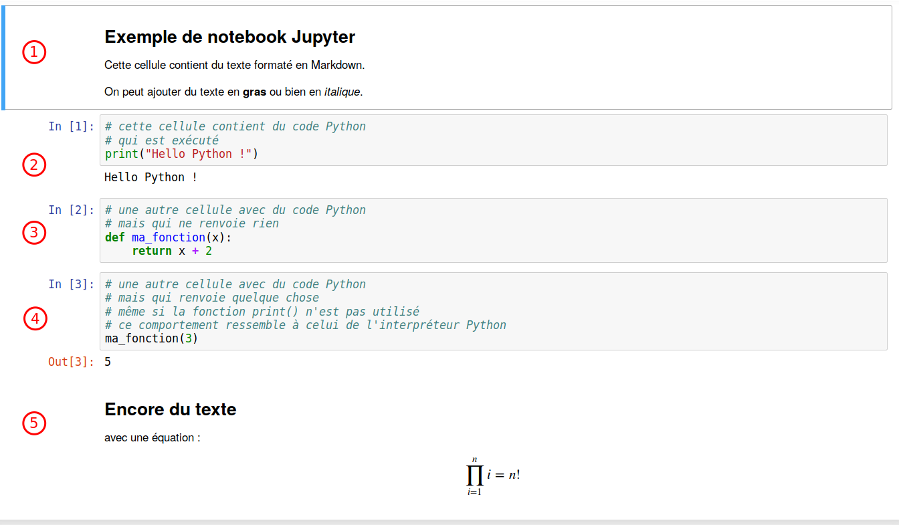{ #fig:jupyter-exemple width=80% }

Ce notebook est constitué de cinq cellules : deux avec du texte en Markdown (la première et la dernière) et trois avec du code Python (légèrement grisées).


## Installation

Avec la distribution Miniconda, les notebooks Jupyter s'installent avec la commande :

```bash
$ conda install -c conda-forge -y jupyterlab
```

Pour être exact, la commande précédente installe un peu plus que les notebooks Jupyter mais nous verrons cela par la suite.


## JupyterLab

En 2018, le consortium Jupyter a lancé *JupyterLab* qui est un environnement complet d'analyse.
Pour obtenir cette interface, lancez la commande suivante depuis un *shell* :

```bash
$ jupyter lab
```

Une nouvelle page devrait s'ouvrir dans votre navigateur web et vous devriez
obtenir une interface similaire à la figure @fig:jupyterlab-1, avec à gauche un navigateur de fichiers et à droite le « *Launcher* » qui permet de créer un nouveau notebook Jupyter, de lancer un terminal ou d'éditer un fichier texte, un fichier Mardown, un script Python...

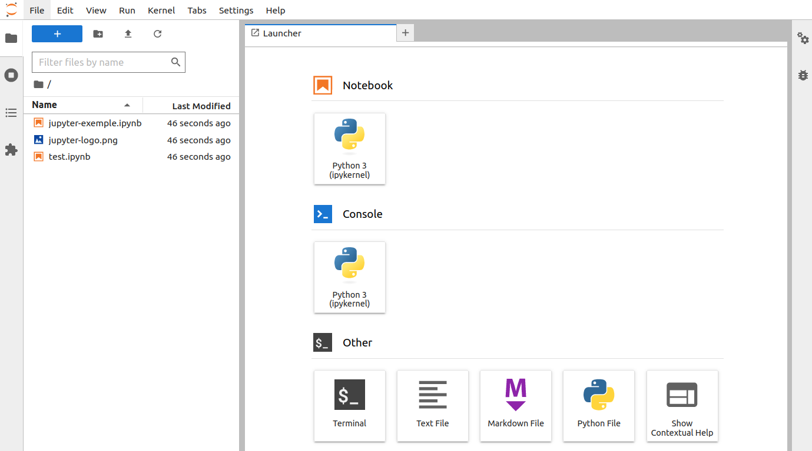{ #fig:jupyterlab-1 width=95% }

L'interface proposée par JupyterLab est très riche. On peut y organiser un notebook Jupyter, avec éventuellement une figure en encart, un *shell* (voir figure @fig:jupyterlab-2)... Les possibilités sont infinies !

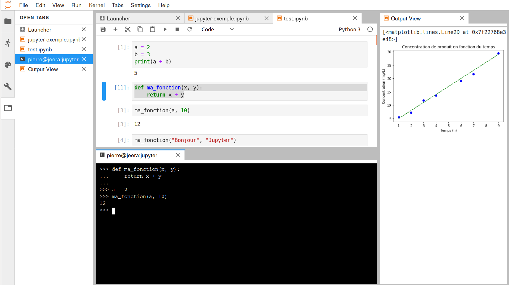{ #fig:jupyterlab-2 width=95% }


## Création d'un notebook

Pour créer un notebook, cliquez sur le bouton *Python 3* situé dans la rubrique *Notebook* dans le *Launcher

Vous noterez au passage qu'il est également possible de créer un fichier texte, un répertoire ou bien encore de lancer un *shell* via un *Terminal* (voir figure @fig:jupyter-nouveau-notebook).

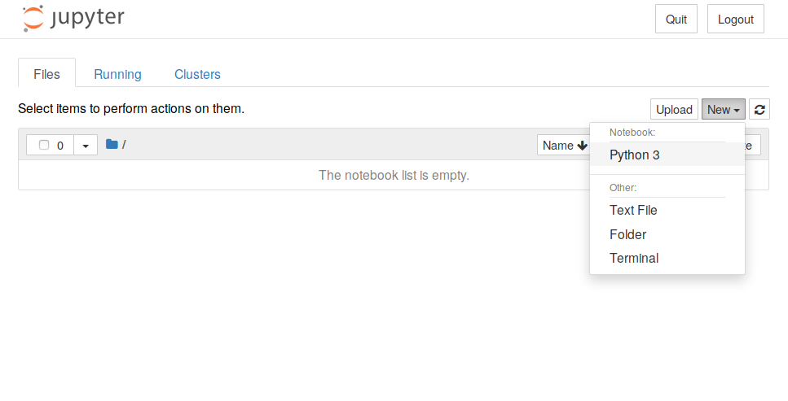{ #fig:jupyter-nouveau-notebook width=80% }

Le notebook fraîchement créé ne contient qu'une cellule vide.

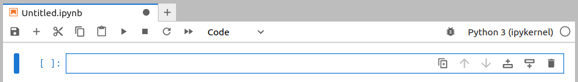{ #fig:jupyter-nouveau-notebook-vide width=80% }

La première chose à faire est de donner un nom à votre notebook. Pour cela cliquer avec le bouton droit de la soris sur *Untitled.ipynb* en haud du notebook. Si le nom de votre notebook est *test.ipynb* alors le fichier *test.ipynb* sera créé dans le répertoire depuis lequel vous avez lancé JupyterLab.

open-box-rem

L'extension *.ipynb* est l'extension de fichier des notebooks Jupyter.

close-box-rem

Vous pouvez entrer des instructions Python dans la première cellule. Par exemple :

```python
a = 2
b = 3
print(a+b)
```

Pour exécuter le contenu de cette cellule, vous avez plusieurs possibilités :

- Cliquer sur le menu *Run*, puis *Run Selected Cells*.
- Cliquer sur le bouton *Run* ▶️ (dans la barre de menu au dessus du notebook).
- Presser simultanément les touches *Ctrl* + *Entrée*.

Dans tous les cas, vous devriez obtenir quelque chose qui ressemble à l'image @fig:jupyter-cellule-1. La notation `[1]` à gauche de la cellule indique qu'il s'agit de la première cellule exécutée.

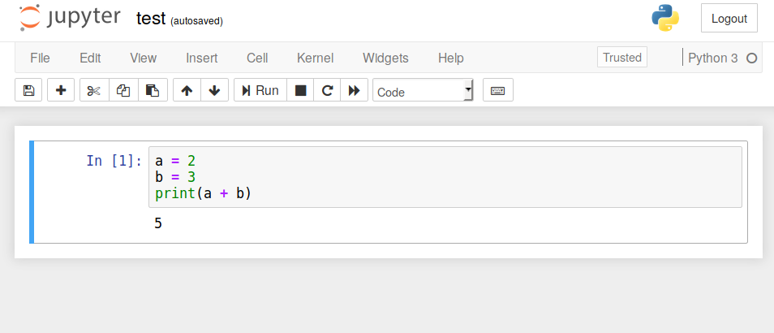{ #fig:jupyter-cellule-1 width=80% }

Pour créer une nouvelle cellule, vous avez, ici encore, plusieurs possibilités :

- Cliquer sur l’icône *+* dans la barre de menu.
- Cliquer sur la 2e icône à partir de la droite (juste à côté de la poubelle) dans la suite d'icônes situées à droite de la cellule.

Une nouvelle cellule vide devrait apparaître.

Vous pouvez également créer une nouvelle cellule en positionnant votre curseur dans la première cellule, puis en pressant simultanément les touches *Alt* + *Entrée*. Si vous utilisez cette combinaison de touches, vous remarquerez que le numéro à gauche de la première cellule est passée de `[1]` à `[2]` car vous avez exécuté une nouvelle fois la première cellule *puis* créé une nouvelle cellule.

Vous pouvez ainsi créer plusieurs cellules les unes à la suite des autres. Un objet créé dans une cellule antérieure sera disponible dans les cellules suivantes. Par exemple, dans la figure @fig:jupyter-cellule-4, nous avons quatre cellules.

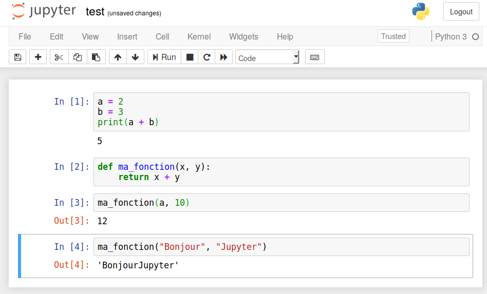{ #fig:jupyter-cellule-4 width=80% }

Dans un notebook Jupyter, il est parfaitement possible de réexécuter une cellule précédente. Par exemple la première cellule, qui porte désormais à sa gauche la numérotation `[5]` (voir figure @fig:jupyter-cellule-4-mauvais-ordre).

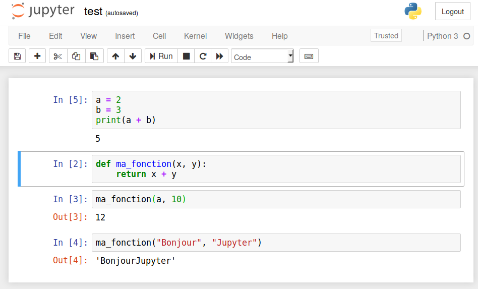{ #fig:jupyter-cellule-4-mauvais-ordre width=80% }

open-box-warn

La possibilité d'exécuter les cellules d'un notebook Jupyter dans un ordre arbitraire peut prêter à confusion, notamment si vous modifiez la même variable d'une cellule à l'autre.

Nous vous recommandons de régulièrement relancer complètement l'exécution de toutes les cellules de votre notebook, de la première à la dernière, en cliquant sur le menu *Kernel* puis *Restart Kernel and Run All Cells* et enfin de valider le message *Restart Kernel?* en cliquant sur le bouton *Restart*.

close-box-warn


## Le format Markdown

Dans le tout premier exemple (figure @fig:jupyter-exemple), nous avons vu qu'il était possible de mettre du texte au format Markdown dans une cellule.

Il faut cependant indiquer à Jupyter que cette cellule est au format Markdown en cliquant sur *Code* sous la barre de menu au dessus du notebook puis en choisissant *Markdown*.

Le format Markdown permet de rédiger du texte formaté (gras, italique, liens, titres, images, formules mathématiques...) avec quelques balises très simples. Voici un exemple dans une notebook Jupyter (figure @fig:jupyter-markdown-1) et le rendu lorsque la cellule est exécutée (figure @fig:jupyter-markdown-2).

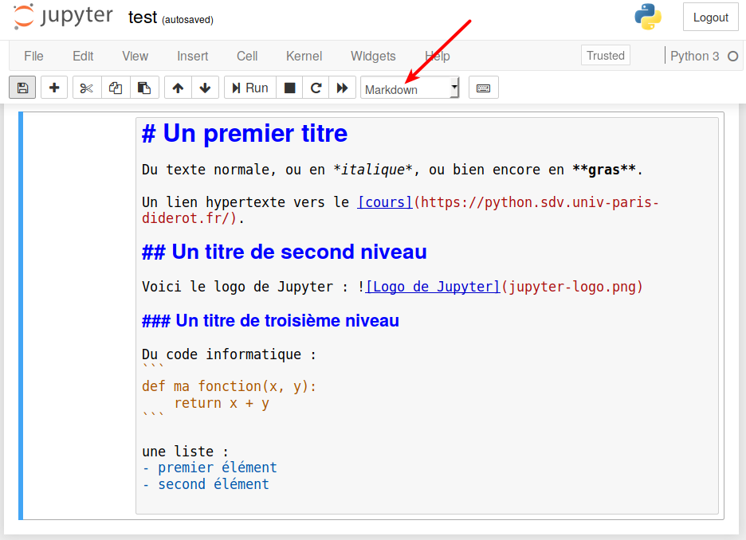{ #fig:jupyter-markdown-1 width=80% }

."){ #fig:jupyter-markdown-2 width=80% }

Notez qu'une cellule Markdown est sur fond blanc.

Le format Markdown permet de rapidement et très simplement rédiger du texte structuré. Ce cours est par exemple complètement rédigé en Markdown.

Nous vous conseillons d'explorer les possibilités du Markdown en consultant la page [Wikipédia](https://fr.wikipedia.org/wiki/Markdown) ou directement la [page de référence](https://daringfireball.net/projects/markdown/syntax).


## Des graphiques dans les notebooks

Un autre intérêt des notebooks Jupyter est de pouvoir y incorporer des graphiques réalisés avec la bibliothèque *matplotlib* (que nous verrons prochainement).

Voici un exemple en reprenant un graphique présenté dans le chapitre 21 *Module Matplotlib* (figure @fig:jupyter-matplotlib).

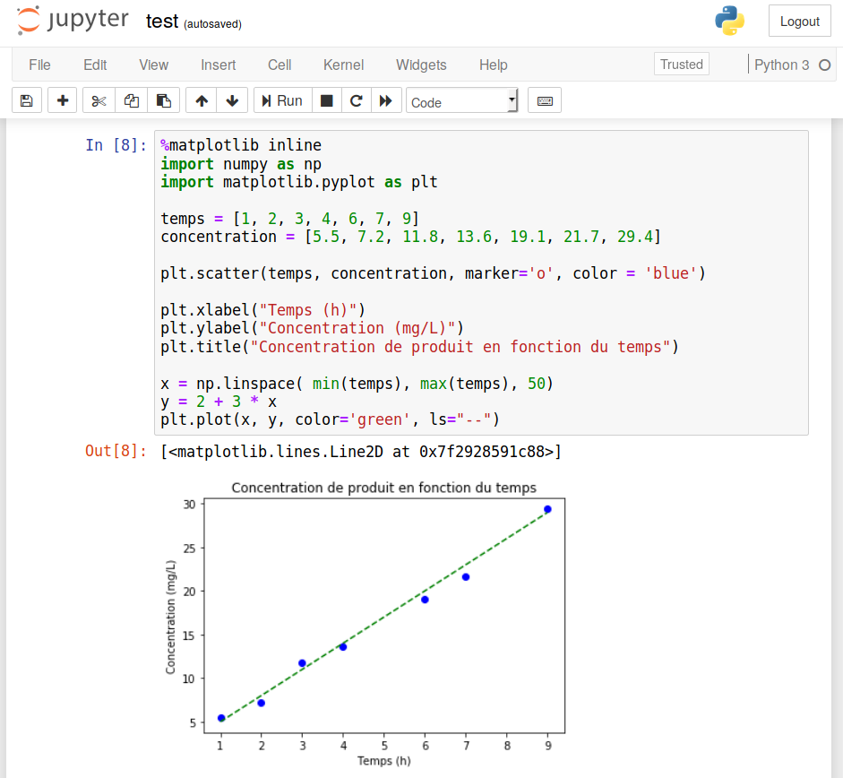{ #fig:jupyter-matplotlib width=80% }

L'utilisation de `%matplotlib inline` n'est pas nécessaire dans les versions récentes de Jupyter Lab. Mais d'anciennes versions, vous pourriez en avoir besoin pour que les graphiques s'affichent correctement dans le notebook.

open-box-rem

Pour quitter l'interface Jupyter Lab, il y a plusieurs possibilités :

- Dans le menu en haut à gauche de l'interface, cliquer sur *File*, puis *Shut Down*, puis confrimer en cliquant sur le bouton "Shut Down".
- Une méthode plus radicale est de revenir sur le *shell* depuis lequel JupyterLab a été lancé, puis de presser deux fois de suite la combinaison de touches *Ctrl* + *C*.

close-box-rem


## Les *magic commands*

La commande précédente (`%matplotlib inline`) est une *magic command*. Les [*magic commands*](https://ipython.readthedocs.io/en/stable/interactive/magics.html) apportent des fonctionnalités supplémentaire dans un notebook. Il en existe beaucoup, en voici quelques unes :

- `%whos` liste tous les objets (variables, fonctions, modules...) utilisés dans le notebook (voir figure @fig:jupyter-whos).
- `%history` liste toutes les commandes Python lancées dans un notebook (voir figure @fig:jupyter-history).

{ #fig:jupyter-whos width=80% }

{ #fig:jupyter-history width=80% }

La commande `%%time` (avec deyx symboles `%`) va mesurer le temps d'exécution d'une cellule. C'est très utile pour faire des tests de performance. Par exemple :

```python
%%time
concentrations = [5.5, 7.2, 11.8, 13.6, 19.1, 21.7, 29.4]
for conc in concentrations:
    print(conc)
```

renvoie le résultat de la figure @fig:jupyter-time. Bien sûr les valeurs obtenues dépendent de la machine sur laquelle vous exécutez cette commande. Mais même en utilisant une même machine, les résultats peuvent fluctuer d'une exécution à l'autre en fonction de l'activité de la machine. Ces fluctuations seront d'autant plus importantes que le temps d'exécution est court.

{ #fig:jupyter-time width=80% }

Pour palier à ce problème, la *magic command* `%%timeit` va exécuter plusieurs fois la cellule et donner une estimation du temps d'exécution moyen. Dans l'exemple de la figure @fig:jupyter-timeit, on compare le un parcours de liste avec une boucle `for`, soit directement sur les éléments, soit sur les indices des éléments. Python détermine automatiquement le nombre d'itérations et le nombre de répétions à effectuer pour obtenir un temps d'exécution raisonnable. Ici, chaque cellule sera exécutée un million de fois sur sept répétitions. Comme nous l'avions expliqué dans le chapitre 5. *Boucles et comparaisons*, itérer une liste sur ses éléments est la méthode la plus efficace (et la plus élégante).

{ #fig:jupyter-timeit width=80% }


## Lancement d'une commande Unix

Enfin, dans les environnements Linux ou Mac OS X, il est possible de lancer une commande Unix depuis un notebook Jupyter. Il faut pour cela précéder la commande du symbole « `!` ». La figure @fig:jupyter-ls illustre cette possibilité avec la commande `ls` qui affiche le contenu d'un répertoire.

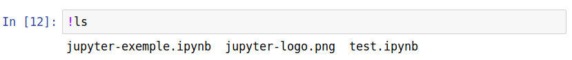{ #fig:jupyter-ls width=80% }

open-box-rem

Le lancement de n'importe quelle commande Unix depuis un notebook Jupyter (en précédant cette commande de `!`) est une fonctionnalité très puissante.

Pour vous en rendre compte, jetez un œil au [notebook](https://github.com/MaayanLab/Zika-RNAseq-Pipeline/blob/master/Zika.ipynb) produit par les chercheurs Zichen Wang et Avi Ma'ayan qui reproduit l'analyse complète de données obtenues par séquençage haut débit. Ces analyses ont donné lieu à la publication de l'article scientifique « [*An open RNA-Seq data analysis pipeline tutorial with an example of reprocessing data from a recent Zika virus study*](https://f1000research.com/articles/5-1574/) » (F1000 Research, 2016).

close-box-rem


open-box-more

Les *notebooks* Jupyter sont particulièrement adaptés à l'analyse de données en combinaison avec les modules *Matplotlib* et *Pandas* que nous verrons dans les prochaines chapitres.

close-box-more
