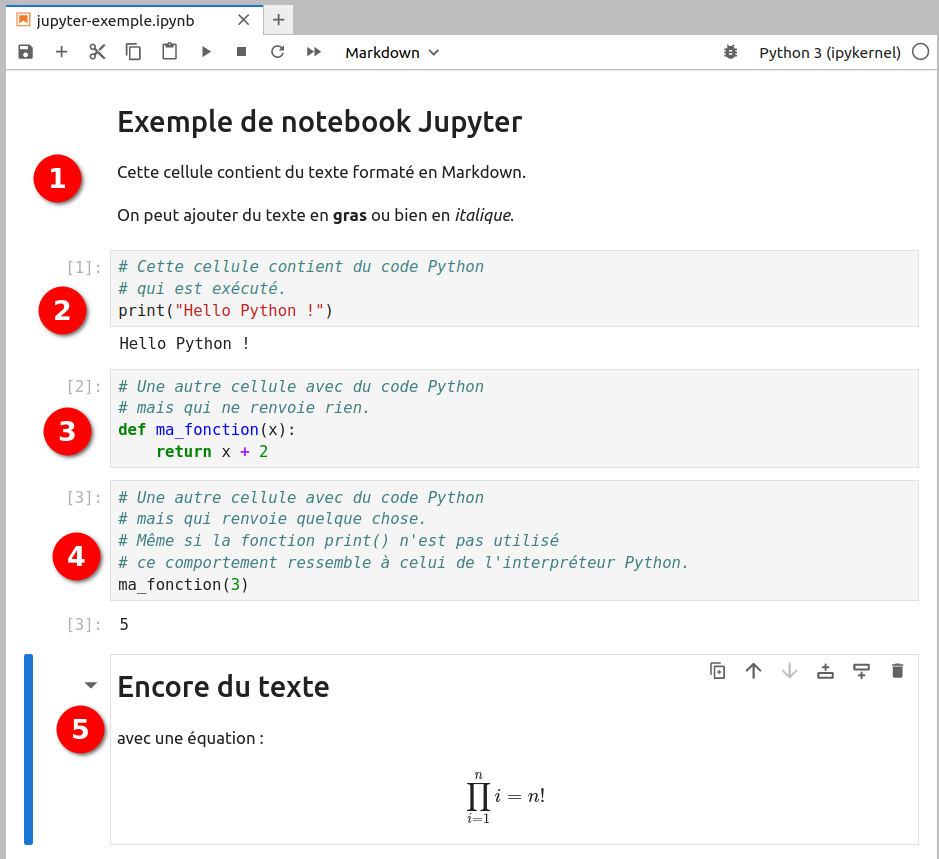
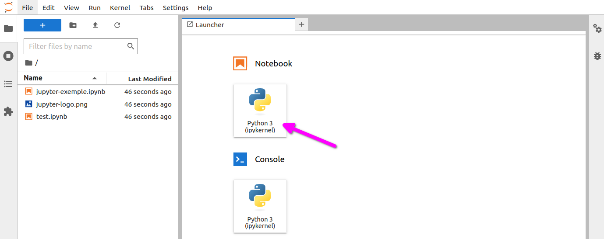
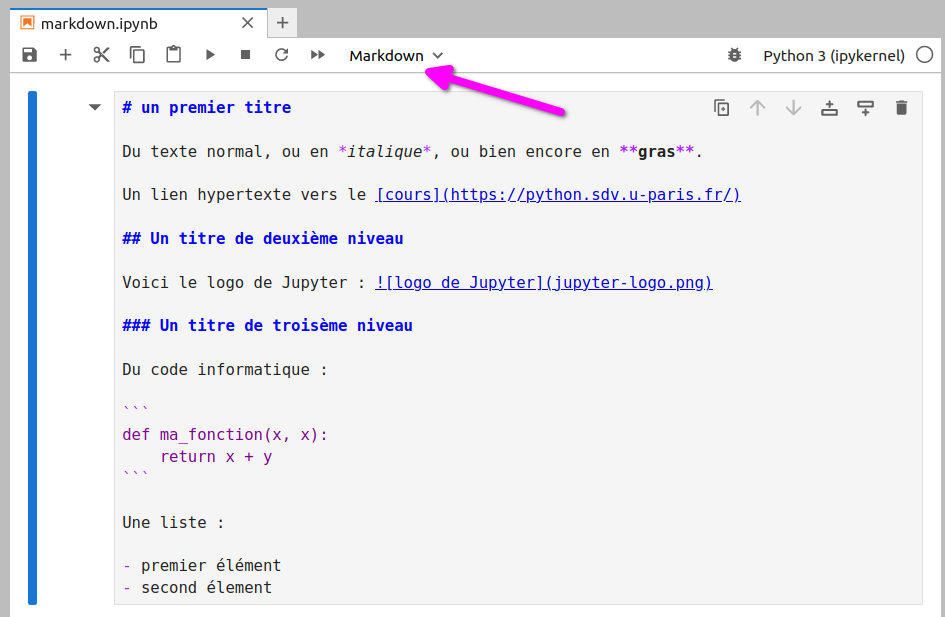

# Jupyter et ses notebooks

Les notebooks Jupyter sont des cahiers électroniques qui, dans le même document, peuvent rassembler du texte, des images, des formules mathématiques et du code informatique exécutable. Ils sont manipulables interactivement dans un navigateur web.

Initialement développés pour les langages de programmation Julia, Python et R (d'où le nom Jupyter), les notebooks Jupyter supportent près de 40 langages différents.

La cellule est l'élément de base d'un notebook Jupyter. Elle peut contenir du texte formaté au format Markdown ou du code informatique qui pourra être exécuté.

Voici un exemple de notebook Jupyter (figure @fig:jupyter-exemple) :

{ #fig:jupyter-exemple width=80% }

Ce notebook est constitué de cinq cellules : deux avec du texte en Markdown (la première et la dernière) et trois avec du code Python (notées avec `In [ ]`).

## Installation

Avec la distribution Miniconda, les notebooks Jupyter s'installent avec la commande :
```
$ conda install -y jupyterlab
```

Pour être exact, la commande précédente installe un peu plus que les notebooks Jupyter mais nous verrons cela par la suite.


## Lancement de Jupyter et création d'un notebook

Pour lancer les notebooks Jupyter, utilisez la commande suivante depuis un *shell* :
```
$ jupyter-notebook
```

Une nouvelle page devrait s'ouvrir dans votre navigateur web  et ressembler à la figure @fig:jupyter-interface.

{ #fig:jupyter-interface width=80% }

Cette interface liste les notebooks Jupyter existants (pour le moment aucun).

Pour créer un notebook, cliquez sur le bouton à droite *New* puis sélectionnez *Python 3*. Vous noterez au passage qu'il est également possible de créer un fichier texte, un répertoire ou bien encore de lancer un *shell* via un *Terminal* (voir figure @fig:jupyter-nouveau-notebook).

{ #fig:jupyter-nouveau-notebook width=80% }

Le notebook fraîchement créé ne contient qu'une cellule vide.

{ #fig:jupyter-nouveau-notebook-vide width=80% }

La première chose à faire est de donner un nom à votre notebook en cliquant sur *Untitled*, à droite du logo de Jupyter. Si le nom de votre notebook est *test* alors le fichier *test.ipynb* sera créé dans le répertoire depuis lequel vous avez lancé Jupyter.

open-box-rem

L'extension *.ipynb* est l'extension de fichier des notebooks Jupyter.

close-box-rem

Vous pouvez entrer des instructions Python dans la première cellule. Par exemple :
```
a = 2
b = 3
print(a+b)
```

Pour exécuter le contenu de cette cellule, vous avez plusieurs possibilités :

- Cliquer sur le menu *Cell*, puis *Run Cells*.
- Cliquer sur le bouton *Run* (sous la barre de menu).
- Presser simultanément les touches *Ctrl* + *Entrée*.

Dans tous les cas, vous devriez obtenir quelque chose qui ressemble à l'image @fig:jupyter-cellule-1. La notation `In [1]` à gauche de la cellule indique qu'il s'agit de la première cellule exécutée.

{ #fig:jupyter-cellule-1 width=80% }

Pour créer une nouvelle cellule, vous avez, ici encore, plusieurs possibilités :

- Cliquer sur l’icône *+* sous la barre de menu.
- Cliquer sur le menu *Insert*, puis *Insert Cell Below*.

Une nouvelle cellule vide devrait apparaître.

Vous pouvez également créer une nouvelle cellule en positionnant votre curseur dans la première cellule, puis en pressant simultanément les touches *Alt* + *Entrée*. Si vous utilisez cette combinaison de touches, vous remarquerez que le numéro à gauche de la première cellule est passée de `In [1]` à `In [2]` car vous avez exécuté la première cellule *puis* créé une nouvelle cellule.

Vous pouvez ainsi créer plusieurs cellules les unes à la suite des autres. Un objet créé dans une cellule antérieure sera disponible dans les cellules suivantes. Par exemple, dans la figure @fig:jupyter-cellule-4, nous avons quatre cellules. Vous remarquerez que pour les cellules 3 et 4, le résultat renvoyé par le code Python est précédé par `Out [3]` et `Out [4]`.

{ #fig:jupyter-cellule-4 width=80% }

Dans un notebook Jupyter, il est parfaitement possible de réexécuter une cellule précédente. Par exemple la première cellule, qui porte désormais à sa gauche la numérotation `In [5]` (voir figure @fig:jupyter-cellule-4-mauvais-ordre).

{ #fig:jupyter-cellule-4-mauvais-ordre width=80% }

open-box-warn

La possibilité d'exécuter les cellules d'un notebook Jupyter dans un ordre arbitraire peut prêter à confusion, notamment si vous modifiez la même variable d'une cellule à l'autre.

Nous vous recommandons de régulièrement relancer complètement l'exécution de toutes les cellules de votre notebook, de la première à la dernière, en cliquant sur le menu *Kernel* puis *Restart & Run All* et enfin de valider le message *Restart and Run All Cells*.

close-box-warn


## Le format Markdown

Dans le tout premier exemple (figure @fig:jupyter-exemple), nous avons vu qu'il était possible de mettre du texte au format Markdown dans une cellule.

Il faut cependant indiquer à Jupyter que cette cellule est au format Markdown en cliquant sur *Code* sous la barre de menu puis en choisissant *Markdown*.

Le format Markdown permet de rédiger du texte formaté (gras, italique, liens, titres, images, formules mathématiques...) avec quelques balises très simples. Voici un exemple dans une notebook Jupyter (figure @fig:jupyter-markdown-1) et le rendu lorsque la cellule est exécutée (figure @fig:jupyter-markdown-2).

{ #fig:jupyter-markdown-1 width=80% }

."){ #fig:jupyter-markdown-2 width=80% }

Notez qu'une cellule Markdown n'a pas le marqueur `In [ ]` à sa gauche.

Le format Markdown permet de rapidement et très simplement rédiger du texte structuré. Ce cours est par exemple complètement rédigé en Markdown ;-)

Nous vous conseillons d'explorer les possibilités du Markdown en consultant la page [Wikipédia](https://fr.wikipedia.org/wiki/Markdown) ou directement la [page de référence](https://daringfireball.net/projects/markdown/syntax).


## Des graphiques dans les notebooks

Un autre intérêt des notebooks Jupyter est de pouvoir y incorporer des graphiques réalisés avec la bibliothèque *matplotlib*.

Voici un exemple en reprenant un graphique présenté dans le chapitre 17 *Quelques modules d'intérêt en bioinformatique* (figure @fig:jupyter-matplotlib).

{ #fig:jupyter-matplotlib width=80% }

La différence notable est l'utilisation de la commande :  
`%matplotlib inline`  
qui n'est à lancer qu'une seule fois (en général dans la première cellule du notebook) et qui permet l'incorporation de figures dans un notebook Jupyter.

open-box-rem

Pour quitter l'interface des notebooks Jupyter, il faut, dans le premier onglet qui est apparu, cliquer sur le bouton *Quit* (figure @fig:jupyter-interface).

Une méthode plus radicale est de revenir sur le *shell* depuis lequel les notebooks Jupyter ont été lancés puis de presser deux fois la combinaison de touches *Ctrl* + *C*.

close-box-rem


## Les *magic commands*

La commande précédente (`%matplotlib inline`) est une *magic command*. Il en existe beaucoup, en voici deux :

- `%whos` liste tous les objets (variables, fonctions, modules...) utilisés dans le notebook (voir figure @fig:jupyter-whos).
- `%history` liste toutes les commandes Python lancées dans un notebook (voir figure @fig:jupyter-history).

{ #fig:jupyter-whos width=80% }

{ #fig:jupyter-history width=80% }

Enfin, avec les environnements Linux ou Mac OS X, il est possible de lancer une commande Unix depuis un notebook Jupyter. Il faut pour cela précéder la commande du symbole « `!` ». La figure @fig:jupyter-ls illustre cette possibilité avec la commande `ls` qui affiche le contenu d'un répertoire.

{ #fig:jupyter-ls width=80% }

open-box-rem

Le lancement de n'importe quelle commande Unix depuis un notebook Jupyter (en précédant cette commande de `!`) est une fonctionnalité très puissante.

Pour vous en rendre compte, jetez un œil au [notebook](https://github.com/MaayanLab/Zika-RNAseq-Pipeline/blob/master/Zika.ipynb) produit par les chercheurs Zichen Wang et Avi Ma'ayan qui reproduit l'analyse complète de données obtenues par séquençage haut débit. Ces analyses ont donné lieu à la publication de l'article scientifique « [*An open RNA-Seq data analysis pipeline tutorial with an example of reprocessing data from a recent Zika virus study*](https://f1000research.com/articles/5-1574/) » (F1000 Research, 2016).

close-box-rem


## JupyterLab

En 2018, le consortium Jupyter a lancé *JupyterLab* qui est un environnement complet d'analyse.
Pour obtenir cette interface, lancez la commande suivante depuis un *shell* :
```
$ jupyter lab
```

Une nouvelle page devrait s'ouvrir dans votre navigateur web et vous devriez
obtenir une interface similaire à la figure @fig:jupyterlab-1.

{ #fig:jupyterlab-1 width=95% }

L'interface proposée par JupyterLab est très riche. On peut y organiser un notebook Jupyter « classique » avec une figure en encart, un *shell* (voir figure @fig:jupyterlab-2)... Les possibilités sont infinies !

{ #fig:jupyterlab-2 width=95% }

open-box-more

Les *notebooks* Jupyter sont particulièrement adaptés à l'analyse de données en combinaison avec les modules *matplotlib* et *pandas*.

close-box-more
