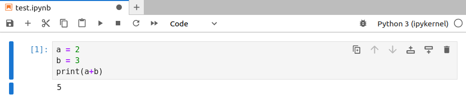
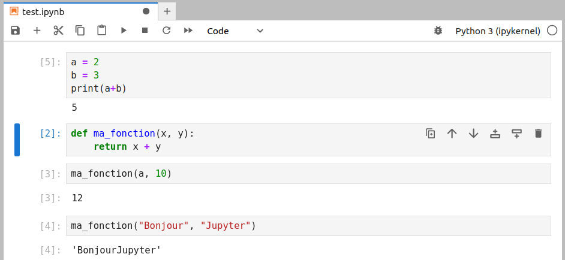
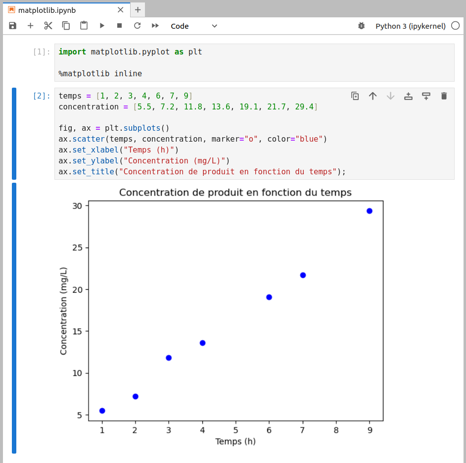

# Jupyter et ses *notebooks*

Les *notebooks* Jupyter sont des cahiers électroniques qui, dans le même document, peuvent rassembler du texte, des images, des formules mathématiques, des tableaux, des graphiques et du code informatique exécutable. Ils sont manipulables interactivement dans un navigateur web.

Initialement développés pour les langages de programmation Julia, Python et R (d'où le nom *Jupyter*), les *notebooks* Jupyter supportent près de 40 langages différents.

La cellule est l'élément de base d'un *notebook* Jupyter. Elle peut contenir du texte formaté au format Markdown ou du code informatique qui pourra être exécuté.

Voici un exemple de *notebook* Jupyter (figure @fig:jupyter-exemple) :

{ #fig:jupyter-exemple width=98% }

Ce *notebook* est constitué de cinq cellules : deux avec du texte en Markdown (la première et la dernière) et trois avec du code Python (légèrement grisées).


## Installation

Avec la distribution Miniconda, les *notebooks* Jupyter s'installent avec la commande :

```bash
$ conda install -c conda-forge -y jupyterlab
```

Pour être exact, la commande précédente installe un peu plus que les *notebooks* Jupyter, mais nous verrons cela par la suite.


## JupyterLab

En 2018, le consortium Jupyter a lancé *JupyterLab*, qui est un environnement complet de programmation et d'analyse de données.

Pour obtenir cette interface, lancez la commande suivante depuis un *shell* :

```bash
$ jupyter lab
```

Une nouvelle page devrait s'ouvrir dans votre navigateur web et vous devriez
obtenir une interface similaire à la figure @fig:jupyterlab-1, avec à gauche un navigateur de fichiers et à droite le « *Launcher* », qui permet de créer un nouveau *notebook* Jupyter, de lancer un terminal ou d'éditer un fichier texte, un fichier Mardown, un script Python...

{ #fig:jupyterlab-1 width=98% }

L'interface proposée par JupyterLab est très riche. On peut y organiser un *notebook* Jupyter, un éditeur de fichier texte, un terminal... Les possibilités sont nombreuses et nous vous invitons à explorer cette interface par vous-même.


## Création d'un *notebook*

Pour créer un *notebook*, cliquez sur le bouton *Python 3* situé dans la rubrique *Notebook* dans le *Launcher* (figure @fig:jupyter-nouveau-notebook).

{ #fig:jupyter-nouveau-notebook width=95% }

Le *notebook* fraîchement créé ne contient qu'une cellule vide.

{ #fig:jupyter-nouveau-notebook-vide width=95% }

La première chose à faire est de donner un nom à votre *notebook*. Pour cela, cliquer avec le bouton droit de la souris sur *Untitled.ipynb*, en haut du *notebook*. Si le nom de votre *notebook* est *test.ipynb*, alors le fichier *test.ipynb* sera créé dans le répertoire depuis lequel vous avez lancé JupyterLab.

open-box-rem

L'extension *.ipynb* est l'extension de fichier des *notebooks* Jupyter.

close-box-rem

Vous pouvez entrer des instructions Python dans la première cellule. Par exemple :

```python
a = 2
b = 3
print(a+b)
```

Pour exécuter le contenu de cette cellule, vous avez plusieurs possibilités :

- Cliquer sur le menu *Run*, puis *Run Selected Cells*.
- Cliquer sur le bouton ▶️ dans la barre de menu au dessus du *notebook*.
- Presser simultanément les touches *Ctrl* + *Entrée*.

Dans tous les cas, vous devriez obtenir un résultat similaire à la figure @fig:jupyter-cellule-1. La notation `[1]` à gauche de la cellule indique qu'il s'agit de la première cellule de code qui a été exécutée.

{ #fig:jupyter-cellule-1 width=95% }

Pour créer une nouvelle cellule, vous avez, ici encore, plusieurs possibilités :

- Cliquer sur l’icône *+* dans la barre de menu au dessus du *notebook*.
- Cliquer sur la 2e icône à partir de la droite (juste à côté de la poubelle), dans les icônes situées à l'intérieur de la cellule, à droite.

Une nouvelle cellule vide devrait apparaître.

Vous pouvez également créer une nouvelle cellule, en positionnant votre curseur dans la première cellule, puis en pressant simultanément les touches *Alt* + *Entrée*. Si vous utilisez cette combinaison de touches, vous remarquerez que le numéro à gauche de la première cellule est passée de `[1]` à `[2]`, car vous avez exécuté une nouvelle fois la première cellule *puis* créé une nouvelle cellule.

Vous pouvez ainsi créer plusieurs cellules les unes à la suite des autres. Un objet créé dans une cellule antérieure sera disponible dans les cellules suivantes. Par exemple, dans la figure @fig:jupyter-cellule-4, nous avons quatre cellules.

{ #fig:jupyter-cellule-4 width=95% }

Dans un *notebook* Jupyter, il est parfaitement possible de réexécuter une cellule précédente. Par exemple la première cellule, qui porte désormais à sa gauche la numérotation `[5]` (voir figure @fig:jupyter-cellule-4-mauvais-ordre).

{ #fig:jupyter-cellule-4-mauvais-ordre width=95% }

open-box-warn

La possibilité d'exécuter les cellules d'un *notebook* Jupyter dans un ordre arbitraire peut prêter à confusion, notamment si vous modifiez la même variable dans plusieurs cellules.

Nous vous recommandons de régulièrement relancer complètement l'exécution de toutes les cellules de votre *notebook*, de la première à la dernière, en cliquant sur le menu *Kernel* puis *Restart Kernel and Run All Cells* et enfin de valider le message *Restart Kernel?* en cliquant sur le bouton *Restart*.

close-box-warn


## Le format Markdown

Dans le tout premier exemple (figure @fig:jupyter-exemple), nous avons vu qu'il était possible de mettre du texte au format Markdown dans une cellule.

Il faut cependant indiquer à Jupyter que cette cellule est au format Markdown en cliquant sur *Code*, sous la barre de menu au dessus du *notebook*, puis en choisissant *Markdown*.

Le format Markdown permet de rédiger du texte formaté (gras, italique, liens, titres, images, formules mathématiques...) avec quelques balises très simples. Voici un exemple dans un *notebook* Jupyter (figure @fig:jupyter-markdown (A)) et le rendu lorsque la cellule est exécutée (figure @fig:jupyter-markdown (B)). Notez qu'une cellule Markdown est sur fond blanc (comme sur la figure @fig:jupyter-markdown (B)).

{ #fig:jupyter-markdown width=98% }

Le format Markdown permet de rédiger du texte structuré rapidement et simplement. Ce cours est par exemple complètement rédigé en Markdown. Nous vous conseillons d'explorer les possibilités du Markdown en consultant la page [Wikipédia](https://fr.wikipedia.org/wiki/Markdown) ou directement la [page de référence](https://daringfireball.net/projects/markdown/syntax).


## Des graphiques dans les *notebooks*

Un autre intérêt des *notebooks* Jupyter est de pouvoir y incorporer des graphiques réalisés avec la bibliothèque *matplotlib* (que nous verrons prochainement).

Voici un exemple, d'un graphique qui sera présenté dans le chapitre 21 *Module Matplotlib* (figure @fig:jupyter-matplotlib).

{ #fig:jupyter-matplotlib width=80% }

L'utilisation de `%matplotlib inline` n'est pas nécessaire dans les versions récentes de JupyterLab. Mais avec d'anciennes versions, vous pourriez en avoir besoin pour que les graphiques s'affichent dans le *notebook*.

open-box-rem

Pour quitter l'interface Jupyter Lab, il y a plusieurs possibilités :

- Dans le menu en haut à gauche de l'interface, cliquer sur *File*, puis *Shut Down*, puis confirmer en cliquant sur le bouton *Shut Down*.
- Une méthode plus radicale est de revenir sur le *shell* depuis lequel JupyterLab a été lancé, puis de presser deux fois de suite la combinaison de touches *Ctrl* + *C*.

close-box-rem


## Les *magic commands*

La commande précédente (`%matplotlib inline`) est une *magic command*. Les [*magic commands*](https://ipython.readthedocs.io/en/stable/interactive/magics.html) apportent des fonctionnalités supplémentaires dans un *notebook*. Il en existe beaucoup, nous allons en aborder ici quelques unes.


open-box-rem

Dans cette rubrique, nous vous montrerons quelques exemples d’utilisation de *magic commands* exécutées dans un *notebook* Jupyter.

```python
Les cellules de code apparaitront de cette manière
dans un notebook Jupyter, avec des numéros de lignes à gauche.
```

```text
Les résultats seront affichés de cette manière,
éventuellement sur plusieurs lignes.
```

close-box-rem


### %whos

La commande `%whos` liste tous les objets (variables, fonctions, modules...) utilisés dans un *notebook*.

Si une cellule précédente contenait le code : 

```python
a = 2 
b = 3

def ma_fonction(x, y):
    return x + y

resultat_1 = ma_fonction(a, 10)
resultat_2 = ma_fonction("Bonjour", "Jupyter")
```

alors l'exécution de : 

```python
%whos
```

renvoie :

```text
Variable      Type        Data/Info
-----------------------------------
a             int         2
b             int         3
ma_fonction   function    <function ma_fonction at 0x7f219c2d04a0>
resultat_1    int         12
resultat_2    str         BonjourJupyter
```


### %history

La commande `%history` liste toutes les commandes Python lancées dans un *notebook* :

```python
%history
```

```text
a = 2
b = 3
print(a + b)
def ma_fonction(x, y):
    return x + y
ma_fonction(a, 10)
ma_fonction("Bonjour", "Jupyter")
%whos
%history
```


### %%time

La commande `%%time` (avec deux symboles `%`) va mesurer le temps d'exécution d'une cellule. C'est très utile pour faire des tests de performance. On peut, par exemple, comparer les vitesses de parcours d'une liste avec une boucle `for`, par les éléments ou par les indices des éléments.

Ainsi, cette cellule :

```python
%%time
concentrations = [5.5, 7.2, 11.8, 13.6, 19.1, 21.7, 29.4]
somme_carres = 0.0
for conc in concentrations:
    somme_carres += conc**2
```

renvoie :

```text
CPU times: user 8 µs, sys: 2 µs, total: 10 µs
Wall time: 11.9 µs
```

et celle-ci :

```python
%%time
concentrations = [5.5, 7.2, 11.8, 13.6, 19.1, 21.7, 29.4]
somme_carres = 0.0
for idx in range(len(concentrations)):
    somme_carres += concentrations[idx]**2
```

renvoie :

```text
CPU times: user 26 µs, sys: 5 µs, total: 31 µs
Wall time: 37.4 µs
```

Comme attendu, la première méthode (itération par les éléments) est plus rapide que la seconde (itération par les indices des éléments). Les temps obtenus dépendent de la machine sur laquelle vous exécutez ces commandes. Mais, sur une même machine, les résultats peuvent fluctuer d'une exécution à l'autre en fonction de l'activité de la machine. Ces fluctuations seront d'autant plus importantes que le temps d'exécution est court.


### %%timeit

Pour palier à ce problème, la *magic command* `%%timeit` va exécuter plusieurs fois la cellule et donner une estimation du temps d'exécution moyen. Python détermine automatiquement le nombre d'itérations et le nombre de répétitions à effectuer pour obtenir un temps global d'exécution raisonnable.

En reprenant l'exemple précédent, on obtient :

```python
%%timeit
concentrations = [5.5, 7.2, 11.8, 13.6, 19.1, 21.7, 29.4]
somme_carres = 0.0
for conc in concentrations:
    somme_carres += conc**2
```

```text
492 ns ± 11.8 ns per loop (mean ± std. dev. of 7 runs, 1,000,000 loops each)
```

et

```python
%%timeit
concentrations = [5.5, 7.2, 11.8, 13.6, 19.1, 21.7, 29.4]
somme_carres = 0.0
for idx in range(len(concentrations)):
    somme_carres += concentrations[idx]**2
```

```text
606 ns ± 21.6 ns per loop (mean ± std. dev. of 7 runs, 1,000,000 loops each)
```

Ici, chaque cellule sera exécutée un million de fois sur sept répétitions, soit sept millions de fois au total. Comme nous l'avions expliqué dans le chapitre 5 *Boucles et comparaisons*, itérer une liste sur ses éléments est la méthode la plus efficace (et la plus élégante).


## Lancement d'une commande Unix

Enfin, dans les environnements Linux ou Mac OS X, il est possible de lancer une commande Unix depuis un *notebook* Jupyter. Il faut pour cela faire précéder la commande du symbole « `!` ». 
Par exemple, la commande `ls` affiche le contenu du répertoire courant :

```python
!ls
```

```text
jupyter-exemple.ipynb  markdown.ipynb	 test.ipynb
jupyter-logo.png       matplotlib.ipynb
```

open-box-more

Le lancement d'une commande Unix depuis un *notebook* Jupyter (en précédant cette commande de `!`) est très utile pour réaliser de grosses analyses de données.
Pour vous en rendre compte, explorez ce [*notebook*](https://github.com/MaayanLab/Zika-RNAseq-Pipeline/blob/master/Zika.ipynb) qui reproduit une analyse complète de données de séquençage haut débit. Ces résultats ont donné lieu à la publication de l'article scientifique « [An open RNA-Seq data analysis pipeline tutorial with an example of reprocessing data from a recent Zika virus study](https://f1000research.com/articles/5-1574/) » (F1000 Research, 2016).

close-box-more


open-box-adv

Les *notebooks* Jupyter sont particulièrement adaptés à l'analyse de données en combinaison avec les modules *matplotlib* et *pandas*, qui seront abordés dans les prochains chapitres.

close-box-adv
