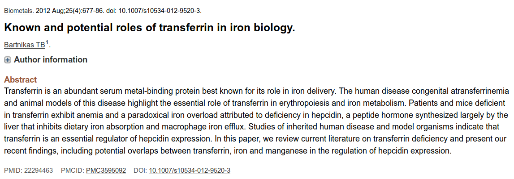

# Module Biopython

Nous allons aborder dans ce chapitre un module incontournable en bioinformatique. En effet, le module [*Biopython*](http://biopython.org/) permet de manipuler des données biologiques, comme des séquences (nucléiques et protéiques) ou des structures (fichiers PDB), et d'interroger des bases de données comme PubMed. Le [tutoriel](http://biopython.org/DIST/docs/tutorial/Tutorial.html) est particulièrement bien fait, n'hésitez pas à le consulter.


## Installation et convention

Contrairement aux autres modules vus précédemment, *Biopython* n'est pas fourni avec la distribution Python de base. Avec la distribution Miniconda que nous vous conseillons d'utiliser (consultez pour cela la documentation en [ligne](https://python.sdv.u-paris.fr/livre-dunod)), vous pouvez rapidement l'installer avec la commande :

```bash
$ conda install -c conda-forge biopython
```

Dans ce chapitre, nous vous montrerons quelques exemples d’utilisation du module *Biopython* pour vous convaincre de sa pertinence. Ces exemples seront exécutés dans un *notebook* Jupyter.

```python
Les cellules de code apparaitront de cette manière
dans un notebook Jupyter, avec des numéros de lignes à gauche.
```

```text
Les résultats seront affichés de cette manière,
éventuellement sur plusieurs lignes.
```

## Chargement du module

On charge le module *Biopython* avec la commande :

```python
import Bio
```

\index{bio@Bio}

open-box-warn

Le nom du module *Biopython* n'est pas `biopython`, mais `Bio` (avec un B majuscule).

close-box-warn


## Manipulation de séquences

Voici quelques exemples de manipulation de séquences avec *Biopython*.

### Définition d'une séquence

\index{seq@Seq}

```python
import Bio
from Bio.Seq import Seq
ADN = Seq("ATATCGGCTATAGCATGC")
ADN
```

```text
Seq('ATATCGGCTATAGCATGC')
```

- **Ligne 1.** Le module *Biopython* s'appelle `Bio`.
- **Ligne 2.** On charge la classe `Seq` du sous-module `Bio.Seq`.
- **Ligne 3.** La variable `ADN` est de type `Seq`, comme affiché dans le résultat.


### Obtention de la séquence complémentaire et de la séquence complémentaire inverse

\index{complement@.complement()}

```python
ADN.complement()
```

```text
Seq('TATAGCCGATATCGTACG')
```

\index{reversecomplement@.reverse\_complement()}

```python
ADN.reverse_complement()
```

```text
Seq('GCATGCTATAGCCGATAT')
```

### Traduction en séquence protéique

\index{translate@.translate()}

```python
ADN.translate()
```

```text
Seq('ISAIAC')
```

open-box-adv

Dans l'annexe A *Quelques formats de données en biologie*, vous
trouverez de nombreux exemples d'utilisation de *Biopython* pour manipuler
des données aux formats FASTA, GenBank et PDB.

close-box-adv


## Interrogation de la base de données PubMed

Le sous-module *Entrez* de *Biopython* permet d’utiliser les ressources du NCBI
et notamment d'interroger la base de données [PubMed](https://www.ncbi.nlm.nih.gov/pubmed/).
Nous allons par exemple utiliser PubMed pour chercher des articles scientifiques
relatifs à la transferrine (*transferrin* en anglais):

\index{entrez@Entrez}
\index{esearch@esearch()}

```python
from Bio import Entrez
Entrez.email = "votremail@provider.fr"
req_esearch = Entrez.esearch(db="pubmed", term="transferrin")
res_esearch = Entrez.read(req_esearch)
```

- **Ligne 1.** On charge directement le sous-module *Entrez*.
- **Ligne 2.** Lors d'une requête sur le site du NCBI, il est important de définir correctement
la variable `Entrez.email`, qui sera transmise au NCBI lors de la requête et qui
pourra être utilisée pour vous contacter en cas de difficulté avec le serveur.
- **Ligne 3.** On lance la requête (`transferrin`) sur le moteur de recherche `pubmed`. La requête est stockée dans la variable `req_esearch`.
- **Ligne 4.** Le résultat est lu et stocké dans la variable `res_esearch`.

Sans être un vrai dictionnaire, la variable `res_esearch` en a cependant plusieurs propriétés.
Voici ses clés :

```python
res_esearch.keys()
```

```text
dict_keys(['Count', 'RetMax', 'RetStart', 'IdList', 'TranslationSet',
'TranslationStack', 'QueryTranslation'])
```

La valeur associée à la clé `IdList` est une liste qui contient les identifiants
(PMID) des articles scientifiques associés à la requête (ici `transferrin`) :

```python
res_esearch["IdList"]
```

```text
['30411489', '30409795', '30405884', '30405827', '30402883', '30401570',
'30399508', '30397276', '30395963', '30394734', '30394728', '30394123',
'30393423', '30392910', '30392664', '30391706', '30391651', '30391537',
'30391296', '30390672']
```

```python
len(res_esearch["IdList"])
```

```text
20
```

Cette liste ne contient les identifiants que de 20 publications, alors que, si nous
faisons cette même requête directement sur le site de PubMed depuis un navigateur
web, nous obtenons plus de 45 700 résultats.

En réalité, le nombre exact de publications (en janvier 2024) est connu :

```python
res_esearch["Count"]
```

```text
'45717'
```

Pour ne pas saturer les serveurs du NCBI, seulement 20 PMID sont renvoyés par défaut.
Mais vous pouvez augmenter cette limite en utilisant le paramètre `retmax` dans la fonction `Entrez.esearch()`.

Nous pouvons maintenant récupérer des informations sur une publication précise
en connaissant son PMID, par exemple, l'article avec le PMID [22294463](https://www.ncbi.nlm.nih.gov/pubmed/22294463), dont un aperçu est sur la figure @fig:entrez-transferrin.

{ #fig:entrez-transferrin width=98% }

Nous allons pour cela utiliser la fonction `Entrez.esummary()`

\index{esummary@esummary()}

```python
req_esummary = Entrez.esummary(db="pubmed", id="22294463")
res_esummary = Entrez.read(req_esummary)
```

La variable `res_esummary` n'est pas réellement une liste (son type exacte est `Bio.Entrez.Parser.ListElement`), 
mais elle est indexable (voir chapitre 14 *Conteneurs*).
Cette pseudo-liste n'a qu'un seul élément, qui est lui-même un dictionnaire dont voici les clés :

```python
res_esummary[0].keys()
```

```text
dict_keys(['Item', 'Id', 'PubDate', 'EPubDate', 'Source', 'AuthorList',
'LastAuthor', 'Title', 'Volume', 'Issue', 'Pages', 'LangList',
'NlmUniqueID', 'ISSN', 'ESSN', 'PubTypeList', 'RecordStatus', 'PubStatus',
'ArticleIds', 'DOI', 'History', 'References', 'HasAbstract', 'PmcRefCount',
'FullJournalName', 'ELocationID', 'SO'])
```

Nous pouvons alors facilement obtenir le titre, le DOI et la date de publication
(`PubDate`) de cet article, ainsi que le journal (`Source`) dans lequel il a été
publié :

```python
res_esummary[0]["Title"]
```

```text
'Known and potential roles of transferrin in iron biology.'
```

```python
res_esummary[0]["DOI"]
```

```text
'10.1007/s10534-012-9520-3'
```

```python
res_esummary[0]["PubDate"]
```

```text
'2012 Aug'
```

```python
res_esummary[0]["Source"]
```

```text
'Biometals'
```

Enfin, pour récupérer le résumé de la publication précédente, nous allons
utiliser la fonction `Entrez.efetch()` :

\index{efetch@efetch()}

```python
req_efetch = Entrez.efetch(
    db="pubmed", id="22294463", 
    rettype="abstract", retmode="text")
req_efetch.read()
```

```text
'1. Biometals. 2012 Aug;25(4):677-86. doi: 10.1007/s10534-012-9520-3.
\n\nKnown and potential roles of transferrin in iron biology.\n\nBart
nikas TB(1).\n\nAuthor information:\n(1)Department of Pathology, Chil
dren’s Hospital, Enders 1110, 300 Longwood \nAvenue, Boston, MA 02115
, USA. mas.Bartnikas@childrens.harvard.edu\n\nTransferrin is an abund
ant serum metal-binding protein best known for its role \nin iron del
[...]
```

Le résultat n'est pas très lisible, car il apparait comme un seul bloc. Le caractère `\n` 
désigne un retour à la ligne. L'instruction `print()` affichera 
le résultat de manière plus lisible :

```python
req_efetch = Entrez.efetch(
    db="pubmed", id="22294463", 
    rettype="abstract", retmode="text")
print(req_efetch.read())
```

```text
1. Biometals. 2012 Aug;25(4):677-86. doi: 10.1007/s10534-012-9520-3.

Known and potential roles of transferrin in iron biology.

Bartnikas TB(1).

Author information:
(1)Department of Pathology, Children’s Hospital, Enders 1110, 300 Longwood 
Avenue, Boston, MA 02115, USA. mas.Bartnikas@childrens.harvard.edu

Transferrin is an abundant serum metal-binding protein best known for its role 
in iron delivery. The human disease congenital atransferrinemia and animal 
models of this disease highlight the essential role of transferrin in 
erythropoiesis and iron metabolism. Patients and mice deficient in transferrin 
exhibit anemia and a paradoxical iron overload attributed to deficiency in 
hepcidin, a peptide hormone synthesized largely by the liver that inhibits 
dietary iron absorption and macrophage iron efflux. Studies of inherited human 
disease and model organisms indicate that transferrin is an essential regulator 
of hepcidin expression. In this paper, we review current literature on 
transferrin deficiency and present our recent findings, including potential 
overlaps between transferrin, iron and manganese in the regulation of hepcidin 
expression.

DOI: 10.1007/s10534-012-9520-3
PMCID: PMC3595092
PMID: 22294463 [Indexed for MEDLINE]
```

Le résultat contient bien le résumé de la figure @fig:entrez-transferrin,
mais aussi d'autres informations comme le titre, le DOI, la date de publication...


## Exercices

open-box-adv

Pour ces exercices, utilisez des *notebooks* Jupyter.

close-box-adv


### Pourcentage de GC de gènes de *Plasmodium falciparum*

\index{FASTA@FASTA (format de fichier)}

*Plasmodium falciparum* (*P. falciparum*) est un des parasites responsables du paludisme chez les êtres humains. Le fichier [`p_falciparum_500.fasta`](https://python.sdv.u-paris.fr/data-files/p_falciparum_500.fasta) contient 500 gènes du génome de *P. falciparum*.

Écrivez un code Python qui calcule le pourcentage de GC de chaque gène. Les valeurs seront stockées dans un dictionnaire, avec comme clés les identifiants des gènes et comme valeurs le pourcentage de GC.

On rappelle que le pourcentage de GC d'une séquence est calculé avec la formule suivante :

$$
\textrm{pourcentage GC} = \frac{\textrm{nombre de bases G} + \textrm{nombre de bases C}}{\textrm{longueur de la séquence}} \times 100
$$

Affichez ensuite :

- Le nombre total de gènes.
- L'identifiant de la séquence qui a le pourcentage de GC le plus élevé, avec la valeur du pourcentage affichée avec deux chiffres après la virgule.
- L'identifiant de la séquence qui a le pourcentage de GC le plus faible, avec la valeur du pourcentage affichée avec deux chiffres après la virgule.


open-box-adv

Pour cet exercice, n'hésitez pas à consulter :

- Le chapitre 14 *Conteneurs* pour trier un dictionnaire.
- L'annexe A *Quelques formats de données en biologie* pour lire un fichier FASTA avec *Biopython*.

close-box-adv


### Années de publication des articles relatifs à la barstar

L'objectif de cet exercice est d'interroger automatiquement la base de données
bibliographique PubMed pour déterminer le nombre d'articles relatifs à la protéine barstar
publiés chaque année.

Vous utiliserez le module *Biopython* et le module *matplotlib*, qui sera vu un peu plus loin (les principales instructions vous seront fournies).


#### Requête avec un mot-clé

Sur le site de [PubMed](https://www.ncbi.nlm.nih.gov/pubmed/),
cherchez combien d'articles scientifiques sont relatifs à la barstar.

Effectuez la même chose avec Python et la méthode `Entrez.esearch()` de *Biopython*.

Choisissez un des PMID renvoyé et vérifiez dans PubMed que l'article associé est bien à propos de la barstar. Pour cela, indiquez le PMID choisi dans la barre de recherche de PubMed et cliquez sur *Search*. Attention, l'association n'est pas toujours évidente. Cherchez éventuellement dans le résumé de l'article si besoin.

Est-ce que le nombre total d'articles trouvés est cohérent avec celui obtenu sur le site de PubMed ?


#### Récupération des informations d'une publication

Récupérez les informations de la publication dont le PMID est [29701945](https://www.ncbi.nlm.nih.gov/pubmed/29701945). Vous utiliserez la méthode `Entrez.esummary()`.

Affichez le titre, le DOI, le nom du journal (`Source`) et la date de publication (`PubDate`) de cet article. Vérifiez que cela correspond bien à ce que vous avez lu sur PubMed.


#### Récupération du résumé d'une publication

Récupérez le résumé de la publication dont le PMID est 29701945. Vous utiliserez la méthode `Entrez.efetch()`.

Affichez ce résumé.


#### Distribution des années de publication des articles relatifs à la barstar

En utilisant la méthode `Entrez.esearch()`, récupérez tous les PMID relatifs à la barstar. Pour cela, pensez à augmenter le paramètre `retmax`. Vos PMID seront stockés dans la liste `pmids` sous forme de chaînes de caractères. Vérifiez sur PubMed que vous avez récupéré le bon nombre d'articles.

En utilisant maintenant la méthode `Entrez.esummary()` dans une boucle, récupérez la date de publication de chaque article. Stockez l'année sous forme d'un nombre entier dans la liste `years`. Cette étape peut prendre une dizaine de minutes, soyez patient. Vous pouvez afficher dans votre boucle un message qui indique où vous en êtes dans la récupération des articles.

À la fin, vérifiez que votre liste `years` contient bien autant d'éléments que la liste `pmids`.

Calculez maintenant le nombre de publications par année. Vous créerez pour cela un dictionnaire `freq` qui aura pour clé les années (oui, une clé de dictionnaire peut aussi être un entier) et pour valeur le nombre de publications associées à une année donnée.

Créez une liste `x` qui contient les clés du dictionnaire `freq`. Ordonnez les valeurs dans `x` avec la méthode `.sort()`. Créez maintenant une seconde liste `y` qui contient, dans l'ordre, le nombre de publications associées à chaque année. Bien évidemment, les listes `x` et `y` doivent avoir la même taille. Au fait, en quelle année la barstar apparaît pour la première fois dans une publication scientifique ?

Ensuite, avec le module *matplotlib* (que nous aborderons prochainement), vous allez pouvoir afficher la distribution des publications en fonction des années :

```python
import matplotlib.pyplot as plt

fig, ax = plt.subplots()
ax.bar(x, y)
```

Vous pouvez également ajouter un peu de cosmétique et enregistrer le graphique sur votre disque dur :

```python
import matplotlib.pyplot as plt

fig, ax = plt.subplots()
ax.bar(x, y)

# Étiquetage des axes.
ax.set_xlabel("Années")
ax.set_ylabel("Nombre de publications")

# Ajout du titre du graphique.
ax.set_title("Distribution des publications qui mentionnent la barstar")

# Enregistrement sur le disque.
fig.savefig("distribution_barstar_annee.png")
```
