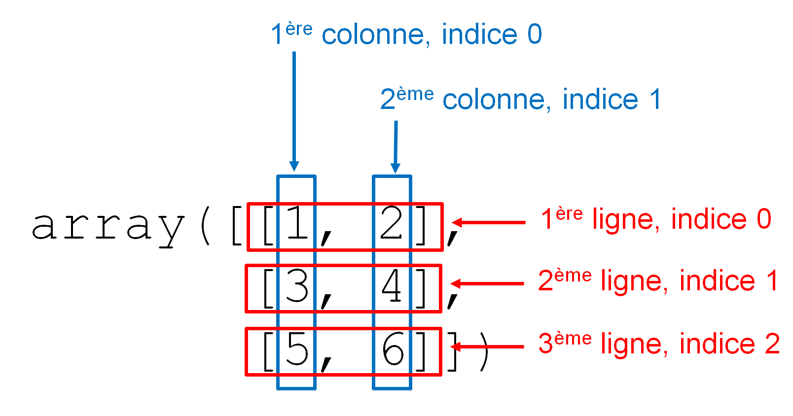

# Module NumPy

Le module [*NumPy*](http://numpy.scipy.org/) est incontournable en bioinformatique. Il permet d'effectuer des calculs sur des vecteurs ou des matrices, élément par élément, via un nouveau type d'objet appelé *array*.


## Installation et convention

Contrairement aux modules vus précédemment, *NumPy* n'est pas fourni avec la distribution Python de base. Avec la distribution Miniconda que nous vous conseillons d'utiliser (consultez pour cela la documentation en [ligne](https://python.sdv.u-paris.fr/livre-dunod)), vous pouvez rapidement l'installer avec la commande :

```bash
$ conda install -c conda-forge numpy
```

Dans ce chapitre, nous vous montrerons quelques exemples d’utilisation du module *NumPy* pour vous convaincre de sa pertinence. Ces exemples seront exécutés dans un *notebook* Jupyter.

```python
Les cellules de code apparaitront de cette manière
dans un notebook Jupyter, avec des numéros de lignes à gauche.
```

```text
Les résultats seront affichés de cette manière,
éventuellement sur plusieurs lignes.
```


## Chargement du module

On charge le module *NumPy* avec la commande :

```python
import numpy
```

Par convention, on utilise `np` comme nom raccourci pour *NumPy* :

```python
import numpy as np
```


## Objets de type *array*

Les objets de type *array* correspondent à des tableaux à une ou plusieurs dimensions et permettent d'effectuer du calcul vectoriel. La fonction `array()` convertit un conteneur (comme une liste ou un tuple) en un objet de type *array*. Voici un exemple de conversion d'une liste à une dimension en objet *array* :

```python
import numpy as np
a = [1, 2, 3]
np.array(a)
```

```text
array([1, 2, 3])
```

```python
b = np.array(a)
b
```

```text
array([1, 2, 3])
```

```python
type(b)
```

```text
numpy.ndarray
```

Nous avons converti la liste `[1, 2, 3]` en *array*. La fonction `np.array()` accepte aussi comme argument un tuple, ou un objet de type *range*.

Par ailleurs, lorsqu'on demande à Python d'afficher le contenu d'un objet *array*, le mot `array` et les symboles `([` et `])` sont utilisés pour le distinguer d'une liste (délimitée par les caractères `[` et `]`) ou d'un tuple (délimité par les caractères `(` et `)`).

open-box-rem

Un objet *array* ne contient que des données homogènes, c'est-à-dire d'un type identique.
Il est possible de créer un objet *array* à partir d'une liste contenant des entiers et des chaînes de caractères, mais, dans ce cas, toutes les valeurs seront comprises par *NumPy* comme des chaînes de caractères :

```python
a = np.array([1, 2, "tigre"])
a
```

```text
array(['1', '2', 'tigre'], dtype='<U21')
```

Dans cet exemple, toutes les valeurs du *array* sont entre guillemets, indiquant qu'il s'agit de chaînes de caractères.


De même, il est possible de créer un objet *array* à partir d'une liste constituée d'entiers et de *floats*, mais toutes les valeurs seront alors comprises par *NumPy* comme des *floats* :  

```python
b = np.array([1, 2, 3.5])
b
```

```text
array([1. , 2. , 3.5])
```

Ici, la notation `1.` indique qu'il s'agit du *float* `1.0000...` et pas de l'entier `1`.

close-box-rem


Sur un modèle similaire à la fonction `range()`, la fonction `arange()` permet de construire un *array* à une dimension :

```python
np.arange(10)
```

```text
array([0, 1, 2, 3, 4, 5, 6, 7, 8, 9])
```

Comme avec `range()`, on peut spécifier en argument une borne de début, une borne de fin et un pas :

```python
np.arange(10, 0, -1)
```

```text
array([10,  9,  8,  7,  6,  5,  4,  3,  2,  1])
```

Un autre avantage de la fonction `arange()` est qu'elle génère des objets *array* qui contiennent des entiers ou des *floats* (ce qui n'est pas possible avec `range()`) selon l'argument qu'on lui passe. D'abord un entier :

```python
np.arange(10)
```

```text
array([0, 1, 2, 3, 4, 5, 6, 7, 8, 9])
```

Puis un *float* :

```python
np.arange(10.0)
```

```text
array([ 0.,  1.,  2.,  3.,  4.,  5.,  6.,  7.,  8.,  9.])
```

La différence fondamentale entre un objet *array* à une dimension et une liste (ou un tuple) est que celui-ci est considéré comme un **vecteur**. Par conséquent, on peut effectuer des opérations vectorielles **élément par élément** sur ce type d'objet, ce qui est bien commode lorsqu'on analyse de grandes quantités de données. Regardez ces exemples :

```python
v = np.arange(4)
v
```

```text
array([0, 1, 2, 3])
```

On ajoute `1` à **chacun** des éléments de l'*array* `v` :

```python
v + 1
```

```text
array([1, 2, 3, 4])
```

On multiplie par `2` **chacun** des éléments de l'*array* `v` :

```python
v * 2
```

```text
array([0, 2, 4, 6])
```

Avec les listes, ces opérations n'auraient été possibles qu'en utilisant des boucles. Nous vous encourageons donc à utiliser dorénavant les objets *array* lorsque vous aurez besoin de faire des opérations élément par élément.

Il est aussi possible de multiplier deux *arrays* entre eux. Le résultat correspond alors à la multiplication **élément par élément** des deux *arrays* initiaux :

```python
v * v
```

```text
array([0, 1, 4, 9])
```


### *Array* et dimensions

Il est aussi possible de construire des objets *arrays* à deux dimensions, il suffit de passer en argument une liste de listes à la fonction `array()` :

```python
w = np.array([[1, 2], [3, 4], [5, 6]])
w
```

```text
array([[1, 2],
       [3, 4],
       [5, 6]])
```

On peut aussi créer des tableaux à trois dimensions en passant comme argument à la fonction `array()` une liste de listes de listes :

```python
x = np.array([[[1, 2], [2, 3]], [[4, 5], [5, 6]]])
x
```

```text
array([[[1, 2],
        [2, 3]],

       [[4, 5],
        [5, 6]]])
```

La fonction `array()` peut créer des tableaux à n'importe quel nombre de dimensions. Toutefois, cela devient vite compliqué lorsqu'on dépasse trois dimensions. Retenez qu'un objet *array* à une dimension peut être assimilé à un **vecteur**, un *array* à deux dimensions à une **matrice**. On peut généraliser ces objets mathématiques avec un nombre arbitraires de dimensions, on parle alors de **tenseur**, qui sont représentés avec NumPy en *array* à $n$ dimensions. Nous nous focaliserons dans la suite sur des *arrays* à une dimension (1D) ou deux dimensions (2D).

Avant de continuer, il est important de définir comment sont organisés ces *arrays* 2D qui représentent des matrices. Il s'agit de tableaux de nombres qui sont organisés en lignes et en colonnes comme le montre la figure @fig:array2Dlignescolonnes. Les indices indiqués dans cette figure seront définis un peu plus loin dans la rubrique *Indices*.

{ #fig:array2Dlignescolonnes width=80% }


Voici quelques attributs intéressants pour décrire un objet *array* :

```python
v = np.arange(4)
v
```

```text
array([0, 1, 2, 3])
```

```python
w = np.array([[1, 2], [3, 4], [5, 6]])
w
```

```text
array([[1, 2],
       [3, 4],
       [5, 6]])
```

L'attribut `.ndim` renvoie le nombre de dimensions de l'*array*. Par exemple, 1 pour un vecteur et 2 pour une matrice :

```python
v.ndim
```

```text
1
```

```python       
w.ndim
```

```text
2
```

L'attribut `.shape` renvoie les dimensions sous forme d'un tuple. Dans le cas d'une matrice (*array* à deux dimensions), la première valeur du tuple correspond au nombre de lignes et la seconde au nombre de colonnes.

```python
v.shape
```

```text
(4,)
```

```python
w.shape
```

```text
(3, 2)
```

Enfin, l'attribut `.size` renvoie le nombre total d'éléments contenus dans l'`array` :


```python
v.size
```

```text
4
```

```python
w.size
```

```text
6
```

### Redimensionnement d'*array*

La méthode `.reshape()` renvoie un nouvel *array* avec les dimensions spécifiées en argument :

```python
a = np.arange(0, 6)
a
```

```text
array([0, 1, 2, 3, 4, 5])
```

```python
a.shape
```

```text
(6,)
```

```python
b = a.reshape((2, 3))
b
```

```text
array([[0, 1, 2],
       [3, 4, 5]])
```

```python
b.shape
```

```text
(2, 3)
```

```python
a
```

```
array([0, 1, 2, 3, 4, 5])
```

Notez bien que l'*array* initial `a` n'a pas été modifié et que `a.reshape((2, 3))` n'est pas la même chose que `a.reshape((3, 2))` :

```python
c = a.reshape((3, 2))
c
```

```text
array([[0, 1],
       [2, 3],
       [4, 5]])
```

```python
c.shape
```

```text
(3, 2)
```

La méthode `.reshape()` attend que les nouvelles dimensions soient **compatibles** avec la dimension initiale de l'objet *array*, c'est-à-dire que le nombre d'éléments contenus dans les différents *arrays* soit le même.
Dans nos exemples précédents, $6 = 2 \times 3 = 3 \times 2$.

Si les nouvelles dimensions ne sont pas compatibles avec les dimensions initiales, la méthode `.reshape()` génère une erreur.

```python
a = np.arange(0, 6)
a
```

```text
array([0, 1, 2, 3, 4, 5])
```

```python
a.shape
```

```text
(6,)
```

```python
d = a.reshape((3, 4))
```

```text
---------------------------------------------------------------------------
ValueError                                Traceback (most recent call last)
Cell In[36], line 1
----> 1 d = a.reshape((3, 4))

ValueError: cannot reshape array of size 6 into shape (3,4)
```

La méthode `.resize()`, par contre, ne déclenche pas d'erreur dans une telle situation et ajoute des 0 jusqu'à ce que le nouvel *array* soit rempli, ou bien coupe la liste initiale.

```python
a = np.arange(0, 6)
a.shape
```

```text
(6,)
```

```python
a.resize((3, 3), refcheck=False)
a.shape
```

```text
(3, 3)
```

```python
a
```

```text
array([[0, 1, 2],
       [3, 4, 5],
       [0, 0, 0]])
```

```python
b = np.arange(0, 10)
b.shape
```

```text
(10,)
```

```python
b.resize((2, 3), refcheck=False)
b.shape
```

```text
(2, 3)
```

```python
b
```

```text
array([[0, 1, 2],
       [3, 4, 5]])
```

open-box-warn

- Cette modification de la forme de l'*array* par la méthode `.resize()` est faite « sur place » (*in place*), c'est-à-dire que la méthode ne renvoie rien, mais l'*array* initial est bel et bien modifié (comme des méthodes sur les listes telles que la méthode `.reverse()`, voir le chapitre 13 *Plus sur les listes*). 
- Si l'option `refcheck=False` n'est pas présente, Python peut parfois renvoyer une erreur s'il existe des références vers l'*array* qu'on souhaite modifier.

close-box-warn


Enfin, il existe la fonction `np.resize()` qui, dans le cas d'un nouvel *array* plus grand que l'*array* initial, va répéter l'*array* initial afin de remplir les cases manquantes :

```python
a = np.arange(0, 6)
a.shape
```

```text
(6,)
```

```python
c = np.resize(a, (3, 5))
c.shape
```

```text
(3, 5)
```

```python
c
```

```text
array([[0, 1, 2, 3, 4],
       [5, 0, 1, 2, 3],
       [4, 5, 0, 1, 2]])
```

```python
a
```

```text
array([0, 1, 2, 3, 4, 5])
```

Notez que la fonction `np.resize()` renvoie un nouvel *array* mais ne modifie pas l'*array* initial, contrairement à la méthode `.resize()`, décrite ci-dessus.

open-box-rem

Depuis le début de ce chapitre, nous avons toujours montré l'affichage d'un *array* tel quel dans un *notebook* Jupyter :

```python
a = np.array(range(10))
a
```

```text
array([0, 1, 2, 3, 4, 5, 6, 7, 8, 9])
```

```python
a2 = np.ones((3, 3))
a2
```

```text
array([[1., 1., 1.],
       [1., 1., 1.],
       [1., 1., 1.]])
```

Nous avons déjà indiqué que Python affiche systématiquement le mot *array* ainsi que les parenthèses, crochets et virgules pour séparer les éléments. Toutefois, si vous utilisez la fonction `print()`, l'affichage sera différent. Le mot *array*, les parenthèses et les virgules disparaissent :

```python
print(a)
```

```text
[0 1 2 3 4 5 6 7 8 9]
```

```python
print(a2)
```

```text
[[1. 1. 1.]
 [1. 1. 1.]
 [1. 1. 1.]]
```

Ceci peut amener des confusions, en particulier entre un *array* 1D :

```text
[0 1 2 3 4 5 6 7 8 9]
```

et une liste contenant les mêmes éléments :

```text
[0, 1, 2, 3, 4, 5, 6, 7, 8, 9]
```

Dans ce cas, seule la présence ou l'absence de virgules permet de savoir s'il s'agit d'un *array* ou d'une liste.

close-box-rem


### Méthodes de calcul sur les *arrays* et l'argument `axis`

Chaque *array NumPy* possède une multitude de méthodes. Nombre d'entre elles permettent de faire des calculs de base comme `.mean()` pour la moyenne, `.sum()` pour la somme, `.std()` pour l'écart-type, `.max()` pour extraire le maximum, `.min()` pour extraire le minimum, etc. La liste exhaustive est disponible [en ligne](https://numpy.org/doc/stable/reference/arrays.ndarray.html#calculation). Par défaut, chacune de ces méthodes effectuera l'opération sur l'*array* entier, quelle que soit sa dimensionnalité. Par exemple :

```python
import random
ma_liste = list(range(8))
random.shuffle(ma_liste)
ma_liste
```

```text
[2, 7, 6, 4, 0, 3, 1, 5]
```

```python
a = np.resize(ma_liste, (4, 2))
a
```

```text
array([[2, 7],
       [6, 4],
       [0, 3],
       [1, 5]])
```

```python
a.max()
```

```text
7
```

La méthode `.max()` a bien renvoyé la valeur maximale 7. Un argument *très* utile existant dans toutes ces méthodes est `axis`. Pour un *array* 2D, `axis=0` signifie qu'on fera l'opération le long de l'axe 0, à savoir les lignes. C'est-à-dire que l'opération se fait en variant les lignes. On récupère ainsi une valeur par colonne :

```python
a.max(axis=0)
```

```text
array([6, 7])
```

Dans l'*array* 1D récupéré, le premier élément vaut 6 (maximum de la 1ère colonne) et le second vaut 7 (maximum de la seconde colonne).

Avec `axis=1`, on fait une opération similaire, mais en faisant varier les colonnes. On récupère ainsi une valeur par ligne :

```python
a.max(axis=1)
```

```text
array([7, 6, 3, 5])
```

L'*array* 1D récupéré a 4 éléments correspondant au maximum de chaque ligne.

On comprend la puissance de l'argument `axis`. À nouveau, il est possible, en une ligne, de faire des calculs qui pourraient être fastidieux avec les listes traditionnelles.


### Indices

Pour récupérer un ou plusieurs élément(s) d'un objet *array*, vous pouvez utiliser les indices, de la même manière qu'avec les listes :

```python
a = np.arange(10)
a
```

```text
array([0, 1, 2, 3, 4, 5, 6, 7, 8, 9])
```

```python
a[1]
```

```text
1
```

L'utilisation des tranches est aussi possible :

```python
a[5:]
```

```text
array([5, 6, 7, 8, 9])
```

Ansi que les pas :

```python
a[::2]
```

```text
array([0, 2, 4, 6, 8])
```


Dans le cas d'un objet *array* à deux dimensions, vous pouvez récupérer une ligne complète (d'indice *i*), une colonne complète (d'indice *j*) ou bien un seul élément. La figure @fig:array2Dlignescolonnes montre comment sont organisés les indices des lignes et des colonnes.

```python
a = np.array([[1, 2], [3, 4]])
a
```

```text
array([[1, 2],
       [3, 4]])
```

```python
a[:,0]
```

```text
array([1, 3])
```

```python
a[0,:]
```

```text
array([1, 2])
```

La syntaxe `a[i,:]` renvoie la ligne d'indice `i`, et `a[:,j]` renvoie la colonne d'indice `j`. Les tranches sont aussi utilisables sur un *array* à deux dimensions.

```python
a[1, 1]
```

```text
4
```

La syntaxe `a[i, j]` renvoie l'élément à la ligne d'indice `i` et à la colonne d'indice `j`. Notez que *NumPy* suit la convention mathématiques des [matrices](https://fr.wikipedia.org/wiki/Matrice_(math%C3%A9matiques)#D%C3%A9finitions), à savoir, qu'**on définit toujours un élément par sa ligne puis par sa colonne**. En mathématiques, l'élément $a_{ij}$ d'une matrice $A$ se trouve à la $i^{ème}$ ligne et à la $j^{ème}$ colonne.


open-box-rem

Pour un *array* 2D, si un seul indice est donné, par exemple `a[i]`, on récupère la ligne d'indice `i` sous forme d'*array* 1D :

```python
a = np.array([[1, 2], [3, 4]])
a
```

```text
array([[1, 2],
       [3, 4]])
```

```python
a[0]
```

```text
array([1, 2])
```

```python
a[1]
```

```text
array([3, 4])
```

Pour cette raison, la syntaxe `a[i][j]` est également valide pour récupérer un élément :

```python
a[1, 1]
```

```text
4
```

```python
a[1][1]
```

```text
4
```

Nous vous recommandons la syntaxe `a[i, j]`, qui est plus proche de la [définition mathématique d'un élément de matrice](https://fr.wikipedia.org/wiki/Matrice_(math%C3%A9matiques)#D%C3%A9finitions).

close-box-rem


### Copie d'*arrays*

Comme pour les listes, nous attirons votre attention sur la copie d'*arrays* :

```python
a = np.arange(5)
a
```

```text
array([0, 1, 2, 3, 4])
```

```python
b = a
b[2] = -300
b
```

```text
array([   0,    1, -300,    3,    4])
```

```python
a
```

```text
array([   0,    1, -300,    3,    4])
```

open-box-warn

Par défaut la copie d'*arrays* se fait par référence, comme pour tous les conteneurs en Python (listes, *tuples*, dictionnaires, etc.).

close-box-warn

Afin d'éviter le problème, vous pouvez soit utiliser la fonction `np.array()`, qui crée une nouvelle copie distincte de l'*array* initial, soit la fonction `copy.deepcopy()`, comme pour les listes (voir chapitre 12 *Plus sur les listes*) :

```python
a = np.full((2, 2), 0)
a
```

```text
array([[0, 0],
       [0, 0]])
```

```python
b = np.array(a)
b[1, 1] = -300
import copy
c = copy.deepcopy(a)
c[1, 1] = -500
a
```

```text
array([[0, 0],
       [0, 0]])
```

```python
b
```

```text
array([[   0,    0],
       [   0, -300]])
```

```python
c
```

```text
array([[   0,    0],
       [   0, -500]])
```

La fonction `np.full()` est expliquée dans la rubrique suivante.

open-box-rem

L'instruction `b = np.array(a)` réalise bien une copie distincte de l'*array* `a`, quelle que soit sa dimensionnalité. Ceci n'était pas le cas avec la fonction `list()` pour les copies de listes à partir de la dimension deux (liste de listes) : 

```python
liste_1 = [[0, 0], [1, 1]]
liste_2 = list(liste_1)
import copy
liste_3 = copy.deepcopy(liste_1)
liste_1[1][1] = -365
liste_2
```

```text
[[0, 0], [1, -365]]
```

```python
liste_3
```

```text
[[0, 0], [1, 1]]
```

close-box-rem


## Construction automatique de matrices

Il est parfois pénible de construire une matrice (*array* à deux dimensions) à l'aide d'une liste de listes. Le module *NumPy* possède quelques fonctions pratiques pour initialiser des matrices. Par exemple, Les fonctions `zeros()` et `ones()` construisent des objets *array* contenant des 0 ou des 1. Il suffit de leur passer en argument un tuple indiquant les dimensions voulues.

```python
np.zeros((2, 3))
```

```text
array([[0., 0., 0.],
       [0., 0., 0.]])
```

```python
np.ones((3, 3))
```

```text
array([[1., 1., 1.],
      [1., 1., 1.],
      [1., 1., 1.]])
```

Par défaut, les fonctions `zeros()` et `ones()` génèrent des *floats*, mais vous pouvez demander des entiers en passant le type (par exemple `int`, `float`, etc.) en second argument :

```python
np.zeros((2,3), int)
```

```text
array([[0, 0, 0],
       [0, 0, 0]])
```

Enfin, si vous voulez construire une matrice avec autre chose que des 0 ou des 1, vous avez à votre disposition la fonction `full()` :

```python
np.full((2, 3), 7, int)
```

```text
array([[7, 7, 7],
       [7, 7, 7]])
```

```python
np.full((2, 3), 7, float)
```

```text
array([[ 7.,  7.,  7.],
       [ 7.,  7.,  7.]])
```

Nous construisons ainsi une matrice constituée de 2 lignes et 3 colonnes. Celle-ci ne contient que le chiffre 7 sous formes d'entiers (`int`) dans le premier cas et de *floats* dans le second.


## Chargement d'un *array* depuis un fichier

Le module *NumPy* contient aussi des fonctions pour lire des données à partir de fichiers et créer des *arrays* automatiquement. C'est très pratique, car la plupart du temps les données que l'on analyse proviennent de fichiers. La fonction la plus simple à prendre en main est `np.loadtxt()`. Celle-ci lit un fichier organisé en lignes et colonnes. Par exemple, imaginons que nous ayons un fichier `donnees.dat` contenant :

```text
  1   7 310
 15  -4  35
 78  95  79
```

La fonction prend en argument le nom du fichier et renvoie un *array* 2D directement :

```python
np.loadtxt("donnees.dat")
```

```text
array([[  1.,   7., 310.],
       [ 15.,  -4.,  35.],
       [ 78.,  95.,  79.]])
```

Pratique, non ? Attention toutefois aux points suivants :

- Chaque ligne doit avoir le même nombre de colonnes, la fonction ne gère pas les données manquantes.
- Chaque donnée est convertie en *float*, donc si une chaîne de caractères est rencontrée la fonction renvoie une erreur.
- Par défaut, les données doivent être séparées par n'importe quelle combinaison d'espace(s) et/ou de tabulations.

Nous vous conseillons de consulter la [documentation complète](https://numpy.org/doc/stable/reference/generated/numpy.loadtxt.html) de cette fonction. En effet, `np.loadtxt()` contient de nombreux arguments permettant de récupérer telles ou telles lignes ou colonnes, d'ignorer des lignes de commentaire, de changer le séparateur par défaut (par exemple la virgule `,` pour les fichiers .csv)... qui peuvent se révéler utiles.

L'opération inverse qui consiste à sauver un *array* dans un fichier se fait avec la fonction `np.savetxt()` :

```python
a = np.reshape(range(1, 10), (3, 3))
a
```

```text
array([[1, 2, 3],
       [4, 5, 6],
       [7, 8, 9]])
```

```python
np.savetxt("out.dat", a)
```

Ceci générera le fichier `out.dat` contenant les lignes suivantes :

```text
1.000000000000000000e+00 2.000000000000000000e+00 3.000000000000000000e+00
4.000000000000000000e+00 5.000000000000000000e+00 6.000000000000000000e+00
7.000000000000000000e+00 8.000000000000000000e+00 9.000000000000000000e+00
```

La fonction `np.savetxt()` écrit par défaut les données comme des *floats* en notation scientifique. Il existe de nombreuses [options possibles](https://numpy.org/doc/stable/reference/generated/numpy.savetxt.html) permettant de changer le format, les séparateurs, etc.


open-box-more

Il existe d'autres fonctions plus avancées telles que [np.genfromttxt()](https://numpy.org/doc/stable/reference/generated/numpy.genfromtxt.html), gérant les données manquantes, ou encore [np.load()](https://numpy.org/doc/stable/reference/generated/numpy.load.html) et [np.fromfile()](https://numpy.org/doc/stable/reference/generated/numpy.fromfile.html), permettant de lire des données au format binaire. De même, il existe des fonctions ou méthodes permettant d'écrire au format binaire : [np.save()](https://numpy.org/doc/stable/reference/generated/numpy.save.html) ou [.tofile()](https://numpy.org/doc/stable/reference/generated/numpy.ndarray.tofile.html#numpy.ndarray.tofile). Le format binaire possède en général l'extension `.npy` ou `.npz` lorsque les données sont compressées. L'avantage d'écrire au format binaire est que cela prend moins de place pour de gros tableaux de données.

close-box-more


## Concaténation d'*arrays*

Il peut être très utile de concaténer un ou plusieurs *arrays*. Il existe pour cela plusieurs fonctions dans *NumPy*, nous développerons celle qui nous parait la plus intuitive et directe : `np.concatenate()`.

Pour les *arrays* 1D, `np.concatenate()` prend en argument un tuple contenant les arrays à concaténer :

```python
a1 = np.array((0, 1))
a2 = np.array((3, 4))
a1
```

```text
array([0, 1])
```

```python
a2
```

```text
array([3, 4])
```

```python
np.concatenate((a1, a2))
```

```text
array([0, 1, 3, 4])
```

L'ordre de la concaténation est important :

```python
np.concatenate((a2, a1))
```

```text
array([3, 4, 0, 1])
```

```python
np.concatenate((a1, a2, a1, a2))
```

```text
array([0, 1, 3, 4, 0, 1, 3, 4])
```

Pour les *arrays* 2D, ça se complique un peu, car on peut concaténer des lignes ou des colonnes ! Ainsi, `np.concatenate()` prend un argument optionnel, à savoir `axis`. Comme nous l'avions expliqué plus haut, celui-ci va indiquer à *NumPy* si on veut concaténer le long de l'axe 0 (les lignes) ou le long de l'axe 1 (les colonnes). Voyons un exemple :

```python
a1 = np.reshape(np.array(range(6)), (3, 2))
a2 = a1 * 5
a1
```

```text
array([[0, 1],
       [2, 3],
       [4, 5]])
```

```python
a2
```

```text
array([[ 0,  5],
       [10, 15],
       [20, 25]])
```

On concatène d'abord par ligne (`axis=0`), c'est-à-dire qu'on ajoute les lignes du second *array* `a2` à celles de l'*array* `a1` :

```python
np.concatenate((a1, a2), axis=0)
```

```text
array([[ 0,  1],
       [ 2,  3],
       [ 4,  5],
       [ 0,  5],
       [10, 15],
       [20, 25]])
```

Ensuite, on concatène par colonne (`axis=1`). Attention, il vaut bien veiller à ce que la concaténation soit possible en terme de dimensionalité. Par exemple, lors de la concaténation par colonne, il faut que les deux *arrays* `a1` et `a2` aient le même nombre de lignes.

```python
np.concatenate((a1, a2), axis=1)
```

```text
array([[ 0,  1,  0,  5],
       [ 2,  3, 10, 15],
       [ 4,  5, 20, 25]])
```

Ces opérations de concaténation sont très importantes. On les utilise par exemple si on a des données dans plusieurs fichiers différents et qu'on veut les agréger dans un *array* unique. On verra qu'on peut faire le même genre de chose avec les fameux *Dataframes* du module *pandas*. Lisez bien également les recommandations dans la dernière rubrique *17.1.10 Quelques conseils* sur quand utiliser la concaténation d'*arrays* avec *NumPy*.


## Un peu d'algèbre linéaire

Après avoir manipulé les objets *array* comme des vecteurs et des matrices, voici quelques fonctions pour faire de l'algèbre linéaire.

La fonction `transpose()` renvoie la [transposée](https://fr.wikipedia.org/wiki/Matrice_transpos%C3%A9e) d'un *array*. Par exemple, pour une matrice :

```python
a = np.resize(np.arange(1, 10), (3, 3))
a
```

```text
array([[1, 2, 3],
       [4, 5, 6],
       [7, 8, 9]])
```

```python
np.transpose(a)
```

```text
array([[1, 4, 7],
       [2, 5, 8],
       [3, 6, 9]])
```

Tout objet *array* possède un attribut `.T` qui contient la transposée, il est ainsi possible d'utiliser cette notation objet plus compacte :

```python
a.T
```

```text
array([[1, 4, 7],
       [2, 5, 8],
       [3, 6, 9]])
```

La fonction `dot()` permet de [multiplier deux matrices](https://fr.wikipedia.org/wiki/Produit_matriciel#Produit_matriciel_ordinaire).

```python
a = np.resize(np.arange(4), (2, 2))
a
```

```text
array([[0, 1],
       [2, 3]])
```

```python
np.dot(a, a)
```

```text
array([[ 2,  3],
       [ 6, 11]])
```

```python
a * a
```

```
array([[0, 1],
       [4, 9]])
```

Notez bien que `dot(a, a)` renvoie le **produit matriciel** entre deux matrices, alors que l'opération `a * a` renvoie le produit **élément par élément**.


open-box-rem

Dans le module *NumPy*, il existe également des objets de type *matrix* pour lesquels les multiplications de matrices sont différents, mais nous ne les aborderons pas ici.

close-box-rem


Pour toutes les opérations suivantes, nous utiliserons des fonctions du sous-module *linalg* de *NumPy*.

La fonction `.diag()` permet de générer une matrice diagonale :

```python
a = np.diag((1, 2, 3))
a
```

```text
array([[1, 0, 0],
       [0, 2, 0],
       [0, 0, 3]])
```

La fonction `inv()` renvoie l'[inverse d'une matrice carrée](https://fr.wikipedia.org/wiki/Matrice_inversible) :

```python
np.linalg.inv(a)
```

```text
array([[1.        , 0.        , 0.        ],
       [0.        , 0.5       , 0.        ],
       [0.        , 0.        , 0.33333333]])
```

La fonction `det()` renvoie le [déterminant](https://fr.wikipedia.org/wiki/Calcul_du_d%C3%A9terminant_d%27une_matrice) d'une matrice carrée :

```python
np.linalg.det(a)
```

```text
6.0
```

Enfin, la fonction `eig()` renvoie les vecteurs et valeurs propres :

```python
np.linalg.eig(a)
```

```text
EigResult(eigenvalues=array([1., 2., 3.]), eigenvectors=array([[1., 0., 0.],
       [0., 1., 0.],
       [0., 0., 1.]]))
```

La fonction `eig()` renvoie un objet `EigResult`, qui contient les valeurs propres (`eigenvalues`) et les vecteurs propres (`eigenvectors`), qu'on peut ensuite récupérer par affectation multiple :

```python
eigvals, eigvecs = np.linalg.eig(a)
eigvals
```

```text
array([1., 2., 3.])
```

`eigvals` est un *array* 1D  contenant les trois valeurs propres.

```python
eigvecs
```

```text
array([[1., 0., 0.],
       [0., 1., 0.],
       [0., 0., 1.]])
```

`eigvecs` est un *array* 2D contenant les trois vecteurs propres (un par ligne).


## Parcours de matrice et affectation de lignes et colonnes

Lorqu'on a une matrice, on est souvent amené à la parcourir par ligne ou par colonne. *NumPy* permet d'itérer directement sur les lignes d'une *array* :

```python
a = np.reshape(np.arange(1, 10), (3, 3))
a
```

```text
array([[1, 2, 3],
       [4, 5, 6],
       [7, 8, 9]])
```

```python
for row in a:
    print(row, type(row))
```

```text
[1 2 3] <class 'numpy.ndarray'>
[4 5 6] <class 'numpy.ndarray'>
[7 8 9] <class 'numpy.ndarray'>
```

À chaque itération, la variable `row` est un *array* 1D correspondant à chaque ligne de la matrice `a`. Cela est du au fait que l'utilisation d'un indiçage unique `a[i]` pour un *array* 2D correspond à sa ligne d'indice `i` (voir la rubrique *Indices* ci-dessus). 

Pour itérer sur les colonnes, on peut utiliser l'astuce d'itérer sur la transposée de l'*array* `a`, c'est-à-dire `a.T` :

```python
for col in a.T:
    print(col, type(col))
```

```text
[1 4 7] <class 'numpy.ndarray'>
[2 5 8] <class 'numpy.ndarray'>
[3 6 9] <class 'numpy.ndarray'>
```

À chaque itération, la variable `col` est un *array* 1D correspondant à chaque colonne de `a`.

On se souvient de l'affectation multiple `x, y = 1, 2` qui permettait d'affecter des valeurs à plusieurs variables à la fois. Et bien, il est possible d'utiliser cette fonctionnalité aussi avec les *arrays NumPy* :

```python
a
```

```text
array([[1, 2, 3],
       [4, 5, 6],
       [7, 8, 9]])
```

```python
a1, a2, a3 = a
a1
```

```text
array([1, 2, 3])
```

```python
a2
```

```text
array([4, 5, 6])
```

```python
a3
```

```text
array([7, 8, 9])
```

Par défaut, l'affectation multiple se fait sur les lignes de l'*array* 2D. Cette fonctionnalité s'explique à nouveau par le fait que pour *NumPy*, `a[i]` correspond à la ligne d'indice `i` d'un *array* 2D. 

Pour utiliser l'affectation multiple sur les colonnes, il suffit d'utiliser la transposée `a.T` :

```python
c1, c2, c3 = a.T
c1
```

```text
array([1, 4, 7])
```

```python
c2
```

```tex
array([2, 5, 8])
```

```python
c3
```

```text
array([3, 6, 9])
```

## Masques booléens

\index{masque booleen@masque booléen (numpy)}

Une fonctionnalité puissante des *arrays* *NumPy* est l'utilisation des **masques booléens**. Avant de les définir, il est important d'introduire le concept d'*arrays* de booléens. Jusqu'à maintenant nous avions définis uniquement des *arrays* avec des types numériques *int* ou *float*. Il est tout à fait possible de définir des *arrays* de booléens. La fonction `np.full()` vue précédemment nous permet d'en construire facilement :

```python
np.full((2, 2), True)
```

```text
array([[ True,  True],
       [ True,  True]])
```

```python
np.full((2, 2), False)
```

```text
array([[False, False],
       [False, False]])
```

Au premier abord, nous n'en voyons pas forcément l'utilité... Mais qu'en est-il lorsqu'on utilise les opérateurs de comparaison avec un *array* ? Et bien cela renvoie un *array* de booléens !

```python
a = np.reshape(np.arange(1, 10), (3, 3))
a
```

```text
array([[1, 2, 3],
       [4, 5, 6],
       [7, 8, 9]])
```

```python
a > 5
```

```text
array([[False, False, False],
       [False, False,  True],
       [ True,  True,  True]])
```

```python
a == 2
```

```text
array([[False,  True, False],
       [False, False, False],
       [False, False, False]])
```

Tous les éléments de l'*array* satisfaisant la condition seront à `True`, les autres à `False`. Il est même possible de combiner plusieurs conditions avec les opérateurs logiques `&` et `|` (respectivement **ET** et **OU**) :

```python
a = np.reshape(np.arange(1, 10), (3, 3))
a
```

```text
array([[1, 2, 3],
       [4, 5, 6],
       [7, 8, 9]])
```

```python
(a > 3) & (a % 2 == 0)
```

```text
array([[False, False, False],
       [ True, False,  True],
       [False,  True, False]])
```

```python
(a > 3) | (a % 2 == 0)
```

```text
array([[False,  True, False],
       [ True,  True,  True],
       [ True,  True,  True]])
```

- Les opérateurs logiques `&` et `|` s'appliquent sur les *arrays* et sont différents des opérateurs logiques `and` et `or`, qui eux s'appliquent sur les booléens (`True` ou `False`).
- Il est conseillé de mettre entre parenthèses chaque condition afin d'éviter les ambiguïtés.

Maintenant que les *arrays* de booléens ont été introduits, nous pouvons définir les masques booléens :


open-box-def

Les masques booléens sont des *arrays* de booléens qui sont utilisés en tant qu'« indice~» d'un *array* initial. Cela permet de récupérer ou de modifier une partie de l'*array* initial.

close-box-def


Concrètement, il suffira d'utiliser un *array* et un opérateur de comparaison entre les crochets qui étaient dédiés à l'indiçage :

```python
a = np.reshape(np.arange(1, 10), (3, 3))
a
```

```text
array([[1, 2, 3],
       [4, 5, 6],
       [7, 8, 9]])
```

Pour isoler tous les éléments de l'*array* `a` qui sont supérieurs à 5 :

```python
a[a > 5]
```

```text
array([6, 7, 8, 9])
```

Pour isoler tous les éléments de l'*array* `a` qui sont égaux à 2 :

```python
a[a == 2]
```

```text
array([2])
```

Pour isoler tous les éléments de l'*array* `a` qui sont non nuls :

```python
a[a != 0]
```

```text
array([1, 2, 3, 4, 5, 6, 7, 8, 9])
```

À chaque fois, on ne récupère que les éléments de l'*array* `a` qui satisfont la sélection. Toutefois, il est important de remarquer que l'*array* renvoyé perd la dimensionnalité de l'array `a` initial, il s'agit systématiquement d'un *array* 1D. 

La grande puissance de ce mécanisme est que l'on peut utiliser les masques booléens pour modifier les éléments que l'on sélectionne :

```python
a = np.reshape(np.arange(1, 10), (3, 3))
a
```

```text
array([[1, 2, 3],
       [4, 5, 6],
       [7, 8, 9]])
```

On sélectionne les éléments de l'*array* `a` supérieurs à 5 :

```python
a[a > 5]
```

```text
array([6, 7, 8, 9])
```

On affecte la valeur `-1` aux éléments de l'*array* `a` supérieurs à 5 :


```python
a[a > 5] = -1
a
```

```text
array([[ 1,  2,  3],
       [ 4,  5, -1],
       [-1, -1, -1]])
```

On peut bien sûr combiner plusieurs conditions avec les opérateurs logiques :

```python
a = np.reshape(np.arange(1, 10), (3, 3))
a
```

```text
array([[1, 2, 3],
       [4, 5, 6],
       [7, 8, 9]])
```

```python
a[(a > 3) | (a % 2 == 0)] = 0
a
```

```text
array([[1, 0, 3],
       [0, 0, 0],
       [0, 0, 0]])
```

Ce mécanisme de sélection avec des masques booléens se révèle très puissant pour manipuler de grandes quantités de données. On verra qu'il peut être également utilisé avec les *Dataframes* du module *pandas*.


open-box-rem

Les masques booléens ne doivent pas être confondus avec les [*masked arrays*](https://numpy.org/doc/1.18/reference/maskedarray.html), qui sont des *arrays* dans lesquels on peut trouver des valeurs manquantes ou invalides.

close-box-rem


Enfin, une application possible des masques est de « binariser » une matrice de nombre :

```python
import random
import numpy as np
a = np.resize([random.random() for i in range(16)], (4, 4))
a
```

```text
array([[0.58704728, 0.50212977, 0.70652863, 0.24158108],
       [0.93102132, 0.41864373, 0.45807961, 0.98288744],
       [0.48198211, 0.16877376, 0.14431518, 0.74784176],
       [0.92913469, 0.08383269, 0.10670144, 0.14554345]])
```

```python
seuil = 0.3
a[a < seuil] = 0
a[a > seuil] = 1
a
```

```text
array([[1., 1., 1., 0.],
       [1., 1., 1., 1.],
       [1., 0., 0., 1.],
       [1., 0., 0., 0.]])
```

On obtient ce résultat avec deux lignes de code en utilisant des *arrays*, alors qu'il aurait fallu faire des boucles avec des listes classiques.


## Quelques conseils

Nous vous avons présenté une petite partie du module *NumPy*, mais vous avez pu en constater son extraordinaire puissance. On pourrait au premier abord être tenté d'abandonner les listes, toutefois elles gardent toute leur importance. Alors, quand utiliser les listes ou quand utiliser les *arrays NumPy* ? Voici une liste non exhaustive d'éléments qui peuvent guider votre choix :

Utilisez *NumPy* pour :

- les opérations vectorielles (éléments par éléments) ;
- lorsque vous souhaitez manipuler des objets mathématiques (vecteurs, matrices, etc.) et les outils associés (algèbre linéaire) ;
- tout ce qui est numérique de manière générale.

Utilisez les listes :

- Lorsque vous avez besoin d'un conteneur pour accumuler des valeurs (fussent-elles des sous-listes), surtout lorsqu'elles ne sont pas homogènes (c'est-à-dire du même type).
- Lorsque vous souhaitez accumuler des valeurs au fur et à mesure des itérations d'une boucle. Pour cela, la méthode `.append()` des listes est bien plus efficace que de faire grandir un *array* ligne par ligne (c'est-à-dire en ajoutant une ligne avec `np.concatenate()` à chaque itération).
- Lorsqu'on ne peut pas utiliser les fonctions de lecture de fichier de *NumPy* pour quelque raison que ce soit, il est tout à fait classique de faire grandir une liste au fur et à mesure de la lecture du fichier puis de la convertir à la fin en *array*. De manière générale, utilisez `np.concatenate()` seulement pour concaténer des gros *arrays*, pas pour ajouter une seule ligne.

Enfin, comme nous vous le conseillons depuis le début, soignez votre documentation (*docstrings*) et vos commentaires lorsque vous utilisez des *arrays*. *NumPy* permet de réaliser des opérations vectorielles de manière très compacte. Il est donc essentiel de se mettre à la place du lecteur de votre script (y compris vous dans quelques semaines ou mois) et de documenter ce que contient chaque *array* ainsi que sa dimensionnalité (1D, 2D, etc.).

Le module *NumPy* est la brique de base du calcul numérique en Python. Associé aux modules [*SciPy*](https://scipy.org/) et *matplotlib*, ainsi qu'aux *notebooks Jupyter* (voir le chapitre précédent), il permet de faire du calcul scientifique de manière très efficace. On verra dans le chapitre 22 *Module Pandas* que la puissance de *NumPy* est également utilisée par le module *pandas* pour faire de l'analyse de données.


open-box-more

- Le livre de Nicolas Rougier [*From Python to Numpy*](https://www.labri.fr/perso/nrougier/from-python-to-numpy/) est une excellente ressource pour explorer plus en détails les possibilités de *NumPy*.
- Les [tutoriels](https://numpy.org/numpy-tutorials/index.html) proposés par les développeurs de *NumPy* sont également un bon moyen de poursuivre votre exploration de cette bibliothèque incontournable en sciences.

close-box-more


## Exercices

open-box-adv

Pour ces exercices, utilisez des *notebooks* Jupyter.

close-box-adv


### Nombres pairs et impairs

Soit `impairs` un *array* *NumPy* qui contient les nombres :

```text
1, 3, 5, 7, 9, 11, 13, 15, 17, 19, 21
```

En une seule instruction, construisez l'*array* `pairs` dans lequel tous les éléments de `impairs` sont incrémentés de 1.
Comparez ce que vous venez de faire avec l'exercice 5.4.4 du chapitre 5 *Boucles et comparaisons*.


### Distance entre deux atomes carbones alpha consécutifs de la barstar

La barstar est un inhibiteur de ribonucléase. C'est une protéine relativement simple qui contient 89 acides aminés. Sa structure tridimensionnelle, obtenue par résonance magnétique nucléaire (RMN), se trouve dans la *Protein Data Bank* (PDB) sous le code 1BTA.

L'objectif de cet exercice est de calculer la distance entre carbones alpha consécutifs le long de la chaîne peptidique avec module *NumPy* et de découvrir une anomalie.

Le morceau de code suivant vous sera utile pour extraire les coordonnées atomiques des carbones alpha de la barstar depuis un fichier PDB :

```python
with open("1bta.pdb", "r") as f_pdb, open("1bta_CA.txt", "w") as f_CA:
    for ligne in f_pdb:
        if ligne.startswith("ATOM") and ligne[12:16].strip() == "CA":
            x = ligne[30:38]
            y = ligne[38:46]
            z = ligne[46:54]
            f_CA.write(f"{x} {y} {z} ")
```

- **Ligne 1**. On ouvre deux fichiers simultanément. Ici, le fichier `1bta.pdb` est ouvert en lecture (`r`)
et le fichier `1bta_CA.txt` est ouvert en écriture (`w`).
- Pour chaque ligne du fichier PDB (**ligne 2**), si la ligne débute par `ATOM` et le nom de l'atome est `CA` (**ligne 3**), alors on extrait les coordonnées atomiques (**lignes 4 à 6**) et on les écrit dans le fichier `1bta_CA.txt` (**ligne 7**). Les coordonnées sont toutes enregistrées sur une seule ligne, les unes après les autres.

Voici les étapes à suivre :

1. **Extraction des coordonnées atomiques**

    - Téléchargez le fichier `1bta.pdb` qui correspond à la [structure de la barstar](http://www.rcsb.org/pdb/explore.do?structureId=1BTA) sur le site de la PDB ([lien direct vers le fichier](https://files.rcsb.org/download/1BTA.pdb)).
    - Utilisez le code précédent pour extraire les coordonnées atomiques des carbones alpha de la barstar.

2. **Lecture des coordonnées**

    - Ouvrez le fichier `1bta_CA.txt` avec Python et créez une liste contenant toutes les coordonnées sous forme de *floats* avec les fonctions `split()` et `float()`.
    - Affichez à l'écran le nombre total de coordonnées.


3. **Construction de la matrice de coordonnées**

    - En ouvrant dans un éditeur de texte le fichier `1bta.pdb`, trouvez le nombre d'acides aminés qui constituent la barstar.
    - Avec la fonction `array()` du module *NumPy*, convertissez la liste de coordonnées en `array`. Avec la fonction `reshape()` de *NumPy*, construisez ensuite une matrice à deux dimensions contenant les coordonnées des carbones alpha de la barstar. Affichez les dimensions de cette matrice.

4. **Calcul de la distance**

    - Créez maintenant une matrice qui contient les coordonnées des $n-1$ premiers carbones alpha et une autre qui contient les coordonnées des $n-1$ derniers carbones alpha. Affichez les dimensions des matrices pour vérification.
    - En utilisant les opérateurs mathématiques habituels (`-`, `+`, `**2`) et les fonctions `sqrt()` et `sum()` du module *NumPy*, calculez la distance entre les atomes $n$ et $n+1$.
    - Pour chaque atome, affichez le numéro de l'atome et la distance entre carbones alpha consécutifs avec un chiffres après la virgule. Repérez la valeur surprenante.


### Jour le plus chaud

Le fichier [`temperature.dat`](https://python.sdv.u-paris.fr/data-files/temperatures.dat) contient un relevé de quatre températures pour chaque jour de la semaine :

```text
Lun 12 11 14 12
Mar 12 10 14 11
Mer 11 11 14 13
[...]
```

 À l'aide du module *NumPy*, on souhaite déterminer quel est le jour de la semaine le plus chaud. Pour cela nous vous proposons les étapes suivantes :

1. Récupérez le nom des jours de la semaine depuis le fichier et stockez-les dans une liste `days`.
2. Récupérez les valeurs de températures depuis le fichier et stockez-les dans un *array* 2D. La fonction [`np.loadtxt()`](https://numpy.org/doc/stable/reference/generated/numpy.loadtxt.html) et son argument `usecols` vous seront utiles.
3. Parcourez chaque ligne de la matrice, calculez la température moyenne de chaque jour puis stockez-la dans une liste `mean_temps`.
4. À l'aide des deux listes `days` et `mean_temps`, déterminez et affichez le jour le plus chaud.
