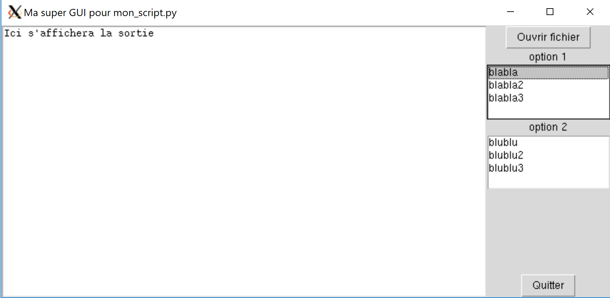

# Fenêtres graphiques et *Tkinter*

open-box-adv

Dans ce chapitre, nous allons utiliser des classes, nous vous conseillons de bien relire le chapitre 19 sur le sujet. Par ailleurs, nous vous conseillons de relire également la rubrique *Arguments positionnels et arguments par mot-clé* du chapitre 9 sur les fonctions.

close-box-adv

## Utilité d'une GUI

Dans votre carrière « pythonesque » il se peut que vous soyez amené à vouloir développer une application graphique, on parle encore de *graphical user interface* ou GUI. Jusqu'à maintenant, vous avez fait en sorte qu'un utilisateur interagisse avec votre code via la ligne de commande, par exemple :

```
python mon_script.py file.gbk blabla blublu
```

Les arguments passés à la ligne de commande sont tout à fait classiques dans le monde de la bioinformatique. Toutefois, il se peut que vous développiez un programme pour une communauté plus large, qui n'a pas forcément l'habitude d'utiliser un *shell* et la ligne de commande. Une GUI permettra un usage plus large de votre programme, il est donc intéressant de regarder comment s'y prendre. Dans notre exemple ci-dessus on pourrait par exemple développer une interface où l'utilisateur choisirait le nom du fichier d'entrée par l'intermédiaire d'une boîte de dialogue, et de contrôler les options en cliquant sur des boutons, ou des « listes de choix ». Une telle GUI pourrait ressembler à la figure @fig:exemple_GUI.

{ #fig:exemple_GUI width=70% }

Au delà de l'aspect convivial pour l'utilisateur, vous pourrez, avec une GUI, construire des fenêtres illustrant des éléments que votre programme génère à la volée. Ainsi, vous « verrez » ce qui se passe de manière explicite et en direct ! Par exemple, si on réalise une simulation de particules, on a envie de voir un « film » des particules en mouvement, c'est-à-dire comment ces particules bougent au fur et à mesure que les pas de simulation avancent. Une GUI vous permettra une telle prouesse ! Enfin, sachez que certains logiciels scientifiques ont été développés avec la bibliothèque graphique Tk (par exemple pymol, vmd, etc.). Qui sait, peut-être serez-vous le prochain développeur d'un outil incontournable ?

Il existe beaucoup de modules pour construire des applications graphiques. Par exemple : [*Tkinter*](https://wiki.python.org/moin/TkInter), [wxpython](http://www.wxpython.org/), [PyQt](https://pyqt.readthedocs.io), [PyGObject](https://pygobject.readthedocs.io/en/latest/), etc. Nous présentons dans ce chapitre le module *Tkinter* qui est présent de base dans les distributions Python (pas besoin *a priori* de faire d'installation de module externe). *Tkinter* permet de piloter la bibliothèque graphique Tk (*Tool Kit*), *Tkinter* signifiant *tk interface*. On pourra noter que cette bibliothèque Tk peut être également pilotée par d'autres langages (Tcl, perl, etc.).


## Quelques concepts liés à la programmation graphique

Lorsque l'on développe une GUI, nous créons une fenêtre graphique contenant notre application, ainsi que des *widgets* inclus dans la fenêtre.

open-box-def

Les *widgets* (*window gadget*) sont des objets graphiques permettant à l'utilisateur d'interagir avec votre programme Python de manière conviviale. Par exemple, dans la fenêtre sur la figure @fig:exemple_GUI, les boutons, les listes de choix, ou encore la zone de texte sont des *widgets*.

close-box-def

L'utilisation d'une GUI va amener une nouvelle manière d'aborder le déroulement d'un programme, il s'agit de la programmation dite « événementielle ». Jusqu'à maintenant vous avez programmé « linéairement », c'est-à-dire que les instructions du programme principal s'enchaînaient les unes derrière les autres (avec bien sûr de possibles appels à des fonctions). Avec une GUI, l'exécution est décidée par l'utilisateur en fonction de ses interactions avec les différents *widgets*. Comme c'est l'utilisateur qui décide quand et où il clique dans l'interface, il va falloir mettre en place ce qu'on appelle un « gestionnaire d'événements ».

open-box-def

Le gestionnaire d'événements est une sorte de « boucle infinie » qui est à l'affût de la moindre action de la part de l'utilisateur. C'est lui qui effectuera une action lors de l'interaction de l'utilisateur avec chaque *widget* de la GUI. Ainsi, l'exécution du programme sera réellement guidée par les actions de l'utilisateur.

close-box-def

La bibliothèque Tk que nous piloterons avec le module Python *Tkinter* propose tous les éléments cités ci-dessus (fenêtre graphique, *widgets*, gestionnaire d'événements). Nous aurons cependant besoin d'une dernière notion : les fonctions *callback*.

open-box-def

Une fonction *callback* est une fonction passée en argument d'une autre fonction.

close-box-def

Un exemple de fonction *callback* est présenté dans la rubrique suivante.


## Notion de fonction *callback*

*Conseil* : pour les débutants, vous pouvez passer cette rubrique.

Jusqu'à maintenant nous avons toujours appelé les fonctions ou les méthodes de cette manière :

```
var = fct(arg1, arg2)

obj.methode(arg)
```

où les arguments étaient des objets « classiques » (par exemple une chaîne de caractères, un entier, un *float*, etc.).

Sachez qu'il est possible de passer en argument une fonction à une autre fonction ! Par exemple :

```
def fct_callback(arg):
    print("J'aime bien les {} !".format(arg))


def une_fct(ma_callback):
    print("Je suis au début de une_fct(), "
          "et je vais exécuter la fonction callback :")
    ma_callback("fraises")
    print("Aye, une_fct() se termine.")


# Programme principal.
une_fct(fct_callback)
```

Si on exécute ce code, on obtient :

```
Je suis au début de une_fct() et je vais exécuter la fonction callback :
J'aime bien les fraises !
Aye, une_fct() se termine.
```

Vous voyez que dans le programme principal, lors de l'appel de `une_fct()`, on lui passe comme argument une autre fonction mais sans **aucune parenthèses ni argument**, c'est-à-dire `fct_callback` tout court. En d'autres termes, cela est différent de  
`une_fct(fct_callback("scoubidous"))`.

Dans une telle construction, `fct_callback("scoubidous")` serait d'abord évaluée, puis ce serait la valeur renvoyée par cet appel qui serait passée à `une_fct()` (n'essayez pas sur notre exemple car cela mènerait à une erreur !). Que se passe-t-il en filigrane lors de l'appel `une_fct(fct_callback)` ? Python passe une référence vers la fonction `fct_callback` (en réalité il s'agit d'un pointeur, mais tout ceci est géré par Python et est transparent pour l'utilisateur). Vous souvenez-vous ce qui se passait avec une liste passée en argument à une fonction (voir le chapitre 12) ? C'était la même chose, une référence était envoyée plutôt qu'une copie. [*Python Tutor*](http://pythontutor.com) nous confirme cela (cf. figure @fig:fonction_callback_pythontutor).

{ #fig:fonction_callback_pythontutor width=80% }

Lorsqu'on est dans `une_fct()` on pourra utiliser bien sûr des arguments lors de l'appel de notre fonction *callback* si on le souhaite. Notez enfin que dans `une_fct()` la fonction *callback* reçue en argument peut avoir un nom différent (comme pour tout type de variable).

À quoi cela sert-il ? À première vue cette construction peut sembler ardue et inutile. Toutefois, vous verrez que dans le module *Tkinter* les fonctions *callback* sont incontournables. En effet, on utilise cette construction pour lancer une fonction lors de l'interaction de l'utilisateur avec un *widget* : par exemple, lorsque l'utilisateur clique sur un bouton et qu'on souhaite lancer une fonction particulière suite à ce clic. Notez enfin que nous les avons déjà croisées avec les objets `property` (cf. chapitre 19 *Avoir la classe avec les objets*).


## Prise en main du module *Tkinter*

Le module *Tkinter* est très vaste. Notre but n'est pas de vous faire un cours exhaustif mais plutôt de vous montrer quelques pistes. Pour apprendre à piloter ce module, nous pensons qu'il est intéressant de vous montrer des exemples. Nous allons donc en présenter quelques-uns qui pourraient vous être utiles, à vous ensuite de consulter de la documentation supplémentaire si vous souhaitez aller plus loin (cf. la rubrique *Bibliographie pour aller plus loin*).

### Un premier exemple dans l'interpréteur

Commençons par construire un script qui affichera une simple fenêtre avec un message et un bouton. Regardons d'abord comment faire dans l'interpréteur (nous vous conseillons de tester ligne par ligne ce code tout en lisant les commentaires ci-dessous) :

```
>>> import tkinter as tk
>>> racine = tk.Tk()
>>> label = tk.Label(racine, text="J'adore Python !")
>>> bouton = tk.Button(racine, text="Quitter", fg="red",
...                    command=racine.destroy)
>>> label.pack()
>>> bouton.pack()
>>>
```

Ligne 2. On crée la fenêtre principale (vous la verrez apparaître !). Pour cela, on crée une instance de la classe `tk.Tk` dans la variable `racine`. Tous les *widgets* que l'on créera ensuite seront des fils de cette fenêtre. On pourra d'ailleurs noter que cette classe `tk.Tk` ne s'instancie en général qu'une seule fois par programme. Vous pouvez, par curiosité, lancer une commande `dir(racine)` ou `help(racine)`, vous verrez ainsi les très nombreuses méthodes et attributs associés à un tel objet Tk.

Ligne 3. On crée un *label*, c'est-à-dire une zone dans la fenêtre principale où on écrit un texte. Pour cela, on a créé une variable `label` qui est une instance de la classe `tk.Label`. Cette variable `label` contient donc notre *widget*, nous la réutiliserons plus tard (par exemple pour placer ce *widget* dans la fenêtre). Notez le premier argument positionnel`racine` passé à la classe `tk.Label`, celui-ci indique la fenêtre parente où doit être dessinée le *label*. Cet argument doit toujours être passé en premier et il est vivement conseillé de le préciser. Nous avons passé un autre argument avec le nom `text` pour indiquer, comme vous l'avez deviné, le texte que nous souhaitons voir dans ce *label*. La classe `tk.Label` peut recevoir de nombreux autres arguments, en voici la [liste exhaustive](http://infohost.nmt.edu/tcc/help/pubs/tkinter/web/label.html). Dans les fonctions *Tkinter* qui construisent un *widget*, les arguments possibles pour la mise en forme de celui-ci sont nombreux, si bien qu'ils sont toujours des arguments par mot-clé. Si on ne précise pas un de ces arguments lors de la création du *widget*, l'argument prendra alors une valeur par défaut. Cette liste des arguments par mot-clé est tellement longue qu'en général on ne les précisera pas tous. Heureusement, Python autorise l'utilisation des arguments par mot-clé dans un ordre quelconque. Comme nous l'avons vu dans le chapitre 9 *Fonctions*, souvenez vous que leur utilisation dans le désordre implique qu'il faudra toujours préciser leur nom : par exemple vous écrirez `text="blabla"` et non pas `"blabla"` tout court.

Ligne 4. De même, on crée un bouton « Quitter » qui provoquera la fermeture de la fenêtre et donc l'arrêt de l'application si on clique dessus. À nouveau, on passe la fenêtre parente en premier argument, le texte à écrire dans le bouton, puis la couleur de ce texte. Le dernier argument `command=racine.destroy` va indiquer la fonction / méthode à exécuter lorsque l'utilisateur clique sur le bouton. On pourra noter que l'instance de la fenêtre mère `tk.Tk` (que nous avons nommée `racine`) possède une méthode `.destroy()` qui va détruire le *widget* sur lequel elle s'applique. Comme on tue la fenêtre principale (que l'on peut considérer comme un *widget* contenant d'autres *widgets*), tous les *widgets* fils seront détruits et donc l'application s'arrêtera. Vous voyez par ailleurs que cette méthode `racine.destroy` est passée à l'argument `command=` **sans parenthèses ni arguments** : il s'agit donc d'une fonction *callback* comme expliqué ci-dessus. Dans tous les *widgets* *Tkinter*, on doit passer à l'argument `command=...` une fonction / méthode *callback*. La liste exhaustive des arguments possibles de la classe `tk.Button` se trouve [ici](http://infohost.nmt.edu/tcc/help/pubs/tkinter/web/button.html).

Lignes 6 et 7. Vous avez noté que lors de la création de ce *label* et de ce bouton, rien ne s'est passé dans la fenêtre. C'est normal, ces deux *widgets* existent bien, mais il faut maintenant les placer à l'intérieur de la fenêtre. On appelle pour ça la méthode `.pack()`, avec une notation objet `widget.pack()` : à ce moment précis, vous verrez votre label apparaître ainsi que la fenêtre qui se redimensionne automatiquement en s'adaptant à la grandeur de votre *label*. L'invocation de la même méthode pour le bouton va faire apparaître celui-ci juste en dessous du *label* et redimensionner la fenêtre. Vous l'aurez compris la méthode `.pack()` place les *widgets* les uns en dessous des autres et ajuste la taille de la fenêtre. On verra plus bas que l'on peut passer des arguments à cette méthode pour placer les *widgets* différemment (en haut, à droite, à gauche).

Au final, vous devez obtenir une fenêtre comme sur la figure @fig:exemple1_tkinter.

### Le même exemple dans un script.

Tentons maintenant de faire la même chose dans un script `tk_exemple.py` :

```
import tkinter as tk

racine = tk.Tk()
label = tk.Label(racine, text="J'adore Python !")
bouton = tk.Button(racine, text="Quitter", command=racine.quit)
bouton["fg"] = "red"
label.pack()
bouton.pack()
racine.mainloop()
print("C'est fini !")
```

puis lançons ce script depuis un *shell* :

```
$ python tk_exemple.py
```

Vous voyez maintenant la même fenêtre avec les mêmes fonctionnalités par rapport à la version dans l'interpréteur (voir la figure @fig:exemple1_tkinter). Nous commentons ici les différences (dans le désordre) :

Ligne 6. Le bouton a été créé en ligne 5, mais on voit qu'il est possible de préciser une option de rendu du widget après cette création (ici on met le texte en rouge avec l'option `"fg"`). La notation ressemble à celle d'un dictionnaire avec une syntaxe générale `widget["option"] = valeur`.

Ligne 9. L'instruction `racine.mainloop()` va lancer le gestionnaire d'événements que nous avons évoqué ci-dessus. C'est lui qui interceptera la moindre action de l'utilisateur, et qui lancera les portions de code associées à chacune de ses actions. Bien sûr, comme nous développerons dans ce qui va suivre toutes nos applications *Tkinter* dans des scripts (et non pas dans l'interpréteur), cette ligne sera systématiquement présente. Elle sera souvent à la fin du script, puisque, à l'image de ce script, on écrit d'abord le code construisant l'interface, et on lance le gestionnaire d'événements une fois l'interface complètement décrite, ce qui lancera au final l'application.

Ligne 10. Cette ligne ne s'exécute qu'après l'arrêt de l'application (soit en cliquant sur le bouton « Quitter », soit en cliquant sur la croix).

Ligne 5. Pour quitter l'application, on utilise ici la méthode `.quit()`. Celle-ci casse la `.mainloop()` et arrête ainsi le gestionnaire d'événements. Cela mène à l'arrêt de l'application. Dans le premier exemple dans l'interpréteur, on avait utilisé la méthode `.destroy()` sur la fenêtre principale. Comme son nom l'indique, celle-ci détruit la fenêtre principale et mène aussi à l'arrêt de l'application. Cette méthode aurait donc également fonctionné ici. Par contre, la méthode `.quit()` n'aurait pas fonctionné dans l'interpréteur car, comme on l'a vu, la boucle `.mainloop()` n'y est pas présente. Comme  nous écrirons systématiquement nos applications *Tkinter* dans des scripts, et que la boucle `.mainloop()` y est obligatoire, vous pourrez utiliser au choix `.quit()` ou `.destroy()` pour quitter l'application.

{ #fig:exemple1_tkinter width=20% }

## Construire une application *Tkinter* avec une classe

De manière générale, il est vivement conseillé de développer ses applications *Tkinter* en utilisant une classe. Cela présente l'avantage d'encapsuler l'application de manière efficace et d'éviter ainsi l'utilisation de variables globales. Souvenez-vous, elles sont à bannir définitivement ! Une classe crée un espace de noms propre à votre application, et toutes les variables nécessaires seront ainsi des attributs de cette classe. Reprenons notre petit exemple avec un label et un bouton :

```
import tkinter as tk

class Application(tk.Tk):
    def __init__(self):
        tk.Tk.__init__(self)
        self.creer_widgets()

    def creer_widgets(self):
        self.label = tk.Label(self, text="J'adore Python !")
        self.bouton = tk.Button(self, text="Quitter", command=self.quit)
        self.label.pack()
        self.bouton.pack()


if __name__ == "__main__":
    app = Application()
    app.title("Ma Première App :-)")
    app.mainloop()
```

Ligne 3. On crée notre application en tant que classe. Notez que cette classe porte un nom qui commence par une majuscule (comme recommandé dans les bonnes pratiques de la [PEP8](https://www.python.org/dev/peps/pep-0008/), cf. chapitre 15). L'argument passé dans les parenthèses indique que notre classe `Application` hérite de la classe `tk.Tk`. Par ce mécanisme, nous héritons ainsi de toutes les méthodes et attributs de cette classe mère, mais nous pouvons en outre en ajouter de nouvelles/nouveaux (on parle aussi de « redéfinition » de la classe `tk.Tk`) !

Ligne 4. On crée un constructeur, c'est-à-dire une méthode qui sera exécutée lors de l'instanciation de notre classe (à la ligne 16).

Ligne 5. On appelle ici le constructeur de la classe mère `tk.Tk.__init__()`. Pourquoi fait-on cela ? On se souvient dans la version linéaire de l'application, on avait utilisé une instanciation classique : `racine = tk.Tk()`. Ici, l'effet de l'appel du constructeur de la classe mère permet d'instancier la fenêtre Tk dans la variable `self` directement. C'est-à-dire que la prochaine fois que l'on aura besoin de cette instance (lors de la création des *widgets* par exemple, cf. lignes 9 et 10), on utilisera directement `self` plutôt que `racine` ou tout autre nom donné à l'instance. Comme vu dans le chapitre 19 *Avoir la classe avec les objets*, appeler le constructeur de la classe mère est une pratique classique lorsqu'une classe hérite d'une autre classe.

Ligne 6. On appelle la méthode `self.creer_widgets()` de notre classe `Application`. Pour rappel, le `self` avant le `.creer_widgets()` indique qu'il s'agit d'une méthode de notre classe (et non pas d'une fonction classique).

Ligne 8. La méthode `.creer_widgets()` va créer des *widgets* dans l'application.

Ligne 9. On crée un label en instanciant la classe `tk.Label()`. Notez que le premier argument passé est maintenant `self` (au lieu de `racine` précédemment) indiquant la fenêtre dans laquelle sera construit ce *widget*.

Ligne 10. De même on crée un *widget* bouton en instanciant la classe `tk.Button()`. Là aussi, l'appel à la méthode `.quit()` se fait par `self.quit` puisque la fenêtre est instanciée dans la variable `self`. Par ailleurs, on ne met ni parenthèses ni arguments à `self.quit` car il s'agit d'une fonction *callback* (comme dans la rubrique précédente).

Lignes 11 et 12. On place les deux *widgets* dans la fenêtre avec la méthode `.pack()`.

Ligne 15. Ici on autorise le lancement de notre application *Tkinter* en ligne de commande (`python tk_application.py`), ou bien de réutiliser notre classe en important `tk_application.py` en tant que module (`import tk_application`) (voir le chapitre 14 *Création de modules*).

Ligne 16. On instancie notre application.

Ligne 17. On donne un titre dans la fenêtre de notre application. Comme on utilise de petits *widgets* avec la méthode `pack()`, il se peut que le titre ne soit pas visible lors du lancement de l'application. Toutefois, si on « étire » la fenêtre à la souris, le titre le deviendra. On pourra noter que cette méthode `.title()` est héritée de la classe mère Tk.

Ligne 18. On lance le gestionnaire d'événements.

Au final, vous obtiendrez le même rendu que précédemment (cf. figure @fig:exemple1_tkinter). Alors vous pourrez-vous poser la question, « pourquoi ai-je besoin de toute cette structure alors que le code précédent semblait plus direct ? ». La réponse est simple, lorsqu'un projet de GUI grossit, le code devient très vite illisible s'il n'est pas organisé en classe. De plus, la non-utilisation de classe rend quasi-obligatoire l'utilisation de variables globales, ce qui on l'a vu, est à proscrire définitivement ! Dans la suite du chapitre, nous verrons quelques exemples qui illustrent cela (cf. la rubrique suivante).

## Le *widget canvas*

### Un *canvas* simple et le système de coordonnées

Le *widget* [*canvas*](http://infohost.nmt.edu/tcc/help/pubs/tkinter/web/canvas.html) de *Tkinter* est très puissant. Il permet de dessiner des formes diverses (lignes, cercles, etc.), et même de les animer !

La classe `tk.Canvas` crée un *widget canvas* (ou encore canevas en français). Cela va créer une zone (*i.e.* le canevas en tant que tel) dans laquelle nous allons dessiner divers objets tels que des ellipses, lignes, polygones, etc., ou encore insérer du texte ou des images. Regardons tout d'abord un code minimal qui construit un *widget* *canvas*, dans lequel on y dessine un cercle et deux lignes :

```
import tkinter as tk

racine = tk.Tk()
canv = tk.Canvas(racine, bg="white", height=200, width=200)
canv.pack()
canv.create_oval(0, 0, 200, 200, outline="red", width=10)
canv.create_line(0, 0, 200, 200, fill="black", width=10)
canv.create_line(0, 200, 200, 0, fill="black", width=10)
racine.mainloop()
```

Ligne 4. On voit qu'il faut d'abord créer le *widget* *canvas*, comme d'habitude en lui passant l'instance de la fenêtre principale en tant qu'argument positionnel, puis les options. Notons que nous lui passons comme options la hauteur et la largeur du *canvas*. Même s'il s'agit d'arguments par mot-clé, donc optionnels, c'est une bonne pratique de les préciser. En effet, les valeurs par défaut risqueraient de nous mener à dessiner hors de la zone visible (cela ne génère pas d'erreur mais n'a guère d'intérêt).

Ligne 6 à 8. Nous dessinons maintenant des objets graphiques à l'intérieur du canevas avec les méthodes `.create_oval()` (dessine une ellipse) et `.create_line()` (dessine une ligne). Les arguments positionnels sont les coordonnées de l'ellipse (les deux points englobant l'ellipse, cf. [ce lien](http://infohost.nmt.edu/tcc/help/pubs/tkinter/web/create_oval.html) pour la définition exacte) ou de la ligne. Ensuite, on passe comme d'habitude des arguments par mot-clé (vous commencez à avoir l'habitude !) pour mettre en forme ces objets graphiques.

Le rendu de l'image est montré dans la figure @fig:exemple1_canvas ainsi que le système de coordonnées associé au *canvas*. Comme dans la plupart des bibliothèques graphiques, l'origine du repère du *canvas* (*i.e.* la coordonnée $(0,0)$) est en haut à gauche. Les $x$ vont de gauche à droite, et les $y$ vont de haut en bas.

{ #fig:exemple1_canvas width=60% }

open-box-warn

L'axe des $y$ est inversé par rapport à ce que l'on représente en mathématique. Si on souhaite représenter une fonction mathématique (ou tout autre objet dans un repère régi par un repère mathématique), il faudra faire un changement de repère.

close-box-warn


### Un *canvas* encapsulé dans une classe

Voici un exemple un peu plus conséquent d'utilisation du *widget canvas* qui est inclus dans une classe. Il s'agit d'une application dans laquelle il y a une zone de dessin, un bouton dessinant des cercles, un autre des lignes et un dernier bouton qui quitte l'application (figure @fig:exemple2_canvas).

{ #fig:exemple2_canvas width=70% }

Le code suivant crée une telle application :

```
import tkinter as tk
import random as rd

class AppliCanevas(tk.Tk):
    def __init__(self):
        tk.Tk.__init__(self)
        self.size = 500
        self.creer_widgets()

    def creer_widgets(self):
        # création canevas
        self.canv = tk.Canvas(self, bg="light gray", height=self.size,
                              width=self.size)
        self.canv.pack(side=tk.LEFT)
        # boutons
        self.bouton_cercles = tk.Button(self, text="Cercle !",
                                        command=self.dessine_cercles)
        self.bouton_cercles.pack(side=tk.TOP)
        self.bouton_lignes = tk.Button(self, text="Lignes !",
                                       command=self.dessine_lignes)
        self.bouton_lignes.pack()
        self.bouton_quitter = tk.Button(self, text="Quitter",
                                        command=self.quit)
        self.bouton_quitter.pack(side=tk.BOTTOM)

    def rd_col(self):
        return rd.choice(("black", "red", "green", "blue", "yellow", "magenta",
                          "cyan", "white", "purple"))

    def dessine_cercles(self):
        for i in range(20):
            x, y = [rd.randint(1, self.size) for j in range(2)]
            diameter = rd.randint(1, 50)
            self.canv.create_oval(x, y, x+diameter, y+diameter,
                                  fill=self.rd_col())

    def dessine_lignes(self):
        for i in range(20):
            x, y, x2, y2 = [rd.randint(1, self.size) for j in range(4)]
            self.canv.create_line(x, y, x2, y2, fill=self.rd_col())


if __name__ == "__main__":
    app = AppliCanevas()
    app.title("Mon Canevas Psychédélique !")
    app.mainloop()
```

Lignes 4 à 6. Comme montré dans la rubrique *Construire une application Tkinter avec une classe*, notre classe `AppliCanevas` hérite de la classe générale `tk.Tk` et la fenêtre Tk se retrouve dans la variable `self`.

Ligne 7. On crée un attribut de la classe `self.size` qui contiendra la taille (hauteur et largeur) du *canvas*. On rappelle que cet attribut sera visible dans l'ensemble de la classe puisqu'il est « accroché » à celle-ci par le `self`.

Ligne 8. On lance la méthode `.creer_widgets()` (qui est elle aussi « accrochée » à la classe par le `self`).

Lignes 12 à 14. On crée un *widget canvas* en instanciant la classe `tk.Canvas`. On place ensuite le *canvas* dans la fenêtre avec la méthode `.pack()` en lui précisant où le placer avec la variable *Tkinter* `tk.LEFT`.

Lignes 15 à 24. On crée des *widgets* boutons et on les place dans la fenêtre. À noter que chacun de ces *widgets* appelle une méthode différente, dont deux que nous avons créées dans la classe (`.dessine_cercle()` et `.dessine_lignes()`).

Ligne 26 à 28. Cette méthode renvoie une couleur au hasard sous forme de chaîne de caractères.

Lignes 30 à 40. On définit deux méthodes qui vont dessiner des paquets de 20 cercles (cas spécial d'une ellipse) ou 20 lignes aléatoires. Lors de la création de ces cercles et lignes, on ne les récupère pas dans une variable car on ne souhaite ni les réutiliser ni changer leurs propriétés par la suite. Vous pourrez noter ici l'avantage de programmer avec une classe, le *canvas* est directement accessible dans n'importe quelle méthode de la classe avec `self.canv` (pas besoin de le passer en argument ou de créer une variable globale).

### Un *canvas* animé dans une classe

Dans ce dernier exemple, nous allons illustrer la puissance du *widget canvas* en vous montrant que l'on peut animer les objets se trouvant à l'intérieur. Nous allons également découvrir une technique intéressante, à savoir, comment « intercepter » des clics de souris générés ou des touches pressées par l'utilisateur. L'application consiste en une « baballe » qui se déplace dans la fenêtre et dont on contrôle les propriétés à la souris (cf. figure @fig:canvas_anime). Vous pouvez télécharger le script [ici](https://python.sdv.univ-paris-diderot.fr/data-files/tk_baballe.py).

```
"""Super appli baballe !!!

Usage: python tk_baballe.py
- clic gauche: faire grossir la baballe
- clic droit: faire rétrécir la baballe
- clic central: relance la baballe (depuis le  point du clic)
                dans une direction aléatoire
- touche Esc: quitte l'appli baballe
"""

import tkinter as tk
import random as rd

class AppliBaballe(tk.Tk):
    def __init__(self):
        """Constructeur de l'application."""
        tk.Tk.__init__(self)
        # Coord baballe.
        self.x, self.y = 200, 200
        # Rayon baballe.
        self.size = 50
        # Pas de deplacement.
        self.dx, self.dy = 20, 20
        # Création et packing du canvas.
        self.canv = tk.Canvas(self, bg='light gray', height=400, width=400)
        self.canv.pack()
        # Création de la baballe.
        self.baballe = self.canv.create_oval(self.x, self.y,
                                             self.x+self.size,
                                             self.y+self.size,
                                             width=2, fill="blue")
        # Binding des actions.
        self.canv.bind("<Button-1>", self.incr)
        self.canv.bind("<Button-2>", self.boom)
        self.canv.bind("<Button-3>", self.decr)
        self.bind("<Escape>", self.stop)
        # Lancer la baballe.
        self.move()

    def move(self):
        """Déplace la baballe (appelée itérativement avec la méthode after)."""
        # Incrémente coord baballe.
        self.x += self.dx
        self.y += self.dy
        # Vérifier que la baballe ne sort pas du canvas (choc élastique).
        if self.x < 10:
            self.dx = abs(self.dx)
        if self.x > 400-self.size-10:
            self.dx = -abs(self.dx)
        if self.y < 10:
            self.dy = abs(self.dy)
        if self.y > 400-self.size-10:
            self.dy = -abs(self.dy)
        # Mise à jour des coord.
        self.canv.coords(self.baballe, self.x, self.y, self.x+self.size,
                         self.y+self.size)
        # Rappel de move toutes les 50ms.
        self.after(50, self.move)

    def boom(self, mclick):
        """Relance la baballe dans une direction aléatoire au point du clic."""
        self.x = mclick.x
        self.y = mclick.y
        self.canv.create_text(self.x, self.y, text="Boom !", fill="red")
        self.dx = rd.choice([-30, -20, -10, 10, 20, 30])
        self.dy = rd.choice([-30, -20, -10, 10, 20, 30])

    def incr(self, lclick):
        """Augmente la taille de la baballe."""
        self.size += 10
        if self.size > 200:
            self.size = 200

    def decr(self, rclick):
        """Diminue la taille de la baballe."""
        self.size -= 10
        if self.size < 10:
            self.size = 10

    def stop(self, esc):
        """Quitte l'application."""
        self.quit()


if __name__ == "__main__":
    myapp = AppliBaballe()
    myapp.title("Baballe !")
    myapp.mainloop()
```

Lignes 19 à 23. Les coordonnées de la baballe, ses pas de déplacement, et sa taille sont créés en tant qu'attributs de notre classe. Ainsi ils seront visibles partout dans la classe.

Lignes 25 à 31. Le *canvas* est ensuite créé et placé dans la fenêtre, puis on définit notre fameuse baballe. À noter, les coordonnées `self.x` et `self.y` de la baballe représentent en fait son côté « nord-ouest » (en haut à gauche, voir [le point ($x_0$, $y_0$) dans la documentation officielle](http://infohost.nmt.edu/tcc/help/pubs/tkinter/web/create_oval.html)).

Lignes 33 à 35. Jusqu'à maintenant, nous avons utilisé des événements provenant de clics sur des boutons. Ici, on va « intercepter » des événements générés par des clics de souris sur le *canvas* et les lier à une fonction / méthode (comme nous l'avions fait pour les clics sur des boutons avec l'option `command=...`). La méthode pour faire cela est `.bind()`, voilà pourquoi on parle de *event binding* en anglais. Cette méthode prend en argument le type d'événement à capturer en tant que chaîne de caractères avec un format spécial : par exemple `"<Button-1>"` correspond à un clic gauche de la souris (de même `"<Button-2>"` et `"<Button-3>"` correspondent aux clics central et droit respectivement). Le deuxième argument de la méthode `.bind()` est une méthode / fonction *callback* à appeler lors de la survenue de l'événement (comme pour les clics de bouton, vous vous souvenez? On l'appelle donc sans parenthèses ni arguments). On notera que tous ces événements sont liés à des clics sur le *canvas*, mais il est possible de capturer des événements de souris sur d'autres types de *widgets*.

Ligne 36. De même, on peut « intercepter » un événement lié à l'appui sur une touche, ici la touche Esc.

Ligne 38. La méthode `.move()` est appelée, ainsi l'animation démarrera dès l'exécution du constructeur, donc peu après l'instanciation de notre application (Ligne 86).

Lignes 40 à 58. On définit une méthode `.move()` qui va gérer le déplacement de la baballe avec des chocs élastiques sur les parois (et faire en sorte qu'elle ne sorte pas du *canvas*).

Lignes 55 et 56. On utilise la méthode `.coords()` de la classe `Canvas`, qui « met à jour » les coordonnées de n'importe quel objet dessiné dans le *canvas* (c'est-à-dire que cela déplace l'objet).

Ligne 58. Ici, on utilise une autre méthode spécifique des objets *Tkinter*. La méthode `.after()` rappelle une autre méthode ou fonction (second argument) après un certain laps de temps (ici 50 ms, passé en premier argument). Ainsi la méthode `.move()` se rappelle elle-même, un peu comme une fonction récursive. Toutefois, ce n'est pas une vraie fonction récursive comme celle vue dans le chapitre 12 (exemple du calcul de factorielle), car Python ne conserve pas l'état de la fonction lors de l'appel de `.after()`. C'est comme si on avait un `return`, tout l'espace mémoire alloué à la méthode `.move()` est détruit lorsque Python rencontre la méthode `.after()`. On obtiendrait un résultat similaire avec la boucle suivante :

```
import time

...

while True:
    move()
    time.sleep(0.05) # attendre 50 ms
```

Le temps de 50 ms donne 20 images (ou clichés) par seconde. Si vous diminuez ce temps, vous aurez plus d'images par secondes et donc un « film » plus fluide.

Ligne 60 à 66. On définit la méthode `.boom()` de notre classe qui on se souvient est appelée lors d'un événement clic central sur le *canvas*. Vous noterez qu'outre le `self`, cette fonction prend un autre argument que nous avons nommé ici `mclick`. Il s'agit d'un objet spécial géré par *Tkinter* qui va nous donner des informations sur l'événement généré par l'utilisateur. Dans les lignes 62 et 63, cet objet `mclick` récupère les coordonnées où le clic a eu lieu grâce aux attributs `mclick.x` et `mclick.y`. Ces coordonnées sont réaffectées à la baballe pour la faire repartir de l'endroit du clic. Nous créons ensuite un petit texte dans le canevas et affectons des valeurs aléatoires aux variables de déplacement pour faire repartir la baballe dans une direction aléatoire.

Lignes 68 à 78. On a ici deux méthodes `.incr()` et `.decr()` appelées lors d'un clic gauche ou droit. Deux choses sont à noter : i) l'attribut `self.size` est modifié dans les deux fonctions, mais le changement de diamètre de la boule ne sera effectif dans le *canvas* que lors de la prochaine exécution de l'instruction `self.canv.coords()` (dans la méthode `.move()`); ii) de même que pour la méthode `.boom()`, ces deux méthodes prennent un argument après le `self` (`lclick` ou `rclick`) récupérant ainsi des informations sur l'événement de l'utilisateur. Même si on ne s'en sert pas, cet argument après le `self` est obligatoire car il est imposé par la méthode `.bind()`.

Lignes 80 à 82. Cette méthode quitte l'application lorsque l'utilisateur fait un clic sur la touche *Esc*.

{ #fig:canvas_anime width=80% }

Il existe de nombreux autres événements que l'on peut capturer et lier à des méthodes / fonctions *callback*. Vous trouverez une liste complète [ici](http://effbot.org/tkinterbook/tkinter-events-and-bindings.htm).

## Pour aller plus loin

### D'autres *widgets*

Jusqu'à maintenant nous avons vu les *widgets* *Button*, *Canvas*, *Label*, mais il en existe bien d'autres. En voici la liste avec une brève explication pour chacun :

- *Checkbutton* : affiche des cases à cocher.
- *Entry* : demande à l'utilisateur de saisir une valeur / une phrase.
- *Listbox* : affiche une liste d'options à choisir (comme dans la figure @fig:exemple_GUI).
- *Radiobutton* : implémente des « boutons radio ».
- *Menubutton* et *Menu* : affiche des menus déroulants.
- *Message* : affiche un message sur plusieurs lignes (extensions du *widget* Label).
- *Scale* : affiche une règle graduée pour que l'utilisateur choisisse parmi une échelle de valeurs.
- *Scrollbar* : affiche des ascenseurs (horizontaux et verticaux).
- *Text* : crée une zone de texte dans lequel l'utilisateur peut saisir un texte sur plusieurs lignes (comme dans la figure @fig:exemple_GUI).
- *Spinbox* : sélectionne une valeur parmi une liste de valeurs.
- *tkMessageBox* : affiche une boîte avec un message.

Il existe par ailleurs des *widgets* qui peuvent contenir d'autres widgets et qui organisent le placement de ces derniers :

- *Frame* : *widget* container pouvant contenir d'autres *widgets* classiques, particulièrement utile lorsqu'on réalise une GUI complexe avec de nombreuses zones.
- *LabelFrame* : comme *Frame* mais affiche aussi un *label* sur le bord.
- *Toplevel* : pour créer des fenêtres indépendantes.
- *PanedWindow* : container pour d'autres *widgets*, mais ici l'utilisateur peut réajuster les zones affectées à chaque *widget* fils.

Vous trouverez la documentation exhaustive pour tous ces *widgets* (ainsi que ceux que nous avons décrits dans les rubriques précédentes) sur le [site de l'Institut des mines et de technologie du Nouveau Mexique](http://infohost.nmt.edu/tcc/help/pubs/tkinter/web/index.html) (MNT). Par ailleurs, la [page *Universal widget methods*](https://infohost.nmt.edu/tcc/help/pubs/tkinter/web/universal.html) vous donnera une vue d'ensemble des différentes méthodes associées à chaque widget.

Il existe également une extension de *Tkinter* nommée *ttk*, réimplémentant la plupart des *widgets* de base de *Tkinter* et qui en propose de nouveaux (*Combobox*, *Notebook*, *Progressbar*, *Separator*, *Sizegrip* et *Treeview*). Typiquement, si vous utilisez *ttk*, nous vous conseillons d'utiliser les *widgets* *ttk* en priorité, et pour ceux qui n'existent pas dans *ttk*, ceux de *Tkinter* (comme *Canvas* qui n'existe que dans *Tkinter*). Vous pouvez importer le sous-module *ttk* de cette manière : `import tkinter.ttk as ttk`.

Vous pourrez alors utiliser les classes de widget de *ttk* (par exemple `ttk.Button`, etc.). Si vous souhaitez importer *ttk* et *Tkinter*, il suffit d'utiliser ces deux lignes :

```
import tkinter as tk
import tkinter.ttk as ttk
```

Ainsi vous pourrez utiliser des *widgets* de *Tkinter* et de *ttk* en même temps.

Pour plus d'informations, vous pouvez consulter la [documentation officielle de Python](https://docs.python.org/3/library/tkinter.ttk.html), ainsi que la documentation très complète du [site du MNT](http://infohost.nmt.edu/tcc/help/pubs/tkinter/web/ttk.html).

### Autres pistes à approfondir

Si vous souhaitez aller un peu plus loin en *Tkinter*, voici quelques notions / remarques qui pourraient vous être utiles. Pour les débutants, vous pouvez passer cette rubrique.

#### Les variables de contrôle

Lorsque vous souhaitez mettre un jour un *widget* avec une certaine valeur (par exemple le texte d'un *label*), vous ne pouvez pas utiliser une variable Python ordinaire, il faudra utiliser une variable *Tkinter* dite de contrôle. Par exemple, si on souhaitait afficher les coordonnées de notre baballe (cf. rubrique précédente) dans un *label*, et que cet affichage se mette à jour au fur et à mesure des mouvements de la baballe, il faudrait utiliser des variables de contrôle. On peut créer de telles variables avec les classes `tk.StringVar` pour les chaînes de caractères, `tk.DoubleVar` pour les *floats*, et `tk.IntVar` pour les entiers. Une fois créée, par exemple avec l'instruction `var = tk.StringVar()`, on peut modifier la valeur d'une variable de contrôle avec la méthode `var.set(nouvelle_valeur)` : ceci mettra à jour tous les *widgets* utilisant cette variable `var`. Il existe aussi la méthode `var.get()` qui récupère la valeur actuelle contenue dans `var`. Enfin, il faudra lors de la création du label utiliser l'option `textvariable=` avec votre variable de contrôle (par exemple `tk.Label(..., textvariable=var, ...)`) pour que cela soit fonctionnel.

À nouveau, vous trouverez une documentation précise sur le [site du MNT](https://infohost.nmt.edu/tcc/help/pubs/tkinter/web/control-variables.html).

#### Autres méthodes de placement des *widgets* dans la fenêtre Tk

Dans les exemples montrés dans ce chapitre, nous avons systématiquement utiliser la méthode `.pack()` pour placer les *widgets*. Cette méthode très simple et directe « empaquette » les *widgets* les uns contre les autres et redimensionne la fenêtre automatiquement. Avec l'option `side=` et les variables `tk.BOTTOM`, `tk.LEFT`, `tk.TOP` et `tk.RIGHT` on place facilement les *widgets* les uns par rapport aux autres. Toutefois, la méthode `.pack()` peut parfois présenter des limites, il existe alors deux autres alternatives.

La méthode `.grid()` permet, grâce à l'utilisation d'une grille, un placement mieux contrôlé des différents *widgets*. La méthode `.place()` place enfin les *widgets* en utilisant les coordonnées de la fenêtre principale. Nous ne développerons pas plus ces méthodes, mais voici de la documentation supplémentaire en accès libre :

- [`.pack()`](http://effbot.org/tkinterbook/pack.htm) ;
- [`.grid()`](http://effbot.org/tkinterbook/grid.htm), [](https://infohost.nmt.edu/tcc/help/pubs/tkinter/web/grid.html) ;
- [`.place()`](http://effbot.org/tkinterbook/place.htm).


#### Hériter de la classe Frame pour vos applications ?

Comme illustré dans nos exemples, nous vous recommandons pour vos classes applications *Tkinter* d'hériter de la classe mère `tk.Tk` et d'utiliser le constructeur de la classe mère `tk.Tk.__init__()`. Toutefois, il se peut qu'en consultant d'autres ressources certains auteurs utilisent la technique d'héritage de la classe mère `tk.Frame` :

```
import tkinter as tk

class Application(tk.Frame):
    def __init__(self, racine=None):
        tk.Frame.__init__(self, racine)
        self.racine = racine
        self.create_widgets()

    def create_widgets(self):
        self.label = tk.Label(self.racine, text="J'adore Python !")
        self.bouton = tk.Button(self.racine, text="Quitter",
                                 fg="green", command=self.quit)
        self.label.pack()
        self.bouton.pack()


if __name__ == "__main__":
    racine = tk.Tk()
    racine.title("Ma Première App :-)")
    app = Application(racine)
    racine.mainloop()
```

Lignes 17 à 21. Commentons d'abord le programme principal : ici on crée la fenêtre principale dans l'instance `racine` puis on instancie notre classe en passant `racine` en argument.

Lignes 4 et 5. Ici réside la principale différence par rapport à ce que nous vous avons montré dans ce chapitre : en ligne 4 on passe l'argument `racine` à notre constructeur, puis en ligne 5 on passe ce même argument `racine` lors de l'appel du constructeur de la classe `tk.Frame` (ce qui était inutile lorsqu'on héritait de la classe `Tk`).

Ligne 6. L'argument `racine` passé à la méthode `.__init__()` est finalement une variable locale. Comme il s'agit de l'instance de notre fenêtre principale à passer à tous nos *widgets*, il faut qu'elle soit visible dans toute la classe. La variable `self.racine` est ainsi créée afin d'être réutilisée dans d'autres méthodes.

Vous pourrez vous posez la question : « Pourquoi en ligne 4 l'argument par mot-clé `racine=None` prend la valeur `None` par défaut ? ». Et bien, c'est parce que notre classe Application peut s'appeler sans passer d'instance de fenêtre Tk. Voici un exemple avec les lignes qui changent seulement (tout le reste est identique au code précédent) :

```
[...]
class Application(tk.Frame):
    def __init__(self, racine=None):
        tk.Frame.__init__(self)
        self.racine = racine
		[...]
[...]
if __name__ == "__main__":
    app = Application()
    app.mainloop()
```

Dans un tel cas, l'argument `racine` prend la valeur par défaut `None` lorsque la méthode `.__init__()` de notre classe est exécutée.  L'appel au constructeur de la classe Frame en ligne 4 instancie automatiquement une fenêtre Tk (car cela est strictement obligatoire). Dans la suite du programme, cette instance de la fenêtre principale sera `self.racine` et il n'y aura pas de changement par rapport à la version précédente. Cette méthode reste toutefois peu intuitive car cette instance de la fenêtre principale `self.racine` vaut finalement `None` !

Hériter de la classe Frame ou de la classe Tk sont deux manières tout à fait valides pour créer des applications *Tkinter*. Le choix de l'une ou de l'autre relève plus de préférences que l'on acquiert en pratiquant, voire de convictions philosophiques sur la manière de programmer. Toutefois, nous pensons qu'hériter de la classe `tk.Tk` est une manière plus générale et plus compacte : tout ce qui concerne le fenêtrage *Tkinter* se situera dans votre classe Application, et le programme principal n'aura qu'à instancier l'application et à lancer le gestionnaire d'événements (les choses seront ainsi mieux « partitionnées »). C'est donc la méthode que nous vous recommandons.

#### Passage d'arguments avec `*args` et `**kwargs`

Si vous allez chercher de la documentation supplémentaire sur *Tkinter*, il se peut que vous tombiez sur ce style de syntaxe lorsque vous créez votre classe contenant l'application graphique :

```
class MonApplication(tk.Tk):
    def __init__(self, *args, **kwargs):
        tk.Tk.__init__(self, *args, **kwargs)
        # ici débute la construction de votre appli
[...]

# programme principal
if __name__ == "__main__":
    [...]
    app = MonApplication()
    [...]
```

Les arguments `*args` et `**kwargs` récupérent facilement tous les arguments « positionnels » et « par mot-clé ». Pour plus de détails sur comment `*args` et `**kwargs` fonctionnent, reportez-vous au chapitre 21 *Remarques complémentaires*.

Dans l'exemple ci-dessus, `*args` et `**kwargs` sont inutiles car lors de l'instanciation de notre application, on ne passe aucun argument : `app = MonApplication()`. Toutefois, on pourrait être intéressé à récupérer des arguments passés au constructeur, par exemple :

```
app = MonApplication(arg1, arg2, option1=val1, option2=val2)
```

Ainsi certains auteurs laissent toujours ces `*args` et `**kwargs` au cas où on en ait besoin dans le futur. Cela est bien utile lorsqu'on distribue notre classe à la communauté et que l'on souhaite que les futurs utilisateurs puissent passer des arguments *Tkinter* au constructeur de notre classe.

Toutefois, même si cela « ne coûte rien », nous vous recommandons de ne pas mettre ces `*args` et `**kwargs` si vous n'en avez pas besoin, comme nous vous l'avons montré dans les exemples de ce chapitre. Rappelons nous de la PEP 20 (cf. chapitre 15 *Bonnes Pratiques en programmation Python*), les assertions « *Simple is better than complex* » ou « *Sparse is better than dense* » nous suggèrent qu'il est inutile d'ajouter des choses dont on ne se sert pas.

#### Toujours préciser l'instance de la fenêtre principale

*Tkinter* est parfois surprenant. Dans le code suivant, on pourrait penser que celui-ci n'est pas fonctionnel :

```
>>> import tkinter as tk
>>> bouton = tk.Button(text="Quitter")
>>> bouton.pack()
```

Pour autant, cela fonctionne et on voit un bouton apparaître ! En fait, *Tkinter* va automatiquement instancier la fenêtre principale, si bien qu'il n'est pas obligatoire de passer cette instance en argument d'un *widget*. À ce moment, on peut se demander où est passé cette instance. Heureusement, *Tkinter* garde toujours une filiation des *widgets* avec les attributs `.master` et `.children` :

```
>>> racine = bouton.master
>>> racine
<tkinter.Tk object .>
>>> racine.children
{'!button': <tkinter.Button object .!button>}
>>> bouton["command"] = racine.destroy
```

Ligne 1. On « récupère » l'instance de la fenêtre principale dans la variable racine.

Les lignes 4 et 5 montrent que le bouton est un « enfant » de cette dernière.

Enfin, ligne 6, on réassigne la destruction de la fenêtre lorsqu'on clique sur le bouton.

Ces attributs `.master` et `.children` existent pour tous *widgets* et sont bien pratiques lorsqu'on crée de grosses applications graphiques (où on utilise souvent des *widgets* parents contenant d'autres *widgets* enfants). Une autre source d'information sur les *widgets* se trouvent dans les méthodes dont le nom commence par `winfo`. Par exemple, la méthode `.winfo_toplevel()` renvoie la même information que l'attribut `.master` (une référence vers le *widget* parent).

open-box-adv

Même si cela est possible, nous vous conseillons de systématiquement préciser l'instance de la fenêtre principale lors de la création de vos *widgets*.

close-box-adv


#### Passage d'arguments à vos fonctions callback

Comme vu dans nos exemples ci-dessus, les fonctions *callback* ne prennent pas d'arguments ce qui peut se révéler parfois limitant. Il existe toutefois une astuce qui utilise les fonctions *lambda* ; nous expliquons brièvement les fonctions lambda dans le chapitre 21 *Remarques complémentaires*. Toutefois, nous ne développons pas leur utilisation avec *Tkinter* et les fonctions *callback* car cela dépasse le cadre de cet ouvrage. Pour de plus amples explications sur cette question, vous pouvez consulter le site [pythonprogramming](https://pythonprogramming.net/passing-functions-parameters-tkinter-using-lambda/) et le [livre de Gérard Swinnen](https://inforef.be/swi/python.htm).


#### Application *Tkinter* avec plusieurs pages

Dans ce chapitre d'introduction, nous vous avons montré des GUI simples avec une seule page. Toutefois, si votre projet se complexifie, il se peut que vous ayez besoin de créer plusieurs fenêtre différentes. Le [livre de Gérard Swinnen](https://inforef.be/swi/python.htm) et le site [pythonprogramming](https://pythonprogramming.net/change-show-new-frame-tkinter/) sont des bonnes sources pour commencer et voir concrètement comment faire cela.


### Bibliographie pour aller plus loin

Voici quelques ressources que vous pouvez utiliser pour continuer votre apprentissage de *Tkinter* :

1. En anglais :
  - La [Documentation officielle](https://wiki.python.org/moin/TkInter) de Python.
  - Le [manuel](https://infohost.nmt.edu/tcc/help/pubs/tkinter/web/index.html) de référence sur le site du MNT.
  - Le [site](http://effbot.org/tkinterbook/) de Fredrik Lundh est également très complet.
  - Pour avoir un [exemple](https://www.tutorialspoint.com/python/python_gui_programming.htm) rapide de code pour chaque *widget*.
  - Le [livre](https://github.com/Dvlv/Tkinter-By-Example) de David Love *Learn Tkinter By Example* qui montre des exemples concrets d'applications *Tkinter* de plus en plus complexes (pdf en libre téléchargement).
  - Le [site](https://pythonprogramming.net/tkinter-depth-tutorial-making-actual-program/) très bien fait de Harisson (avec vidéos !) vous guidera dans la construction d'une GUI complète et complexe avec de nombreuses fonctions avancées (comme par exemple mettre des graphes matplotlib qui se mettent à jour dans la GUI !).

2. En français :
  - Le [site](http://tkinter.fdex.eu/index.html) bien complet d'Étienne Florent.
  - Le [livre](https://inforef.be/swi/python.htm) de Gérard Swinnen qui montre de nombreux exemples d'applications tkinter (pdf en libre téléchargement).

## Exercices

*Conseil* : dans tous les exercices qui suivent nous vous recommandons de concevoir une classe pour chaque exercice.

### Application de base

Concevez une application qui affiche l'heure dans un *label* (par exemple `09:10:55`) et qui possède un boutton quitter. L'heure affichée sera celle au moment du lancement de l'application. Pour « attraper » l'heure, vous pourrez utiliser la fonction `strftime()` du module `time`.

### Horloge

Sur la base de l'application précédente, faites une application qui affiche l'heure dans un *label* en se mettant à jour sur l'heure de l'ordinateur une fois par seconde. Vous concevrez une méthode `.mise_a_jour_heure()` qui met à jour l'heure dans le *label* et qui se rappelle elle-même toutes les secondes (n'oubliez pas la méthode `.after()`, cf. rubrique *Un canvas animé dans une classe* ci-dessus). Pour cette mise à jour, vous pourrez utiliser la méthode `.configure()`, par exemple : `self.label.configure(text=heure)` où `heure` est une chaîne de caractères représentant l'heure actuelle.

### Compte à rebours

Créer une application affichant un compte à rebours dans un *label*. L'utilisateur choisira entre 1 et 240 minutes en passant un argument au lancement du script, par exemple : `python tk_compte_a_rebours.py 34` signifiera un compte à rebours de 34' (le programme vérifiera qu'il s'agit d'un entier entre 1 et 240 inclus). Il y aura un bouton « Lancer » pour démarrer le compte à rebours et un boutton « Quitter » au cas où on veuille quitter avant la fin. À la fin du rebours, le programme affichera 10 fois la phrase « C'est fini !!! » dans le *shell* et quittera automatiquement le script. Une image du résultat attendu est montrée dans la figure @fig:tk_compte_a_rebours.

{ #fig:tk_compte_a_rebours width=50% }

### Triangle de Sierpinski

Le [triangle de Sierpinski](https://fr.wikipedia.org/wiki/Triangle_de_Sierpi%C5%84ski) est une fractale classique. On se propose ici de la dessiner avec un algorithme tiré du [jeu du chaos](https://fr.wikipedia.org/wiki/Jeu_du_chaos). Celui-ci se décompose en pseudo-code de la façon suivante :

```
définir les 3 sommets d'un triangle isocèle ou équilatéral
point <- coordonnées (x, y) du centre du trianle
dessiner(point) # une pixelle de large
pour i de 0 à 25000:
    sommet_tmp <- choisir un sommet du triangle au hasard
    point <- calculer(coordonnées(x, y) du centre entre point et sommet_tmp)
    dessiner(point)
```

Le rendu final attendu est montré dans la figure @fig:tk_Sierpinski. On utilisera un canevas de 400x400 pixels. Il y a aura un bouton « Quitter » et un bouton « Launch ! » qui calculera et affichera 10000 points supplémentaires dans le triangle de Sierpinski.

{ #fig:tk_Sierpinski width=50% }

### Polygone de Sierpinski (exercice +++)

Améliorer l'application précédente en proposant une liste de choix supplémentaire demandant à l'utilisateur de choisir le nombre de sommets (de 3 à 10). Le programme calculera automatiquement la position des sommets. Pour prendre en main le *widget* *Listbox*, voici un code minimal qui pourra vous aider. Celui-ci contient une `Listbox` et permet d'afficher dans le terminal l'élément sélectionné. Nous vous conseillons de bien étudier le code ci-dessous et d'avoir résolu l'exercice précédent avant de vous lancer !

```
import tkinter as tk

class MaListBox(tk.Tk):
    def __init__(self):
        # Instanciation fenêtre Tk.
        tk.Tk.__init__(self)
        self.listbox = tk.Listbox(self, height=10, width=4)
        self.listbox.pack()
        # On ajoute des items à la listbox (entiers).
        for i in range(1, 10+1):
            # Utilisation de ma méthode .insert(index, element)
            # On ajoute l'entier i (tk.END signifie en dernier).
            self.listbox.insert(tk.END, i)
        # Selectionne premier élément de listbox.
        self.listbox.select_set(0)
        # Lier une méthode quand clic sur listbox.
        self.listbox.bind("<<ListboxSelect>>", self.clic_listbox)

    def clic_listbox(self, event):
        # Récup du widget à partir de l'objet event.
        widget = event.widget
        # Récup du choix sélectionné dans la listbox (tuple).
        # (par exemple renvoie `(5,)` si on a cliqué sur `5`)
        selection = widget.curselection()
        # Récup du nombre sélectionné (déjà un entier).
        choix_select = widget.get(selection[0])
        # affichage
        print("Le choix sélectionné est {}, son type est {}"
              .format(choix_select, type(choix_select)))


if __name__ == "__main__":
    app = MaListBox()
    app.title("MaListBox")
    app.mainloop()
```

### Projet simulation d'un pendule

Vous souhaitez aller plus loin après ces exercices de  « mise en jambe » ? Nous vous conseillons d'aller directement au chapitre 22 *Mini projets*. Nous vous proposons de réaliser une application *Tkinter* qui simule le mouvement d'un pendule. En réalisant une application complète de ce genre, un peu plus conséquente, vous serez capable de construire vos propres applications.
