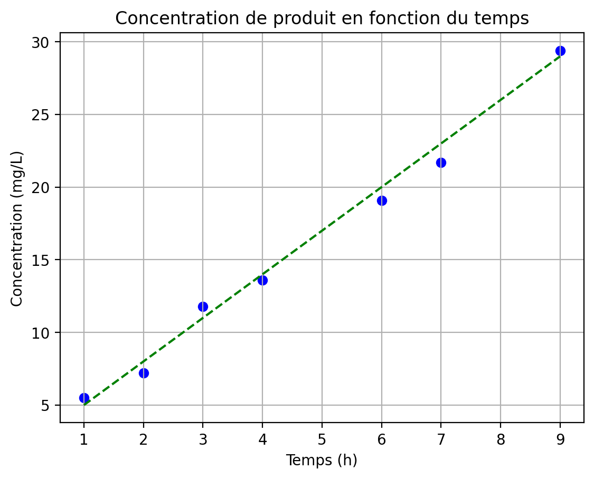
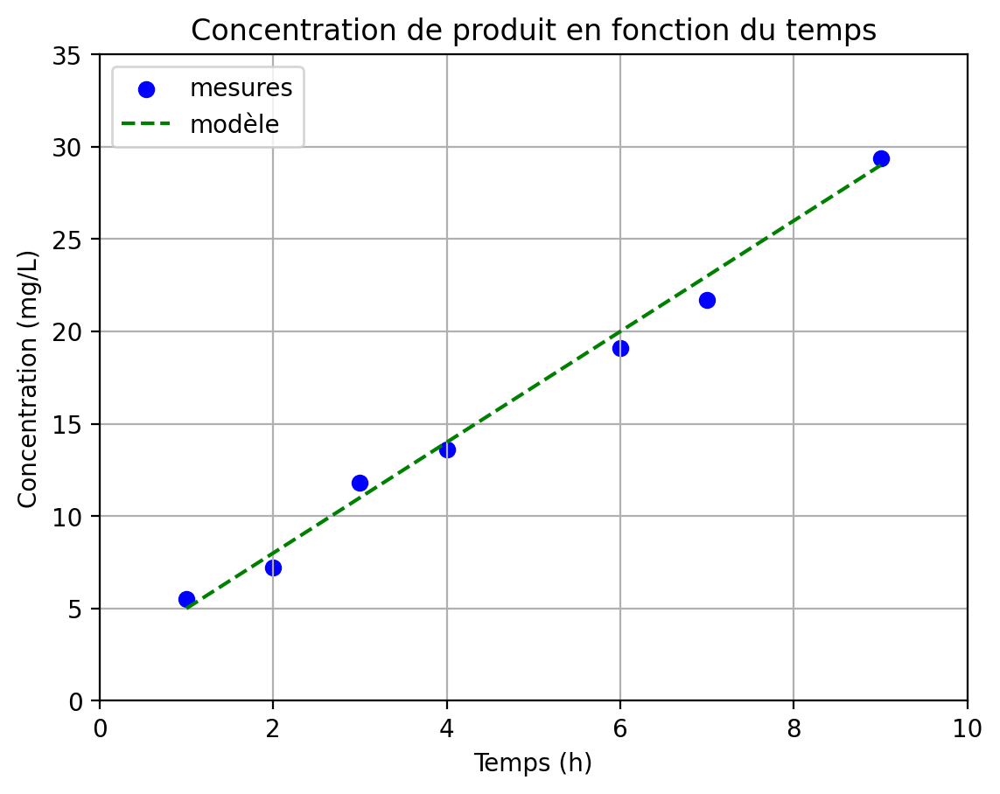

# Module Matplotlib

Le module [*matplotlib*](https://matplotlib.org/) permet de générer des graphiques depuis Python. Il est l'outil complémentaire des modules *NumPy*, *scipy* ou *pandas* (que l'on verra juste après) lorsqu'on veut faire de l'analyse de données.


## Installation et convention

Le module *matplotlib* n'est pas fourni avec la distribution Python de base. Avec la distribution Miniconda que nous vous conseillons d'utiliser (consultez pour cela la documentation en [ligne](https://python.sdv.u-paris.fr/livre-dunod)), vous pouvez l'installer avec la commande :

```bash
$ conda install -c conda-forge matplotlib
```

Dans ce chapitre, nous vous montrerons quelques exemples d’utilisation du module *matplotlib* pour vous convaincre de sa pertinence. Ces exemples seront exécutés dans un *notebook* Jupyter.

```python
Les cellules de code apparaitront de cette manière
dans un notebook Jupyter, avec des numéros de lignes à gauche.
```

## Chargement du module

On importe le module *matplotlib* avec la commande :

```python
import matplotlib.pyplot as plt
```

open-box-rem

On n'importe pas le module *matplotlib* directement, mais plutôt son sous-module `pyplot`. Par convention, et pour l'utiliser plus rapidement, ce sous-module prendre l'alias `plt`.

close-box-rem


## Représentation en nuage de points

Dans cet exemple, nous considérons l'évolution de la concentration d'un produit dans le sang (exprimé en mg/L) en fonction du temps (exprimé en heures). Cet exemple est purement fictif.

Voici les valeurs mesurées :

| Temps (h) | Concentration (mg/L) |
|:---------:|:--------------------:|
|     1     |          3.5         |
|     2     |          5.8         |
|     3     |          9.1         |
|     4     |         11.8         |
|     6     |         17.5         |
|     7     |         21.3         |
|     9     |         26.8         |

Nous allons maintenant représenter l'évolution de la concentration en fonction du temps :

```python
import matplotlib.pyplot as plt

temps = [1, 2, 3, 4, 6, 7, 9]
concentration = [5.5, 7.2, 11.8, 13.6, 19.1, 21.7, 29.4]

fig, ax = plt.subplots()
ax.scatter(temps, concentration, marker="o", color="blue")
ax.set_xlabel("Temps (h)")
ax.set_ylabel("Concentration (mg/L)")
ax.set_title("Concentration de produit en fonction du temps")
plt.show()
```

Dans un *notebook* Jupyter, vous devriez obtenir un graphique ressemblant à celui de la figure @fig:conc-vs-tps0.

{ #fig:conc-vs-tps0 width=80% }

Revenons maintenant sur le code :

- **Ligne 1.** Tout d'abord, on importe le sous-module `pyplot` du module *matplotlib* et on lui donne l'alias `plt` pour l'utiliser plus rapidement ensuite. Cet alias est standard, utilisez-le systématiquement.
- **Lignes 3 et 4.** On définit les variables `temps` et `concentration` comme des listes. Les deux listes doivent avoir la même longueur (sept éléments dans le cas présent).
- **Ligne 6.** On crée une figure avec la fonction `subplots()` qui renvoie deux objets : une figure (`fig`) et un axe (`ax`). L'axe est l'objet qui contient le graphique à proprement dit. On peut avoir plusieurs axes dans une même figure.
- **Ligne 7.** La méthode `.scatter()` permet de représenter des points sous forme de nuage de points. Les deux premiers arguments correspondent aux valeurs en abscisse et en ordonnée des points, fournis sous forme de listes. Des arguments facultatifs sont ensuite précisés comme le symbole (`marker`) et la couleur (`color`).
- **Lignes 8 et 9.** Les méthodes `.set_xlabel()` et `.set_ylabel()` donnent une légende aux axes des abscisses et des ordonnées.
- **Ligne 10.** La méthode `.set_title()` définit le titre du graphique.
- **Ligne 11.** L'instruction `plt.show()` affiche le graphique. Elle n'est pas nécessaire dans un *notebook* Jupyter, car le graphique est affiché automatiquement, mais elle est indispensable dans un script Python.


## Représentation sous forme de courbe

On sait par ailleurs que l'évolution de la concentration du produit en fonction du temps peut-être modélisée par la fonction $f(x) = 2 + 3 \times x$.


open-box-rem

Le modèle présenté ici est purement fictif. Vous découvrirez dans le chapitre 22 *Module Pandas* comment réaliser une régression linéaire pour modéliser des données expérimentales.

close-box-rem


Représentons ce modèle avec les points expérimentaux et sauvegardons le graphique obtenu sous forme d'une image :

```python
import numpy as np
import matplotlib.pyplot as plt

temps = [1, 2, 3, 4, 6, 7, 9]
concentration = [5.5, 7.2, 11.8, 13.6, 19.1, 21.7, 29.4]

fig, ax = plt.subplots()
ax.scatter(temps, concentration, marker="o", color = "blue")
ax.set_xlabel("Temps (h)")
ax.set_ylabel("Concentration (mg/L)")
ax.set_title("Concentration de produit en fonction du temps")

x = np.linspace(min(temps), max(temps), 50)
y = 2 + 3 * x

ax.plot(x, y, color="green", ls="--")
ax.grid()
fig.savefig("concentration_vs_temps_1.png", bbox_inches="tight", dpi=200)
```

Le résultat est représenté sur la figure @fig:conc-vs-tps1.

{  #fig:conc-vs-tps1 width=80% }

Les étapes supplémentaires par rapport au graphique précédent (figure @fig:conc-vs-tps0) sont :

- **Ligne 1.** On charge le module *numpy* sous le nom `np`.
- **Ligne 13.** On crée la variable `x` avec la fonction `linspace()` du module *NumPy*, qui renvoie une liste de valeurs régulièrement espacées entre deux bornes, ici entre le minimum (`min(temps)`) et le maximum (`max(temps)`) de la variable `temps`. Dans notre exemple, nous générons une liste de 50 valeurs. La variable `x` ainsi créée est du type *array*.
- **Ligne 14.** On construit ensuite la variable `y` à partir de la formule modélisant l'évolution de la concentration du produit en fonction du temps. Cette manipulation n'est possible que parce que `x` est du type *array*. Cela ne fonctionnerait pas avec une liste classique.
- **Ligne 16.** La méthode `.plot()` construit une courbe à partir des coordonnées en abscisse et en ordonnées des points à représenter. On indique ensuite des arguments facultatifs comme le style de la ligne (`ls` pour *line style*) et sa couleur (`color`).
- **Ligne 17.** La méthode `.grid()` affiche une grille.
- **Ligne 18.** Enfin, l'instruction `fig.savefig()` enregistre le graphique produit sous la forme d'une image au format png. Des arguments par mot-clé définissent la manière de générer les marges autour du graphique (`bbox_inches`) et la résolution de l'image (`dpi`).


Pour terminer, on peut améliorer un peu plus le graphique en ajoutant une légende et en modifiant l'étendue des axes des abscisses et des ordonnées :

```python
import numpy as np
import matplotlib.pyplot as plt

temps = [1, 2, 3, 4, 6, 7, 9]
concentration = [5.5, 7.2, 11.8, 13.6, 19.1, 21.7, 29.4]

fig, ax = plt.subplots()
ax.scatter(temps, concentration, marker="o", color="blue", label="mesures")
ax.set_xlabel("Temps (h)")
ax.set_ylabel("Concentration (mg/L)")
ax.set_title("Concentration de produit en fonction du temps")

x = np.linspace(min(temps), max(temps), 50)
y = 2 + 3 * x

ax.plot(x, y, color="green", ls="--", label="modèle")

ax.grid()
ax.set_xlim(0, 10)
ax.set_ylim(0, 35)

ax.legend(loc="upper left")
fig.savefig("concentration_vs_temps_2.png", bbox_inches="tight", dpi=200)
```

On obtient alors le graphique représenté dans la figure @fig:conc-vs-tps2.

{  #fig:conc-vs-tps2 width=80% }

Les différences notables par rapport au code précédent sont :

- **Lignes 8 et 16.** On ajoute le paramètre `label` pour donner un nom au nuage de points (`.scatter()`) ou à la courbe (`.plot()`).
- **Lignes 19 et 20.** On définit l'étendue de l'axe des abscisses avec la méthode `.set_xlim()` et de l'axe des ordonnées avec la méthode `.set_ylim()`.
- **Lignes 22.** On affiche la légende avec la méthode `.legend()`. L'argument `loc` permet de préciser la position de la légende dans le graphique. Dans notre exemple, la légende est placée en haut à gauche (`"upper left"`). 


## Représentation en diagramme en bâtons

On souhaite maintenant représenter graphiquement la distribution des différentes bases dans une séquence d'ADN.

```python
import numpy as np
import matplotlib.pyplot as plt

sequence = "ACGATCATAGCGAGCTACGTAGAA"
bases = ["A", "C", "G", "T"]
distribution = []
for base in bases:
    distribution.append(sequence.count(base))

x = np.arange(len(bases))
plt.bar(x, distribution)
plt.xticks(x, bases)
plt.xlabel("Bases")
plt.ylabel("Nombre")
plt.title(f"Distribution des bases\n dans la séquence {sequence}")
fig.savefig("distribution_bases.png", bbox_inches="tight", dpi=200)
```

On obtient alors le graphique de la figure @fig:distribution.

{ #fig:distribution width=80% }

Prenons le temps d'examiner les différentes étapes du script précédent :

- **Lignes 4 à 6.** On définit les variables `sequence`, `bases` et `distribution`.
- **Lignes 7 et 8.** On calcule la distribution des différentes bases dans la séquence. On utilise pour cela la méthode `count()`, qui renvoie le nombre de fois qu'une chaîne de caractères (les différentes bases) se trouve dans une autre (la séquence).
- **Ligne 10.** On définit la position en abscisse des barres. Dans cet exemple, la variable `x` vaut `array([0, 1, 2, 3])`.
- **Ligne 12.** On crée le graphique.
- **Ligne 13.** La méthode `.bar()` construit le diagramme en bâtons. Elle prend en argument la position des barres (`x`) et leurs hauteurs (`distribution`).
- **Ligne 14.** La méthode `.set_xtics()` redéfinit les étiquettes (c'est-à-dire le nom des bases) sur l'axe des abscisses.
- **Lignes 15 à 17.** On définit les légendes des axes et le titre du graphique. On insère un retour à la ligne `\n` dans le titre pour qu'il soit réparti sur deux lignes.
- **Ligne 18.** Enfin, on enregistre le graphique généré au format png.

On espère que ces courts exemples vous auront convaincu de l'utilité du module *matplotlib*. Sachez qu'il peut faire bien plus, par exemple générer des histogrammes ou toutes sortes de graphiques utiles en analyse de données. Il est existe par ailleurs d'autres bibliothèques pour produire des graphiques avec Python, comme [*Seaborn*](https://seaborn.pydata.org/), [*Bokeh*](http://bokeh.org/) ou [*Plotly*](https://plotly.com/). Ces deux dernières permettent de générer des graphiques interactifs, c'est-à-dire des graphiques dans lesquels on peut zoomer, se déplacer, etc. Nous vous invitons à les découvrir par vous-même.


open-box-more

- Le site de *matplotlib* fournit de nombreux [exemples détaillés](https://matplotlib.org/gallery/index.html), n'hésitez pas à le consulter.
- Le site [Python Graph Gallery](https://www.python-graph-gallery.com/matplotlib/) propose aussi des exemples de code pour différents types de graphiques, réalisés avec *matplotlib* ou d'autres bibliothèques.
- Enfin, des [*cheat sheets*](https://matplotlib.org/cheatsheets/) de *matplotlib* sont extrêmement utiles et très bien faites.

close-box-more
