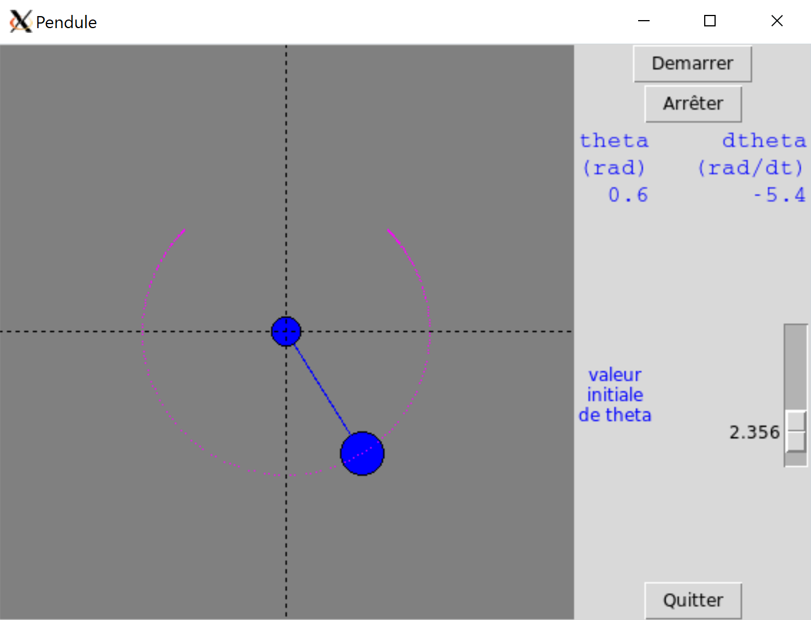

# Mini-projets

Dans ce chapitre, nous vous proposons quelques scénarios pour développer vos compétences en Python et mettre en œuvre les concepts que vous avez rencontrés dans les chapitres précédents.

## Description des projets

### Mots anglais dans le protéome humain

L'objectif de ce premier projet est de découvrir si des mots anglais peuvent se retrouver dans les séquences du protéome humain, c'est-à-dire dans les séquences de l'ensemble des protéines humaines.

Vous aurez à votre disposition :

- Le fichier [`english-common-words.txt`](https://python.sdv.univ-paris-diderot.fr/data-files/english-common-words.txt), qui contient les 3000 mots anglais les plus fréquents, à raison d'1 mot par ligne.
- Le fichier [`human-proteome.fasta`](https://python.sdv.univ-paris-diderot.fr/data-files/human-proteome.fasta) qui contient le protéome humain sous la forme de séquences au format FASTA. Attention, ce fichier est assez gros. Ce fichier provient de la banque de données UniProt à partir de cette [page](https://www.uniprot.org/help/human_proteome).

*Conseil* : vous trouverez des explications sur le format FASTA et des exemples de code dans l'annexe A *Quelques formats de données rencontrés en biologie*.

### Genbank2fasta

Ce projet consiste à écrire un convertisseur de fichier, du format GenBank au format FASTA.

Pour cela, nous allons utiliser le fichier GenBank du chromosome I de la levure du boulanger *Saccharomyces cerevisiae*. Vous pouvez télécharger ce fichier :

- soit via le lien sur le site du cours [`NC_001133.gbk`](https://python.sdv.univ-paris-diderot.fr/data-files/NC_001133.gbk);
- soit directement sur la page de [*Saccharomyces cerevisiae S288c chromosome I, complete sequence*](https://www.ncbi.nlm.nih.gov/nuccore/NC_001133) sur le site du NCBI, puis en cliquant sur *Send to*, puis *Complete Record*, puis *Choose Destination: File*, puis *Format: GenBank  (full)* et enfin sur le bouton *Create File*.

Vous trouverez des explications sur les formats FASTA et GenBank ainsi que des exemples de code dans l'annexe A *Quelques formats de données rencontrés en biologie*.

Vous pouvez réaliser ce projet sans ou avec des expressions régulières (abordées dans le chapitre 15).

### Simulation d'un pendule

On se propose de réaliser une simulation d'un [pendule simple](https://fr.wikipedia.org/wiki/Pendule_simple) en Tkinter. Un pendule simple est représenté par une masse ponctuelle (la boule du pendule) reliée à un axe immobile par une tige rigide et sans masse. On néglige les effets de frottement et on considère le champ gravitationnel comme uniforme. Le mouvement du pendule sera calculé en résolvant numériquement l'équation du mouvement :

$$\frac{d^2\theta}{dt^2} = -\frac{g}{l} * sin(\theta)$$

où $\theta$ représente l'angle entre la verticale et la tige du pendule, $g$ la gravité, et $l$ la longueur de la tige (note : pour la dérivation d'une telle équation vous pouvez consulter la [page wikipedia](https://en.wikipedia.org/wiki/Pendulum_(mathematics)#math_Eq._1)).

Pour trouver la valeur de $\theta$ en fonction du temps, on pourra utiliser la méthode d'Euler. La formule ci-dessus donne l'accélération angulaire $a = \frac{d^2\theta}{dt^2}$. À partir de celle-ci, on peut calculer la vitesse angulaire $v = a * \delta t$ (où $\delta t$ représente l'incrément de temps entre deux clichés). Enfin, cette vitesse $v$ nous donne l'angle $\theta$ lui même : $\theta = v * \delta t$. On prendra un pas de temps $\delta t$ = 0.05 s, une accélération gravitationnelle $g$ = 9.8 m.s$^{-2}$ et une longueur de tige de $l$ = 1 m.

{ #fig:pendule width=40% }

Pour la visualisation, vous pourrez utiliser le *widget canvas* du module *Tkinter* (voir le chapitre 20 *Tkinter*, rubrique *Un canvas animé dans une classe*). On cherche à obtenir un résultat comme montré dans la figure @fig:pendule.

Nous vous conseillons de procéder d'abord par la mise en place du simulateur physique (c'est-à-dire obtenir $\theta$ en fonction du temps). Faites par exemple un premier script Python qui sort un fichier à deux colonnes (temps et valeur de $\theta$). Une fois que cela fonctionne bien, il vous faudra construire l'interface Tkinter et l'animer.

N'oubliez pas, il faudra mettre dans votre programme final une fonction qui convertit l'angle $\theta$ en coordonnées cartésiennes $x$ et $y$ dans le plan du *canvas*. Faites également attention au système de coordonnées du *canvas* où les ordonnées sont inversées par rapport à un repère mathématique.
