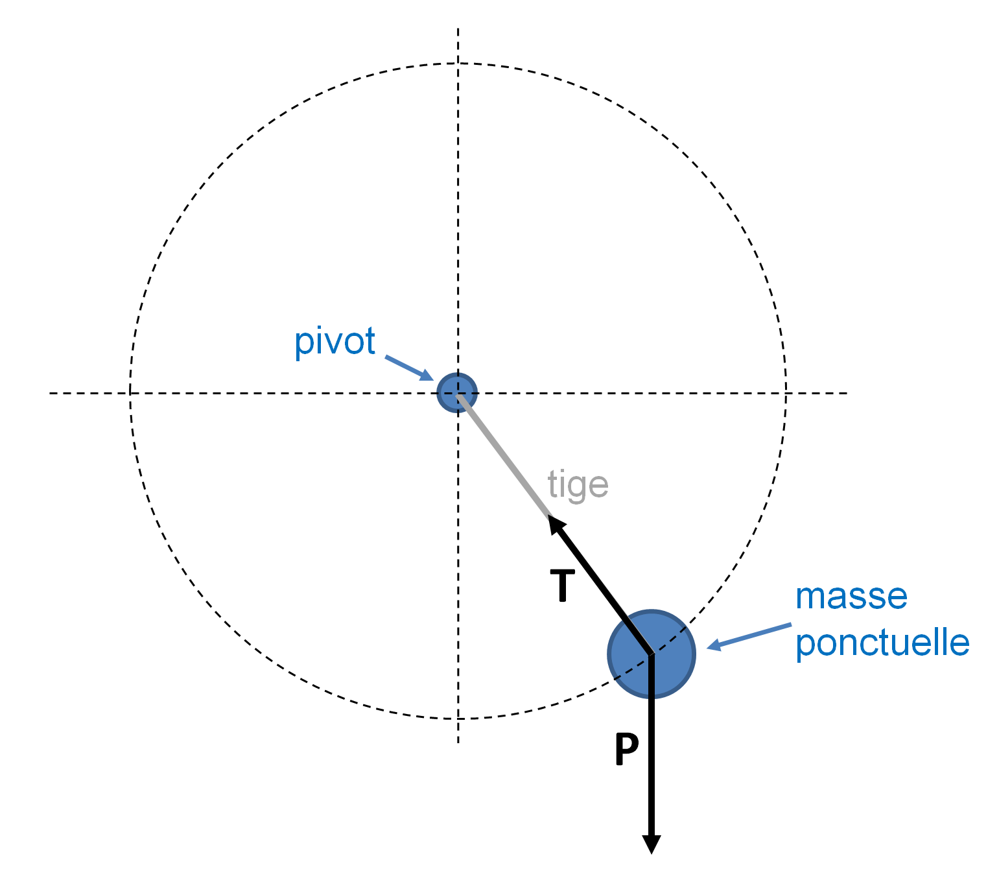
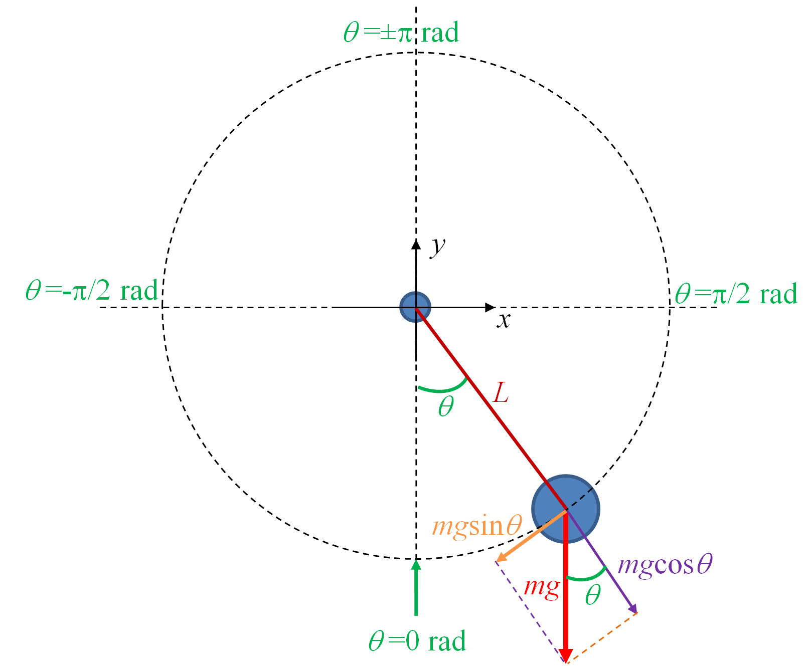

## Accompagnement pas à pas

Vous trouverez ci-après les différentes étapes pour réaliser les mini-projets proposés. Prenez le temps de bien comprendre une étape avant de passer à la suivante.


### Mots anglais dans le protéome humain

L'objectif de ce premier projet est de découvrir si des mots anglais peuvent se retrouver dans les séquences du protéome humain, c'est-à-dire dans les séquences de l'ensemble des protéines humaines.

#### Composition aminée

Dans un premier temps, composez 5 mots anglais avec les 20 acides aminés.

#### Des mots

Téléchargez le fichier [english-common-words.txt](https://python.sdv.univ-paris-diderot.fr/data-files/english-common-words.txt). Ce fichier contient les 3000 mots anglais les plus fréquents, à raison d'1 mot par ligne.

Créez un script `words-in-proteome.py` et écrivez la fonction `read_words()` qui va lire les mots contenus dans le fichier dont le nom est fourni en argument du script et renvoyer une liste contenant les mots convertis en majuscule et composés de 3 caractères ou plus.

Dans le programme principal, affichez le nombre de mots sélectionnés.

#### Des protéines

Téléchargez maintenant le fichier [human-proteome.fasta](https://python.sdv.univ-paris-diderot.fr/data-files/human-proteome.fasta). Attention, ce fichier est assez gros. Ce fichier provient de la banque de données UniProt à partir de cette [page](https://www.uniprot.org/help/human_proteome).

Voici les premières lignes de ce fichier (`[...]` indique une coupure que nous avons faite) :
```
>sp|O95139|NDUB6_HUMAN NADH dehydrogenase [ubiquinone] 1 beta [...]
MTGYTPDEKLRLQQLRELRRRWLKDQELSPREPVLPPQKMGPMEKFWNKFLENKSPWRKM
VHGVYKKSIFVFTHVLVPVWIIHYYMKYHVSEKPYGIVEKKSRIFPGDTILETGEVIPPM
KEFPDQHH
>sp|O75438|NDUB1_HUMAN NADH dehydrogenase [ubiquinone] 1 beta [...]
MVNLLQIVRDHWVHVLVPMGFVIGCYLDRKSDERLTAFRNKSMLFKRELQPSEEVTWK
>sp|Q8N4C6|NIN_HUMAN Ninein OS=Homo sapiens OX=9606 GN=NIN PE=1 SV=4
MDEVEQDQHEARLKELFDSFDTTGTGSLGQEELTDLCHMLSLEEVAPVLQQTLLQDNLLG
RVHFDQFKEALILILSRTLSNEEHFQEPDCSLEAQPKYVRGGKRYGRRSLPEFQESVEEF
PEVTVIEPLDEEARPSHIPAGDCSEHWKTQRSEEYEAEGQLRFWNPDDLNASQSGSSPPQ
```

Toujours dans le script  `words-in-proteome.py`, écrivez la fonction `read_sequences()` qui va lire le protéome dans le fichier dont le nom est fourni en second argument du script. Cette fonction va renvoyer un dictionnaire dont les clefs sont les identifiants des protéines (par exemple, `O95139`, `O75438`, `Q8N4C6`) et dont les valeurs associées sont les séquences.

Dans le programme principal, affichez le nombre de séquences lues.
À des fins de test, affichez également la séquence associée à la protéine `O95139`.

#### À la pêche aux mots

Écrivez maintenant la fonction `search_words_in_proteome()` qui prend en argument la liste de mots et le dictionnaire contenant les séquences des protéines et qui va compter le nombre de séquences dans lesquelles un mot est présent. Cette fonction renverra un dictionnaire dont les clefs sont les mots et les valeurs le nombre de séquences qui contiennent ces mots. La fonction affichera également le message suivant pour les mots trouvés dans le protéome :
```
ACCESS found in 1 sequences
ACID found in 38 sequences
ACT found in 805 sequences
[...]
```

Cette étape prend quelques minutes. Soyez patient.

#### Et le mot le plus fréquent est...

Pour terminer, écrivez maintenant la fonction `find_most_frequent_word()` qui prend en argument le dictionnaire renvoyé par la précédente fonction `search_words_in_proteome()` et qui affiche le mot trouvé dans le plus de protéines, ainsi que le nombre de séquences dans lesquelles il a été trouvé, sous la forme :
```
=> xxx found in yyy sequences
```

Quel est ce mot ?

Quel pourcentage des séquences du protéome contiennent ce mot ?

#### Pour être plus complet

Jusqu'à présent, nous avions déterminé, pour chaque mot, le nombre de séquences dans lesquelles il apparaissait.
Nous pourrions aller plus loin et calculer aussi le nombre de fois que chaque mot apparaît dans les séquences.

Pour cela modifier la fonction `search_words_in_proteome()` de façon à compter le nombre d’occurrences d'un mot dans les séquences.
La méthode `.count()` vous sera utile.

Déterminez alors quel mot est le plus fréquent dans le protéome humain.


### genbank2fasta (sans expression régulière)

Ce projet consiste à écrire un convertisseur de fichier, du format GenBank au format FASTA. L'annexe A *Quelques formats de données rencontrés en biologie* rappelle les caractéristiques de ces deux formats de fichiers.

Le jeu de données avec lequel nous allons travailler est le fichier GenBank du chromosome I de la levure du boulanger *Saccharomyces cerevisiae*. Les indications pour le télécharger sont indiqués dans la description du projet.

Dans cette rubrique, nous allons réaliser ce projet **sans expression régulière**.

#### Lecture du fichier

Créez un script `genbank2fasta.py` et créez la fonction `lit_fichier()` qui prend en argument le nom du fichier et qui renvoie le contenu du fichier sous forme d'une liste de lignes, chaque ligne étant elle-même une chaîne de caractères.

Testez cette fonction avec le fichier GenBank `NC_001133.gbk` et affichez le nombre de lignes lues.


#### Extraction du nom de l'organisme

Dans le même script, ajoutez la fonction `extrait_organisme()` qui prend en argument le contenu du fichier précédemment obtenu avec la fonction `lit_fichier()` (sous la forme d'une liste de lignes) et qui renvoie le nom de l'organisme. Pour récupérer la bonne ligne vous pourrez tester si les premiers caractères de la ligne contiennent le mot-clé `ORGANISM`.

Testez cette fonction avec le fichier GenBank `NC_001133.gbk` et affichez le nom de l'organisme.


#### Recherche des gènes

Dans le fichier GenBank, les gènes sens sont notés de cette manière :

```
     gene            58..272
```

ou

```
     gene            <2480..>2707
```

et les gènes antisens (ou encore complémentaires) de cette façon :

```
     gene            complement(55979..56935)
```

ou

```
     gene            complement(<13363..>13743)
```

Les valeurs numériques séparées par `..` indiquent la position du gène dans le génome (numéro de la première base,  numéro de la dernière base).

open-box-rem

Le symbole `<` indique un gène partiel sur l'extrémité 5', c'est-à-dire que le codon START correspondant est incomplet. Respectivement, le symbole `>` désigne un gène partiel sur l'extrémité 3', c'est-à-dire que le codon STOP correspondant est incomplet. Pour plus de détails, consultez la documentation du NCBI sur les [délimitations des gènes](https://www.ncbi.nlm.nih.gov/Sitemap/samplerecord.html#BaseSpanB). Nous vous proposons ici d'ignorer ces symboles `>` et `<`.

close-box-rem

Repérez ces différents gènes dans le fichier `NC_001133.gbk`. Pour récupérer ces lignes de gènes il faut tester si la ligne commence par

```
     gene            
```

(c'est-à-dire 5 espaces, suivi du mot `gene`, suivi de 12 espaces). Pour savoir s'il s'agit d'un gène sur le brin direct ou complémentaire, il faut tester la présence du mot `complement` dans la ligne lue.

Ensuite si vous souhaitez récupérer la position de début et de fin de gène, nous vous conseillons d'utiliser la fonction `replace()` et de ne garder que les chiffres et les `.` Par exemple

```
     gene            <2480..>2707
```

sera transformé en

```
2480..2707
```

Enfin, avec la méthode `.split()` vous pourrez facilement récupérer les deux entiers de début et de fin de gène.

Dans le même script `genbank2fasta.py`, ajoutez la fonction `recherche_genes()` qui prend en argument le contenu du fichier (sous la forme d'une liste de lignes) et qui renvoie la liste des gènes.

Chaque gène sera lui-même une liste contenant le numéro de la première base, le numéro de la dernière base et une chaîne de caractère `"sens"` pour un gène sens et `"antisens"` pour un gène antisens.

Testez cette fonction avec le fichier GenBank `NC_001133.gbk` et affichez le nombre de gènes trouvés, ainsi que le nombre de gènes sens et antisens.


#### Extraction de la séquence nucléique du génome

La taille du génome est indiqué sur la première ligne d'un fichier GenBank. Trouvez la taille du génome stocké dans le fichier `NC_001133.gbk`.

Dans un fichier GenBank, la séquence du génome se trouve entre les lignes

```
ORIGIN  
```

et

```
//
```

Trouvez dans le fichier `NC_001133.gbk` la première et dernière ligne de la séquence du génome.

Pour récupérer les lignes contenant la séquence, nous vous proposons d'utiliser un algorithme avec un drapeau `is_dnaseq` (qui vaudra `True` ou `False`). Voici l'algorithme proposé en pseudo-code :
```
is_dnaseq <- False
Lire chaque ligne du fichier gbk
    si la ligne contient "//"
        is_dnaseq <- False
    si is_dnaseq vaut True
        accumuler la séquence
    si la ligne contient "ORIGIN"
        is_dnaseq <- True
```
Au début ce drapeau aura la valeur `False`. Ensuite, quand il se mettra à True, on pourra lire les lignes contenant la séquence, puis quand il se remettra à False on arrêtera.

Une fois la séquence récupérée, il suffira d'éliminer les chiffres, retours chariots et autres espaces (*Conseil* : calculer la longueur de la séquence et comparer la à celle indiquée dans le fichier gbk).

Toujours dans le même script `genbank2fasta.py`, ajoutez la fonction `extrait_sequence()` qui prend en argument le contenu du fichier (sous la forme de liste de lignes) et qui renvoie la séquence nucléique du génome (dans une chaîne de caractères). La séquence ne devra pas contenir d'espaces, ni de chiffres ni de retours chariots.

Testez cette fonction avec le fichier GenBank `NC_001133.gbk` et affichez le nombre de bases de la séquence extraite. Vérifiez que vous n'avez pas fait d'erreur en comparant la taille de la séquence extraite avec celle que vous avez trouvée dans le fichier GenBank.


#### Construction d'une séquence complémentaire inverse

Toujours dans le même script, ajoutez la fonction `construit_comp_inverse()` qui prend en argument une séquence d'ADN sous forme de chaîne de caractères et qui renvoie la séquence complémentaire inverse (également sous la forme d'une chaîne de caractères).

On rappelle que construire la séquence complémentaire inverse d'une séquence d'ADN consiste à :

- Prendre la séquence complémentaire. C'est-à-dire à remplacer la base `a` par la base `t`, `t` par `a`, `c` par `g` et `g` par `c`.
- Prendre l'inverse. C'est-à-dire à que la première base de la séquence complémentaire devient la dernière base et réciproquement, la dernière base devient la première.

Pour vous faciliter le travail, ne travaillez que sur des séquences en minuscule.

Testez cette fonction avec les séquences `atcg`, `AATTCCGG` et `gattaca`.


#### Écriture d'un fichier FASTA

Toujours dans le même script, ajoutez la fonction `ecrit_fasta()` qui prend en argument un nom de fichier (sous forme de chaîne de caractères), un commentaire (sous forme de chaîne de caractères) et une séquence (sous forme de chaîne de caractères) et qui écrit un fichier FASTA. La séquence sera à écrire sur des lignes ne dépassant pas 80 caractères.

Pour rappel, un fichier FASTA suit le format suivant :

```
>commentaire
sequence sur une ligne de 80 caractères maxi
suite de la séquence .......................
suite de la séquence .......................
...
```

Testez cette fonction avec :

- nom de fichier : `test.fasta`
- commentaire : `mon commentaire`
- séquence : `atcgatcgatcgatcgatcgatcgatcgatcgatcgatcgatcgatcgatcgatcgatcgatcgatcgatcgatcgatcgatcgatcgatcgatcgatcg`


#### Extraction des gènes

Toujours dans le même script, ajoutez la fonction `extrait_genes()` qui prend en argument la liste des gènes, la séquence nucléotidique complète (sous forme d'une chaîne de caractères) et le nom de l'organisme (sous forme d'une chaîne de caractères) et qui pour chaque gène :

- extrait la séquence du gène dans la séquence complète ;
- prend la séquence complémentaire inverse (avec la fonction `construit_comp_inverse()` si le gène est antisens ;
- enregistre le gène dans un fichier au format FASTA (avec la fonction `ecrit_fasta()`) ;
- affiche à l'écran le numéro du gène et le nom du fichier FASTA créé.

La première ligne des fichiers FASTA sera de la forme :

```
>nom-organisme|numéro-du-gène|début|fin|sens ou antisens
```

Le numéro du gène sera un numéro consécutif depuis le premier gène jusqu'au dernier. Il n'y aura pas de différence de numérotation entre les gènes sens et les gènes antisens.

Testez cette fonction avec le fichier GenBank `NC_001133.gbk`.


#### Assemblage du script final

Pour terminer, modifiez le script `genbank2fasta.py` de façon à ce que le fichier GenBank à analyser (dans cet exemple  `NC_001133.gbk`), soit entré comme argument du script.

Vous afficherez un message d'erreur si :

- le script `genbank2fasta.py` est utilisé sans argument,
- le fichier fourni en argument n'existe pas.

Pour vous aider, n'hésitez pas à jeter un œil aux descriptions des modules *sys* et *os* dans le chapitre 8 *Modules*.

Testez votre script ainsi finalisé.

Bravo, si vous êtes arrivés jusqu'à cette étape.


### genbank2fasta (avec expression régulière)

Ce projet consiste à écrire un convertisseur de fichier, du format GenBank au format FASTA. L'annexe A *Quelques formats de données rencontrés en biologie* rappelle les caractéristiques de ces deux formats de fichiers.

Le jeu de données avec lequel nous allons travailler est le fichier GenBank du chromosome I de la levure du boulanger *Saccharomyces cerevisiae*. Les indications pour le télécharger sont indiqués dans la description du projet.

Dans cette rubrique, nous allons réaliser ce projet **avec des expression régulières** en utilisant le module *re*.


#### Lecture du fichier

Créez un script `genbank2fasta.py` et créez la fonction `lit_fichier()` qui prend en argument le nom du fichier et qui renvoie le contenu du fichier sous forme d'une liste de lignes, chaque ligne étant elle-même une chaîne de caractères.

Testez cette fonction avec le fichier GenBank `NC_001133.gbk` et affichez le nombre de lignes lues.


#### Extraction du nom de l'organisme

Dans le même script, ajoutez la fonction `extrait_organisme()` qui prend en argument le contenu du fichier précédemment obtenu avec la fonction `lit_fichier()` (sous la forme d'une liste de lignes) et qui renvoie le nom de l'organisme. Utilisez de préférence une expression régulière.

Testez cette fonction avec le fichier GenBank `NC_001133.gbk` et affichez le nom de l'organisme.


#### Recherche des gènes

Dans le fichier GenBank, les gènes sens sont notés de cette manière :

```
     gene            58..272
```

ou

```
     gene            <2480..>2707
```

et les gènes antisens de cette façon :

```
     gene            complement(55979..56935)
```

ou

```
     gene            complement(<13363..>13743)
```

Les valeurs numériques séparées par `..` indiquent la position du gène dans le génome (numéro de la première base,  numéro de la dernière base).

open-box-rem

Le symbole `<` indique un gène partiel sur l'extrémité 5', c'est-à-dire que le codon START correspondant est incomplet. Respectivement, le symbole `>` désigne un gène partiel sur l'extrémité 3', c'est-à-dire que le codon STOP correspondant est incomplet. Pour plus de détails, consultez la documentation du NCBI sur les [délimitations des gènes](https://www.ncbi.nlm.nih.gov/Sitemap/samplerecord.html#BaseSpanB).

close-box-rem

Repérez ces différents gènes dans le fichier `NC_001133.gbk`. Construisez deux expressions régulières pour extraire du fichier GenBank les gènes sens et les gènes antisens.

Modifiez ces expressions régulières pour que les numéros de la première et de la dernière base puissent être facilement extraits.

Dans le même script `genbank2fasta.py`, ajoutez la fonction `recherche_genes()` qui prend en argument le contenu du fichier (sous la forme d'une liste de lignes) et qui renvoie la liste des gènes.

Chaque gène sera lui-même une liste contenant le numéro de la première base, le numéro de la dernière base et une chaîne de caractère `"sens"` pour un gène sens et `"antisens"` pour un gène antisens.

Testez cette fonction avec le fichier GenBank `NC_001133.gbk` et affichez le nombre de gènes trouvés, ainsi que le nombre de gènes sens et antisens.


#### Extraction de la séquence nucléique du génome

La taille du génome est indiqué sur la première ligne d'un fichier GenBank. Trouvez la taille du génome stocké dans le fichier `NC_001133.gbk`.

Dans un fichier GenBank, la séquence du génome se trouve entre les lignes

```
ORIGIN  
```

et

```
//
```

Trouvez dans le fichier `NC_001133.gbk` la première et dernière ligne de la séquence du génome.

Construisez une expression régulière pour extraire du fichier GenBank les lignes correspondantes à la séquence du génome.

Modifiez ces expressions régulières pour que la séquence puisse être facilement extraite.

Toujours dans le même script, ajoutez la fonction `extrait_sequence()` qui prend en argument le contenu du fichier (sous la forme de liste de lignes) et qui renvoie la séquence nucléique du génome (dans une chaîne de caractères). La séquence ne devra pas contenir d'espaces.

Testez cette fonction avec le fichier GenBank `NC_001133.gbk` et affichez le nombre de bases de la séquence extraite. Vérifiez que vous n'avez pas fait d'erreur en comparant la taille de la séquence extraite avec celle que vous avez trouvée dans le fichier GenBank.


#### Construction d'une séquence complémentaire inverse

Toujours dans le même script, ajoutez la fonction `construit_comp_inverse()` qui prend en argument une séquence d'ADN sous forme de chaîne de caractères et qui renvoie la séquence complémentaire inverse (également sous la forme d'une chaîne de caractères).

On rappelle que construire la séquence complémentaire inverse d'une séquence d'ADN consiste à :

- Prendre la séquence complémentaire. C'est-à-dire à remplacer la base `a` par la base `t`, `t` par `a`, `c` par `g` et `g` par `c`.
- Prendre l'inverse. C'est-à-dire à que la première base de la séquence complémentaire devient la dernière base et réciproquement, la dernière base devient la première.

Pour vous faciliter le travail, ne travaillez que sur des séquences en minuscule.

Testez cette fonction avec les séquences `atcg`, `AATTCCGG` et `gattaca`.


#### Écriture d'un fichier FASTA

Toujours dans le même script, ajoutez la fonction `ecrit_fasta()` qui prend en argument un nom de fichier (sous forme de chaîne de caractères), un commentaire (sous forme de chaîne de caractères) et une séquence (sous forme de chaîne de caractères) et qui écrit un fichier FASTA. La séquence sera à écrire sur des lignes ne dépassant pas 80 caractères.

Pour rappel, un fichier FASTA suit le format suivant :

```
>commentaire
sequence sur une ligne de 80 caractères maxi
suite de la séquence .......................
suite de la séquence .......................
...
```

Testez cette fonction avec :

- nom de fichier : `test.fasta`
- commentaire : `mon commentaire`
- séquence : `atcgatcgatcgatcgatcgatcgatcgatcgatcgatcgatcgatcgatcgatcgatcgatcgatcgatcgatcgatcgatcgatcgatcgatcgatcg`


#### Extraction des gènes

Toujours dans le même script, ajoutez la fonction `extrait_genes()` qui prend en argument la liste des gènes, la séquence nucléotidique complète (sous forme d'une chaîne de caractères) et le nom de l'organisme (sous forme d'une chaîne de caractères) et qui pour chaque gène :

- extrait la séquence du gène dans la séquence complète ;
- prend la séquence complémentaire inverse (avec la fonction `construit_comp_inverse()` si le gène est antisens ;
- enregistre le gène dans un fichier au format FASTA (avec la fonction `ecrit_fasta()`) ;
- affiche à l'écran le numéro du gène et le nom du fichier fasta créé.

La première ligne des fichiers FASTA sera de la forme :

```
>nom-organisme|numéro-du-gène|début|fin|sens ou antisens
```

Le numéro du gène sera un numéro consécutif depuis le premier gène jusqu'au dernier. Il n'y aura pas de différence de numérotation entre les gènes sens et les gènes antisens.

Testez cette fonction avec le fichier GenBank `NC_001133.gbk`.


#### Assemblage du script final

Pour terminer, modifiez le script `genbank2fasta.py` de façon à ce que le fichier GenBank à analyser (dans cet exemple  `NC_001133.gbk`), soit entré comme argument du script.

Vous afficherez un message d'erreur si :

- le script `genbank2fasta.py` est utilisé sans argument,
- le fichier fourni en argument n'existe pas.

Pour vous aider, n'hésitez pas à jeter un œil aux descriptions des modules *sys* et *os* dans le chapitre 8 sur les modules.

Testez votre script ainsi finalisé.


### Simulation d'un pendule

L'objectif de ce projet est de simuler un [pendule simple](https://fr.wikipedia.org/wiki/Pendule_simple) en 2 dimensions, puis de le visualiser à l'aide du module *tkinter*. Le projet peut s'avérer complexe. Tout d'abord, il y a l'aspect physique du projet. Nous allons faire ici tous les rappels de mécanique nécessaires à la réalisation du projet. Ensuite, il y a la partie *tkinter* qui n'est pas évidente au premier abord. Nous conseillons de bien séparer les deux parties. D'abord réaliser la simulation physique et vérifier qu'elle fonctionne (par exemple, en écrivant un fichier de sortie permettant cette vérification). Ensuite passer à la partie graphique *tkinter* **si et seulement si** la première partie est fonctionnelle.

#### Mécanique d'un pendule simple

Nous allons décrire ici ce dont nous avons besoin concernant la mécanique d'un pendule simple. Notamment, nous allons vous montrer comment dériver l'équation différentielle permettant de calculer la position du pendule à tout moment en fonction des conditions initiales. Cette page est largement inspirée de la [page Wikipedia en anglais](https://en.wikipedia.org/wiki/Pendulum_(mathematics)). Dans la suite, une grandeur représentée en gras, par exemple **P**, représente un vecteur avec deux composantes dans le plan 2D $(P_{x}, P_{y})$. Cette notation en gras est équivalente à la notation avec une flèche au dessus de la lettre. La même grandeur représentée en italique, par exemple *P*, représente le nombre scalaire correspondant. Ce nombre peut être positif ou négatif, et sa valeur absolue vaut la norme du vecteur.

Un pendule simple est représenté par une masse ponctuelle (la boule du pendule) reliée à un axe immobile par une tige rigide et sans masse. On néglige les effets de frottement et on considère le champ gravitationnel comme uniforme. La figure @fig:pendulum_sketch montre un schéma du système ainsi qu'un bilan des forces agissant sur la masse. Les deux forces agissant sur la boule sont son poids **P** et la tension due **T** à la tige.

{ #fig:pendulum_sketch width=80% }

La figure @fig:pendulum_sketch2 montre un schéma des différentes grandeurs caractérisant le pendule. La coordonnée naturelle pour définir la position du pendule est l'angle $\theta$. Nous verrons plus tard comment convertir cet angle en coordonnées cartésiennes pour l'affichage dans un *canvas tkinter*. Nous choisissons de fixer $\theta = 0$ lorsque le pendule est à sa position d'équilibre. Il s'agit de la position où la boule est au plus bas. C'est une position à laquelle le pendule ne bougera pas s'il n'a pas une vitesse préexistante. Nous choisissons par ailleurs de considérer $\theta$ positif lorsque le pendule se balance à droite, et négatif de l'autre côté. **g** décrit l'accélération due à la gravité, avec $\boldsymbol{\mathbf P} = m \boldsymbol{\mathbf g}$, ou si on raisonne en scalaire $P = mg$. Les deux vecteurs représentant les composantes tangentielle et orthogonale au mouvement du pendule de **P** sont représentées sur le schéma (les annotations indiquent leur norme).

{ #fig:pendulum_sketch2 width=80% }

Si on déplace le pendule de sa position d'équilibre, il sera mû par la force **F** résultant de la tension **T** et de son poids **P** (cf. plus bas). Comme le système est considéré comme parfait (pas de frottement, gravité uniforme, etc.), le pendule ne s'arrêtera jamais. Si on le monte à $\theta = +20$ deg et qu'on le lâche, le pendule redescendra en passant par $\theta = 0$ deg, remontera de l'autre côté à $\theta = -20$ deg, puis continuera de la sorte indéfiniment, grâce à la conservation de l'énergie dans un système fermé (c'est-à-dire sans « fuite » d'énergie). 

Ici, on va tenter de simuler ce mouvement en appliquant les [lois du mouvement de Newton](https://fr.wikipedia.org/wiki/Lois_du_mouvement_de_Newton) et en résolvant les équations correspondantes numériquement. D'après la seconde loi de Newton, la force (**F**) agissant sur la boule est égale à sa masse (*m*) fois son accélération (**a**) : 

$$\boldsymbol{\mathbf F} = m \boldsymbol{\mathbf a}$$

Cette loi est exprimée ici dans le système de coordonnées cartésiennes (le plan à 2 dimensions). La force **F** et l'accélération **a** sont des vecteurs dont les composantes sont respectivement $(F_{x}, F_{y})$ et $(a_{x}, a_{y})$. La force **F** correspond à la somme vectorielle de **T** et **P**. La tige du pendule étant rigide, le mouvement de la boule est restreint sur le cercle de rayon égal à la longueur *L* de la tige (dessiné en pointillé). La force de tension **T** étant orthogonale au mouvement du pendule, celle-ci n'aura pas d'effet sur l'accélération. De même, la composante orthogonale $mgcos \theta$ due au poids **P** n'aura pas d'effet non plus. Au final, on ne prendra en compte que la composante tangentielle due au poids, c'est-à-dire $mg sin \theta$ (cf. figure @fig:pendulum_sketch2). Comme on se restreint aux composantes tangentielles de **F** et **a**, on peut écrire l'expression suivante en raisonnant sur les valeurs scalaires :

$$F = ma = -mg sin \theta$$

Le signe $-$ dans cette formule est très important. Il indique que l'accélération s'oppose systématiquement à $\theta$. Si le pendule se balance vers la droite et que $\theta$ devient plus positif, l'accélération tendra toujours à faire revenir la boule dans l'autre sens vers sa position d'équilibre à $\theta = 0$. On peut faire un raisonnement équivalent lorsque le pendule se balance vers la gauche et que $\theta$ devient plus négatif.

Si on exprime l'accélération en fonction de $\theta$, on trouve ce résultat qui peut sembler peu intuitif au premier abord :

$$a = -g sin \theta$$

Le mouvement du pendule ne dépend pas de sa masse !

Idéalement, nous souhaiterions résoudre cette équation en l'exprimant en fonction de $\theta$ seulement. Cela est possible en reliant $\theta$ à la longueur effective de l'arc $s$ parcourue par le pendule :

$$s = \theta L$$

Pour bien comprendre cette formule, souvenez-vous de la formule bien connue du cercle $l = 2 \pi r$ (où *l* est la circonférence, et *r* le rayon) ! Elle relie la valeur de $\theta$ à la distance de l'arc entre la position actuelle de la boule et l'origine (à $\theta = 0$). On peut donc exprimer la vitesse du pendule en dérivant $s$ par rapport au temps $t$ :

$$v = \frac{ds}{dt} = L\frac{d \theta}{dt}$$

On peut aussi exprimer l'accélération *a* en dérivant l'arc *s* deux fois par rapport à *t* :

$$a = \frac{d^2s}{dt^2} = L\frac{d^2 \theta}{dt^2}$$

Attention, cette dernière formule exprime l'accélération de la boule lorsque le mouvement de celle-ci est restreint sur le cercle pointillé car la tige est rigide. Si la tige n'était pas rigide, l'expression serait différente.

Si on remplace *a* dans la formule ci-dessus, on trouve :

$$L \frac{d^2 \theta}{dt^2} = -g sin \theta$$

Soit en remaniant, on trouve l'équation différentielle en $\theta$ décrivant le mouvement du pendule :

$$\frac{d^2 \theta}{dt^2} + \frac{g}{L} sin \theta = 0$$

Dans la section suivante, nous allons voir comment résoudre numériquement cette équation différentielle.

#### Résolution de l'équation différentielle du pendule

Il existe de nombreuses [méthodes numériques de résolution d'équations différentielles](https://en.wikipedia.org/wiki/Numerical_methods_for_ordinary_differential_equations). L'objet ici n'est pas de faire un rappel sur toutes ces méthodes ni de les comparer, mais juste d'expliquer une de ces méthodes fonctionnant efficacement pour simuler notre pendule. 

Nous allons utiliser la [méthode semi-implicite d'Euler](https://en.wikipedia.org/wiki/Semi-implicit_Euler_method). Celle-ci est relativement intuitive à comprendre.

Commençons d'abord par calculer l'accélération angulaire $a_{\theta}$ au temps *t* en utilisant l'équation différentielle précédemment établie :

$$a_{\theta}(t) = \frac{d^2 \theta}{dt^2} = - \frac{g}{L} sin \theta(t)$$

L'astuce sera de calculer la vitesse angulaire au pas suivant $t + \delta t$ grâce à la relation :

$$v_{\theta}(t+\delta t) = v_{\theta}(t) + a_{\theta}(t) \times \delta t$$

Cette vitesse va nous permettre de calculer $\theta$ au temps $t + \delta t$ :

$$\theta (t + \delta t) = \theta (t) + v_{\theta}(t+\delta t) \times \delta t$$

Dans une réalisation alogorithmique, nous pourrions donc :

```
L <- 1          # longueur tige en m
t <- 0          # temps initial en s
theta <- pi / 4 # angle initial en rad
dt <- 0.05      # pas de temps en s
dtheta <- 0     # vitesse angulaire initiale en rad/s
Tant qu'on n'arrête pas le pendule:
    # acc angulaire au tps t
    d2theta <- -(g/L) * sin(theta)
	# v angulaire mise à jour de t -> t + dt
    dtheta <- dtheta + d2theta * dt 
    # theta mis à jour de t -> t + dt
    theta <- theta + dtheta * dt
    # t mis à jour
    t <- t + dt
    # mettre à jour l'affichage
    afficher_position_pendule(theta)
```

#### Quelques ressources

- [Rmk] Utiliser la page wikipedia Pendule simple pour dériver l'équation thetadotdot=-(g/L)sin(theta)
- http://pages.physics.cornell.edu/~sethna/StatMech/ComputerExercises/Pendulum/Pendulum.html
- 
- https://en.wikipedia.org/wiki/Pendulum_(mathematics)
