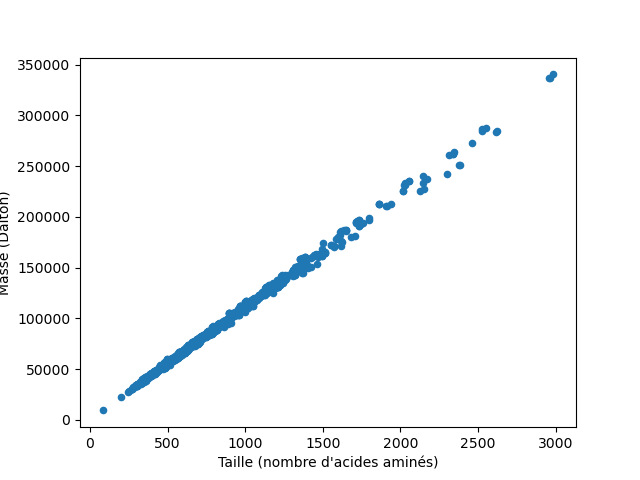
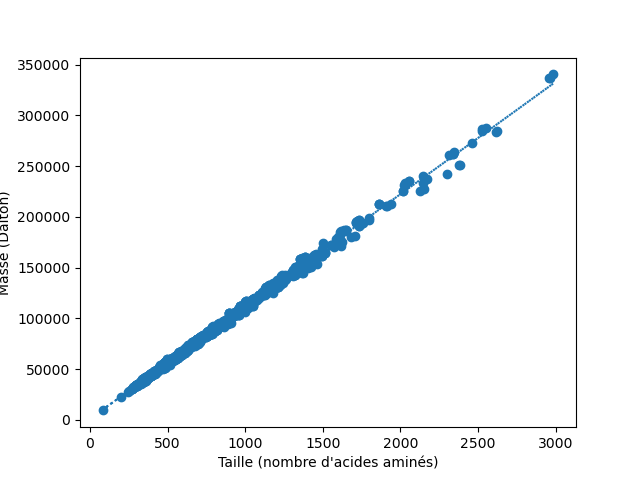
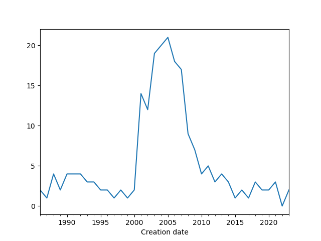

# Module Pandas

Le module [*pandas*](https://pandas.pydata.org/) a été conçu pour l'analyse de données. Il est particulièrement puissant pour manipuler des données structurées sous forme de tableau.


## Installation et convention

Le module *pandas* n'est pas fourni avec la distribution Python de base. Avec la distribution Miniconda que nous vous conseillons d'utiliser (consultez pour cela la documentation en [ligne](https://python.sdv.u-paris.fr/livre-dunod)), vous pouvez rapidement l'installer avec la commande :

```bash
$ conda install -c conda-forge pandas
```

Dans ce chapitre, nous vous montrerons quelques exemples d’utilisation du module *pandas* pour vous convaincre de sa pertinence. Ces exemples seront exécutés dans un notebook Jupyter.

```python
Les cellules de code apparaitront de cette manière
dans un notebook Jupyter, avec des numéros de lignes à gauche.
```

```text
Les résultats seront affichés de cette manière,
éventuellement sur plusieurs lignes.
```

## Chargement du module
Pour charger *pandas* dans la mémoire de Python, on utilise la commande `import` habituelle :

```python
import pandas
```

Par convention, Pandas est souvent chargé avec un nom raccourci :

```python
import pandas as pd
```


## *Series*

Le premier type de données apporté par *pandas* est la *Series*, qui correspond à un vecteur à une dimension.

```python
s = pd.Series([10, 20, 30, 40], index = ['a', 'b', 'c', 'd'])
s
```

```text
a    10
b    20
c    30
d    40
dtype: int64
```

Avec *pandas*, chaque élément de la série de données possède une étiquette qui permet d'appeler les éléments.
Ainsi, pour appeler le premier élément de la série, on peut son étiquette (ici, `"a"`) :

```python
s["a"]
```

```text
10
```

Pour accéder au premier élément par son indice (ici 0), comme on le ferait avec une liste, on utilise la méthode `.iloc()` :

```python
s.iloc[0]
```

```text
10
```


Bien sûr, on peut extraire plusieurs éléments, par leurs indices ou leurs étiquettes :

```python
s[["b", "d"]]
```

```text
b    20
d    40
dtype: int64
```

et

```python
s.iloc[[1, 3]]
```

```text
b    20
d    40
dtype: int64
```


Les étiquettes permettent de modifier et d'ajouter des éléments :

```python
s["c"] = 300
s["z"] = 50
s
```

```text
a     10
b     20
c    300
d     40
z     50
dtype: int64
```

Enfin, on peut filtrer une partie de la *Series* :

```python
s[s>30]
```

```text
c    300
d     40
z     50
dtype: int64
```

open-box-rem

Cette écriture rappelle celle des masques booléens dans le chapitre 20 *Module NumPy*.

close-box-rem

Enfin, on peut aussi combiner plusieurs critères de sélection avec les opérateurs logiques `&` (pour **ET**) et `|` (pour **OU**) :

```python
s[(s>20) & (s<100)]
```

```text
d    40
z    50
dtype: int64
```

```python
s[(s<15) | (s>150)]
```

```text
a     10
c    300
dtype: int64
```


## *Dataframes*

Un autre type d'objet particulièrement intéressant introduit par *pandas*
sont les *Dataframes*. Ceux-ci correspondent à des tableaux à deux dimensions
avec des étiquettes pour nommer les lignes et les colonnes.

open-box-rem

Si vous êtes familier avec le langage de programmation et d'analyse statistique R, les
*dataframes* de *pandas* se rapprochent de ceux trouvés dans R.

close-box-rem


Voici comment créer un *Dataframe* avec *pandas* à partir
de données fournies comme liste de lignes :

```python
import numpy as np
df = pd.DataFrame(columns=["a", "b", "c", "d"],
                  index=["chat", "singe", "souris"],
                  data=[np.arange(10, 14),
                        np.arange(20, 24),
                        np.arange(30, 34)])
df
```

```text
         a   b   c   d
chat    10  11  12  13
singe   20  21  22  23
souris  30  31  32  33
```

Voici quelques commentaires sur le code précédent :

- Ligne 1. On charge le module *NumPy* utilisé ensuite.
- Ligne 2. Le *dataframe* est créé avec la fonction `DataFrame()` à laquelle
on fournit plusieurs arguments. L'argument `columns` indique le nom des colonnes, 
sous forme d'une liste.
- Ligne 3. L'argument `index` définit le nom des lignes, sous forme de liste également.
- Lignes 4 à 6. L'argument `data` fournit le contenu du *Dataframe*, sous la forme
d'une liste de valeurs correspondantes à des lignes. Ainsi `np.arange(10, 14)`
 qui est équivalent à `[10, 11, 12, 13]` correspond à la première ligne du *Dataframe*. 

Le même *Dataframe* peut aussi être créé à partir des valeurs fournies
en colonnes sous la forme d'un dictionnaire :

```python
data = {"a": np.arange(10, 40, 10),
        "b": np.arange(11, 40, 10),
        "c": np.arange(12, 40, 10),
        "d": np.arange(13, 40, 10)}
df = pd.DataFrame(data)
df.index = ["chat", "singe", "souris"]
df
```

```text
         a   b   c   d
chat    10  11  12  13
singe   20  21  22  23
souris  30  31  32  33
```

- Lignes 1 à 4. Le dictionnaire `data` contient les données en colonnes. La clé associée à chaque colonne est le nom de la colonne.
- Ligne 5. Le *dataframe* est créé avec la fonction `pd.DataFrame()` à laquelle on passe `data` en argument.
- Ligne 6. On peut définir les étiquettes des lignes de n'importe quel *dataframe* avec l'attribut `df.index`.


### Quelques propriétés

Les dimensions d'un *dataframe* sont données par l'attribut `.shape` :

```python
df.shape
```

```text
(3, 4)
```

Ici, le *dataframe* `df` a trois lignes et quatre colonnes.

L'attribut `.columns` renvoie le nom des colonnes et permet aussi de renommer
les colonnes d'un *dataframe* :

```python
df.columns
```

```text
Index(['a', 'b', 'c', 'd'], dtype='object')
```

```python
df.columns = ["Paris", "Lyon", "Nantes", "Pau"]
df
```

```text
        Paris  Lyon  Nantes  Pau
chat       10    11      12   13
singe      20    21      22   23
souris     30    31      32   33
```

La méthode `.head(n)` renvoie les *n* premières lignes du *Dataframe*
(par défaut, *n* vaut 5) :

```python
df.head(2)
```

```text
       Paris  Lyon  Nantes  Pau
chat      10    11      12   13
singe     20    21      22   23
```


open-box-rem

es *Dataframes* utilisés sont volontairement petits.
Si vous êtes confrontés à des *Dataframes* de grande taille,
ceux-ci seront affichés partiellement dans un notebook Jupyter. Des ascenseurs en bas et à droite du *Dataframe* permettront de naviguer dans les données.

close-box-rem


### Sélection

Les mécanismes de sélection  fournis avec *pandas* sont très puissants.
En voici un rapide aperçu :

#### Sélection de colonnes

On peut sélectionner une colonne par son étiquette :

```python
df["Lyon"]
```

```text
chat      11
singe     21
souris    31
```

La notation `df["Lyon"]` sélectionne une colonne et renvoie un objet *Series* :

```python
type(df["Lyon"])
```

```text
pandas.core.series.Series
```

open-box-warn

On trouve parfois l'écriture `df.Lyon` pour sélectionner une colonne. C'est une très mauvaise pratique car cette écriture peut être confondue avec un attribut de l'objet `df` (par exemple `.shape`). Par ailleurs, elle ne fonctionne pas pour des noms de colonnes qui contiennent des espaces ou des caractères spéciaux (ce qui n'est pas non plus une bonne pratique).

Nous vous conseillons de toujours utiliser la notation `df[nom_de_colonne]`.

close-box-warn


Pour sélectionner plusieurs colonnes, il faut fournir une liste de noms de colonnes :

```python
df[["Lyon", "Pau"]]
```

```text
        Lyon  Pau
chat      11   13
singe     21   23
souris    31   33
```

On obtient cette fois un *Dataframe* avec les colonnes sélectionnées :

```python
type(df[["Lyon", "Pau"]])
```

```text
pandas.core.frame.DataFrame
```

open-box-rem

La sélection de plusieurs colonnes nécessite une liste entre les crochets,
par exemple `df[["Lyon", "Pau"]]`.
Si on utilise un tuple du type `df[("Lyon", "Pau")]`,
Python renvoie une erreur `KeyError: ('Lyon', 'Pau')`.

close-box-rem


#### Sélection de lignes

Pour sélectionner une ligne, il faut utiliser l'instruction `.loc()`
et l'étiquette de la ligne :

```python
df.loc["singe"]
```

```text
Paris     20
Lyon      21
Nantes    22
Pau       23
Name: singe, dtype: int64
```

Ici aussi, on peut sélectionner plusieurs lignes :

```python
df.loc[["singe", "chat"]]
```

```text
       Paris  Lyon  Nantes  Pau
singe     20    21      22   23
chat      10    11      12   13
```

Enfin, on peut aussi sélectionner des lignes avec l'instruction `.iloc`
et l'indice de la ligne (la première ligne ayant l'indice 0) :

```python
df.iloc[1]
```

```text
Paris     20
Lyon      21
Nantes    22
Pau       23
Name: singe, dtype: int64
```

```python
df.iloc[[1, 0]]
```

```text
       Paris  Lyon  Nantes  Pau
singe     20    21      22   23
chat      10    11      12   13
```

On peut également utiliser les tranches (comme pour les listes) :

```python
df.iloc[0:2]
```

```text
       Paris  Lyon  Nantes  Pau
chat      10    11      12   13
singe     20    21      22   23
```


#### Sélection sur les lignes et les colonnes

On peut bien sûr combiner les deux types de sélection (en ligne et en colonne):

```python
df.loc["souris", "Pau"]
```

```text
33
```

```python
df.loc[["singe", "souris"], ["Nantes", "Lyon"]]
```

```text
        Nantes  Lyon
singe       22    21
souris      32    31
```

Notez qu'à partir du moment où on souhaite effectuer une sélection sur des lignes,
il faut utiliser `loc` (ou `iloc` si on utilise les indices).


#### Sélection par condition

Remémorons-nous d'abord le contenu du *dataframe* `df` :

```python
df
```

```text
        Paris  Lyon  Nantes  Pau
chat       10    11      12   13
singe      20    21      22   23
souris     30    31      32   33
```

Sélectionnons maintenant toutes les lignes pour lesquelles les effectifs à Pau
sont supérieurs à 15 :

```python
df[ df["Pau"]>15 ]
```

```text
        Paris  Lyon  Nantes  Pau
singe      20    21      22   23
souris     30    31      32   33
```

De cette sélection, on ne souhaite garder que les valeurs pour Lyon :

```python
df[ df["Pau"]>15 ]["Lyon"]
```

```text
singe     21
souris    31
Name: Lyon, dtype: int64
```

On peut aussi combiner plusieurs conditions avec `&` pour l'opérateur **et** :

```python
df[ (df["Pau"]>15) & (df["Lyon"]>25) ]
```

```text
        Paris  Lyon  Nantes  Pau
souris     30    31      32   33
```

et `|` pour l'opérateur **ou** :

```python
df[ (df["Pau"]>15) | (df["Lyon"]>25) ]
```

```text
        Paris  Lyon  Nantes  Pau
singe      20    21      22   23
souris     30    31      32   33
```


### Combinaison de *dataframes*

En biologie, on a souvent besoin de combiner deux tableaux à partir d'une colonne commune.

Par exemple, si on considère les deux *dataframes* suivants :

```python
data1 = {"Lyon": [10, 23, 17], "Paris": [3, 15, 20]}
df1 = pd.DataFrame.from_dict(data1)
df1.index = ["chat", "singe", "souris"]
df1
```

```text
        Lyon  Paris
chat      10      3
singe     23     15
souris    17     20
```

et

```python
data2 = {"Nantes": [3, 9, 14], "Strasbourg": [5, 10, 8]}
df2 = pd.DataFrame.from_dict(data2)
df2.index = ["chat", "souris", "lapin"]
df2
```

```text
        Nantes  Strasbourg
chat         3           5
souris       9          10
lapin       14           8
```

On souhaite combiner ces deux *dataframes*, c'est-à-dire connaître pour les quatres villes (Lyon, Paris, Nantes et Strasbourg) le nombre d'animaux. On remarque d'ores et déjà qu'il y a des singes à Lyon et Paris mais pas de lapin et qu'il y a des lapins à Nantes et Strasbourg mais pas de singe. Nous allons voir comment gérer cette situation.

*pandas* propose pour cela la fonction [`concat()`](https://pandas.pydata.org/pandas-docs/stable/merging.html) qui prend comme argument une liste de *dataframes* :

```python
pd.concat([df1, df2])
```

```text
        Lyon  Nantes  Paris  Strasbourg
chat    10.0     NaN    3.0         NaN
singe   23.0     NaN   15.0         NaN
souris  17.0     NaN   20.0         NaN
chat     NaN     3.0    NaN         5.0
souris   NaN     9.0    NaN        10.0
lapin    NaN    14.0    NaN         8.0
```

Ici, `NaN` indique des valeurs manquantes, cela signifie littéralement *Not a Number*. Mais le résultat obtenu n'est pas celui que nous attendions puisque les lignes de deux *dataframes* ont été recopiées.

L'argument supplémentaire `axis=1` produit le résultat attendu :

```python
pd.concat([df1, df2], axis=1)
```

```text
        Lyon  Paris  Nantes  Strasbourg
chat    10.0    3.0     3.0         5.0
lapin    NaN    NaN    14.0         8.0
singe   23.0   15.0     NaN         NaN
souris  17.0   20.0     9.0        10.0
```

Par défaut, *pandas* va conserver le plus de lignes possible. Si on ne souhaite conserver que les lignes communes aux deux *dataframes*, il faut ajouter l'argument `join="inner"` :

```python
pd.concat([df1, df2], axis=1, join="inner")
```

```text
        Lyon  Paris  Nantes  Strasbourg
chat      10      3       3           5
souris    17     20       9          10
```

Un autre comportement par défaut de `concat()` est que cette fonction va combiner les *dataframes* en se basant sur leurs index. Il est néanmoins possible de préciser, pour chaque *dataframe*, le nom de la colonne qui sera utilisée comme référence avec l'argument `join_axes`.


## Un exemple plus complet avec les kinases

Pour illustrer les possibilités de *pandas*, voici un exemple plus complet.

Le fichier `kinases.csv` que vous pouvez télécharger
[ici](https://python.sdv.u-paris.fr/data-files/kinases.csv)
contient des informations tirées de la base de données de séquences UniProt pour quelques protéines de la famille des [kinases](https://fr.wikipedia.org/wiki/Kinase).
Ces protéines sont responsables de la phosphorylation d'autres protéines.

Si vous n'êtes pas familier avec le format de fichier `.csv`, nous vous conseillons
de consulter l'annexe A *Quelques formats de données rencontrés en biologie*.

Voyons maintenant comment explorer les données contenues
dans ce fichier avec *pandas*.


### Prise de contact avec le jeu de données

Une fonctionnalité très intéressante de *pandas* est d'ouvrir très facilement
un fichier au format `.csv` :

```python
df = pd.read_csv("kinases.csv")
```

Le contenu est chargé sous la forme d'un *dataframe* dans la variable `df`.

Le fichier contient 1442 lignes de données plus une ligne d'en-tête. Cette dernière
 est automatiquement utilisée par *pandas* pour nommer les différentes colonnes.
 Voici un aperçu des premières lignes :

```python
df.head()
```

```text
        Entry   Organism  Length Creation date    Mass  PDB
0  A0A0B4J2F2      Human     783    2018-06-20   84930  NaN
1      A4L9P5        Rat    1211    2007-07-24  130801  NaN
2  A0A1D6E0S8      Maize     856    2023-05-03   93153  NaN
3  A0A8I5ZNK2        Rat     528    2023-09-13   58360  NaN
4      A1Z7T0  Fruit fly    1190    2012-01-25  131791  NaN
```

Nous avons six colonnes de données :

- l'identifiant de la protéine (`Entry`) ;
- l'organisme d'où provient cette protéine (`Organism`) ;
- le nombre d'acides aminés qui constituent la protéine (`Length`) ;
- la date à laquelle cette protéine a été déréférencée dans *UniProt* (`Creation date`) ;
- la masse de la protéine (`Mass`), exprimée en Dalton ;
- les éventuelles structures 3D de la protéine (`PDB`).

La colonne d'entiers tout à gauche est un index automatiquement créé par *pandas*.

Nous pouvons demander à *pandas* d'utiliser une colonne particulière comme index.
On utilise pour cela le paramètre `index_col` de la fonction `read_csv()`. 
Ici, la colonne `Entry` s'y prête très bien car cette colonne ne contient que
des identifiants uniques :

```python
df = pd.read_csv("kinases.csv", index_col="Entry")
df.head()
```

```text
             Organism  Length Creation date    Mass  PDB
Entry                                                   
A0A0B4J2F2      Human     783    2018-06-20   84930  NaN
A4L9P5            Rat    1211    2007-07-24  130801  NaN
A0A1D6E0S8      Maize     856    2023-05-03   93153  NaN
A0A8I5ZNK2        Rat     528    2023-09-13   58360  NaN
A1Z7T0      Fruit fly    1190    2012-01-25  131791  NaN
```

open-box-rem

La fonction `.read_csv()` peut aussi lire un fichier au format TSV (voir l'annexe A *Quelques formats de données rencontrés en biologie*). Il faut pour cela préciser que le séparateur des colonnes de données est une tabulation (`\t`) avec l'argument `sep="\t"`.

close-box-rem

Avant d'analyser un jeu de données, il est intéressant de l'explorer un peu.
Par exemple, connaître ses dimensions :

```python
df.shape
```

```text
(1442, 5)
```

Notre jeu de données contient donc 1442 lignes et 5 colonnes. En effet,
la colonne `Entry` est maintenant utilisée comme index et n'est donc plus
prise en compte.

Il est aussi intéressant de savoir de quel type de données est constituée
chaque colonne :

```python
df.dtypes
```

```text
Organism         object
Length            int64
Creation date    object
Mass              int64
PDB              object
dtype: object
```

Les colonnes `Length` et `Mass` contiennent des valeurs numériques, 
en l'occurence des entiers (`int64`). 
Le type `object` est un type par défaut.


La méthode `.info()` permet d'aller un peu plus loin dans l'exploration du jeu de données 
en combinant les informations produites par les propriétés `.shape` et `.dtypes` :

```python
df.info()
```

```text
<class 'pandas.core.frame.DataFrame'>
Index: 1442 entries, A0A0B4J2F2 to Q5F361
Data columns (total 5 columns):
 #   Column         Non-Null Count  Dtype 
---  ------         --------------  ----- 
 0   Organism       1442 non-null   object
 1   Length         1442 non-null   int64 
 2   Creation date  1442 non-null   object
 3   Mass           1442 non-null   int64 
 4   PDB            488 non-null    object
dtypes: int64(2), object(3)
memory usage: 67.6+ KB
```

Avec l'argument `memory_usage="deep"`, cette méthode permet surtout de connaitre avec précision 
la quantité de mémoire vive occupée par le *dataframe* : 

```python
df.info(memory_usage="deep")
```

```text
<class 'pandas.core.frame.DataFrame'>
Index: 1442 entries, A0A0B4J2F2 to Q5F361
Data columns (total 5 columns):
 #   Column         Non-Null Count  Dtype 
---  ------         --------------  ----- 
 0   Organism       1442 non-null   object
 1   Length         1442 non-null   int64 
 2   Creation date  1442 non-null   object
 3   Mass           1442 non-null   int64 
 4   PDB            488 non-null    object
dtypes: int64(2), object(3)
memory usage: 351.0 KB
```

Ici, le *dataframe* occupe 351 kilo-octets (ko) en mémoire.


### Recherche de valeurs manquantes

Il est aussi utile de savoir si des valeurs manquantes sont présentes dans le jeu de données. Ces valeurs manquantes correspondent à des champs pour lesquels aucune valeur n'ont été fournies. Elles sont souvent représentées par `NaN` (pour *Not a Number*).

La méthode `.isna()` renvoie un *Dataframe* de la même dimension que le *Dataframe* initial mais avec des valeurs booléennes (`True` si la valeur est manquante (`NaN`) ou `False` sinon). En le combinant avec la méthode `.sum()`, on peut compter le nombre de valeurs manquantes pour chaque colonne :

```python
df.isna().sum()
```

```text
Organism           0
Length             0
Creation date      0
Mass               0
PDB              954
dtype: int64
```

Ici, la seule colonne qui contient des valeurs manquantes est la colonne `PDB`, qui contient 954 valeurs manquantes. Cela signifie que pour 954 protéines, aucune structure 3D n'est disponible.

Nous reviendrons plus tard sur cette colonne `PDB`.


### Conversion en date

Le type `object` correspond la plupart du temps à des chaînes de caractères.
C'est tout à fait légitime pour la colonne `Organism`. Mais on sait par contre
que la colonne `Creation date` est une date sous la forme
*année-mois-jour*.

Si le format de date utilisé est homogène sur tout le jeu de données et non ambigu,
on peut demander à *pandas* de considérer la colonne `Creation Date` comme une date. 
*pandas* détectera alors automatiquement le format de date utilisé :

```python
df["Creation date"] = pd.to_datetime(df["Creation date"])
```

L'affichage des données n'est pas modifié :

```python
df.head()
```

```text
             Organism  Length Creation date    Mass  PDB
Entry                                                   
A0A0B4J2F2      Human     783    2018-06-20   84930  NaN
A4L9P5            Rat    1211    2007-07-24  130801  NaN
A0A1D6E0S8      Maize     856    2023-05-03   93153  NaN
A0A8I5ZNK2        Rat     528    2023-09-13   58360  NaN
A1Z7T0      Fruit fly    1190    2012-01-25  131791  NaN
```

Mais le type de données de la colonne `Creation date` est maintenant une date (`datetime64[ns]`) :

```python
df.dtypes
```

```text
Organism                 object
Length                    int64
Creation date    datetime64[ns]
Mass                      int64
PDB                      object
dtype: object
```

### Statistiques descriptives et table de comptage

Pour les colonnes qui contiennent des données numériques, on peut obtenir
rapidement quelques statistiques descriptives avec la méthode `.describe()` :

```python
df.describe()
```

```text
            Length                  Creation date           Mass
count  1442.000000                           1442    1442.000000
mean    756.139390  2001-01-25 16:10:39.112344064   84710.753814
min      81.000000            1986-07-21 00:00:00    9405.000000
25%     476.250000            1996-10-01 00:00:00   54059.000000
50%     632.000000            2002-03-10 00:00:00   71613.000000
75%     949.250000            2005-11-22 00:00:00  105485.250000
max    2986.000000            2023-09-13 00:00:00  340261.000000
std     404.195273                            NaN   44764.273097
```

On apprend ainsi que la taille de la protéine (colonne `Length`)
a une valeur moyenne de 756,139390 acides aminés et que
la plus petite protéine est composée de 81 acides aminés et la plus grande de 2986. Pratique !

Des statistiques sont également proposées pour la colonne `Creation date`. La protéine la plus récente a ainsi été référencée le 13 septembre 2023.

La colonne `Organism` contient des chaînes de caractères, on peut rapidement
déterminer le nombre de protéines pour chaque organisme :

```python
df["Organism"].value_counts()
```

```text
Organism
Human        489
Mouse        489
Rat          253
Fruit fly    103
Chicken       75
Rabbit        25
Maize          8
Name: count, dtype: int64
```

On apprend ainsi que 489 protéines sont d'origine humaine (`Human`) et 8 proviennent
du maïs (`Maize`).


### Statistiques par groupe

On peut aussi déterminer, pour chaque organisme, la taille 
et la masse moyennes des kinases :

```python
df.groupby(["Organism"])[["Length", "Mass"]].mean()
```

```text
               Length          Mass
Organism                           
Chicken    720.160000  81120.880000
Fruit fly  784.844660  88154.669903
Human      771.004090  86281.190184
Maize      666.875000  73635.000000
Mouse      768.092025  85942.274029
Rabbit     591.480000  66754.200000
Rat        722.379447  81081.822134
```

La méthode `.groupby()` rassemble d'abord les données suivant la colonne
`Organism`. Puis on sélectionne les colonnes `Length` et `Mass`.
Enfin, la méthode `.mean()` calcule la moyenne pour chaque groupe.

Si on souhaite obtenir deux statistiques (par exemple la valeur minimale et maximale)
en une seule fois, il convient alors d'utiliser la méthode `.pivot_table()`
plus complexe mais aussi beaucoup plus puissante :

```python
df.pivot_table(
    index="Organism",
    values=["Length", "Mass"],
    aggfunc=["min", "max"]
)
```

```text
             min           max        
          Length   Mass Length    Mass
Organism                              
Chicken      303  34688   2311  260961
Fruit fly    294  33180   2554  287025
Human        253  28160   2986  340261
Maize        294  33834    996  105988
Mouse        244  27394   2964  337000
Rabbit        81   9405   1382  158347
Rat          274  31162   2959  336587
```

L'argument `index` précise la colonne dont on agrège les données.

L'argument `values` indique sur quelles colonnes les statistiques sont calculées.

Enfin, `aggfunc` liste les statistiques calculées, ici la valeur minimale et maximale.

Notez que les valeurs renvoyées sont d'abord les valeurs minimales pour `Length`
et `Mass` puis les valeurs maximales pour `Length` et `Mass`.


### Analyse de données numériques

On peut, sans trop de risque, émettre l'hypothèse que plus il y a d'acides
aminés dans la protéine, plus sa masse va être élevée.

Pour vérifier cela graphiquement, on représente la masse de
la protéine en fonction de sa taille (c'est-à-dire du nombre d'acides aminés).

```python
import matplotlib.pyplot as plt

fig, ax = plt.subplots()
ax.scatter(df["Length"], df["Mass"])
ax.set_xlabel("Taille (nombre d'acides aminés)")
ax.set_ylabel("Masse (Dalton)")
fig.savefig("kinases1.png")
```

On obtient un graphique similaire à celui de la figure @fig:kinases1.

{ #fig:kinases1 width=70% }

Avec *pandas*, on peut aussi appeler une méthode `.plot()` sur un *Dataframe*
pour obtenir une représentation graphique identique à la figure @fig:kinases1 :

```python
import matplotlib.pyplot as plt

df.plot(
    kind="scatter",
    x="Length",
    y="Mass",
    xlabel="Taille (nombre d'acides aminés)",
    ylabel="Masse (Dalton)"
)
plt.savefig("kinases.png")
```

Ligne 4. On spécifie le type de graphique. Ici, un nuage de points.

Lignes 5 et 6. On précise les colonnes à utiliser pour les abscisses et les ordonnées.

Le graphique de la figure @fig:kinases1 met en évidence une relation linéaire
entre le nombre de résidus d'une protéine et sa masse.

En réalisant une régression linéaire, on détermine les paramètres de
la droite qui passent le plus proche possible des points du graphique.

```python
from scipy.stats import linregress
model = linregress(df["Length"], df["Mass"])
model
```

```text
LinregressResult(slope=110.63478918698122, intercept=1055.431834679228,
rvalue=0.9989676084416755, pvalue=0.0, stderr=0.13258187632073232,
intercept_stderr=113.66584551734655)
```

Ce modèle linaire nous indique qu'un résidu a une masse d'environ 111 Dalton,
ce qui est cohérent. On peut également comparer ce modèle aux différentes protéines :

```python
fig, ax = plt.subplots()
ax.scatter(df["Length"], df["Mass"])
ax.plot(
        df["Length"],
        df["Length"]*model.slope + model.intercept,
        ls=":"
)
ax.set_xlabel("Taille (nombre d'acides aminés)")
ax.set_ylabel("Masse (Dalton)")
fig.savefig("kinases2.png")
```

On obtient ainsi le graphique de la figure @fig:kinanes2.

{ #fig:kinases2 width=70% }


### Analyse de données temporelles

Il peut être intéressant de savoir, pour chaque organisme, quand les premières
et les dernières séquences de kinases ont été référencées dans UniProt.

La méthode `.pivot_table()` apporte des éléments de réponse :

```python
df.pivot_table(
    index="Organism",
    values=["Creation date"],
    aggfunc=["min", "max"]
)
```

```text
                    min           max
          Creation date Creation date
Organism                             
Chicken      1986-07-21    2021-02-10
Fruit fly    1986-07-21    2023-09-13
Human        1986-07-21    2018-06-20
Maize        1990-08-01    2023-05-03
Mouse        1986-07-21    2017-03-15
Rabbit       1986-07-21    2010-03-02
Rat          1986-07-21    2023-09-13
```

Chez le poulet (*Chicken*), la première séquence a été référencées 
le 21 juillet 1986 et la dernière le 10 février 2021.

Une autre question est de savoir combien de kinases ont
été référencées en fonction du temps.

La méthode `.value_counts()` peut être utilisée mais elle ne renvoie que
le nombre de protéines référencées dans UniProt pour un jour donné. Par exemple,
40 structures ont été références le 28 novembre 2006.

```python
df["Creation date"].value_counts().head()
```

```text
Creation date
1997-11-01    72
1996-10-01    58
2000-12-01    43
2000-05-30    41
2006-11-28    40
Name: count, dtype: int64
```

Si on souhaite une réponse plus globale, par exemple, à l'échelle de
l'année, la méthode `.resample()` calcule le nombre de structures déposées par
année (en fournissant l'argument `YE`) :

```python
df["Creation date"].value_counts().resample("YE").count()
```

```text
Creation date
1986-12-31     2
1987-12-31     1
1988-12-31     4
1989-12-31     2
[...]
```

Les dates apparaissent maintenant comme le dernier jour de l'année mais désignent
bien l'année complète. Dans cet exemple, une seule kinase a été référencée
dans UniProt entre le 1er janvier et le 31 décembre 1987.

Pour connaître quelle année le plus de kinases ont été référencées dans UniProt,
il faut trier les valeurs obtenues du plus grand au plus petit avec la méthode
`.sort_values()`. Comme on ne veut connaître que les premières dates
(celles où il y a eu le plus de protéines référencées),
on utilisera également la méthode `.head()`.

En utilisant le *method chaining* présenté dans le chapitre 11 *Plus sur les chaînes de caractères*, nous pouvons écrire toutes ces transformations en une seule instruction, répartie sur plusieurs lignes pour plus de lisibilité (en utilisant des parenthèses) :

```python
(df["Création date"]
    .value_counts()
    .resample("YE")
    .count()
    .sort_values(ascending=False)
    .head()
)
```

```text
Creation date
2005-12-31    21
2004-12-31    20
2003-12-31    19
2006-12-31    18
2007-12-31    17
Name: count, dtype: int64
```

En 2005, 21 kinases ont été référencées dans UniProt. La deuxième
« meilleure » année est 2004 avec 20 protéines.

Toutes ces méthodes, enchaînées les unes à la suite des autres, peuvent vous
sembler complexes mais chacune d'elles correspond à une étape du traitement des données. 
Bien sûr, on aurait pu créer des variables intermédiaires
pour chaque étape mais cela aurait été plus lourd :

```python
date1 = df["Creation date"].value_counts()
date2 = date1.resample("YE")
date3 = date2.count()
date4 = date3.sort_values(ascending=False)
date4.head()
```

On aurait obtenu exactement le même résultat.

open-box-rem

Le *method chaining* est une manière efficace et élégante de traiter des données avec *pandas*.

close-box-rem

Enfin, pour obtenir un graphique de l'évolution du nombre de kinases référencées dans UniProt en fonction du temps, on peut encore utiliser le *method chaining* :

```python
(df["Creation date"]
    .value_counts()
    .resample("YE")
     .count()
     .plot()
)
plt.savefig("kinases3.png")
```

On obtient ainsi le graphique de la figure @fig:kinanes3.

{ #fig:kinases3 width=70% }

On observe un pic du nombre de kinases référencées dans UniProt sur la période 2001-2009.


### Transformation d'une colonne

Nous avons vu précédemment que la colonne `PDB` contenait de nombreuses valeurs manquantes (`NaN`).
Mais il est intéressant de savoir ce que peut contenir cette colonne quand elle n'est pas vide :

```python
(df
 .loc[ ~ df["PDB"].isna() ]
 .head(3)
)
```

```text
       Organism  Length Creation date    Mass                   PDB
Entry                                                              
A2CG49    Mouse    2964    2007-10-23  337000            1WFW;7UR2;
D3ZMK9      Rat    1368    2018-07-18  147716                 6EWX;
O00141    Human     431    1998-12-15   48942  2R5T;3HDM;3HDN;7PUE;
```

Ligne 2. La méthode `isna()` sélectionne les lignes qui contiennent des valeurs manquantes dans la colonne `PDB` puis l'opérateur `~` inverse cette sélection.

Ligne 3. On limite l'affichage aux trois premières lignes.

On découvre que la colonne `PDB` contient des identifiants de structures 3D de protéines. Ces identifiants sont séparés par des points-virgules, y compris pour la dernière valeur.

Nous souhaitons compter le nombre de structures 3D pour chaque protéine. Pour cela, nous allons d'abord créer une fonctionne qui compte le nombre de points-virgules dans une chaîne de caractères :

```python
def count_structures(row):
    if pd.isna(row["PDB"]):
        return 0
    else:
        return row["PDB"].count(";")
```

Dans la ligne 2, la méthode `.isna()` teste si la valeur est manquante et si ce n'est pas le cas, la fonction renvoie le nombre de points-virgules dans la chaîne de caractères de la colonne `PDB` (ligne 5).

On applique ensuite la fonction `count_structures()` au *Dataframe* avec la méthode `.apply()`.
On crée la nouvelle colonne `nb_structures` en même temps :

```python
df["nb_structures"] = df.apply(count_structures, axis=1)
df.head()
```

```text
             Organism  Length Creation date    Mass  PDB  nb_structures
Entry                                                                  
A0A0B4J2F2      Human     783    2018-06-20   84930  NaN              0
A4L9P5            Rat    1211    2007-07-24  130801  NaN              0
A0A1D6E0S8      Maize     856    2023-05-03   93153  NaN              0
A0A8I5ZNK2        Rat     528    2023-09-13   58360  NaN              0
A1Z7T0      Fruit fly    1190    2012-01-25  131791  NaN              0
```

Les premières lignes ne sont pas très intéressantes car elles ne contiennent pas de structures 3D. Mais on peut chercher les kinases qui ont le plus de structures 3D :

```python
(df
 .sort_values(by="nb_structures", ascending=False)
 .filter(["Organism", "nb_structures"])
 .head()
)
```

Ligne 2. On trie les données par ordre décroissant de la colonne `nb_structures`.

Ligne 3. On ne conserve que les colonnes `Organism` et `nb_structures` à afficher.

Ligne 4. On limite l'affichage aux cinq premières lignes.

```text
       Organism  nb_structures
Entry                         
P24941    Human            453
P00533    Human            284
Q16539    Human            245
P68400    Human            238
P11309    Human            176
```

La kinase `P24941` a 453 structures 3D référencées dans UniProt. Les cinq kinases qui ont le plus de structures 3D sont toutes d'origine humaine.

open-box-more

- Les ouvrages *Python for Data Analysis* (2022) de Wes McKinney et *Effective Pandas* (2021) de Matt Harrison sont d'excellentes références pour *pandas*.

close-box-more


## Exercices

open-box-adv

Pour ces exercices, utilisez des notebooks Jupyter.

close-box-adv

### Analyse d'un jeu de données

Le jeu de données `people.tsv` contient les caractéristiques de quelques individus : prénom, sexe, taille (en cm) et âge (en années). 
Par exemple :

| name | sex | size | age |
| ---- | --- | ---- | --- |
| simon | male | 175 | 33 |
| clara | female | 167 | 45|
| serge | male |181 | 44 |
| claire | female | 174 | 31 |
| ... | ... | ... | ... |

L'objectif de cet exercice est de manipuler ces données avec *pandas*.

Si vous n'êtes pas familier avec le format de fichier `.tsv`, nous vous conseillons de consulter l'annexe A *Quelques formats de données rencontrés en biologie*.


#### Chargement du jeu de données

Téléchargez le fichier [people.tsv](https://python.sdv.u-paris.fr/data-files/people.tsv).

Ouvrez ce fichier avec *pandas* et la fonction `.read_csv()`. N'oubliez pas de préciser le séparateur par défaut avec l'argument `sep="\t"`. Utilisez également l'argument `index_col` pour utiliser la colonne `name` comme index.

Affichez les six premières lignes du jeu de données.

Combien de lignes contient le jeu de données ?


#### Sélections 

Déterminez la taille de Claire.

Déterminez l'âge de Baptiste.

Affichez, en une seule commande, l'âge de Paul et Bob.


#### Statistiques descriptives et table de comptage

Déterminez la moyenne et la valeur minimale de la taille et l'âge des individus.

Comptez ensuite le nombre de personnes de chaque sexe.


#### Statistiques par groupe

Déterminez, la taille et l'âge moyen chez les hommes et les femmes. Utilisez pour cela la méthode `.groupby()`.


#### Sélections par filtre

Déterminez combien de d'individus mesurent plus de 1,80 m.

Quelle femme a moins de 35 ans ?


#### Sélections et statistiques

Déterminez l'âge moyen des individus qui mesurent plus de 1,80 m.

Déterminez la taille maximale des femmes qui ont plus de 35 ans.
