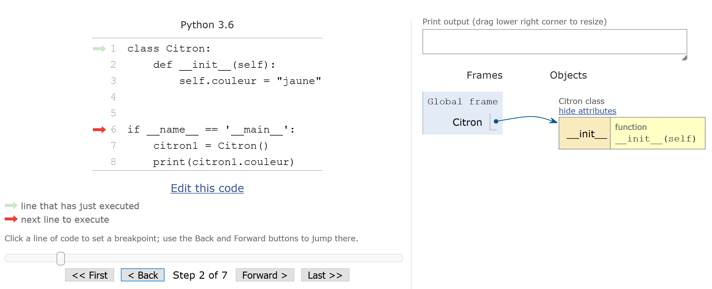
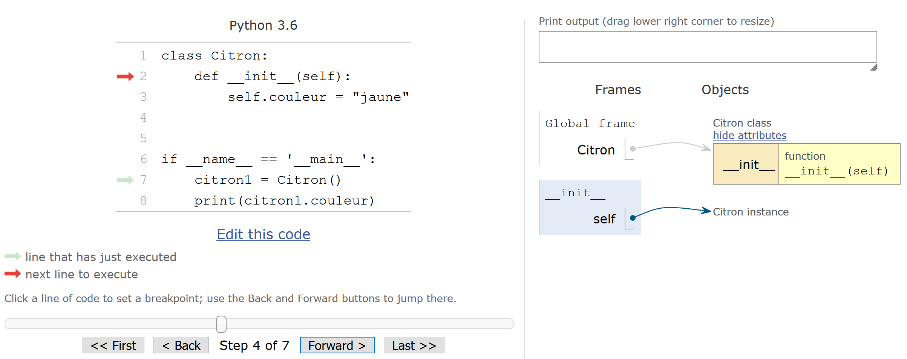
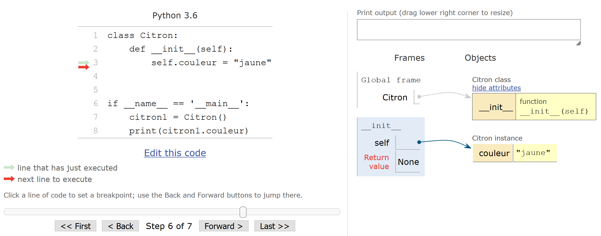
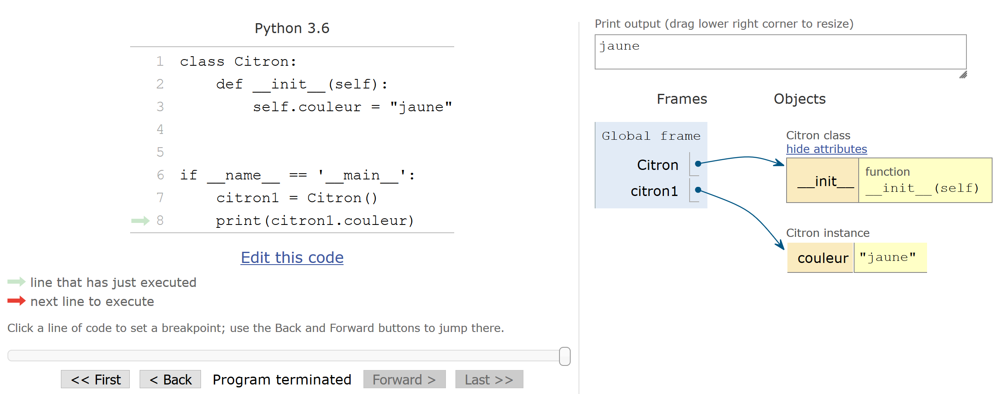

# Avoir la classe avec les objets

La programmation orientée objet (POO) est un concept de programmation très puissant qui permet de structurer ses programmes d'une manière nouvelle. En POO, on définit un « objet » qui peut contenir des « attributs » ainsi que des « méthodes » qui agissent sur lui-même. Par exemple, on définit un objet « citron » qui contient les attributs « saveur » et « couleur », ainsi qu'une méthode « presser » permettant d'en extraire le jus. En Python, on utilise une « classe » pour construire un objet. Dans notre exemple, la classe correspondrait au « moule » utilisé pour construire autant d'objets citrons que nécessaire.

open-box-def

Une **classe** définit des **objets** qui sont des **instances** (des représentants) de cette classe. Dans ce chapitre on utilisera les mots *objet* ou *instance* pour désigner la même chose. Les objets peuvent posséder des **attributs** (variables associées aux objets) et des **méthodes** (qui sont des fonctions associées aux objets et qui peuvent agir sur ces derniers ou encore les utiliser).

close-box-def

Dans les chapitres précédents, nous avons déjà mentionné qu'en Python tout est objet. Une variable de type *int* est en fait un objet de type *int*, donc construit à partir de la classe *int*. Pareil pour les *float* et *string*. Mais également pour les *list*, *tuple*, *dict*, etc. Voilà pourquoi nous avons rencontré de nombreuses notations et mots de vocabulaire associés à la POO depuis le début de ce cours.

La POO permet de rédiger du code plus compact et mieux ré-utilisable. L'utilisation de classes évite l'utilisation de variables globales en créant ce qu'on appelle un *espace de noms* propre à chaque objet permettant d'y *encapsuler* des attributs et des méthodes. De plus, la POO amène de nouveaux concepts tels que le *polymorphisme* (capacité à redéfinir le comportement des opérateurs, nous avons déjà vu ces mots vous en souvenez-vous ?), ou bien encore l'*héritage* (capacité à définir une classe à partir d'une classe pré-existante et d'y ajouter de nouvelles fonctionnalités). Tous ces concepts seront définis dans ce chapitre.

Malgré tous ces avantages, la POO peut paraître difficile à aborder pour le débutant, spécialement dans la conception des programmes / algorithmes. Elle nécessite donc la lecture de nombreux exemples, mais surtout beaucoup de pratique. Bien structurer ses programmes en POO est un véritable art. Il existe même des langages qui formalisent la construction de programmes orientés objets, par exemple le langage [UML](https://fr.wikipedia.org/wiki/UML_(informatique)).

Dans ce chapitre nous allons vous présenter une introduction à la POO avec Python. Nous vous donnerons tous les éléments pour démarrer la construction de vos premières classes.

Après la lecture de ce chapitre, vous verrez d'un autre œil de nombreux exemples évoqués dans les chapitres précédents, et vous comprendrez sans doute de nombreuses subtilités qui avaient pu vous paraître absconses.

Enfin, il est vivement recommandé de lire ce chapitre avant d'aborder le chapitre 20 *Fenêtres graphiques et Tkinter*.


## Construction d'une classe

Nous allons voir dans cette rubrique comment définir une classe en reprenant notre exemple sur le citron que nous allons faire évoluer et complexifier. Attention, certains exemples sont destinés à vous montrer comment les classes fonctionnent mais leur utilisation n'aurait pas de sens dans un vrai programme. Ainsi, nous vous donnerons plus loin dans ce chapitre les pratiques recommandées.

### La classe minimale

En Python, le mot-clé `class` permet de créer sa propre classe, suivi du nom de cette classe. On se souvient, un nom de classe commence toujours par une majuscule (voir le chapitre 15 *Bonnes pratiques en programmation Python*). Comme d'habitude, cette ligne attend un bloc d'instructions indenté définissant le corps de la classe. Voyons un exemple simple dans l'interpréteur :

```python
>>> class Citron:
...     pass
...
>>> Citron
<class '__main__.Citron'>
>>> type(Citron)
<class 'type'>
>>> citron1 = Citron()
>>> citron1
<__main__.Citron object at 0x7ff2193a20f0>
>>>
```

Ligne 1. La classe `Citron` est définie. Pas besoin de parenthèses comme avec les fonctions dans un cas simple comme celui-là (nous verrons d'autres exemples plus loin où elles sont nécessaires).

Ligne 2. La classe ne contient rien, mais il faut mettre au moins une ligne, on met donc ici le mot-clé Python `pass` qui ne fait rien (comme dans une fonction qui ne fait rien).

Lignes 4 et 5. Quand on tape le nom de notre classe `Citron`, Python nous indique que cette classe est connue.

Lignes 6 et 7. Lorsqu'on regarde le type de notre classe `Citron`, Python nous indique qu'il s'agit d'un type au même titre que `type(int)`. Nous avons donc créé un nouveau type !

Ligne 8. On crée une instance de la classe `Citron`, c'est-à-dire qu'on fabrique un représentant ou objet de la classe `Citron` que nous nommons `citron1`.

Lignes 9 et 10. Lorsqu'on tape le nom de l'instance `citron1`, l'interpréteur nous rappelle qu'il s'agit d'un objet de type `Citron` ainsi que son adresse en mémoire.

Il est également possible de vérifier qu'une instance est bien issue d'une classe donnée avec la fonction `isinstance()` :

```python
>>> isinstance(citron1, Citron)
True
```

### Ajout d'un attribut d'instance

Reprenons notre classe `Citron` et l'instance `citron1` créée précédemment. Regardons les attributs et méthodes que cet objet possède, puis tentons de lui ajouter un attribut  :

```python
>>> dir(citron1)
['__class__', '__delattr__', '__dict__', [...], '__weakref__']
>>> citron1.couleur = "jaune"
>>> dir(citron1)
['__class__', '__delattr__', '__dict__', [...], '__weakref__', 'couleur']
>>> citron1.couleur
'jaune'
```

Lignes 1 et 2. L'objet possède de nombreuses méthodes ou attributs qui commencent et qui se terminent par deux caractères *underscores*. On se souvient que les *underscores* indiquent qu'il s'agit de méthodes ou attributs destinés au fonctionnement interne de l'objet. Nous reviendrons sur certains d'entre-eux dans la suite.

Ligne 3. Ici on ajoute un attribut `.couleur` à l'instance `citron1`. Notez bien la syntaxe `instance.attribut` et le point qui lie les deux.

Lignes 4 à 5. La fonction `dir()` nous montre que l'attribut `.couleur` a bien été ajouté à l'objet.

Lignes 6. La notation `instance.attribut` donne accès à l'attribut de l'objet.

L'attribut nommé `.__dict__` est particulièrement intéressant. Il s'agit d'un dictionnaire qui listera les attributs créés dynamiquement dans l'instance en cours :

```python
>>> citron1 = Citron()
>>> citron1.__dict__
{}
>>> citron1.couleur = "jaune"
>>> citron1.__dict__
{'couleur': 'jaune'}
```

L'ajout d'un attribut depuis l'extérieur de la classe (on parle aussi du côté « client ») avec une syntaxe `instance.nouvel_attribut = valeur`, créera ce nouvel attribut uniquement pour cette instance :

```python
citron1 = Citron()
citron1.couleur = "jaune"
>>> citron1.__dict__
{'couleur': 'jaune'}
>>> citron2 = Citron()
>>> citron2.__dict__
{}
```

Si on crée une nouvelle instance de `Citron`, ici `citron2`, elle n'aura pas l'attribut  
`couleur` à sa création.

open-box-def

Une **variable ou attribut d'instance** est une variable accrochée à une instance et qui est spécifique à cette instance. Cet attribut n'existe donc pas forcément pour toutes les instances d'une classe donnée, et d'une instance à l'autre il ne prendra pas forcément la même valeur. On peut retrouver tous les attributs d'instance d'une instance donnée avec une syntaxe `instance.__dict__`.

close-box-def

L'instruction `del` fonctionne bien sûr pour détruire un objet (par exemple  
`del citron1`), mais permet également de détruire un attribut d'instance. Si on reprend notre exemple `citron1` ci-dessus :

```python
>>> citron1.__dict__
{'couleur': 'jaune'}
>>> del citron1.couleur
>>> citron1.__dict__
{}
```

Dans la suite on montrera du code à tester dans un script, n'hésitez pas comme d'habitude à le tester vous-même.


### Les attributs de classe

Si on ajoute une variable dans une classe comme on créait une variable locale dans une fonction, on crée ce qu'on appelle un attribut de classe :

```python
class Citron:
    couleur = "jaune"
```

open-box-def

Une **variable de classe** ou **attribut de classe** est un attribut qui sera identique pour chaque instance. On verra plus bas que de tels attributs suivent des règles différentes par rapport aux attributs d'instance.

close-box-def

À l'extérieur ou à l’intérieur d'une classe, un attribut de classe peut se retrouver avec une syntaxe `NomClasse.attribut` :

```python
print(Citron.couleur)
```

Ce code affiche `jaune`. L'attribut de classe est aussi visible depuis n'importe quelle instance :

```python
class Citron:
    couleur = "jaune"


if __name__ == "__main__":
    citron1 = Citron()
    print(citron1.couleur)
    citron2 = Citron()
    print(citron2.couleur)
```

L'exécution de ce code affichera :

```text
jaune
jaune
```

open-box-warn

Même si on peut retrouver un attribut de classe avec une syntaxe `instance.attribut`, un tel attribut ne peut pas être modifié avec une syntaxe  
`instance.attribut = nouvelle_valeur` (voir la rubrique *Différence entre les attributs de classe et d'instance*).

close-box-warn


### Les méthodes

Dans notre classe on pourra aussi ajouter des fonctions.

open-box-def

Une fonction définie au sein d'une classe est appelée **méthode**. Pour exécuter une méthode à l'extérieur de la classe, la syntaxe générale est `instance.méthode()`. En général, on distingue attributs et méthodes (comme nous le ferons systématiquement dans ce chapitre). Toutefois il faut garder à l'esprit qu'une méthode est finalement un objet de type fonction. Ainsi, elle peut être vue comme un attribut également, concept que vous croiserez peut-être en consultant de la documentation externe.

close-box-def

Voici un exemple d'ajout d'une fonction, ou plus exactement d'une méthode, au sein d'une classe (attention à l'indentation !) :

```python
class Citron:
    def coucou(self):
	    print("Coucou, je suis la mth .coucou() dans la classe Citron !")


if __name__ == "__main__":
    citron1 = Citron()
    citron1.coucou()
```

Lignes 2 et 3. On définit une méthode nommée `.coucou()` qui va afficher un petit message. Attention, cette méthode prend obligatoirement un argument que nous avons nommé ici `self`. Nous verrons dans les deux prochaines rubriques la signification de ce `self`. Si on a plusieurs méthodes dans une classe, on saute toujours une ligne entre elles afin de faciliter la lecture (comme pour les fonctions).

Ligne 7 et 8. On crée l'instance `citron1` de la classe `Citron`, puis on exécute la méthode `.coucou()` avec une syntaxe `instance.méthode()`.

Une méthode étant une fonction, elle peut bien sûr retourner une valeur :

```python
class Citron:
    def recup_saveur(self):
	    return "acide"


if __name__ == "__main__":
    citron1 = Citron()
    saveur_citron1 = citron1.recup_saveur()
    print(saveur_citron1)
```

Vous l'aurez deviné, ce code affichera `acide` à l'écran. Comme pour les fonctions, une valeur retournée par une méthode est récupérable dans une variable, ici `saveur_citron1`.


### Le constructeur

Lors de l'instanciation d'un objet à partir d'une classe, il peut être intéressant de lancer des instructions comme par exemple initialiser certaines variables. Pour cela, on ajoute une méthode spéciale nommée `.__init__()` : cette méthode s'appelle le « constructeur » de la classe. Il s'agit d'une méthode spéciale dont le nom est entouré de doubles *underscores* : en effet, elle sert au fonctionnement interne de notre classe, et sauf cas extrêmement rare, elle n'est pas supposée être lancée comme une fonction classique par l'utilisateur de la classe. Ce constructeur est exécuté à chaque instanciation de notre classe, et ne renvoie pas de valeur, il ne possède donc pas de `return`.

open-box-rem

Pour les débutants, vous pouvez sauter cette remarque. Certains auteurs préfèrent nommer `.__init__()` « instantiateur » ou « initialisateur », pour signifier qu'il existe une autre méthode appelée `.__new__()` qui participe à la création d'une instance. Vous n'avez bien sûr pas à retenir ces détails pour continuer la lecture de ce chapitre, retenez simplement que nous avons décidé de nommer la méthode `.__init__()` « constructeur » dans cet ouvrage.

close-box-rem

Pour bien comprendre comment cela fonctionne, nous allons suivre un exemple simple avec le site [*Python Tutor*](http://www.pythontutor.com) (déjà utilisé dans les chapitres 9 et 12 sur les fonctions). N'hésitez pas à copier/coller ce code dans *Python Tutor* pour le tester vous-même :

```python
class Citron:
    def __init__(self):
	    self.couleur = "jaune"


if __name__ == "__main__":
    citron1 = Citron()
    print(citron1.couleur)
```

Étape 1 (voir figure @fig:classe_constructeur1). Au départ, *Python Tutor* nous montre que la classe `Citron` a été mise en mémoire, elle contient pour l'instant la méthode `.__init__()`.

{ #fig:classe_constructeur1 width=90% }

Étape 2 (voir figure @fig:classe_constructeur2). Nous créons ensuite l'instance `citron1` à partir de la classe `Citron`. Notre classe `Citron` contenant une méthode `.__init__()` (le constructeur), celle-ci est immédiatement exécutée au moment de l'instanciation. Cette méthode prend un argument nommé `self` : cet argument est **obligatoire**. Il s'agit en fait d'une référence vers l'instance en cours (instance que nous appellerons `citron1` de retour dans le programme principal, mais cela serait vrai pour n'importe quel autre nom d'instance). *Python Tutor* nous indique cela par une flèche pointant vers un espace nommé `Citron instance`. La signification du `self` est expliquée en détail dans la rubrique suivante.

{ #fig:classe_constructeur2 width=90% }

Étape 3 (voir figure @fig:classe_constructeur3). Un nouvel attribut est créé s’appelant `self.couleur`. La chaîne de caractères `couleur` est ainsi « accrochée » (grâce au caractère point) à l'instance en cours référencée par le `self`. *Python Tutor* nous montre cela par une flèche qui pointe depuis le `self` vers la variable `couleur` (qui se trouve elle-même dans l'espace nommé `Citron instance`). Si d'autres attributs étaient créés, ils seraient tous répertoriés dans cet espace `Citron instance`. Vous l'aurez compris, l'attribut `couleur` est donc une variable d'instance (voir rubrique *Ajout d'un attribut d'instance* ci-dessus). La méthode `.__init__()` étant intrinsèquement une fonction, *Python Tutor* nous rappelle qu'elle ne renvoie rien (d'où le `None` dans la case *Return value*) une fois son exécution terminée. Et comme avec les fonctions classiques, l'espace mémoire contenant les variables locales à cette méthode va être détruit une fois son exécution terminée.

{ #fig:classe_constructeur3 width=90% }

Étape 4 (voir figure @fig:classe_constructeur4). De retour dans le programme principal, *Python Tutor* nous indique que `citron1` est une instance de la classe `Citron` par une flèche pointant vers l'espace `Citron instance`. Cette instance contient un attribut nommé `couleur` auquel on accéde avec la syntaxe `citron1.couleur` dans le `print()`. Notez que si l'instance s'était appelée `enorme_citron`, on aurait utilisé `enorme_citron.couleur` pour accéder à l'attribut `couleur`.

{ #fig:classe_constructeur4 width=90% }

open-box-adv

Dans la mesure du possible, nous vous conseillons de créer tous les attributs d'instance dont vous aurez besoin dans le constructeur `.__init__()` plutôt que dans toute autre méthode. Ainsi ils seront visibles dans toute la classe dès l'instanciation.

close-box-adv


### Passage d'argument(s) à l'instanciation

Lors de l'instanciation, il est possible de passer des arguments au constructeur. Comme pour les fonctions, on peut passer des arguments positionnels ou par mot-clé et en créer autant que l'on veut (voir chapitre 9 *Fonctions*). Voici un exemple :

```python
class Citron:
    def __init__(self, masse, couleur="jaune"):
        self.masse = masse
        self.couleur = couleur


if __name__ == "__main__":
    citron1 = Citron(100)
	print("citron1:", citron1.__dict__)
	citron2 = Citron(150, couleur="blanc")
	print("citron2:", citron2.__dict__)
```

On a ici un argument positionnel (`masse`) et un autre par mot-clé (`couleur`). Le code donnera la sortie suivante :

```python
citron1: {'masse': 100, 'couleur': 'jaune'}
citron2: {'masse': 150, 'couleur': 'blanc'}
```


### Mieux comprendre le rôle du `self`

Cette rubrique va nous aider à mieux comprendre le rôle du `self` à travers quelques exemples simples. Regardons le code suivant dans lequel nous créons une nouvelle méthode `.affiche_attributs()`:

```python
class Citron:
    def __init__(self, couleur="jaune"):
        self.couleur = couleur
        var = 2

    def affiche_attributs(self):
        print(self)
        print(self.couleur)
        print(var)


if __name__ == "__main__":
    citron1 = Citron()
    citron1.affiche_attributs()
```

Ligne 3. On crée l'attribut `couleur` que l'on accroche à l'instance avec le `self`.

Ligne 4. Nous créons cette fois-ci une variable `var` sans l'accrocher au `self`.

Ligne 6. Nous créons une nouvelle méthode dans la classe `Citron` qui se nomme  
`.affiche_attributs()`. Comme pour le constructeur, cette méthode prend comme premier argument une variable obligatoire, que nous avons à nouveau nommée `self`. Il s'agit encore une fois d'une référence vers l'objet ou instance créé(e). On va voir plus bas ce qu'elle contient exactement.

open-box-warn

On peut appeler cette référence comme on veut, toutefois nous vous conseillons vivement de l'appeler `self` car c'est une convention générale en Python. Ainsi, quelqu'un qui lira votre code comprendra immédiatement de quoi il s'agit.

close-box-warn

Ligne 7. Cette ligne va afficher le contenu de la variable `self`.

Lignes 8 et 9. On souhaite que notre méthode `.affiche_attributs()` affiche ensuite l'attribut de classe `.couleur` ainsi que la variable `var` créée dans le constructeur `.__init__()`.

L'exécution de ce code donnera :

```text
$ python classe_exemple1.py
<__main__.Citron object at 0x7f4e5fb71438>
jaune
Traceback (most recent call last):
  File "classe_exemple1.py", line 14, in <module>
    citron1.affiche_attributs()
  File "classe_exemple1.py", line 9, in affiche_attributs
    print(var)
          ^^^
NameError: name 'var' is not defined. Did you mean: 'vars'?
```

Ligne 2. La méthode `.affiche_attributs()` montre que le `self` est bien une référence vers l'instance (ou objet) `citron1` (ou vers n'importe quelle autre instance, par exemple si on crée `citron2 = Citron()` le `self` sera une référence vers `citron2`).

Ligne 3. La méthode `.affiche_attributs()` affiche l'attribut `.couleur` qui avait été créé précédemment dans le constructeur. Vous voyez ici l'intérêt principal de l'argument `self` passé en premier à chaque méthode d'une classe : il « accroche » n'importe quel attribut qui sera visible partout dans la classe, y compris dans une méthode où il n'a pas été défini.

Lignes 4 à 9. La création de la variable `var` dans la méthode `.__init__()` sans l'accrocher à l'objet `self` fait qu'elle n'est plus accessible en dehors de `.__init__()`. C'est exactement comme pour les fonctions classiques, `var` est finalement une variable locale au sein de la méthode `.__init__()` et n'est plus visible lorsque l'exécution de cette dernière est terminée (cf. chapitres 9 et 12 sur les fonctions). Ainsi, Python renvoie une erreur car `var` n'existe pas lorsque `.affiche_attributs()` est en exécution.

En résumé, le `self` est nécessaire lorsqu'on a besoin d'accéder à différents attributs dans les différentes méthodes d'une classe. Le `self` est également nécessaire pour appeler une méthode de la classe depuis une autre méthode :

```python
class Citron:
    def __init__(self, couleur="jaune"):
        self.couleur = couleur
        self.affiche_message()

    def affiche_message(self):
        print("Le citron c'est trop bon !")


if __name__ == "__main__":
    citron1 = Citron("jaune pâle")
```

Ligne 4. Nous appelons ici la méthode `.affiche_message()` depuis le constructeur. Pour appeler cette méthode interne à la classe `Citron`, on doit utiliser une syntaxe `self.méthode()`. Le `self` sert donc pour accéder aux attributs mais aussi aux méthodes, ou plus généralement à tout ce qui est accroché à la classe.

Lignes 6 et 7. La méthode `.affiche_message()` est exécutée. On peut se poser la question *Pourquoi passer l'argument self à cette méthode alors qu'on ne s'en sert pas dans celle-ci ?*

open-box-warn

Même si on ne se sert d'aucun attribut dans une méthode, l'argument `self` (ou quel que soit son nom) est **strictement obligatoire**. En fait, la notation `citron1.affiche_message()` est équivalente à `Citron.affiche_message(citron1)`.
Testez les deux pour voir ! Dans cette dernière instruction, on appelle la méthode accrochée à la classe `Citron` et on lui passe explicitement l'instance `citron1` en tant qu'argument. La notation `citron1.affiche_message()` contient donc en filigrane un argument, à savoir, la référence vers l'instance `citron1` que l'on appelle `self` au sein de la méthode.

close-box-warn

*Conseil* : c'est la première notation `citron1.affiche_attributs()` (ou plus généralement `instance.méthode()`), plus compacte, qui sera toujours utilisée.

Ligne 11. On crée l'instance `citron1` en lui passant l'argument `"jaune pâle"`. La variable d'instance `couleur` prendra ainsi cette valeur au lieu de celle par défaut (`"jaune"`). À noter, l'instanciation affichera le message `Le citron c'est trop bon !` puisque la méthode `.affiche_attributs()` est appelée dans le constructeur `.__init__()`.

Afin de bien comprendre les différentes étapes des codes de cette rubrique, nous vous conseillons de les retester de votre côté dans *Python Tutor*.


### Différence entre les attributs de classe et d'instance

On a vu ci-dessus comment créer un attribut de classe, il suffit de créer une variable au sein de la classe (en dehors de toute méthode). En général, les attributs de classe contiennent des propriétés générales à la classe puisqu'ils vont  prendre la même valeur quelle que soit l'instance.

Au contraire, les attributs d'instance sont spécifiques à chaque instance. Pour en créer, on a vu qu'il suffisait de les initialiser dans la méthode `.__init__()` en utilisant une syntaxe `self.nouvel_attribut = valeur`. On a vu aussi dans la rubrique *Ajout d'un attribut d'instance* que l'on pouvait ajouter un attribut d'instance de l'extérieur avec une syntaxe `instance.nouvel_attribut = valeur` .

Bien que les deux types d'attributs soient fondamentalement différents au niveau de leur finalité, il existe des similitudes lorsqu'on veut accéder à leur valeur. Le code suivant illustre cela :

```python
class Citron:
    forme = "ellipsoïde" # attribut de classe
	saveur = "acide" # attribut de classe

    def __init__(self, couleur="jaune", taille="standard", masse=0):
        self.couleur = couleur # attribut d'instance
        self.taille = taille # attribut d'instance
        self.masse = masse # attribut d'instance (masse en gramme)

    def augmente_masse(self, valeur):
        self.masse += valeur


if __name__ == "__main__":
    citron1 = Citron()
    print("Attributs de classe :", citron1.forme, citron1.saveur)
    print("Attributs d'instance :", citron1.taille, citron1.couleur,
          citron1.masse)
    citron1.augmente_masse(100)
    print("Attributs d'instance :", citron1.taille, citron1.couleur,
          citron1.masse)
```

Lignes 2 et 3. Nous créons deux variables de classe qui seront communes à toutes les instances (disons qu'un citron sera toujours ellipsoïde et acide !).

Lignes 6 à 8. Nous créons trois variables d'instance qui seront spécifiques à chaque instance (disons que la taille, la couleur et la masse d'un citron peuvent varier !), avec des valeurs par défaut.

Lignes 10 et 11. On crée une nouvelle méthode `.augmente_masse()` qui augmente l'attribut d'instance `.masse`.

Ligne 14 à 21. Dans le programme principal, on instancie la classe `Citron` sans passer d'argument (les valeurs par défaut `"jaune"`, `"standard"` et `0` seront donc prises), puis on imprime les attributs.

La figure @fig:classe_var_instance montre l'état des variables après avoir exécuté ce code grâce au site [*Python Tutor*](http://www.pythontutor.com).

{ #fig:classe_var_instance width=90% }

*Python Tutor* montre bien la différence entre les variables de classe `forme` et `saveur` qui apparaissent directement dans les attributs de la classe `Citron` lors de sa définition et les trois variables d'instance `couleur`, `taille` et `masse` qui sont liées à l'instance `citron1`. Pour autant, on voit dans la dernière instruction `print()` qu'on peut accéder de la même manière aux variables de classe ou d'instance, lorsqu'on est à l'extérieur, avec une syntaxe `instance.attribut`.

Au sein des méthodes, on accède également de la même manière aux attributs de classe ou d'instance, avec une syntaxe `self.attribut` :

```python
class Citron:
    saveur = "acide" # attribut de classe

    def __init__(self, couleur="jaune"):
        self.couleur = couleur # attribut d'instance

    def affiche_attributs(self):
        print(f"attribut de classe: {self.saveur}")
        print(f"attribut d'instance: {self.couleur}")


if __name__ == "__main__":
    citron1 = Citron()
    citron1.affiche_attributs()
```

Ce code va afficher la phrase :

```text
attribut de classe: acide
attribut d'instance: jaune
```

En résumé, qu'on ait des attributs de classe ou d'instance, on peut accéder à eux de l'extérieur par `instance.attribut` et de l'intérieur par `self.attribut`.

Qu'en est-il de la manière de modifier ces deux types d'attributs ? Les attributs d'instance peuvent se modifier sans problème de l'extérieur avec une syntaxe `instance.attribut_d_instance = nouvelle_valeur` et de l'intérieur avec une syntaxe `self.attribut_d_instance = nouvelle_valeur`. Ce n'est pas du tout le cas avec les attributs de classe.

open-box-warn

Les attributs de classe ne peuvent pas être modifiés ni à l'extérieur d'une classe via une syntaxe `instance.attribut_de_classe = nouvelle_valeur`, ni à l'intérieur d'une classe via une syntaxe `self.attribut_de_classe = nouvelle_valeur`. Puisqu'ils sont destinés à être identiques pour toutes les instances, cela est logique de ne pas pouvoir les modifier via une instance. Les attributs de classe Python ressemblent en quelque sorte aux attributs statiques du C++.

close-box-warn

Regardons l'exemple suivant illustrant cela :

```python
class Citron:
    saveur = "acide"

if __name__ == "__main__":
    citron1 = Citron()
    print(citron1.saveur)
    citron1.saveur = "sucrée"
    print(citron1.saveur) # on regarde ici avec Python Tutor
    del citron1.saveur
    print(citron1.saveur) # on regarde ici avec Python Tutor
    del citron1.saveur
```

À la ligne 7, on pourrait penser qu'on modifie l'attribut de classe `saveur` avec une syntaxe `instance.attribut_de_classe = nouvelle_valeur`. Que se passe-t-il exactement ? La figure @fig:classe_var_instance3 nous montre l'état des variables grâce au site *Python Tutor*. Celui-ci indique que la ligne 7 a en fait créé un nouvel attribut d'instance `citron1.saveur` (contenant la valeur `sucrée`) qui est bien distinct de l'attribut de classe auquel on accédait avant par le même nom ! Tout ceci est dû à la manière dont Python gère les **espaces de noms** (voir rubrique *Espaces de noms*). Dans ce cas, l'attribut d'instance est **prioritaire** sur l'attribut de classe.

{ #fig:classe_var_instance2 width=90% }

À la ligne 9, on détruit finalement l'attribut d'instance `citron1.saveur` qui contenait la valeur `sucrée`. *Python Tutor* nous montre que `citron1.saveur` n'existe pas dans l'espace `Citron instance` qui est vide ; ainsi, Python utilisera l'attribut de classe `.saveur` qui contient toujours la valeur `acide` (cf. figure @fig:classe_var_instance3).

{ #fig:classe_var_instance3 width=90% }

La ligne 11 va tenter de détruire l'attribut de classe `.saveur`. Toutefois, Python interdit cela, ainsi l'erreur suivante sera générée :

```python
Traceback (most recent call last):
  File "test.py", line 11, in <module>
    del citron1.saveur
        ^^^^^^^^^^^^^^
AttributeError: 'Citron' object has no attribute 'saveur'
```

En fait, la seule manière de modifier un attribut de classe est d'utiliser une syntaxe  
`NomClasse.attribut_de_classe = nouvelle_valeur`,  
dans l'exemple ci-dessus cela aurait été `Citron.saveur = "sucrée"`. De même, pour sa destruction, il faudra utiliser la même syntaxe : `del Citron.saveur`.

open-box-adv

Même si on peut modifier un attribut de classe, nous vous déconseillons de le faire. Une utilité des attributs de classe est par exemple de définir des constantes (mathématique ou autre), donc cela n'a pas de sens de vouloir les modifier ! Il est également déconseillé de créer des attributs de classe avec des objets modifiables comme des listes et des dictionnaires, cela peut avoir des effets désastreux non désirés. Nous verrons plus bas un exemple concret d'attribut de classe qui est très utile, à savoir le concept d'objet de type *property*.

Si vous souhaitez avoir des attributs modifiables dans votre classe, créez plutôt des attributs d'instance dans le `.__init__()`.

close-box-adv

## Exercices

*Conseil* : pour ces exercices, créez des scripts puis exécutez-les dans un *shell*.

### Classe `Rectangle`

Téléchargez le script [`rectangle.py`](https://python.sdv.univ-paris-diderot.fr/data-files/rectangle.py) qui implémente la classe `Rectangle`.

Complétez le programme principal pour que le script :

- crée une instance `rectangle` de la classe `Rectangle` ;
- affiche les attributs d'instance `largeur`, `longueur` et `couleur` ;
- calcule et affiche la surface de `rectangle` ;
- affiche une ligne vide ;
- change le rectangle en carré de 30 m de côté ;
- calcule et affiche la surface de ce carré ;
- crée une autre instance `rectangle2` aux dimensions et à la couleur que vous souhaitez (soyez créatif !) et qui affiche les attributs et la surface de ce nouveau rectangle.


### Classe `Rectangle` améliorée

Entraînez-vous avec la classe `Rectangle`. Créez la méthode `calcule_perimetre()` qui calcule le périmètre d'un objet rectangle. Testez sur un exemple simple (largeur = 10 m, longueur = 20 m).


### Classe `Atome`

Créez une nouvelle classe `Atome` avec les attributs `x`, `y`, `z` (qui contiennent les coordonnées atomiques) et la méthode `calcul_distance()` qui calcule la distance entre deux atomes. Testez cette classe sur plusieurs exemples.

### Classe `Atome` améliorée

Améliorez la classe `Atome` en lui ajoutant un nouvel attribut  `masse` qui correspond à la masse atomique ainsi qu'une nouvelle méthode `.calcule_centre_masse()`. Que se passe-t-il quand vous faites un `print()` d'une instance d'un objet `Atome` ? Dans votre classe, ajoutez-y la méthode suivante :

```python
def __str__(self):
	"""Redéfinition du comportement avec print()."""
	return f"coords({self.x}, {self.y}, {self.z}) ; mass = {self.masse}"
```

Refaites un `print()` d'un objet `Atome`. Que constatez-vous par rapport au précédent `print()` ?
