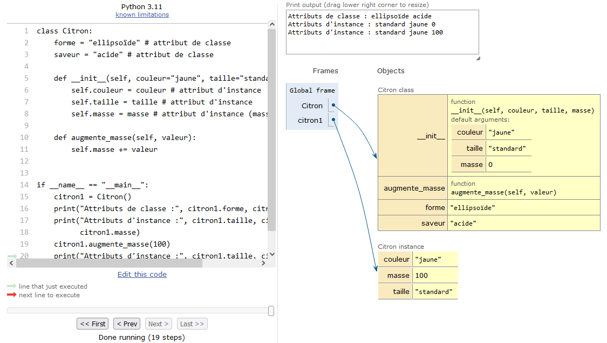
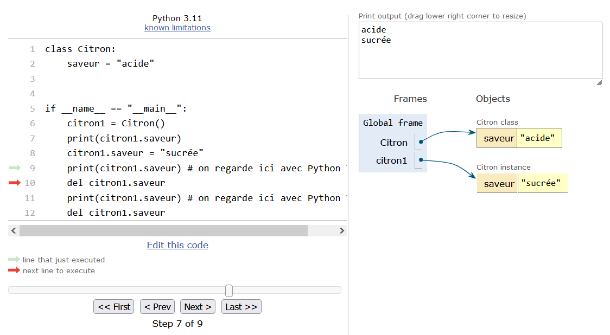
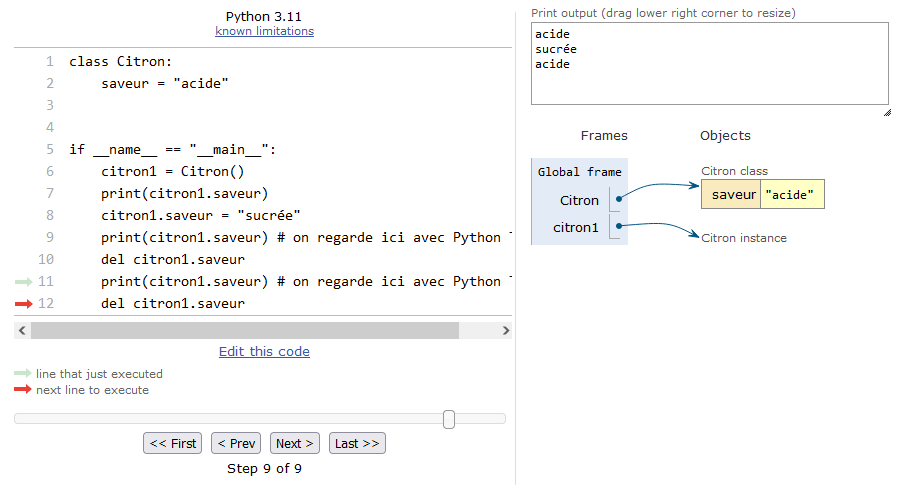

# Avoir plus la classe avec les objets

Dans le chapitre précédent, nous avons vu les bases sur comment créer une classe, les notions d'attributs d'instance et de classe, le fonctionnent d'un constructeur et comment passer des arguments lors de l'instanciation. Nous avons vu qu'une classe pouvait être vue comme un constructeur de conteneur (chaque conteneur construit est une instance), qu'on pouvait y mettre tout un tas de variables ou objets (les attributs d'instance), mais également  nous pouvions définir des méthodes réalisant des actions pour modifier ce que contient l'objet.

Dans le présent chapitre, nous abordons de nouvelles notions qui augmentent la puissance des classes, à savoir le polymorphisme et l'héritage. À la fin du chapitre, nous vous donnerons des bonnes pratiques pour construire vos classes. Mais avant d'aborder ces sujets, nous revenons sur un concept important en Python, à savoir les espaces de noms.

## Espace de noms

La notion d'**espace de noms** est importante lorsqu'on étudie les classes. Nous avons déjà croisé ce concept à plusieurs reprises. D'abord dans le chapitre 13 *Plus sur les fonctions*, puis dans le chapitre 15 *Création de modules*, et maintenant dans ce chapitre. De quoi s'agit-il ?

open-box-def

Dans la [documentation officielle](https://docs.python.org/fr/3/tutorial/classes.html#python-scopes-and-namespaces), un espace de noms est défini comme suit : « *a namespace is a mapping from names to objects* ». Un espace de noms, c'est finalement une correspondance entre des noms et des objets. Un espace de noms peut être vu aussi comme une capsule dans laquelle on trouve des noms d'objets. Par exemple, le programme principal ou une fonction représentent chacun un espace de noms, un module aussi, et bien sûr une classe ou l'instance d'une classe également.

close-box-def

Différents espaces de noms peuvent contenir des objets de même nom sans que cela ne pose de problème. Parce qu'ils sont chacun dans un espace différent, ils peuvent cohabiter sans risque d'écrasement de l'un par l'autre. Par exemple, à chaque fois que l'on appelle une fonction, un espace de noms est créé pour cette fonction. *Python Tutor* nous montre cet espace sous la forme d'une zone dédiée (voir les chapitres 10 et 13 sur les fonctions). Si cette fonction appelle une autre fonction, un nouvel espace est créé, bien distinct de la fonction appelante (ce nouvel espace peut donc contenir un objet de même nom). En définitive, ce qui va compter, c'est de savoir quelles règles Python va utiliser pour chercher dans les différents espaces de noms pour finalement accéder à un objet.

Nous allons dans cette rubrique refaire le point sur ce que l'on a appris dans cet ouvrage sur les espaces de noms en Python, puis se pencher sur les spécificités de ce concept dans les classes.


### Rappel sur la règle LGI

Comme vu dans le chapitre 10 *Fonctions*, la règle LGI peut être résumée ainsi : *Local > Global > Interne*. Lorsque Python rencontre un objet, il utilise cette règle de priorité pour accéder à la valeur de celui-ci. Si on est dans une fonction (ou une méthode), Python va d'abord chercher l'espace de noms *local* à cette fonction. S'il ne trouve pas de nom il va ensuite chercher l'espace de noms du programme principal (ou celui du module), donc des variables *globales* s'y trouvant. S'il ne trouve pas de nom, il va chercher dans les commandes *internes* à Python (on parle des [*Built-in Functions*](https://docs.python.org/fr/3/library/functions.html comme par exemple `print()`) et des [*Built-in Constants*](https://docs.python.org/fr/3/library/constants.html)). Si aucun objet n'est trouvé, Python renvoie une erreur.


### Gestion des noms dans les modules

Les modules représentent aussi un espace de noms en soi. Afin d'illustrer cela, jetons un coup d’œil à ce programme `test_var_module.py` :

```python
import mod

i = 1000000
j = 2

print("Dans prog principal i:", i)
print("Dans prog principal j:", j)

mod.fct()
mod.fct2()

print("Dans prog principal i:", i)
print("Dans prog principal j:", j)
```

Le module `mod.py` contient les instructions suivantes :

```python
def fct():
    i = -27478524
    print("Dans module, i local:", i)


def fct2():
    print("Dans module, j global:", j)


i = 3.14
j = -76
```

L'exécution de `test_var_module.py` donnera :

```bash
$ python ./test_var_module.py
Dans prog principal i: 1000000
Dans prog principal j: 2
Dans module, i local: -27478524
Dans module, j global: -76
Dans prog principal i: 1000000
Dans prog principal j: 2
```

Lignes 3 et 4. On a bien les valeurs de `i` et `j` définies dans le programme principal de `test.py`.

Lignes 9 et 10. Lorsqu'on exécute `mod.fct()`, la valeur de `i` sera celle définie localement dans cette fonction. Lorsqu'on exécute `mod.fct2()`, la valeur de `j` sera celle définie de manière globale dans le module.

Lignes 12 et 13. De retour dans notre programme principal, les variables `i` et `j` existent toujours et n'ont pas été modifiées par l'exécution de fonctions du module `mod.py`.

En résumé, lorsqu'on lance une méthode d'un module, c'est l'espace de noms de celui-ci qui est utilisé. Bien sûr, toutes les variables du programme principal / fonction / méthode appelant ce module sont conservées telles quelles, et on les retrouve intactes lorsque l'exécution de la fonction du module est terminée. Un module a donc son propre espace de noms qui est bien distinct de tout programme principal / fonction / méthode appelant un composant de ce module. Enfin, les variables globales créées dans notre programme principal ne sont pas accessibles dans le module lorsque celui-ci est en exécution.


### Gestion des noms avec les classes

On vient de voir qu'un module avait son propre espace de noms, mais qu'en est-il des classes ? En utilisant les exemples vus depuis le début de ce chapitre, vous avez certainement la réponse. Une classe possède par définition son propre espace de noms qui ne peut être en aucun cas confondu avec celui d'une fonction ou d'un programme principal. Reprenons un exemple simple :

```python
class Citron:
    def __init__(self, saveur="acide", couleur="jaune"):
        self.saveur = saveur
        self.couleur = couleur
        print("Dans __init__(), vous venez de créer un citron:",
              self.affiche_attributs())

    def affiche_attributs(self):
        return f"{self.saveur}, {self.couleur}"


if __name__ == "__main__":
    saveur = "sucrée"
    couleur = "orange"
    print(f"Dans le programme principal: {saveur}, {couleur}")
    citron1 = Citron("très acide", "jaune foncé")
    print("Dans citron1.affiche_attributs():", citron1.affiche_attributs())
    print(f"Dans le programme principal: {saveur}, {couleur}")
```

Lorsqu'on exécutera ce code, on obtiendra :

```
Dans le programme principal: sucrée, orange
Dans __init__(), vous venez de créer un citron: très acide, jaune foncé
Dans citron1.affiche_attributs(): très acide, jaune foncé
Dans le programme principal: sucrée, orange
```

Les deux variables globales `saveur` et `couleur` du programme principal ne peuvent pas être confondues avec les variables d'instance portant le même nom. Au sein de la classe, on utilisera pour récupérer ces dernières `self.saveur` et `self.couleur`. À l'extérieur, on utilisera `instance.saveur` et `instance.couleur`. Il n'y a donc aucun risque de confusion possible avec les variables globales `saveur` et `couleur`, on accède à chaque variable de la classe avec un nom distinct (qu'on soit à l'intérieur ou à l'extérieur de la classe).

Ceci est également vrai pour les méthodes. Si par exemple, on a une méthode avec un certain nom, et une fonction du module principal avec le même nom, regardons ce qui se passe :

```python
class Citron:
    def __init__(self):
        self.couleur = "jaune"
        self.affiche_coucou()
        affiche_coucou()

    def affiche_coucou(self):
        print("Coucou interne !")


def affiche_coucou():
    print("Coucou externe")


if __name__ == "__main__":
    citron1 = Citron()
    citron1.affiche_coucou()
    affiche_coucou()
```

Lorsqu'on va exécuter le code, on obtiendra :

```
Coucou interne !
Coucou externe
Coucou interne !
Coucou externe
```

À nouveau, il n'y a pas de conflit possible pour l'utilisation d'une méthode ou d'une fonction avec le même nom. À l'intérieur de la classe on utilise `self.affiche_coucou()` pour la méthode et `affiche_coucou()` pour la fonction. À l'extérieur de la classe, on utilise `instance.affiche_coucou()` pour la méthode et `affiche_coucou()` pour la fonction.

Dans cette rubrique, nous venons de voir une propriété des classes extrêmement puissante : **une classe crée automatiquement son propre espace de noms**. Cela permet d'encapsuler à l'intérieur tous les attributs et méthodes dont on a besoin, sans avoir aucun risque de conflit de nom avec l'extérieur (variables locales, globales ou provenant de modules). L'utilisation de classes évitera ainsi l'utilisation de variables globales qui, on l'a vu aux chapitres 10 et 13 sur les fonctions, sont à proscrire absolument. Tout cela concourt à rendre le code plus lisible.

Dans le chapitre 25 *Fenêtres graphiques et Tkinter* (en ligne), vous verrez une démonstration de l'utilité de tout encapsuler dans une classe afin d'éviter les variables globales.

### Gestion des noms entre les attributs de classe et d'instance

Si vous lisez cette rubrique sur l'espace de noms sans avoir lu ce chapitre depuis le début, nous vous conseillons vivement de lire attentivement la rubrique *Différence entre les attributs de classe et d'instance*. La chose importante à retenir sur cette question est la suivante : si un attribut de classe et un attribut d'instance ont le même nom, c'est l'attribut d'instance qui est **prioritaire**.

open-box-more

Il existe d'autres règles concernant les espace de noms. L'une d'elle, que vous pourriez rencontrer, concerne la gestion des noms avec des fonctions imbriquées. Et oui, Python autorise cela ! Par exemple :

```python
def fonction1():
    [...]

    def fct_dans_fonction1():
        [...]
```

Là encore, il existe certaines règles de priorités d'accès aux objets spécifiques à ce genre de cas, avec l'apparition d'un nouveau mot-clé nommé `nonlocal`. Toutefois ces aspects vont au-delà du présent ouvrage. Pour plus d'informations sur les fonctions imbriquées et la directive `nonlocal`, vous pouvez consulter la [documentation officielle](https://docs.python.org/3/tutorial/classes.html#python-scopes-and-namespaces).

D'autres subtilités concerneront la gestion des noms en cas de définition d'une nouvelle classe héritant d'une classe mère. Ces aspects sont présentés dans la rubrique *Héritage* de ce chapitre.

close-box-more

## Polymorphisme

Nous allons voir maintenant des propriétés très importantes des classes en Python, le polymorphisme dans cette rubrique et l'héritage dans la suivante. Ces deux concepts donnent un surplus de puissance à la POO par rapport à la programmation classique.

### Principe

Commençons par le polymorphisme. Dans la vie, celui-ci évoque la capacité à prendre plusieurs apparences, qu'en est-il en programmation ?

open-box-def

En programmation, le polymorphisme est la capacité d'une fonction (ou méthode) à se comporter différemment en fonction de l'objet qui lui est passé. Une fonction donnée peut donc avoir plusieurs définitions.

close-box-def

Prenons un exemple concret de polymorphisme : la fonction Python `sorted()` va trier par ordre ASCII si l'argument est une chaîne de caractères, et elle va trier par ordre croissant lorsque l'argument est une liste d'entiers :

```python
>>> sorted("citron")
['c', 'i', 'n', 'o', 'r', 't']
>>> sorted([1, -67, 42, 0, 81])
[-67, 0, 1, 42, 81]
```

Le polymorphisme est intimement lié au concept de *redéfinition des opérateurs* que nous avons déjà croisé à plusieurs reprises dans ce livre.

open-box-def

La redéfinition des opérateurs est la capacité à redéfinir le comportement d'un opérateur en fonction des opérandes utilisées (on rappelle dans l'expression `1 + 1`, `+` est l'opérateur d'addition et les deux `1` sont les opérandes).

close-box-def

Un exemple classique de redéfinition des opérateurs concerne l'opérateur `+`. Si les opérandes sont de type numérique, il fait une addition, si elles sont des chaînes de caractère il fait une concaténation :

```python
>>> 2 + 2
4
>>> "ti" + "ti"
'titi'
```

Nous verrons dans la rubrique suivante sur *l'héritage* qu'il est également possible de redéfinir des méthodes d'une classe, c'est-à-dire leur donner une nouvelle définition.

### Méthodes magiques ou dunder methods

Comment Python permet-il ces prouesses que sont le polymorphisme et la redéfinition des opérateurs ? Et bien, il utilise des méthodes dites *magiques*.

open-box-def

Une méthode magique (*magic method*) est une méthode spéciale dont le nom est entouré de double *underscores*. Par exemple, la méthode `.__init__()` est une méthode magique. Ces méthodes sont, la plupart du temps, destinées au fonctionnement interne de la classe. Nombre d'entre elles sont destinées à changer le comportement de fonctions ou opérateurs internes à Python avec les instances d'une classe que l'on a créée. On parle aussi de *dunder method*, le mot *dunder* signifiant littéralement *double underscore*.

close-box-def

Nous allons prendre un exemple concret. Imaginons que suite à la création d'une classe, nous souhaitions que Python affiche un message personnalisé lors de l'utilisation de la fonction `print()` avec une instance de cette classe. La méthode magique qui permettra cela est nommée `.__str__()` : elle redéfinit le comportement d'une instance avec la fonction `print()`.

```python
class CitronBasique:
    def __init__(self, couleur="jaune", taille="standard"):
        self.couleur = "jaune"
        self.taille = "standard"


class CitronCool:
    def __init__(self, couleur="jaune", taille="standard"):
        self.couleur = couleur
        self.taille = taille

    def __str__(self):
        return (f"Votre citron est de couleur {self.couleur} "
                f"et de taille {self.taille}")


if __name__ == "__main__":
    citron1 = CitronBasique()
    print(citron1)
    citron2 = CitronCool("jaune foncée", "minuscule")
    print(citron2)
```

Lignes 1 à 4. Création d'une classe `CitronBasique` dans laquelle il n'y a qu'un constructeur.

Lignes 7 à 14. Création d'une classe `CitronCool` où nous avons ajouté la nouvelle méthode `.__str__()`. Cette dernière renvoie une chaîne de caractères contenant la description de l'instance.

Lignes 18 à 21. On crée une instance de chaque classe, et on utilise la fonction `print()` pour voir leur contenu.

L'exécution de ce code affichera la sortie suivante :

```python
<__main__.CitronBasique object at 0x7ffe23e717b8>
Votre citron est de couleur jaune foncée et de taille minuscule 8-)
```

L'utilisation de la fonction `print()` sur l'instance `citron1` construite à partir de la classe `CitronBasique` affiche le message abscons que nous avons déjà croisé. Par contre, pour l'instance `citron2` de la classe `CitronCool`, le texte correspond à celui retourné par la méthode magique `.__str__()`. Nous avons donc redéfini comment la fonction `print()` se comportait avec une instance de la classe `CitronCool`. Notez que `str(citron2)` donnerait le même message que `print(citron2)`.

Ce mécanisme pourra être reproduit avec de très nombreux opérateurs et fonctions de bases de Python. En effet, il existe une multitude de méthodes magiques, en voici quelques unes :

- `.__repr__()` : redéfinit le message obtenu lorsqu'on tape le nom de l'instance dans l'interpréteur ;
- `.__add__()` : redéfinit le comportement de l'opérateur `+` ;
- `.__mul__()` : redéfinit le comportement de l'opérateur `*` ;
- `.__del__()` : redéfinit le comportement de la fonction `del`.

Si on conçoit une classe produisant des objets séquentiels (comme des listes ou des *tuples*), il existe des méthodes magiques telles que :

- `.__len__()` : redéfinit le comportement de la fonction `len()` ;
- `.__getitem__()` : redéfinit le comportement pour récupérer un élément ;
- `.__getslice__()` : redéfinit le comportement avec les tranches.

Certaines méthodes magiques font des choses assez impressionnantes. Par exemple, la méthode `.__call__()` crée des instances que l'on peut appeler comme des fonctions ! Dans cet exemple, nous allons vous montrer que l'on peut ainsi créer un moyen inattendu pour mettre à jour des attributs d'instance :

```python
class Citronnier:
    def __init__(self, nb_citrons, age):
        self.nb_citrons, self.age = nb_citrons, age

    def __call__(self, nb_citrons, age):
        self.nb_citrons, self.age = nb_citrons, age

    def __str__(self):
        return (f"Ce citronnier a {self.age} ans "
                f"et {self.nb_citrons} citrons")


if __name__ == "__main__":
    citronnier1 = Citronnier(10, 3)
    print(citronnier1)
    citronnier1(30, 4)
    print(citronnier1)
```

À la ligne 16, on utilise une notation `instance(arg1, arg2)`, ce qui va automatiquement appeler la méthode magique `.__call__()` qui mettra à jour les deux attributs d'instance `nbcitrons` et `age` (lignes 5 et 6). Ce code affichera la sortie suivante :

```text
Ce citronnier a 3 ans et 10 citrons
Ce citronnier a 4 ans et 30 citrons
```

open-box-more

- Nous vous avons montré l'idée qu'il y avait derrière le polymorphisme, et avec cela vous avez assez pour vous jeter à l'eau et commencer à construire vos propres classes. L'apprentissage de toutes les méthodes magiques va bien sûr au-delà du présent ouvrage. Toutefois, si vous souhaitez aller plus loin, nous vous conseillons la [page de Rafe Kettler](https://rszalski.github.io/magicmethods) qui est particulièrement complète et très bien faite.

close-box-more

## Héritage

### Prise en main

L'héritage peut évoquer la capacité qu'ont nos parents à nous transmettre certains traits physiques ou de caractère (ne dit-on pas, j'ai hérité ceci ou cela de ma mère ou de mon père ?). Qu'en est-il en programmation ?

open-box-def

En programmation, l'héritage est la capacité d'une classe d'hériter des propriétés d'une classe pré-existante. On parle de classe mère et de classe fille. En Python, l'héritage peut être multiple lorsqu'une classe fille hérite de plusieurs classes mères.

close-box-def

En Python, lorsque l'on veut créer une classe héritant d'une autre classe, on ajoutera après le nom de la classe fille le nom de la ou des classe(s) mère(s) entre parenthèses :

```python
class Mere1:
    # contenu de la classe mère 1


class Mere2:
    # contenu de la classe mère 2


class Fille1(Mere1):
    # contenu de la classe fille 1


class Fille2(Mere1, Mere2):
    # contenu de la classe fille 2
```

Dans cet exemple, la classe `Fille1` hérite de la classe `Mere1` et la classe `Fille2` hérite des deux classes `Mere1` et `Mere2`. Dans le cas de la classe `Fille2`, on parle d'héritage multiple. Voyons maintenant un exemple concret :

```python
class Mere:
    def bonjour(self):
        return "Vous avez le bonjour de la classe mère !"


class Fille(Mere):
    def salut(self):
        return "Un salut de la classe fille !"


if __name__ == "__main__":
    fille = Fille()
    print(fille.salut())
    print(fille.bonjour())
```

Lignes 1 à 3. On définit une classe `Mere` avec une méthode `.bonjour()`.

Lignes 6 à 8. On définit une classe `Fille` qui hérite de la classe `Mere`. Cette classe fille contient une nouvelle méthode `.salut()`.

Lignes 12 à 14. Après instanciation de la classe `Fille`, on utilise la méthode `.salut()`, puis la méthode `.bonjour()` héritée de la classe mère.

Ce code affiche la sortie suivante :

```
Un salut de la classe fille !
Vous avez le bonjour de la classe mère !
```

Nous commençons à entrevoir la puissance de l'héritage. Si on possède une classe avec de nombreuses méthodes et que l'on souhaite en ajouter de nouvelles, il suffit de créer une classe fille héritant d'une classe mère.

En revenant à notre exemple, une instance de la classe `Fille` sera automatiquement une instance de la classe `Mere`. Regardons dans l'interpréteur :

```python
>>> fille = Fille()
>>> isinstance(fille, Fille)
True
>>> isinstance(fille, Mere)
True
```

Si une méthode de la classe fille possède le même nom que celle de la classe mère, c'est la première qui prend la priorité. Dans ce cas, on dit que la méthode est *redéfinie* (en anglais on parle de *method overriding*), tout comme on parlait de *redéfinition des opérateurs* un peu plus haut. C'est le même mécanisme, car la redéfinition des opérateurs revient finalement à redéfinir une méthode magique (comme par exemple la méthode `.__add__()` pour l'opérateur `+`).

Voyons un exemple :

```python
class Mere:
    def bonjour(self):
        return "Vous avez le bonjour de la classe mère !"


class Fille2(Mere):
    def bonjour(self):
        return "Vous avez le bonjour de la classe fille !"


if __name__ == "__main__":
    fille = Fille2()
    print(fille.bonjour())
```

Ce code va afficher `Vous avez le bonjour de la classe fille !`. La méthode `.bonjour()` de la classe fille a donc pris la priorité sur celle de la classe mère. Ce comportement provient de la gestion des espaces de noms par Python, il est traité en détail dans la rubrique suivante.

open-box-rem

À ce point, nous pouvons faire une note de sémantique importante. Python utilise le mécanisme de *redéfinition de méthode* (*method overriding*), c'est-à-dire qu'on redéfinit une méthode héritée d'une classe mère. Il ne faut pas confondre cela avec la *surcharge de fonction* (*function overloading*) qui désigne le fait d'avoir plusieurs définitions d'une fonction selon le nombres d'arguments et/ou leur type (la surcharge n'est pas supportée par Python contrairement à d'autres langages orientés objet).

close-box-rem


### Ordre de résolution des noms

Vous l'avez compris, il y aura un ordre pour la résolution des noms d'attributs ou de méthodes en fonction du ou des héritage(s) de notre classe (à nouveau, cela provient de la manière dont Python gère les espaces de noms). Prenons l'exemple d'une classe déclarée comme suit `class Fille(Mere1, Mere2):`. Si on invoque un attribut ou une méthode sur une instance de cette classe, Python cherchera d'abord dans la classe `Fille`. S'il ne trouve pas, il cherchera ensuite dans la première classe mère (`Mere1` dans notre exemple). S'il ne trouve pas, il cherchera dans les ancêtres de cette première mère (si elle en a), et ce en remontant la filiation (d'abord la grand-mère, puis l'arrière grand-mère, etc). S'il n'a toujours pas trouvé, il cherchera dans la deuxième classe mère (`Mere2` dans notre exemple) puis dans tous ses ancêtres. Et ainsi de suite, s'il y a plus de deux classes mères. Bien sûr, si aucun attribut ou méthode n'est trouvé, Python renverra une erreur.

Il est en général possible d'avoir des informations sur l'ordre de résolution des méthodes d'une classe en évoquant la commande `help()` sur celle-ci ou une de ses instances. Par exemple, nous verrons dans le chapitre suivant le module *Tkinter*, imaginons que nous créions une instance de la classe principale du module *Tkinter* nommée `Tk` :

```python
>>> import tkinter as tk
>>> racine = tk.Tk()
```

En invoquant la commande `help(racine)`, l'interpréteur nous montre :

```python
Help on class Tk in module tkinter:

class Tk(Misc, Wm)
 |  Toplevel widget of Tk which represents mostly the main window
 |  of an application. It has an associated Tcl interpreter.
 |
 |  Method resolution order:
 |      Tk
 |      Misc
 |      Wm
 |      builtins.object
[...]
```

On voit tout de suite que la classe `Tk` hérite de deux autres classes `Misc` et `Wm`. Ensuite, le *help* indique l'ordre de résolution des méthodes : d'abord la classe `Tk` elle-même, ensuite ses deux mères `Misc` puis `Wm`, et enfin une dernière classe nommée `builtins.object` dont nous allons voir la signification maintenant.

open-box-rem

En Python, il existe une classe interne nommée `object` qui est en quelque sorte la classe ancêtre de tous les objets. Toutes les classes héritent de `object`.

close-box-rem

Pour vous en convaincre, nous pouvons recréer une classe vide :

```python
>>> class Citron:
...     pass
```

Puis ensuite regarder l'aide sur l'une de ses instances :

```python
Help on class Citron in module __main__:

class Citron(builtins.object)
 |  Data descriptors defined here:
 |
 |  __dict__
 |      dictionary for instance variables (if defined)
[...]
```

L'aide nous montre que `Citron` a hérité de `builtins.object` bien que nous ne l'ayons pas déclaré explicitement. Cela se fait donc de manière implicite.

open-box-rem

Le module *builtins* possède toutes les fonctions internes à Python. Il est donc pratique pour avoir une liste de toutes ces fonctions internes en un coup d'œil. Regardons cela avec les deux instructions `import builtins` puis `dir(builtins)` :

```python
>>> import builtins
>>> dir(builtins)
['ArithmeticError', 'AssertionError', 'AttributeError', [...]
'ascii', 'bin', 'bool', 'bytearray', 'bytes', 'callable', 'chr', [...]
'list', 'locals', 'map', 'max', 'memoryview', 'min', 'next', 'object', [...]
'str', 'sum', 'super', 'tuple', 'type', 'vars', 'zip']
```

Au début, on y trouve les exceptions commençant par une lettre majuscule (voir le chapitre 26 *Remarques complémentaires* (en ligne) pour la définition d'une exception), puis les fonctions Python de base tout en minuscule. On retrouve par exemple `list` ou `str`, mais il y a aussi `object`. Toutefois ces fonctions étant chargées de base dans l'interpréteur, l'importation de `builtins` n'est pas obligatoire : par exemple `list` revient au même que `builtins.list`, ou `object` revient au même que `builtins.object`.

close-box-rem

En résumé, la syntaxe `class Citron:` sera équivalente à  
`class Citron(builtins.object):`  
ou à `class Citron(object):`.

Ainsi, même si on crée une classe `Citron` vide (contenant seulement une commande `pass`), elle possède déjà tout une panoplie de méthodes héritées de la classe `object`. Regardez l'exemple suivant :

```python
>>> class Citron:
...     pass
...
>>> c = Citron()
>>> dir(c)
['__class__', '__delattr__', '__dict__', '__dir__', '__doc__', '__eq__',
'__format__', '__ge__', '__getattribute__', '__gt__', '__hash__',
'__init__', '__le__', '__lt__', '__module__', '__ne__', '__new__',
'__reduce__', '__reduce_ex__', '__repr__', '__setattr__', '__sizeof__',
'__str__', '__subclasshook__', '__weakref__']
>>> o = object()
>>> dir(o)
['__class__', '__delattr__', '__dir__', '__doc__', '__eq__', '__format__',
'__ge__', '__getattribute__', '__gt__', '__hash__', '__init__', '__le__',
'__lt__', '__ne__', '__new__', '__reduce__', '__reduce_ex__', '__repr__',
'__setattr__', '__sizeof__', '__str__', '__subclasshook__']
```

La quasi-totalité des attributs / méthodes de base de la classe `Citron` sont donc hérités de la classe *object*. Par exemple, lorsqu'on instancie un objet Citron `c = Citron()`, Python utilisera la méthode `.__init__()` héritée de la classe *object* (puisque nous ne l'avons pas définie dans la classe `Citron`).

### Un exemple concret d'héritage

Nous allons maintenant prendre un exemple un peu plus conséquent pour illustrer la puissance de l'héritage en programmation. D'abord quelques mots à propos de la conception. Imaginons que nous souhaitions créer plusieurs classes correspondant à nos fruits favoris, par exemple le citron (comme par hasard !), l'orange, le kaki, etc. Chaque fruit a ses propres particularités, mais il y a aussi de nombreux points communs. Nous pourrions donc concevoir une classe `Fruit` permettant, par exemple, d'instancier un fruit et ajouter des méthodes d'affichage commune à n'importe quel fruit, et ajouter (ou toute autre méthode) pouvant être utilisée pour n'importe quel fruit. Nous pourrions alors créer des classes comme `Citron`, `Orange`, etc., héritant de la classe `Fruit` et ainsi nous économiser des lignes de code identiques à ajouter pour chaque fruit. Regardons l'exemple suivant que nous avons garni de `print()` pour bien comprendre ce qui se passe :

```python
class Fruit:
    def __init__(self, taille=None, masse=None, saveur=None, forme=None):
        print("(2) Je suis dans le constructeur de la classe Fruit")
        self.taille = taille
        self.masse = masse
        self.saveur = saveur
        self.forme = forme
        print("Je viens de créer self.taille, self.masse, self.saveur "
              "et self.forme")

    def affiche_conseil(self, type_fruit, conseil):
        print("(2) Je suis dans la méthode .affiche_conseil() de la "
              "classe Fruit\n")
        return (f"Instance {type_fruit}\n"
                f"taille: {self.taille}, masse: {self.masse}\n"
                f"saveur: {self.saveur}, forme: {self.forme}\n"
                f"conseil: {conseil}\n")


class Citron(Fruit):
    def __init__(self, taille=None, masse=None, saveur=None, forme=None):
        print("(1) Je rentre dans le constructeur de Citron, et je vais "
              "appeler\n"
              "le constructeur de la classe mère Fruit !")
        Fruit.__init__(self, taille, masse, saveur, forme)
        print("(3) J'ai fini dans le constructeur de Citron, "
              "les attributs sont :\n"
              f"self.taille: {self.taille}, self.masse: {self.masse}\n"
              f"self.saveur: {self.saveur}, self.forme: {self.forme}\n")

    def __str__(self):
        print("(1) Je rentre dans la méthode .__str__() de la classe "
              "Citron")
        print("Je vais lancer la méthode .affiche_conseil() héritée "
              "de la classe Fruit")
        return self.affiche_conseil("Citron", "Bon en tarte :-p !")


if __name__ == "__main__":
    # On crée un citron.
    citron1 = Citron(taille="petite", saveur="acide", 
                     forme="ellipsoïde", masse=50)
    print(citron1)
```

Lignes 1 à 9. On crée la classe `Fruit` avec son constructeur qui initialisera tous les attributs d'instance décrivant le fruit.

Lignes 11 à 17. Création d'une méthode `.affiche_conseil()` qui retourne une chaîne contenant le type de fruit, les attributs d'instance du fruit, et un conseil de consommation.

Lignes 20 à 29. Création de la classe `Citron` qui hérite de la classe `Fruit`. Le constructeur de `Citron` prend les mêmes arguments que ceux du constructeur de `Fruit`. La ligne 24 est une étape importante que nous n'avons encore jamais vue : l'instruction `Fruit.__init__()` est un appel au constructeur de la classe mère (cf. explications plus bas). Notez bien que le premier argument passé au constructeur de la classe mère sera systématiquement l'instance en cours `self`. Le `print()` en lignes 26-29 illustre qu'après l'appel du constructeur de la classe mère  tous les attributs d'instance (`self.taille`, `self.poids`, etc.) ont bel et bien été créés.

Lignes 31 à 36. On définit la méthode `.__str__()` qui va modifier le comportement de notre classe avec `print()`. Celle-ci fait également appel à une méthode hértitée de la classe mère nommée `.affiche_conseil()`. Comme on a l'a héritée, elle est directement accessible avec un `self.méthode()` (et de l'extérieur ce serait `instance.méthode()`).

Lignes 39 à 43. Dans le programme principal, on instancie un objet `Citron`, puis on utilise `print()` sur l'instance.

L'exécution de ce code affichera la sortie suivante :

```
(1) Je rentre dans le constructeur de Citron, et je vais appeler
le constructeur de la classe mère Fruit !
(2) Je suis dans le constructeur de la classe Fruit
Je viens de créer self.taille, self.masse, self.saveur et self.forme
(3) J'ai fini dans le constructeur de Citron, les attributs sont:
self.taille: petite, self.masse: 50
self.saveur: acide, self.forme: ellipsoïde

(1) Je rentre dans la méthode .__str__() de la classe Citron
Je vais lancer la méthode .affiche_conseil() héritée de la classe Fruit
(2) Je suis dans la méthode .affiche_conseil() de la classe Fruit

Instance Citron
taille: petite, masse: 50
saveur: acide, forme: ellipsoïde
conseil: Bon en tarte :-p !
```

Prenez bien le temps de suivre ce code pas à pas pour bien en comprendre toutes les étapes.

Vous pourrez vous poser la question « *Pourquoi utilise-t-on en ligne 24 la syntaxe* `Fruit.__init__()` *?* ». Cette syntaxe est souvent utilisée lorsqu'une classe hérite d'une autre classe pour faire appel au constructeur de la classe mère. La raison est que nous souhaitons appeler une méthode de la classe mère qui a le même nom qu'une méthode de la classe fille. Dans ce cas, si on utilisait `self.__init__()`, cela correspondrait à la fonction de notre classe fille Citron. En mettant systématiquement une syntaxe  
`ClasseMere.__init__()` on indique sans ambiguïté qu'on appelle le constructeur de la classe mère, en mettant explicitement son nom. Ce mécanisme est assez souvent utilisé dans le module *Tkinter* (voir le chapitre 25 *Fenêtres graphiques et Tkinter* (en ligne)) pour la construction d'interfaces graphiques, nous en verrons de nombreux exemples.

open-box-rem

Si vous utilisez des ressources externes, il se peut que vous rencontriez une syntaxe `super().__init__()`. La fonction Python interne `super()` appelle automatiquement la classe mère sans que vous ayez à donner son nom. Même si cela peut paraître pratique, nous vous conseillons d'utiliser dans un premier temps la syntaxe  
`ClasseMere.__init__()` qui est selon nous plus lisible (on voit explicitement le nom de la classe employée, même s'il y a plusieurs classes mères).

close-box-rem

Ce mécanisme n'est pas obligatoirement utilisé, mais il est très utile lorsqu'une classe fille a besoin d'initialiser des attributs définis dans la classe mère. On le croise donc souvent car :

- Cela donne la garantie que toutes les variables de la classe mère sont bien initialisées. On réduit ainsi les risques de dysfonctionnement des méthodes héritées de la classe mère.
- Finalement, autant ré-utiliser les « moulinettes » de la classe mère, c'est justement à ça que sert l'héritage ! Au final, on écrit moins de lignes de code.

open-box-adv

Pour les deux raisons citées ci-dessus, nous vous conseillons de systématiquement utiliser le constructeur de la classe mère lors de l'instanciation.

close-box-adv

Vous avez à présent bien compris le fonctionnement du mécanisme de l'héritage. Dans notre exemple, nous pourrions créer de nouveaux fruits avec un minimum d'effort. Ceux-ci pourraient hériter de la classe mère `Fruit` à nouveau, et nous n'aurions pas à réécrire les mêmes méthodes pour chaque fruit, simplement à les appeler. Par exemple :

```python
class Kaki(Fruit):
    def __init__(self, taille=None, masse=None, saveur=None, forme=None):
        Fruit.__init__(self, taille, masse, saveur, forme)

    def __str__(self):
        return Fruit.affiche_conseil(self, "Kaki",
                                     "Bon à manger cru, miam !")


class Orange(Fruit):
    def __init__(self, taille=None, masse=None, saveur=None, forme=None):
        Fruit.__init__(self, taille, masse, saveur, forme)

    def __str__(self):
        return Fruit.affiche_conseil(self, "Orange", "Trop bon en jus !")
```

Cet exemple illuste la puissance de l'héritage et du polymorphisme et la facilité avec laquelle on les utilise en Python. Pour chaque fruit, on utilise la méthode `.affiche_conseil()` définie dans la classe mère sans avoir à la réécrire. Bien sûr cet exemple reste simpliste et n'est qu'une « mise en bouche ». Vous verrez des exemples concrets de la puissance de l'héritage dans le chapitre 25 *Fenêtres graphiques et Tkinter* (en ligne) ainsi que dans les exercices du présent chapitre. Avec le module *Tkinter*, chaque objet graphique (bouton, zone de texte, etc.) est en fait une classe. On peut ainsi créer de nouvelles classes héritant des classes *Tkinter* afin de personnaliser chaque objet graphique.

## Composition

Un autre concept puissant rencontré en POO est la composition. 

open-box-def

La composition désigne le fait qu'une classe peut contenir des instances provenant d'autres classes. On parle parfois de classe *Composite* contenant des instances d'une classe *Component* (qu'on pourrait traduire par *élément*).

close-box-def

Pour vous illustrer cela, nous allons prendre un exemple sur notre fruit préféré, le citron. un citron (classe *Composite*) contient de la pulpe (classe *Component*). Voilà comment nous pourrions l'implémenter :

```python
class Pulpe:
    def __init__(self, quantite_jus):
        self.quantite_jus = quantite_jus # En cL.

    def __str__(self):
        return f"Cette pulpe contient {self.quantite_jus} cL de jus"


class Citron:
    def __init__(self, pulpe=None):
        self.pulpe = pulpe

    def presse_citron(self):
        if self.pulpe:
            print(f"Le pressage de la pulpe délivre "
                  f"{self.pulpe.quantite_jus} cL de jus")
            self.pulpe = None
        else:
            print("Il n'y a plus rien à presser dans votre citron !")

    def __str__(self):
        if self.pulpe:
            return f"Votre citron contient {self.pulpe.quantite_jus} cL de jus"
        else:
            return "Ce citron ne contient pas de pulpe"


if __name__ == "__main__":
    pulpe = Pulpe(10)
    print(pulpe)
    citron1 = Citron()
    print(citron1)
    print()
    citron2 = Citron(pulpe)
    print(citron2.pulpe)
    print(citron2)
    print()
    citron2.presse_citron()
    citron2.presse_citron()
    print(citron2)
```

**Lignes 1 à 6**. On crée une classe `Pulpe` qui prend en argument à l'instanciation une quantité de jus (en cL) qu'elle peut délivrer si on la presse.

**Lignes 9 à 25**. On crée une classe `Citron` qui prend un objet Pulpe à l'instanciation. Si aucun objet est passé, on affecte `None`. Cette classe contient une méthode `.presse_citron()` qui pressera la pulpe pour délivrer le jus de citron. Une fois le pressage effectué, il n'y aura plus de jus à délivrer.

La sortie sera la suivante :

```text
Cette pulpe contient 10 cL de jus
Ce citron ne contient pas de pulpe

Cette pulpe contient 10 cL de jus
Votre citron contient 10 cL de jus

Le pressage de la pulpe délivre 10 cL de jus
Il n'y a plus rien à presser dans votre citron !
Ce citron ne contient pas de pulpe
```

Dans cet exemple, la classe `Citron` a utilisé une instance de la classe `Pulpe` pour fonctionner. Un avantage de la composition est qu'on pourrait réutiliser cette  classe `Pulpe` dans une classe `Orange` ou `Pamplemousse`. Par ailleurs, si on change des détails dans la classe `Pulpe`, cela affectera peu la classe `Citron` à partir du moment où on garde l'attribut `.quantite_jus`.

De manière générale, la composition est considérée comme plus flexible que l'héritage car les classes *Composite* et *Component* sont peu couplées. Le changement de l'une d'entre elle aura peu d'effet sur l'autre. Au contraire, pour l'héritage le changement d'une classe mère peut avoir des répercussions importantes pour les classes filles. Toutefois, dans certains cas l'héritage peut s'avérer plus naturel. Nous vous parlions en introduction de ce chapitre de l'art pour concevoir des classes interagissant harmonieusement entre elles. Et bien nous y sommes !

Si on a deux classes `A` et `B`, la relation entre elles dans l'héritage sera de type `A` **is a** `B`. Dans la composition, ce sera plutôt `A` **has a** `B`. Cela peut vous servir de piste dans la conception des relations entre vos classes. A-t-il plus de sens d'y avoir une relation **is a** ou bien **has a** ? Dans le premier cas vous irez plutôt vers l'héritage, alors que dans le deuxième plutôt vers la composition. Bien sûr, il faudra vous entraîner sur des cas concrets pour acquérir l'expérience qui vous mènera aux bons choix. A la fin de ce chapitre, nous vous présentons un exercice pour vous entraîner dans un premier temps à la composition.

open-box-more

Nous vous conseillons ce très bon article sur le site *RealPython* qui explique de manière approfondie la problématique entre [la composition et l'héritage](https://realpython.com/inheritance-composition-python/).

close-box-more

open-box-more

À ce stade, nous pouvons émettre deux remarques :

Le polymorphisme, l'héritage et la composition  donnent toute la puissance à la POO. Toutefois, concevoir ses classes sur un projet, surtout au début de celui-ci, n'est pas chose aisée. Nous vous conseillons de lire d'autres ressources et de vous entraîner sur un maximum d'exemples.
Si vous souhaitez allez plus loin sur la POO, nous vous conseillons de lire des ressources supplémentaires. En langue française, vous trouverez les livres de [Gérard Swinnen](https://inforef.be/swi/python.htm), [Bob Cordeau et Laurent Pointal](https://perso.limsi.fr/pointal/python:courspython3), et [Vincent Legoff](https://openclassrooms.com/fr/courses/235344-apprenez-a-programmer-en-python).

close-box-more

## Différence entre les attributs de classe et d'instance

Dans cette rubrique, nous souhaitons éclairer le rôle des attributs de classe et des attributs d'instance, et comment ils sont gérés par Python.

On a vu dans le chapitre précédent comment créer un attribut de classe, il suffit de créer une variable au sein de la classe (en dehors de toute méthode). En général, les attributs de classe contiennent des propriétés générales à la classe puisqu'ils vont  prendre la même valeur quelle que soit l'instance.

Au contraire, les attributs d'instance sont spécifiques à chaque instance. Pour en créer, on a vu qu'il suffisait de les initialiser dans la méthode `.__init__()` en utilisant une syntaxe `self.nouvel_attribut = valeur`. On a vu aussi dans la rubrique *Ajout d'un attribut d'instance* que l'on pouvait ajouter un attribut d'instance de l'extérieur avec une syntaxe `instance.nouvel_attribut = valeur` .

Bien que les deux types d'attributs soient fondamentalement différents au niveau de leur finalité, il existe des similitudes lorsqu'on veut accéder à leur valeur. Le code suivant illustre cela :

```python
class Citron:
    forme = "ellipsoïde" # attribut de classe
	saveur = "acide" # attribut de classe

    def __init__(self, couleur="jaune", taille="standard", masse=0):
        self.couleur = couleur # attribut d'instance
        self.taille = taille # attribut d'instance
        self.masse = masse # attribut d'instance (masse en gramme)

    def augmente_masse(self, valeur):
        self.masse += valeur


if __name__ == "__main__":
    citron1 = Citron()
    print("Attributs de classe :", citron1.forme, citron1.saveur)
    print("Attributs d'instance :", citron1.taille, citron1.couleur,
          citron1.masse)
    citron1.augmente_masse(100)
    print("Attributs d'instance :", citron1.taille, citron1.couleur,
          citron1.masse)
```

Lignes 2 et 3. Nous créons deux variables de classe qui seront communes à toutes les instances (disons qu'un citron sera toujours ellipsoïde et acide !).

Lignes 6 à 8. Nous créons trois variables d'instance qui seront spécifiques à chaque instance (disons que la taille, la couleur et la masse d'un citron peuvent varier !), avec des valeurs par défaut.

Lignes 10 et 11. On crée une nouvelle méthode `.augmente_masse()` qui augmente l'attribut d'instance `.masse`.

Ligne 14 à 21. Dans le programme principal, on instancie la classe `Citron` sans passer d'argument (les valeurs par défaut `"jaune"`, `"standard"` et `0` seront donc prises), puis on imprime les attributs.

La figure @fig:classe_var_instance montre l'état des variables après avoir exécuté ce code grâce au site [*Python Tutor*](http://www.pythontutor.com).

{ #fig:classe_var_instance width=90% }

*Python Tutor* montre bien la différence entre les variables de classe `forme` et `saveur` qui apparaissent directement dans les attributs de la classe `Citron` lors de sa définition et les trois variables d'instance `couleur`, `taille` et `masse` qui sont liées à l'instance `citron1`. Pour autant, on voit dans la dernière instruction `print()` qu'on peut accéder de la même manière aux variables de classe ou d'instance, lorsqu'on est à l'extérieur, avec une syntaxe `instance.attribut`.

Au sein des méthodes, on accède également de la même manière aux attributs de classe ou d'instance, avec une syntaxe `self.attribut` :

```python
class Citron:
    saveur = "acide" # attribut de classe

    def __init__(self, couleur="jaune"):
        self.couleur = couleur # attribut d'instance

    def affiche_attributs(self):
        print(f"attribut de classe: {self.saveur}")
        print(f"attribut d'instance: {self.couleur}")


if __name__ == "__main__":
    citron1 = Citron()
    citron1.affiche_attributs()
```

Ce code va afficher la phrase :

```text
attribut de classe: acide
attribut d'instance: jaune
```

En résumé, qu'on ait des attributs de classe ou d'instance, on peut accéder à eux de l'extérieur par `instance.attribut` et de l'intérieur par `self.attribut`.

Qu'en est-il de la manière de modifier ces deux types d'attributs ? Les attributs d'instance peuvent se modifier sans problème de l'extérieur avec une syntaxe `instance.attribut_d_instance = nouvelle_valeur` et de l'intérieur avec une syntaxe `self.attribut_d_instance = nouvelle_valeur`. Ce n'est pas du tout le cas avec les attributs de classe.

open-box-warn

Les attributs de classe ne peuvent pas être modifiés ni à l'extérieur d'une classe via une syntaxe `instance.attribut_de_classe = nouvelle_valeur`, ni à l'intérieur d'une classe via une syntaxe `self.attribut_de_classe = nouvelle_valeur`. Puisqu'ils sont destinés à être identiques pour toutes les instances, cela est logique de ne pas pouvoir les modifier via une instance. Les attributs de classe Python ressemblent en quelque sorte aux attributs statiques du C++.

close-box-warn

Regardons l'exemple suivant illustrant cela :

```python
class Citron:
    saveur = "acide"


if __name__ == "__main__":
    citron1 = Citron()
    print(citron1.saveur)
    citron1.saveur = "sucrée"
    print(citron1.saveur) # on regarde ici avec Python Tutor
    del citron1.saveur
    print(citron1.saveur) # on regarde ici avec Python Tutor
    del citron1.saveur
```

À la ligne 7, on pourrait penser qu'on modifie l'attribut de classe `saveur` avec une syntaxe `instance.attribut_de_classe = nouvelle_valeur`. Que se passe-t-il exactement ? La figure @fig:classe_var_instance3 nous montre l'état des variables grâce au site *Python Tutor*. Celui-ci indique que la ligne 7 a en fait créé un nouvel attribut d'instance `citron1.saveur` (contenant la valeur `sucrée`) qui est bien distinct de l'attribut de classe auquel on accédait avant par le même nom ! Tout ceci est dû à la manière dont Python gère les **espaces de noms** (voir rubrique *Espaces de noms*). Dans ce cas, l'attribut d'instance est **prioritaire** sur l'attribut de classe.

{ #fig:classe_var_instance2 width=90% }

À la ligne 9, on détruit finalement l'attribut d'instance `citron1.saveur` qui contenait la valeur `sucrée`. *Python Tutor* nous montre que `citron1.saveur` n'existe pas dans l'espace `Citron instance` qui est vide ; ainsi, Python utilisera l'attribut de classe `.saveur` qui contient toujours la valeur `acide` (cf. figure @fig:classe_var_instance3).

{ #fig:classe_var_instance3 width=90% }

La ligne 11 va tenter de détruire l'attribut de classe `.saveur`. Toutefois, Python interdit cela, ainsi l'erreur suivante sera générée :

```python
Traceback (most recent call last):
  File "test.py", line 11, in <module>
    del citron1.saveur
        ^^^^^^^^^^^^^^
AttributeError: 'Citron' object has no attribute 'saveur'
```

En fait, la seule manière de modifier un attribut de classe est d'utiliser une syntaxe  
`NomClasse.attribut_de_classe = nouvelle_valeur`,  
dans l'exemple ci-dessus cela aurait été `Citron.saveur = "sucrée"`. De même, pour sa destruction, il faudra utiliser la même syntaxe : `del Citron.saveur`.

open-box-adv

Même si on peut modifier un attribut de classe, nous vous déconseillons de le faire. Une utilité des attributs de classe est par exemple de définir des constantes (mathématique ou autre), donc cela n'a pas de sens de vouloir les modifier ! Il est également déconseillé de créer des attributs de classe avec des objets modifiables comme des listes et des dictionnaires, cela peut avoir des effets désastreux non désirés. Nous verrons plus bas un exemple concret d'attribut de classe qui est très utile, à savoir le concept d'objet de type *property*.

Si vous souhaitez avoir des attributs modifiables dans votre classe, créez plutôt des attributs d'instance dans le `.__init__()`.

close-box-adv

## Accès et modifications des attributs depuis l'extérieur

### Le problème

On a vu jusqu'à maintenant que Python était très permissif concernant le changement de valeur de n'importe quel attribut depuis l'extérieur. On a vu aussi qu'il était même possible de créer de nouveaux attributs depuis l'extérieur ! Dans d'autres langages orientés objet ceci n'est pas considéré comme une bonne pratique. Il est plutôt recommandé de définir une *interface*, c'est-à-dire tout un jeu de méthodes accédant ou modifiant les attributs. Ainsi, le concepteur de la classe a la garantie que celle-ci est utilisée correctement du « côté client ».

open-box-rem

Cette stratégie d'utiliser uniquement l'interface de la classe pour accéder aux attributs provient des langages orientés objet comme Java et C++. Les méthodes accédant ou modifiant les attributs s'appellent aussi des *getters* et *setters* (en français on dit accesseurs et mutateurs). Un des avantages est qu'il est ainsi possible de vérifier l'intégrité des données grâce à ces méthodes : si par exemple on souhaitait avoir un entier seulement, ou bien une valeur bornée, on peut facilement ajouter des tests dans le *setter* et renvoyer une erreur à l'utilisateur de la classe s'il n'a pas envoyé le bon type (ou la bonne valeur dans l'intervalle imposé).

close-box-rem

Regardons à quoi pourrait ressembler une telle stratégie en Python :

```python
class Citron:
    def __init__(self, couleur="jaune", masse=0):
        self.couleur = couleur
        self.masse = masse # masse en g

    def get_couleur(self):
        return self.couleur

    def set_couleur(self, value):
        self.couleur = value

    def get_masse(self):
        return self.masse

    def set_masse(self, value):
        if value < 0:
            raise ValueError("Z'avez déjà vu une masse négative ?")
        self.masse = value


if __name__ == "__main__":
    # définition de citron1
    citron1 = Citron()
    print(citron1.get_couleur(), citron1.get_masse())
    # on change les attributs de citron1 avec les setters
    citron1.set_couleur("jaune foncé")
    citron1.set_masse(100)
    print(citron1.get_couleur(), citron1.get_masse())
```

Lignes 6 à 10. On définit deux méthodes *getters* pour accéder à chaque attribut.

Lignes 12 à 18. On définit deux méthodes *setters* pour modifier chaque attribut. Notez qu'en ligne 16 nous testons si la masse est négative, si tel est le cas nous générons une erreur avec le mot-clé `raise` (voir le chapitre 26 *Remarques complémentaires* (en ligne)). Ceci représente un des avantages des *setters* : contrôler la validité des attributs (on pourrait aussi vérifier qu'il s'agit d'un entier, etc.).

Lignes 22 à 28. Après instanciation, on affiche la valeur des attributs avec les deux fonctions *getters*, puis on les modifie avec les *setters* et on les affiche à nouveau.

L'exécution de ce code donnera la sortie suivante :

```text
jaune 0
jaune foncé 100
```

Si on avait mis `citron1.set_masse(-100)` en ligne 26, la sortie aurait été la suivante :

```python
jaune 0
Traceback (most recent call last):
  File "getter_setter.py", line 27, in <module>
    citron1.set_masse(-100)
  File "getter_setter.py", line 17, in set_masse
    raise ValueError("Z'avez déjà vu une masse négative ???")
ValueError: Z'avez déjà vu une masse négative ???
```

La fonction interne `raise` nous a permis de générer une erreur, car l'utilisateur de la classe (c'est-à-dire nous dans le programme principal) n'a pas rentré une valeur correcte.

On comprend bien l'utilité d'une stratégie avec des *getters* et *setters* dans cet exemple. Toutefois, en Python, on peut très bien accéder et modifier les attributs même si on a des *getters* et des *setters* dans la classe. Imaginons la même classe `Citron` que ci-dessus, mais on utilise le programme principal suivant (notez que nous avons simplement ajouté les lignes 9 à 12 ci-dessous) :

```python
if __name__ == "__main__":
    # définition de citron1
    citron1 = Citron()
    print(citron1.get_couleur(), citron1.get_masse())
    # on change les attributs de citron1 avec les setters
    citron1.set_couleur("jaune foncé")
    citron1.set_masse(100)
    print(citron1.get_couleur(), citron1.get_masse())
    # on les rechange sans les setters
    citron1.couleur = "pourpre profond"
    citron1.masse = -15
    print(citron1.get_couleur(), citron1.get_masse())
```

Cela donnera la sortie suivante :

```text
jaune 0
jaune foncé 100
pourpre profond -15
```

Malgré la présence des *getters* et des *setters*, nous avons réussi à accéder et à modifier la valeur des attributs. De plus, nous avons pu mettre une valeur aberrante (masse négative) sans que cela ne génère une erreur !

Vous vous posez sans doute la question : mais dans ce cas, quel est l'intérêt de mettre des *getters* et des *setters* en Python ? La réponse est très simple : cette stratégie n'est pas une manière « pythonique » d'opérer (voir le chapitre 16 *Bonnes pratiques en programmation Python* pour la définition de « pythonique »). En Python, la lisibilité est la priorité. Souvenez-vous du Zen de Python « *Readability counts* » (voir le chapitre 16).

De manière générale, une syntaxe avec des *getters* et *setters* du côté client surcharge la lecture. Imaginons que l'on ait une instance nommée `obj` et que l'on souhaite faire la somme de ses trois attributs `x`, `y` et `z` :

```python
# pythonique
obj.x + obj.y + obj.z

# non pythonique
obj.get_x() + obj.get_y() + obj.get_z()
```

La méthode pythonique est plus « douce » à lire, on parle aussi de *syntactic sugar* ou littéralement en français « *sucre syntaxique* ». De plus, à l'intérieur de la classe, il faut définir un *getter* et un *setter* pour chaque attribut, ce qui multiple les lignes de code.

Très bien. Donc en Python, on n'utilise pas comme dans les autres langages orientés objet les *getters* et les *setters* ? Mais, tout de même, cela avait l'air une bonne idée de pouvoir contrôler comment un utilisateur de la classe interagit avec certains attributs (par exemple, rentre-t-il une bonne valeur ?). N'existe-t-il pas un moyen de faire ça en Python ? La réponse est : bien sûr il existe un moyen pythonique, la classe `property`. Nous allons voir cette nouvelle classe dans la prochaine rubrique et nous vous dirons comment opérer systématiquement pour accéder, modifier, voire détruire, chaque attribut d'instance de votre classe.

### La solution : la classe `property`

Dans la rubrique précédente, on vient de voir que les *getters* et *setters* traditionnels rencontrés dans d'autres langages orientés objet ne représentent pas une pratique pythonique. En Python, pour des raisons de lisibilité, il faudra dans la mesure du possible conserver une syntaxe `instance.attribut` pour l'accès aux attributs d'instance, et une syntaxe `instance.attribut = nouvelle_valeur` pour les modifier.

Toutefois, si on souhaite contrôler l'accès, la modification (voire la destruction) de certains attributs stratégiques, Python met en place une classe nommée `property`. Celle-ci permet de combiner le maintien de la syntaxe lisible `instance.attribut`, tout en utilisant en filigrane des fonctions pour accéder, modifier, voire détruire l'attribut (à l'image des *getters* et *setters* évoqués ci-dessus, ainsi que des *deleters* ou encore destructeurs en français). Pour faire cela, on utilise la fonction Python interne `property()` qui crée un objet (ou instance) `property` :

```python
attribut = property(fget=accesseur, fset=mutateur, fdel=destructeur)
```

Les arguments passés à `property()` sont systématiquement des méthodes dites *callback*, c'est-à-dire des noms de méthodes que l'on a définies précédemment dans notre classe, mais on ne précise ni argument, ni parenthèse, ni `self` (voir le chapitre 25 *Fenêtres graphiques et Tkinter* (en ligne)). Avec cette ligne de code, `attribut` est un objet de type *property* qui fonctionne de la manière suivante à l'extérieur de la classe :

- L'instruction `instance.attribut` appellera la méthode `.accesseur()`.
- L'instruction `instance.attribut = valeur` appellera la méthode  
`.mutateur()`.
- L'instruction `del instance.attribut` appellera la méthode  
`.destructeur()`.

L'objet `attribut` est de type *property*, et la vraie valeur de l'attribut est stockée par Python dans une variable d'instance qui s'appellera par exemple `_attribut` (même nom, mais commençant par un *underscore* unique, envoyant un message à l'utilisateur qu'il s'agit d'une variable associée au comportement interne de la classe).

Comment cela fonctionne-t-il concrètement dans un code ? Regardons cet exemple (nous avons mis des `print()` un peu partout pour bien comprendre ce qui se passe) :

```python
class Citron:
    def __init__(self, masse=0):
        print("(2) J'arrive dans le .__init__()")
        self.masse = masse

    def get_masse(self):
        print("Coucou je suis dans le get")
        return self._masse

    def set_masse(self, valeur):
        print("Coucou je suis dans le set")
        if valeur < 0:
            raise ValueError("Un citron ne peut pas avoir"
                             " de masse négative !")
        self._masse = valeur

    masse = property(fget=get_masse, fset=set_masse)


if __name__ == "__main__":
     print("(1) Je suis dans le programme principal, "
           "je vais instancier un Citron")
     citron = Citron(masse=100)
     print("(3) Je reviens dans le programme principal")
     print(f"La masse de notre citron est {citron.masse} g")
     # On mange le citron.
     citron.masse = 25
     print(f"La masse de notre citron est {citron.masse} g")
     print(citron.__dict__)
```

Pour une fois, nous allons commenter les lignes dans le désordre :

Ligne 17. Il s'agit de la commande clé pour mettre en place le système : `masse` devient ici un objet de type *property* (si on regarde son contenu avec une syntaxe `NomClasse.attribut_property`, donc ici `Citron.masse`, Python nous renverra quelque chose de ce style : `<property object at 0x7fd3615aeef8>`). Qu'est-ce que cela signifie ? Et bien la prochaine fois qu'on voudra accéder au contenu de cet attribut `.masse`, Python appellera la méthode `.get_masse()`, et quand on voudra le modifier, Python appellera la méthode `.set_masse()` (ceci sera valable de l'intérieur ou de l'extérieur de la classe). Comme il n'y a pas de méthode destructeur (passée avec l'argument `fdel`), on ne pourra pas détruire cet attribut : un `del c.masse` conduirait à une erreur de ce type : `AttributeError: can't delete attribute`.

Ligne 4. Si vous avez bien suivi, cette commande `self.masse = masse` dans le constructeur va appeler automatiquement la méthode `.set_masse()`. Attention, dans cette commande, la variable `masse` à droite du signe `=` est une variable *locale* passée en argument. Par contre, `self.masse` sera l'objet de type *property*. Si vous avez bien lu la rubrique *Différence entre les attributs de classe et d’instance*, l'objet `masse` créé en ligne 16 est un attribut de classe, on peut donc y accéder avec une syntaxe `self.masse` au sein d'une méthode.

open-box-adv

Notez bien l'utilisation de `self.masse` dans le constructeur (en ligne 4) plutôt que `self._masse`. Comme `self.masse` appelle la méthode `.set_masse()`, cela permet de contrôler si la valeur est correcte dès l'instanciation. C'est donc une pratique que nous vous recommandons. Si on avait utilisé `self._masse`, il n'y aurait pas eu d'appel à la fonction mutateur et on aurait pu mettre n'importe quoi, y compris une valeur aberrante, lors de l'instanciation.

close-box-adv

Lignes 6 à 15. Dans les méthodes accesseur et mutateur, on utilise la variable  
`self._masse` qui contiendra la vraie valeur de la masse du citron (cela serait vrai pour tout autre objet de type *property*).

open-box-warn

Dans les méthodes accesseur et mutateur, il ne faut surtout pas utiliser `self.masse` à la place de `self._masse`. Pourquoi ? Par exemple, dans l'accesseur, si on met `self.masse` cela signifie que l'on souhaite accéder à la valeur de l'attribut (comme dans le constructeur !). Ainsi, Python rappellera l'accesseur et retombera sur `self.masse`, ce qui rappellera l'accesseur et ainsi de suite : vous l'aurez compris, cela partira dans une récursion infinie et mènera à une erreur du type `RecursionError: maximum recursion depth exceeded`. Cela serait vrai aussi si vous aviez une fonction destructeur, il faudrait utiliser `self._masse`.

close-box-warn

L'exécution de ce code donnera :

```text
(1) Dans le programme principal, je vais instancier un Citron
(2) J'arrive dans le .__init__()
Coucou je suis dans le set
(3) Je reviens dans le programme principal
Coucou je suis dans le get
La masse de notre citron est 100 g
Coucou je suis dans le set
Coucou je suis dans le get
La masse de notre citron est 25 g
{'_masse': 25}
```

Cette exécution montre qu'à chaque appel de `self.masse` ou `citron.masse` on va utiliser les méthodes accesseur ou mutateur. La dernière commande qui affiche le contenu de `citron.__dict__` montre que la vraie valeur de l'attribut est stockée dans la variable d'instance `._masse` (`instance._masse` de l'extérieur et `self._masse` de l'intérieur).

### Une meilleure solution : les décorateurs `@property`, `@attribut.setter` et `@attribut.deleter`

Nous venons de voir les objets *property* pour controller l'accès, la mutation et la supression d'attributs. Toutefois la syntaxe est relativement lourde. Afin de la simplifier, une manière plus pythonique (sucre syntaxique) est d'utiliser un décorateur. La syntaxe pour décorer une fonction est la suivante :

```python
@decorateur
def fonction():
    [...]
```

La ligne 1 précise que `fonction()` va être modifiée par une autre fonction nommée `decorateur()`. Le symbole `@` en ligne 1 attend un nom de fonction qui sera la fonction décoratrice. Pour plus de détails sur comment les décorateurs fonctionnent, vous pouvez consulter le chapitre 26 *Remarques complémentaires* où une rubrique leur est consacrée. Ici, nous avons juste à savoir q'un décorateur est une fonction qui modifie le comportement d'une autre fonction. 

En reprenant l'exemple vu dans la rubrique précédente, voici comment on peut l'écrire avec des décorateurs :

```python
class Citron:
    def __init__(self, masse=0):
        print(f"(2) J'arrive dans le .__init__(), je vais mettre la masse = {masse}")
        self.masse = masse
    
    @property
    def masse(self):
        print("Coucou je suis dans le getter")
        return self._masse

    @masse.setter
    def masse(self, valeur):
        print("Coucou je suis dans le setter")
        if valeur < 0:
            raise ValueError("Un citron ne peut pas avoir"
                             " de masse négative !")
        self._masse = valeur

    @masse.deleter
    def masse(self):
        print("Coucou, je suis dans le deleter")
        del self._masse
```

On voit que la syntaxe est plus lisible que celle de la rubrique précédente. Examinons les différences. La première chose est que les méthodes *getter* (ligne 7), *setter* (ligne 11) et *deleter* (ligne 19) s'appellent toutes `.masse()`, `masse` étant le nom de notre objet *property*. Comme dans la syntaxe de la rubrique précédente, la masse réelle se trouve dans un attribut nommée `._masse` pour ne pas confondre avec notre objet *property*. Afin de comprendre ce qu'il se passe, nous vous avons concocté le programme principal suivant avec des `print()` un peu partout :

```python
if __name__ == "__main__":
    print("(1) Je suis dans le programme principal et "
          "je vais instancier un Citron")
    print()
    citron = Citron(masse=100)
    print()
    print("(3) Je reviens dans le programme principal, je vais afficher "
          "la masse du citron")
    print(f"La masse de notre citron est {citron.masse} g")
    print()
    # On mange une partie du citron.
    print("(4)Je suis dans le prog principal "
          "et je vais changer la masse du citron")
    citron.masse = 25
    print()
    print(f"(5) Je suis dans le prog principal, je vais afficher "
          "la masse du citron")
    print(f"La nouvelle masse de notre citron est {citron.masse} g")
    print(f"L'attribut citron.__dict__ m'indique bien le nom réel "
          f"de l'attribut contenant la masse :")
    print(citron.__dict__)
    print()
    # On mange la fin du citron.
    print(f"(6)  Je suis dans le prog principal, " 
          f"je détruis l'attribut .masse")
    del citron.masse
    print(f"Ainsi, citron.__dict__ est maintenant vide :")
    print(citron.__dict__)
```

L'exécution donnera la sortie suivante :

```text
(1) Je suis dans le programme principal et je vais instancier un Citron

(2) J'arrive dans le .__init__(), je vais mettre la masse = 100
Coucou je suis dans le setter

(3) Je reviens dans le programme principal, je vais afficher la masse du citron
Coucou je suis dans le getter
La masse de notre citron est 100 g

(4)Je suis dans le prog principal et je vais changer la masse du citron
Coucou je suis dans le setter

(5) Je suis dans le prog principal, je vais afficher la masse du citron
Coucou je suis dans le getter
La nouvelle masse de notre citron est 25 g
L'attribut citron.__dict__ m'indique bien le nom réel de l'attribut contenant la masse :
{'_masse': 25}

(6)  Je suis dans le prog principal, je détruis l'attribut .masse
Coucou, je suis dans le deleter
Ainsi, citron.__dict__ est maintenant vide :
{}
```

Examinez bien les phrases `Coucou je suis dans [...]` et essayez de comprendre pourquoi elles apparaissent. Bien que nos trois méthodes soient définies comme `def masse()`, vous pouvez constater qu'elles sont appelées lorsque on invoque `citron.masse`, `citron.masse = 25` ou `del citron.masse` (à l'intérieur de la classe, ce serait `self.masse`, `self.masse = 25` ou `del self.masse`). Autrement dit, on n'utilise jamais la syntaxe `.masse()`. Ceci est justement dû au fait que `.masse` est un objet de type *property*.

open-box-adv

Lorsque vous souhaitez créer des objets *property* , nous vous conseillons la syntaxe pythonique `@property`,`@nom_attribut.setter` et `@nom_attribut.deleter` plutôt que celle de la rubrique précédente avec la ligne `masse = property(fget=get_masse, fset=set_masse, fdel=del_masse)`. Cette syntaxe améliore grandement la lisibilité.

close-box-adv

### Le décorateur `@property` seul

Il se peut que vous rencontriez une classe où on a une méthode décorée avec `@property` mais sans nécessairement avoir un *setter* et/ou un *deleter*. Cela peut être pratique lorsqu'on veut créer une sorte « d'attribut dynamique » plutôt qu'avoir un appel de fonction explicite.

```python
class ADN:
    def __init__(self):
        self.sequence = []

    def __repr__(self):
        return f"La séquence de mon brin d'ADN est {self.sequence}"

    def ajoute_base(self, nom_base):
        self.sequence.append(nom_base)

    @property
    def len(self):
        return len(self.sequence)
```

Voici un dans l'interpréteur :

```text
>>> brin_adn = ADN()
>>> brin_adn.ajoute_base("A")
>>> brin_adn.ajoute_base("T")
>>> brin_adn
La séquence de mon brin d'ADN est ['A', 'T']
>>> brin_adn.len
2
>>> brin_adn.ajoute_atome("G")
>>> brin_adn
La séquence de mon brin d'ADN est ['A', 'T', 'G']
>>> brin_adn.len
3
```

On voit que lorsqu'on utilise l'attribut `brin_adn.len`, ceci invoque finalement l'appel de l'objet *property* `len` qui, *in fine*, est une méthode. Ainsi, la valeur renvoyée sera calculée à chaque fois, bien que dans la syntaxe on n'a pas une notation `.methode()`, mais plutôt `.attribut`. Voilà pourquoi nous avons parlé d'attribut dynamique. Cela permet d'alléger la syntaxe quand il n'y a pas spécifiquement d'arguments à passer à la méthode qui se trouve derrière cet attribut.

<!---
open-box-more

Il existe une autre syntaxe considérée comme plus élégante pour mettre en place les objets *property*. Il s'agit des *décorateurs* `@property`, `@attribut.setter` et `@attribut.deleter`. Toutefois, la notion de décorateur va au-delà du présent ouvrage. Si vous souhaitez plus d'informations, vous pouvez consulter par exemple le [site programiz](https://www.programiz.com/python-programming/property) ou le livre de [Vincent Legoff](https://openclassrooms.com/fr/courses/235344-apprenez-a-programmer-en-python).

close-box-more
-->

## Bonnes pratiques pour construire et manipuler ses classes

Nous allons voir dans cette rubrique certaines pratiques que nous vous recommandons lorsque vous construisez vos propres classes.

### L'accès aux attributs

On a vu dans la rubrique *Accès et modifications des attributs depuis l'extérieur* que nous avions le moyen de contrôler cet accès avec la classe *property*. Toutefois, cela peut parfois alourdir inutilement le code, ce qui va à l'encontre de certains préceptes de la PEP 20 comme « *Sparse is better than dense* », « *Readability counts* », etc. (voir le chapitre 16 *Bonnes pratiques en programmation Python*).

open-box-adv

Si on souhaite contrôler ce que fait le client de la classe pour certains attributs « délicats » ou « stratégiques », on peut utiliser la classe *property*. Toutefois, nous vous conseillons de ne l'utiliser que lorsque cela se révèle vraiment nécessaire, donc avec parcimonie. Le but étant de ne pas surcharger le code inutilement. Cela va dans le sens des recommandations des développeurs de Python (comme décrit dans la PEP8).

close-box-adv

Les objets *property* ont deux avantages principaux :

- ils permettent de garder une lisibilité du côté client avec une syntaxe  
`instance.attribut` ;
- même si un jour vous décidez de modifier votre classe et de mettre en place un contrôle d'accès à certains attributs avec des objets *property*, cela ne changera rien du côté client. Ce dernier utilisera toujours `instance.attribut` ou  
`instance.attribut = valeur`. Tout cela contribuera à une meilleure maintenance du code client utilisant votre classe.

Certains détracteurs disent qu'il est parfois difficile de déterminer qu'un attribut est contrôlé avec un objet *property*. La réponse à cela est simple, dites-le clairement dans la documentation de votre classe via les *docstrings* (voir la rubrique ci-dessous).

### Note sur les attributs publics et non publics

Certains langages orientés objet mettent en place des attributs dits *privés* dont l'accès est impossible de l'extérieur de la classe. Ceux-ci existent afin d'éviter qu'un client n'aille perturber ou casser quelque chose dans la classe. Les arguments auxquels l'utilisateur a accès sont dits *publics*.

open-box-warn

En Python, il n'existe pas d'attributs privés comme dans d'autres langages orientés objet. L'utilisateur a accès à tous les attributs quels qu'ils soient, même s'ils contiennent un ou plusieurs caractère(s) *underscore(s)* (voir ci-dessous) !

close-box-warn

Au lieu de ça, on parle en Python d'attributs publics et *non publics*.

open-box-def

En Python les attributs non publics sont des attributs dont le nom commence par un ou deux caractère(s) *underscore*. Par exemple, `_attribut`, ou `__attribut`.

close-box-def

La présence des *underscores* dans les noms d'attributs est un signe clair que le client ne doit pas y toucher. Toutefois, cela n'est qu'une convention, et comme dit ci-dessus le client peut tout de même modifier ces attributs.

Par exemple, reprenons la classe `Citron` de la rubrique précédente dont l'attribut `.masse` est contrôlé avec un objet *property* :

```python
>>> citron = Citron()
Coucou je suis dans le set
>>> citron.masse
Coucou je suis dans le get
0
>>> citron.masse = -16
Coucou je suis dans le set
Traceback (most recent call last):
  File "<stdin>", line 1, in <module>
  File "<stdin>", line 11, in set_masse
ValueError: Un citron ne peut pas avoir de masse négative !
>>> citron.masse = 16
Coucou je suis dans le set
>>> citron.masse
Coucou je suis dans le get
16
>>> citron._masse
16
>>> citron._masse = -8364
>>> citron.masse
Coucou je suis dans le get
-8364
>>>
```

Malgré l'objet `property`, nous avons pu modifier l'attribut non public `._masse` directement !

Il existe également des attributs dont le nom commence par deux caractères *underscores*. Nous n'avons encore jamais croisé ce genre d'attribut. Ces derniers mettent en place le *name mangling*.

open-box-def

Le [*name mangling*](https://en.wikipedia.org/wiki/Name_mangling), ou encore substantypage ou déformation de nom en français, correspond à un mécanisme de changement du nom d'un attribut selon si on est à l'intérieur ou à l'extérieur d'une classe.

close-box-def

Regardons un exemple :

```python
class Citron:
    def __init__(self):
        self.__mass = 100

    def get_mass(self):
        return self.__mass


if __name__ == "__main__":
    citron1 = Citron()
    print(citron1.get_mass())
    print(citron1.__mass)
```

Ce code va donner la sortie suivante :

```python
100
Traceback (most recent call last):
  File "mangling.py", line 12, in <module>
    print(citron1.__mass)
          ^^^^^^^^^^^^^^
AttributeError: 'Citron' object has no attribute '__mass'
```

La ligne 12 du code a donc conduit à une erreur : Python prétend ne pas connaître l'attribut `.__mass`. On pourrait croire que cela constitue un mécanisme de protection des attributs. En fait il n'en est rien, car on va voir que l'attribut est toujours accessible et modifiable. Si on modifiait le programme principal comme suit :

```python
if __name__ == "__main__":
    citron1 = Citron()
    print(citron1.__dict__)
```

On obtiendrait en sortie le dictionnaire `{'_Citron__mass': 100}`.

Le *name mangling* est donc un mécanisme qui transforme le nom `self.__attribut` à l'intérieur de la classe en `instance._NomClasse__attribut` à l'extérieur de la classe. Ce mécanisme a été conçu initialement pour pouvoir retrouver des noms d'attributs identiques lors de l'héritage. Si par exemple une classe mère et une classe fille ont chacune un attribut nommé `__attribut`, le *name mangling* permet d'éviter les conflits de nom. Par exemple :

```python
class Fruit:
    def __init__(self):
        self.__mass = 100


class Citron(Fruit):
    def __init__(self):
        Fruit.__init__(self)
        self.__mass = 200

    def print_masse(self):
        print(self._Fruit__mass)
        print(self.__mass)


if __name__ == "__main__":
    citron1 = Citron()
    citron1.print_masse()
```

Ce code affiche `100` puis `200`. La ligne 12 a permis d'accéder à l'attribut `.__mass` de la classe mère `Fruit`, et la ligne 13 a permis d'accéder à l'attribut `.__mass` de la classe `Citron`.


Le *name mangling* n'est donc pas un mécanisme de « protection » d'un attribut, il n'a pas été conçu pour ça. Les concepteurs de Python le disent clairement dans la PEP 8: « *Generally, double leading underscores should be used only to avoid name conflicts with attributes in classes designed to be subclassed* ».

Donc en Python, on peut tout détruire, même les attributs délicats contenant des *underscores*. Pourquoi Python permet-il un tel paradoxe ? Selon le concepteur de Python, Guido van Rossum : « *We’re all consenting adults here* », nous sommes ici entre adultes, autrement dit nous savons ce que nous faisons !

open-box-adv

En résumé, n'essayez pas de mettre des barrières inutiles vers vos attributs. Cela va à l'encontre de la philosophie Python. Soignez plutôt la documentation et faites confiance aux utilisateurs de votre classe !

close-box-adv


### Classes et *docstrings*

Les classes peuvent bien sûr contenir des *docstrings* comme les fonctions et les modules. C'est d'ailleurs une pratique vivement recommandée. Voici un exemple sur notre désormais familière classe `Citron` :

```python
class Citron:
    """Voici la classe Citron.

    Il s'agit d'une classe assez impressionnante qui crée des objets
    citrons.
    Par défaut une instance de Citron contient l'attribut de classe
    saveur.
    """
    saveur = "acide"

    def __init__(self, couleur="jaune", taille="standard"):
        """Constructeur de la classe Citron.

        Ce constructeur prend deux arguments par mot-clé
        couleur et taille."""
        self.couleur = couleur
        self.taille = taille

    def __str__(self):
        """Redéfinit le comportement avec print()."""
        return f"saveur: {saveur}, couleur: {couleur}, taille: {taille}"

    def affiche_coucou(self):
        """Méthode inutile qui affiche coucou."""
        print("Coucou !")
```

Si on fait `help(Citron)` dans l'interpréteur, on obtient :

```python
Help on class Citron in module __main__:

class Citron(builtins.object)
 |  Citron(couleur='jaune', taille='standard')
 |
 |  Voici la classe Citron.
 |
 |  Il s'agit d'une classe assez impressionnante qui crée des objets
 |  citrons.
 |  Par défaut une instance de Citron contient l'attribut de classe
 |  saveur.
 |
 |  Methods defined here:
 |
 |  __init__(self, couleur='jaune', taille='standard')
 |      Constructeur de la classe Citron.
 |
 |      Ce constructeur prend deux arguments par mot-clé
 |      couleur et taille.
 |
 |  __str__(self)
 |      Redéfinit le comportement avec print().
 |
 |  affiche_coucou(self)
 |      Méthode inutile qui affiche coucou.
 |
 [...]
 |
 |  Data and other attributes defined here:
 |
 |  saveur = 'acide'
```

Python formate automatiquement l'aide comme il le fait avec les modules (voir chapitre 15 *Création de modules*). Comme nous l'avons dit dans le chapitre 16 *Bonnes pratiques en programmation Python*, n'oubliez pas que les *docstrings* sont destinées aux utilisateurs de votre classe. Elles doivent donc contenir tout ce dont un utilisateur a besoin pour comprendre ce que fait la classe et comment l'utiliser.

Notez que si on instancie la classe `citron1 = Citron()` et qu'on invoque l'aide sur l'instance `help(citron1)`, on obtient la même page d'aide. Comme pour les modules, si on invoque l'aide pour une méthode de la classe  
`help(citron1.affiche_coucou)`, on obtient l'aide pour cette méthode seulement.

Toutes les *docstrings* d'une classe sont en fait stockées dans un attribut spécial nommé `instance.__doc__`. Cet attribut est une chaîne de caractères contenant la *docstring* générale de la classe. Ceci est également vrai pour les modules, méthodes et fonctions. Si on reprend notre exemple ci-dessus :

```python
>>> citron1 = Citron()
>>> print(citron1.__doc__)
Voici la classe Citron.

    Il s'agit d'une classe assez impressionnante qui crée des objets
    citrons.
    Par défaut une instance de Citron contient l'attribut de classe
    saveur.

>>> print(citron1.affiche_coucou.__doc__)
Méthode inutile qui affiche coucou.
```

L'attribut `.__doc__` est automatiquement créé par Python au moment de la mise en mémoire de la classe (ou module, méthode, fonction, etc.).

### Autres bonnes pratiques

Voici quelques points en vrac auxquels nous vous conseillons de faire attention :

- Une classe ne se conçoit pas sans méthode. Si on a besoin d'une structure de données séquentielles ou si on veut donner des noms aux variables (plutôt qu'un indice), utilisez plutôt les dictionnaires. Une bonne alternative peut être les *namedtuples* (voir la rubrique suivante).
- Nous vous déconseillons de mettre comme paramètre par défaut une liste vide (ou tout autre objet séquentiel modifiable) :

	```python
	def __init__(self, liste=[]):
		self.liste = liste
	```
Si vous créez des instances sans passer d'argument lors de l'instanciation, toutes ces instances pointeront vers la même liste. Cela peut avoir des effets désastreux.

- Ne mettez pas non plus une liste vide (ou tout autre objet séquentiel modifiable) comme attribut de classe.

	```python
	class Citron:
        liste = []
	```

Ici chaque instance pourra modifier la liste, ce qui n'est pas souhaitable. Souvenez-vous, la modification des attributs de classe doit se faire par une syntaxe `Citron.attribut = valeur` (et non pas via les instances).

- Comme abordé dans la rubrique *Différence entre les attributs de classe et d'instance*, nous vous conseillons de ne jamais modifier les attributs de classe. Vous pouvez néanmoins les utiliser comme constantes.
- Si vous avez besoin d'attributs modifiables, utilisez des attributs d'instance et initialisez-les dans la méthode `.__init__()` (et nulle part ailleurs). Par exemple, si vous avez besoin d'une liste comme attribut, créez la plutôt dans le constructeur :

	```python
	class Citron:
    def __init__(self):
        self.liste = []
	```

Ainsi, vous aurez des listes réellement indépendantes pour chaque instance.

### *Namedtuples*

Imaginons que l'on souhaite stocker des éléments dans un conteneur, que l'on puisse retrouver ces éléments avec une syntaxe `conteneur.element` et que ces éléments soient non modifiables. On a vu ci-dessus, les classes ne sont pas faites pour cela, il n'est pas conseillé de les utiliser comme des conteneurs inertes, on les conçoit en général afin d'y créer aussi des méthodes. Dans ce cas, les [*namedtuples*](https://docs.python.org/fr/3/library/collections.html#collections.namedtuple) sont faits pour vous ! Ce type de conteneur est issu du module *collections* que nous avions évoqué dans le chapitre 14 *Conteneurs*.

```python
>>> import collections
>>> Citron = collections.namedtuple("Citron", "masse couleur saveur forme")
>>> Citron
<class '__main__.Citron'>
>>> citron = Citron(10, "jaune", "acide", "ellipsoide")
>>> citron
Citron(masse=10, couleur='jaune', saveur='acide', forme='ellipsoide')
>>> citron.masse
10
>>> citron.forme
'ellipsoide'
```

Lignes 2 à 4. La fonction `namedtuple()` renvoie une classe qui sert à créer de nouveaux objets citrons. Attention cette classe est différente de celles que l'on a rencontrées jusqu'à maintenant, car elle hérite de la classe `builtins.tuple` (on peut le voir en faisant `help(Citron)`). En ligne 2, on passe en argument le nom de la classe souhaitée (i.e. `Citron`), puis une chaîne de caractères avec des mots séparés par des espaces qui correspondront aux attributs (on pourrait aussi passer une liste `["masse", "couleur", "saveur", "forme"]`).

Ligne 5. On instancie un nouvel objet `citron`.

Lignes 6 à 11. On peut retrouver les différents attributs avec une syntaxe `instance.attribut`.

Mais dans *namedtuple*, il y a *tuple* ! Ainsi, l'instance `citron` hérite de tous les attributs des tuples :

```python
>>> citron[0]
10
>>> citron[3]
'ellipsoide'
>>> citron.masse = 100
Traceback (most recent call last):
  File "<stdin>", line 1, in <module>
AttributeError: can't set attribute
>>> for elt in citron:
...     print(elt)
...
10
jaune
acide
ellipsoide
```

Lignes 1 à 4. On peut retrouver les attributs également par indice.

Lignes 5 à 8. Les attributs / éléments sont non modifiables !

Lignes 9 à 15. Les *namedtuples* sont itérables.

Un *namedtuple* est non modifiable, mais on peut en générer un nouveau avec la méthode `._replace()`, à l'image de la méthode `.replace()` pour les chaînes de caractères :

```python
>>> citron._replace(masse=30)
Citron(masse=30, couleur='jaune', saveur='acide', forme='ellipsoide')
>>> citron
Citron(masse=10, couleur='jaune', saveur='acide', forme='ellipsoide')
>>> citron = citron._replace(masse=30)
>>> citron
Citron(masse=30, couleur='jaune', saveur='acide', forme='ellipsoide')
```

Lignes 1 et 2. On crée un nouveau *namedtuples* avec la méthode `._replace()`. Notez qu'il faut passer un (ou plusieurs) argument(s) par mot-clé à cette méthode désignant les attributs à modifier.

Lignes 3 et 4. L'objet initial `citron` est intact puisqu'un *namedtuples* est non modifiable.

Lignes 5 à 7. En ré-affectant ce que renvoie la méthode `._replace()` dans dans un objet de même nom `citron`, on peut faire évoluer son contenu comme on a pu le faire avec les chaînes de caractères.

Enfin, il est possible de convertir un *namedtuple* en dictionnaire (ordonné) avec la méthode `._asdict()` :

```python
>>> citron._asdict()
OrderedDict([('masse', 10), ('couleur', 'jaune'), ('saveur', 'acide'), ('forme', 'ellipsoide')])
```

Quand utiliser les *namedtuples* ? Vous souvenez-vous de la différence entre les listes et les dictionnaires ? Ici, c'est un peu la même chose entre les *tuples* et les *namedtuples*. Les *namedtuples* permettent de créer un code plus lisible en remplaçant des numéros d'indice par des noms. Le fait qu'ils soient non modifiables peut aussi avoir un avantage par rapport à l'intégrité des données. Si vous trouvez les *namedtuples* limités, sachez que vous pouvez créer votre propre classe qui hérite d'un *namedtuple* afin de lui ajouter de nouvelles méthodes « maison ».

open-box-more

Pour aller plus loin, vous pouvez consulter le très bon [article](https://dbader.org/blog/writing-clean-python-with-namedtuples) de Dan Bader.

close-box-more

## Note finale de sémantique

Jusqu'à présent, lorsque nous avons évoqué les outils pour créer ou convertir des objets Python tels que `int()`, `list()`, `range()`, etc., nous avons toujours parlé de fonctions. Ceci parce-que nous avions une syntaxe `fonction()`, c'est-à-dire `fonction` suivie de parenthèses `()`. Toutefois, vous vous êtes peut-être déjà demandé pourquoi Python indiquait `class` lorsqu'on tapait le nom de ces fonctions dans l'interpréteur (ou en invoquant `help()`) :

```python
>>> int
<class 'int'>
>>> list
<class 'list'>
>>> range
<class 'range'>
>>> property
<class 'property'>
```

Et bien, c'est parce-que ce sont bel et bien des classes ! Donc, lorsqu'on invoque par exemple `liste1 = list()`, on crée finalement une instance de la classe `list`. Python ne met pas `list` en *CamelCase* car ce sont des classes natives (*built-in classes*). En effet, les auteurs de Python ont décidé que les classes et fonctions natives sont en minuscules, et les exceptions en *CamelCase* ([voir](https://peps.python.org/pep-0008/#class-names)).

Finalement, la création d'une instance à partir d'une classe ou l'appel d'une fonction possède la même syntaxe `mot_clé()` :

```python
>>> class Citron:
...     pass
...
>>> Citron()
<__main__.Citron object at 0x7fb776308a10>
>>> def fct():
...     return "Coucou"
...
>>> fct()
'coucou'
```

On peut le voir aussi quand on invoque l'aide sur un de ces outils, par exemple `help(int)` :

```text
Help on class int in module builtins:

class int(object)
 |  int([x]) -> integer
 |  int(x, base=10) -> integer
[...]
```

Il est bien précise que `int` est une classe.

Si on prend des fonctions natives (*built-in functions*) de Python comme `len()` ou `sorted()`, l'interpréteur nous confirme bien qu'il s'agit de fonctions :

```python
>>> len
<built-in function len>
>>> sorted
<built-in function sorted>
```

Par conséquent, d'un point de vue purement sémantique nous devrions parler de classe plutôt que de fonction pour les instructions comme `list()`, `range()`, etc. Toutefois, nous avons décidé de garder le nom fonction pour ne pas complexifier les premiers chapitres de ce cours.

## Exercices

open-box-adv

Pour ces exercices, créez des scripts puis exécutez-les dans un *shell*.

close-box-adv


### Ajouter exo classe atome

### TODO
