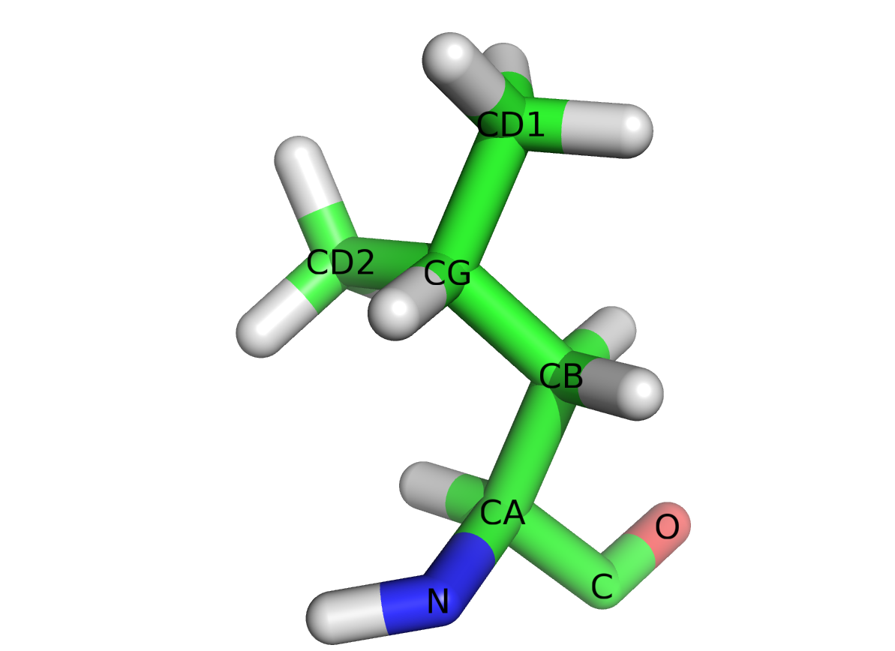
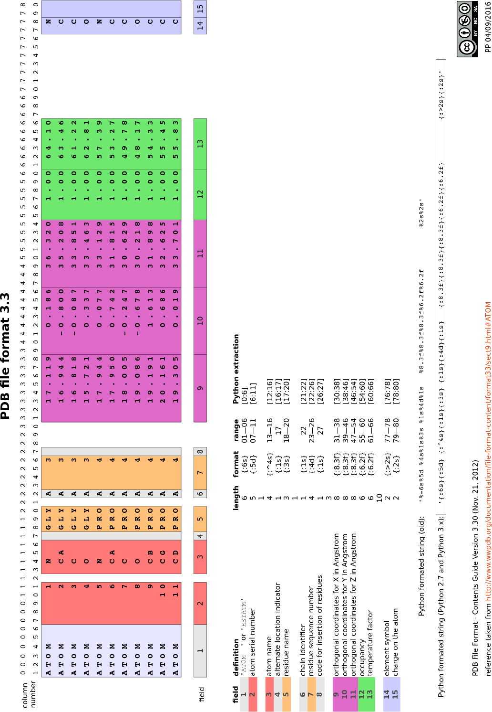

# Quelques formats de données rencontrés en biologie

## FASTA

Le format FASTA est utilisé pour stocker une ou plusieurs séquences, d'ADN, d'ARN ou de protéines.

Ces séquences sont classiquement représentées sous la forme :

```text
>en-tête
séquence avec un nombre maximum de caractères par ligne
séquence avec un nombre maximum de caractères par ligne
séquence avec un nombre maximum de caractères par ligne
séquence avec un nombre maximum de caractères par ligne
séquence avec un nombre max
```

La première ligne débute par le caractère `>` et contient une description de la séquence. On appelle souvent cette ligne « ligne de description » ou « ligne de commentaire ».

Les lignes suivantes contiennent la séquence à proprement dite, mais avec un nombre maximum fixe de caractères par ligne. Ce nombre maximum est généralement fixé à 60, 70 ou 80 caractères. Une séquence de plusieurs centaines de bases ou de résidus est donc répartie sur plusieurs lignes.

Un fichier est dit *multifasta* lorsqu'il contient plusieurs séquences au format FASTA, les unes à la suite des autres.

Les fichiers contenant une ou plusieurs séquences au format FASTA portent la plupart du temps l'extension `.fasta` mais on trouve également `.seq`, `.fas`, `.fna` ou `.faa`.


### Exemples

La séquence protéique au format FASTA de la sous-unité $\beta$ de l'[hémoglobine humaine](https://www.uniprot.org/uniprot/P68871), extraite de la base de données UniProt, est :

```text
>sp|P68871|HBB_HUMAN Hemoglobin subunit beta OS=Homo sapiens OX=9606 GN=HBB PE=1 SV=2
MVHLTPEEKSAVTALWGKVNVDEVGGEALGRLLVVYPWTQRFFESFGDLSTPDAVMGNPK
VKAHGKKVLGAFSDGLAHLDNLKGTFATLSELHCDKLHVDPENFRLLGNVLVCVLAHHFG
KEFTPPVQAAYQKVVAGVANALAHKYH
```

La première ligne contient la description de la séquence (*Hemoglobin subunit beta*), le type de base de données (ici *sp* qui signifie Swiss-Prot), son identifiant (*P68871*) et son nom (*HBB_HUMAN*) dans cette base de données, ainsi que d'autres informations (*S=Homo sapiens OX=9606 GN=HBB PE=1 SV=2*).

Les lignes suivantes contiennent la séquence sur des lignes ne dépassant pas, ici, 60 caractères. La séquence de la sous-unité $\beta$ de l'hémoglobine humaine est composée de 147 acides aminés, soit deux lignes de 60 caractères et une troisième de 27 caractères.

open-box-def

[UniProt](https://www.uniprot.org/) est une base de données de séquences de protéines. Ces séquences proviennent
elles-mêmes de deux autres bases de données : Swiss-Prot (où les séquences sont annotées
manuellement) et TrEMBL (où les séquences sont annotées automatiquement).

close-box-def

Voici maintenant la séquence nucléique (ARN), au format FASTA, de l'[insuline humaine](https://www.ncbi.nlm.nih.gov/nuccore/BT006808.1?report=fasta), extraite de la base de données [GenBank](https://www.ncbi.nlm.nih.gov/nuccore/AY899304.1?report=genbank) :

```text
>BT006808.1 Homo sapiens insulin mRNA, complete cds
ATGGCCCTGTGGATGCGCCTCCTGCCCCTGCTGGCGCTGCTGGCCCTCTGGGGACCTGACCCAGCCGCAG
CCTTTGTGAACCAACACCTGTGCGGCTCACACCTGGTGGAAGCTCTCTACCTAGTGTGCGGGGAACGAGG
CTTCTTCTACACACCCAAGACCCGCCGGGAGGCAGAGGACCTGCAGGTGGGGCAGGTGGAGCTGGGCGGG
GGCCCTGGTGCAGGCAGCCTGCAGCCCTTGGCCCTGGAGGGGTCCCTGCAGAAGCGTGGCATTGTGGAAC
AATGCTGTACCAGCATCTGCTCCCTCTACCAGCTGGAGAACTACTGCAACTAG
```

On retrouve sur la première ligne la description de la séquence (*Homo sapiens insulin mRNA*), ainsi que son identifiant (*BT006808.1*) dans la base de données GenBank.

Les lignes suivantes contiennent les 333 bases de la séquence, réparties sur cinq lignes de 70 caractères maximum. Il est curieux de trouver la base T (thymine) dans une séquence d'ARN qui ne devrait contenir normalement que les bases A, U, G et C. Ici, la représentation d'une séquence d'ARN avec les bases de l'ADN est une convention.

Pour terminer, voici trois séquences protéiques, au format FASTA, qui correspondent à l'insuline chez humaine (*Homo sapiens*), féline (*Felis catus*) et bovine (*Bos taurus*) :

```text
>sp|P01308|INS_HUMAN Insulin OS=Homo sapiens OX=9606 GN=INS PE=1 SV=1
MALWMRLLPLLALLALWGPDPAAAFVNQHLCGSHLVEALYLVCGERGFFYTPKTRREAED
LQVGQVELGGGPGAGSLQPLALEGSLQKRGIVEQCCTSICSLYQLENYCN
>sp|P06306|INS_FELCA Insulin OS=Felis catus OX=9685 GN=INS PE=1 SV=2
MAPWTRLLPLLALLSLWIPAPTRAFVNQHLCGSHLVEALYLVCGERGFFYTPKARREAED
LQGKDAELGEAPGAGGLQPSALEAPLQKRGIVEQCCASVCSLYQLEHYCN
>sp|P01317|INS_BOVIN Insulin OS=Bos taurus OX=9913 GN=INS PE=1 SV=2
MALWTRLRPLLALLALWPPPPARAFVNQHLCGSHLVEALYLVCGERGFFYTPKARREVEG
PQVGALELAGGPGAGGLEGPPQKRGIVEQCCASVCSLYQLENYCN
```

Ces séquences proviennent de la base de données UniProt et sont téléchargeables en suivant ce [lien](https://www.uniprot.org/uniprot/?sort=score&desc=&compress=no&query=id:P01308%20OR%20id:P01317%20OR%20id:P06306&format=fasta).

Chaque séquence est délimitée par la ligne d'en-tête qui débute par `>`.


### Manipulation avec Python

À partir de l'exemple précédent des 3 séquences d'insuline, voici un exemple de code qui lit un fichier FASTA avec Python :

```python
prot_dict = {}
with open("insulin.fasta", "r") as fasta_file:
    prot_id = ""
    for line in fasta_file:
        if line.startswith(">"):
            prot_id = line[1:].split()[0]
            prot_dict[prot_id] = ""
        else:
            prot_dict[prot_id] += line.strip()
    for id in prot_dict:
        print(id)
        print(prot_dict[id][:30])
```

Pour chaque séquence lue dans le fichier FASTA, on affiche son identifiant et son nom puis les 30 premiers résidus de sa séquence :

```text
sp|P06306|INS_FELCA
MAPWTRLLPLLALLSLWIPAPTRAFVNQHL
sp|P01317|INS_BOVIN
MALWTRLRPLLALLALWPPPPARAFVNQHL
sp|P01308|INS_HUMAN
MALWMRLLPLLALLALWGPDPAAAFVNQHL
```

Notez que les protéines sont stockées dans un dictionnaire (`prot_dict`) où les clefs sont les identifiants et les valeurs les séquences.

On peut faire la même chose avec le module *Biopython* :

```python
from Bio import SeqIO
with open("insulin.fasta", "r") as fasta_file:
    for record in SeqIO.parse(fasta_file, "fasta"):
        print(record.id)
        print(str(record.seq)[:30])
```

Cela produit le même résultat. L'utilisation de *Biopython* rend le code plus compacte car on utilise ici la fonction `SeqIO.parse()` qui s'occupe de lire le fichier FASTA.


## GenBank

GenBank est une banque de séquences nucléiques. Le format de fichier associé contient l'information nécessaire pour décrire un gène ou une portion d'un génome. Les fichiers GenBank porte le plus souvent l'extension `.gbk`.

Le format GenBank est décrit de manière très complète sur le site du [NCBI](https://www.ncbi.nlm.nih.gov/Sitemap/samplerecord.html). En voici néanmoins les principaux éléments avec l'exemple du gène qui code pour la [trypsine](https://www.ncbi.nlm.nih.gov/nuccore/M22612.1) chez l'Homme.


### L'en-tête

```text
LOCUS       HUMTRPSGNA               800 bp    mRNA    linear   PRI 14-JAN-1995
DEFINITION  Human pancreatic trypsin 1 (TRY1) mRNA, complete cds.
ACCESSION   M22612
VERSION     M22612.1
KEYWORDS    trypsinogen.
SOURCE      Homo sapiens (human)
  ORGANISM  Homo sapiens
            Eukaryota; Metazoa; Chordata; Craniata; Vertebrata; Euteleostomi;
            Mammalia; Eutheria; Euarchontoglires; Primates; Haplorrhini;
            Catarrhini; Hominidae; Homo.
[...]
```

Ligne 1 (`LOCUS`) : le nom du locus (*HUMTRPSGNA*), la taille du gène (800 paires de base), le type de molécule (ARN messager).

Ligne 3 (`ACCESSION`) : l'identifiant de la séquence (*M22612*).

Ligne 4 (`VERSION`) :  la version de la séquence (*M22612.1*). Le nombre qui est séparé de l'identifiant de la séquence par un point est incrémenté pour chaque nouvelle version de la fiche GenBank. Ici *.1* indique que nous en sommes à la première version.

Ligne 6 (`SOURCE`) : la provenance de la séquence. Souvent l'organisme d'origine.

Ligne 7 (`  ORGANISME`) : le nom scientifique de l'organisme, suivi de sa taxonomie (lignes 8 à 10).


### Les *features*

```text
[...]
FEATURES             Location/Qualifiers
     source          1..800
                     /organism="Homo sapiens"
                     /mol_type="mRNA"
                     /db_xref="taxon:9606"
                     /map="7q32-qter"
                     /tissue_type="pancreas"
     gene            1..800
                     /gene="TRY1"
     CDS             7..750
                     /gene="TRY1"
                     /codon_start=1
                     /product="trypsinogen"
                     /protein_id="AAA61231.1"
                     /db_xref="GDB:G00-119-620"
                     /translation="MNPLLILTFVAAALAAPFDDDDKIVGGYNCEENSVPYQVSLNSG
                     YHFCGGSLINEQWVVSAGHCYKSRIQVRLGEHNIEVLEGNEQFINAAKIIRHPQYDRK
                     TLNNDIMLIKLSSRAVINARVSTISLPTAPPATGTKCLISGWGNTASSGADYPDELQC
                     LDAPVLSQAKCEASYPGKITSNMFCVGFLEGGKDSCQGDSGGPVVCNGQLQGVVSWGD
                     GCAQKNKPGVYTKVYNYVKWIKNTIAANS"
     sig_peptide     7..51
                     /gene="TRY1"
                     /note="G00-119-620"
[...]
```

Ligne 9 (`gene            1..800`) : la délimitation du gène. Ici de la base 1 à la base 800. Par ailleurs, la notation `<x..y` indique que la séquence est partielle sur l'extrémité 5'. Réciproquement, `x..y>` indique que la séquence est partielle sur l'extrémité 3'. Enfin, pour les séquences d'ADN, la notation `complement(x..y)` indique que le gène se trouve de la base *x* à la base *y*, mais sur le brin complémentaire.

Ligne 10 (`/gene="TRY1"`) : le nom du gène.

Ligne 11 (`CDS             7..750`) : la délimitation de la séquence codante.

Ligne 14 (`/product="trypsinogen"`) : le nom de la protéine produite.

Ligne 17 à 20 (`/translation="MNPLLIL...`) : la séquence protéique issue de la traduction de la séquence codante.

Ligne 22 (`sig_peptide     7..51`) : la délimitation du peptide signal.


### La séquence

```text
[...]
ORIGIN      
        1 accaccatga atccactcct gatccttacc tttgtggcag ctgctcttgc tgcccccttt
       61 gatgatgatg acaagatcgt tgggggctac aactgtgagg agaattctgt cccctaccag
      121 gtgtccctga attctggcta ccacttctgt ggtggctccc tcatcaacga acagtgggtg
      181 gtatcagcag gccactgcta caagtcccgc atccaggtga gactgggaga gcacaacatc
      241 gaagtcctgg aggggaatga gcagttcatc aatgcagcca agatcatccg ccacccccaa
      301 tacgacagga agactctgaa caatgacatc atgttaatca agctctcctc acgtgcagta
      361 atcaacgccc gcgtgtccac catctctctg cccaccgccc ctccagccac tggcacgaag
      421 tgcctcatct ctggctgggg caacactgcg agctctggcg ccgactaccc agacgagctg
      481 cagtgcctgg atgctcctgt gctgagccag gctaagtgtg aagcctccta ccctggaaag
      541 attaccagca acatgttctg tgtgggcttc cttgagggag gcaaggattc atgtcagggt
      601 gattctggtg gccctgtggt ctgcaatgga cagctccaag gagttgtctc ctggggtgat
      661 ggctgtgccc agaagaacaa gcctggagtc tacaccaagg tctacaacta cgtgaaatgg
      721 attaagaaca ccatagctgc caatagctaa agcccccagt atctcttcag tctctatacc
      781 aataaagtga ccctgttctc
//
```

La séquence est contenue entre les balises `ORIGIN` (ligne 2) et `//` (ligne 17).

Chaque ligne est composée d'une série d'espaces, puis du numéro du premier nucléotide de la ligne, puis d'au plus 6 blocs de 10 nucléotides. Chaque bloc est précédé d'un espace.

Par exemple, ligne 10, le premier nucléotide de la ligne (`t`) est le numéro 421 dans la séquence.


### Manipulation avec Python

À partir de l'exemple précédent, voici comment lire un fichier GenBank avec Python et le module *Biopython* :

```python
from Bio import SeqIO
with open("M22612.gbk", "r") as gbk_file:
    record = SeqIO.read(gbk_file, "genbank")
    print(record.id)
    print(record.description)
    print(record.seq[:60])

```
Pour la séquence lue dans le fichier GenBank, on affiche son identifiant, sa description et les 60 premiers résidus :

```text
M22612.1
Human pancreatic trypsin 1 (TRY1) mRNA, complete cds.
ACCACCATGAATCCACTCCTGATCCTTACCTTTGTGGCAGCTGCTCTTGCTGCCCCCTTT
```

Il est également possible de lire un fichier GenBank sans le module *Biopython*. Une activité dédiée est proposée dans le chapitre 22 *Mini-projets*.


## PDB

La *[Protein Data Bank](https://www.rcsb.org/)* (PDB) est une banque de données qui contient les structures de biomacromolécules (protéines, ADN, ARN, virus...). Historiquement, le format de fichier qui y est associé est le PDB, dont une documentation détaillée est disponible sur le [site éponyme](http://www.wwpdb.org/documentation/file-format-content/format33/v3.3.html). Les principales extensions de fichier pour ce format de données sont `.ent` et surtout `.pdb`.

Un fichier PDB est constitué de deux parties principales : l'en-tête et les coordonnées.
L'en-tête est lisible et utilisable par un être humain (et aussi par une machine).
À l'inverse les coordonnées sont surtout utilisables par un programme pour calculer certaines propriétés de la structure ou simplement la représenter sur l'écran d'un ordinateur. Bien sûr, un utilisateur expérimenté peut parfaitement jeter un œil à cette seconde partie.

Examinons ces deux parties avec la [trypsine bovine](https://www.rcsb.org/structure/2PTN).

### En-tête

Pour la trypsine bovine, l'en-tête compte 510 lignes. En voici quelques unes :

```text
HEADER    HYDROLASE (SERINE PROTEINASE)           26-OCT-81   2PTN              
TITLE     ON THE DISORDERED ACTIVATION DOMAIN IN TRYPSINOGEN.                   
TITLE    2 CHEMICAL LABELLING AND LOW-TEMPERATURE CRYSTALLOGRAPHY               
COMPND    MOL_ID: 1;                                                            
COMPND   2 MOLECULE: TRYPSIN;                                                   
COMPND   3 CHAIN: A;
[...]
SOURCE   2 ORGANISM_SCIENTIFIC: BOS TAURUS;                                     
[...]
EXPDTA    X-RAY DIFFRACTION                                                     
[...]
REMARK   2 RESOLUTION.    1.55 ANGSTROMS.                                       
[...]
DBREF  2PTN A   16   245  UNP    P00760   TRY1_BOVIN      21    243             
SEQRES   1 A  223  ILE VAL GLY GLY TYR THR CYS GLY ALA ASN THR VAL PRO          
SEQRES   2 A  223  TYR GLN VAL SER LEU ASN SER GLY TYR HIS PHE CYS GLY          
SEQRES   3 A  223  GLY SER LEU ILE ASN SER GLN TRP VAL VAL SER ALA ALA          
SEQRES   4 A  223  HIS CYS TYR LYS SER GLY ILE GLN VAL ARG LEU GLY GLU          
[...]                                                     
HELIX    1  H1 SER A  164  ILE A  176  1SNGL ALPHA TURN,REST IRREG.       13    
HELIX    2  H2 LYS A  230  VAL A  235  5CONTIGUOUS WITH H3                 6    
HELIX    3  H3 SER A  236  ASN A  245  1CONTIGUOUS WITH H2                10    
SHEET    1   A 7 TYR A  20  THR A  21  0                                        
SHEET    2   A 7 LYS A 156  PRO A 161 -1  N  CYS A 157   O  TYR A  20           
[...]
SSBOND   1 CYS A   22    CYS A  157                          1555   1555  2.04  
SSBOND   2 CYS A   42    CYS A   58                          1555   1555  2.02  
[...]               
```

Ligne 1. Cette ligne `HEADER` contient le nom de la protéine (*HYDROLASE (SERINE PROTEINASE)*), la date de dépôt de cette structure dans la banque de données (26 octobre 1981) et l'identifiant de la structure dans la PDB, on parle souvent de « code PDB » (2PTN).

Ligne 2. `TITLE` correspond au titre de l'article scientifique dans lequel a été publié cette structure.

Lignes 4-6. `COMPND` indique que la trypsine est composée d'une seule chaîne peptidique, appelée ici `A`.

Ligne 8. `SOURCE` indique le nom scientifique de l'organisme dont provient cette protéine (ici, le bœuf).

Ligne 10. `EXPDTA` précise la technique expérimentale employée pour déterminer cette structure. Ici, la cristallographie aux rayons X. Mais on peut également trouver *SOLUTION NMR* pour de la résonance magnétique nucléaire en solution, *ELECTRON MICROSCOPY* pour de la microscopie électronique...

Ligne 12. `REMARK   2` précise, dans le cas d'une détermination par cristallographie aux rayons X, la résolution obtenue, ici 1,55 Angströms.

Ligne 14. `DBREF` indique les liens éventuels vers d'autres banques de données. Ici, l'identifiant correspondant à cette protéine dans UniProt (*UNP*) est [P00760](https://www.uniprot.org/uniprot/P00760).

Ligne 15-18. `SEQRES` donnent à la séquence de la protéine. Les résidus sont représentés par leur code à 3 lettres.

Lignes 20-22 et 23-24. `HELIX` et `SHEET` correspondent aux structures secondaires hélices $\alpha$ et brin $\beta$ de cette protéine. Ici, *H1 SER A  164  ILE A  176* indique qu'il y a une première hélice $\alpha$ (*H1*) comprise entre les résidus Ser164 et Ile176 de la chaîne A.

Lignes 26-27. `SSBOND` indique les bonds disulfures. Ici, entre les résidus Cys22 et Cys157 et entre les résidus Cys42 et Cys58.


### Coordonnées

Avec la même protéine, la partie coordonnées représente plus de 1700 lignes.
En voici quelques unes correspondantes au résidu leucine 99 :

```text
[...]  
ATOM    601  N   LEU A  99      10.007  19.687  17.536  1.00 12.25           N  
ATOM    602  CA  LEU A  99       9.599  18.429  18.188  1.00 12.25           C  
ATOM    603  C   LEU A  99      10.565  17.281  17.914  1.00 12.25           C  
ATOM    604  O   LEU A  99      10.256  16.101  18.215  1.00 12.25           O  
ATOM    605  CB  LEU A  99       8.149  18.040  17.853  1.00 12.25           C  
ATOM    606  CG  LEU A  99       7.125  19.029  18.438  1.00 18.18           C  
ATOM    607  CD1 LEU A  99       5.695  18.554  18.168  1.00 18.18           C  
ATOM    608  CD2 LEU A  99       7.323  19.236  19.952  1.00 18.18           C  
[...]  
```

Chaque ligne correspond à un atome et débute par `ATOM` ou `HETATM`.
`ATOM` désigne un atome de la structure de la biomolécule.
`HETATM` est utilisé pour les atomes qui ne sont pas une biomolécule, comme les ions ou les molécules d'eau.

Toutes les lignes de coordonnées ont sensiblement le même format. Par exemple, pour la première ligne :

- `ATOM` (ou `HETATM`).
- `601` : le numéro de l'atome.
- `N` : le nom de l'atome. Ici, un atome d'azote du squelette peptidique. La structure complète du résidu leucine est représentée figure @fig:leucine.
- `LEU` : le résidu dont fait partie l'atome. Ici une leucine.
- `A` : le nom de la chaîne peptidique.
- `99` : le numéro du résidu dans la protéine.
- `10.007` : la coordonnées *x* de l'atome.
- `19.687` : la coordonnées *y* de l'atome.
- `17.536` : la coordonnées *z* de l'atome.
- `1.00` : le facteur d'occupation, c'est-à-dire la probabilité de trouver l'atome à cette position dans l'espace en moyenne.
Cette probabilité est inférieure à 1 lorsque, expérimentalement, on n'a pas pu
déterminer avec une totale certitude la position de l'atome. Par exemple dans le cas d'un atome très mobile dans une structure, qui est déterminé comme étant à deux positions possibles, chaque position aura alors la probabilité 0,50.
- `12.25` : le facteur de température qui est proportionnel à la mobilité de l'atome dans l'espace. Les atomes situés en périphérie d'une structure sont souvent plus mobiles que ceux situés au coeur de la structure.
- `N` : l'élément chimique de l'atome. Ici, l'azote.

{ #fig:leucine width=50% }

Une documentation plus complète des différents champs qui constituent une ligne de coordonnées atomiques se trouve sur le site de la [PDB](http://www.wwpdb.org/documentation/file-format-content/format33/sect9.html).

Les résidus sont ensuite décrits les uns après les autres, atome par atome.
Voici par exemple les premiers résidus de la trypsine bovine :

```text
[...]
ATOM      1  N   ILE A  16      -8.155   9.648  20.365  1.00 10.68           N  
ATOM      2  CA  ILE A  16      -8.150   8.766  19.179  1.00 10.68           C  
ATOM      3  C   ILE A  16      -9.405   9.018  18.348  1.00 10.68           C  
ATOM      4  O   ILE A  16     -10.533   8.888  18.870  1.00 10.68           O  
ATOM      5  CB  ILE A  16      -8.091   7.261  19.602  1.00 10.68           C  
ATOM      6  CG1 ILE A  16      -6.898   6.882  20.508  1.00  7.42           C  
ATOM      7  CG2 ILE A  16      -8.178   6.281  18.408  1.00  7.42           C  
ATOM      8  CD1 ILE A  16      -5.555   6.893  19.773  1.00  7.42           C  
ATOM      9  N   VAL A  17      -9.224   9.305  17.090  1.00  9.63           N  
ATOM     10  CA  VAL A  17     -10.351   9.448  16.157  1.00  9.63           C  
ATOM     11  C   VAL A  17     -10.500   8.184  15.315  1.00  9.63           C  
ATOM     12  O   VAL A  17      -9.496   7.688  14.748  1.00  9.63           O  
ATOM     13  CB  VAL A  17     -10.123  10.665  15.222  1.00  9.63           C  
ATOM     14  CG1 VAL A  17     -11.319  10.915  14.278  1.00 11.95           C  
ATOM     15  CG2 VAL A  17      -9.737  11.970  15.970  1.00 11.95           C  
[...]
```

Vous remarquez que le numéro du premier résidu est 16 et non pas 1. Cela s'explique par la technique expérimentale utilisée qui n'a pas permis de déterminer la structure des 15 premiers résidus.

La structure de la trypsine bovine n'est constituée que d'une seule chaîne peptidique (notée `A`).
Lorsqu'une structure est composée de plusieurs chaînes, comme dans le cas de la structure du récepteur GABAB 1 et 2 chez la drosophile (code PDB [5X9X](http://www.rcsb.org/structure/5X9X)) :

```text
[...]
ATOM    762  HB1 ALA A  44      37.162  -2.955   2.220  1.00  0.00           H  
ATOM    763  HB2 ALA A  44      38.306  -2.353   3.417  1.00  0.00           H  
ATOM    764  HB3 ALA A  44      38.243  -1.621   1.814  1.00  0.00           H  
TER     765      ALA A  44                                                      
ATOM    766  N   GLY B  95     -18.564   3.009  13.772  1.00  0.00           N  
ATOM    767  CA  GLY B  95     -19.166   3.646  12.621  1.00  0.00           C  
ATOM    768  C   GLY B  95     -20.207   2.755  11.976  1.00  0.00           C  
[...]
```

La première chaîne est notée `A` et la seconde `B`. La séparation entre
les deux est marquée par la ligne `TER     765      ALA A  44 `.

Dans un fichier PDB, chaque structure porte un nom de chaîne différent.

Enfin, lorsque la structure est déterminée par RMN, il est possible que plusieurs structures soient présentes
dans le même fichier PDB. Toutes ces structures, ou « modèles », sont des solutions possibles du jeu de contraintes mesurées
expérimentalement en RMN. Voici un exemple, toujours pour la structure du récepteur GABAB 1 et 2 chez la drosophile :

```text
[...]
MODEL        1                                                                  
ATOM      1  N   MET A   1     -27.283  -9.772   5.388  1.00  0.00           N  
ATOM      2  CA  MET A   1     -28.233  -8.680   5.682  1.00  0.00           C  
[...]
ATOM   1499  HG2 GLU B 139      36.113  -5.242   2.536  1.00  0.00           H  
ATOM   1500  HG3 GLU B 139      37.475  -4.132   2.428  1.00  0.00           H  
TER    1501      GLU B 139                                                      
ENDMDL                                                                          
MODEL        2                                                                  
ATOM      1  N   MET A   1     -29.736 -10.759   4.394  1.00  0.00           N  
ATOM      2  CA  MET A   1     -28.372 -10.225   4.603  1.00  0.00           C  
[...]
ATOM   1499  HG2 GLU B 139      36.113  -5.242   2.536  1.00  0.00           H  
ATOM   1500  HG3 GLU B 139      37.475  -4.132   2.428  1.00  0.00           H  
TER    1501      GLU B 139                                                      
ENDMDL                                                                          
MODEL        2                                                                  
ATOM      1  N   MET A   1     -29.736 -10.759   4.394  1.00  0.00           N  
ATOM      2  CA  MET A   1     -28.372 -10.225   4.603  1.00  0.00           C  
[...]
```

Chaque structure est encadrée par les lignes

```text
MODEL        n
```

et

```text
ENDMDL
```

où *n* est le numéro du modèle. Pour la structure du récepteur GABAB 1 et 2,
il y a 20 modèles de décrits dans le fichier PDB.


### Manipulation avec Python

Le module *Biopython* peut également lire un fichier PDB.

Chargement de la structure de la trypsine bovine :

```python
from Bio.PDB import PDBParser
parser = PDBParser()
prot_id = "2PTN"
prot_file = "2PTN.pdb"
structure = parser.get_structure(prot_id, prot_file)
```

open-box-rem

Les fichiers PDB sont parfois (très) mal formatés. Si *Biopython* ne parvient pas à lire un tel fichier,
remplacez alors la 2e ligne par `parser = PDBParser(PERMISSIVE=1)`. Soyez néanmoins très prudent quant aux résultats obtenus.

close-box-rem

Affichage du nom de la structure et de la technique expérimentale utilisée pour déterminer la structure :

```python
print(structure.header["head"])
print(structure.header["structure_method"])
```

ce qui produit :

```python
hydrolase (serine proteinase)
x-ray diffraction
```

Extraction des coordonnées de l'atome `N` du résidu Ile16 et de l'atome `CA` du résidu Val17 :

```python
model = structure[0]
chain = model["A"]
res1 = chain[16]
res2 = chain[17]
print(res1.resname, res1["N"].coord)
print(res2.resname, res2["CA"].coord)
```

ce qui produit :

```python
ILE [ -8.15499973   9.64799976  20.36499977]
VAL [-10.35099983   9.44799995  16.15699959]
```

L'objet `res1["N"].coord` est un *array* de *NumPy* (voir le chapitre 17
*Quelques modules d'intérêt en bioinformatique*). On peut alors obtenir
simplement les coordonnées x, y et z d'un atome :

```python
print(res1["N"].coord[0], res1["N"].coord[1], res1["N"].coord[2])
```

ce qui produit :

```python
-8.155 9.648 20.365
```

open-box-rem

Biopython utilise la hiérarchie suivante :  
`structure > model > chain > residue > atom`  
même lorsque la structure ne contient qu'un seul modèle. C'est d'ailleurs
le cas ici, puisque la structure
a été obtenue par cristallographie aux rayons X.

close-box-rem

Enfin, pour afficher les coordonnées des carbones $\alpha$ (notés `CA`) des 10 premiers résidus (à partir du résidu 16 car c'est le premier résidu dont on connaît la structure) :

```python
res_start = 16
model = structure[0]
chain = model["A"]
for i in range(10):
    idx = res_start + i
    print(chain[idx].resname, idx, chain[idx]["CA"].coord)
```

avec pour résultat :

```text
ILE 16 [ -8.14999962   8.76599979  19.17900085]
VAL 17 [-10.35099983   9.44799995  16.15699959]
GLY 18 [-12.02099991   6.63000011  14.25899982]
GLY 19 [-10.90200043   3.89899993  16.68400002]
TYR 20 [-12.65100002   1.44200003  19.01600075]
THR 21 [-13.01799965   0.93800002  22.76000023]
CYS 22 [-10.02000046  -1.16299999  23.76000023]
GLY 23 [-11.68299961  -2.86500001  26.7140007 ]
ALA 24 [-10.64799976  -2.62700009  30.36100006]
ASN 25 [ -6.96999979  -3.43700004  31.02000046]
```

Il est aussi très intéressant (et formateur) d'écrire son propre *parser* de fichier PDB,
c'est-à-dire un programme qui lit un fichier PDB (sans le module *Biopython*).
Dans ce cas, la figure @fig:format-pdb vous aidera à déterminer comment extraire
les différentes informations d'une ligne de coordonnées `ATOM` ou `HETATM`.

{ #fig:format-pdb width=99% }

Exemple : pour extraire le nom du résidu, il faut isoler le contenu des colonnes 18 à 20 du fichier PDB, ce qui correspond aux index de 17 à 19 pour une chaîne de caractères en Python, soit la tranche de chaîne de caractères `[17:20]` car la première borne est incluse et la seconde exclue.

Pour lire le fichier PDB de la trypsine bovine (`2PTN.pdb`) et extraire (encore) les coordonnées des carbones $\alpha$ des 10 premiers résidus, nous pouvons utiliser le code suivant :

```python
with open("2PTN.pdb", "r") as pdb_file:
    res_count = 0
    for line in pdb_file:
        if line.startswith("ATOM"):
            atom_name = line[12:16].strip()
            res_name = line[17:20].strip()
            res_num = int(line[22:26])
            if atom_name == "CA":
                res_count += 1
                x = float(line[30:38])
                y = float(line[38:46])
                z = float(line[46:54])
                print(res_name, res_num, x, y, z)
            if res_count >= 10:
                break
```

ce qui donne :

```text
ILE 16 -8.15 8.766 19.179
VAL 17 -10.351 9.448 16.157
GLY 18 -12.021 6.63 14.259
GLY 19 -10.902 3.899 16.684
TYR 20 -12.651 1.442 19.016
THR 21 -13.018 0.938 22.76
CYS 22 -10.02 -1.163 23.76
GLY 23 -11.683 -2.865 26.714
ALA 24 -10.648 -2.627 30.361
ASN 25 -6.97 -3.437 31.02
```

open-box-rem

Pour extraire des valeurs numériques, comme des numéros de résidus ou des coordonnées atomiques, il ne faudra pas oublier de les convertir en entiers ou en *floats*.

close-box-rem

## Format XML, CSV et TSV

Les formats XML, CSV et TSV dont des formats de fichiers très largement utilisés en informatique.
Ils sont tout autant très utilisés en biologie. En voici  quelques exemples.


### XML

Le format XML est un format de fichier qui permet de stocker quasiment
n'importe quel type d'information de façon structurée et hiérarchisée.
L'acronyme XML signifie *Extensible Markup Language* qui pourrait se traduire
en français par « [Langage de balisage extensible](https://fr.wikipedia.org/wiki/Extensible_Markup_Language) ». Les balises
dont il est question servent à délimiter du contenu :

`<balise>contenu</balise>`

La balise `<balise>` est une balise ouvrante.
La balise `</balise>` est une balise fermante.
Notez le caractère `/` qui marque la différence entre une balise ouvrante
et une balise fermante.

Il existe également des balises vides, qui sont à la fois ouvrantes et fermantes :

`<balise />`

Une balise peut avoir certaines propriétés, appelées *attributs*, qui sont
définies, dans la balise ouvrante. Par exemple :

`<balise propriété1=valeur1 propriété2=valeur2>contenu</balise>`

Un attribut est un couple nom et valeur (par exemple `propriété1` est un nom
et `valeur1` est la valeur associée).


Enfin, les balises peuvent être imbriquées les unes dans les autres :

```text
<protein>
<element>élément 1</element>
<element>élément 2</element>
<element>élément 3</element>
</protein>
```

Dans cet exemple, nous avons trois balises `element` qui sont contenues dans une balise
`protein`.

Voici un autre exemple avec l'enzyme [trypsine](https://www.uniprot.org/uniprot/P07477)
humaine (code [P07477](https://www.uniprot.org/uniprot/P07477.xml)) telle
qu'on peut la trouver décrite dans la base de données UniProt :

```text
<?xml version='1.0' encoding='UTF-8'?>
<uniprot xmlns="http://uniprot.org/uniprot" xmlns:xsi=[...]>
<entry dataset="Swiss-Prot" created="1988-04-01" modified="2018-09-12" [...]>
<accession>P07477</accession>
<accession>A1A509</accession>
<accession>A6NJ71</accession>
[...]
<gene>
<name type="primary">PRSS1</name>
<name type="synonym">TRP1</name>
<name type="synonym">TRY1</name>
<name type="synonym">TRYP1</name>
</gene>
[...]
<sequence length="247" mass="26558" checksum="DD49A487B8062813" [...]>
MNPLLILTFVAAALAAPFDDDDKIVGGYNCEENSVPYQVSLNSGYHFCGGSLINEQWVVS
AGHCYKSRIQVRLGEHNIEVLEGNEQFINAAKIIRHPQYDRKTLNNDIMLIKLSSRAVIN
ARVSTISLPTAPPATGTKCLISGWGNTASSGADYPDELQCLDAPVLSQAKCEASYPGKIT
SNMFCVGFLEGGKDSCQGDSGGPVVCNGQLQGVVSWGDGCAQKNKPGVYTKVYNYVKWIK
NTIAANS
</sequence>
</entry>
[...]
</uniprot>
```

La ligne 1 indique que nous avons bien un fichier au format XML.

La ligne 3 indique que nous avons une entrée UniProt. Il s'afit d'une balise
ouvrante avec plusieurs attributs (`dataset="Swiss-Prot"`, `created="1988-04-01"`...).

Les lignes 4-6 précisent les numéros d'accession dans la base de données
UniProt qui font référence à cette même protéine.

Les lignes 8-13 listent les quatre gènes correspondants à cette protéine.
Le premier gène porte l'attribut `type="primary"` et indique qu'il s'agit
du nom officiel du gène de la trypsine.
L'attribut `type="synonym"` pour les autres gènes indique qu'il s'agit bien de
noms synonymes pour le gène `PRSS1`.

Les lignes 15-21 contiennent la séquence de la trypsine. Dans les attributs de
la balise `<sequence>`, on retrouve, par exemple, la taille de la protéine
(`length="247"`).

Voici un exemple de code Python pour manipuler le fichier XML de la trypsine
humaine :

```python
from lxml import etree
import re

with open("P07477.xml") as xml_file:
    xml_content = xml_file.read()

xml_content = re.sub("<uniprot [^>]+>", "<uniprot>", xml_content)

root = etree.fromstring(xml_content.encode("utf-8"))

for gene in root.xpath("/uniprot/entry/gene/name"):
    print(f"gene : {gene.text} ({gene.get('type')})")

sequence = root.xpath("/uniprot/entry/sequence")[0]
print(f"sequence: {sequence.text.strip()}")
print(f"length: {sequence.get('length')}")
```

Ligne 1. On utilise le sous-module `etree` du module *lxml* pour lire le fichier XML.

Ligne 2. On utilise le module d'expressions régulières *re* pour supprimer
tous les attributs de la balise `uniprot` (ligne 7).
Nous ne rentrerons pas dans les détails, mais ces attributs rendent
plus complexe la lecture du fichier XML.

Ligne 9. La variable `root` contient le fichier XML prêt à être manipulé.

Ligne 11. On recherche les noms des gènes (balises `<name></name>`) associés
à la trypsine. Pour cela, on utilise la méthode `.xpath()` avec comme argument
l'enchaînement des différentes balises qui conduisent aux noms des gènes.

Ligne 12. Pour chaque nom de gène, on va afficher son contenu (`gene.text`)
et la valeur associée à l'attribut `type` avec la méthode `.get("type")`.

Ligne 11. On stocke dans la variable `sequence` la balise associée
à la séquence de la protéine. Comme `root.xpath("/uniprot/entry/sequence")`
renvoie un itérateur et qu'il n'y a qu'une seule balise séquence, on
prend ici le seul et unique élément `root.xpath("/uniprot/entry/sequence")[0]`.

Ligne 15. On affiche le contenu de la séquence `sequence.text`, nettoyé
d'éventuels retours chariots ou espaces `sequence.text.strip()`.

Ligne 16. On affiche la taille de la séquence en récupérant la valeur
de l'attribut `length` (toujours de la balise `<sequence></sequence>`).

Le résultat obtenu est le suivant :

```text
gene : PRSS1 (primary)
gene : TRP1 (synonym)
gene : TRY1 (synonym)
gene : TRYP1 (synonym)
sequence: MNPLLILTFVAAALAAPFDDDDKIVGGYNCEENSVPYQVSLNSGYHFCGGSLINEQWVVS
AGHCYKSRIQVRLGEHNIEVLEGNEQFINAAKIIRHPQYDRKTLNNDIMLIKLSSRAVIN
ARVSTISLPTAPPATGTKCLISGWGNTASSGADYPDELQCLDAPVLSQAKCEASYPGKIT
SNMFCVGFLEGGKDSCQGDSGGPVVCNGQLQGVVSWGDGCAQKNKPGVYTKVYNYVKWIK
NTIAANS
length: 247
```

### CSV et TSV

#### Définition des formats

L'acronyme CSV signifie « *Comma-Separated values* » qu'on peut traduire littéralement
par « valeurs séparées par des virgules ». De façon similaire, TSV signifie « *Tabulation-Separated Values* »,
soit des « valeurs séparées par des tabulations ».

Ces deux formats sont utiles pour stocker des données structurées sous forme de tableau, comme vous pourriez l'avoir dans un tableur.

À titre d'exemple, le tableau ci-dessous liste les structures associées à la transferrine,
protéine présente dans le plasma sanguin et impliquée dans la régulation du fer.
Ces données proviennent de la *Protein Data Bank* (PDB). Pour chaque protéine (*PDB ID*),
est indiqué le nom de l'organisme associé (*Source*), la date à laquelle cette
structure a été déposée dans la PDB (*Deposit Date*), le nombre d'acides aminés
de la protéine et sa masse moléculaire (*MW*).

| PDB ID | Source                | Deposit Date | Length | MW       |
|--------|-----------------------|--------------|--------|----------|
| 1A8E   | Homo sapiens          | 1998-03-24   | 329    | 36408.40 |
| 1A8F   | Homo sapiens          | 1998-03-25   | 329    | 36408.40 |
| 1AIV   | Gallus gallus         | 1997-04-28   | 686    | 75929.00 |
| 1AOV   | Anas platyrhynchos    | 1996-12-11   | 686    | 75731.80 |
| 1B3E   | Homo sapiens          | 1998-12-09   | 330    | 36505.50 |
| 1D3K   | Homo sapiens          | 1999-09-29   | 329    | 36407.40 |
| 1D4N   | Homo sapiens          | 1999-10-04   | 329    | 36399.40 |
| 1DOT   | Anas platyrhynchos    | 1995-08-03   | 686    | 75731.80 |
| [...]  | [...]                 | [...]        | [...]  | [...]    |

Voici maintenant l'équivalent en [CSV](https://python.sdv.univ-paris-diderot.fr/data-files/transferrin_report.csv) :

```text
PDB ID,Source,Deposit Date,Length,MW
1A8E,Homo sapiens,1998-03-24,329,36408.40
1A8F,Homo sapiens,1998-03-25,329,36408.40
1AIV,Gallus gallus,1997-04-28,686,75929.00
1AOV,Anas platyrhynchos,1996-12-11,686,75731.80
1B3E,Homo sapiens,1998-12-09,330,36505.50
1D3K,Homo sapiens,1999-09-29,329,36407.40
1D4N,Homo sapiens,1999-10-04,329,36399.40
1DOT,Anas platyrhynchos,1995-08-03,686,75731.80
[...]
```

Sur chaque ligne, les différentes valeurs sont séparées par une virgule.
La première ligne contient le nom des colonnes et est appelée ligne d'en-tête.


L'équivalent en [TSV](https://python.sdv.univ-paris-diderot.fr/data-files/transferrin_report.tsv) est :

```text
PDB ID	Source	Deposit Date	Length	MW
1A8E	Homo sapiens	1998-03-24	329	36408.40
1A8F	Homo sapiens	1998-03-25	329	36408.40
1AIV	Gallus gallus	1997-04-28	686	75929.00
1AOV	Anas platyrhynchos	1996-12-11	686	75731.80
1B3E	Homo sapiens	1998-12-09	330	36505.50
1D3K	Homo sapiens	1999-09-29	329	36407.40
1D4N	Homo sapiens	1999-10-04	329	36399.40
1DOT	Anas platyrhynchos	1995-08-03	686	75731.80
[...]
```

Sur chaque ligne, les différentes valeurs sont séparées par une tabulation.

open-box-warn

Le caractère tabulation est un caractère invisible « élastique »,
c'est-à-dire qu'il a une largeur variable suivant l'éditeur de texte utilisé.
Par exemple, dans la ligne d'en-tête, l'espace entre *PDB ID* et *Source*
apparaît comme différent de l'espace entre *Deposit Date* et *Length* alors
qu'il y a pourtant une seule tabulation à chaque fois.

close-box-warn

#### Lecture

En Python, le module *csv* de la bibliothèque standard est très pratique
pour lire et écrire des fichiers au format CSV et TSV. Nous vous conseillons
de lire la documentation très complète sur ce [module](https://docs.python.org/fr/3.7/library/csv.html).

Voici un exemple :

```python
import csv

with open("transferrin_report.csv") as f_in:
    f_reader = csv.DictReader(f_in)
    for row in f_reader:
        print(row["PDB ID"], row["Deposit Date"], row["Length"])
```

Ligne 1. Chargement du module *csv*.

Ligne 3. Ouverture du fichier.

Ligne 4. Utilisation du module *csv* pour lire le fichier CSV comme un dictionnaire (fonction `DictReader()`). La ligne d'en-tête est utilisée automatiquement pour définir les clés du dictionnaire.

Ligne 5. Parcours de toutes les lignes du fichiers CSV.

Ligne 6. Affichage des champs correspondants à *PDB ID*, *Deposit Date*, *Length*.

Le résultat obtenu est :

```text
1A8E 1998-03-24 329
1A8F 1998-03-25 329
1AIV 1997-04-28 686
1AOV 1996-12-11 686
1B3E 1998-12-09 330
1D3K 1999-09-29 329
[...]
```

Il suffit de modifier légèrement le script précédent pour lire un fichier TSV :

```python
import csv

with open("transferrin_PDB_report.tsv") as f_in:
    f_reader = csv.DictReader(f_in, delimiter="\t")
    for row in f_reader:
        print(row["PDB ID"], row["Deposit Date"], row["Length"])
```

Ligne 3. Modification du nom du fichier lu.

Ligne 4. Utilisation de l'argument `delimiter="\t"` qui indique
que les champs sont séparés par des tabulations.

Le résultat obtenu est strictement identique au précédent.


#### Écriture

Voici un exemple d'écriture de fichier CSV :

```python
import csv

with open("test.csv", "w") as f_out:
    fields = ["Name", "Quantity"]
    f_writer = csv.DictWriter(f_out, fieldnames=fields)
    f_writer.writeheader()
    f_writer.writerow({"Name": "girafe", "Quantity":5})
    f_writer.writerow({"Name": "tigre", "Quantity":3})
    f_writer.writerow({"Name": "singe", "Quantity":8})
```

Ligne 3. Ouverture du fichier `test.csv` en lecture.

Ligne 4. Définition du nom des colonnes (*Name* et *Quantity*).

Ligne 5. Utilisation du module *csv* pour écrire un fichier CSV à partir d'un dictionnaire.

Ligne 6. Écriture des noms des colonnes.

Ligne 7-9. Écriture de trois lignes. Pour chaque ligne, un dictionnaire dont les clefs sont les noms des colonnes est fourni comme argument à la méthode `.writerow()`.

Le contenu du fichier `test.csv` est alors :

```text
Name,Quantity
girafe,5
tigre,3
singe,8
```

De façon très similaire, l'écriture d'un fichier TSV est réalisée avec le code suivant :

```python
import csv

with open("test.tsv", "w") as f_out:
    fields = ["Name", "Quantity"]
    f_writer = csv.DictWriter(f_out, fieldnames=fields, delimiter="\t")
    f_writer.writeheader()
    f_writer.writerow({"Name": "girafe", "Quantity":5})
    f_writer.writerow({"Name": "tigre", "Quantity":3})
    f_writer.writerow({"Name": "singe", "Quantity":8})
```

Ligne 3. Modification du nom du fichier en écriture.

Ligne 5. Utilisation de l'argument `delimiter="\t"` qui indique que les champs sont séparés par des tabulations.

Le contenu du fichier `test.tsv` est :

```text
Name	Quantity
girafe	5
tigre	3
singe	8
```

Vous êtes désormais capables de lire et écrire des fichiers aux formats CSV et TSV.
Les codes que nous vous avons proposés ne sont que des exemples.
À vous de poursuivre l'exploration du module *csv*.

open-box-rem

Le module *pandas* décrit dans le chapitre 17 *Quelques modules d'intérêt en bioinformatique* est tout à fait capable de lire et écrire des fichiers CSV et TSV. Nous vous conseillons de l'utiliser si vous analysez des données avec ces types de fichiers.

close-box-rem
