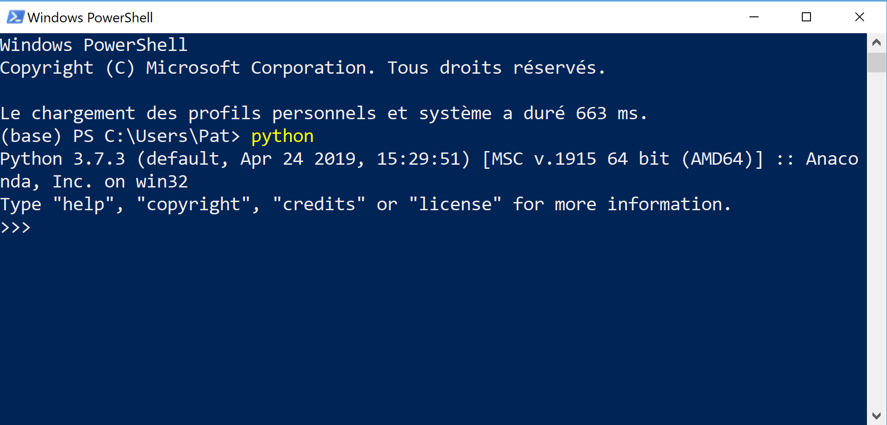
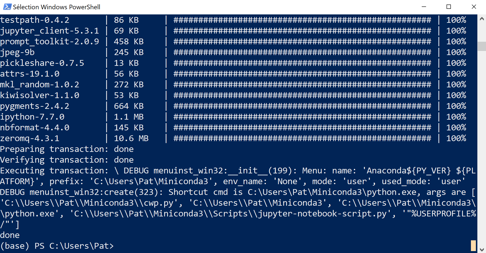
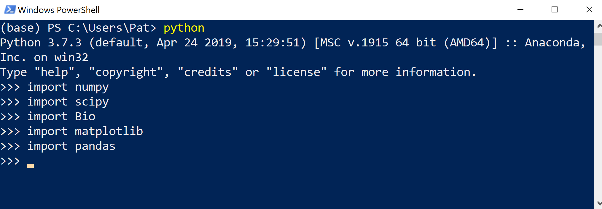
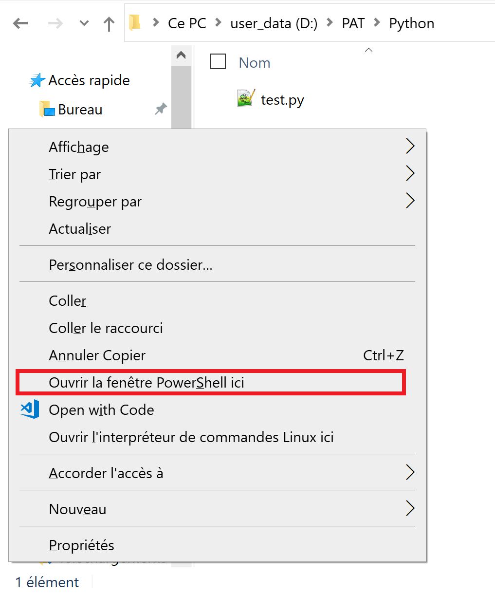

# Installation de Python

open-box-warn

Miniconda a été mis à jour le 29 juillet 2019, la procédure d'installation décrite ci-dessous concerne cette version.

close-box-warn

Python est déjà présent sous Linux ou Mac OS X et s'installe très facilement sous Windows. Toutefois, nous décrivons dans cet ouvrage l'utilisation de modules supplémentaires qui sont très utiles en bioinformatique (*NumPy*, *scipy*, *matplotlib*, *pandas*, *Biopython*), mais également les *notebooks* Jupyter.

On va donc utiliser un gestionnaire de paquets qui va installer ces modules supplémentaires. On souhaite également que ce gestionnaire de paquets soit disponible pour Windows, Mac OS X et Linux. Fin 2018, il y a deux grandes alternatives :

1. **Anaconda** et **Miniconda** : [Anaconda](https://www.anaconda.com/) est une distribution complète de Python qui contient un gestionnaire de paquets très puissant nommé *conda*. Anaconda installe de très nombreux paquets et outils mais nécessite un espace disque de plusieurs gigaoctets. [Miniconda](https://conda.io/miniconda.html) est une version allégée d'Anaconda, donc plus rapide à installer et occupant peu d'espace sur le disque dur. Le gestionnaire de paquet *conda* est aussi présent dans Miniconda.

2. **Pip** : [pip](https://pip.pypa.io/en/stable/) est le gestionnaire de paquets de Python et qui est systématiquement présent depuis la version 3.4.


## Que recommande-t-on pour l'installation de Python ?

Quel que soit le système d'exploitation, nous recommandons l'utilisation de Miniconda dont la procédure d'installation est détaillée ci-dessous pour Windows, Mac OS X et Linux. Le gestionnaire de paquets *conda* est très efficace. Il gère la version de Python et les paquets compatibles avec cette dernière de manière optimale.

Par ailleurs, nous vous recommandons vivement la lecture de la rubrique sur les [éditeurs de texte](#les-éditeurs-de-texte). Il est en effet fondamental d'utiliser un éditeur robuste et de savoir le configurer pour « pythonner » efficacement.

Enfin, dans tout ce qui suit, nous partons du principe que vous installerez Miniconda  **en tant qu'utilisateur**, et non pas en tant qu'administrateur. Autrement dit, vous n'aurez pas besoin de droits spéciaux pour pouvoir installer Miniconda et les autres modules nécessaires. La procédure proposée a été testée avec succès sous Windows (7 et 10), Mac OS C (Mac OS High Sierra version 10.13.6) et Linux (Ubuntu 16.04, Ubuntu 18.04).


## Installation de Python avec Miniconda

Nous vous conseillons l'installation de la distribution [Miniconda](https://conda.io/miniconda.html) qui présente l'avantage d'installer Python et un puissant gestionnaire de paquets appelé *conda*. Dans toute la suite de cette annexe, l'indication avec le $ et un espace comme suit :

```bash
$
```

signifie l'invite d'un *shell* quel qu'il soit (PowerShell sous Windows, bash sous Mac OS X et Linux).

### Installation de Python avec Miniconda pour Linux

Dans un navigateur internet, ouvrez la page du site Miniconda <https://conda.io/miniconda.html> puis cliquez sur le lien *64-bit (bash installer)* correspondant à Linux et Python 3.7. Bien sur, si votre machine est en 32-bit (ce qui est maintenant assez rare), vous cliquerez sur le lien *32-bit (bash installer)*.

Vous allez télécharger un fichier dont le nom ressemble à quelque chose du type :

`Miniconda3-latest-Linux-x86_64.sh`.

Dans un *shell*, lancez l’installation de Miniconda avec la commande :

```bash
$ bash Miniconda3-latest-Linux-x86_64.sh
```

Dans un premier temps, validez la lecture de la licence d'utilisation :

```text
Welcome to Miniconda3 4.7.10

In order to continue the installation process, please review the license
agreement.
Please, press ENTER to continue
>>>
```

Comme demandé, appuyez sur la touche *Entrée*. Faites ensuite défiler la licence d'utilisation avec la touche *Espace*. Tapez `yes` puis appuyez sur la touche *Entrée* pour valider :

```text
Do you accept the license terms? [yes|no]
[no] >>> yes
```

Le programme d'installation vous propose ensuite d'installer Miniconda dans le répertoire `miniconda3` dans votre répertoire personnel. Par exemple, dans le répertoire `/home/pierre/miniconda3` si votre nom d'utilisateur est `pierre`. Validez cette proposition en appuyant sur la touche *Entrée* :

```text
Miniconda3 will now be installed into this location:
/home/pierre/miniconda3

  - Press ENTER to confirm the location
  - Press CTRL-C to abort the installation
  - Or specify a different location below

[/home/pierre/miniconda3] >>>
```

Le programme d'installation va alors installer Python et le gestionnaire de paquets *conda*.

Cette étape terminée, le programme d'installation vous propose d'initialiser *conda* pour que celui-ci soit accessible à chaque fois que vous ouvrez un *shell*. Nous vous conseillons d'accepter en tapant `yes` puis en appuyant sur la touche *Entrée*.

```text
Do you wish the installer to initialize Miniconda3
by running conda init? [yes|no]
[no] >>> yes
```

L'installation de Miniconda est terminée. L'espace utilisé par Miniconda sur votre disque dur est d'environ 450 Mo.


#### Test de l'interpréteur Python

Ouvrez un nouveau *shell*. À partir de maintenant, lorsque vous taperez la commande `python`, c'est le Python 3 de Miniconda qui sera lancé :

```bash
$ python
Python 3.7.3 (default, Mar 27 2019, 22:11:17) 
[GCC 7.3.0] :: Anaconda, Inc. on linux
Type "help", "copyright", "credits" or "license" for more information.
>>>
```

Quittez Python en tapant la commande `exit()` puis appuyant sur la touche *Entrée*.


#### Test du gestionnaire de paquets *conda*

De retour dans le *shell*, testez si le gestionnaire de paquets *conda* est fonctionnel. Tapez la commande `conda` dans le *shell*, vous devriez avoir la sortie suivante :

```text
$ conda
usage: conda [-h] [-V] command ...

conda is a tool for managing and deploying applications, environments and packages.

Options:

positional arguments:
  command
    clean        Remove unused packages and caches.
[...]
```

Si c'est bien le cas, bravo, *conda* et bien installé et vous pouvez passez à la suite (rendez-vous à la rubrique [Installation des modules supplémentaires](#installation-des-modules-supplémentaires)) !


#### Désinstallation de Miniconda

Si vous souhaitez supprimer Miniconda, rien de plus simple, il suffit de suivre ces deux étapes :

**Étape 1.** Supprimer le répertoire de Miniconda. Par exemple pour l'utilisateur `pierre` :

```bash
$ rm -rf /home/pierre/miniconda3
```
  
**Étape 2.** Dans le fichier de configuration du *shell Bash*, supprimer les lignes comprises entre 
    
```bash
# >>> conda initialize >>>
```

et

```bash
# <<< conda initialize <<<
```


### Installation de Python avec Miniconda pour Mac OS X

Dans un navigateur internet, ouvrez la page du site Miniconda <https://conda.io/miniconda.html> puis cliquez sur le lien *64-bit (bash installer)* correspondant à Mac OS X et Python 3.7. Sous Mac, seule la version 64-bit est disponible.

Vous allez télécharger un fichier dont le nom ressemble à quelque chose du type :

`Miniconda3-latest-MacOSX-x86_64.sh`.

Le système d'exploitation Mac OS X étant basé sur Unix, la suite de la procédure est en tout point identique à la procédure détaillée à la [rubrique précédente](#installation-de-python-avec-miniconda-sous-linux) pour Linux.

Donc, lancez la commande :

```bash
$ bash Miniconda3-latest-MacOSX-x86_64.sh
```

puis suivez les mêmes instructions que dans la rubrique précédente (la seule petite subtilité est pour le chemin, choisissez `/User/votre_nom_utilisateur/miniconda3` sous Mac au lieu de `/home/votre_nom_utilisateur/miniconda3` sous Linux).


### Installation de Python avec Miniconda pour Windows 7 et 10

Dans cette rubrique, nous détaillons l'installation de Miniconda sous Windows.

open-box-warn

Nous partons du principe qu'aucune version d'Anaconda, Miniconda, ou encore de Python « classique » (obtenue sur le [site officiel de Python](https://www.python.org/downloads/)) n'est installée sur votre ordinateur. Si tel est le cas, nous vous recommandons vivement de la désinstaller pour éviter des conflits de version.

close-box-warn

- Dans un navigateur internet, ouvrez la page du site Miniconda <https://conda.io/miniconda.html> puis cliquez sur le lien *64-bit (exe installer)* correspondant à Windows et Python 3.7. Bien sûr, si votre machine est en 32-bit (ce qui est maintenant assez rare), vous cliquerez sur le lien *32-bit (exe installer)*. Vous allez télécharger un fichier dont le nom ressemble à quelque chose du type : `Miniconda3-latest-Windows-x86_64.exe`.

- Une fois téléchargé, double-cliquez sur ce fichier, cela lancera l'installateur de Miniconda :

{ #fig:install_miniconda1 width=50% }
\

- Cliquez sur *Next*, vous arrivez alors sur l'écran suivant :

{ #fig:install_miniconda2 width=50% }
\

- Lisez la licence et (si vous êtes d'accord) cliquez sur *I agree*. Vous aurez ensuite :

{ #fig:install_miniconda3 width=50% }
\

- Gardez le choix de l'installation seulement pour vous (case cochée à *Just me (recommended)*), puis cliquez sur *Next*. Vous aurez ensuite :

{ #fig:install_miniconda4 width=50% }
\

- L'installateur vous demande où installer Miniconda, nous vous recommandons de laisser le choix par défaut (ressemblant à `C:\Users\votre_nom_utilisateur\Miniconda3`). Cliquez sur *Next*, vous arriverez sur :

{ #fig:install_miniconda5 width=50% }
\

- Gardez la case *Register Anaconda as my default Python 3.7* cochée et ne cochez pas la case *Add Anaconda to my PATH environment variable*. Cliquez ensuite sur *Install*, l'installation se lance et durera quelques minutes :

{ #fig:install_miniconda6 width=50% }
\

- À la fin, vous obtiendrez :

{ #fig:install_miniconda7 width=50% }
\

- Cliquez sur *Next*, vous arriverez sur la dernière fenêtre :

{ #fig:install_miniconda8 width=50% }
\

- Décochez les cases *Learn more about Anaconda Cloud* et *Learn how to get started with Anaconda* et cliquez sur *Finish*. Miniconda est maintenant installé.

#### Initialisation de conda

Il nous faut maintenant initialiser *conda*. Cette manipulation va permettre de le rendre visible dans n'importe quel *shell* Powershell.

L'installateur a en principe ajouté une nouvelle section dans le Menu Démarrer nommée `Anaconda3 (64-bit)` :

{ #fig:menu_anaconda_W10 width=40% }
\

Cette section contient deux éléments :

- `Anaconda Powershell Prompt (Miniconda3)` : pour lancer un *shell* Powershell (shell standard de Windows équivalent du bash sous Linux) avec *conda* qui est activé correctement ;
- `Anaconda Prompt (Miniconda3)` : même chose mais avec le *shell* nommé cmd ; ce vieux shell est limité et nous vous en déconseillons l'utilisation. 

Nous allons maintenant initialiser *conda* « à la main ». Cliquez sur `Anaconda Powershell Prompt (Miniconda3)` qui va lancer un Powershell avec *conda* activé, puis tapez la commande `conda init` :

{ #fig:conda_init_W10 width=60% }
\

Lorsque vous presserez la touche Entrée vous obtiendrez une sortie de ce style :

```text
$ conda init
no change     C:\Users\Pat\Miniconda3\Scripts\conda.exe
no change     C:\Users\Pat\Miniconda3\Scripts\conda-env.exe
no change     C:\Users\Pat\Miniconda3\Scripts\conda-script.py
no change     C:\Users\Pat\Miniconda3\Scripts\conda-env-script.py
no change     C:\Users\Pat\Miniconda3\condabin\conda.bat
no change     C:\Users\Pat\Miniconda3\Library\bin\conda.bat
no change     C:\Users\Pat\Miniconda3\condabin\_conda_activate.bat
no change     C:\Users\Pat\Miniconda3\condabin\rename_tmp.bat
no change     C:\Users\Pat\Miniconda3\condabin\conda_auto_activate.bat
no change     C:\Users\Pat\Miniconda3\condabin\conda_hook.bat
no change     C:\Users\Pat\Miniconda3\Scripts\activate.bat
no change     C:\Users\Pat\Miniconda3\condabin\activate.bat
no change     C:\Users\Pat\Miniconda3\condabin\deactivate.bat
modified      C:\Users\Pat\Miniconda3\Scripts\activate
modified      C:\Users\Pat\Miniconda3\Scripts\deactivate
modified      C:\Users\Pat\Miniconda3\etc\profile.d\conda.sh
modified      C:\Users\Pat\Miniconda3\etc\fish\conf.d\conda.fish
no change     C:\Users\Pat\Miniconda3\shell\condabin\Conda.psm1
modified      C:\Users\Pat\Miniconda3\shell\condabin\conda-hook.ps1
modified      C:\Users\Pat\Miniconda3\Lib\site-packages\xontrib\conda.xsh
modified      C:\Users\Pat\Miniconda3\etc\profile.d\conda.csh
modified      C:\Users\Pat\Documents\WindowsPowerShell\profile.ps1
modified      HKEY_CURRENT_USER\Software\Microsoft\Command Processor\AutoRun

==> For changes to take effect, close and re-open your current shell. <==
```

Notez que cette manipulation créera automatiquement un fichier 

`C:\Users\nom_utilisateur\Documents\WindowsPowerShell\profile.ps1`. 

Ce fichier sera exécuté à chaque lancement d'un Powershell (équivalent du `.bashrc` sous bash) et fera en sorte que *conda* soit bien activé.

#### Test de l'interpréteur Python

Nous sommes maintenant prêts à tester l'interpréteur Python. En premier lieu, il faut lancer un *shell* PowerShell. Pour cela, cliquez sur le bouton Windows et tapez `powershell`. Vous devriez voir apparaitre le menu suivant :

{ #fig:miniconda_launch_shell width=40% }
\

Cliquez sur l'icône `Windows PowerShell`, cela va lancer un *shell* PowerShell avec un fond bleu (couleur que l'on peut bien sûr modifier en cliquant sur la petite icône représentant un terminal dans la barre de titre). En principe, l'invite du shell doit ressembler à `(base) PS C:\Users\Pat>`. La partie `(base)` indique que conda a bien été activé suite à l'initialisation faite si dessus (plus exactement c'est son environnement de base qui est activé, mais ça ne nous importe pas pour l'instant). Pour tester si Python est bien installé, il suffit alors de lancer l'interpréteur Python en tapant la commande `python` :

{ #fig:miniconda_test_interpreter width=60% }
\

Si tout s'est bien passé, vous devriez avoir un affichage de ce style :

```text
(base) PS C:\Users\Pat> python
Python 3.7.3 (default, Apr 24 2019, 15:29:51) [MSC v.1915 64 bit (AMD64)] :: Anaconda, Inc. on win32
Type "help", "copyright", "credits" or "license" for more information.
>>>
```

Cela signifie que vous êtes bien dans l'interpréteur Python. À partir de là vous pouvez taper `exit()` puis appuyer sur la touche *Entrée* pour sortir de l'interpréteur Python.

#### Test du gestionnaire de paquets *conda*

Une fois revenu dans le *shell*, tapez la commande `conda`, vous devriez obtenir :

```text
(base) PS C:\Users\Pat> conda
usage: conda-script.py [-h] [-V] command ...

conda is a tool for managing and deploying applications, environments and packages.

Options:

positional arguments:
  command
    clean        Remove unused packages and caches.
    config       Modify configuration values in .condarc. This is modeled
                 after the git config command. Writes to the user .condarc
                 file (C:\Users\Pat\.condarc) by default.
    create       Create a new conda environment from a list of specified
                 packages.
    help         Displays a list of available conda commands and their help
                 strings.
    info         Display information about current conda install.
    init         Initialize conda for shell interaction. [Experimental]
    install      Installs a list of packages into a specified conda
                 environment.
    list         List linked packages in a conda environment.
    package      Low-level conda package utility. (EXPERIMENTAL)
    remove       Remove a list of packages from a specified conda environment.
    uninstall    Alias for conda remove.
    run          Run an executable in a conda environment. [Experimental]
    search       Search for packages and display associated information. The
                 input is a MatchSpec, a query language for conda packages.
                 See examples below.
    update       Updates conda packages to the latest compatible version.
    upgrade      Alias for conda update.

optional arguments:
  -h, --help     Show this help message and exit.
  -V, --version  Show the conda version number and exit.

conda commands available from other packages:
  env
(base) PS C:\Users\Pat>
```

Si c'est le cas, bravo, *conda* est bien installé et vous pouvez passez à la suite (rendez-vous à la rubrique [Installation des modules supplémentaires](#installation-des-modules-supplémentaires)) !


#### Désinstallation de Miniconda

Si vous souhaitez désinstaller Miniconda, rien de plus simple. Dans un explorateur, dirigez-vous dans le répertoire où vous avez installé Miniconda (dans notre exemple il s'agit de `C:\Users\votre_nom_utilisateur\Miniconda3`). Attention, si votre Windows est installé en français, il se peut qu'il faille cliquer sur `C:\` puis sur `Utilisateurs` plutôt que `Users` comme montré ici :

{ #fig:uninstall_miniconda width=60% }
\

Cliquez ensuite sur le fichier `Uninstall-Miniconda3.exe`. Vous aurez alors l'écran suivant :

{ #fig:uninstall_miniconda2 width=50% }
\

Cliquez sur *Next*, puis à l'écran suivant cliquez sur *Uninstall* :

{ #fig:uninstall_miniconda3 width=50% }
\

Le désinstallateur se lancera alors (cela peut prendre quelques minutes) :

{ #fig:uninstall_miniconda4 width=50% }
\

Une fois la désinstallation terminée, cliquez sur *Next* :

{ #fig:uninstall_miniconda5 width=50% }
\

Puis enfin sur *Finish* :

{ #fig:uninstall_miniconda6 width=50% }
\

À ce point, Miniconda est bien désinstallé. Il reste toutefois une dernière manipulation que l'installateur n'a pas effectué : il faut détruire à la main le fichier 

`C:\Users\nom_utilisateur\Documents\WindowsPowerShell\profile.ps1` 

(bien sûr, remplacez `nom_utilisateur` par votre propre nom d'utilisateur). Si vous ne le faites pas, cela affichera un message d'erreur à chaque fois que vous lancerez un Powershell.

## Utilisation de conda pour installer des modules complémentaires

### Installation des modules supplémentaires

Cette étape sera commune pour les trois systèmes d'exploitation. À nouveau, lancez un *shell* (c'est-à-dire PowerShell sous Windows ou un terminal pour Mac OS X ou Linux).

Dans le *shell*, tapez la ligne suivante puis appuyez sur la touche *Entrée* :

```bash
$ conda install numpy pandas matplotlib scipy biopython jupyterlab
```

Cette commande va lancer l'installation des modules externes *NumPy*, *pandas*, *matplotlib*, *scipy*, *Biopython* et *Jupyter lab*. Ces modules vont être téléchargés depuis internet par *conda*, il faut bien sûr que votre connexion internent soit fonctionnelle. Au début, *conda* va déterminer les versions des paquets à télécharger en fonction de la version de Python ainsi que d'autres paramètres (cela prend une à deux minutes). Cela devrait donner la sortie suivante (copies d'écran prise sous Windows avec le PowerShell) :

{ #fig:miniconda_install_packages1 width=60% }
\

Une fois que les versions des paquets ont été déterminées, *conda* vous demande confirmation avant de démarrer le téléchargement :

{ #fig:miniconda_install_packages2 width=60% }
\

Tapez `y` puis appuyez sur la touche *Entrée* pour confirmer. S'en suit alors le téléchargement et l'installation de tous les paquets (cela prendra quelques minutes) :

{ #fig:miniconda_install_packages3 width=60% }
\

Une fois que tout cela est terminé, vous récupérez la main dans le *shell* :

{ #fig:miniconda_install_packages4 width=60% }
\

### Test des modules supplémentaires

Pour tester la bonne installation des modules, lancez l'interpréteur Python :

```bash
$ python
```

Puis tapez les lignes suivantes :

```python
import numpy
import scipy
import Bio
import matplotlib
import pandas
```

Vous devriez obtenir la sortie suivante (ici sous Windows) :

{ #fig:miniconda_test_packages width=60% }
\

Si aucune erreur ne s'affiche et que vous récupérez la main dans l'interpréteur, bravo, ces modules sont bien installés. Quittez l'interpréteur Python en tapant la commande `exit()` puis en appuyant sur la touche *Entrée*.

Vous êtes de nouveau dans le *shell*. Nous allons maintenant pouvoir tester Jupyter. Tapez dans le *shell* :

```bash
$ jupyter lab
```

Cette commande devrait ouvrir votre navigateur internet par défaut et lancer Jupyter :

{ #fig:miniconda_test_jupyter width=40% }
\

Pour quitter Jupyter, allez dans le menu *File* puis sélectionnez *Quit*. Vous pourrez alors fermer l'onglet de Jupyter. Pendant ces manipulations dans le navigateur, de nombreuses lignes ont été affichées dans l'interpréteur :

```text
(base) PS C:\Users\Pat> jupyter lab
[I 18:26:05.544 LabApp] JupyterLab extension loaded from C:\Users\Pat\Miniconda3\lib\site-packages\jupyterlab
[I 18:26:05.544 LabApp] JupyterLab application directory is C:\Users\Pat\Miniconda3\share\jupyter\lab
[...]
[I 18:27:20.645 LabApp] Interrupted...
[I 18:27:32.986 LabApp] Shutting down 0 kernels
(base) PS C:\Users\Pat>
```

Il s'agit d'un comportement normal. Quand Jupyter est actif, vous n'avez plus la main dans l'interpréteur et tous ces messages s'affichent. Une fois que vous quittez Jupyter, vous devriez récupérer la main dans l'interpréteur. Si ce n'est pas le cas, pressez deux fois la combinaison de touches *Ctrl* + *C*

Si tous ces tests ont bien fonctionné, bravo, vous avez installé correctement Python avec Miniconda ainsi que tous les modules qui seront utilisés pour ce cours. Vous pouvez quitter le *shell* en tapant `exit` puis en appuyant sur la touche *Entrée* et aller faire une pause !


### Un mot sur pip pour installer des modules complémentaires

open-box-adv

Pour les débutants, vous pouvez passer cette rubrique.

close-box-adv

Comme indiqué au début de ce chapitre, [pip](https://pip.pypa.io/en/stable/) est un gestionnaire de paquets pour Python et permet d'installer des modules externes. *Pip* est également présent dans Miniconda, donc utilisable et parfaitement fonctionnel. Vous pouvez vous poser la question « Pourquoi utiliser le gestionnaire de paquets *pip* si le gestionnaire de paquets `conda` est déjà présent ? ». La réponse est simple, certains modules ne sont présents que sur les dépôts *pip*. Si vous souhaitez les installer il  faudra impérativement utiliser *pip*. Inversement, certains modules ne sont présent que dans les dépôts de *conda*. Toutefois, pour les modules classiques (comme *NumPy*, *scipy*, etc), tout est gérable avec *conda*.

**Sauf cas exceptionnel, nous vous conseillons l'utilisation de *conda* pour gérer l'installation de modules supplémentaires**.

Si vous souhaitez installer un paquet qui n'est pas présent sur un dépôt *conda* avec *pip*, assurez vous d'abord que votre environnement *conda* est bien activé (avec `conda activate` ou `conda activate nom_environnement`). La syntaxe est ensuite très simple :

```bash
$ pip install nom_du_paquet
```

Si votre environnement *conda* était bien activé lors de l'appel de cette commande, celle-ci aura installé votre paquet dans l'environnement *conda*. Tout est donc bien encapsulé dans l'environnement *conda*, et l'ajout de tous ces paquets ne risque pas d'interférer avec le Python du système d'exploitation, rendant ainsi les choses bien « propres ». 

## Choisir un bon éditeur de texte

La programmation nécessite d'écrire des lignes de code en utilisant un éditeur de texte. Le choix de cet éditeur est donc fondamental, celui-ci doit nous aider à repérer rapidement certaines zones du programme afin d'être efficace. Outre les fonctions de manipulation / remplacement / recherche de texte, un bon éditeur doit absolument posséder la **coloration syntaxique** (*syntax highlighting* en anglais). Celle-ci change la couleur et / ou la police de certaines zones du code comme les mot-clés du langage, les zones entre guillemets, les commentaires, etc. Dans ce qui suit, nous vous montrons des éditeurs faciles à prendre en main par les débutants pour Linux, Windows et Mac OS X.

### Installation et réglage de gedit sous Linux

Pour Linux, on vous recommande l'utilisation de l'éditeur de texte *gedit* qui a les avantages d'être simple à utiliser et présent dans la plupart des distributions Linux.

Si *gedit* n'est pas installé, vous pouvez l'installer avec la commande :

```bash
$ sudo apt install -y gedit
```

Il faudra entrer votre mot de passe utilisateur puis valider en appuyant sur la touche *Entrée*.

Pour lancer cet éditeur, tapez la commande `gedit` dans un *shell* ou cherchez *gedit* dans le lanceur d'applications. Vous devriez obtenir une fenêtre similaire à celle-ci :

{ #fig:gedit1 width=60% }
\

On configure ensuite *gedit* pour que l'appui sur la touche *Tab* corresponde à une indentation de 4 espaces, comme recommandée par la PEP 8 (chapitre 15 *Bonnes pratiques en programmation Python*). Pour cela, cliquez sur l'icône en forme de 3 petites barres horizontales en haut à droite de la fenêtre de *gedit*, puis sélectionnez *Préférences*. Dans la nouvelle fenêtre qui s'ouvre, sélectionnez l'onglet *Éditeur* puis fixez la largeur des tabulations à 4 et cochez la case *Insérer des espaces au lieu des tabulations* :

{ #fig:gedit2 width=60% }
\

Si vous le souhaitez, vous pouvez également cochez la case *Activer l'indentation automatique* qui indentera automatiquement votre code quand vous êtes dans un bloc d'instructions. Fermez la fenêtre de paramètres une fois la configuration terminée.


### Installation et réglage de Notepad++ sous Windows

Sous Windows, nous vous recommandons l'excellent éditeur [Notepad++](https://notepad-plus-plus.org/download). Une fois cet éditeur installé, il est important de le régler correctement. En suivant le menu `Paramètres`, `Préférences`, vous arriverez sur un panneau vous permettant de configurer Notepad++.

En premier on va configurer l'appui sur la touche *Tab* afin qu'il corresponde à une indentation de 4 espaces, comme recommandé par la PEP 8 (chapitre 15 *Bonnes pratiques en programmation Python*). Dans la liste sur la gauche, cliquez sur `Langage`, puis à droite dans le carré `Tabulations` cochez la case `Insérer des espaces` en réglant sur 4 espaces comme indiqué ci-dessous :

{ #fig:notepadpp width=70% }
\

Ensuite, il est important de faire en sorte que Notepad++ affiche les numéros de ligne sur la gauche (très pratique lorsque l'interpréteur nous indique qu'il y a une erreur, par exemple, à la ligne 47). Toujours dans la fenêtre `Préférences`, dans la liste sur la gauche cliquez sur `Zones d'édition`, puis sur la droite cochez la case `Afficher la numérotation des lignes` comme indiqué ici :

{ #fig:notepadpp_2 width=70% }
\

### Installation et réglage de TextWrangler/BBedit sous Mac OS X

Sur les anciennes versions de Mac OS X (< 10.14), [TextWrangler](http://www.barebones.com/products/textwrangler/) était un éditeur de texte simple, intuitif et efficace. Toutefois son développement a été arrêté car il fonctionnait en 32-bits. Il a été remplacé par [BBedit](https://www.barebones.com/products/bbedit/) qui possède de nombreuses fonctionnalités supplémentaires mais qui doit en principe être acheté. Toutefois, ce dernier est utilisable gratuitement avec les mêmes fonctionnalités que TextWrangler, sans les nouvelles fonctionnalités étendues. Ne possédant pas de Mac, nous nous contentons ici de vous donner quelques liens utiles :

- La page de [téléchargement](http://www.barebones.com/products/bbedit/download.html) ;
- La page vers de nombreuses [ressources](https://www.barebones.com/support/bbedit/) utiles ;
- Le [manuel d'utilisation](https://s3.amazonaws.com/BBSW-download/BBEdit_12.6.6_User_Manual.pdf) (avec toutes les instructions pour son installation au chapitre 2) ;
- Une [page sur Stackoverflow](https://stackoverflow.com/questions/5750361/auto-convert-tab-to-4-spaces-in-textwrangler) qui vous montre comment faire en sorte que l'appui sur la touche *Tab* affiche 4 espaces plutôt qu'une tabulation.

### Pour aller plus loin

Jusque là, nous vous avons montré des éditeurs de texte simples qui sont, selon nous, idéaux pour apprendre un langage de programmation. Ainsi, on se concentre sur le langage Python plutôt que toutes les options de l'éditeur. Toutefois, pour les utilisateurs plus avancés, nous vous conseillons des éditeurs plus puissants comme par exemple [Sublime Text](https://www.sublimetext.com/) ou [Atom](https://atom.io/). Pour aller encore plus loin, il existe aussi des [plateformes de développement](https://fr.wikipedia.org/wiki/Environnement_de_d%C3%A9veloppement) ou IDE (*integrated development environment*) qui, au-delà de l'édition, permettent par exemple d'exécuter le code et de le *debugger* (c'est-à-dire, y chasser les erreurs). On peut citer par exemple les IDE libres [Visual Studio code](https://code.visualstudio.com/) et [Spyder](https://www.spyder-ide.org/), mais il en existe de nombreux autres qui sont souvent payants.

## Comment se mettre dans le bon répertoire dans le shell

Pour apprendre Python, nous allons devoir écrire des scripts, les enregistrer dans un répertoire, puis les exécuter avec l'interpréteur Python. Il faut pour cela être capable d'ouvrir un *shell* et de se mettre dans le répertoire où se trouve ce script.

Notre livre n'est pas un cours d'Unix mais il convient au moins de savoir se déplacer dans l'arborescence avant de lancer Python. Sous Linux et sous Mac il est donc fondamental de connaître les commandes Unix `cd`, `pwd`, `ls` et la signification de `..` (point point).

Sous Windows, il existe deux astuces très pratiques. Lorsqu'on utilise l'explorateur Windows et que l'on est dans un répertoire donné :

{ #fig:lancement_shell_Windows1 width=90% }
\

Il est possible d'ouvrir un PowerShell directement dans ce répertoire :

**Première astuce**

Il suffit de taper `powershell` dans la barre qui indique le chemin :

{ #fig:lancement_shell_Windows2 width=90% }
\

puis on appuie sur entrée et le PowerShell se lance en étant directement dans le bon répertoire !

**Deuxième astuce**

En pressant la touche shift et en faisant un clic droit dans un endroit de l'explorateur qui ne contient pas de fichier (attention, ne pas faire de clic droit sur un fichier !). Vous verrez alors s'afficher le menu contextuel suivant :

{ #fig:lancement_shell_Windows4 width=90% }
\

Cliquez sur *Ouvrir la fenêtre PowerShell ici*, à nouveau votre Powershell sera directement dans le bon répertoire !

**Vérification**

La figure suivante montre le PowerShell, ouvert de la première ou la deuxième façon, dans lequel nous avons lancé la commande `ls` qui affiche le nom du répertoire courant (celui dans lequel on se trouve, dans notre exemple `D:\PAT\Python`) ainsi que les fichiers s'y trouvant (ici il n'y a qu'un fichier : `test.py`). Ensuite nous avons lancé l'exécution de ce fichier `test.py` en tapant `python test.py`.

{ #fig:lancement_shell_Windows3 width=70% }
\

**À votre tour !**

Pour tester si vous avez bien compris, ouvrez votre éditeur favori, tapez les lignes suivantes puis enregistrez ce fichier avec le nom `test.py` dans le répertoire de votre choix.

```python
import tkinter as tk

racine = tk.Tk()
label = tk.Label(racine, text="J'adore Python !")
bouton = tk.Button(racine, text="Quitter", command=racine.quit)
bouton["fg"] = "red"
label.pack()
bouton.pack()
racine.mainloop()
print("C'est fini !")
```

Comme nous vous l'avons montré ci-dessus, ouvrez un *shell* et déplacez-vous dans le répertoire où se trouve `test.py`. Lancez le script avec l'interpréteur Python :

```bash
$ python test.py
```

Si vous avez fait les choses correctement, cela devrait afficher une petite fenêtre avec un message « J'adore Python ! » et un bouton *Quitter*.


## Python web et mobile

Si vous ne pouvez ou ne souhaitez pas installer Python sur votre ordinateur (quel dommage !), des solutions alternatives s'offrent à vous.

Des sites internet vous proposent l'équivalent d'un interpréteur Python utilisable depuis votre navigateur web :

- [repl.it](https://repl.it/languages/python3) ;
- [Tutorials Point](https://www.tutorialspoint.com/execute_python3_online.php) ;
- et bien sur l'incontournable [Python Tutor](http://pythontutor.com/visualize.html#mode=edit).


Des applications mobiles vous permettent aussi de « pythonner » avec votre smartphone :

- [Pydroid 3](https://play.google.com/store/apps/details?id=ru.iiec.pydroid3) pour Android ;
- [Pythonista 3](https://itunes.apple.com/us/app/pythonista-3/id1085978097) pour iOS (payant).

Soyez néanmoins conscient que ces applications web ou mobiles peuvent être limitées, notamment sur leur capacité à installer des modules supplémentaires et à gérer les fichiers.
