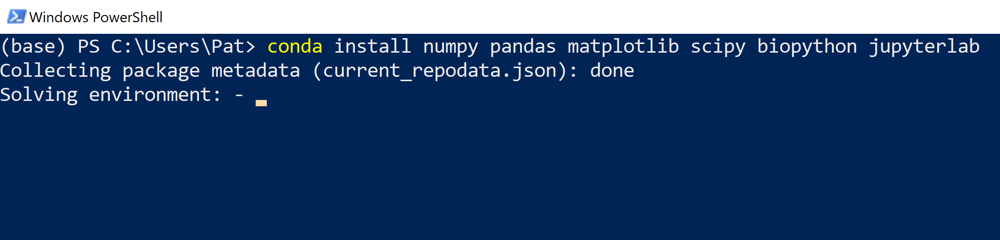
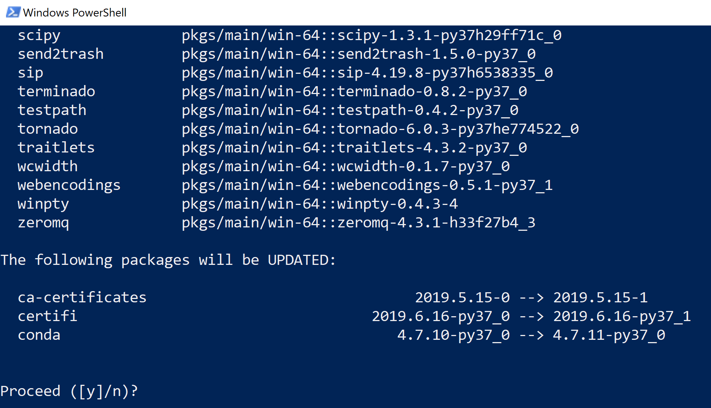
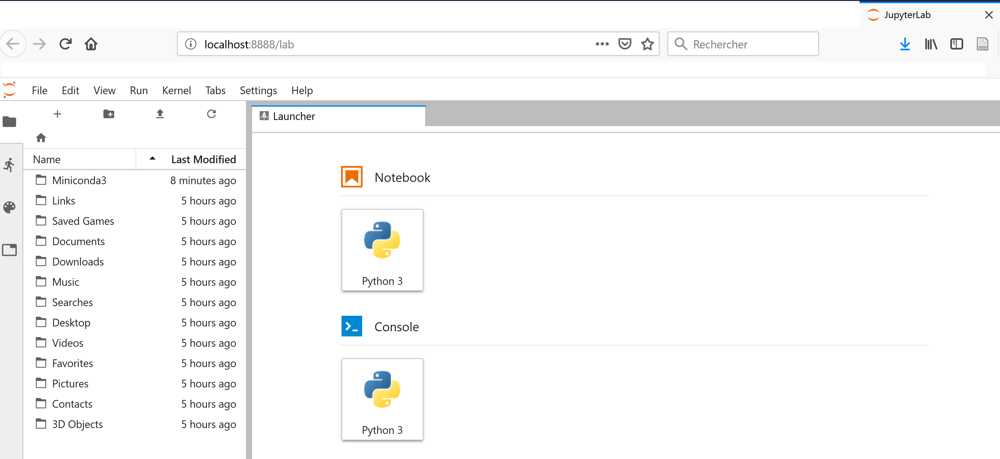

# Installation de Python

Python est déjà présent sous Linux ou Mac OS X et s'installe très facilement sous Windows. Toutefois, on décrit dans cet ouvrage l'utilisation de modules supplémentaires qui sont très utiles en bioinformatique (*NumPy*, *scipy*, *matplotlib*, *pandas*, *biopython*), mais également les *notebooks* Jupyter.

On va donc utiliser un gestionnaire de paquets qui va installer ces modules supplémentaires. On souhaite également que ce gestionnaire de paquets soit disponible pour Windows, Mac OS X et Linux. Fin 2018, il y a deux grandes alternatives :

1. **Anaconda** et **Miniconda** : [Anaconda](https://www.anaconda.com/) est une distribution complète de Python qui contient un gestionnaire de paquets très puissant nommé *conda*. Anaconda installe de très nombreux paquets et outils mais nécessite un espace disque de plusieurs gigaoctets. [Miniconda](https://conda.io/miniconda.html) est une version allégée d'Anaconda, donc plus rapide à installer et occupant peu d'espace sur le disque dur. Le gestionnaire de paquet *conda* est aussi présent dans Miniconda.

2. **Pip** : [pip](https://pip.pypa.io/en/stable/) est le gestionnaire de paquets de Python et qui est systématiquement présent depuis la version 3.4.


## Que recommande-t-on pour l'installation de Python ?

Quel que soit le système d'exploitation, on recommande l'utilisation de Miniconda dont la procédure d'installation est détaillée ci-dessous pour Windows, Mac OS X et Linux. Le gestionnaire de paquets *conda* est très efficace. Il gère la version de Python et les paquets compatibles avec cette dernière très efficacement.

Par ailleurs, on vous recommande vivement la lecture de la section sur les [éditeurs de texte](#les-éditeurs-de-texte). Il est en effet fondamental d'utiliser un éditeur robuste et de savoir le configurer pour "pythonner" efficacement.

Enfin, dans tout ce qui suit, on part du principe que vous installerez Miniconda  **en tant qu'utilisateur**, et non pas en tant qu'administrateur. Autrement dit, vous n'aurez pas besoin de droits spéciaux pour pouvoir installer Miniconda et les autres modules nécessaires. La procédure proposée a été testée avec succès sous Windows (7 et 10), Mac OS C (Mac OS High Sierra version 10.13.6) et Linux (Ubuntu 16.04, Ubuntu 18.04).


## Qu'appelle-t-on le *shell* ?

Dans cet ouvrage, on utilise le terme *shell*. Un *shell* est un interpréteur de commande interactif permettant d'interagir avec l'ordinateur.

On utilisera le *shell* pour lancer l'interpréteur Python.

Pour approfondir la notion de *shell*, vous pouvez consulter les pages Wikipedia :

- le [*shell* Unix](https://fr.wikipedia.org/wiki/Shell_Unix) fonctionnant sous Mac OS X et Linux ;
- le [*shell* Windows *cmd*](https://fr.wikipedia.org/wiki/Cmd) ;
- le [*powershell* Windows](https://fr.wikipedia.org/wiki/Windows_PowerShell) qui est un *shell* beaucoup plus puissant que *cmd* et que l'on vous recommande si vous êtes sous Windows.

Un *shell* possède toujours une invite de commande, c'est-à-dire un message qui s'affiche avant l'endroit où on entre des commandes. Dans tout cet ouvrage, cette invite est représentée systématiquement par le symbole dollar `$`, et ce quel que soit le système d'exploitation.

Par exemple, si on vous demande de lancer l'instruction suivante  :
```
$ python
```

il faudra taper seulement `python` sans le `$` ni l'espace après le `$`.


## Installation de Python avec Miniconda

On vous conseille l'installation de la distribution [Miniconda](https://conda.io/miniconda.html) qui présente l'avantage d'installer Python et un puissant gestionnaire de paquets appelé *conda*.


### Installation de Python avec Miniconda pour Linux

Dans un navigateur internet, ouvrez la page du site Miniconda <https://conda.io/miniconda.html> puis cliquez sur le lien *64-bit (bash installer)* correspondant à Linux et Python 3.7. Bien sur, si votre machine est en 32-bit (ce qui est maintenant assez rare), vous cliquerez sur le lien *32-bit (bash installer)*.

Vous allez télécharger un fichier dont le nom ressemble à quelque chose du type :

`Miniconda3-latest-Linux-x86_64.sh`.

Dans un *shell*, lancez l’installation de Miniconda avec la commande :
```
$ bash Miniconda3-latest-Linux-x86_64.sh
```

Dans un premier temps, validez la lecture de la licence d'utilisation :
```
Welcome to Miniconda3 4.5.11

In order to continue the installation process, please review the license
agreement.
Please, press ENTER to continue
>>>
```
En appuyant sur la touche *Espace* faites défiler la licence d'utilisation puis tapez `yes` puis appuyez sur la touche *Entrée* pour la valider :
```
Do you accept the license terms? [yes|no]
[no] >>> yes
```

Le programme d'installation vous propose ensuite d'installer Miniconda dans le répertoire `miniconda3` dans votre répertoire personnel. Par exemple, dans le répertoire `/home/pierre/miniconda3` si votre nom d'utilisateur est `pierre`. Validez cette proposition en appuyant sur la touche *Entrée* :
```
Miniconda3 will now be installed into this location:
/home/pierre/miniconda3

  - Press ENTER to confirm the location
  - Press CTRL-C to abort the installation
  - Or specify a different location below

[/home/pierre/miniconda3] >>>
```
Le programme d'installation va alors installer Python et le gestionnaire de paquets *conda*.

Cette étape terminée, le programme d'installation vous propose de modifier le fichier de configuration de votre *shell Bash* pour que *conda* soit pris en compte. On vous conseille d'accepter en tapant `yes` puis en appuyant sur la touche *Entrée*.
```
Do you wish the installer to prepend the Miniconda3 install location
to PATH in your /home/pierre/.bashrc ? [yes|no]
[no] >>> yes
```  

L'installation de Miniconda est terminée. L'espace utilisé par Miniconda sur votre disque dur est d'environ 300 Mo.

#### Test de l'interpréteur Python

Ouvrez un nouveau *shell*. À partir de maintenant, lorsque vous taperez la commande `python`, c'est le Python 3 de Miniconda qui sera lancé :
```
$ python
Python 3.7.0 (default, Jun 28 2018, 13:15:42)
[GCC 7.2.0] :: Anaconda, Inc. on linux
Type "help", "copyright", "credits" or "license" for more information.
>>>
```

Quittez Python en tapant la commande `exit()` puis appuyant sur la touche *Entrée*.

#### Test du gestionnaire de paquets *conda*

De retour dans le *shell*, testez si le gestionnaire de paquets *conda* est fonctionnel. Tapez la commande `conda` dans le *shell*, vous devriez avoir la sortie suivante :

```
$ conda
usage: conda [-h] [-V] command ...

conda is a tool for managing and deploying applications, environments and packages.

Options:

positional arguments:
  command
    clean        Remove unused packages and caches.
[...]
```

Si c'est bien le cas, bravo, *conda* et bien installé et vous pouvez passez à la suite (rendez-vous à la section [Installation des modules supplémentaires](#installation-des-modules-supplémentaires)) !

Si par contre, vous obtenez un message du type :

```
$ conda
-bash: conda : commande introuvable
```

cela signifie qu'une erreur s'est produite pendant l'installation ou que votre variable d'environnement `PATH` n'a pas été modifiée correctement. Vérifiez qu'il y a bien ces deux lignes dans votre `~/.bashrc` :

```
# added by Miniconda3 installer
export PATH="/home/pierre/miniconda3/bin:$PATH"
```

où `/home/pierre` représente votre répertoire utilisateur. Si ces lignes n'y sont pas, ajoutez les, quittez le *shell* et relancez la commande `conda`. Si cela ne fonctionne toujours pas, il est probable que l'installation ne se soit pas passée comme prévu et vous pouvez recommencer l'installation depuis le début.

#### Désinstallation de Miniconda

Si vous souhaitez supprimer Miniconda, rien de plus simple, il suffit de suivre ces deux étapes :

1. Supprimer le répertoire de Miniconda. Par exemple pour l'utilisateur `pierre` :
    ```
    $ rm -rf /home/pierre/miniconda3
    ```
2. Restaurer votre fichier de configuration du *shell Bash* en utilisant la copie de sauvegarde qu'a créée Miniconda lors de l'installation :
    ```
    $ mv .bashrc-miniconda3.bak .bashrc
    ```


### Installation de Python avec Miniconda pour Mac OS X

Dans un navigateur internet, ouvrez la page du site Miniconda <https://conda.io/miniconda.html> puis cliquez sur le lien *64-bit (bash installer)* correspondant à Mac OS X et Python 3.7. Sous Mac, seule la version 64-bit est disponible.

Vous allez télécharger un fichier dont le nom ressemble à quelque chose du type :

`Miniconda3-latest-MacOSX-x86_64.sh`.

Le système d'exploitation Mac OS X étant basé sur Unix, la suite de la procédure est en tout point identique à la procédure détaillée à la [section précédente](#installation-de-python-avec-miniconda-sous-linux) pour Linux.

Donc, lancez la commande :

```
$ bash Miniconda3-latest-MacOSX-x86_64.sh
```

puis suivez les mêmes instructions que dans la section précédente (la seule petite subtilité est pour le chemin, choisissez `/User/votre_nom_utilisateur/miniconda3` sous Mac au lieu de `/home/votre_nom_utilisateur/miniconda3` sous Linux).


### Installation de Python avec Miniconda pour Windows 7 et 10

Dans cette section, on détailler l'installation de Miniconda sous Windows.

open-box-warn

On part du principe qu'aucune version d'Anaconda, Miniconda, ou encore de Python "classique" (obtenue sur le [site officiel de Python](https://www.python.org/downloads/)) n'est installée sur votre ordinateur. Si tel est le cas, on recommande vivement de la désinstaller pour éviter des conflits de version.

Par ailleurs, la procédure détaillée ci-dessous rendra la version de Miniconda **prioritaire** sur toute autre version de Python (raison pour laquelle nous vous demandons de cocher une case non recommandée par l'installateur, cf. Figure @fig:install_miniconda5bis). Si vous désinstallez toute version de Python existante, tout se passera sans problème.

close-box-warn

Dans un navigateur internet, ouvrez la page du site Miniconda <https://conda.io/miniconda.html> puis cliquez sur le lien *64-bit (exe installer)* correspondant à Windows et Python 3.7. Bien sur, si votre machine est en 32-bit (ce qui est maintenant assez rare), vous cliquerez sur le lien *32-bit (exe installer)*.

Vous allez télécharger un fichier dont le nom ressemble à quelque chose du type :

`Miniconda3-latest-Windows-x86_64.exe`.

Une fois téléchargé, double-cliquez sur ce fichier, cela lancera l'installateur de Miniconda :

{ #fig:install_miniconda1 width=40% }

Cliquez sur *Next*, puis vous arrivez sur :

{ #fig:install_miniconda2 width=40% }

Lisez la licence et (si vous êtes d'accord) cliquez sur *I agree*. Vous aurez ensuite :

{ #fig:install_miniconda3 width=40% }

Gardez le choix de l'installation seulement pour vous (case cochée à *Just me (recommended)*), puis cliquez sur *Next*. Vous aurez ensuite :

{ #fig:install_miniconda4 width=40% }

L'installateur vous demande où installer Miniconda, on vous recommande de laisser le choix par défaut (ressemblant à `C:\Users\votre_nom_utilisateur\Miniconda3`). Cliquez sur *Next*, vous arriverez sur :

{ #fig:install_miniconda5 width=40% }

Gardez la case *Register Anaconda as my default Python 3.7* cochée et cochez la case *Add Anaconda to my PATH environment variable*. En cochant cette dernière option, le texte s'est mis en rouge car ce n'est pas une option recommandée (cf. explications ci-dessus) :

{ #fig:install_miniconda5bis width=40% }

Cliquez ensuite sur *Install*, l'installation se lance et durera quelques minutes :

{ #fig:install_miniconda6 width=40% }

À la fin, vous obtiendrez cette fenêtre :

{ #fig:install_miniconda7 width=40% }

Cliquez sur *Next*, vous arriverez sur la dernière fenêtre :

{ #fig:install_miniconda8 width=40% }

Décochez les cases *Learn more about Anaconda Cloud* et *Learn how to get started with Anaconda* et cliquez sur *Finish*. Miniconda est maintenant installé.

#### Test de l'interpréteur Python

En cliquant sur la touche Windows de la barre de tâches, un nouveau menu apparait sous le nom :

{ #fig:miniconda_launch_shell width=40% }

Cliquez sur l'icône *Anaconda Prompt*, cela va lancer un *shell* Anaconda. Ce *shell* devrait avoir un fond noir, mais vous pouvez régler les couleurs de fond, du texte ainsi que les polices en cliquant sur la petite icône représentant un terminal dans la barre de titre. Par exemple, nous avons redéfini la couleur de fond en blanc dans la Figure @fig:miniconda_test_interpreter). Une fois vos réglages choisis, vous allez pouvoir tester si Python est bien installé en lançant l'interpréteur Python. Il suffit pour cela de taper la commande `python` dans le *shell* Anaconda :

{ #fig:miniconda_test_interpreter width=40% }

Si tout s'est bien passé, vous devriez avoir l'affichage suivant :

```
(base) C:\Users\Pat>python
Python 3.7.0 (default, Jun 28 2018, 08:04:48) [...]
Type "help", "copyright", "credits" or "license" for more information.
>>>
```

Cela signifie que vous êtes bien dans l'interpréteur Python. À partir de là vous pouvez taper `exit()` puis appuyer sur la touche *Entrée* pour sortir de l'interpréteur Python.

#### Test du gestionnaire de paquets *conda*

Une fois revenu dans le *shell*, tapez la commande `conda`, vous devriez obtenir :

```
$ conda
usage: conda [-h] [-V] command ...

conda is a tool for managing and deploying applications, environments and packages.

Options:

positional arguments:
  command
    clean        Remove unused packages and caches.
[...]
```

Si c'est le cas, bravo, *conda* est bien installé et vous pouvez passez à la suite (rendez-vous à la section [Installation des modules supplémentaires](#installation-des-modules-supplémentaires)) !


#### Désinstallation de Miniconda

Si vous souhaitez désinstaller Miniconda, rien de plus simple. Dans un explorateur, dirigez-vous dans le répertoire où vous avez installé Miniconda (dans notre exemple il s'agit de `C:\Users\votre_nom_utilisateur\Miniconda3`). Attention, si votre Windows est installé en français, il se peut qu'il faille cliquer sur `C:\` puis sur `Utilisateurs` plutôt que `Users` comme montré ici :

{ #fig:uninstall_miniconda width=40% }

Cliquez ensuite sur le fichier `Uninstall-Miniconda3.exe`. Vous aurez alors l'écran suivant :

{ #fig:uninstall_miniconda2 width=40% }

Cliquez sur *Next*, puis à l'écran suivant cliquez sur *Uninstall* :

{ #fig:uninstall_miniconda3 width=40% }

Le désinstallateur se lancera alors (cela peut prendre quelques minutes) :

{ #fig:uninstall_miniconda4 width=40% }

Une fois la désinstallation terminée, cliquez sur *Next* :

{ #fig:uninstall_miniconda5 width=40% }

Puis enfin sur *Finish* :

{ #fig:uninstall_miniconda6 width=40% }

À ce point, Miniconda est bien désinstallé.


## Utilisation de conda pour installer les modules complémentaires

### Installation des modules supplémentaires

Cette étape sera commune pour les trois systèmes d'exploitation. À nouveau, lancez un *shell* (c'est-à-dire *Anaconda Prompt* sous Windows ou un terminal pour Mac OSX ou Linux).

Dans le *shell*, tapez la ligne suivante puis appuyez sur la touche *Entrée* :

```
$ conda install numpy pandas matplotlib scipy biopython
```

Cette commande va lancer l'installation des modules externes *NumPy*, *pandas*, *matplotlib* et *scipy* et *BioPython*. Ces modules vont être téléchargés depuis internet par *conda*, il faut bien-sûr que votre connexion internent soit fonctionnelle. Au début, *conda* va déterminer les versions des paquets à télécharger en fonction de la version de Python ainsi que d'autres paramètres (cela prend une à deux minutes). Cela devrait donner la sortie suivante (copie d'écran prise sous Windows avec le *prompt* Anaconda) :

{ #fig:miniconda_install_packages1 width=40%}

Une fois que les versions des paquets ont été déterminées, *conda* vous demande confirmation avant de démarrer le téléchargement :

{ #fig:miniconda_install_packages2 width=40%}

Tapez `y` puis appuyez sur la touche *Entrée* pour confirmer. S'en suit alors le téléchargement et l'installation de tous les packages (cela prendra quelques minutes) :

{ #fig:miniconda_install_packages3 width=40%}

Une fois que tout cela est terminé, vous récupérez la main dans le *shell* :

{ #fig:miniconda_install_packages4 width=40%}

Ensuite, on va installer deux autres modules très important, `jupyter` et `biopython`. En général, il existe plusieurs endroits, qu'on appelle des dépôts, où on peut retrouver un paquet donné. Les développeurs de `jupyter` et `biopython` recommandent d'utiliser le dépôt nommé *conda forge*. Pour préciser un dépôt, il faut utiliser l'option `-c` de *conda*. Lancez ainsi la commande suivante :

```
$ conda install -c conda-forge jupyterlab biopython
```

*Conda* vous demandera à nouveau une confirmation, puis le téléchargement et l'installation prendront plusieurs minutes.


### Test des modules supplémentaires

Pour tester la bonne installation des modules, lancez l'interpréteur Python :

```
$ python
```

Puis tapez les lignes suivantes :

```
import numpy
import scipy
import Bio
import matplotlib
import pandas
```

Vous devriez obtenir la sortie suivante (ici sous Windows) :

{ #fig:miniconda_test_packages width=40% }

Si aucune erreur ne s'affiche et que vous récupérez la main dans l'interpréteur, bravo, ces modules sont bien installés. Quittez l'interpréteur Python en tapant la commande `exit()` puis en appuyant sur la touche *Entrée*.

Vous êtes de nouveau dans le *shell*. Nous allons maintenant pouvoir tester Jupyter. Tapez dans le *shell* :

```
$ jupyter lab
```

Cette commande devrait ouvrir votre navigateur internet par défaut et lancer Jupyter :

{ #fig:miniconda_test_jupyter width=40% }

Pour quitter Jupyter, allez dans le menu *File* puis sélectionnez *Quit*. Vous pourrez alors fermer l'onglet de Jupyter. Pendant ces manipulations dans le navigateur, de nombreuses lignes ont été affichées dans l'interpréteur :

```
(base) C:\Users\Pat>jupyter lab
[I 18:45:13.435 LabApp] JupyterLab extension loaded from C:\Users\Pat\Miniconda3\lib\site-packages\jupyterlab
[I 18:45:13.435 LabApp] JupyterLab application directory is C:\Users\Pat\Miniconda3\share\jupyter\lab
[...]
[I 18:48:41.598 LabApp] Shutting down on /api/shutdown request.
[I 18:48:41.598 LabApp] Shutting down 1 kernel
[I 18:48:41.942 LabApp] Kernel shutdown: aa5bb931-8ac6-4008-adc2-2d5b3b72c105

(base) C:\Users\Pat>
```

Il s'agit d'un comportement normal. Quand Jupyter est actif, vous n'avez plus la main dans l'interpréteur et tous ces messages s'affichent. Une fois que vous quittez Jupyter, vous devriez récupérer la main dans l'interpréteur. Si ce n'est pas le cas, pressez deux fois la combinaison de touches *Ctrl* + *C*

Si tous ces tests ont bien fonctionné, bravo, vous avez installé correctement Python avec Miniconda ainsi que tous les modules qui seront utilisés pour ce cours. Vous pouvez quitter le *shell* en tapant `exit` puis en appuyant sur la touche *Entrée* et aller faire une pause !


### Un mot sur pip pour installer des modules complémentaires

*Conseil* : Pour les débutants, vous pouvez sauter cette section.

Comme indiqué au début de ce chapitre, [pip](https://pip.pypa.io/en/stable/) est un gestionnaire de paquets pour Python et permet d'installer des modules externes. *Pip* est également présent dans Miniconda, donc utilisable et parfaitement fonctionnel. Vous pouvez vous poser la question "Pourquoi utiliser le gestionnaire de paquets *pip* si le gestionnaire de paquets `conda` est déjà présent ?". La réponse est simple, certains modules ne sont présents que sur les dépôts *pip*. Si vous souhaitez les installer il  faudra impérativement utiliser *pip*. Inversement, certains modules ne sont présent que dans les dépôts de *conda*. Toutefois, pour les modules classiques (comme *NumPy*, *scipy*, etc), tout est gérable avec *conda*.

**Sauf cas exceptionnel, on vous conseille l'utilisation de *conda* pour gérer l'installation de modules supplémentaires**.

Si vous souhaitez installer un package qui n'est pas présent sur un dépôt *conda* avec *pip*, la syntaxe est très simple :

```
$ pip install nom_du_package
```

## Choisir un bon éditeur de texte


### Installation et réglage de gedit sous Linux

Pour Linux, on vous recommande l'utilisation de l'éditeur de texte *gedit* qui a les avantages d'être simple à utiliser et présent dans la plupart des distributions Linux.

Si *gedit* n'est pas installé, vous pouvez l'installer avec la commande
```
$ sudo apt install -y gedit
```
Il faudra entrer votre mot de passe utilisateur puis valider en appuyant sur la touche *Entrée*.

Pour lancer cet éditeur, tapez la commande `gedit` dans un *shell* ou cherchez *gedit* dans le lanceur d'applications. Vous devriez obtenir une fenêtre similaire à celle de la figure @fig:gedit1.

{ #fig:gedit1 width=40% }

On configure ensuite *gedit* pour que l'appuie sur la touche *Tab* corresponde à une indentation de 4 espaces, comme recommandée par la PEP 8 (chapitre 15 *Bonnes pratiques en programmation Python*). Pour cela, cliquez sur l'icône en forme de 3 petites barres horizontales en haut à droite de la fenêtre de *gedit*, puis sélectionnez *Préférences*. Dans la nouvelle fenêtre qui s'ouvre, sélectionnez l'onglet *Éditeur* puis fixez la largeur des tabulations à 4 et cochez la case *Insérer des espaces au lieu des tabulations* (comme sur la figure #fig:gedit2).

Si vous le souhaitez, vous pouvez également cochez la case *Activer l'indentation automatique* qui indentera automatiquement votre code quand vous êtes dans un bloc d'instructions. Fermez la fenêtre de paramètres une fois la configuration terminée.

{ #fig:gedit2 width=40% }


### Installation et réglage de Notepad++ sous Windows

Sous Windows, on vous recommande l'excellent éditeur [notepad++](https://notepad-plus-plus.org/download). Une fois cet éditeur installé, il va falloir le régler (paramètres -> préférences) [penser à utf-8, tab = 4 espaces]


### Installation et réglage de TextWrangler/BBedit sous Mac

## Comment se mettre dans le bon répertoire dans le shell

Pour apprendre Python, nous allons devoir écrire des scripts, les enregistrer dans un répertoire, puis les exécuter avec l'interpréteur Python. Il faut pour cela être capable d'ouvrir un *shell* et de se mettre dans le répertoire où se trouve ce script.

Notre livre n'est pas un cours d'Unix mais il convient au moins de savoir se déplacer dans l'arborescence avant de lancer Python. Sous Linux et sous Mac il est donc fondamental de connaître les commandes Unix `cd`, `pwd`, `ls` et la signification de `..`.

Sous Windows, il existe une astuce très pratique. Lorsqu'on utilise l'explorateur Windows et que l'on est dans un répertoire donné, par exemple :

{ #fig:lancement_shell_Windows1 width=50% }

Il suffit de taper `powershell` (ou bien `cmd`) dans la barre qui indique le chemin :

{ #fig:lancement_shell_Windows2 width=50% }

puis on appuie sur entrée et le *powershell* (ou bien le *shell* `cmd`) se lance en étant directement dans le bon répertoire :

{ #fig:lancement_shell_Windows3 width=40% }

Dans ce *powershell*, nous avons lancé la commande `ls` qui affiche le nom du répertoire courant (celui dans lequel on se trouve, dans notre exemple `D:\PAT\Python`) ainsi que les fichiers s'y trouvant (ici il n'y a qu'un fichier : `test.py`). Ensuite nous avons lancé l'exécution de ce fichier `test.py` en tapant `python test.py`.

**A votre tour !**

Pour tester si vous avez bien compris, ouvrez votre éditeur favori, tapez les lignes suivantes puis enregistrez ce fichier avec le nom `test.py` dans le répertoire de votre choix.

```
import tkinter as tk

racine = tk.Tk()
label = tk.Label(racine, text="J'adore Python !")
bouton = tk.Button(racine, text="Quitter", command=racine.quit)
bouton["fg"] = "red"
label.pack()
bouton.pack()
racine.mainloop()
print("C'est fini !")
```

Ouvrez un *shell* et déplacez-vous dans le répertoire où se trouve `test.py`. Lancez le script avec l'interpréteur Python :

```
$ python test.py
```

Si vous avez fait les choses correctement, cela devrait afficher une petite fenêtre avec un message « J'adore Python ! » et un bouton *Quitter*.


## Python web et mobile

Si vous ne pouvez ou ne souhaitez pas installer Python sur votre ordinateur (quel dommage !), des solutions alternatives s'offrent à vous.

Des sites internet vous proposent l'équivalent d'un interpréteur Python utilisable depuis votre navigateur web :

- [repl.it](https://repl.it/languages/python3) ;
- [Tutorials Point](https://www.tutorialspoint.com/execute_python3_online.php) ;
- et bien sur l'incontournable [Python Tutor](http://pythontutor.com/visualize.html#mode=edit).


Des applications mobiles vous permettent aussi de « pythonner » avec votre smartphone :

- [Pydroid 3](https://play.google.com/store/apps/details?id=ru.iiec.pydroid3) pour Android ;
- [Pythonista 3](https://itunes.apple.com/us/app/pythonista-3/id1085978097) pour iOS (payant).

Soyez néanmoins conscient que ces applications web ou mobiles peuvent être limitées, notamment sur leur capacité à installer des modules supplémentaires et à gérer les fichiers.
