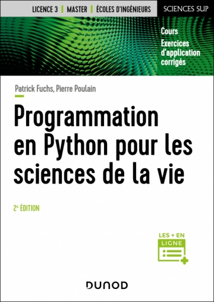

# Avant-propos {.unnumbered}

## Quelques mots sur l'origine de ce cours {.unnumbered}

Ce cours a été conçu à l'origine pour les étudiants débutants en programmation Python des filières de biologie et de biochimie de l'université Paris Diderot - Paris 7, devenue [Université Paris Cité](https://www.u-paris.fr/) ; et plus spécialement pour les étudiants du master Biologie Informatique.

Si vous relevez des erreurs à la lecture de ce document, merci de nous les signaler.

Le cours est disponible en version [HTML](https://python.sdv.u-paris.fr/index.html)
et [PDF](https://python.sdv.u-paris.fr/cours-python.pdf).

## Remerciements {.unnumbered}

Merci à tous les contributeurs, occasionnels ou réguliers, entre autre : Jennifer Becq, Benoist Laurent, Hubert Santuz, Virginie Martiny, Romain Laurent, Benjamin Boyer, Jonathan Barnoud, Amélie Bâcle, Thibault Tubiana, Romain Retureau, Catherine Lesourd, Philippe Label, Rémi Cuchillo, Cédric Gageat, Philibert Malbranche, Mikaël Naveau, Alexandra Moine-Franel, Dominique Tinel, et plus généralement les promotions des masters de biologie informatique et *in silico drug design*, ainsi que du diplôme universitaire en bioinformatique intégrative.

Nous remercions tout particulièrement Sander Nabuurs pour la première version de ce cours remontant à 2003, Denis Mestivier pour les idées de certains exercices et Philip Guo pour son site [*Python Tutor*](http://pythontutor.com/).

Enfin, merci à vous tous, les curieux de Python, qui avez été nombreux à nous envoyer des retours sur ce cours, à nous suggérer des améliorations et à nous signaler des coquilles. Cela rend le cours vivant et dynamique, continuez comme ça !

De nombreuses personnes nous ont aussi demandé les corrections des exercices. Nous ne les mettons pas sur le site afin d'éviter la tentation de les regarder trop vite, mais vous pouvez nous écrire et nous vous les enverrons.

## Le livre {.unnumbered}

Ce cours est également publié aux éditions Dunod sous le titre « [Programmation en Python pour les sciences de la vie](https://www.dunod.com/sciences-techniques/programmation-en-python-pour-sciences-vie-0) ». Le livre en est à sa 2e édition, vous pouvez vous le procurer dans toutes les bonnes librairies.

{ width=30% }

Afin de promouvoir le partage des connaissances et le logiciel libre, nos droits d'auteurs provenant de la vente de cet ouvrage sont reversés à deux associations : [Wikimédia France](https://www.wikimedia.fr/) qui s'occupe notamment de l'encyclopédie libre Wikipédia et [NumFOCUS](https://numfocus.org/) qui soutient le développement de logiciels libres scientifiques et notamment l'écosystème scientifique autour de Python.
