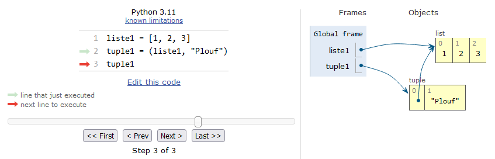
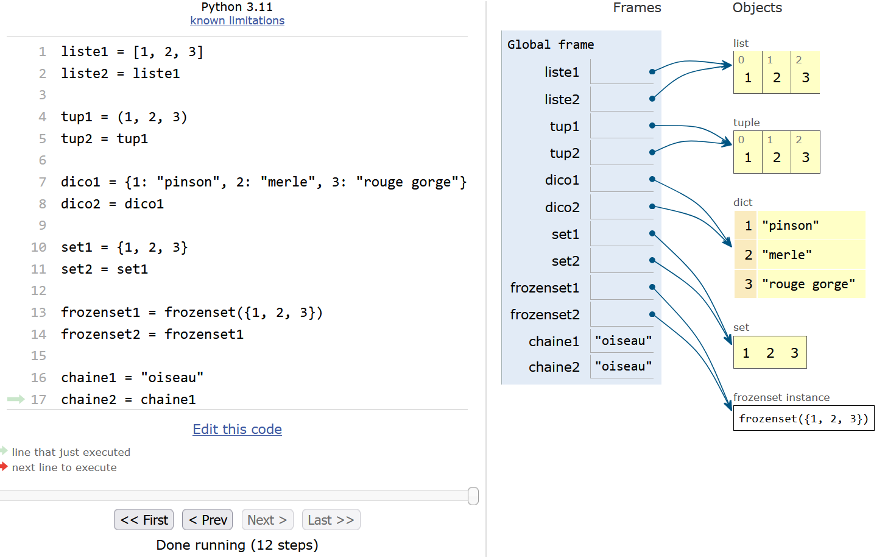

# Conteneurs

Dans ce chapitre, nous allons aborder la notion de conteneur, revenir sur certaines propriétés avancées des dictionnaires et tuples, et enfin aborder les types *set* et *frozenset*. Pour les débutants, ce chapitre aborde des notions relativement avancées. Avant de vous lancer, nous vous conseillons vivement de bien maitriser les chapitres 4 *Listes* et 12 *Plus sur les listes*, ainsi que le chapitre 8 *Dictionnaires et tuples*, d'avoir effectué un maximum d'exercices, et de vous sentir à l'aise avec toutes les notions abordées jusque là.

## Généralités

### Définition et propriétés

open-box-def

\index{conteneur}

Un **conteneur** (*container* en anglais) est un nom générique pour définir un objet Python qui contient une collection d'autres objets. 

close-box-def

Les conteneurs que nous connaissons depuis le début de ce cours sont les listes, les chaînes de caractères, les dictionnaires et les tuples. Même si on ne l'a pas vu explicitement, les objets de type *range* sont également des conteneurs.

Dans la suite de cette rubrique, nous allons examiner les différentes propriétés des conteneurs. À la fin de ce chapitre, nous ferons un tableau récapitulatif de ces propriétés.

Examinons d'abord les propriétés qui caractérisent tous les types de conteneur.

\index{in@in (opérateur)}

- Capacité à supporter le **test d'appartenance**. Souvenez-vous, il permet de vérifier si un élément était présent dans une liste. Cela fonctionne donc aussi sur les chaînes de caractères ou tout autre conteneur :

```python
>>> liste1 = [4, 5, 6]
>>> 4 in liste1
True
>>> "to" in "toto"
True
```

- Capacité à supporter la fonction `len()` renvoyant la longueur du conteneur.

Voici d'autres propriétés générales que nous avons déjà croisées. Un conteneur peut être :

\index{ordonne@ordonné}
\index{indexable}
\index{iterable@itérable}

- **Ordonné** (*ordered* en anglais) : il y a un ordre précis des éléments ; cet ordre correspond à celui utilisé lors de la création ou de la modification du conteneur (si cela est permis) ; ce même ordre est utilisé lorsqu'on itère dessus.
- **Indexable** (*subscriptable* en anglais) : on peut retrouver un élément par son indice (c'est-à-dire sa position dans le conteneur) ou plusieurs éléments avec une tranche ; en général, tout conteneur indexable est ordonné.
- **Itérable** (*iterable* en anglais) : on peut faire une boucle dessus. 

Certains conteneurs sont appelés objets séquentiels ou séquence.

open-box-def

\index{objet sequentiel@objet séquentiel}

Un **objet séquentiel** ou **séquence** est un conteneur itérable, ordonné et indexable. Les objets séquentiels sont les listes, les chaînes de caractères, les objets de type *range*, ainsi que les tuples.

close-box-def

Une autre propriété importante que l'on a déjà croisée, et qui nous servira dans ce chapitre, concerne la possibilité ou non de modifier un objet.

\index{immutabilite@immutabilité}

- Un objet est dit **non modifiable** lorsqu'on ne peut pas le modifier, ou lorsqu'on ne peut pas en modifier un de ses éléments si c'est un conteneur. On parle aussi d'[objet immuable](https://fr.wikipedia.org/wiki/Objet_immuable) (*immutable object* en anglais). Cela signifie qu'une fois créé, Python ne permet plus de le modifier par la suite.

Qu'en est-il des objets que nous connaissons ? Les listes sont modifiables, on peut modifier un ou plusieurs de ses éléments et ajouter ou retirer un élément. Les dictionnaires sont modifiables : pour une clé donnée, on peut changer la valeur correspondante et ajouter ou retirer un couple clé/valeur. Tous les autres types que nous avons vus précédemment sont quant à eux non modifiables : les chaînes de caractères ou *strings*, les tuples, les objets de type *range*, mais également des objets qui ne sont pas des conteneurs comme les entiers, les *floats* et les booléens. 

On comprend bien l'immutabilité des *strings* comme vu au chapitre 11 *Plus sur les chaînes de caractères*, mais c'est moins évident pour les entiers, *floats* ou booléens. Nous allons démontrer cela, mais avant nous avons besoin de définir la notion d'identifiant d'un objet.

open-box-def

\index{identifiant@identifiant (d'un objet)}

L'**identifiant** d'un objet est un nombre entier qui est garanti constant pendant toute la durée de vie de l'objet. Cet identifiant est en général unique pour chaque objet. Toutefois, pour des raisons d'optimisation, Python crée parfois le même identifiant pour deux objets non modifiables différents qui ont la même valeur. L'identifiant peut être assimilé à l'adresse mémoire de l'objet qui, elle aussi, est unique. En Python, on utilise la fonction interne `id()` qui prend en argument un objet et renvoie son identifiant.

close-box-def

Maintenant que l'identifiant est défini, regardons l'exemple suivant qui montre l'immutabilité des entiers :

\index{id@id()}

```python
>>> var = 4
>>> id(var)
140318876873440
>>> var = 5
>>> id(var)
140318876873472
```

Ligne 1 on définit l'entier `var` puis on regarde son identifiant. Ligne 4, on pourrait penser que l'on modifie `var`. Toutefois, on voit que son identifiant ligne 6 est différent de la ligne 3. En fait, l'affectation ligne 4 `var = 5` écrase l'ancienne variable `var` et en crée une nouvelle, ce n'est pas la valeur de `var` qui a été changée puisque l'identifiant n'est plus le même. Le même raisonnement peut être tenu pour les autres types numériques comme les *floats* et booléens. Si on regarde maintenant ce qu'il se passe pour une liste :

```python
>>> liste1 = [1, 2, 3]
>>> id(liste1)
140318850324832
>>> liste1[1] = -15
>>> id(liste1)
140318850324832
>>> liste1.append(5)
>>> id(liste1)
140318850324832
```

La liste `liste1` a été modifiée ligne 4 (changement de l'élément d'indice 1) et ligne 7 (ajout d'un élément). Pour autant, l'identifiant de cette liste est resté identique tout du long. Ceci démontre la mutabilité des listes : quelle que soit la manière dont on modifie une liste, celle-ci garde le même identifiant.

\index{hachabilite@hachabilité (d'un objet)}

- Une dernière propriété importante est la capacité d'un conteneur (ou tout autre objet Python) à être **hachable**.

open-box-def

Un objet Python est dit **hachable** (*hashable* en anglais) s'il est possible de calculer une valeur de hachage sur celui-ci avec la fonction interne `hash()`. En programmation, la valeur de hachage peut être vue comme une empreinte numérique de l'objet. Elle est obtenue en passant l'objet dans une fonction de hachage et dépend du contenu de l'objet. En Python, cette empreinte est, comme dans la plupart des langages de programmation, un entier. Au sein d'une même session Python, deux objets hachables qui ont un contenu identique auront strictement la même valeur de hachage.

close-box-def

open-box-warn

\index{hash@hash()}

La valeur de hachage d'un objet renvoyée par la fonction `hash()` n'a pas le même sens que son identifiant renvoyé par la fonction `id()`. La valeur de hachage est obtenue en « moulinant » le contenu de l'objet dans une fonction de hachage. L'identifiant est quant à lui attribué par Python à la création de l'objet. Il est constant tout le long de la durée de vie de l'objet, un peu comme une carte d'identité. Tout objet a un identifiant, mais il doit être hachable pour avoir une valeur de hachage.

close-box-warn

open-box-more

Pour aller plus loin, vous pouvez consulter la [page Wikipedia sur les fonctions de hachage](https://fr.wikipedia.org/wiki/Fonction_de_hachage). 

close-box-more

Pourquoi évoquer cette propriété de hachabilité ? D'abord, parce qu'elle est étroitement liée à l'immutabilité. En effet, un objet non modifiable est la plupart du temps hachable. Cela permet de l'identifier **en fonction de son contenu**. Par ailleurs, l'hachabilité est une implémentation qui permet un accès rapide aux éléments des conteneurs de type dictionnaire ou *set* (cf. rubriques suivantes).

Les objets hachables sont les chaînes de caractères, les entiers, les *floats*, les booléens, les objets de type *range*, les tuples (sous certaines conditions) et les *frozensets* ; par contre, les listes, les *sets* et les dictionnaires sont non hachables. Les *sets* et *frozensets* seront vus plus bas dans ce chapitre.

Voici un exemple :

```python
>>> hash("Plouf")
5085648805260210718
>>> hash(5)
5
>>> hash(3.14)
322818021289917443
>>> hash([1, 2, 3])
Traceback (most recent call last):
  File "<stdin>", line 1, in <module>
TypeError: unhashable type: 'list'
```

Les valeurs de hachage renvoyées par la fonction `hash()` de Python sont systématiquement des entiers. Par contre, Python renvoie une erreur pour une liste, car elle est non hachable.

### Conteneurs de type *range*

\index{range@range (type de variable)}

Revenons rapidement sur les objets de type *range*. Jusqu'à maintenant, on s'en est servi pour faire des boucles ou générer des listes de nombres. Toutefois, on a vu ci-dessus qu'ils étaient aussi des conteneurs. Ils sont ordonnés, indexables, itérables, hachables et non modifiables :

```python
>>> range1 = range(3)
>>> range1[0]
0
>>> range1[0:1]
range(0, 1)
>>> for element in range1:
...     print(element)
...
0
1
2
>>> range1[2] = 10
Traceback (most recent call last):
  File "<stdin>", line 1, in <module>
TypeError: 'range' object does not support item assignment
>>> hash(range1)
5050907061201647097
```

La tentative de modification d'un élément ligne 12 conduit à la même erreur que lorsqu'on essaie de modifier un caractère d'une chaîne de caractères. Comme pour la plupart des objets Python non modifiables, les objets de type *range* sont hachables.

## Plus sur les dictionnaires

Nous revenons sur les dictionnaires qui, on l'a vu, sont des conteneurs de correspondance où chaque valeur est associée à une clé plutôt qu'un indice. Nous allons voir certaines propriétés avancées des dictionnaires, notamment comment trier par clé ou par valeur.

### Objets utilisables comme clé

Toutes les clés de dictionnaire vues dans le chapitre 8 *Dictionnaires et tuples* et utilisées jusqu'à présent étaient des chaînes de caractères. Toutefois, on peut utiliser d'autres types d'objets comme des entiers, des *floats*, voire des tuples, cela peut s'avérer parfois très utile. Une règle est toutefois requise : les objets utilisés comme clé doivent être **hachables** (voir la rubrique précédente pour la définition).

Pourquoi les clés doivent être des objets hachables ? C'est la raison d'être des dictionnaires qui d'ailleurs sont aussi appelés [table de hachage](https://fr.wikipedia.org/wiki/Table_de_hachage) dans d'autres langages, comme Perl. Convertir chaque clé en sa valeur de hachage permet un accès très rapide à chacun des éléments du dictionnaire, ainsi que des comparaisons de clés entre dictionnaires extrêmement efficaces. Même si on a vu que deux objets pouvaient avoir la même valeur de hachage, par exemple `a = 5` et `b = 5`, on ne peut mettre qu'une seule fois la clé `5`. Ceci assure que deux clés d'un même dictionnaire ont forcément une valeur de hachage différente.

Pouvoir utiliser autre chose qu'une chaîne de caractères comme clé peut se révéler très pratique. Par exemple, pour une protéine ou un peptide, on pourrait concevoir d'utiliser comme clé le numéro de résidu, et comme valeur le nom de résidu. Imaginons par ailleurs que nous commencions à compter le premier acide aminé à 3 (souvent les fichiers PDB ne commence pas à 1 pour le premier acide aminé). Par exemple :

```python
>>> sequence = {3: 'S', 4: 'E', 5: 'Q', 6: 'P', 7: 'E', 8: 'P', 9: 'T'}
>>> sequence[5]
'Q'
>>> sequence[9]
'T'
>>> for num, res in sequence.items():
...     print(num, res)
...
3 S
4 E
5 Q
6 P
7 E
8 P
9 T
```

Vous voyez l'énorme avantage, d'utiliser comme clé le numéro de résidu. Avec une liste ou une chaîne de caractère, l'indiçage commence à zéro. Ainsi, il faudrait utiliser les indices 2 et 6 pour retrouver respectivement les acides aminés 5 et 9 :

```python
>>> sequence = ['S', 'E', 'Q', 'P', 'E', 'P', 'T']
>>> sequence[2]
'Q'
>>> sequence[6]
'T'
```

### Destruction d'une paire clé/valeur

\index{del@del (instruction)}

Comme pour tous les objets Python, l'instruction `del` permet de détruire un couple clé/valeur :

```python
>>> dico = {'nom': 'girafe', 'taille': 5.0, 'poids': 1100}
>>> del dico["nom"]
>>> dico
{'taille': 5.0, 'poids': 1100}
```

Pour les listes, on utilise l'indice entre crochet pour détruire l'élément, par exemple `del liste[2]`. Ici, on utilise la clé.

### Tri par clés

\index{tri dictionnaire@tri (de dictionnaire)}

On peut utiliser la fonction `sorted()` vue précédemment avec les listes pour trier un dictionnaire par ses clés :

```python
>>> ani2 = {'nom': 'singe', 'taille': 1.75, 'poids': 70}
>>> sorted(ani2)
['nom', 'poids', 'taille']
```

Les clés sont triées ici par ordre alphabétique.

### Tri par valeurs

Pour trier un dictionnaire par ses valeurs, il faut utiliser la fonction `sorted()` avec l'argument `key` :

```python
>>> dico = {"a": 15, "b": 5, "c":20}
>>> sorted(dico, key=dico.get)
['b', 'a', 'c']
```

L'argument `key=dico.get` indique explicitement qu'il faut réaliser le tri par les valeurs du dictionnaire. On retrouve la méthode `.get()` vue au chapitre 8 *Dictionnaires et tuples*, mais sans les parenthèses : `key=dico.get`, mais pas `key=dico.get()`. Une fonction ou méthode passée en argument sans les parenthèses est appelée *callback*, nous reverrons cela en détail dans le chapitre 25 *Fenêtres graphiques et Tkinter* (en ligne).

Attention, ce sont les clés du dictionnaire qui sont renvoyées, pas les valeurs. Ces clés sont cependant renvoyées dans un ordre qui permet d'obtenir les clés triées par ordre croissant :

```python
>>> dico = {"a": 15, "b": 5, "c":20}
>>> for key in sorted(dico, key=dico.get):
...     print(key, dico[key])
... 
b 5
a 15
c 20
```

Enfin, l'argument `reverse=True` fonctionne également :

```python
>>> dico = {"a": 15, "b": 5, "c":20}
>>> sorted(dico, key=dico.get, reverse=True)
['c', 'a', 'b']
```

open-box-rem

Lorsqu'on trie un dictionnaire par ses valeurs, il faut être sûr que cela soit possible. Ce n'est pas le cas lorsqu'on a un mélange de valeurs numériques et chaînes de caractères :

```python
>>> ani2 = {'nom': 'singe', 'poids': 70, 'taille': 1.75}
>>> sorted(ani2, key=ani2.get)
Traceback (most recent call last):
  File "<stdin>", line 1, in <module>
TypeError: '<' not supported between instances of 'int' and 'str'
```

On obtient ici une erreur, car Python ne sait pas comparer une chaîne de caractères (`singe`) avec des valeurs numériques (`70` et `1.75`).

close-box-rem

### Clé associée au minimum ou au maximum des valeurs

\index{min@min()}
\index{max@max()}

Les fonctions `min()` et `max()`, que vous avez déjà manipulées dans les chapitres précédents, acceptent également l'argument `key=`. On peut ainsi obtenir la clé associée au minimum ou au maximum des valeurs d'un dictionnaire :

```python
>>> dico = {"a": 15, "b": 5, "c":20}
>>> max(dico, key=dico.get)
'c'
>>> min(dico, key=dico.get)
'b'
```

### Fonction `dict()`

\index{dict@dict()}
\index{casting}

La fonction `dict()` va convertir l'argument qui lui est passé en dictionnaire. Il s'agit donc d'une fonction de *casting*, comme `int()`, `str()`, etc. Toutefois, l'argument qui lui est passé doit avoir une forme particulière : un objet séquentiel contenant d'autres objets séquentiels de deux éléments. Par exemple, une liste de listes de deux éléments :

```python
>>> liste_animaux = [["girafe", 2], ["singe", 3]]
>>> dict(liste_animaux)
{'girafe': 2, 'singe': 3}
```

Ou un tuple de tuples de deux éléments, ou encore une combinaison liste et tuple :

```python
>>> tuple_animaux = (("girafe", 2), ("singe", 3))
>>> dict(tuple_animaux)
{'girafe': 2, 'singe': 3}
>>>
>>> dict([("girafe", 2), ("singe", 3)])
{'girafe': 2, 'singe': 3}
```

Si un des sous-éléments a plus de deux éléments (ou moins), Python renvoie une erreur :

```python
>>> dict([("girafe", 2), ("singe", 3, 4)])
Traceback (most recent call last):
  File "<stdin>", line 1, in <module>
ValueError: dictionary update sequence element #1 has length 3; 2 is required
```

open-box-warn

Une manière intuitive utilise simplement des arguments par mot-clés, qui deviendront des clés sous forme de chaîne de caractères :

```python
>>> dict(un=1, deux=2, trois=3)
{'un': 1, 'deux': 2, 'trois': 3}
```

Nous vous déconseillons toutefois cette manière de faire, car on ne peut pas mettre d'arguments par mot-clé variables, on doit les écrire explicitement.

close-box-warn

Une dernière manière puissante pour générer des dictionnaires combine les fonctions `dict()` et `zip()`. On se souvient que la fonction `zip()` peut générer une liste de tuples :

```python
>>> animaux = ["poulain", "renard", "python"]
>>> couleurs = ["alezan", "roux", "vert"]
>>> list(zip(animaux, couleurs))
[('poulain', 'alezan'), ('renard', 'roux'), ('python', 'vert')]
```

Si on utilise l'objet *zip* avec la fonction `dict()`, on obtient un dictionnaire.

```python
>>> dict(zip(animaux, couleurs))
{'poulain': 'alezan', 'renard': 'roux', 'python': 'vert'}
```

Attention à ne passer que deux listes à la fonction `zip()`, sinon Python renvoie une erreur :

```python
>>> dict(zip([1, 2, 3], animaux, couleurs))
Traceback (most recent call last):
  File "<stdin>", line 1, in <module>
ValueError: dictionary update sequence element #0 has length 3; 2 is required
```


## Plus sur les tuples

Nous revenons sur les tuples, que nous avons défini dans le chapitre 8 *Dictionnaires et tuples* et que nous avons croisé à de nombreuses reprises, notamment avec les fonctions. Les tuples sont des objets séquentiels correspondant aux listes, donc ils sont itérables, ordonnés et indexables, mais ils sont toutefois non modifiables. On verra plus bas qu'ils sont hachables sous certaines conditions. L'intérêt des tuples par rapport aux listes réside dans leur immutabilité. Cela accélère considérablement la manière dont Python accède à chaque élément et ils prennent moins de place en mémoire. Par ailleurs, on ne risque pas de modifier un de ses éléments par mégarde.

### Immutabilité

\index{immutabilite@immutabilité}

Nous avions vu que les tuples étaient immuables :

```python
>>> tuple1 = (1, 2, 3)
>>> tuple1[2] = 15
Traceback (most recent call last):
  File "<stdin>", line 1, in <module>
TypeError: 'tuple' object does not support item assignment
```

Ce message est similaire à celui que nous avions rencontré quand on essayait de modifier une chaîne de caractères (voir chapitre 11 *Plus sur les chaînes de caractères*). De manière générale, Python renverra un message `TypeError: '[...]' does not support item assignment` lorsqu'on essaie de modifier un élément d'un objet non modifiable. Si vous voulez ajouter un élément (ou le modifier), vous devez créer un nouveau tuple :

```python
>>> tuple1 = (1, 2, 3)
>>> tuple1
(1, 2, 3)
>>> id(tuple1)
139971081704464
>>> tuple1 = tuple1 + (2,)
>>> tuple1
(1, 2, 3, 2)
>>> id(tuple1)
139971081700368
```

La fonction `id()` montre que le tuple créé ligne 6 est bien différent de celui créé ligne 4, bien qu'ils aient le même nom. Comme on a vu plus haut, ceci est dû à l'opérateur d'affectation utilisé ligne 6 (`tuple1 = tuple1 + (2,)`) qui crée un nouvel objet distinct de celui de la ligne 1. Cet exemple montre que les tuples sont peu adaptés lorsqu'on a besoin d'ajouter, retirer, modifier des éléments. La création d'un nouveau tuple à chaque étape s'avère lourde et il n'y a aucune méthode pour faire cela, puisque les tuples sont non modifiables. 

open-box-adv

Pour ce genre de tâche, les listes sont clairement mieux adaptées que les tuples.

close-box-adv


### Affectation multiple et fonctions

\index{affectation multiple}

Dans le chapitre 8 *Dictionnaires et tuples*, nous avons abordé l'affectation multiple. Pour rappel, elle permet d'effectuer sur une même ligne plusieurs affectations en même temps, par exemple : `x, y, z = 1, 2, 3`. On a vu qu'il était possible de le faire également avec les listes : `[x, y, z] = [1, 2, 3]`. Toutefois, cette syntaxe étant alourdie par la présence des crochets, on préfèrera toujours la première syntaxe avec les tuples sans parenthèses.

Concernant les fonctions, nous avions croisé l'importance de l'affectation multiple dans le chapitre 10 lorsqu'une fonction renvoyait plusieurs valeurs :

```python
>>> def ma_fonction():
...     return 3, 14
...
>>> x, y = ma_fonction()
>>> print(x, y)
3 14
```

La syntaxe `x, y = ma_fonction()` permet de récupérer les deux valeurs renvoyées par la fonction et de les affecter à la volée dans deux variables différentes. Cela évite l'opération laborieuse de récupérer d'abord le tuple, puis de créer les variables en utilisant l'indiçage :

```python
>>> resultat = ma_fonction()
>>> resultat
(3, 14)
>>> x = resultat[0]
>>> y = resultat[1]
>>> print(x, y)
3 14
```

open-box-adv

Lorsqu'une fonction renvoie plusieurs valeurs sous forme de tuple, privilégiez toujours la forme `x, y = ma_fonction()`.

close-box-adv


### Affectation multiple et nom de variable `_`

Quand une fonction renvoie plusieurs valeurs, mais que l'on ne souhaite pas les utiliser toutes dans la suite du code, on peut utiliser le nom de variable `_` (caractère *underscore*) pour indiquer que certaines valeurs ne nous intéressent pas :

\index{underscore@underscore (caractère)}

```python
>>> def ma_fonction():
...     return 1, 2, 3, 4
...
>>> x, _, y, _ = ma_fonction()
>>> x
1
>>> y
3
```

Cela envoie le message à la personne qui lit le code « je ne m'intéresse pas aux valeurs récupérées dans les variables `_` ». Notez que l'on peut utiliser une ou plusieurs variables *underscore(s)*. Dans l'exemple ci-dessus, la 2e et la 4e variable renvoyées par la fonction seront ignorées dans la suite du code. Cela présente le mérite d'éviter de polluer l'attention de la personne qui lit le code.

open-box-rem

Dans l'interpréteur interactif, la variable `_` a une signification différente. Elle prend automatiquement la dernière valeur affichée :

```python
>>> 3
3
>>> _
3
>>> "mésange"
'mésange'
>>> _
'mésange'
```

Attention, ceci n'est vrai que dans l'interpréteur !

\index{underscore@underscore (caractère)}

close-box-rem


open-box-rem

\index{snakecase@snake\_case}

Le caractère *underscore* (`_`) est couramment utilisé dans les noms de variable pour séparer les mots et être explicite, par exemple `seq_ADN` ou `liste_listes_residus`. On verra dans le chapitre 16 *Bonnes pratiques en programmation Python* que ce style de nommage est appelé *snake_case*. Toutefois, il faut éviter d'utiliser les *underscores* en début et/ou en fin de nom de variable (*leading* et *trailing underscores* en anglais), par exemple : `_var`, `var_`, `__var`, `__var__`. On verra au chapitre 23 *Avoir la classe avec les objets* que ces *underscores* ont aussi une signification particulière.

close-box-rem


### Tuples contenant des listes

On a vu que les tuples étaient **non modifiables**. Que se passe-t-il alors si on crée un tuple contenant des objets modifiables comme des listes ? Examinons le code suivant :

```python
>>> liste1 = [1, 2, 3]
>>> tuple1 = (liste1, "Plouf")
>>> tuple1
([1, 2, 3], 'Plouf')
>>> liste1[0] = -15
>>> tuple1[0].append(-632)
>>> tuple1
([-15, 2, 3, -632], 'Plouf')
```

Si on modifie un élément de la liste `liste1` (ligne 5) ou bien qu'on ajoute un élément à `tuple1[0]` (ligne 6), Python s'exécute et ne renvoie pas de message d'erreur. Or nous avions dit qu'un tuple était non modifiable... Comment cela est-il possible ? Commençons d'abord par regarder comment les objets sont agencés avec *Python Tutor*.

{ #fig:tuple_de_listes width=90% }

La liste `liste1` pointe vers le même objet que l'élément du tuple d'indice 0. Comme pour la copie de liste (par exemple `liste_b = liste_a`), ceci est attendu car, par défaut, Python crée une copie par référence (voir le chapitre 12 *Plus sur les listes*). Ainsi, qu'on raisonne en tant que premier élément du tuple ou bien en tant que liste `liste1`, on pointe vers **la même liste**. Or, rappelez-vous, nous avons expliqué au début de ce chapitre que lorsqu'on modifiait un élément d'une liste, celle-ci gardait le même identifiant. C'est toujours le cas ici, même si celle-ci se trouve dans un tuple. Regardons cela :

```python
>>> liste1 = [1, 2, 3]
>>> tuple1 = (liste1, "Plouf")
>>> tuple1
([1, 2, 3], 'Plouf')
>>> id(liste1)
139971081980816
>>> id(tuple1[0])
139971081980816
```

Nous confirmons ici le schéma de *Python Tutor*, c'est bien la même liste que l'on considère `liste1` ou `tuple1[0]` puisqu'on a le même identifiant. Maintenant, on modifie cette liste via la variable `liste1` ou `tuple1[0]` :

```python
>>> liste1[2] = -15
>>> tuple1[0].append(-632)
>>> tuple1
([1, 2, -15, -632], 'Plouf')
>>> id(liste1)
139971081980816
>>> id(tuple1[0])
139971081980816
```

Malgré la modification de cette liste, l'identifiant n'a toujours pas changé puisque la fonction `id()` nous renvoie la même valeur depuis le début. Même si la liste a été modifiée « de l'intérieur », Python considère que c'est toujours la même liste, puisqu'elle n'a pas changé d'identifiant. Si au contraire on essaie de remplacer cette sous-liste par autre chose, Python renvoie une erreur :

```python
>>> tuple1[0] = "Plif"
Traceback (most recent call last):
  File "<stdin>", line 1, in <module>
TypeError: 'tuple' object does not support item assignment
```

Cette erreur s'explique par le fait que le nouvel objet `"Plif"` n'a pas le même identifiant que la sous-liste initiale. En fait, l'immutabilité selon Python signifie qu'un objet créé doit toujours garder le même identifiant. Cela est valable pour tout objet non modifiable, comme un élément d'un tuple, un caractère dans une chaîne de caractères, etc.


open-box-adv

Cette digression avait pour objectif de vous faire comprendre ce qu'il se passe lorsqu'on met une liste dans un tuple. Toutefois, pouvoir modifier une liste en tant qu'élément d'un tuple va à l'encontre de l'intérêt d'un objet non modifiable. Dans la mesure du possible, nous vous déconseillons de créer des listes dans des tuples afin d'éviter les déconvenues.

close-box-adv


### Fonction `tuple()`

\index{tuple@tuple()}

Nous avions vu également la fonction `tuple()`, qui permet de convertir un objet séquentiel en tuple (opération de *casting*). Cela est possible seulement si l'objet passé en argument est itérable :

```python
>>> tuple([1, 3])
(1, 3)
>>> tuple("a")
('a',)
>>> tuple(2)
Traceback (most recent call last):
  File "<stdin>", line 1, in <module>
TypeError: 'int' object is not iterable
>>> tuple(True)
Traceback (most recent call last):
  File "<stdin>", line 1, in <module>
TypeError: 'bool' object is not iterable
```

Bien sûr, un entier ou un booléen ne sont pas itérables.


### Hachabilité des tuples

\index{hachabilite@hachabilité (d'un objet)}

Les tuples sont hachables s'ils ne contiennent que des éléments hachables. Si un tuple contient un ou plusieurs objet(s) non hachable(s), comme une liste, il devient non hachable :

```python
>>> tuple1 = tuple(range(10))
>>> tuple1
(0, 1, 2, 3, 4, 5, 6, 7, 8, 9)
>>> hash(tuple1)
-4181190870548101704
>>> tuple2 = ("Plouf", 2, (1, 3))
>>> tuple2
('Plouf', 2, (1, 3))
>>> hash(tuple2)
286288423668065022
>>> tuple3 = (1, (3, 4), "Plaf", [3, 4, 5])
>>> tuple3
(1, (3, 4), 'Plaf', [3, 4, 5])
>>> hash(tuple3)
Traceback (most recent call last):
  File "<stdin>", line 1, in <module>
TypeError: unhashable type: 'list'
```

Les tuples `tuple1` et `tuple2` sont hachables car ils ne contiennent que des éléments hachables. Par contre, `tuple3` ne l'est pas, car un de ses éléments est une liste.

open-box-adv

Mettre une ou plusieurs liste(s) dans un tuple le rend non hachable. Ceci le rend inutilisable comme clé de dictionnaire ou, on le verra ci-après, comme élément d'un *set* ou d'un *frozenset*. Donc, à nouveau, ne mettez pas de listes dans vos tuples !

close-box-adv


## *Sets* et *frozensets*

### Définition et propriétés

\index{set@set (type de variable)}

Les objets de type *set* représentent un autre type de conteneur qui peut se révéler très pratique. Ils ont la particularité d'être modifiables, non hachables, non ordonnés, non indexables et de ne contenir qu'une seule copie maximum de chaque élément. Pour créer un nouveau *set* on peut utiliser les accolades :

```python
>>> set1 = {4, 5, 5, 12}
>>> set1
{12, 4, 5}
>>> type(set1)
<class 'set'>
```

Remarquez que la répétition du chiffre 5 dans la définition du *set* ligne 1 produit finalement un seul chiffre 5, car chaque élément ne peut être présent qu'une seule fois. Comme pour les dictionnaires (jusqu'à la version 3.6), les *sets* sont non ordonnés. La manière dont Python les affiche n'a pas de sens en tant que tel et peut être différente de celle utilisée lors de leur création.

Les *sets* ne peuvent contenir que des objets **hachables**. On a déjà eu le cas avec les clés de dictionnaire. Ceci optimise l'accès à chaque élément du *set*. Pour rappel, les objets hachables que nous connaissons sont les chaînes de caractères, les tuples, les entiers, les *floats*, les booléens et les *frozensets* (voir plus bas). Les objets non hachables que l'on connait sont les listes, les *sets* et les dictionnaires. Si on essaie tout de même de mettre une liste dans un *set*, Python renvoie une erreur :

```python
>>> set1 = {3, 4, "Plouf", (1, 3)}
>>> set1
{(1, 3), 3, 4, 'Plouf'}
>>> set2 = {3.14, [1, 2]}
Traceback (most recent call last):
  File "<stdin>", line 1, in <module>
TypeError: unhashable type: 'list'
```

À quoi différencie-t-on un *set* d'un dictionnaire alors que les deux utilisent des accolades ? Le *set* sera défini seulement par des valeurs `{valeur_1, valeur_2, ...}` alors que le dictionnaire aura toujours des couples clé/valeur `{clé_1: valeur_1, clé_2: valeur_2, ...}`.

La fonction interne à Python `set()` convertit un objet itérable passé en argument en un nouveau *set* (opération de *casting*) :

```python
>>> set([1, 2, 4, 1])
{1, 2, 4}
>>> set((2, 2, 2, 1))
{1, 2}
>>> set(range(5))
{0, 1, 2, 3, 4}
>>> set({"clé_1": 1, "clé_2": 2})
{'clé_1', 'clé_2'}
>>> set(["ti", "to", "to"])
{'ti', 'to'}
>>> set("Maître Corbeau et Maître Renard")
{'e', 'd', 'M', 'r', 'n', 't', 'a', 'C', 'î', ' ', 'o', 'u', 'R', 'b'}
```

Nous avons dit plus haut que les *sets* ne sont ni ordonnés ni indexables, il est donc impossible de récupérer un élément par sa position. Il est également impossible de modifier un de ses éléments par l'indexation.

```python
>>> set1 = set([1, 2, 4, 1])
>>> set1[1]
Traceback (most recent call last):
  File "<stdin>", line 1, in <module>
TypeError: 'set' object is not subscriptable
>>> set1[1] = 5
Traceback (most recent call last):
  File "<stdin>", line 1, in <module>
TypeError: 'set' object does not support item assignment
```

Par contre, les *sets* sont itérables :

```python
>>> for element in set1:
...     print(element)
...
1
2
4
```

Les *sets* ne peuvent être modifiés que par des méthodes spécifiques :

\index{add@.add()}
\index{discard@.discard()}
\index{set@set()}

```python
>>> set1 = set(range(5))
>>> set1
{0, 1, 2, 3, 4}
>>> set1.add(4)
>>> set1
{0, 1, 2, 3, 4}
>>> set1.add(472)
>>> set1
{0, 1, 2, 3, 4, 472}
>>> set1.discard(0)
>>> set1
{1, 2, 3, 4, 472}
```

La méthode `.add()` ajoute au *set* l'élément passé en argument. Toutefois, si l'élément est déjà présent dans le *set*, il n'est pas ajouté puisqu'on a au plus une copie de chaque élément. La méthode `.discard()` retire du *set* l'élément passé en argument. Si l'élément n'est pas présent dans le *set*, il ne se passe rien, le *set* reste intact. Comme les *sets* ne sont pas ordonnés ni indexables, il n'y a pas de méthode pour insérer un élément à une position précise, contrairement aux listes. Dernier point sur ces méthodes, elles modifient le *set* sur place (*in place*, en anglais) et ne renvoient rien, à l'instar des méthodes des listes (`.append()`, `.remove()`, etc.).

Enfin, les *sets* ne supportent pas les opérateurs `+` et `*`.

### Utilité

Les conteneurs de type *set* sont très utiles pour rechercher les éléments uniques d'une suite d'éléments. Cela revient à éliminer tous les doublons. Par exemple :

```python
>>> import random
>>> liste1 = [random.randint(0, 9) for i in range(10)]
>>> liste1
[7, 9, 6, 6, 7, 3, 8, 5, 6, 7]
>>> set(liste1)
{3, 5, 6, 7, 8, 9}
```

On peut bien sûr transformer dans l'autre sens un *set* en liste. Cela permet par exemple d'éliminer les doublons de la liste initiale, tout en récupérant une liste à la fin :

```python
>>> list(set([7, 9, 6, 6, 7, 3, 8, 5, 6, 7]))
[3, 5, 6, 7, 8, 9]
```

On peut faire des choses très puissantes. Par exemple, un compteur de lettres en combinaison avec une liste de compréhension, le tout en une ligne !
 
```python
>>> seq = "atctcgatcgatcgcgctagctagctcgccatacgtacgactacgt"
>>> set(seq)
{'c', 'g', 't', 'a'}
>>> [(base, seq.count(base)) for base in set(seq)]
[('c', 15), ('g', 10), ('t', 11), ('a', 10)]
```

Les *sets* permettent aussi l'évaluation d'union ou d'intersection mathématiques en conjonction avec les opérateurs, respectivement `|` et `&` :

```python
>>> liste1 = [3, 3, 5, 1, 3, 4, 1, 1, 4, 4]
>>> liste2 = [3, 0, 5, 3, 3, 1, 1, 1, 2, 2]
>>> set(liste1) | set(liste2)
{0, 1, 2, 3, 4, 5}
>>> set(liste1) & set(liste2)
{1, 3, 5}
```

\index{union@.union()}
\index{intersection@.intersection()}

Notez qu'il existe les méthodes `.union()` et `.intersection` permettant de réaliser ces opérations d'union et d'intersection :

```python
>>> set1 = {1, 3, 4, 5}
>>> set2 = {0, 1, 2, 3, 5}
>>> set1.union(set2)
{0, 1, 2, 3, 4, 5}
>>> set1.intersection(set2)
{1, 3, 5}
```

\index{difference@.difference()}

L'instruction `set1.difference(set2)` renvoie sous la forme d'un nouveau *set* les éléments de `set1` qui ne sont pas dans `set2`. Et inversement pour `set2.difference(set1)` :

```python
>>> set1.difference(set2)
{4}
>>> set2.difference(set1)
{0, 2}
```

Enfin, deux autres méthodes sont très utiles :

```python
>>> set1 = set(range(10))
>>> set2 = set(range(3, 7))
>>> set3 = set(range(15, 17))
>>> set1
{0, 1, 2, 3, 4, 5, 6, 7, 8, 9}
>>> set2
{3, 4, 5, 6}
>>> set3
{16, 15}
>>> set2.issubset(set1)
True
>>> set3.isdisjoint(set1)
True
```

La méthode `.issubset()` indique si un *set* est inclus dans un autre *set*. La méthode `isdisjoint()` indique si un *set* est disjoint d'un autre *set*, c'est-à-dire, s'ils n'ont aucun élément en commun indiquant que leur intersection est nulle.

Il existe de nombreuses autres méthodes que nous n'abordons pas ici, mais qui peuvent être consultées sur la [documentation officielle de Python](https://docs.python.org/3/library/stdtypes.html#set-types-set-frozenset).


### *Frozensets*

\index{frozenset@frozenset (type de variable)}

Les *frozensets* sont des *sets* non modifiables et hachables. Ainsi, un *set* peut contenir des *frozensets* mais pas l'inverse. À quoi servent-ils ? Comme la différence entre tuple et liste, l'immutabilité des *frozensets* donne l'assurance de ne pas pouvoir les modifier par erreur. Pour créer un *frozenset* on utilise la fonction interne `frozenset()`, qui prend en argument un objet itérable et le convertit (opération de *casting*) :

\index{frozenset@frozenset()}

```python
>>> frozen1 = frozenset([3, 3, 5, 1, 3, 4, 1, 1, 4, 4])
>>> frozen2 = frozenset([3, 0, 5, 3, 3, 1, 1, 1, 2, 2])
>>> frozen1
frozenset({1, 3, 4, 5})
>>> frozen2
frozenset({0, 1, 2, 3, 5})
>>> frozen1.add(5)
Traceback (most recent call last):
  File "<stdin>", line 1, in <module>
AttributeError: 'frozenset' object has no attribute 'add'
>>> frozen1.union(frozen2)
frozenset({0, 1, 2, 3, 4, 5})
>>> frozen1.intersection(frozen2)
frozenset({1, 3, 5})
```

Les *frozensets* ne possèdent bien sûr pas les méthodes de modification des *sets* (`.add()`, `.discard()`, etc.) puisqu'ils sont non modifiables. Par contre, ils possèdent toutes les méthodes de comparaisons de *sets* (`.union()`, `.intersection()`, etc.).

open-box-adv

Pour aller plus loin sur les *sets* et les *frozensets*, voici deux articles sur les sites [programiz](https://www.programiz.com/python-programming/set) et [towardsdatascience](https://towardsdatascience.com/python-sets-and-set-theory-2ace093d1607).

close-box-adv


## Récapitulation des propriétés des conteneurs

Après ce tour d'horizon des différents conteneurs, voici des tableaux qui résument leurs propriétés. La mention « `in` et `len()` » indique que l'on peut tester l'appartenance d'un élément à un conteneur avec l'opérateur `in`, et que l'on peut connaître le nombre d'éléments du conteneur avec la fonction `len()`. Les mentions « index. » et « modif. » indiquent respectivement « indexable » et « modifiable ».


### Objets séquentiels

| Conteneur             | `in` et `len()` | itérable | ordonné | index. | modif. | hachable |
|:----------------------|:---------------:|:--------:|:-------:|:------:|:------:|:--------:|
| liste                 | oui             | oui      | oui     | oui    | oui    | non      |
| chaîne de caractères  | oui             | oui      | oui     | oui    | non    | oui      |
| *range*               | oui             | oui      | oui     | oui    | non    | oui      |
| tuple                 | oui             | oui      | oui     | oui    | non    | oui$^*$  |


$^*$ s'il ne contient que des objets hachables


### Objets de *mapping*

| Conteneur             | `in` et `len()` | itérable         | ordonné  | index. | modif. | hachable |
|:----------------------|:---------------:|:----------------:|:--------:|:------:|:------:|:--------:|
| dictionnaire          | oui             | oui sur les clés | oui$^*$  | non    | oui    | non      |

$^*$ à partir de Python 3.7 uniquement


### Objets *sets*

| Conteneur             | `in` et `len()` | itérable | ordonné | index. | modif. | hachable |
|:----------------------|:---------------:|:--------:|:-------:|:------:|:------:|:--------:|
| *sets*                | oui             | oui      | non     | non    | oui    | non      |
| *frozensets*          | oui             | oui      | non     | non    | non    | oui      |


### Types de base

Il est aussi intéressant de comparer ces propriétés avec celles des types numériques de base qui ne sont pas des conteneurs.

| Objet numérique | `in` et `len()` | itérable | ordonné | index. | modif. | hachable |
|:----------------|:---------------:|:--------:|:-------:|:------:|:------:|:--------:|
| entier          |  non            | non      | non     | non    | non    | oui      |
| *float*         |  non            | non      | non     | non    | non    | oui      |
| booléen         |  non            | non      | non     | non    | non    | oui      |


### Copie de conteneurs

Un dernier point qu'il peut être utile de mentionner concerne la copie de conteneurs. On avait vu dans le chapitre 12 *Plus sur les listes* que la copie de listes se fait par référence. Cela est un mécanisme général pour tous les types de conteneurs, sauf pour les chaînes de caractères. *Python Tutor* nous permet de visualiser cela (Figure @fig:copy_container).

{ #fig:copy_container width=80% }

Ainsi, il faut toujours faire attention quand on fait une copie d'un conteneur modfiable (liste, dictionnaire, set, etc.). On verra que Python se comporte de la même manière avec les objets *arrays* (chapitre 20 *module Numpy*) ou *Dataframes* (chapitre 22 *Module pandas*), car on peut les considérer également comme des conteneurs.


## Dictionnaires et *sets* de compréhension

\index{dictionnaire comprehension@dictionnaire de compréhension}
\index{set comprehension@set de compréhension}

Nous avons abordé les listes de compréhension dans le chapitre 12 *Plus sur les listes*. Il est également possible de générer des dictionnaires de compréhension :

```python
>>> dico = {"a": 10, "g": 10, "t": 11, "c": 15}
>>> dico.items()
dict_items([('a', 10), ('g', 10), ('t', 11), ('c', 15)])
>>> {key:val*2 for key, val in dico.items()}
{'a': 20, 'g': 20, 't': 22, 'c': 30}
>>>
>>> animaux = (("singe", 3), ("girafe", 4), ("rhinocéros", 2))
>>> {animal:nombre for animal, nombre in animaux}
{'singe': 3, 'girafe': 4, 'rhinocéros': 2}
```

La méthode `.items()` vue dans le chapitre 8 *Dictionnaires et tuples* est particulièrement bien adaptée pour créer un dictionnaire de compréhension, car elle permet d'itérer en même temps sur les clés et valeurs d'un dictionnaire.

Avec un dictionnaire de compréhension, on peut rapidement compter le nombre de chaque base dans une séquence d'ADN : 

```python
>>> sequence = "atctcgatcgatcgcgctagctagctcgccatacgtacgactacgt"
>>> {base:seq.count(base) for base in set(sequence)}
{'a': 10, 'g': 10, 't': 11, 'c': 15}
```

De manière générale, tout objet sur lequel on peut faire une double itération du type `for var1, var2 in obj` est utilisable pour créer un dictionnaire de compréhension. Si vous souhaitez aller plus loin, vous pouvez consulter cet article sur le site [*Datacamp*](https://www.datacamp.com/community/tutorials/python-dictionary-comprehension).

Il est également possible de générer des *sets* de compréhension sur le même modèle que les listes de compréhension :

```python
>>> {i for i in range(10)}
{0, 1, 2, 3, 4, 5, 6, 7, 8, 9}
>>> {i**2 for i in range(10)}
{0, 1, 64, 4, 36, 9, 16, 49, 81, 25}
>>>
>>> animaux = (("singe", 3), ("girafe", 4), ("rhinocéros", 2))
>>> {ani for ani, _ in animaux}
{'girafe', 'singe', 'rhinocéros'}
```


## Module *collections*

\index{collections@collections (module)}

Le [module *collections*](https://docs.python.org/fr/3/library/collections.html) contient d'autres types de conteneurs qui peuvent se révéler utiles, c'est une véritable mine d'or ! Nous n'aborderons pas tous ces objets ici, mais nous pouvons citer tout de même certains d'entre eux si vous souhaitez aller un peu plus loin :

- Les [dictionnaires ordonnés](https://docs.python.org/fr/3/library/collections.html#collections.OrderedDict), qui se comportent comme les dictionnaires classiques, mais qui sont ordonnés, c'est-à-dire que si on les affiche ou on itère dessus, l'ordre sera le même que celui utilisé pour sa création. Avant la version 3.6 de Python, ces dictionnaires ordonnés avaient un intérêt, car l'ordre des dictionnaires normaux était arbitraire. Désormais, les dictionnaires normaux se comportent presque en tout point comme les dictionnaires ordonnés.
- Les [*defaultdicts*](https://docs.python.org/fr/3/library/collections.html#collections.defaultdict), qui génèrent des valeurs par défaut quand on demande une clé qui n'existe pas (cela évite que Python génère une erreur).
- Les [compteurs](https://docs.python.org/fr/3/library/collections.html#collections.Counter), dont un exemple est présenté ci-dessous.
- Les [*namedtuples*](https://docs.python.org/fr/3/library/collections.html#collections.namedtuple), que nous évoquerons au chapitre 24 *Avoir plus la classe avec les objets* (en ligne).

L'objet `collection.Counter()` est particulièrement intéressant et simple à utiliser. Il crée des compteurs à partir d'objets itérables, par exemple :

```python
>>> import collections
>>> compo_seq = collections.Counter("aatctccgatcgatcgatcgatgatc")
>>> compo_seq
Counter({'a': 7, 't': 7, 'c': 7, 'g': 5})
>>> type(compo_seq)
<class 'collections.Counter'>
>>> compo_seq["a"]
7
>>> compo_seq["n"]
0
```

Dans cet exemple, Python a automatiquement compté chaque caractère `a`, `t`, `g` et `c` de la chaîne de caractères passée en argument. Cela crée un objet de type `Counter` qui se comporte ensuite comme un dictionnaire, à une exception près : si on appelle une clé qui n'existe pas dans l'itérable initiale (comme le `n` ci-dessus), la valeur renvoyée est 0.


## Exercices

open-box-adv

Pour ces exercices, créez des scripts puis exécutez-les dans un *shell*.

close-box-adv


### Séquence peptidique et dictionnaire

Les numéros d'acides aminés commencent rarement à 1 dans les fichiers PDB. Créez un dictionnaire où chaque clé est un numéro de résidu de 3 à 9, et chaque valeur est un acide aminé de la séquence peptidique suivante : `SEQPEPT`. Utilisez pour cela les fonctions `dict()` et `zip()`. 


### Composition en acides aminés

En utilisant un *set* et la méthode `.count()` des chaînes de caractères, déterminez le nombre d’occurrences de chaque acide aminé dans la séquence

`AGWPSGGASAGLAILWGASAIMPGALW`.


### Mots de deux et trois lettres dans une séquence d'ADN

Créez une fonction `compte_mots_2_lettres()`, qui prend comme argument une séquence sous la forme d'une chaîne de caractères et qui renvoie tous les mots de deux lettres qui existent dans la séquence sous la forme d'un dictionnaire. Par exemple pour la séquence `ACCTAGCCCTA`, le dictionnaire renvoyée serait :

`{'AC': 1, 'CC': 3, 'CT': 2, 'TA': 2, 'AG': 1, 'GC': 1}`

Créez une nouvelle fonction `compte_mots_3_lettres()`, qui a un comportement similaire à `compte_mots_2_lettres()`, mais avec des mots de trois lettres.

Utilisez ces fonctions pour afficher les mots de deux et trois lettres et leurs occurrences trouvés dans la séquence d'ADN :

`ACCTAGCCATGTAGAATCGCCTAGGCTTTAGCTAGCTCTAGCTAGCTG`

Voici un exemple de sortie attendue :

```text
Mots de 2 lettres
AC : 1
CC : 3
CT : 8
[...]
Mots de 3 lettres
ACC : 1
CCT : 2
CTA : 5
[...]
```


### Mots de deux lettres dans la séquence du chromosome I de *Saccharomyces cerevisiae*

\index{FASTA}

Créez une fonction `lit_fasta()` qui prend comme argument le nom d'un fichier FASTA sous la forme d'une chaîne de caractères, lit la séquence dans le fichier FASTA et la renvoie sous la forme d'une chaîne de caractères. Inspirez-vous d'un exercice similaire du chapitre 10 *Plus sur les chaînes de caractères*.

Utilisez cette fonction et la fonction `compte_mots_2_lettres()` de l'exercice précédent pour extraire les mots de deux lettres et leurs occurrences dans la séquence du chromosome I de la levure du boulanger *Saccharomyces cerevisiae* (fichier [`NC_001133.fna`](https://python.sdv.u-paris.fr/data-files/NC_001133.fna)).

Le génome complet est fourni au format FASTA. Vous trouverez des explications sur ce format et des exemples de code dans l'annexe A *Quelques formats de données en biologie*.


### Mots de *n* lettres dans un fichier FASTA

\index{FASTA}

Créez un script `extract-words.py` qui prend comme arguments le nom d'un fichier FASTA suivi d'un entier compris entre 1 et 4. Ce script doit extraire du fichier FASTA tous les mots et leurs occurrences, en fonction du nombre de lettres passé en option.

Utilisez pour ce script la fonction `lit_fasta()` de l'exercice précédent. Créez également la fonction `compte_mots_n_lettres()` qui prend comme argument une séquence sous la forme d'une chaîne de caractères et le nombre de lettres des mots sous la forme d'un entier.

Testez ce script avec :

- la séquence du chromosome I de la levure du boulanger *Saccharomyces cerevisiae* (fichier [`NC_001133.fna`](https://python.sdv.u-paris.fr/data-files/NC_001133.fna)) ;
- le génome de la bactérie *Escherichia coli* (fichier [`NC_000913.fna`](https://python.sdv.u-paris.fr/data-files/NC_000913.fna)).

Les deux fichiers sont au format FASTA.

Cette méthode vous paraît-elle efficace sur un génome assez gros comme celui d'*Escherichia coli* ?


### Atomes carbone alpha d'un fichier PDB

\index{PDB}

Téléchargez le fichier [`1bta.pdb`](https://files.rcsb.org/download/1BTA.pdb), qui correspond à la [structure tridimensionnelle de la protéine barstar](http://www.rcsb.org/pdb/explore.do?structureId=1BTA) sur le site de la *Protein Data Bank* (PDB).

Créez la fonction `trouve_calpha()`, qui prend en argument le nom d'un fichier PDB (sous la forme d'une chaîne de caractères), qui sélectionne uniquement les lignes contenant des carbones alpha et qui les renvoie sous la forme d'une liste de dictionnaires. Chaque dictionnaire contient quatre clés :

- le numéro du résidu (`resid`) avec une valeur entière,
- la coordonnée atomique *x* (`x`) avec une valeur *float*,
- la coordonnée atomique *y* (`y`) avec une valeur *float*,
- la coordonnée atomique *z* (`z`) avec une valeur *float*.

Utilisez la fonction `trouve_calpha()` pour afficher à l'écran le nombre total de carbones alpha de la barstar ainsi que les coordonnées atomiques des carbones alpha des deux premiers résidus (acides aminés).

open-box-adv

Vous trouverez des explications sur le format PDB et des exemples de code pour lire ce type de fichier en Python dans l'annexe A *Quelques formats de données en biologie*.

close-box-adv


### Barycentre d'une protéine (exercice +++)

Téléchargez le fichier [`1bta.pdb`](https://files.rcsb.org/download/1BTA.pdb) qui correspond à la [structure tridimensionnelle de la protéine barstar](http://www.rcsb.org/pdb/explore.do?structureId=1BTA) sur le site de la *Protein Data Bank* (PDB).

Un carbone alpha est présent dans chaque résidu (acide aminé) d'une protéine. On peut obtenir une bonne approximation du barycentre d'une protéine en calculant le barycentre de ses carbones alpha.

Le barycentre $G$ de coordonnées ($G_x$, $G_y$, $G_z$) est obtenu à partir des $n$ carbones alpha (CA) de coordonnées (${\rm CA}_{x}$, ${\rm CA}_{y}$, ${\rm CA}_{z}$) avec :

$$ G_x =  \frac{1}{n} \sum_{i=1}^{n} {\rm CA}_{i,x} $$

$$ G_y =  \frac{1}{n} \sum_{i=1}^{n} {\rm CA}_{i,y} $$

$$ G_z =  \frac{1}{n} \sum_{i=1}^{n} {\rm CA}_{i,z} $$

Créez une fonction `calcule_barycentre()`, qui prend comme argument une liste de dictionnaires dont les clés (`resid`, `x`, `y` et `z`) sont celles de l'exercice précédent et qui renvoie les coordonnées du barycentre sous la forme d'une liste de *floats*.

Utilisez la fonction `trouve_calpha()` de l'exercice précédent et la fonction  
`calcule_barycentre()` pour afficher, avec deux chiffres significatifs, les coordonnées du barycentre des carbones alpha de la barstar.


### Kinases et protéines humaines

Nous avons extrait de la base de données de protéines UniProt la liste des protéines humaines (dans le fichier [`human_proteins.txt`](https://python.sdv.u-paris.fr/data-files/human_proteins.txt)) et la liste des kinases (dans le fichier [`kinases_proteins.txt`](https://python.sdv.u-paris.fr/data-files/kinase_proteins.txt)), qui sont une [famille de protéines enzymatiques](https://fr.wikipedia.org/wiki/Kinase) impliquées dans la phosphorylation d'autres protéines.

Chaque fichier contient un identifiant de protéine par ligne. Voici un exemple pour le fichier `human_proteins.txt` :

```text
A0A087X1C5
A0A0B4J2F0
A0A0B4J2F2
A0A0C5B5G6
A0A0K2S4Q6
A0A0U1RRE5
A0A1B0GTW7
A0AV02
A0AV96
[...]
```

L'objectif de cet exercice est de déterminer quelles sont les protéines humaines qui sont des kinases. Chaque liste de protéines contenant plusieurs milliers d'éléments, il n'est pas possible de la faire à la main. Vous aller utiliser Python et les *sets* pour cela.

1. Créez un script `compare_proteins.py`.
2. Dans ce script, créez une fonction `read_protein_file()` qui prend en argument le nom d'un fichier de protéines sous la forme d'une chaîne de caractères et qui renvoie un *set* contenant la liste des identifiants des protéines contenues dans le fichier passé en argument.
3. Affichez ensuite le nombre de protéines listées dans chaque fichier.
4. En utilisant uniquement des opérations sur les *sets*, déterminez et affichez :
  - le nombre de protéines humaines qui sont des kinases ;
  - le nombre de protéines humaines qui ne sont pas des kinases ;
  - le nombre de kinases qui ne sont pas des protéines humaines.
